# **UCD3138 Digital Power Peripherals**

# **Technical Reference Manual**


Literature Number: SNIU028 February 2016


# **Contents**

| 1 | Intro  | duction                                                                      | 30         |
|---|--------|------------------------------------------------------------------------------|------------|
|   | 1.1    | Scope of This Document                                                       | 30         |
|   | 1.2    | A Guide to Other Documentation for all Members of UCD3138 Family of Products | 30         |
| 2 | Digita | al Pulse Width Modulator (DPWM)                                              | 33         |
|   | 2.1    | DPWM Block Diagram                                                           |            |
|   | 2.2    | Introduction to DPWM (DPWM Multi-Mode, Open Loop)                            | 37         |
|   | 2.3    | DPWM Normal Mode                                                             | 39         |
|   | 2.4    | DPWM Phase Shift Mode                                                        | 41         |
|   | 2.5    | DPWM Multiple Output Mode (Multi Mode)                                       | 42         |
|   | 2.6    | DPWM Resonant Mode                                                           | 43         |
|   | 2.7    | Triangular Mode                                                              | 45         |
|   | 2.8    | DPWM Leading Edge Mode                                                       | 46         |
|   | 2.9    | Sync FET Ramp and IDE Calculation                                            | 47         |
|   | 2.10   | Automatic Mode Switching                                                     | 48         |
|   |        | 2.10.1 Resonant LLC Example                                                  | 48         |
|   |        | 2.10.2 Mechanism for Automatic Mode Switching                                |            |
|   | 2.11   | DPWMC, Edge Generation, IntraMax                                             | 50         |
|   | 2.12   | Time Resolution of Various DPWM Registers                                    |            |
|   | 2.13   | PWM Counter and Clocks                                                       | 53         |
|   | 2.14   | DPWM Registers - Overview                                                    | 53         |
|   | 2.15   | DPWM Control Register 0 (DPWMCTRL0)                                          | 53         |
|   |        | 2.15.1 DPWM Auto Config Mid and Max Registers                                | 53         |
|   |        | 2.15.2 Intra Mux                                                             | 53         |
|   |        | 2.15.3 Cycle by Cycle Current Limit Enable                                   | 54         |
|   |        | 2.15.4 Multi Mode On/Off                                                     | 56         |
|   |        | 2.15.5 Minimum Duty Mode                                                     | 56         |
|   |        | 2.15.6 Master Sync Control Select                                            | 58         |
|   |        | 2.15.7 Master Sync Slave Enable                                              | 58         |
|   |        | 2.15.8 D Enable                                                              |            |
|   |        | 2.15.9 Resonant Mode Fixed Duty Enable                                       | 58         |
|   |        | 2.15.10 DPWM A and B Fault Priority                                          | 58         |
|   |        | 2.15.11 Blank Enable                                                         | 59         |
|   |        | 2.15.12 DPWM Mode                                                            | 59         |
|   |        | 2.15.13 DPWM Invert                                                          | 59         |
|   |        | 2.15.14 1.15.14 Filter Enable (CLA_EN)                                       | 59         |
|   |        | 2.15.15 DPWM Enable                                                          | 59         |
|   | 2.16   | DPWM Control Register 1                                                      | 59         |
|   |        | 2.16.1 Period Counter Preset Enable                                          | <b>5</b> 9 |
|   |        | 2.16.2 Sync FET Ramp Enable                                                  | 60         |
|   |        | 2.16.3 Burst Mode Enable                                                     | 60         |
|   |        | 2.16.4 Current/Flux Balancing Duty Adjust                                    | 60         |
|   |        | 2.16.5 1.16.5 Sync Out Divisor Selection                                     | 60         |
|   |        | 2.16.6 Filter Scale                                                          |            |
|   |        | 2.16.7 External Sync Enable                                                  |            |
|   |        | 2.16.8 Cycle By Cycle B Side Active Enable                                   |            |


|              | 2.16.9 Auto Mode Switching Enable                      | 60 |
|--------------|--------------------------------------------------------|----|
|              | 2.16.10 1.16.10 Event Update Select                    | 61 |
|              | 2.16.11 Check Override                                 | 61 |
|              | 2.16.12 Global Period Enable                           | 61 |
|              | 2.16.13 Using DPWM Pins as General Purpose I/O         | 61 |
|              | 2.16.14 High Resolution enable/disable                 | 62 |
|              | 2.16.15 Asynchronous Protection Disable                |    |
|              | 2.16.16 Single Frame Enable                            |    |
| 2.17         | DPWM Control Register 2                                |    |
|              | 2.17.1 External Synchronization Input Divide Ratio     |    |
|              | 2.17.2 Resonant Deadtime Compensation Enable           |    |
|              | 2.17.3 Filter Duty Select                              |    |
|              | 2.17.4 IDeal Diode Emulation (IDE) Enable for PWMB     |    |
|              | 2.17.5 Sample Trigger 1 Oversampling                   |    |
|              | 2.17.6 Sample Trigger 1 Mode                           |    |
|              | 2.17.7 Sample Trigger Enable Bits                      |    |
| 2.18         | Period and Event Registers                             |    |
| 2.10         | Phase Trigger Registers                                |    |
| 2.20         | Cycle Adjust Registers                                 |    |
| 2.21         | Resonant Duty Register                                 |    |
| 2.22         | DPWM Fault Control Register                            |    |
| 2.22         | DPWM Overflow Register                                 |    |
| 2.24         | DPWM Interrupt Register                                |    |
| 2.24         | 2.24.1 DPWM Period Interrupt Bits                      |    |
|              | 2.24.2 Mode Switching Interrupt Bits                   |    |
|              | 2.24.3 INT Bit                                         |    |
| 2.25         | DPWM Counter Preset Register                           |    |
| _            | Blanking Registers                                     |    |
| 2.26<br>2.27 | DPWM Adaptive Sample Register                          |    |
|              | · · · · · · · · · · · · · · · · · · ·                  |    |
| 2.28         | DPWM Fault Status Register                             |    |
| 2.29         | DPWM Auto Switch Registers                             |    |
| 2.30         | DPWM Edge PWM Generation Register                      |    |
| 2.31         | DPWM 0-3 Registers Reference                           |    |
|              | 2.31.1 DPWM Control Register 0 (DPWMCTRL0)             |    |
|              | 2.31.2 DPWM Control Register 1 (DPWMCTRL1)             |    |
|              | 2.31.3 DPWM Control Register 2 (DPWMCTRL2)             |    |
|              | 2.31.4 DPWM Period Register (DPWMPRD)                  |    |
|              | 2.31.5 DPWM Event 1 Register (DPWMEV1)                 |    |
|              | 2.31.6 DPWM Event 2 Register (DPWMEV2)                 |    |
|              | 2.31.7 DPWM Event 3 Register (DPWMEV3)                 |    |
|              | 2.31.8 DPWM Event 4 Register (DPWMEV4)                 |    |
|              | 2.31.9 DPWM Sample Trigger 1 Register (DPWMSAMPTRIG1)  |    |
|              | 2.31.10 DPWM Sample Trigger 2 Register (DPWMSAMPTRIG2) |    |
|              | 2.31.11 DPWM Phase Trigger Register (DPWMPHASETRIG)    |    |
|              | 2.31.12 DPWM Cycle Adjust A Register (DPWMCYCADJA)     |    |
|              | 2.31.13 DPWM Cycle Adjust B Register (DPWMCYCADJB)     |    |
|              | 2.31.14 DPWM Resonant Duty Register (DPWMRESDUTY)      |    |
|              | 2.31.15 DPWM Fault Control Register (DPWMFLTCTRL)      | 86 |
|              | 2.31.16 DPWM Overflow Register (DPWMOVERFLOW)          | 87 |
|              | 2.31.17 DPWM Interrupt Register (DPWMINT)              |    |
|              | 2.31.18 DPWM Counter Preset Register (DPWMCNTPRE)      | 90 |
|              | 2.31.19 DPWM Blanking A Begin Register (DPWMBLKABEG)   |    |
|              | 2.31.20 DPWM Blanking A End Register (DPWMBLKAEND)     |    |


|   |     | 2.31.21 | DPWM Blanking B Begin Register (DPWMBLKBBEG)                        | 93  |
|---|-----|---------|---------------------------------------------------------------------|-----|
|   |     | 2.31.22 | DPWM Blanking B End Register (DPWMBLKBEND)                          | 94  |
|   |     | 2.31.23 | DPWM Minimum Duty Cycle High Register (DPWMMINDUTYHI)               | 95  |
|   |     | 2.31.24 | DPWM Minimum Duty Cycle Low Register (DPWMMINDUTYLO)                | 96  |
|   |     | 2.31.25 | DPWM Adaptive Sample Register (DPWMADAPTIVE)                        | 97  |
|   |     | 2.31.26 | DPWM Fault Status (DPWMFLTSTAT)                                     | 98  |
|   |     | 2.31.27 | DPWM Auto Switch High Upper Thresh Register (DPWMAUTOSWHIUPTHRESH)  | 99  |
|   |     | 2.31.28 | DPWM Auto Switch High Lower Thresh Register (DPWMAUTOSWHILOWTHRESH) | 100 |
|   |     | 2.31.29 | DPWM Auto Switch Low Upper Thresh Register (DPWMAUTOSWLOUPTHRESH)   | 101 |
|   |     | 2.31.30 | DPWM Auto Switch Low Lower Thresh Register (DPWMAUTOSWLOLOWTHRESH)  | 102 |
|   |     | 2.31.31 | DPWM Auto Config Max Register (DPWMAUTOMAX)                         | 103 |
|   |     | 2.31.32 | DPWM Auto Config Mid Register (DPWMAUTOMID)                         | 105 |
|   |     | 2.31.33 | DPWM Edge PWM Generation Control Register (DPWMEDGEGEN)             | 107 |
|   |     | 2.31.34 | DPWM Filter Duty Read Register (DPWMFILTERDUTYREAD)                 | 109 |
|   |     | 2.31.35 | DPWM BIST Status Register (DPWMBISTSTAT)                            | 110 |
|   |     |         | Front End                                                           |     |
| 3 |     |         |                                                                     | 111 |
|   | 3.1 |         | Error ADC and Front End Gain                                        | 113 |
|   |     | 3.1.1   | Front End Gain                                                      | 113 |
|   |     | 3.1.2   | EADC Error Output                                                   | 113 |
|   |     | 3.1.3   | EADC Triggering, EADC Output to Filter                              | 115 |
|   |     | 3.1.4   | EADC Timing                                                         | 115 |
|   |     | 3.1.5   | EADC Averaging                                                      | 116 |
|   |     | 3.1.6   | Enabling EADC and Front End                                         | 117 |
|   | 3.2 |         | Front End DAC                                                       | 118 |
|   | 3.3 |         | Ramp Module                                                         | 119 |
|   |     | 3.3.1   | DAC Ramp Overview                                                   | 119 |
|   |     | 3.3.2   | DAC Ramp Start and End Points                                       | 119 |
|   |     | 3.3.3   | DAC Ramp Steps                                                      | 120 |
|   |     | 3.3.4   | DAC Ramp Start, Interrupts, Start Delay                             | 121 |
|   |     | 3.3.5   | RAMPSTAT Register                                                   | 121 |
|   |     | 3.3.6   | DAC RAMP when EADC is Saturated                                     | 121 |
|   |     | 3.3.7   | Using Ramp Module for Peak Current Mode                             | 121 |
|   |     | 3.3.8   | Sync FET Soft On/Off using Ramp Module                              | 122 |
|   | 3.4 |         | Successive Approximation Mode                                       | 123 |
|   |     | 3.4.1   | SAR Control Parameters                                              | 123 |
|   |     | 3.4.2   | SAR Algorithm Overview                                              | 123 |
|   |     | 3.4.3   | Non-Continuous SAR Mode                                             | 123 |
|   |     | 3.4.4   | Continuous SAR Mode                                                 | 123 |
|   | 3.5 |         | Absolute Value Without SAR                                          | 124 |
|   | 3.6 |         | EADC Modes                                                          | 124 |
|   | 3.7 |         | Front End Control Registers                                         | 124 |
|   |     | 3.7.1   | Ramp Control Register (RAMPCTRL)                                    | 124 |
|   |     | 3.7.2   | Ramp Status Register (RAMPSTAT)                                     | 126 |
|   |     | 3.7.3   | Ramp Cycle Register (RAMPCYCLE)                                     | 127 |
|   |     | 3.7.4   | EADC DAC Value Register (EADCDAC)                                   | 128 |
|   |     | 3.7.5   | Ramp DAC Ending Value Register (RAMPDACEND)                         | 129 |
|   |     | 3.7.6   | DAC Step Register (DACSTEP)                                         | 130 |
|   |     | 3.7.7   | DAC Saturation Step Register (DACSATSTEP)                           | 131 |
|   |     | 3.7.8   | EADC Trim Register (EADCTRIM) – (For Factory Test Use Only)         | 132 |
|   |     | 3.7.9   | EADC Control Register (EADCCTRL)                                    | 133 |
|   |     | 3.7.10  | Analog Control Register (ACTRL) (For Test Use Only)                 | 135 |
|   |     | 3.7.11  | Pre-Bias Control Register 0 (PREBIASCTRL0)                          | 136 |
|   |     | 3.7.12  | Pre-Bias Control Register 1 (PREBIASCTRL1)                          | 137 |


|   |        | 3.7.13 SAR          | Control Register (SARCTRL)                   | 138 |
|---|--------|---------------------|----------------------------------------------|-----|
|   |        |                     | Timing Register (SARTIMING)                  |     |
|   |        |                     | C Value Register (EADCVALUE)                 |     |
|   |        | 3.7.16 EAD          | C Raw Value Register (EADCRAWVALUE)          | 141 |
|   |        | 3.7.17 DAC          | Status Register (DACSTAT)                    | 142 |
| 4 | Filter |                     |                                              | 143 |
| • | 4.1    |                     | etails                                       | 144 |
|   |        |                     | Input and Branch Calculations                |     |
|   |        |                     | ortional Branch                              |     |
|   |        | -                   | al Branch                                    |     |
|   |        | •                   | ential Branch                                | 145 |
|   |        |                     | Saturate, Scale and Clamp                    |     |
|   |        |                     | Output Stage                                 |     |
|   | 4.2    |                     | Register                                     |     |
|   | 4.3    |                     | Register                                     |     |
|   | 1.0    |                     | Enable                                       |     |
|   |        |                     | CPU Sample                                   |     |
|   |        |                     | Start                                        |     |
|   |        |                     | f, Kd Off, Ki Off                            |     |
|   |        | -                   | all, Ki Stall                                |     |
|   |        |                     | near Mode                                    |     |
|   |        |                     | it Scaling                                   |     |
|   |        |                     | it Multiplier Select                         |     |
|   |        |                     | hing Period as Output Multiplier             |     |
|   |        |                     | mp as Output Multiplier                      |     |
|   |        |                     |                                              |     |
|   |        |                     | od Multiplier Select                         | 151 |
|   |        |                     | dder Mode                                    |     |
|   | 4.4    |                     | I and Write Registers                        |     |
|   |        |                     | Xn Register                                  |     |
|   |        |                     | XN Read Register                             |     |
|   |        |                     | YN Read Registers                            |     |
|   | 4.5    |                     | onfiguration Register                        |     |
|   | 4.6    |                     | d Registers                                  |     |
|   | 4.7    | • •                 | ers                                          |     |
|   | 4.8    |                     | ar Limit Registers                           |     |
|   | 4.9    |                     | ters                                         |     |
|   | 4.10   |                     | Register                                     |     |
|   | 4.11   |                     | rs Reference                                 | 156 |
|   |        |                     |                                              |     |
|   |        |                     | Control Register (FILTERCTRL)                |     |
|   |        |                     | XN Register (CPUXN)                          |     |
|   |        |                     |                                              |     |
|   |        |                     | KI_YN Read Register (FILTERKIYNREAD)         |     |
|   |        |                     | KD_YN Read Register (FILTERKDYNREAD)         |     |
|   |        |                     | YN Read Register (FILTERYNREAD)              |     |
|   |        |                     | ficient Configuration Register (COEFCONFIG)  |     |
|   |        |                     | * KP Coefficient 0 Register (FILTERKPCOEF0)  |     |
|   |        |                     | er KP Coefficient 1 Register (FILTERKPCOEF1) |     |
|   |        |                     | er KI Coefficient 0 Register (FILTERKICOEF0) |     |
|   |        |                     | er KI Coefficient 1 Register (FILTERKICOEF1) |     |
|   |        |                     | er KD Coefficient 0 Register (FILTERKDCOEF0) |     |
|   |        |                     | er KD Coefficient 1 Register (FILTERKDCOEF1) |     |
|   |        | <del>.</del> 1 1110 | A NO COMMONICATION OF THE LEARNING OF 1/     | 113 |


|   |      | Filter KD Alpha Register (FILTERKDALPHA)<br>4.11.15                   | 174 |
|---|------|-----------------------------------------------------------------------|-----|
|   |      | Filter Nonlinear Limit Register 0 (FILTERNL0)<br>4.11.16              | 175 |
|   |      | Filter Nonlinear Limit Register 1 (FILTERNL1)<br>4.11.17              | 176 |
|   |      | Filter Nonlinear Limit Register 2 (FILTERNL2)<br>4.11.18              | 177 |
|   |      | Filter KI Feedback Clamp High Register (FILTERKICLPHI)<br>4.11.19     | 178 |
|   |      | Filter KI Feedback Clamp Low Register (FILTERKICLPLO)<br>4.11.20      | 179 |
|   |      | Filter YN Clamp High Register (FILTERYNCLPHI)<br>4.11.21              | 180 |
|   |      | Filter YN Clamp Low Register (FILTERYNCLPLO)<br>4.11.22               | 181 |
|   |      | Filter Output Clamp High Register (FILTEROCLPHI)<br>4.11.23           | 182 |
|   |      | Filter Output Clamp Low Register (FILTEROCLPLO)<br>4.11.24            | 183 |
|   |      | Filter Preset Register (FILTERPRESET)<br>4.11.25                      | 184 |
| 5 |      | Loop Mux                                                              | 185 |
|   | 5.1  | Front End Control Muxes (FECTRL0MUX, FECTRL1MUX, FECTRL2MUX)          | 187 |
|   | 5.2  | Sample Trigger Control (SAMPTRIGCTRL)                                 | 187 |
|   | 5.3  | External DAC Control (EXTDACCTRL)                                     | 187 |
|   | 5.4  | Filter Mux Register (FILTERMUX)                                       | 188 |
|   | 5.5  | Filter KComp Registers (FILTERKCOMPx)                                 | 188 |
|   | 5.6  | DPWM Mux Register (DPWMMUX)                                           | 188 |
|   | 5.7  | Global Enable Register (GLBEN)                                        | 188 |
|   | 5.8  | PWM Global Period Register (PWMGLBPRD)                                | 189 |
|   | 5.9  | Sync Control (SYNCCTRL)                                               | 189 |
|   | 5.10 | Light Load (Burst) Mode                                               | 189 |
|   | 5.11 | Constant Current / Constant Power                                     | 189 |
|   | 5.12 | Analog Peak Current Mode                                              | 190 |
|   |      | Automatic Cycle Adjustment                                            |     |
|   | 5.13 | Calculation                                                           | 190 |
|   |      | 5.13.1<br>Configuration                                               | 190 |
|   |      | 5.13.2                                                                | 191 |
|   |      | Scaling<br>5.13.3                                                     | 191 |
|   | 5.14 | Loop Mux Registers Reference                                          | 191 |
|   |      | Front End Control 0 Mux Register (FECTRL0MUX)<br>5.14.1               | 191 |
|   |      | Front End Control 1 Mux Register (FECTRL1MUX)<br>5.14.2               | 193 |
|   |      | Front End Control 2 Mux Register (FECTRL2MUX)<br>5.14.3               | 195 |
|   |      | Sample Trigger Control Register (SAMPTRIGCTRL)<br>5.14.4              | 197 |
|   |      | External DAC Control Register (EXTDACCTRL)<br>5.14.5                  | 198 |
|   |      | Filter Mux Register (FILTERMUX)<br>5.14.6                             | 199 |
|   |      | Filter KComp A Register (FILTERKCOMPA)<br>5.14.7                      | 201 |
|   |      | Filter KComp B Register (FILTERKCOMPB)<br>5.14.8                      | 202 |
|   |      | DPWM Mux Register (DPWMMUX)<br>5.14.9                                 | 203 |
|   |      | Constant Power Control Register (CPCTRL)<br>5.14.10                   | 205 |
|   |      | Constant Power Nominal Threshold Register (CPNOM)<br>5.14.11          | 207 |
|   |      | Constant Power Max Threshold Register (CPMAX)<br>5.14.12              | 208 |
|   |      | Constant Power Configuration Register (CPCONFIG)<br>5.14.13           | 209 |
|   |      | Constant Power Max Power Register (CPMAXPWR)<br>5.14.14               | 210 |
|   |      | Constant Power Integrator Threshold Register (CPINTTHRESH)<br>5.14.15 | 211 |
|   |      | Constant Power Firmware Divisor Register (CPFWDIVISOR)<br>5.14.16     | 212 |
|   |      | Constant Power Status Register (CPSTAT)<br>5.14.17                    | 213 |
|   |      | Cycle Adjustment Control Register (CYCADJCTRL)<br>5.14.18             | 214 |
|   |      | Cycle Adjustment Limit Register (CYCADJLIM)<br>5.14.19                | 215 |
|   |      | Cycle Adjustment Status Register (CYCADJSTAT)<br>5.14.20              | 216 |
|   |      | Global Enable Register (GLBEN)<br>5.14.21                             | 217 |
|   |      | PWM Global Period Register (PWMGLBPRD)<br>5.14.22                     | 218 |
|   |      | Sync Control Register (SYNCCTRL)<br>5.14.23                           | 219 |
|   |      | Light Load Control Register (LLCTRL)<br>5.14.24                       | 220 |
|   |      |                                                                       |     |


|   |      | 5.14.25 | Light Load Enable Threshold Register (LLENTHRESH)         | 221 |
|---|------|---------|-----------------------------------------------------------|-----|
|   |      | 5.14.26 | Light Load Disable Threshold Register (LLDISTHRESH)       | 222 |
|   |      | 5.14.27 | Peak Current Mode Control Register (PCMCTRL)              | 223 |
|   |      | 5.14.28 | Analog Peak Current Mode Control Register (APCMCTRL)      | 224 |
|   |      | 5.14.29 | Loop Mux Test Register (LOOPMUXTEST) (Test Use Only)      | 225 |
|   |      |         |                                                           |     |
| 6 |      |         | Fault Mux                                                 | 226 |
|   | 6.1  |         | Analog Comparator Configuration                           | 228 |
|   |      | 6.1.1   | ACOMP_EN                                                  | 228 |
|   |      | 6.1.2   | ACOMP_x_THRESH                                            | 228 |
|   |      | 6.1.3   | ACOMP_x_POL                                               | 228 |
|   |      | 6.1.4   | ACOMP_x_INT_EN                                            | 228 |
|   |      | 6.1.5   | ACOMP_x_OUT_EN                                            | 228 |
|   |      | 6.1.6   | ACOMP_x_SEL                                               | 228 |
|   |      | 6.1.7   | ACOMP_F_REF_SEL                                           | 229 |
|   |      | 6.1.8   | ACOMPCTRL Register Arrangement                            | 229 |
|   | 6.2  |         | Analog Comparator Ramp                                    | 229 |
|   | 6.3  |         | Digital Comparator Configuration                          | 229 |
|   | 6.4  |         | Fault Pin Configuration                                   | 230 |
|   | 6.5  |         | Analog Peak Current                                       | 230 |
|   | 6.6  |         | Fault Status Registers                                    | 230 |
|   | 6.7  |         | Fault Mux Control Registers                               | 230 |
|   | 6.8  |         | DPWM Fault Action                                         | 231 |
|   | 6.9  |         | IDE / DCM Detection Control                               | 232 |
|   | 6.10 |         | Oscillator Failure Detection                              | 234 |
|   |      | 6.10.1  | High Frequency Oscillator Failure Detection               | 234 |
|   |      | 6.10.2  | Low Frequency Oscillator Failure Detection                | 234 |
|   | 6.11 |         | Fault Mux Registers Reference                             | 234 |
|   |      | 6.11.1  | Analog Comparator Control 0 Register (ACOMPCTRL0)         | 234 |
|   |      | 6.11.2  | Analog Comparator Control 1 Register (ACOMPCTRL1)         | 237 |
|   |      | 6.11.3  | Analog Comparator Control 2 Register (ACOMPCTRL2)         | 239 |
|   |      | 6.11.4  | Analog Comparator Control 3 Register (ACOMPCTRL3)         | 241 |
|   |      | 6.11.5  | External Fault Control Register (EXTFAULTCTRL)            | 242 |
|   |      | 6.11.6  | Fault Mux Interrupt Status Register (FAULTMUXINTSTAT)     | 243 |
|   |      | 6.11.7  | Fault Mux Raw Status Register (FAULTMUXRAWSTAT)           | 245 |
|   |      | 6.11.8  | Comparator Ramp Control 0 Register (COMPRAMP0)            | 247 |
|   |      | 6.11.9  | Digital Comparator Control 0 Register (DCOMPCTRL0)        | 249 |
|   |      | 6.11.10 | Digital Comparator Control 1 Register (DCOMPCTRL1)        | 250 |
|   |      | 6.11.11 | Digital Comparator Control 2 Register (DCOMPCTRL2)        | 251 |
|   |      | 6.11.12 | Digital Comparator Control 3 Register (DCOMPCTRL3)        | 252 |
|   |      | 6.11.13 | Digital Comparator Counter Status Register (DCOMPCNTSTAT) | 253 |
|   |      | 6.11.14 | DPWM 0 Current Limit Control Register (DPWM0CLIM)         | 254 |
|   |      | 6.11.15 | DPWM 0 Fault AB Detection Register (DPWM0FLTABDET)        | 256 |
|   |      | 6.11.16 | DPWM 0 Fault Detection Register (DPWM0FAULTDET)           | 257 |
|   |      | 6.11.17 | DPWM 1 Current Limit Control Register (DPWM1CLIM)         | 260 |
|   |      | 6.11.18 | DPWM 1 Fault AB Detection Register (DPWM1FLTABDET)        | 262 |
|   |      | 6.11.19 | DPWM 1 Fault Detection Register (DPWM1FAULTDET)           | 264 |
|   |      | 6.11.20 | DPWM 2 Current Limit Control Register (DPWM2CLIM)         | 267 |
|   |      | 6.11.21 | DPWM 2 Fault AB Detection Register (DPWM2FLTABDET)        | 269 |
|   |      | 6.11.22 | DPWM 2 Fault Detection Register (DPWM2FAULTDET)           | 271 |
|   |      | 6.11.23 | DPWM 3 Current Limit Control Register (DPWM3CLIM)         | 274 |
|   |      | 6.11.24 | DPWM 3 Fault AB Detection Register (DPWM3FLTABDET)        | 276 |
|   |      | 6.11.25 | DPWM 3 Fault Detection Register (DPWM3FAULTDET)           | 278 |
|   |      | 6.11.26 | HFO Fail Detect Register (HFOFAILDET)                     | 281 |


|   |              | LFO Fail Detect Register (LFOFAILDET)<br>6.11.27                            | 282        |  |  |  |  |  |
|---|--------------|-----------------------------------------------------------------------------|------------|--|--|--|--|--|
|   |              | IDE Control Register (IDECTRL)<br>6.11.28                                   | 283        |  |  |  |  |  |
| 7 |              | GIO Module                                                                  | 284        |  |  |  |  |  |
|   | 7.1          | Fault IO Direction Register (FAULTDIR)                                      | 285        |  |  |  |  |  |
|   | 7.2          | Fault Input Register (FAULTIN)                                              | 286        |  |  |  |  |  |
|   | 7.3          | Fault Output Register (FAULTOUT)<br>287                                     |            |  |  |  |  |  |
|   | 7.4          | Fault Interrupt Enable Register (FAULTINTENA)                               | 288        |  |  |  |  |  |
|   | 7.5          | Fault Interrupt Polarity Register (FAULTINTPOL)                             | 289        |  |  |  |  |  |
|   | 7.6          | Fault Interrupt Pending Register (FAULTINTPEND)                             | 290        |  |  |  |  |  |
|   | 7.7          | External Interrupt Direction Register (EXTINTDIR)                           | 291        |  |  |  |  |  |
|   | 7.8          | External Interrupt Input Register (EXTINTIN)                                | 292        |  |  |  |  |  |
|   | 7.9          | External Interrupt Output Register (EXTINTOUT)                              | 293        |  |  |  |  |  |
|   | 7.10         | External Interrupt Enable Register (EXTINTENA)                              | 294        |  |  |  |  |  |
|   | 7.11         | External Interrupt Polarity Register (EXTTINTPOL)                           | 295        |  |  |  |  |  |
|   | 7.12         | External Interrupt Pending Register (EXTINTPEND)                            | 296        |  |  |  |  |  |
|   | 7.13         | References                                                                  | 296        |  |  |  |  |  |
| 8 |              | ADC12 Overview                                                              | 297        |  |  |  |  |  |
|   | 8.1          | ADC12 Input Impedance Model                                                 | 299        |  |  |  |  |  |
|   | 8.2          | ADC12 Impedance vs. Sampling Frequency Data                                 | 300        |  |  |  |  |  |
|   | 8.3          | Effect of External Capacitance                                              | 301        |  |  |  |  |  |
|   | 8.4          | Channel to Channel Crosstalk                                                | 301        |  |  |  |  |  |
|   | 8.5          | Impedance Roll-Off Due to Crosstalk                                         | 302        |  |  |  |  |  |
|   | 8.6          | ADC12 Control FSM                                                           | 302        |  |  |  |  |  |
|   | 8.7          | Conversion                                                                  | 302        |  |  |  |  |  |
|   | 8.8          | Sequencing                                                                  | 303        |  |  |  |  |  |
|   | 8.9          | Digital Comparators                                                         | 304        |  |  |  |  |  |
|   |              |                                                                             |            |  |  |  |  |  |
|   | 8.10         | ADC Averaging<br>305<br>Temperature Sensor                                  |            |  |  |  |  |  |
|   | 8.11         | Temp Sensor Control Register (TEMPSENCTRL)                                  | 305        |  |  |  |  |  |
|   | 8.12<br>8.13 | PMBus Addressing                                                            | 306<br>307 |  |  |  |  |  |
|   |              | PMBus Control Register 3 (PMBCTRL3)                                         |            |  |  |  |  |  |
|   |              | 8.13.1<br>Dual Sample and Hold                                              | 307        |  |  |  |  |  |
|   | 8.14         | ADC Control Register (ADCCTRL)                                              | 308        |  |  |  |  |  |
|   |              | 8.14.1<br>Usage of Sample and Hold Circuitry for High Impedance Measurement | 309        |  |  |  |  |  |
|   | 8.15         | C Code Example                                                              | 309        |  |  |  |  |  |
|   |              | 8.15.1<br>ADC Configuration Examples                                        | 311        |  |  |  |  |  |
|   | 8.16         | Software Initiated Conversions                                              | 311        |  |  |  |  |  |
|   |              | 8.16.1<br>Single Sweep Operation                                            | 311        |  |  |  |  |  |
|   |              | 8.16.2<br>Auto-Triggered Conversions                                        | 312        |  |  |  |  |  |
|   |              | 8.16.3                                                                      | 313        |  |  |  |  |  |
|   |              | Continuous Conversions<br>8.16.4                                            | 313        |  |  |  |  |  |
|   |              | Start/Stop Operation (External Trigger)<br>8.16.5                           | 314        |  |  |  |  |  |
|   | 8.17         | Useful C Language Statement Examples                                        | 315        |  |  |  |  |  |
|   | 8.18         | ADC Registers                                                               | 316        |  |  |  |  |  |
|   |              | ADC Control Register (ADCCTRL)<br>8.18.1                                    | 316        |  |  |  |  |  |
|   |              | ADC Status Register (ADCSTAT)<br>8.18.2                                     | 318        |  |  |  |  |  |
|   |              | ADC Test Control Register (ADCTSTCTRL)<br>8.18.3                            | 319        |  |  |  |  |  |
|   |              | ADC Sequence Select Register 0 (ADCSEQSEL0)<br>8.18.4                       | 320        |  |  |  |  |  |
|   |              | ADC Sequence Select Register 1 (ADCSEQSEL1)<br>8.18.5                       | 321        |  |  |  |  |  |
|   |              | ADC Sequence Select Register 2 (ADCSEQSEL2)<br>8.18.6                       | 322        |  |  |  |  |  |
|   |              | ADC Sequence Select Register 3 (ADCSEQSEL3)<br>8.18.7                       | 323        |  |  |  |  |  |
|   |              | ADC Result Registers 0-15 (ADCRESULTx, x=0:15)<br>8.18.8                    | 324        |  |  |  |  |  |
|   |              | ADC Averaged Result Registers 0-5 (ADCAVGRESULTx, x=0:15)<br>8.18.9         | 325        |  |  |  |  |  |
|   |              | ADC Digital Compare Limits Register 0-5 (ADCCOMPLIMx, x=0:5)<br>8.18.10     | 326        |  |  |  |  |  |

|    |      | ADC Digital Compare Enable Register (ADCCOMPEN)<br>8.18.11                                   | 327 |
|----|------|----------------------------------------------------------------------------------------------|-----|
|    |      | ADC Digital Compare Results Register (ADCCOMPRESULT)<br>8.18.12                              | 329 |
|    |      | ADC Averaging Control Register (ADCAVGCTRL)<br>8.18.13                                       | 331 |
| 9  |      | Advanced Power Management Control Functions                                                  | 333 |
|    | 9.1  | Package ID Information                                                                       | 334 |
|    | 9.2  | Brownout                                                                                     | 334 |
|    | 9.3  | Temperature Sensor Control                                                                   | 334 |
|    | 9.4  | I/O Mux Control                                                                              | 334 |
|    | 9.5  | Current Sharing Control                                                                      | 334 |
|    | 9.6  | Temperature Reference                                                                        | 336 |
|    | 9.7  | Power Disable Control or (Clock Gating Control)                                              | 336 |
|    | 9.8  | Miscellaneous Analog Control Registers                                                       | 336 |
|    |      | Package ID Register (PKGID)<br>9.8.1                                                         | 336 |
|    |      | Brownout Register (BROWNOUT)<br>9.8.2                                                        | 337 |
|    |      | Temp Sensor Control Register (TEMPSENCTRL)<br>9.8.3                                          | 338 |
|    |      | I/O Mux Control Register (IOMUX)<br>9.8.4                                                    | 339 |
|    |      | Current Sharing Control Register (CSCTRL)<br>9.8.5                                           | 340 |
|    |      | Temperature Reference Register (TEMPREF)<br>9.8.6                                            | 341 |
|    |      | Power Disable Control Register (PWRDISCTRL)<br>9.8.7                                         | 342 |
|    | 9.9  | GPIO Overview                                                                                | 343 |
|    | 9.10 | Interaction with a Single Pin                                                                | 344 |
|    | 9.11 | Interaction with Multiple Pins                                                               | 345 |
|    | 9.12 | Registers                                                                                    | 346 |
|    |      | Global I/O EN Register (GBIOEN)<br>9.12.1                                                    | 346 |
|    |      | Global I/O OE Register (GLBIOOE)<br>9.12.2                                                   | 347 |
|    |      | Global I/O Open Drain Control Register (GLBIOOD)<br>9.12.3                                   | 348 |
|    |      | Global I/O Value Register (GLBIOVAL)<br>9.12.4                                               | 349 |
|    |      | Global I/O Read Register (GLBIOREAD)<br>9.12.5                                               | 350 |
|    | 9.13 | Trim and Test Registers - Note                                                               | 351 |
|    |      | Clock Trim Register (CLKTRIM) (For Factory Test Use Only, Except HFO_LN_FILTER_EN)<br>9.13.1 | 351 |
| 10 |      | PMBus Interface/I2C Interface                                                                | 352 |
|    | 10.1 | PMBus Register Summary                                                                       | 353 |
|    | 10.2 | PMBus Slave Mode Initialization                                                              | 353 |
|    |      | Initialization for Polling and Maximum Automatic Acknowledgement<br>10.2.1                   | 353 |
|    |      | Initialization for Interrupts and for Manual Acknowledgement<br>10.2.2                       | 353 |
|    |      | Initialization for I2C<br>10.2.3                                                             | 354 |
|    |      | Initialization for Advanced Features in Some Devices<br>10.2.4                               | 354 |
|    | 10.3 | PMBus Slave Mode Command Examples                                                            | 355 |
|    |      | Write Command (Send Byte), No PEC<br>10.3.1                                                  | 355 |
|    |      | Other Simple Writes with Auto Acknowledge<br>10.3.2                                          | 357 |
|    |      | Quick Command Write<br>10.3.3                                                                | 358 |
|    |      | Writes of 4 Bytes or More With Full Auto Acknowledge<br>10.3.4                               | 358 |
|    |      | Writes with Less than 3 Bytes Auto-Acknowledged<br>10.3.5                                    | 360 |
|    |      | Manual Slave Address ACK for Write<br>10.3.6                                                 | 360 |
|    |      | Manual Command ACK<br>10.3.7                                                                 | 361 |
|    |      | Read Messages with Full Automation<br>10.3.8                                                 | 361 |
|    |      | Simple Read of 4 Bytes with Full Automation<br>10.3.9                                        | 362 |
|    |      | Simple Read of More than 4 Bytes with Full Automation<br>10.3.10                             | 363 |
|    |      | Quick Command Read<br>10.3.11                                                                | 364 |
|    |      | Simple Read with Manual Slave Address ACK<br>10.3.12                                         | 364 |
|    |      | Write/Read with Repeated Start<br>10.3.13                                                    | 365 |
|    |      | Automatic PEC Addition<br>10.3.14                                                            | 366 |
|    | 10.4 | Avoiding Clock Stretching                                                                    | 367 |
|    |      |                                                                                              |     |


|    |       | 10.4.1 Using Early TXBUF Write to Avoid Clock Stretch      |     |
|----|-------|------------------------------------------------------------|-----|
|    | 10 E  | ·                                                          |     |
|    | 10.5  | PMBus Slave Mode Low Level Timing.                         |     |
|    | 10.6  | Effect of MAN_SLAVE_ACK bit on EOM Handling                |     |
|    | 10.7  | Master Mode Operation Reference.                           |     |
|    |       | 10.7.1 Quick Command                                       |     |
|    |       | 10.7.2 Send Byte                                           |     |
|    |       | 10.7.3 Receive Byte                                        |     |
|    |       | 10.7.4 Write Byte/Word                                     |     |
|    |       | 10.7.5 Read Byte/Read Word                                 |     |
|    |       | 10.7.6 Process Call                                        |     |
|    |       | 10.7.7 Block Write                                         |     |
|    |       | 10.7.8 Block Read                                          |     |
|    |       | 10.7.9 Block Write-Block Read Process Call                 | 379 |
|    |       | 10.7.10 Alert Response                                     |     |
|    |       | 10.7.11 Extended Command - Write Byte/Word, Read Byte/Word |     |
|    |       | 10.7.12 Group Command                                      |     |
|    | 10.8  | PMBUS Communications Fault Handling                        | 381 |
|    |       | 10.8.1 Bit Counter                                         | 381 |
|    |       | 10.8.2 Test Mode (Manufacturer Reserved Address Match)     |     |
|    | 10.9  | Other Functions of the PMBus Module                        | 382 |
|    | 10.10 | PMBus Interface Registers Reference                        | 382 |
|    |       | 10.10.1 PMBUS Control Register 1 (PMBCTRL1)                | 382 |
|    |       | 10.10.2 PMBus Transmit Data Buffer (PMBTXBUF)              | 384 |
|    |       | 10.10.3 PMBus Receive Data Register (PMBRXBUF)             | 385 |
|    |       | 10.10.4 PMBus Acknowledge Register (PMBACK)                |     |
|    |       | 10.10.5 PMBus Status Register (PMBST)                      |     |
|    |       | 10.10.6 PMBus Interrupt Mask Register (PMBINTM)            |     |
|    |       | 10.10.7 PMBus Control Register 2 (PMBCTRL2)                |     |
|    |       | 10.10.8 PMBus Hold Slave Address Register (PMBHSA)         |     |
|    |       | 10.10.9 PMBus Control Register 3 (PMBCTRL3)                |     |
| 11 | Timo  |                                                            |     |
| 11 |       | r Module Overview                                          |     |
|    | 11.1  | T24 – 24 Bit Free-Running Timer with Capture and Compare   |     |
|    | 11.2  | T24 Clock Source, Prescaler and Counter                    |     |
|    | 11.3  | T24 Capture Block                                          |     |
|    | 11.4  | T24 Compare Blocks                                         |     |
|    | 11.5  | T24 Interrupts                                             | 399 |
|    | 11.6  | T16PWMx - 16 Bit PWM Timers                                |     |
|    | 11.7  | T16PWMx Summary                                            |     |
|    | 11.8  | T16PWMx Prescaler and Counter                              |     |
|    | 11.9  | T16PWMx Compare Blocks                                     |     |
|    | 11.10 | T16 Shadow Bit                                             |     |
|    | 11.11 | T16 Interrupts                                             | 401 |
|    | 11.12 | Using the T16 for a Timer Interrupt                        | 402 |
|    | 11.13 | Using the T16 for PWM Generation                           | 402 |
|    | 11.14 | WD - Watchdog                                              | 402 |
|    | 11.15 | Watchdog Prescale and Counter                              |     |
|    | 11.16 | Watchdog Compare Blocks                                    |     |
|    | 11.17 | Watchdog Protect Bit                                       |     |
|    | 11.18 | Watchdog Timer Example                                     |     |
|    | 11.19 | Warnings for Watchdog Status Register                      |     |
|    | 11.20 | System Fault Recovery Basics                               | 404 |
|    | 11.21 | Timer Module Register Reference                            |     |
|    | 11.41 | Timo, module register retirione                            | 700 |

|    |                                              | 24-bit Counter Data Register (T24CNTDAT)<br>11.21.1                               | 405 |  |  |  |
|----|----------------------------------------------|-----------------------------------------------------------------------------------|-----|--|--|--|
|    |                                              | 24-bit Counter Control Register (T24CNTCTRL)<br>11.21.2                           | 406 |  |  |  |
|    |                                              | 24-bit Capture Channel Data Register (T24CAPDAT) or (T24CAPDATx)<br>11.21.3       | 407 |  |  |  |
|    |                                              | 24-bit Capture Channel Control Register (T24CAPCTRLx or T24CAPCTRL<br>11.21.4     | 408 |  |  |  |
|    |                                              | 24-bit Capture I/O Control and Data Register (T24CAPIO)<br>11.21.5                | 409 |  |  |  |
|    |                                              | 24-bit Output Compare Channel 0 Data Register (T24CMPDAT0)<br>11.21.6             | 410 |  |  |  |
|    |                                              | 24-bit Output Compare Channel 1 Data Register (T24CMPDAT1)<br>11.21.7             | 411 |  |  |  |
|    |                                              | 24-bit Output Compare Channel 0 Control Register (T24CMPCTRL0)<br>11.21.8         | 412 |  |  |  |
|    |                                              | 24-bit Output Compare Channel 1 Control Register (T24CMPCTRL1)<br>11.21.9         | 413 |  |  |  |
|    |                                              | PWMx Counter Data Register (T16PWMxCNTDAT)<br>11.21.10                            | 414 |  |  |  |
|    |                                              | PWMx Counter Control Register (T16PWMxCNTCTRL)<br>11.21.11                        | 415 |  |  |  |
|    |                                              | PWMx 16-bit Compare Channel 0-1 Data Register (T16PWMxCMPyDAT)<br>11.21.12        | 416 |  |  |  |
|    |                                              | PWMx Compare Control Register (T16PWMxCMPCTRL)<br>11.21.13                        | 417 |  |  |  |
|    |                                              | Watchdog Status (WDST)<br>11.21.14                                                | 419 |  |  |  |
|    |                                              | Watchdog Control (WDCTRL)<br>11.21.15                                             | 420 |  |  |  |
| 12 |                                              | UART Overview                                                                     | 421 |  |  |  |
|    | 12.1                                         | UART Frame Format                                                                 | 422 |  |  |  |
|    | 12.2                                         | Asynchronous Timing Mode                                                          | 422 |  |  |  |
|    | 12.3                                         | UART Interrupts                                                                   | 423 |  |  |  |
|    | 12.4                                         | Transmit Interrupt                                                                | 424 |  |  |  |
|    | 12.5                                         | Receive Interrupt                                                                 | 424 |  |  |  |
|    | 12.6                                         | Error Interrupts                                                                  | 424 |  |  |  |
|    | 12.7                                         | UART Registers Reference                                                          | 426 |  |  |  |
|    |                                              | UART Control Register 0 (UARTCTRL0)<br>12.7.1                                     | 426 |  |  |  |
|    |                                              | UART Receive Status Register (UARTRXST)<br>12.7.2                                 | 427 |  |  |  |
|    |                                              | UART Transmit Status Register (UARTTXST)<br>12.7.3                                | 428 |  |  |  |
|    |                                              | UART Control Register 3 (UARTCTRL3)<br>12.7.4                                     | 429 |  |  |  |
|    |                                              | UART Interrupt Status Register (UARTINTST)<br>12.7.5                              | 430 |  |  |  |
|    |                                              | UART Baud Divisor High Byte Register (UARTHBAUD)<br>12.7.6                        | 431 |  |  |  |
|    |                                              | UART Baud Divisor Middle Byte Register (UARTMBAUD)<br>12.7.7                      | 432 |  |  |  |
|    |                                              | UART Baud Divisor Low Byte Register (UARTLBAUD)<br>12.7.8                         | 433 |  |  |  |
|    |                                              | UART Receive Buffer (UARTRXBUF)<br>12.7.9                                         | 434 |  |  |  |
|    |                                              | UART Transmit Buffer (UARTTXBUF)<br>12.7.10                                       | 435 |  |  |  |
|    |                                              | UART I/O Control Register (UARTIOCTRLSCLK, UARTIOCTRLRX, UARTIOCTRLTX)<br>12.7.11 | 436 |  |  |  |
|    |                                              |                                                                                   | 437 |  |  |  |
| 13 | Boot ROM and Boot Flash<br>Boot ROM Function |                                                                                   |     |  |  |  |
|    | 13.1                                         | Initializing UCD3138                                                              | 438 |  |  |  |
|    |                                              | 13.1.1<br>Verifying Checksums                                                     | 438 |  |  |  |
|    |                                              | 13.1.2<br>Uses for 2 Different Checksums                                          | 438 |  |  |  |
|    |                                              | 13.1.3<br>Avoiding Program Flash Lockup                                           | 438 |  |  |  |
|    |                                              | 13.1.4<br>Using BOOT ROM PMBus Interface                                          | 440 |  |  |  |
|    |                                              | 13.1.5<br>Memory Read Functionality                                               | 441 |  |  |  |
|    | 13.2                                         | Configure Read Address                                                            | 441 |  |  |  |
|    |                                              | 13.2.1<br>Read 4 Bytes                                                            | 441 |  |  |  |
|    |                                              | 13.2.2<br>Read 16 Bytes                                                           | 442 |  |  |  |
|    |                                              | 13.2.3<br>Read Next 16 Bytes                                                      | 442 |  |  |  |
|    |                                              | 13.2.4                                                                            | 442 |  |  |  |
|    | 13.3                                         | Read Version                                                                      | 442 |  |  |  |
|    | 13.4                                         | Memory Write Functionality                                                        | 443 |  |  |  |
|    |                                              | Write 4 Bytes<br>13.4.1                                                           | 443 |  |  |  |
|    |                                              | Write 16 Bytes<br>13.4.2                                                          | 443 |  |  |  |
|    |                                              | Write Next 16 Bytes<br>13.4.3                                                     | 444 |  |  |  |
|    | 13.5                                         | Flash Functions                                                                   | 444 |  |  |  |
|    |                                              | Mass Erase<br>13.5.1                                                              | 444 |  |  |  |


|    |      | 13.5.2<br>13.5.3 | Page Erase<br>Execute Flash                                              | 445<br>446 |
|----|------|------------------|--------------------------------------------------------------------------|------------|
|    |      | 13.5.4           | Flash Programming Sequence using Boot ROM                                | 446        |
|    | 13.6 |                  | Checksum Functions                                                       | 447        |
|    |      | 13.6.1           | Calculation of Checksum                                                  | 447        |
|    |      | 13.6.2           | Reading Checksum                                                         | 447        |
|    | 13.7 |                  | Trim Flash Checksum Verification                                         | 447        |
|    | 13.8 |                  | Boot ROM for the Other Members of the UCD3138 Family                     | 448        |
|    |      | 13.8.1           | UCD3138064 and UCD3138064A                                               | 448        |
|    |      | 13.8.2           | UCD3138A64 and UCD3138A64A                                               | 449        |
|    |      | 13.8.3           | UCD3138128 and UCD3138128A                                               | 450        |
| 14 |      |                  | ARM7TDMI-S MPUSS                                                         | 452        |
|    | 14.1 |                  | ARM7TDMI-S Modes of Operation                                            | 453        |
|    |      | 14.1.1           | Exceptions                                                               | 455        |
|    | 14.2 |                  | Hardware Interrupts                                                      | 455        |
|    |      | 14.2.1           | Standard Interrupt (IRQ)                                                 | 455        |
|    |      | 14.2.2           | Fast Interrupt (FIQ)                                                     | 456        |
|    | 14.3 |                  | Software Interrupt                                                       | 456        |
|    | 14.4 |                  | ARM7TDMI-S Instruction Set                                               | 457        |
|    |      | 14.4.1           | Instruction Compression                                                  | 457        |
|    |      | 14.4.2           | The Thumb Instruction Set                                                | 457        |
|    | 14.5 |                  | Dual-State Interworking                                                  | 457        |
|    |      | 14.5.1           | Level of Dual-State Support                                              | 458        |
|    |      | 14.5.2           | Implementation                                                           | 459        |
|    |      | 14.5.3           | Naming Conventions for Entry Points (CCS 3.x)                            | 459        |
|    |      | 14.5.4           | Indirect Calls                                                           | 459        |
|    |      | 14.5.5           | UCD3138 Reference Code                                                   | 461        |
| 15 |      |                  | Memory                                                                   | 465        |
|    | 15.1 |                  | Memory Controller – MMC Registers Reference                              | 468        |
|    |      |                  | Static Memory Control Register (SMCTRL)                                  |            |
|    |      | 15.1.1           | Write Control Register (WCTRL)                                           | 468        |
|    |      | 15.1.2           | Peripheral Control Register (PCTRL)                                      | 470        |
|    |      | 15.1.3           | Peripheral Location Register (PLOC)                                      | 471        |
|    |      | 15.1.4           | Peripheral Protection Register (PPROT)                                   | 472        |
|    |      | 15.1.5           | DEC – Address Manager Registers Reference                                | 473        |
|    | 15.2 |                  |                                                                          | 473        |
|    |      | 15.2.1           | Memory Fine Base Address High Register 0 (MFBAHR0)                       | 473        |
|    |      | 15.2.2           | Memory Fine Base Address Low Register 0 (MFBALR0)                        | 475        |
|    |      | 15.2.3           | 1.1.1 Memory Fine Base Address High Register 1-3,17-19 (MFBAHRx)         | 476        |
|    |      | 15.2.4           | Memory Fine Base Address Low Register 1-3, 17-19 (MFBALRx)               | 477        |
|    |      | 15.2.5           | Memory Fine Base Address High Load Differences for Enhanced 3138 Devices | 478        |
|    |      | 15.2.6           | Memory Fine Base Address High Register 4 (MFBAHR4)                       | 479        |
|    |      | 15.2.7           | Memory Fine Base Address Low Register 4-16 (MFBALRx)                     | 480        |
|    |      | 15.2.8           | Memory Fine Base Address High Register 5 (MFBAHR5)                       | 481        |
|    |      | 15.2.9           | Memory Fine Base Address High Register 6 (MFBAHR6)                       | 482        |
|    |      | 15.2.10          | Memory Fine Base Address High Register 7 (MFBAHR7)                       | 483        |
|    |      | 15.2.11          | Memory Fine Base Address High Register 8 (MFBAHR8)                       | 484        |
|    |      | 15.2.12          | Memory Fine Base Address High Register 9 (MFBAHR9)                       | 485        |
|    |      | 15.2.13          | Memory Fine Base Address High Register 10 (MFBAHR10)                     | 486        |
|    |      | 15.2.14          | Memory Fine Base Address High Register 11 (MFBAHR11)                     | 487        |
|    |      | 15.2.15          | Memory Fine Base Address High Register 12 (MFBAHR12)                     | 488        |
|    |      | 15.2.16          | Memory Fine Base Address High Register 13 (MFBAHR13)                     | 489        |
|    |      | 15.2.17          | Memory Fine Base Address High Register 14 (MFBAHR14)                     | 490        |
|    |      | 15.2.18          | Memory Fine Base Address High Register 15 (MFBAHR15)                     | 491        |

|    |      | 15.2.19 | Memory Fine Base Address High Register 16 (MFBAHR16) | 492 |
|----|------|---------|------------------------------------------------------|-----|
|    |      | 15.2.20 | Program Flash Control Register (PFLASHCTRL)          | 493 |
|    |      | 15.2.21 | Data Flash Control Register (DFLASHCTRL)             | 494 |
|    |      |         | Flash Interlock Register (FLASHILOCK)                |     |
|    |      | 15.2.22 |                                                      | 495 |
| 16 |      |         | Control System Module                                | 496 |
|    | 16.1 |         | Address Decoder (DEC)                                | 497 |
|    |      | 16.1.1  | Memory Mapping Basics                                | 497 |
|    |      | 16.1.2  | Why Change Memory Map?                               | 499 |
|    |      | 16.1.3  | How do Memory Map Registers Work?                    | 499 |
|    |      | 16.1.4  | RONLY Bit                                            | 499 |
|    |      | 16.1.5  | Boot ROM Memory Initialization                       | 499 |
|    |      | 16.1.6  | Erasing the Programming Flash                        | 500 |
|    |      | 16.1.7  | Waiting for Flash Operations to Finish               | 500 |
|    |      | 16.1.8  | Flash Interlock Register                             | 501 |
|    |      | 16.1.9  | Clearing RDONLY Bit                                  | 501 |
|    |      | 16.1.10 | Switching from User Mode to Supervisor Mode          | 501 |
|    |      | 16.1.11 | Erasing Data Flash                                   | 501 |
|    |      | 16.1.12 | Writing to Data Flash                                | 501 |
|    |      | 16.1.13 | Erasing Program Flash                                | 502 |
|    |      | 16.1.14 | Writing to Program Flash                             | 502 |
|    | 16.2 |         | Memory Management Controller (MMC)                   | 502 |
|    | 16.3 |         | System Management (SYS)                              | 502 |
|    | 16.4 |         | Central Interrupt Module (CIM)                       | 502 |
|    |      |         | Interrupt Handling by CPU                            |     |
|    |      | 16.4.1  | Interrupt Generation at Peripheral                   | 504 |
|    |      | 16.4.2  |                                                      | 504 |
|    |      | 16.4.3  | CIM Interrupt Management (CIM)                       | 504 |
|    |      | 16.4.4  | CIM Input Channel Management                         | 505 |
|    |      | 16.4.5  | CIM Prioritization                                   | 506 |
|    |      | 16.4.6  | CIM Operation                                        | 506 |
|    |      | 16.4.7  | Register Map                                         | 508 |
|    | 16.5 |         | SYS – System Module Registers Reference              | 508 |
|    |      | 16.5.1  | Clock Control Register (CLKCNTL)                     | 508 |
|    |      | 16.5.2  | System Exception Control Register (SYSECR)           | 510 |
|    |      | 16.5.3  | System Exception Status Register (SYSESR)            | 511 |
|    |      | 16.5.4  | Abort Exception Status Register (ABRTESR)            | 513 |
|    |      | 16.5.5  | Global Status Register (GLBSTAT)                     | 514 |
|    |      | 16.5.6  | Device Identification Register (DEV)                 | 515 |
|    |      | 16.5.7  | System Software Interrupt Flag Register (SSIF)       | 516 |
|    |      | 16.5.8  | System Software Interrupt Request Register (SSIR)    | 517 |
|    |      | 16.5.9  | References                                           | 517 |
|    |      |         |                                                      |     |
| 17 |      |         | Flash Memory Programming, Integrity, and Security    | 518 |
|    | 17.1 |         | Quick Start Summary                                  | 519 |
|    |      | 17.1.1  | ROM Bootstrap and Program Flash Checksum             | 519 |
|    |      | 17.1.2  | Firmware Development Setup                           | 519 |
|    |      | 17.1.3  | Production Setup                                     | 519 |
|    | 17.2 |         | Flash Memory Operations                              | 519 |
|    |      | 17.2.1  | UCD3138 Memory Maps                                  | 519 |
|    |      | 17.2.2  | Flash Programming in ROM Mode                        | 520 |
|    |      | 17.2.3  | Clearing the Flash                                   | 520 |
|    |      | 17.2.4  | 3138 Family Members with Multiple Flash Blocks       | 520 |
|    | 17.3 |         | Flash Management for Firmware Development            | 521 |
|    |      | 17.3.1  | Best Practice for Firmware Development               | 521 |
|    |      | 17.3.2  | Firmware Development with "Backdoors"                | 521 |


|    |      | 17.3.3            | I/O Line Based Backdoors                           | 521 |
|----|------|-------------------|----------------------------------------------------|-----|
|    |      | 17.3.4            | Communications Backdoors                           | 522 |
|    | 17.4 |                   | Flash Management in Production                     | 522 |
|    | 17.5 | Firmware Examples |                                                    | 523 |
|    |      | 17.5.1            | Checksum Clearing                                  | 523 |
|    |      | 17.5.2            | Erasing Flash                                      | 524 |
|    |      | 17.5.3            | Serial Port Based Backdoor                         | 524 |
|    |      | 17.5.4            | I/O Line Based Back Door                           | 524 |
| 18 |      |                   | CIM – Central Interrupt Module Registers Reference | 525 |
|    | 18.1 |                   | IRQ Index Offset Vector Register (IRQIVEC)         | 526 |
|    | 18.2 |                   | FIQ Index Offset Vector Register (FIQIVEC)         | 527 |
|    | 18.3 |                   | FIQ/IRQ Program Control Register (FIRQPR)          | 528 |
|    | 18.4 |                   | Pending Interrupt Read Location Register (INTREQ)  | 529 |
|    | 18.5 |                   | Interrupt Mask Register (REQMASK)                  | 530 |


# **List of Figures**

| 1-1.  |                                                                      | 31  |
|-------|----------------------------------------------------------------------|-----|
| 2-1.  | Block Diagram of a DPWM Module                                       | 35  |
| 2-2.  | Block Diagram of Timing Module in the DPWM module                    | 36  |
| 2-3.  | DPWM Mode - Multi-mode, Open Loop                                    | 38  |
| 2-4.  | DPWM - Normal Mode                                                   | 39  |
| 2-5.  | DPWM - Phase Shift Mode                                              | 41  |
| 2-6.  | DPWM – Multiple Output Mode (Multi Mode)                             | 42  |
| 2-7.  | DPWM – Resonant Mode                                                 | 44  |
| 2-8.  | DPWM – Triangular Mode                                               | 45  |
| 2-9.  | DPWM – Leading Edge Mode                                             | 46  |
| 2-10. | SyncFET IDE (Normal Mode)                                            | 47  |
| 2-11. | Resonant LLC implementation in UCD3138 with Automatic Mode Switching | 48  |
| 2-12. | Mechanism for Automatic Mode Switching in UCD3138                    | 49  |
| 2-13. | UCD3138 Edge-Gen & Intra-Mux                                         | 50  |
| 2-14. |                                                                      | 55  |
| 2-15. | Minimum Duty Mode 1                                                  | 57  |
| 2-16. | Minimum Duty Mode 2                                                  | 57  |
| 2-17. | DPWM Control Register 0 (DPWMCTRL0)                                  | 67  |
| 2-18. | DPWM Control Register 1 (DPWMCTRL1)                                  | 70  |
| 2-19. | DPWM Control Register 2 (DPWMCTRL2)                                  | 73  |
| 2-20. | DPWM Period Register (DPWMPRD)                                       | 75  |
| 2-21. | DPWM Event 1 Register (DPWMEV1)                                      | 76  |
| 2-22. | DPWM Event 2 Register (DPWMEV2)                                      | 77  |
| 2-23. | DPWM Event 3 Register (DPWMEV3)                                      | 78  |
| 2-24. | DPWM Event 4 Register (DPWMEV4)                                      | 79  |
| 2-25. | DPWM Sample Trigger 1 Register (DPWMSAMPTRIG1)                       | 80  |
| 2-26. | DPWM Sample Trigger 2 Register (DPWMSAMPTRIG2)                       | 81  |
| 2-27. | DPWM Phase Trigger Register (DPWMPHASETRIG)                          | 82  |
| 2-28. | DPWM Cycle Adjust A Register (DPWMCYCADJA)                           | 83  |
| 2-29. | DPWM Cycle Adjust B Register (DPWMCYCADJB)                           | 84  |
| 2-30. | DPWM Resonant Duty Register (DPWMRESDUTY)                            | 85  |
| 2-31. | DPWM Fault Control Register (DPWMFLTCTRL)                            | 86  |
| 2-32. | DPWM Overflow Register (DPWMOVERFLOW)                                | 87  |
| 2-33. | DPWM Interrupt Register (DPWMINT)                                    | 88  |
| 2-34. | DPWM Counter Preset Register (DPWMCNTPRE)                            | 90  |
| 2-35. | DPWM Blanking A Begin Register (DPWMBLKABEG)                         | 91  |
| 2-36. | DPWM Blanking A End Register (DPWMBLKAEND)                           | 92  |
| 2-37. | DPWM Blanking B Begin Register (DPWMBLKBBEG)                         | 93  |
| 2-38. | DPWM Blanking B End Register (DPWMBLKBEND)                           | 94  |
|       | DPWM Minimum Duty Cycle High Register (DPWMMINDUTYHI)                |     |
| 2-39. | DPWM Minimum Duty Cycle Low Register (DPWMMINDUTYLO)                 | 95  |
| 2-40. | DPWM Adaptive Sample Register (DPWMADAPTIVE)                         | 96  |
| 2-41. | DPWM Fault Status (DPWMFLTSTAT)                                      | 97  |
| 2-42. |                                                                      | 98  |
| 2-43. | DPWM Auto Switch High Upper Thresh Register (DPWMAUTOSWHIUPTHRESH)   | 99  |
| 2-44. | DPWM Auto Switch High Lower Thresh Register (DPWMAUTOSWHILOWTHRESH)  | 100 |
| 2-45. | DPWM Auto Switch Low Upper Thresh Register (DPWMAUTOSWLOUPTHRESH)    | 101 |
| 2-46. | DPWM Auto Switch Low Lower Thresh Register (DPWMAUTOSWLOLOWTHRESH)   | 102 |


| 2-47. | DPWM Auto Config Max Register (DPWMAUTOMAX)                                                              | 103 |
|-------|----------------------------------------------------------------------------------------------------------|-----|
| 2-48. | DPWM Auto Config Mid Register (DPWMAUTOMID)                                                              | 105 |
| 2-49. |                                                                                                          |     |
| 2-50. |                                                                                                          |     |
| 2-51. | DPWM BIST Status Register (DPWMBISTSTAT)                                                                 | 110 |
| 3-1.  | Simplified Block Diagram of Front End in UCD3138 (Front End 2 recommended for Peak Current Mode Control) |     |
| 3-2.  |                                                                                                          | 114 |
| 3-3.  | Consecutive Mode of Averaging by EADC                                                                    | 116 |
| 3-4.  | Spatial Mode of Averaging by EADC                                                                        |     |
| 3-5.  |                                                                                                          | 118 |
| 3-6.  | DAC Dither                                                                                               | 118 |
| 3-7.  |                                                                                                          | 120 |
| 3-8.  | Ideal Diode Emulation (IDE) Module in UCD3138                                                            | 122 |
| 3-9.  | Ramp Control Register (RAMPCTRL)                                                                         | 124 |
| 3-10. |                                                                                                          |     |
| 3-11. |                                                                                                          |     |
| 3-12. |                                                                                                          |     |
| 3-13. | ,                                                                                                        |     |
| 3-14. |                                                                                                          |     |
| 3-15. |                                                                                                          |     |
| 3-16. | ,                                                                                                        |     |
| 3-17. | ,                                                                                                        |     |
| 3-18. |                                                                                                          |     |
| 3-19. | Pre-Bias Control Register 0 (PREBIASCTRL0)                                                               | 136 |
| 3-20. |                                                                                                          |     |
| 3-21. | SAR Control Register (SARCTRL)                                                                           | 138 |
| 3-22. | SAR Timing Register (SARTIMING)                                                                          | 139 |
| 3-23. | EADC Value Register (EADCVALUE)                                                                          | 140 |
| 3-24. | EADC Raw Value Register (EADCRAWVALUE)                                                                   | 141 |
| 3-25. | DAC Status Register (DACSTAT)                                                                            | 142 |
| 4-1.  |                                                                                                          | 144 |
| 4-2.  |                                                                                                          | 146 |
| 4-3.  |                                                                                                          | 147 |
| 4-4.  |                                                                                                          | 153 |
| 4-5.  |                                                                                                          | 154 |
| 4-6.  | Filter Status Register (FILTERSTATUS)                                                                    | 156 |
| 4-7.  | Filter Control Register (FILTERCTRL)                                                                     | 158 |
| 4-8.  | CPU XN Register (CPUXN)                                                                                  | 160 |
| 4-9.  | Filter XN Read Register (FILTERXNREAD)                                                                   | 161 |
| 4-10. | Filter KI_YN Read Register (FILTERKIYNREAD)                                                              | 162 |
| 4-11. | Filter KD_YN Read Register (FILTERKDYNREAD)                                                              |     |
| 4-12. | Filter YN Read Register (FILTERYNREAD)                                                                   |     |
| 4-13. | Coefficient Configuration Register (COEFCONFIG)                                                          |     |
| 4-14. | Filter KP Coefficient 0 Register (FILTERKPCOEF0)                                                         |     |
| 4-15. | Filter KP Coefficient 1 Register (FILTERKPCOEF1)                                                         |     |
| 4-16. | Filter KI Coefficient 0 Register (FILTERKICOEF0)                                                         |     |
| 4-17. | Filter KI Coefficient 1 Register (FILTERKICOEF1)                                                         |     |
| 4-18. |                                                                                                          |     |
|       |                                                                                                          |     |

|  | www.ti.com |
|--|------------|
|--|------------|

| 4-19. | Filter KD Coefficient 1 Register (FILTERKDCOEF1)           | 173 |
|-------|------------------------------------------------------------|-----|
| 4-20. | Filter KD Alpha Register (FILTERKDALPHA)                   | 174 |
| 4-21. | Filter Nonlinear Limit Register 0 (FILTERNL0)              | 175 |
| 4-22. | Filter Nonlinear Limit Register 1 (FILTERNL1)              | 176 |
| 4-23. | Filter Nonlinear Limit Register 2 (FILTERNL2)              | 177 |
| 4-24. | Filter KI Feedback Clamp High Register (FILTERKICLPHI)     | 178 |
| 4-25. | Filter KI Feedback Clamp Low Register (FILTERKICLPLO)      | 179 |
| 4-26. | Filter YN Clamp High Register (FILTERYNCLPHI)              | 180 |
| 4-27. | Filter YN Clamp Low Register (FILTERYNCLPLO)               | 181 |
| 4-28. | Filter Output Clamp High Register (FILTEROCLPHI)           | 182 |
| 4-29. | Filter Output Clamp Low Register (FILTEROCLPLO)            | 183 |
| 4-30. | Filter Preset Register (FILTERPRESET)                      | 184 |
| 5-1.  | UCD3138 Flux Balancing Approach                            | 190 |
| 5-2.  | Front End Control 0 Mux Register (FECTRL0MUX)              | 191 |
| 5-3.  | Front End Control 1 Mux Register (FECTRL1MUX)              | 193 |
| 5-4.  | Front End Control 2 Mux Register (FECTRL2MUX)              | 195 |
| 5-5.  | Sample Trigger Control Register (SAMPTRIGCTRL)             | 197 |
| 5-6.  | External DAC Control Register (EXTDACCTRL)                 | 198 |
| 5-7.  | Filter Mux Register (FILTERMUX)                            | 199 |
| 5-8.  | Filter KComp A Register (FILTERKCOMPA)                     | 201 |
| 5-9.  | Filter KComp B Register (FILTERKCOMPB)                     | 202 |
| 5-10. | DPWM Mux Register (DPWMMUX)                                | 203 |
| 5-11. | Constant Power Control Register (CPCTRL)                   | 205 |
| 5-12. | Constant Power Nominal Threshold Register (CPNOM)          | 207 |
| 5-13. | Constant Power Max Threshold Register (CPMAX)              | 208 |
| 5-14. | Constant Power Configuration Register (CPCONFIG)           | 209 |
| 5-15. | Constant Power Max Power Register (CPMAXPWR)               | 210 |
| 5-16. | Constant Power Integrator Threshold Register (CPINTTHRESH) | 211 |
| 5-17. | Constant Power Firmware Divisor Register (CPFWDIVISOR)     | 212 |
| 5-18. | onstant Power Status Register (CPSTAT)                     | 213 |
| 5-19. | Cycle Adjustment Control Register (CYCADJCTRL)             | 214 |
| 5-20. | Cycle Adjustment Limit Register (CYCADJLIM)                | 215 |
| 5-21. | Cycle Adjustment Status Register (CYCADJSTAT)              | 216 |
| 5-22. | Global Enable Register (GLBEN)                             | 217 |
| 5-23. | PWM Global Period Register (PWMGLBPRD)                     | 218 |
| 5-24. | Sync Control Register (SYNCCTRL)                           | 219 |
| 5-25. | Light Load Control Register (LLCTRL)                       | 220 |
| 5-26. | Light Load Enable Threshold Register (LLENTHRESH)          | 221 |
| 5-27. | Light Load Disable Threshold Register (LLDISTHRESH)        | 222 |
| 5-28. | Peak Current Mode Control Register (PCMCTRL)               | 223 |
| 5-29. | Analog Peak Current Mode Control Register (APCMCTRL)       | 224 |
| 5-30. | Loop Mux Test Register (LOOPMUXTEST) (Test Use Only)       | 225 |
| 6-1.  | UCD3138 Fault Handling System                              | 226 |
| 6-2.  | UCD3138 Analog Comparator Control                          | 228 |
| 6-3.  | UCD3138 DPWM Fault Action                                  | 231 |
| 6-4.  |                                                            | 233 |
| 6-5.  | Analog Comparator Control 0 Register (ACOMPCTRL0)          | 235 |
| 6-6.  | Analog Comparator Control 1 Register (ACOMPCTRL1)          | 237 |
| 6-7.  | Analog Comparator Control 2 Register (ACOMPCTRL2)          | 239 |
|       |                                                            |     |


| 6-8.  | Analog Comparator Control 3 Register (ACOMPCTRL3)         | 241 |
|-------|-----------------------------------------------------------|-----|
| 6-9.  | External Fault Control Register (EXTFAULTCTRL)            | 242 |
| 6-10. | Fault Mux Interrupt Status Register (FAULTMUXINTSTAT)     | 243 |
| 6-11. | Fault Mux Raw Status Register (FAULTMUXRAWSTAT)           | 245 |
| 6-12. | Comparator Ramp Control 0 Register (COMPRAMP0)            | 247 |
| 6-13. | Digital Comparator Control 0 Register (DCOMPCTRL0)        | 249 |
| 6-14. | Digital Comparator Control 1 Register (DCOMPCTRL1)        | 250 |
| 6-15. | Digital Comparator Control 2 Register (DCOMPCTRL2)        | 251 |
| 6-16. | Digital Comparator Control 3 Register (DCOMPCTRL3)        | 252 |
| 6-17. | Digital Comparator Counter Status Register (DCOMPCNTSTAT) | 253 |
| 6-18. | DPWM 0 Current Limit Control Register (DPWM0CLIM)         | 254 |
| 6-19. | DPWM 0 Fault AB Detection Register (DPWM0FLTABDET)        | 256 |
| 6-20. | DPWM 0 Fault Detection Register (DPWM0FAULTDET)           | 257 |
| 6-21. | DPWM 1 Current Limit Control Register (DPWM1CLIM)         | 260 |
| 6-22. | DPWM 1 Fault AB Detection Register (DPWM1FLTABDET)        | 262 |
| 6-23. | DPWM 1 Fault Detection Register (DPWM1FAULTDET)           | 264 |
| 6-24. | DPWM 2 Current Limit Control Register (DPWM2CLIM)         | 267 |
| 6-25. | DPWM 2 Fault AB Detection Register (DPWM2FLTABDET)        | 269 |
| 6-26. | DPWM 2 Fault Detection Register (DPWM2FAULTDET)           | 271 |
| 6-27. | DPWM 3 Current Limit Control Register (DPWM3CLIM)         | 274 |
| 6-28. | DPWM 3 Fault AB Detection Register (DPWM3FLTABDET)        | 276 |
| 6-29. | DPWM 3 Fault Detection Register (DPWM3FAULTDET)           | 278 |
| 6-30. | HFO Fail Detect Register (HFOFAILDET)                     | 281 |
| 6-31. | LFO Fail Detect Register (LFOFAILDET)                     | 282 |
| 6-32. | IDE Control Register (IDECTRL)                            | 283 |
| 7-1.  | Fault IO Direction Register (FAULTDIR)                    | 285 |
| 7-2.  | Fault Input Register (FAULTIN)                            | 286 |
| 7-3.  | Fault Output Register (FAULTOUT)                          | 287 |
| 7-4.  | Fault Interrupt Enable Register (FAULTINTENA)             | 288 |
| 7-5.  | Fault Interrupt Polarity Register (FAULTINTPOL)           | 289 |
| 7-6.  | Fault Interrupt Pending Register (FAULTINTPEND)           | 290 |
| 7-7.  | External Interrupt Direction Register (EXTINTDIR)         | 291 |
| 7-8.  | External Interrupt Input Register (EXTINTIN)              | 292 |
| 7-9.  | External Interrupt Output Register (EXTINTOUT)            | 293 |
| 7-10. | External Interrupt Enable Register (EXTINTENA)            | 294 |
| 7-11. | External Interrupt Polarity Register (EXTTINTPOL)         | 295 |
| 7-12. | External Interrupt Pending Register (EXTINTPEND)          | 296 |
| 8-1.  | ADC12 Control Block Diagram                               | 297 |
| 8-2.  | ADC12 Input Impedance Model                               | 299 |
| 8-3.  | ADC Input Impedance Model Containing External Circuits    | 299 |
| 8-4.  | Impedance Test Setup                                      | 300 |
| 8-5.  | ADC12 Channel Impedance                                   | 300 |
| 8-6.  | S/H Capacitor Charge vs. Settling Time                    | 301 |
| 8-7.  | External Capacitance Makes Lower Source Impedance         | 301 |
| 8-8.  | Channel to Channel Crosstalk                              | 301 |
| 8-9.  | ADC Control Register (ADCCTRL)                            | 302 |
| 8-10. | UCS3138 Digital Comparators Control Block Diagram         | 304 |
| 8-11. | Temp Sensor Control Register (TEMPSENCTRL)                | 306 |
| 8-12. | PMBus Control Register 3 (PMBCTRL3)                       | 307 |

| 8-13.                  | PMBus Addressing                                                                   | 308 |
|------------------------|------------------------------------------------------------------------------------|-----|
| 8-14.                  | ADC Control Register (ADCCTRL)                                                     | 309 |
| 8-15.                  | Dual Sample and Hold Circuitry in ADC12                                            | 310 |
| 8-16.                  | ADC12 Dual Sample and Hold Configuration                                           | 310 |
| 8-17.                  |                                                                                    | 313 |
| 8-18.                  |                                                                                    | 315 |
| 8-19.                  | ADC Control Register (ADCCTRL)                                                     | 316 |
| 8-20.                  | ADC Status Register (ADCSTAT)                                                      | 318 |
| 8-21.                  | ADC Test Control Register (ADCTSTCTRL)                                             | 319 |
| 3-22.                  | ADC Sequence Select Register 0 (ADCSEQSEL0)                                        | 320 |
| -23.                   | ADC Sequence Select Register 1 (ADCSEQSEL1)                                        | 321 |
| -24.                   | ADC Sequence Select Register 2 (ADCSEQSEL2)                                        | 322 |
| -25.                   | ADC Sequence Select Register 3 (ADCSEQSEL3)                                        | 323 |
|                        | ADC Result Registers 0-15 (ADCRESULTx, x=0:15)                                     |     |
|                        | ADC Averaged Result Registers 0-5 (ADCAVGRESULTx, x=0:15)                          |     |
|                        | ADC Digital Compare Limits Register 0-5 (ADCCOMPLIMx, x=0:5)                       |     |
|                        | ADC Digital Compare Enable Register (ADCCOMPEN)                                    |     |
|                        | ADC Digital Compare Results Register (ADCCOMPRESULT)                               |     |
|                        | ADC Averaging Control Register (ADCAVGCTRL)                                        |     |
| -1.                    | 7.50 7 Noraging Control (V.50 7 V.50 7 V.5)                                        |     |
| -2.                    |                                                                                    |     |
| -3.                    |                                                                                    |     |
| -3.<br>-4.             | Package ID Register (PKGID)                                                        |     |
| - <del></del> .<br>-5. | Brownout Register (BROWNOUT)                                                       |     |
|                        | Temp Sensor Control Register (TEMPSENCTRL)                                         |     |
| -7.                    | I/O Mux Control Register (IOMUX)                                                   |     |
| ·7.<br>·8.             | Current Sharing Control Register (CSCTRL)                                          |     |
|                        | Temperature Reference Register (TEMPREF)                                           |     |
| -9.<br>10              | Power Disable Control Register (PWRDISCTRL)                                        |     |
|                        | ,                                                                                  |     |
|                        | Global I/O EN Register (GBIOEN)                                                    |     |
|                        | Global I/O One Register (GLBIOOE)                                                  |     |
|                        | Global I/O Open Drain Control Register (GLBIOOD)                                   |     |
|                        |                                                                                    |     |
|                        | Global I/O Read Register (GLBIOREAD)                                               |     |
| -16.                   | Clock Trim Register (CLKTRIM) (For Factory Test Use Only, Except HFO_LN_FILTER_EN) |     |
| 0-1.                   |                                                                                    |     |
|                        | Command with PEC                                                                   |     |
| 0-3.                   | Write Command and Byte - No PEC                                                    |     |
| 0-4.                   | Write Command and Byte - with PEC                                                  |     |
| 0-5.                   | Write 2 Bytes with no PEC                                                          | 358 |
| 0-6.                   | Timing Diagram                                                                     | 359 |
| 0-7.                   | Write 4 Bytes + Command                                                            | 359 |
| 0-8.                   | Slave Address Manual ACK for Write                                                 | 360 |
| 0-9.                   | Manual ACK Command                                                                 | 361 |
|                        | Simple Read with Full Automation                                                   |     |
|                        | Simple Read of 4 Bytes with Full Automation                                        |     |
|                        | Simple Read of 5 Bytes with Full Automation                                        |     |
|                        | Slave Address Manual ACK on a Read Address                                         |     |
|                        | Write/Read with Repeated Start                                                     |     |
|                        |                                                                                    |     |


| 10-15. | Clock Stretch Timing for Read                     | 367 |
|--------|---------------------------------------------------|-----|
| 10-16. | Alert Response                                    | 368 |
| 10-17. | Address Byte Timing                               | 369 |
| 10-18. | Repeated Start Timing                             | 369 |
| 10-19. | Read Byte Timing                                  | 370 |
| 10-20. | Write Byte Timing                                 | 370 |
| 10-21. | Write Byte Stop Timing                            | 370 |
| 10-22. | Quick Command Format                              | 373 |
| 10-23. | Send Byte w/o PEC Byte                            | 373 |
| 10-24. | Send Byte with PEC Byte                           | 373 |
| 10-25. | Receive Byte w/o PEC Byte                         | 373 |
| 10-26. | Receive Byte with PEC Byte                        | 373 |
| 10-27. | Write Byte w/o PEC Byte                           | 374 |
| 10-28. | Write Byte with PEC Byte                          | 374 |
| 10-29. | Write Word w/o PEC Byte                           | 374 |
| 10-30. | Write Word with PEC Byte                          | 374 |
| 10-31. | Read Byte w/o PEC Byte                            | 375 |
| 10-32. | Read Byte with PEC Byte                           | 375 |
| 10-33. | Read Word w/o PEC Byte                            | 375 |
| 10-34. | Read Word with PEC Byte                           | 375 |
| 10-35. | Process Call w/o PEC Byte                         | 376 |
| 10-36. | Process Call with PEC Byte                        | 376 |
| 10-37. | Block Write w/o PEC Byte                          | 377 |
| 10-38. | Block Write with PEC Byte                         | 377 |
| 10-39. | Block Read w/o PEC Byte                           | 378 |
| 10-40. | Block Read with PEC Byte                          | 378 |
| 10-41. | Block Write-Block Read Process Call w/o PEC Byte  | 379 |
| 10-42. | Block Write-Block Read Process Call with PEC Byte | 379 |
| 10-43. | Alert Response                                    | 379 |
| 10-44. | Extended Command Write Byte w/o PEC Byte          | 380 |
| 10-45. | Extended Command Write Byte with PEC Byte         | 380 |
| 10-46. | Extended Command Write Word w/o PEC Byte          | 380 |
| 10-47. | Extended Command Write Word with PEC Byte         | 380 |
| 10-48. | Extended Command Read Byte w/o PEC Byte           | 380 |
|        | Extended Command Read Byte with PEC Byte          |     |
| 10-50. | Extended Command Read Word w/o PEC Byte           | 380 |
| 10-51. | Extended Command Read Word with PEC Byte          | 380 |
| 10-52. |                                                   |     |
| 10-53. | PMBUS Control Register 1 (PMBCTRL1)               | 382 |
|        | PMBus Transmit Data Buffer (PMBTXBUF)             |     |
|        | PMBus Receive Data Register (PMBRXBUF)            |     |
|        | PMBus Acknowledge Register (PMBACK)               |     |
| 10-57. | PMBus Status Register (PMBST)                     | 387 |
| 10-58. | PMBus Interrupt Mask Register (PMBINTM)           | 389 |
|        | PMBus Control Register 2 (PMBCTRL2)               |     |
|        | PMBus Hold Slave Address Register (PMBHSA)        |     |
| 10-61. | PMBus Control Register 3 (PMBCTRL3)               |     |
| 11-1.  |                                                   | 397 |
| 11-2.  |                                                   | 400 |


| 11-3. |                                                                               | 402 |
|-------|-------------------------------------------------------------------------------|-----|
| 11-4. | 24-bit Counter Data Register (T24CNTDAT)                                      | 405 |
|       | 24-bit Counter Control Register (T24CNTCTRL)                                  |     |
| 11-5. | 24-bit Capture Channel Data Register (T24CAPDAT)                              | 406 |
| 11-6. | 24-bit Capture Channel Control Register (T24CAPCTRL)                          | 407 |
| 11-7. |                                                                               | 408 |
| 11-8. | 24-bit Capture I/O Control and Data Register (T24CAPIO)                       | 409 |
| 11-9. | 24-bit Output Compare Channel 0 Data Register (T24CMPDAT0)                    | 410 |
|       | 11-10. 24-bit Output Compare Channel 1 Data Register (T24CMPDAT1)             | 411 |
|       | 11-11. 24-bit Output Compare Channel 0 Control Register (T24CMPCTRL0)         | 412 |
|       | 11-12. 24-bit Output Compare Channel 1 Control Register (T24CMPCTRL1)         | 413 |
|       | 11-13. PWMx Counter Data Register (T16PWMxCNTDAT)                             | 414 |
|       | 11-14. PWMx Counter Control Register (T16PWMxCNTCTRL)                         | 415 |
|       | 11-15. PWMx 16-bit Compare Channel 0-1 Data Register (T16PWMxCMPyDAT)         | 416 |
|       | 11-16. PWMx Compare Control Register (T16PWMxCMPCTRL)                         | 417 |
|       | 11-17. Watchdog Status (WDST)                                                 | 419 |
|       | 11-18. Watchdog Control (WDCTRL)                                              | 420 |
| 12-1. |                                                                               | 422 |
| 12-2. |                                                                               | 423 |
| 12-3. | UART Control Register 0 (UARTCTRL0)                                           | 426 |
| 12-4. | UART Receive Status Register (UARTRXST)                                       | 427 |
| 12-5. | UART Transmit Status Register (UARTTXST)                                      | 428 |
| 12-6. | UART Control Register 3 (UARTCTRL3)                                           | 429 |
| 12-7. | UART Interrupt Status Register (UARTINTST)                                    | 430 |
| 12-8. | UART Baud Divisor High Byte Register (UARTHBAUD)                              | 431 |
| 12-9. | UART Baud Divisor Middle Byte Register (UARTMBAUD)                            | 432 |
|       | 12-10. UART Baud Divisor Low Byte Register (UARTLBAUD)                        | 433 |
|       | 12-11. UART Receive Buffer (UARTRXBUF)                                        | 434 |
|       | 12-12. UART Transmit Buffer (UARTTXBUF)                                       | 435 |
|       | 12-13. UART I/O Control Register (UARTIOCTRLSCLK, UARTIOCTRLRX, UARTIOCTRLTX) | 436 |
| 13-1. | UCD3138 Boot ROM Execution After Power-On/Reset                               | 439 |
|       | Boot Flash                                                                    |     |
| 13-2. | UCD3138064 Boot ROM Execution After Power-on/Reset                            | 440 |
| 13-3. |                                                                               | 448 |
| 13-4. | UCD3138A64 Boot ROM Execution After Power-on/Reset                            | 450 |
| 13-5. | UCD3138128 Boot ROM Execution After Power-on/Reset                            | 451 |
| 14-1. |                                                                               | 462 |
| 14-2. |                                                                               | 463 |
| 14-3. |                                                                               | 464 |
| 15-1. | Static Memory Control Register (SMCTRL)                                       | 468 |
| 15-2. | Write Control Register (WCTRL)                                                | 470 |
| 15-3. | Peripheral Control Register (PCTRL)                                           | 471 |
| 15-4. | Peripheral Location Register (PLOC)                                           | 472 |
| 15-5. | Peripheral Protection Register (PPROT)                                        | 473 |
| 15-6. | Memory Fine Base Address High Register 0 (MFBAHR0)                            | 474 |
| 15-7. | Memory Fine Base Address Low Register 0 (MFBALR0)                             | 475 |
| 15-8. | Memory Fine Base Address High Register 1-3,17-19 (MFBAHRx)                    | 476 |
| 15-9. | Memory Fine Base Address Low Register 1-3, 17-19 (MFBALRx)                    | 477 |
|       | 15-10. Memory Fine Base Address High Register 4 (MFBAHR4)                     | 479 |
|       | 15-11. Memory Fine Base Address Low Register 4-16 (MFBALRx)                   | 480 |
|       | 15-12. Memory Fine Base Address High Register 5 (MFBAHR5)                     | 481 |
|       |                                                                               |     |


|       | 15-13. Memory Fine Base Address High Register 6 (MFBAHR6)                                      | 482                      |
|-------|------------------------------------------------------------------------------------------------|--------------------------|
|       | 15-14. Memory Fine Base Address High Register 7 (MFBAHR7)                                      | 483                      |
|       | 15-15. Memory Fine Base Address High Register 8 (MFBAHR8)                                      | 484                      |
|       | 15-16. Memory Fine Base Address High Register 9 (MFBAHR9)                                      | 485                      |
|       | 15-17. Memory Fine Base Address High Register 10 (MFBAHR10)                                    | 486                      |
|       | 15-18. Memory Fine Base Address High Register 11 (MFBAHR11)                                    | 487                      |
|       | 15-19. Memory Fine Base Address High Register 12 (MFBAHR12)                                    | 488                      |
|       | 15-20. Memory Fine Base Address High Register 13 (MFBAHR13)                                    | 489                      |
|       | 15-21. Memory Fine Base Address High Register 14 (MFBAHR14)                                    | 490                      |
|       | 15-22. Memory Fine Base Address High Register 15 (MFBAHR15)                                    | 491                      |
|       | 15-23. Memory Fine Base Address High Register 16 (MFBAHR16)                                    | 492                      |
|       | 15-24. Program Flash Control Register (PFLASHCTRL)                                             | 493                      |
|       | 15-25. Data Flash Control Register (DFLASHCTRL)                                                | 494                      |
|       | 15-26. Flash Interlock Register (FLASHILOCK)                                                   | 495                      |
| 16-1. |                                                                                                | 498                      |
| 16-2. | Base Address                                                                                   | 499                      |
| 16-3. |                                                                                                | 505                      |
| 16-4. | Clock Control Register (CLKCNTL)                                                               | 508                      |
| 16-5. | System Exception Control Register (SYSECR)                                                     | 510                      |
| 16-6. | System Exception Status Register (SYSESR)                                                      | 511                      |
| 16-7. | Abort Exception Status Register (ABRTESR)                                                      | 513                      |
| 16-8. | Global Status Register (GLBSTAT)                                                               | 514                      |
| 16-9. |                                                                                                |                          |
|       | Device Identification Register (DEV)                                                           | 515                      |
|       | 16-10. System Software Interrupt Flag Register (SSIF)                                          | 516                      |
|       | 16-11. System Software Interrupt Request Register (SSIR)                                       |                          |
| 18-1. | IRQ Index Offset Vector Register (IRQIVEC)                                                     |                          |
| 18-2. |                                                                                                |                          |
| 18-3. | FIQ Index Offset Vector Register (FIQIVEC)                                                     | 528                      |
| 18-4. | FIQ/IRQ Program Control Register (FIRQPR)<br>Pending Interrupt Read Location Register (INTREQ) | 517<br>526<br>527<br>529 |


# **List of Tables**

| 2-1.  | DPWM Register Time Resolutions in UCD3138                                                                                                      | 51  |
|-------|------------------------------------------------------------------------------------------------------------------------------------------------|-----|
| 2-2.  | DPWM Period Register (DPWMPRD) All other 4 ns registers with standard alignment are the same<br>DPWM Sample Trigger 1 Register (DPWMSAMPTRIG1) | 52  |
| 2-3.  |                                                                                                                                                | 52  |
| 2-4.  | DPWM Event 2 Register (DPWMEV2) Event 3 and 4 are the same, Cycle Adjust registers only go to bit 15<br>Truth Table                            | 52  |
| 2-5.  |                                                                                                                                                | 55  |
| 2-6.  | DPWM Control Register 0 (DPWMCTRL0) Register Field Descriptions                                                                                | 67  |
| 2-7.  | DPWM Control Register 1 (DPWMCTRL1) Register Field Descriptions                                                                                | 70  |
| 2-8.  | DPWM Control Register 2 (DPWMCTRL2) Register Field Descriptions                                                                                | 73  |
| 2-9.  | DPWM Period Register (DPWMPRD) Register Field Descriptions                                                                                     | 75  |
| 2-10. | DPWM Event 1 Register (DPWMEV1) Register Field Descriptions                                                                                    | 76  |
| 2-11. | DPWM Event 2 Register (DPWMEV2) Register Field Descriptions                                                                                    | 77  |
| 2-12. | DPWM Event 3 Register (DPWMEV3) Register Field Descriptions                                                                                    | 78  |
| 2-13. | DPWM Event 4 Register (DPWMEV4) Register Field Descriptions                                                                                    | 79  |
| 2-14. | DPWM Sample Trigger 1 Register (DPWMSAMPTRIG1) Register Field Descriptions                                                                     | 80  |
| 2-15. | DPWM Sample Trigger 2 Register (DPWMSAMPTRIG2) Register Field Descriptions                                                                     | 81  |
| 2-16. | DPWM Phase Trigger Register (DPWMPHASETRIG) Register Field Descriptions                                                                        | 82  |
| 2-17. | DPWM Cycle Adjust A Register (DPWMCYCADJA) Register Field Descriptions                                                                         | 83  |
| 2-18. | DPWM Cycle Adjust B Register (DPWMCYCADJB) Register Field Descriptions                                                                         | 84  |
| 2-19. | DPWM Resonant Duty Register (DPWMRESDUTY) Register Field Descriptions                                                                          | 85  |
| 2-20. | DPWM Fault Control Register (DPWMFLTCTRL) Register Field Descriptions                                                                          | 86  |
| 2-21. | DPWM Overflow Register (DPWMOVERFLOW) Register Field Descriptions                                                                              | 87  |
| 2-22. | DPWM Interrupt Register (DPWMINT) Register Field Descriptions                                                                                  | 88  |
| 2-23. | DPWM Counter Preset Register (DPWMCNTPRE) Register Field Descriptions                                                                          | 90  |
| 2-24. | DPWM Blanking A Begin Register (DPWMBLKABEG) Register Field Descriptions                                                                       | 91  |
| 2-25. | DPWM Blanking A End Register (DPWMBLKAEND) Register Field Descriptions                                                                         | 92  |
| 2-26. | DPWM Blanking B Begin Register (DPWMBLKBBEG) Register Field Descriptions                                                                       | 93  |
| 2-27. | DPWM Blanking B End Register (DPWMBLKBEND) Register Field Descriptions                                                                         | 94  |
| 2-28. | DPWM Minimum Duty Cycle High Register (DPWMMINDUTYHI) Register Field Descriptions                                                              | 95  |
| 2-29. | DPWM Minimum Duty Cycle Low Register (DPWMMINDUTYLO) Register Field Descriptions                                                               | 96  |
| 2-30. | DPWM Adaptive Sample Register (DPWMADAPTIVE) Register Field Descriptions                                                                       | 97  |
| 2-31. | DPWM Fault Status (DPWMFLTSTAT) Register Field Descriptions                                                                                    | 98  |
| 2-32. | DPWM Auto Switch High Upper Thresh Register (DPWMAUTOSWHIUPTHRESH) Register Field<br>Descriptions                                              | 99  |
| 2-33. | DPWM Auto Switch High Lower Thresh Register (DPWMAUTOSWHILOWTHRESH) Register Field<br>Descriptions                                             | 100 |
| 2-34. | DPWM Auto Switch Low Upper Thresh Register (DPWMAUTOSWLOUPTHRESH) Register Field<br>Descriptions                                               | 101 |
| 2-35. | DPWM Auto Switch Low Lower Thresh Register (DPWMAUTOSWLOLOWTHRESH) Register Field<br>Descriptions                                              | 102 |
| 2-36. | DPWM Auto Config Max Register (DPWMAUTOMAX) Register Field Descriptions                                                                        | 103 |
| 2-37. | DPWM Auto Config Mid Register (DPWMAUTOMID) Register Field Descriptions                                                                        | 105 |
| 2-38. | DPWM Edge PWM Generation Control Register (DPWMEDGEGEN) Register Field Descriptions                                                            | 107 |
| 2-39. | DPWM Filter Duty Read Register (DPWMFILTERDUTYREAD) Register Field Descriptions                                                                | 109 |
| 2-40. | DPWM BIST Status Register (DPWMBISTSTAT) Register Field Descriptions                                                                           | 110 |
| 3-1.  |                                                                                                                                                | 113 |
| 3-2.  |                                                                                                                                                | 120 |
| 3-3.  | Ramp Control Register (RAMPCTRL) Register Field Descriptions                                                                                   | 124 |
| 3-4.  | Ramp Status Register (RAMPSTAT) Register Field Descriptions                                                                                    | 126 |
|       |                                                                                                                                                |     |


| 3-5.  | Ramp Cycle Register (RAMPCYCLE) Register Field Descriptions                        | 127 |
|-------|------------------------------------------------------------------------------------|-----|
| 3-6.  | EADC DAC Value Register (EADCDAC) Register Field Descriptions                      | 128 |
| 3-7.  | Ramp DAC Ending Value Register (RAMPDACEND) Register Field Descriptions            | 129 |
| 3-8.  | DAC Step Register (DACSTEP) Register Field Descriptions                            | 130 |
| 3-9.  | DAC Saturation Step Register (DACSATSTEP) Register Field Descriptions              | 131 |
| 3-10. | EADC Trim Register (EADCTRIM) Register Field Descriptions                          | 132 |
| 3-11. | EADC Control Register (EADCCTRL) Register Field Descriptions                       | 133 |
| 3-12. | Analog Control Register (ACTRL) Register Field Descriptions                        | 135 |
| 3-13. | Pre-Bias Control Register 0 (PREBIASCTRL0) Register Field Descriptions             | 136 |
| 3-14. | Pre-Bias Control Register 1 (PREBIASCTRL1) Register Field Descriptions             | 137 |
| 3-15. | SAR Control Register (SARCTRL) Register Field Descriptions                         | 138 |
| 3-16. | SAR Timing Register (SARTIMING) Register Field Descriptions                        | 139 |
| 3-17. | EADC Value Register (EADCVALUE) Register Field Descriptions                        | 140 |
| 3-18. | EADC Raw Value Register (EADCRAWVALUE) Register Field Descriptions                 | 141 |
| 3-19. | DAC Status Register (DACSTAT) Register Field Descriptions                          | 142 |
| 4-1.  | Filter Status Register (FILTERSTATUS) Register Field Descriptions                  | 157 |
| 4-2.  | Filter Control Register (FILTERCTRL) Register Field Descriptions                   | 158 |
| 4-3.  | CPU XN Register (CPUXN) Register Field Descriptions                                | 160 |
| 4-4.  | Filter XN Read Register (FILTERXNREAD) Register Field Descriptions                 | 161 |
| 4-5.  | Filter KI_YN Read Register (FILTERKIYNREAD) Register Field Descriptions            | 162 |
| 4-6.  | Filter KD_YN Read Register (FILTERKDYNREAD) Register Field Descriptions            | 163 |
| 4-7.  | 9.7 Filter YN Read Register (FILTERYNREAD) Register Field Descriptions             | 164 |
| 4-8.  | Coefficient Configuration Register (COEFCONFIG) Register Field Descriptions        | 165 |
| 4-9.  | Filter KP Coefficient 0 Register (FILTERKPCOEF0) Register Field Descriptions       | 168 |
| 4-10. | Filter KP Coefficient 1 Register (FILTERKPCOEF1) Register Field Descriptions       | 169 |
| 4-11. | Filter KI Coefficient 0 Register (FILTERKICOEF0) Register Field Descriptions       | 170 |
| 4-12. | Filter KI Coefficient 1 Register (FILTERKICOEF1) Register Field Descriptions       | 171 |
| 4-13. | Filter KD Coefficient 0 Register (FILTERKDCOEF0) Register Field Descriptions       | 172 |
| 4-14. | Filter KD Coefficient 1 Register (FILTERKDCOEF1) Register Field Descriptions       | 173 |
| 4-15. | Filter KD Alpha Register (FILTERKDALPHA) Register Field Descriptions               | 174 |
| 4-16. | Filter Nonlinear Limit Register 0 (FILTERNL0) Register Field Descriptions          | 175 |
| 4-17. | Filter Nonlinear Limit Register 1 (FILTERNL1) Register Field Descriptions          | 176 |
| 4-18. | Filter Nonlinear Limit Register 2 (FILTERNL2) Register Field Descriptions          | 177 |
| 4-19. | Filter KI Feedback Clamp High Register (FILTERKICLPHI) Register Field Descriptions | 178 |
| 4-20. | Filter KI Feedback Clamp Low Register (FILTERKICLPLO) Register Field Descriptions  | 179 |
| 4-21. | Filter YN Clamp High Register (FILTERYNCLPHI) Register Field Descriptions          | 180 |
| 4-22. | Filter YN Clamp Low Register (FILTERYNCLPLO) Register Field Descriptions           | 181 |
| 4-23. | Filter Output Clamp High Register (FILTEROCLPHI) Register Field Descriptions       | 182 |
| 4-24. | Filter Output Clamp Low Register (FILTEROCLPLO) Register Field Descriptions        | 183 |
| 4-25. | Filter Preset Register (FILTERPRESET) Register Field Descriptions                  | 184 |
| 5-1.  |                                                                                    | 185 |
| 5-2.  | Front End Control 0 Mux Register (FECTRL0MUX) Register Field Descriptions          | 191 |
| 5-3.  | Front End Control 1 Mux Register (FECTRL1MUX) Register Field Descriptions          | 193 |
| 5-4.  | Front End Control 2 Mux Register (FECTRL2MUX) Register Field Descriptions          | 195 |
| 5-5.  | Sample Trigger Control Register (SAMPTRIGCTRL) Register Field Descriptions         | 197 |
| 5-6.  | External DAC Control Register (EXTDACCTRL) Register Field Descriptions             | 198 |
| 5-7.  | Filter Mux Register (FILTERMUX) Register Field Descriptions                        | 199 |
| 5-8.  | Filter KComp A Register (FILTERKCOMPA) Register Field Descriptions                 | 201 |
| 5-9.  | Filter KComp B Register (FILTERKCOMPB) Register Field Descriptions                 | 202 |


| 5-10. | DPWM Mux Register (DPWMMUX) Register Field Descriptions                                | 203 |
|-------|----------------------------------------------------------------------------------------|-----|
| 5-11. | Constant Power Control Register (CPCTRL) Register Field Descriptions                   | 205 |
| 5-12. | Constant Power Nominal Threshold Register (CPNOM) Register Field Descriptions          | 207 |
| 5-13. | Constant Power Max Threshold Register (CPMAX) Register Field Descriptions              | 208 |
| 5-14. | Constant Power Configuration Register (CPCONFIG) Register Field Descriptions           | 209 |
| 5-15. | Constant Power Max Power Register (CPMAXPWR)Register Field Descriptions                | 210 |
| 5-16. | Constant Power Integrator Threshold Register (CPINTTHRESH) Register Field Descriptions | 211 |
| 5-17. | Constant Power Firmware Divisor Register (CPFWDIVISOR) Register Field Descriptions     | 212 |
| 5-18. | onstant Power Status Register (CPSTAT) Register Field Descriptions                     | 213 |
| 5-19. | Cycle Adjustment Control Register (CYCADJCTRL) Register Field Descriptions             | 214 |
| 5-20. | Cycle Adjustment Limit Register (CYCADJLIM) Register Field Descriptions                | 215 |
| 5-21. | Cycle Adjustment Status Register (CYCADJSTAT) Register Field Descriptions              | 216 |
| 5-22. | Global Enable Register (GLBEN)Register Field Descriptions                              | 217 |
| 5-23. | PWM Global Period Register (PWMGLBPRD) Register Field Descriptions                     | 218 |
| 5-24. | Sync Control Register (SYNCCTRL) Register Field Descriptions                           | 219 |
| 5-25. | Light Load Control Register (LLCTRL) Register Field Descriptions                       | 220 |
| 5-26. | Light Load Enable Threshold Register (LLENTHRESH) Register Field Descriptions          | 221 |
| 5-27. | Light Load Disable Threshold Register (LLDISTHRESH) Register Field Descriptions        | 222 |
| 5-28. | Peak Current Mode Control Register (PCMCTRL) Register Field Descriptions               | 223 |
| 5-29. | Analog Peak Current Mode Control Register (APCMCTRL)Register Field Descriptions        | 224 |
| 5-30. | Loop Mux Test Register (LOOPMUXTEST) (Test Use Only) Register Field Descriptions       | 225 |
| 6-1.  | Analog Comparator Control 0 Register (ACOMPCTRL0) Register Field Descriptions          | 235 |
| 6-2.  | Analog Comparator Control 1 Register (ACOMPCTRL1) Register Field Descriptions          | 237 |
| 6-3.  | Analog Comparator Control 2 Register (ACOMPCTRL2) Register Field Descriptions          | 239 |
| 6-4.  | Analog Comparator Control 3 Register (ACOMPCTRL3) Register Field Descriptions          | 241 |
| 6-5.  | External Fault Control Register (EXTFAULTCTRL) Register Field Descriptions             | 242 |
| 6-6.  | Fault Mux Interrupt Status Register (FAULTMUXINTSTAT) Register Field Descriptions      | 243 |
| 6-7.  | Fault Mux Raw Status Register (FAULTMUXRAWSTAT) Register Field Descriptions            | 245 |
| 6-8.  | Comparator Ramp Control 0 Register (COMPRAMP0) Register Field Descriptions             | 247 |
| 6-9.  | Digital Comparator Control 0 Register (DCOMPCTRL0) Register Field Descriptions         | 249 |
| 6-10. | Digital Comparator Control 1 Register (DCOMPCTRL1) Register Field Descriptions         | 250 |
| 6-11. | Digital Comparator Control 2 Register (DCOMPCTRL2) Register Field Descriptions         | 251 |
| 6-12. | Digital Comparator Control 3 Register (DCOMPCTRL3) Register Field Descriptions         | 252 |
| 6-13. | Digital Comparator Counter Status Register (DCOMPCNTSTAT) Register Field Descriptions  | 253 |
| 6-14. | DPWM 0 Current Limit Control Register (DPWM0CLIM) Register Field Descriptions          | 254 |
| 6-15. | DPWM 0 Fault AB Detection Register (DPWM0FLTABDET) Register Field Descriptions         | 256 |
| 6-16. | DPWM 0 Fault Detection Register (DPWM0FAULTDET) Register Field Descriptions            | 257 |
| 6-17. | DPWM 1 Current Limit Control Register (DPWM1CLIM) Register Field Descriptions          | 260 |
| 6-18. | DPWM 1 Fault AB Detection Register (DPWM1FLTABDET) Register Field Descriptions         | 262 |
| 6-19. | DPWM 1 Fault Detection Register (DPWM1FAULTDET) Register Field Descriptions            | 264 |
| 6-20. | DPWM 2 Current Limit Control Register (DPWM2CLIM) Register Field Descriptions          | 267 |
| 6-21. | DPWM 2 Fault AB Detection Register (DPWM2FLTABDET) Register Field Descriptions         | 269 |
| 6-22. | DPWM 2 Fault Detection Register (DPWM2FAULTDET) Register Field Descriptions            | 271 |
| 6-23. | DPWM 3 Current Limit Control Register (DPWM3CLIM) Register Field Descriptions          | 274 |
| 6-24. | DPWM 3 Fault AB Detection Register (DPWM3FLTABDET) Register Field Descriptions         | 276 |
| 6-25. | DPWM 3 Fault Detection Register (DPWM3FAULTDET) Register Field Descriptions            | 278 |
|       | HFO Fail Detect Register (HFOFAILDET) Register Field Descriptions                      |     |
| 6-26. | LFO Fail Detect Register (LFOFAILDET) Register Field Descriptions                      | 281 |
| 6-27. | IDE Control Register (IDECTRL) Register Field Descriptions                             | 282 |
| 6-28. |                                                                                        | 283 |


| 7-1.  | Fault IO Direction Register (FAULTDIR) Register Field Descriptions                       | 285 |
|-------|------------------------------------------------------------------------------------------|-----|
| 7-2.  | Fault Input Register (FAULTIN) Register Field Descriptions                               | 286 |
| 7-3.  | Fault Output Register (FAULTOUT) Register Field Descriptions                             | 287 |
| 7-4.  | Fault Interrupt Enable Register (FAULTINTENA) Register Field Descriptions                | 288 |
| 7-5.  | Fault Interrupt Polarity Register (FAULTINTPOL) Register Field Descriptions              | 289 |
| 7-6.  | Fault Interrupt Pending Register (FAULTINTPEND) Register Field Descriptions              | 290 |
| 7-7.  | External Interrupt Direction Register (EXTINTDIR) Register Field Descriptions            | 291 |
| 7-8.  | External Interrupt Input Register (EXTINTIN) Register Field Descriptions                 | 292 |
| 7-9.  | External Interrupt Output Register (EXTINTOUT) Register Field Descriptions               | 293 |
| 7-10. | External Interrupt Enable Register (EXTINTENA) Register Field Descriptions               | 294 |
| 7-11. | External Interrupt Polarity Register (EXTTINTPOL) Register Field Descriptions            | 295 |
| 7-12. | External Interrupt Pending Register (EXTINTPEND) Register Field Descriptions             | 296 |
| 8-1.  | Temp Sensor Control Register (TEMPSENCTRL) Register Field Descriptions                   | 306 |
| 8-2.  | PMBus Control Register 3 (PMBCTRL3) Register Field Descriptions                          | 307 |
| 8-3.  | Selection of "Dual Sample and Hold" Channel                                              | 308 |
| 8-4.  | ADC Control Register (ADCCTRL) Register Field Descriptions                               | 309 |
| 8-5.  | ADC Control Register (ADCCTRL) Register Field Descriptions                               | 316 |
| 8-6.  | ADC Status Register (ADCSTAT) Register Field Descriptions                                | 318 |
| 8-7.  | ADC Test Control Register (ADCTSTCTRL) Register Field Descriptions                       | 319 |
| 8-8.  | ADC Sequence Select Register 0 (ADCSEQSEL0) Register Field Descriptions                  | 320 |
| 8-9.  | ADC Sequence Select Register 1 (ADCSEQSEL1) Register Field Descriptions                  | 321 |
| 8-10. | ADC Sequence Select Register 2 (ADCSEQSEL2) Register Field Descriptions                  | 322 |
| 8-11. | ADC Sequence Select Register 3 (ADCSEQSEL3) Register Field Descriptions                  | 323 |
| 8-12. | ADC Result Registers 0-15 (ADCRESULTx, x=0:15) Register Field Descriptions               | 324 |
| 8-13. | ADC Averaged Result Registers 0-5 (ADCAVGRESULTx, x=0:15) Register Field Descriptions    | 325 |
| 8-14. | ADC Digital Compare Limits Register 0-5 (ADCCOMPLIMx, x=0:5) Register Field Descriptions | 326 |
| 8-15. | ADC Digital Compare Enable Register (ADCCOMPEN) Register Field Descriptions              | 327 |
| 8-16. | ADC Digital Compare Results Register (ADCCOMPRESULT) Register Field Descriptions         | 329 |
| 8-17. | ADC Averaging Control Register (ADCAVGCTRL) Register Field Descriptions                  | 331 |
| 9-1.  | Tolerance                                                                                | 335 |
| 9-2.  |                                                                                          | 335 |
| 9-3.  | Package ID Register (PKGID) Register Field Descriptions                                  | 336 |
| 9-4.  | Brownout Register (BROWNOUT) Register Field Descriptions                                 | 337 |
| 9-5.  | Temp Sensor Control Register (TEMPSENCTRL) Register Field Descriptions                   | 338 |
| 9-6.  | Bits 9-8: EXT_TRIG_MUX_SEL – EXT_TRIG Pin Mux Select                                     | 339 |
| 9-7.  | Bits 7-6: JTAG_CLK_MUX_SEL – TCK Pin Mux Select                                          | 339 |
| 9-8.  | Bits 5-4: JTAG_DATA_MUX_SEL – TDO/TDI Pin Mux Select                                     | 339 |
| 9-9.  | Bits 3-2: SYNC_MUX_SEL – SYNC Pin Mux Select                                             | 339 |
| 9-10. | Bit 1: UART_MUX_SEL – SCL/SDA Pins Mux Select                                            | 339 |
| 9-11. | Bit 0: PMBUS_MUX_SEL – SCL/SDA Pins Mux Select                                           | 339 |
| 9-12. | Current Sharing Control Register (CSCTRL) Register Field Descriptions                    | 340 |
| 9-13. |                                                                                          | 340 |
| 9-14. | Temperature Reference Register (TEMPREF) Register Field Descriptions                     | 341 |
| 9-15. | Power Disable Control Register (PWRDISCTRL) Register Field Descriptions                  | 342 |
| 9-16. | ADC Control Register (ADCCTRL) Register Field Descriptions                               | 346 |
| 9-17. | Global I/O OE Register (GLBIOOE) Register Field Descriptions                             | 347 |
| 9-18. | Global I/O Open Drain Control Register (GLBIOOD) Register Field Descriptions             | 348 |
| 9-19. | Global I/O Value Register (GLBIOVAL) Register Field Descriptions                         | 349 |
| 9-20. | Global I/O Read Register (GLBIOREAD) Register Field Descriptions                         | 350 |


| 9-21. | Clock Trim Register (CLKTRIM) (For Factory Test Use Only, Except HFO_LN_FILTER_EN) Register<br>Field Descriptions | 351 |
|-------|-------------------------------------------------------------------------------------------------------------------|-----|
| 10-1. |                                                                                                                   | 354 |
| 10-2. | Timing Parameters from Timing Diagrams                                                                            | 371 |
| 10-3. |                                                                                                                   | 371 |
| 10-4. | Simple Timing Parameters (No Timing Diagram)                                                                      | 371 |
| 10-5. | PMBUS Control Register 1 (PMBCTRL1) Register Field Descriptions                                                   | 382 |
| 10-6. | PMBus Transmit Data Buffer (PMBTXBUF) Register Field Descriptions                                                 | 384 |
| 10-7. | PMBus Receive Data Register (PMBRXBUF) Register Field Descriptions                                                | 385 |
| 10-8. | PMBus Acknowledge Register (PMBACK) Register Field Descriptions                                                   | 386 |
| 10-9. | PMBus Status Register (PMBST) Register Field Descriptions                                                         | 387 |
|       | 10-10. PMBus Interrupt Mask Register (PMBINTM) Register Field Descriptions                                        | 389 |
|       | 10-11. PMBus Control Register 2 (PMBCTRL2) Register Field Descriptions                                            | 390 |
|       | 10-12. PMBus Hold Slave Address Register (PMBHSA) Register Field Descriptions                                     | 392 |
|       | 10-13. PMBus Control Register 3 (PMBCTRL3) Register Field Descriptions                                            | 393 |
| 11-1. | 24-bit Counter Data Register (T24CNTDAT) Register Field Descriptions                                              | 405 |
| 11-2. | 24-bit Counter Control Register (T24CNTCTRL) Register Field Descriptions                                          | 406 |
| 11-3. | 24-bit Capture Channel Data Register (T24CAPDAT) Register Field Descriptions                                      | 407 |
| 11-4. | 24-bit Capture Channel Control Register (T24CAPCTRL) Register Field Descriptions                                  | 408 |
| 11-5. | 24-bit Capture I/O Control and Data Register (T24CAPIO) Register Field Descriptions                               | 409 |
| 11-6. | 24-bit Output Compare Channel 0 Data Register (T24CMPDAT0) Register Field Descriptions                            | 410 |
| 11-7. | 24-bit Output Compare Channel 1 Data Register (T24CMPDAT1) Register Field Descriptions                            | 411 |
| 11-8. | 24-bit Output Compare Channel 0 Control Register (T24CMPCTRL0) Register Field Descriptions                        | 412 |
| 11-9. | 24-bit Output Compare Channel 1 Control Register (T24CMPCTRL1) Register Field Descriptions                        | 413 |
|       | 11-10. PWMx Counter Data Register (T16PWMxCNTDAT) Register Field Descriptions                                     | 414 |
|       | 11-11. PWMx Counter Control Register (T16PWMxCNTCTRL) Register Field Descriptions                                 | 415 |
|       | 11-12. PWMx 16-bit Compare Channel 0-1 Data Register (T16PWMxCMPyDAT) Register Field Descriptions                 | 416 |
|       | 11-13. PWMx Compare Control Register (T16PWMxCMPCTRL) Register Field Descriptions                                 | 417 |
|       | 11-14. Watchdog Status (WDST) Register Field Descriptions                                                         | 419 |
|       | 11-15. Watchdog Control (WDCTRL) Register Field Descriptions                                                      | 420 |
| 12-1. |                                                                                                                   | 423 |
| 12-2. | UART Control Register 0 (UARTCTRL0) Register Field Descriptions                                                   | 426 |
| 12-3. | UART Receive Status Register (UARTRXST) Register Field Descriptions                                               | 427 |
| 12-4. | UART Transmit Status Register (UARTTXST) Register Field Descriptions                                              | 428 |
| 12-5. | UART Control Register 3 (UARTCTRL3) Register Field Descriptions                                                   | 429 |
| 12-6. | UART Interrupt Status Register (UARTINTST) Register Field Descriptions                                            | 430 |
| 12-7. | UART Baud Divisor High Byte Register (UARTHBAUD) Register Field Descriptions                                      | 431 |
| 12-8. | UART Baud Divisor Middle Byte Register (UARTMBAUD) Register Field Descriptions                                    | 432 |
| 12-9. | UART Baud Divisor Low Byte Register (UARTLBAUD) Register Field Descriptions                                       | 433 |
|       | 12-10. UART Receive Buffer (UARTRXBUF) Register Field Descriptions                                                | 434 |
|       | 12-11. UART Transmit Buffer (UARTTXBUF) Register Field Descriptions                                               | 435 |
|       | 12-12. UART I/O Control Register (UARTIOCTRLSCLK, UARTIOCTRLRX, UARTIOCTRLTX) Register Field<br>Descriptions      | 436 |
| 13-1. | ROM Version for the Other Members of the UCD3138 Family                                                           | 443 |
| 13-2. | Boot ROM Mass Erase Data Byte Parameter Values                                                                    | 445 |
| 13-3. | Boot ROM Execute Flash Command Byte, Valid Values                                                                 | 446 |
| 13-4. | Checksums Used By UCD3138064 Boot ROM Program                                                                     | 448 |
| 13-5. | Checksums Used by UCD3138A64 Boot ROM Program                                                                     | 449 |
| 13-6. | Checksums Used by UCD3138128 Boot ROM Program                                                                     | 450 |
|       |                                                                                                                   |     |


| 14-1. | ARM Processor Operating Modes                                                                  | 453 |
|-------|------------------------------------------------------------------------------------------------|-----|
| 14-2. | General-Purpose Registers and Program Counter                                                  | 453 |
| 14-3. | Current Program Status Register                                                                | 454 |
| 14-4. | Bit Patterns in Different ARM Processor Operating Modes                                        | 454 |
| 14-5. | ARM Processor Exceptions                                                                       | 455 |
| 15-1. | ROM and Program Flash Memory Map (ROM Operation)                                               | 465 |
| 15-2. | Memory Map (Flash Operation)                                                                   | 466 |
| 15-3. | RAM and Data Flash Memory Map (ROM and Flash Operation)                                        | 466 |
| 15-4. | Memory Map (System and Peripherals Blocks)                                                     | 466 |
| 15-5. | Static Memory Control Register (SMCTRL) Register Field Descriptions                            | 468 |
| 15-6. | Write Control Register (WCTRL) Register Field Descriptions                                     | 470 |
| 15-7. | Peripheral Control Register (PCTRL) Register Field Descriptions                                | 471 |
| 15-8. | Peripheral Location Register (PLOC) Register Field Descriptions                                | 472 |
| 15-9. | Peripheral Protection Register (PPROT) Register Field Descriptions                             | 473 |
|       | 15-10. Memory Fine Base Address High Register 0 (MFBAHR0) Register Field Descriptions          | 474 |
|       | 15-11. Memory Fine Base Address Low Register 0 (MFBALR0) Register Field Descriptions           | 475 |
|       | 15-12. Memory Fine Base Address High Register 1-3, 17-19 (MFBAHRx) Register Field Descriptions | 476 |
|       | 15-13. Memory Fine Base Address Low Register 1-3, 17-19 (MFBALRx) Register Field Descriptions  | 477 |
|       | 15-14. Memory Fine Base Address High Register 4 (MFBAHR4) Register Field Descriptions          | 479 |
|       | 15-15. Memory Fine Base Address Low Register 4-17 (MFBALRx) Register Field Descriptions        | 480 |
|       | 15-16. Memory Fine Base Address High Register 5 (MFBAHR5) Register Field Descriptions          | 481 |
|       | 15-17. Memory Fine Base Address High Register 6 (MFBAHR6) Register Field Descriptions          | 482 |
|       | 15-18. Memory Fine Base Address High Register 7 (MFBAHR7) Register Field Descriptions          | 483 |
|       | 15-19. Memory Fine Base Address High Register 8 (MFBAHR8) Register Field Descriptions          | 484 |
|       | 15-20. Memory Fine Base Address High Register 9 (MFBAHR9) Register Field Descriptions          | 485 |
|       | 15-21. Memory Fine Base Address High Register 10 (MFBAHR10) Register Field Descriptions        | 486 |
|       | 15-22. Memory Fine Base Address High Register 11 (MFBAHR11) Register Field Descriptions        | 487 |
|       | 15-23. Memory Fine Base Address High Register 12 (MFBAHR12) Register Field Descriptions        | 488 |
|       | 15-24. Memory Fine Base Address High Register 13 (MFBAHR13) Register Field Descriptions        | 489 |
|       | 15-25. Memory Fine Base Address High Register 14 (MFBAHR14) Register Field Descriptions        | 490 |
|       | 15-26. Memory Fine Base Address High Register 15 (MFBAHR15) Register Field Descriptions        | 491 |
|       | 15-27. Memory Fine Base Address High Register 16 (MFBAHR16) Register Field Descriptions        | 492 |
|       | 15-28. PFLASHCTRL Addresses                                                                    | 493 |
|       | 15-29. Program Flash Control Register (PFLASHCTRL) Register Field Descriptions                 | 493 |
|       | 15-30. Data Flash Control Register (DFLASHCTRL) Register Field Descriptions                    | 494 |
|       | 15-31. Flash Interlock Register (FLASHILOCK) Register Field Descriptions                       | 495 |
| 16-1. |                                                                                                | 500 |
| 16-2. | Interrupt Priority Table                                                                       | 503 |
| 16-3. |                                                                                                | 508 |
| 16-4. | Clock Control Register (CLKCNTL) Register Field Descriptions                                   | 508 |
| 16-5. | System Exception Control Register (SYSECR) Register Field Descriptions                         | 510 |
| 16-6. | System Exception Status Register (SYSESR) Register Field Descriptions                          | 511 |
| 16-7. | Abort Exception Status Register (ABRTESR) Register Field Descriptions                          | 513 |
| 16-8. | Global Status Register (GLBSTAT) Register Field Descriptions                                   | 514 |
| 16-9. | Device Identification Register (DEV) Register Field Descriptions                               | 515 |
|       | 16-10. System Software Interrupt Flag Register (SSIF) Register Field Descriptions              | 516 |
|       | 16-11. System Software Interrupt Request Register (SSIR) Register Field Descriptions           | 517 |
| 18-1. | IRQ Index Offset Vector Register (IRQIVEC) Register Field Descriptions                         | 526 |
| 18-2. | FIQ Index Offset Vector Register (FIQIVEC) Register Field Descriptions                         | 527 |


| 18-3. | FIQ/IRQ Program Control Register (FIRQPR) Register Field Descriptions         | 528 |
|-------|-------------------------------------------------------------------------------|-----|
| 18-4. | Pending Interrupt Read Location Register (INTREQ) Register Field Descriptions | 529 |
| 18-5. | Interrupt Mask Register (REQMASK) Register Field Descriptions                 | 530 |

<span id="page-29-0"></span>

# *Introduction*

UCD3138 is a digital power supply controller from Texas Instruments offering superior levels of integration and performance in a single chip solution targeting high-performance isolated power supply applications. At its core are the digital control loop peripherals, also known as Digital Power Peripherals (DPP) that are used for controlling the high-speed voltage/current loops, and a ARM7TDMI-S microcontroller (32-bit, 31.25MHz) that performs real-time monitoring, communication and configuration of peripherals. Each DPP is capable of implementing a high speed digital control loop by employing a dedicated, high-speed Error Analog to Digital Converter (EADC), a PID based 2 pole–2 zero digital compensator and digital pulse width modulator (DPWM) outputs with 250-ps pulse width resolution. The device also contains 12-bit, 267ksps general purpose ADC with up to 14 channels, timers, interrupt control, JTAG debug and PMBus & UART communications ports. In terms of memory, UCD3138 offers 32KB of program flash, 2kB of data flash, 4KB RAM and 4KB of ROM.

# <span id="page-29-1"></span>**1.1 Scope of This Document**

For the most up to date product specifications please consult the UCD3138 Device datasheet [\(SLUSAP2](http://www.ti.com/lit/pdf/SLUSAP2)) available at [www.ti.com.](http://www.ti.com)

# <span id="page-29-2"></span>**1.2 A Guide to Other Documentation for all Members of UCD3138 Family of Products**

All members of UCD3138 family of Controllers share the same core functions and features. But each one of these devices also offers some unique abilities that may not exist in the other members of the family. The following table is arranged in order to direct you to the right manual for a specific device of your interest.

A downloading link is provided at the intersection only if the specific manual is needed for certain device.

| Device\Manual | UCD3138 Digital Power Peripherals<br>Programmer's Manual | Migration Guide, Device Enhancement<br>Summary |
|---------------|----------------------------------------------------------|------------------------------------------------|
| UCD3138       |                                                          |                                                |
| UCD3138A      |                                                          |                                                |
| UCD3138064    |                                                          | SLUUAD8                                        |
| UCD3138064A   |                                                          |                                                |
| UCD3138A64    |                                                          | SLUUB54                                        |
| UCD3138A64A   |                                                          |                                                |
| UCD3138128    |                                                          | SLUUB54                                        |
| UCD3138128A   |                                                          |                                                |

The description of modules and peripherals in UCD3138 family of controllers are explained in 3 major manuals and several complimentary/migration manuals.

The following table is arranged in order to direct you to the right manual for detailed information regarding a specific module, peripheral or function that you are seeking.


| Module                      | Function\Manual                                                                                     | Programmer's<br>Manual | UCD3138064<br>Programmer's<br>Manual | UCD3138A64/<br>UCD3138128<br>Programmer's<br>Manual | UCD3138A<br>Programmer's<br>Manual |
|-----------------------------|-----------------------------------------------------------------------------------------------------|------------------------|--------------------------------------|-----------------------------------------------------|------------------------------------|
| Loop Mux                    | CPCC, DTC, GLBEN, Light load, PCM                                                                   | SLUU995                |                                      |                                                     |                                    |
| Fault Mux                   | Analog Comp, Digital Comp, IDE,<br>Fault Det                                                        | SLUU995                |                                      |                                                     |                                    |
| DPWM                        | Dead-times, Sample trigger,<br>Frequency and Phase Setting, Mode<br>Switching, Blanking             | <u>SLUU995</u>         |                                      | SLUUB54                                             |                                    |
| Filter (CLA)                | PID Compensation, Coefficients,<br>Clamps, Non Linear control, Filter<br>Preset                     | <u>SLUU995</u>         |                                      |                                                     |                                    |
| Front End                   | EADC, AFE, RAMP, SAR, Reference DAC, DAC-Dither, PCM                                                | <u>SLUU995</u>         | SLUUAD8                              | SLUUB54                                             |                                    |
| UART                        |                                                                                                     | SLUU996                |                                      |                                                     |                                    |
| ADC12 (GP ADC)              | Dual Sample and Hold, Averaging                                                                     | SLUU996                |                                      |                                                     |                                    |
| Miscellaneous Analog        | GLBIO(Global IO), IOMUX, Current<br>Sharing, temperature sensor,<br>PKG_ID (Package identification) | SLUU996                | SLUUAD8                              | SLUUB54                                             |                                    |
| GIO                         | FAULT pin, EXT interrupt                                                                            | SLUU996                |                                      |                                                     |                                    |
| PMBus/ I2C                  |                                                                                                     | SLUU996                | SLUUAD8                              | SLUUB54                                             |                                    |
| SPI                         |                                                                                                     |                        | SLUUAD8                              |                                                     |                                    |
| Timers                      | Low res. PWM, Watchdog, capture, compare                                                            | SLUU996                |                                      |                                                     |                                    |
| Central Interrupt<br>Module | CIM                                                                                                 | SLUU994                |                                      | SLUUB54                                             |                                    |
| ARM Core                    |                                                                                                     | <u>SLUU994</u>         |                                      |                                                     |                                    |
| ROM bootloader              |                                                                                                     | SLUU994                | SLUUAD8                              | SLUUB54                                             |                                    |
| Flash                       | Flash Interlock key, PFLASH,<br>DFLASH                                                              | SLUU994                | SLUUAD8                              | SLUUB54                                             |                                    |
| MMC<br>(Memory Controller)  |                                                                                                     | SLUU994                |                                      |                                                     |                                    |
| DEC<br>(Address Manager)    |                                                                                                     | SLUU994                |                                      |                                                     |                                    |
| SYS<br>(System Module)      | Software reset, Exception status,<br>Clock Control (M_DIV_RATIO), DEV<br>(device identification)    | SLUU994                | SLUUAD8                              | SLUUB54                                             |                                    |

The simplest configuration of the Digital Power Peripherals highlighting the key blocks involved in loop control is shown below:

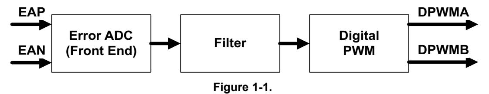

<span id="page-30-0"></span>The Error ADC (in the Front End) accepts a differential voltage signal as an input. It measures the difference between this input and a digitally controlled reference voltage and generates a digital error output. It passes this digital error information to the Filter. The Error ADC (or EADC) is a specialized high speed, high resolution ADC with a small dynamic range, optimized for power supply error measurement.

The Filter takes the error signal and passes it through a PID based digital filter which compensates for the characteristics of the external loop. This filter can be dynamically reprogrammed for changing power load source, and circuit characteristics. It also offers non-linear response capability for better handling of transients.


The output of the compensator is passed to a Digital PWM (DPWM) generator. The DPWM has two outputs, which can be used in many different ways. There are modes for synchronous rectification, multiple phases, various bridge topologies, and LLC configurations. In addition to the 2 DPWM outputs, the DPWM has other signals which are used externally and internally. These include:

- Frame start start of a switching cycle
- Sample Trigger signals Front end to take a sample
- Sync out signals another DPWM to start a frame
- Sync in a signal to this DPWM to start a frame
- Fault signals signal the DPWM to take various fault actions

These signals will be covered in much more detail in [Chapter](#page-32-0) 2.

The peripherals can be run tied together as shown above, or they can be used in different groupings and interconnections, not shown in the picture above. For example, the DPWM can be used to trigger the Error ADC, which will trigger the Filter at the end of its conversion.

The UCD3138 device supports multiple sets of the Digital Power Peripherals affording the ability to control upto 3 feedback loops (voltage or current) and drive 8 outputs simultaneously. To inter-connect all the DPPs, there is a large module called the Loop Mux. This permits a high degree of flexibility in DPP configuration. Any Front End can be connected to any Filter, and any Filter output can be connected to any DPWM. Additionally, information can be passed between the peripherals. For example, the output of one Filter (eg. controlling a slow Voltage loop), can contribute to the reference of another Front End (eg. monitoring a fast current loop) and enable implementation of nested loops (such as in Average Current mode control).

In addition, the DPPs in UCD3138 provide other modules and functions for power supply and control. These include:

- Fault Handling
- Cycle by Cycle Current Limit
- Constant Power/Constant Current
- Ramp up/Ramp Down
- Peak Current Mode control and so on.

There is also a module called Fault Mux which connects fault detection circuitry outputs to control inputs, primarily on the DPWMs, to customize fault handling and recovery.

This documentation provides information about the DPP modules in UCD3138, starting with a detailed description, continuing with some configuration examples, and ending with a reference section which lists each bit field in each DPP module.

<span id="page-32-0"></span>

# *Digital Pulse Width Modulator (DPWM)*

The DPWM Module is probably the most complex and central of the DPPs. It takes the output of the Filter and converts it into the correct PWM output for many power supply topologies. Each DPWM module has two output pins – DPWMxA and DPWMxB (x=0, 1, 2 & 3). The DPWM provides for programmable dead times and cycle adjustments for current balancing between phases. It controls the triggering of the EADC. It can synchronize to other DPWMs or to external sources. Alternately, it can provide synchronization information to other DPWMs or to external recipients. The DPWM can also be synchronized to external devices using the SYNC pin as either an input or an output. In addition, it interfaces to several fault detection circuits. The response to these faults is part of the DPWM function.


| Торіс |                                                   | Pag       |
|-------|---------------------------------------------------|-----------|
| 2.1   | DPWM Block Diagram                                | 35        |
| 2.2   | Introduction to DPWM (DPWM Multi-Mode, Open Loop) | 37        |
| 2.3   | DPWM Normal Mode                                  | 39        |
| 2.4   | DPWM Phase Shift Mode                             | 41        |
| 2.5   | DPWM Multiple Output Mode (Multi Mode)            | 42        |
| 2.6   | DPWM Resonant Mode                                | 43        |
| 2.7   | Triangular Mode                                   | 45        |
| 2.8   | DPWM Leading Edge Mode                            | 46        |
| 2.9   | Sync FET Ramp and IDE Calculation                 | 47        |
| 2.10  | Automatic Mode Switching                          | 48        |
| 2.11  | DPWMC, Edge Generation, IntraMax                  | <b>50</b> |
| 2.12  | Time Resolution of Various DPWM Registers         | <b>51</b> |
| 2.13  | PWM Counter and Clocks                            | <b>53</b> |
| 2.14  | DPWM Registers - Overview                         | <b>53</b> |
| 2.15  | DPWM Control Register 0 (DPWMCTRL0)               | <b>53</b> |
| 2.16  | DPWM Control Register 1                           | <b>59</b> |
| 2.17  | DPWM Control Register 2                           | <b>62</b> |
| 2.18  | Period and Event Registers                        | 64        |
| 2.19  | Phase Trigger Registers                           | 64        |
| 2.20  | Cycle Adjust Registers                            | 64        |
| 2.21  | Resonant Duty Register                            | 64        |
| 2.22  | DPWM Fault Control Register                       | 64        |
| 2.23  | DPWM Overflow Register                            | 64        |
| 2.24  | DPWM Interrupt Register                           | <b>65</b> |
| 2.25  | DPWM Counter Preset Register                      | <b>65</b> |
| 2.26  | Blanking Registers                                | 65        |
| 2.27  | DPWM Adaptive Sample Register                     | 66        |
| 2.28  | DPWM Fault Status Register                        | 66        |
| 2.29  | DPWM Auto Switch Registers                        | 66        |
| 2.30  | DPWM Edge PWM Generation Register                 | 66        |
| 2.31  | DPWM 0-3 Registers Reference                      | 66        |
|       |                                                   |           |


[www.ti.com](http://www.ti.com) *DPWM Block Diagram*

# <span id="page-34-0"></span>**2.1 DPWM Block Diagram**

The picture below illustrates an overall view of a single DPWM block, which is composed of many different individual modules, through which the signals propagate:

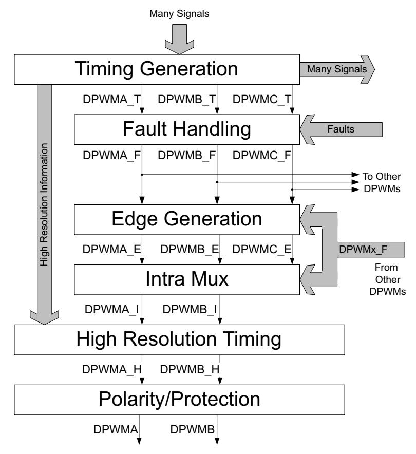

**Figure 2-1. Block Diagram of a DPWM Module**

- <span id="page-34-1"></span>• The Timing Generation Module outputs 3 DPWM signals (DPWMx\_T, x=A, B, C), as well as many other signals for other modules. It is the section where the filter output is translated into pulse widths and sometimes into the period.
- The Fault Handling Module is next. It shuts off the DPWM signals if a fault occurs. After the DPWM signals come from the Fault Module (DPWMx\_F, x=A, B, C), they are sent to other DPWM Modules.
- The Edge Generation and Intra Mux modules can combine signals from several DPWMs to generate new signals (DWMx\_E, DPWMx\_I, x=A, B, C).

The notation of DPWMx\_T, DPWMx\_F (where x=A, B, C) etc is very useful here to understand the origin and relationship between the signals. For example DPWM2A\_F may have no relationship at all to DPWM2A\_I.

Many topologies use neither the DPWMC signal nor Edge Generation and Intra Mux modules. The default is for these modules to just pass signals through unchanged. However certain topologies such as Phase Shifted Full Bridge (PSFB) use both modules as well as DPWMC signal.

These diagrams merely illustrate the signal propagation through the various modules in the DPWM and do not show the configuration logic which controls how each module works and which can dynamically reconfigure the DPWM between switching cycles.

[Figure](#page-35-0) 2-2 shows a block diagram of just the Timing Module illustrating the data, signals and main elements involved (once again, the real logic of the Timing Module is not illustrated here).


*DPWM Block Diagram* [www.ti.com](http://www.ti.com)

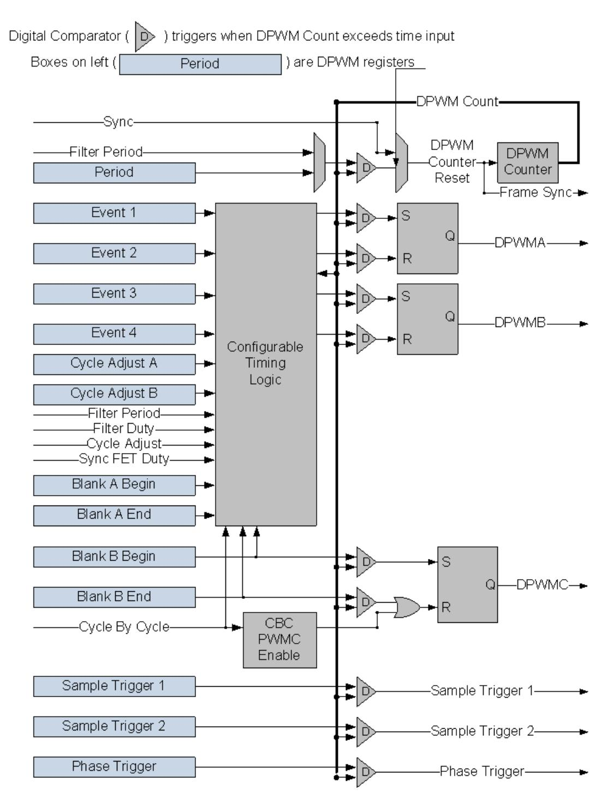

<span id="page-35-0"></span>**Figure 2-2. Block Diagram of Timing Module in the DPWM module**


# <span id="page-36-0"></span>**2.2 Introduction to DPWM (DPWM Multi-Mode, Open Loop)**

The DPWM is based on a DPWM counter, which counts up from 0 to a period value, and then is reset and starts over again. The counter can also be reset by a sync signal, either from the SYNC pin, or from another DPWM.

The DPWM logic causes transitions in many digital signals when the period counter hits the target value for that signal. In the Timing Module block diagram shown above, this is functionality is represented by a digital comparator.

The DPWM has a basic 250 MHz clock, giving a resolution of 4 nanoseconds. 15 other 250 MHz clocks are generated spaced 250 picoseconds apart. Output pulse widths and pulse spacing are controlled by these clocks, giving a resolution of 250 picoseconds. The edges generated by these clocks are hence referred to as "High Resolution" in the illustrations throughout this section.

Most of the signals out of the DPWM are fairly simple. The only complex signals are DPWMA and DPWMB. These vary depending upon the power supply topology and are the most important signals coming out of the DPWM.

The DPWM has many modes to support different topologies. These are selected by a mode bit field in a DPWM control register. The "Multi mode, Open loop" mode is used to introduce the DPWM here, while the other DPWM modes are described in subsequent sections.

[Figure](#page-37-0) 2-3 illustrates most of the signals involved in the DPWM in a mode known as "Multi mode, Open loop". Open loop means that the DPWM is controlled entirely by its own registers, not by the filter output. In other words, the power supply control loop is not closed. This mode is used for introducing the DPWM because there is a very simple correlation between DPWM register values and signal timing.


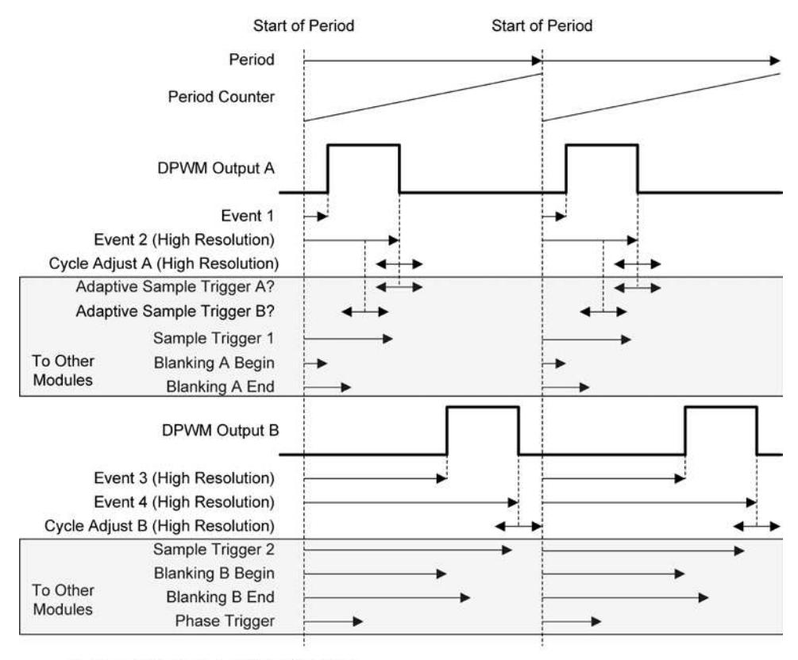

**Figure 2-3. DPWM Mode - Multi-mode, Open Loop**

<span id="page-37-0"></span>The Sample Trigger signals are used to trigger the Front End to sample input signals. The Blanking signals are used to blank fault measurements during noisy events, such as FET turn on and turn off. This prevents false detection of faults caused by noise. They only affect the Cycle By Cycle (CBC) module. Other faults are not blanked.

Note that Sample Trigger 1 and 2, Blanking A and B, and Phase Trigger are shown at logical locations for this specific mode, but they can be placed anywhere within the period.


[www.ti.com](http://www.ti.com) *DPWM Normal Mode*

# <span id="page-38-0"></span>**2.3 DPWM Normal Mode**

Note that Sample Trigger 1 and 2, Blanking A and B, and Phase Trigger are shown at logical locations for this specific mode, but they can be placed anywhere within the period.


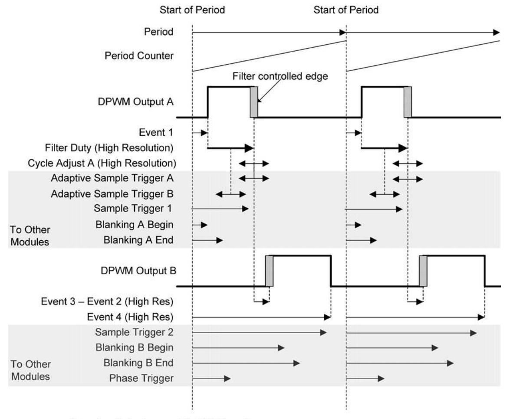

<span id="page-38-1"></span>

**Figure 2-4. DPWM - Normal Mode**


*DPWM Normal Mode* [www.ti.com](http://www.ti.com)

Cycle Adjust A can be used to adjust pulse widths on individual phases of a multi-phase system. This can be used if current balancing is necessary, for example. The Adaptive Sample Triggers can be used to sample in the middle of the on-time (Adaptive Sample Trigger B - for an average output during on-time), or at the end of the on-time (Adaptive Sample Trigger A - to minimize phase delay). The Adaptive Sample Register provides an offset from the center or end of the on-time for DPWM signal from the chip. This can compensate for external delays, such as FET and gate driver turn-on times.

The Blanking signals are used to disable the CBC fault signal during noise. Generally the noise is caused by DPWM edges. The Blanking registers hold fixed values, so they are easiest to use with fixed edges, rather than with edges that change dynamically. So in this case, the rising edge of DPWM A and the falling edge of DPWM B are easy to provide blanking for. In this mode, both blanking times act on the falling edge of A, since this is what the Cycle By Cycle logic works on.

Cycle Adjust B has no effect in Normal Mode.

#### **CAUTION**

In Normal Mode, the DPWM calculated rising edge of DPWMB must not be permitted to exceed DPWM Event 4. This can be done either with a clamp on the filter output, or by using an appropriate KCOMP value in the filter output multiply operation. If this is not done, the DPWMB on time may overlap the DPWMA on time, causing shoot through


[www.ti.com](http://www.ti.com) *DPWM Phase Shift Mode*

# <span id="page-40-0"></span>**2.4 DPWM Phase Shift Mode**

In most modes, it is possible to synchronize multiple DPWM modules using the phase shift signal. The phase shift signal has two possible sources. It can come from the Phase Shift Register or from the Filter Duty value.

The Phase Shift Register provides a fixed value, which is useful in simple multiphase systems such as interleaved PFC.

When the Filter Duty is the source, the changes in the filter output cause changes in the phase relationship of two DPWM modules. This is useful for phase shifted full bridge topologies if voltage mode control is desired rather than peak current mode.

[Figure](#page-40-1) 2-5 shows the mechanism of phase shift:


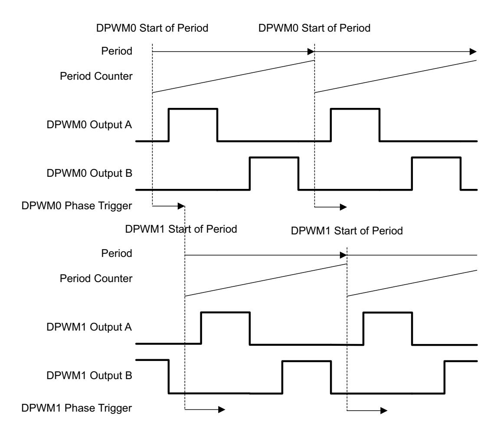

<span id="page-40-1"></span>Phase Trigger = Phase Trigger Register value or Filter Duty

**Figure 2-5. DPWM - Phase Shift Mode**


# <span id="page-41-0"></span>**2.5 DPWM Multiple Output Mode (Multi Mode)**

Multi Mode is used for systems where each phase has only one driver signal requirement. In this mode, each DPWM peripheral can drive two phases with the same pulse width, but with a time offset between the phases, and with different cycle adjusts for each phase.

Here is a diagram for Multi mode:

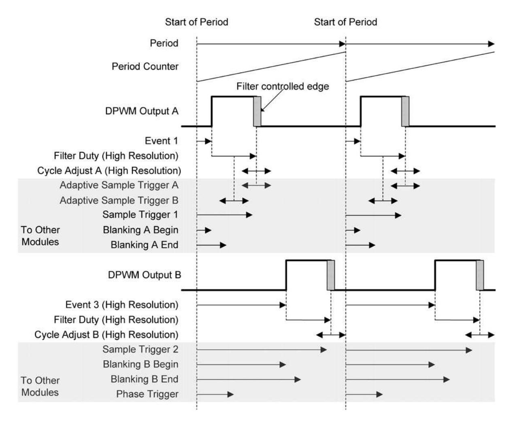

<span id="page-41-1"></span>

**Figure 2-6. DPWM – Multiple Output Mode (Multi Mode)**


[www.ti.com](http://www.ti.com) *DPWM Resonant Mode*

Event 2 and Event 4 are not relevant in Multi mode.

As shown in the illustration, DPWMA is designed to turn on close to the start of the period. It can turn off any time until the end of the period, achieving essentially 100% on-time. DPWMB is designed to start later in the period to support a multi-phase system. Therefore DPWMB is designed to cross over the period boundary safely, so long as it does not ever move into or out of an event update window. This makes 100% pulse width operation possible for DPWMB as well.

Since the rising edge on DPWMB is also fixed, Blanking B Begin and End can be used for blanking this rising edge. In this mode, Blanking A works only on the falling edge of A, and Blanking B works only on the falling edge of B.

And, of course, Cycle Adjust B is usable on DPWM B.

There is no restriction preventing the two signals from overlapping each other. The diagram shows the two signals 180 degrees out of phase, but this is not required. They could be 90 degrees, 60 degrees or whatever offset is desired.

# <span id="page-42-0"></span>**2.6 DPWM Resonant Mode**

The resonant mode operation depends on the status of the RESON\_DEADTIME\_COMP\_EN bit. Setting the RESON\_DEADTIME\_COMP\_EN bit provides for a symmetrical waveform where DPWMA and DPWMB have the same pulse width. As the switching frequency changes, the dead times between the pulses remain the same. This mode is ideal for the LLC topology.

Clearing the RESON\_DEADTIME\_COMP\_EN bit provides a mode where the pulse widths are the same and the duty cycle percentage is constant as the period changes. This means that as the frequency increases, the dead times shrink proportionally.

The equations for this mode are designed for a smooth transition from PWM mode to Resonant mode, as described in [Section](#page-47-1) 2.10.1. Here is a diagram of this mode:


*DPWM Resonant Mode* [www.ti.com](http://www.ti.com)

#### Resonant Symmetrical Closed Loop

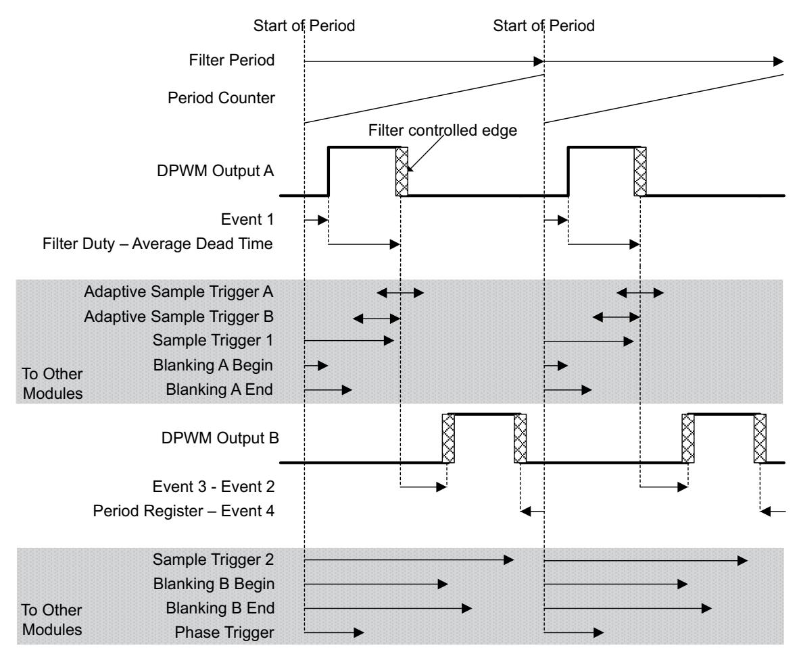

Events which change with DPWM mode:

Dead Time 1 = Event 3 – Event 2

Dead Time 2 = Event 1 + Period Register – Event 4)

Average Dead Time = (Dead Time 1 + Dead Time 2)/2

DPWM A Rising Edge = Event 1

DPWM A Falling Edge = Event 1 + Filter Duty – Average Dead Time

Adaptive Sample Trigger A = Event 1 + Filter Duty + Adaptive Sample Register

Adaptive Sample Trigger B = Event 1 + Filter Duty/2 + Adaptive Sample Register

DPWM B Rising Edge = Event 1 + Filter Duty – Average Dead Time + (Event 3 – Event 2)

DPWM B Falling Edge = Filter Period – (Period Register – Event 4)

Phase Trigger = Phase Trigger Register value or Filter Duty

Events always set by their registers, regardless of mode:

<span id="page-43-0"></span>Sample Trigger 1, Sample Trigger 2, Blanking A Begin, Blanking A End, Blanking B Begin, Blanking B End

**Figure 2-7. DPWM – Resonant Mode**


[www.ti.com](http://www.ti.com) *Triangular Mode*

As seen later, the Filter module has two outputs, Filter Duty and Filter Period. In the Resonant mode, the Filter is configured so that the Filter Period is twice the Filter Duty. With zero dead times, each DPWM pin would be On for half of the period. For dead time handling, the average of the two dead times is subtracted from the Filter Duty for both DPWM pins. Therefore both pins will have the same on-time, and the dead times will be fixed regardless of the period. The only edge which is fixed relative to the start of the period is the rising edge of DPWM A. Blanking A and Blanking B both work only on DPWMA.

# <span id="page-44-0"></span>**2.7 Triangular Mode**

Triangular mode provides a very stable phase shift in interleaved PFC and similar topologies. In this case, the PWM pulse is centered in the middle of the period, rather than starting at one end or the other. In Triangular Mode, only DPWM B is available. Here is a diagram for Triangular Mode:

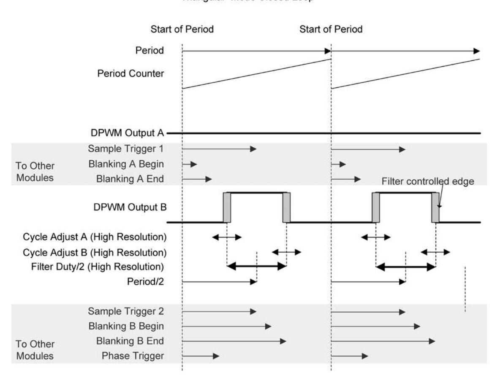

**Figure 2-8. DPWM – Triangular Mode**


All edges are dynamic in triangular mode, so fixed blanking is not that useful. The adaptive sample trigger is not needed. It is very easy to put a fixed sample trigger exactly in the center of the On-time, because the center of the on-time does not move in this mode. Both Blanking A and Blanking B are applied to DPWMB.

# <span id="page-45-0"></span>**2.8 DPWM Leading Edge Mode**

Leading edge mode is very similar to Normal mode, reversed in time. The DPWM A falling edge is fixed, and the rising edge moves to the left, or backwards in time, as the filter output increases. The DPWMB falling edge stays ahead of the DPWMA rising edge by a fixed dead time. Here is a diagram of the Leading Edge Mode:

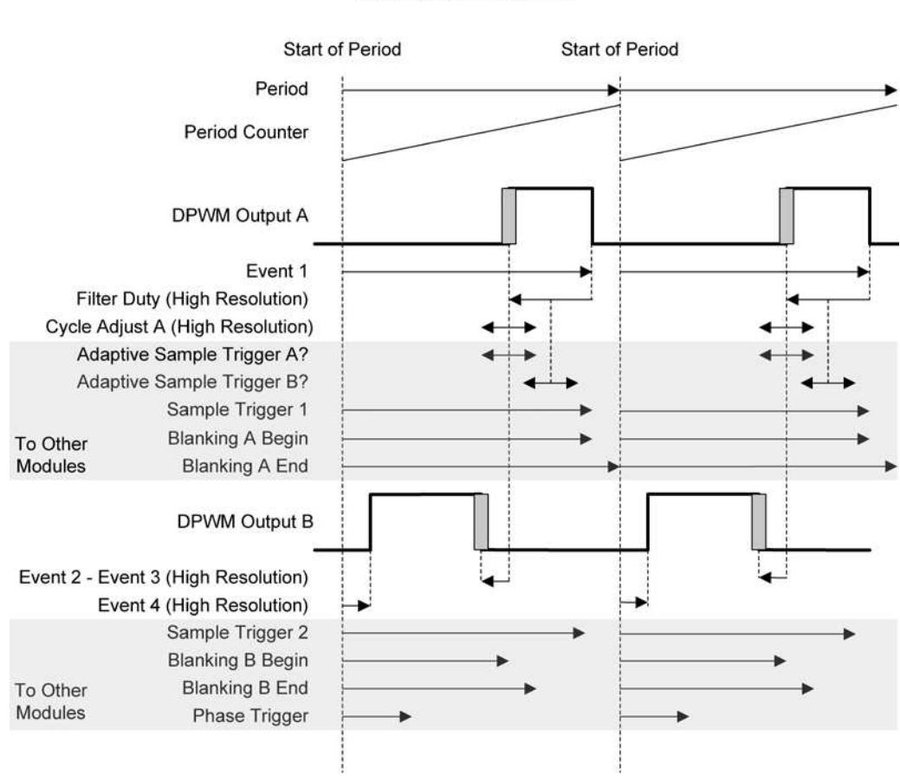

<span id="page-45-1"></span>

**Figure 2-9. DPWM – Leading Edge Mode**


As in the Normal mode, the two edges in the middle of the period are dynamic, so the fixed blanking intervals are mainly useful for the edges at the beginning and end of the period.

# <span id="page-46-0"></span>2.9 Sync FET Ramp and IDE Calculation

For many topologies, it is useful to replace diodes with synchronous rectification (SR), a concept also known as Ideal Diode Emulation (IDE). In continuous conduction mode, the SR FET control is simple, because it can be turned on for the entire off time of the primary FET, minus a dead time. This is handled perfectly by Normal mode. The Sync FET Ramp and IDE calculation are only available in Normal mode. They are not compatible with the Cycle by Cycle Fault module.

However, in discontinuous mode, the SR FET needs to be turned off before the end of the period. The UCD3138 hardware provides an automatic function to make this easier. In this case, the falling edge of DPWMB is adjusted, as shown below:

Normal Mode with Sync FET IDE and/or Ramp


Sync FET edge on DPWM B controlled by Ramp logic and/or Integrated Diode equation Stays within dead time limits for Normal Mode

Figure 2-10. SyncFET IDE (Normal Mode)

<span id="page-46-1"></span>The digital hardware implements the equation  $D_b = D_a * K_d$ . The firmware measures Vin and Vout and calculates Kd. For example, for a Buck topology,  $K_d = (V_{in} - V_{out})/V_{out}$ , where  $D_a$  is duty cycle of the control FET,  $D_b$  is duty cycle of SR FET,  $V_{in}$  is input voltage and  $V_{out}$  is output voltage. The firmware periodically measures the slowly changing  $V_{in}$  and  $V_{out}$ , and puts the calculated result into the  $K_d$  register. The DPWM hardware adjusts  $D_b$  every switching cycle, maintaining proper IDE even during transients which cause rapid changes in  $D_a$ .

When starting up in prebias mode i.e. with a voltage already present on the outputs, it is difficult to accomplish precise diode emulation (IDE). One solution to this issue is to ramp the voltage up to the target without synchronous rectification (SR), and then to activate SR after the voltage is regulated. When activating or de-activating SR, in order to avoid glitches in the regulated voltage, it is best to gradually increase/decrease the Sync FET on-time. The UCD3138 provides what is termed as <a href="Sync FET Soft-On/Soft-Off">Sync FET Soft-On/Soft-Off</a> (ramp) logic to accomplish this. This is documented in Section 3.3.8. The Ramp module in the Front End is used for this function. It will ramp up to either the limits imposed by normal mode, or to the limits imposed by the IDE logic.

With digital IDE enabled, as the system transitions from discontinuous mode into continuous conduction Mode (sync FET is on until end of the period) the IDE will stop reducing the Sync FET pulse width. This is because the reverse conduction through the Sync FET will keep Da and Db the same. It is necessary to detect DCM (Discontinuous Conduction Mode) current levels in the IDE approach. Once these levels are detected, the Sync FET should be ramped down, and then ramped back up with IDE enabled.


# <span id="page-47-0"></span>2.10 Automatic Mode Switching

Automatic Mode switching enables the DPWM module to switch between modes automatically, with no firmware intervention. This is useful to increase efficiency and power range and also to achieve smooth system performance (such as monotonic start-up) in certain topologies. An example of mode switching in LLC topology is provided next.

# <span id="page-47-1"></span>2.10.1 Resonant LLC Example

In Resonant LLC topology, three modes are used. At the lowest power, a pulse width modulated mode (Multi Mode) is used. As power increases and frequency decreases, Resonant mode is used. As the frequency gets still lower, resonant mode is still used, however the Sync FET driver changes so that the on-time is fixed and does not increase (SR Pulse Width is clamped). Here are the waveforms for the LLC:

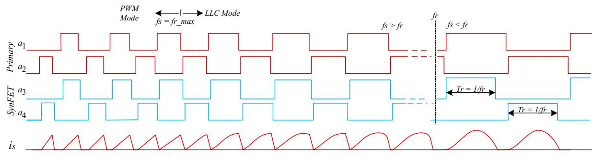

Figure 2-11. Resonant LLC implementation in UCD3138 with Automatic Mode Switching

# <span id="page-47-3"></span><span id="page-47-2"></span>2.10.2 Mechanism for Automatic Mode Switching

Many of the configuration parameters for the DPWM, including the mode, are in DPWM Control Register 1. For automatic mode switching, some of these parameters are duplicated in the Auto Config Mid and Auto Config High registers.

If automatic mode switching is enabled, the Filter Duty signal is used to select which of these three registers is used. There are 4 registers which are used to select the points at which the mode switching takes place. They are used as shown below:


#### Automatic Mode Switching With Hysteresis

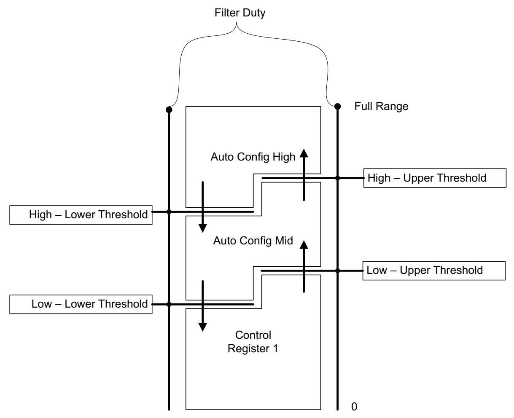

**Figure 2-12. Mechanism for Automatic Mode Switching in UCD3138**

<span id="page-48-0"></span>As shown, the registers are used in pairs for hysteresis. The transition from Control Register 1 to Auto Config Mid only takes place when the Filter Duty goes above the Low Upper threshold. It does not go back to Control Register 1 until the Low Lower Threshold is passed. This prevents oscillation between modes if the filter duty is close to a mode switching point. In some applications it is necessary to make the values the same, disabling hysteresis. This has to be done to make the DPWM signals from the two modes match properly at the mode switching point.


# <span id="page-49-0"></span>**2.11 DPWMC, Edge Generation, IntraMax**

The UCD3138 has sophisticated hardware for generating complex waveforms beyond the simple DPWMA and DPWMB waveforms already discussed. The DPWMC, the Edge Generation Module, and the IntraMux play a key role in delivering this capability.

DPWMC is a signal inside the DPWM logic. It goes high at the Blanking B begin time, and low at the Blanking B end time.

The Edge Gen module takes DPWMA and DPWMB from its own DPWM module, and the next one, and uses them to generate edges for two outputs. For DPWM3, the DPWM0 is considered to be the next DPWM. Each edge (rising and falling for DPWMA and DPWMB) has 8 options which can cause it. The options are:

- 0 = DPWM(n) A Rising edge
- 1 = DPWM(n) A Falling edge
- 2 = DPWM(n) B Rising edge
- 3 = DPWM(n) B Falling edge
- 4 = DPWM(n+1) A Rising edge
- 5 = DPWM(n+1) A Falling edge
- 6 = DPWM(n+1) B Rising edge
- 7 = DPWM(n+1) B Falling edge

The Edge Gen is controlled by the DPWMEDGEGEN register. It also has an enable/disable bit.

The IntraMux is controlled by the Auto Config registers. The IntraMux takes signals from multiple DPWMs and from the Edge Gen. It can be programmed to route these signals to the DPWMA and DPWMB outputs. This is useful for complex topologies like Phase Shifted Full Bridge, especially when they are controlled with automatic mode switching. It is disabled by setting the Intramux to Pass Through mode for each of the DPWM signals, A and B. If the Intra Mux is enabled, high resolution must be disabled.

Here is a drawing of the Edge Gen/Intra Mux:

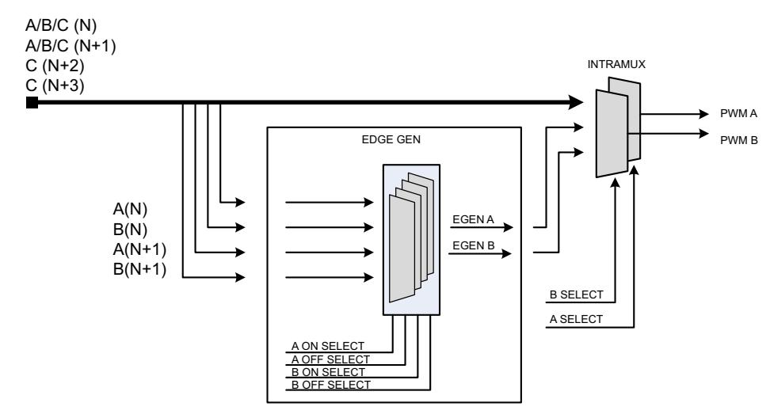

<span id="page-49-1"></span>**Figure 2-13. UCD3138 Edge-Gen & Intra-Mux**


Here is a list of the IntraMux modes for DPWMA:

- 0 = DPWMA(n) pass through (default)
- 1 = Edge-gen output, DPWMA(n)
- 2 = DPWNC(n)
- 3 = DPWMB(n) (Crossover)
- 4 = DPWMA(n+1)
- 5 = DPWMB(n+1)
- 6 = DPWMC(n+1)
- 7 = DPWMC(n+2)
- 8 = DPWMC(n+3)

Here is a list of the IntraMux modes for DPWMB:

- 0 = DPWMB(n) pass through (default)
- 1 = Edge-gen output, DPWMB(n)
- 2 = DPWNC(n)
- 3 = DPWMA(n) (Crossover)
- 4 = DPWMA(n+1)
- 5 = DPWMB(n+1)
- 6 = DPWMC(n+1)
- 7 = DPWMC(n+2)
- 8 = DPWMC(n+3)

The DPWM number wraps around just like the Edge Gen unit. For DPWM4, DPWM(n+1) is DPWM0, DPWM(n+2) is DPWM1, and so on.

Note that the Fault logic affects the Fault module, which is before the Edge Gen and IntraMux units (refer to [Figure](#page-34-1) 2-1). The effect of a fault must be calculated taking into account the impact of the Edge Gen and IntraMux units.

Also the GPIO\_A\_EN & GPIO\_B\_EN bits inside the DPWMCTRL1 register affect the signal state before the IntraMux unit. So if these bits are meant to be used to turn the DPWM output off, the bits in the original DPWM are supposed to be altered. And not the bits in the DPWM module that the outputs are redirected through.

### <span id="page-50-0"></span>**2.12 Time Resolution of Various DPWM Registers**

Different registers in the DPWM block have different time resolutions. Pulse widths are generally adjustable in nominal 250 picosecond steps, while period and phase shift are adjustable in 4 nanosecond steps. The sample trigger is adjustable in 16 nanosecond steps.

**Table 2-1. DPWM Register Time Resolutions in UCD3138**

<span id="page-50-1"></span>

| Register                                                                                                                                                      | Resolution | Number of Bits | Bit Alignment |
|---------------------------------------------------------------------------------------------------------------------------------------------------------------|------------|----------------|---------------|
| Phase Trigger,<br>Period,<br>Event1,<br>Blanking A and B Begin<br>Blanking A and B End<br>Minimum Duty Cycle Low<br>Minimum Duty Cycle High<br>Counter Preset | 4 ns.      | 14             | Standard      |
| Sample Trigger 1 and 2                                                                                                                                        | 16 ns      | 12             | Standard      |
| Event2,3,4                                                                                                                                                    | 250 ps     | 18             | Standard      |
| Cycle Adjust A and B                                                                                                                                          | 250 ps     | 16 (signed)    | Standard      |
| Adaptive Sample                                                                                                                                               | 16 ns      | 12 (signed)    | 16 ns LSbit   |


**Table 2-1. DPWM Register Time Resolutions in UCD3138 (continued)**

| Register      | Resolution | Number of Bits                  | Bit Alignment |
|---------------|------------|---------------------------------|---------------|
| Resonant Duty | 4 ns.      | 16 (signed) or<br>14 (unsigned) | 4 ns LSbit    |

On the UCD3138, all these registers are aligned so that their bit fields match the scaling, except for the Resonant Duty and Adaptive Sample register. All the registers are unsigned, except for the 2 adjust registers, Resonant Duty and Adaptive Sample register, which are signed to permit positive or negative adjustment.

The Resonant Duty register is used in the UCD3138 LLC reference firmware (implemented in UCD3138LLCEVM-028 EVM) as a 14 bit unsigned register. It can also be used as a 16 bit signed register. See [Section](#page-63-4) 2.21.

<span id="page-51-0"></span>This means that the Phase Trigger, Period, and Event1 registers ignore the 4 least significant bits, as shown below:

**Table 2-2. DPWM Period Register (DPWMPRD) All other 4 ns registers with standard alignment are the same.**

| Bit Number | 17:4              | 3:0      |
|------------|-------------------|----------|
| Bit Name   | PRD               | RESERVED |
| Access     | R/W               | -        |
| Default    | 00_0011_0100_0001 | 0000     |

<span id="page-51-1"></span>The Sample Trigger registers ignore the 6 least significant bits, as shown here:

**Table 2-3. DPWM Sample Trigger 1 Register (DPWMSAMPTRIG1)**

| Bit Number | 17:6           | 5:0      |
|------------|----------------|----------|
| Bit Name   | SAMPLE_TRIGGER | RESERVED |
| Access     | R/W            | -        |
| Default    | 0000_0010_0000 | 00_0000  |

Only the Event 2, 3, and 4 registers use all 18 bits of the field, as shown below.

**Table 2-4. DPWM Event 2 Register (DPWMEV2) Event 3 and 4 are the same, Cycle Adjust registers only go to bit 15**

| Bit Number | 17:0                   |
|------------|------------------------|
| Bit Name   | EVENT2                 |
| Access     | R/W                    |
| Default    | 00_0000_0001_0110_0011 |

This means that in all these registers, each bit has the same weight in terms of time. This makes configuration simpler, since all register loads can use the same time base.

To use this feature, use the .all extension on the register structure. The bit fields do not include the ignored bits.

All of these C statements put 10 microseconds into the respective registers. Note that the "Low" resolution clock is at 4 nanoseconds, and "High" resolution is at 250 picoseconds So the corresponding numbers for the registers are 2,500 and 40,000 respectively.

```
Dpwm0Regs.DPWMPRD.all = 40000; //includes 4 unused least significant bits
Dpwm0Regs.DPWMPRD.bit.PRD = 2500; //only puts in PRD bit field = 40000/16
Dpwm0Regs.DPWMEV1.all = 40000; //includes 4 unused bits
Dpwm0Regs.DPWMEV1.bit.EVENT1 = 2500; //EV1 is the only low resolution event register
Dpwm0Regs.DPWMEV2.all = 40000; //EV2 is high resolution, so
```


[www.ti.com](http://www.ti.com) *PWM Counter and Clocks*

```
Dpwm0Regs.DPWMEV2.bit.EVENT2 = 40000; //both forms are the same
Dpwm0Regs.DPWMSAMPTRIG1.all = 40000; //includes 6 unused lsbs
Dpwm0Regs.DPWMSAMPTRIG1.bit.SAMPLE_TRIGGER = 625;
//needs to be divided by 64 for 6 bits
```

The adaptive sample and resonant duty registers do not follow the standard bit alignment. Their least significant bits are worth 16 nanoseconds and 4 nanoseconds respectively.

# <span id="page-52-0"></span>**2.13 PWM Counter and Clocks**

The PWM counter is the center of the DPWM logic. There is no register that can be read to give the value of the PWM counter, but most events are triggered by it. In all modes it is allowed to count up to the period value, and then restarted at zero. Since it restarts at zero, the period is technically equal to PERIOD + 1. So in the example above, the number should really be 2499. Generally the error is unimportant. In all modes but the resonant modes, the period is a fixed value. In the resonant modes, the period comes from the output of a Filter.

The PWM counter is also restarted by the receipt of a sync signal (if sync is enabled), as shown above in [Section](#page-40-0) 2.4.

Sync signals received exactly at the end of the period run very smoothly. Sync signals received at other times during the period will restart the counter and the period. The effects of this should be taken into consideration for each application.

Even though the period register has only 14 bits, the PWM counter effectively has 18 bits. Each 4 nanosecond period is subdivided into 16 intervals, nominally 250 picoseconds long. The extra 4 bits representing these intervals are called "high resolution bits".

# <span id="page-52-1"></span>**2.14 DPWM Registers - Overview**

This section discusses each DPWM register, with examples of their use where appropriate. In addition, it interacts with many other peripherals, parts of which are also described below.

### **2.15 DPWM Control Register 0 (DPWMCTRL0)**

The DPWM Control Register 0 is one of 3 DPWM control registers which configure the DPWM. All 3 registers control a variety of DPWM functions. It is not possible to draw a clear dividing line between the 3 registers.

#### <span id="page-52-2"></span>*2.15.1 DPWM Auto Config Mid and Max Registers*

There are two other registers – DPWMAUTOMAX and DPWMAUTOMID, which have many of the same bits as control register 0.

These two Auto Mode Switching (AMS) registers are used in topologies where the DPWM mode changes automatically as the filter output changes, such as resonant and phase shifted full bridge. See [Section](#page-47-2) 2.10.2 on the auto switch level registers for more information on mode switching.

Not all bits in DPWMCTRL0 are duplicated in the auto registers. The bits that occur only in DPWMCTRL0 are used for all modes. Bits were selected based on mode switching needs for LLC and PSFB topologies. The following bitfield descriptions tell whether each field occurs in the auto mode switching registers.

# <span id="page-52-3"></span>*2.15.2 Intra Mux*

The Intra Mux bit fields, PWM\_A\_INTRA\_MUX, and PWM\_B\_INTRA\_MUX, enable signals from different sources to be multiplexed into the 2 DPWM outputs, A and B. This functionality is used in full and half bridge topologies. The default value for this bit field, 0, causes normal functionality, with the standard DPWM waveforms as described in the mode descriptions above section to appear on the DPWMA and DPWMB pins. For details of the Intra Mux, see [Section](#page-49-0) 2.11.

These fields also occur in the AMS registers.


# <span id="page-53-0"></span>*2.15.3 Cycle by Cycle Current Limit Enable*

There are several enable bits related to cycle by cycle current limit:

DPWMCTRL0 contains:

CBC\_PWM\_C\_EN

CBC\_PWM\_AB\_EN

CBC\_ADV\_CNT\_EN

CBC\_SYNC\_CUR\_LIMIT\_EN

CBC\_BSIDE\_ACTIVE\_EN

All of these bits, except for CBC\_BSIDE\_ACTIVE\_EN also occur in the AMS registers.

The first two, CBC\_PWM\_C\_EN and CBC\_PWM\_AB\_EN simply enable cycle by cycle current limit for their respective signals. In all modes, CBC\_PWM\_EN has an independent effect on DPWMC.

The other bits have no effect on DPWMC The other three bits have different effects in different modes. Here are the effects:

# **Normal Mode**

In normal mode, a CBC event will cause DPWMA to go low before the time dictated by the CLA. The dead time for DPWMB will be preserved, so the rising edge of DPWMB will be moved forward by the same amount as the falling edge of DPWMA.

There are only two options for setting the CBC bits in normal mode:

- 1. All cleared, no CBC.
- 2. Set both CBC\_PWM\_AB\_EN and CBC\_ADV\_CNT\_EN to get CBC

CBC\_BSIDE\_ACTIVE\_EN has no effect. Normal mode has some support for negative dead times, as does the CBC logic. Even negative dead times will be preserved. As seen in [Figure](#page-54-0) 2-14, if there is a negative dead time, the minimum pulse width on DPWMA will be equivalent to the dead time. To preserve a negative dead time, the CBC will trigger a rising edge on DPWMB. After the dead time is expired, then DPWMA will fall.

With a positive dead time, of course, DPWMA will fall with the CBC event, and DPWMB will rise after the dead time:


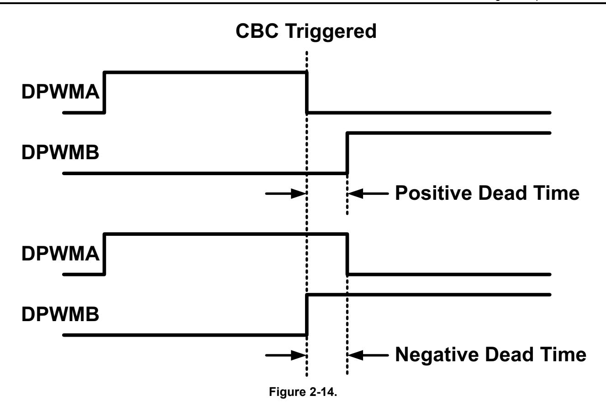

<span id="page-54-0"></span>Even if DPWMB is being used as a GPIO, it is important to program Event 3 for dead times with CBC.

#### **Resonant/Multi Mode**

In resonant/multi mode, the systems are often symmetrical. In this case, DPWMB may need to be controlled by the Cycle by Cycle Fault logic as well. Sometimes a shortened on time on one DPWM pin needs to be followed by an equal length on time on the other DPWM pin to prevent an offset from building up in a capacitor or inductor. In this case, it is possible to enable duty cycle matching in these two modes. If DPWMA or DPWMB is cut short by a CBC event, the next pulse, on the other DPWM pin, will also be shortened to the same length.

Here are the states for resonant and multi modes:

- All cleared no CBC
- Only CBC\_PWM\_AB\_EN set CBC on A and B, no duty cycle matching
- CBC\_PWM\_AB\_EN and CBC\_ADV\_CNT\_EN set, CBC\_BSIDE\_ACTIVE\_EN not set CBC on A only and B duty cycle matches to A
- All three set CBC on A and B, duty cycle matching both ways

**Table 2-5. Truth Table**

<span id="page-54-1"></span>

| CBC_PWM_AB_EN | CBC_ADV_CNT_EN | CBC_BSIDE_ACTIVE_EN | CBC A | CBC B | Duty Match  |
|---------------|----------------|---------------------|-------|-------|-------------|
| 0             | x              | x                   | 0     | 0     | 0           |
| 1             | 0              | 0                   | 1     | 1     | 0           |
| 1             | 1              | 0                   | 1     | M     | B matches A |
| 1             | 1              | 1                   | 1     | 1     | both match  |


CBC\_SYNC\_CUR\_LIM\_EN is used to control the slave sync. If this bit is set, the slave sync is advanced during current limit. This is not used in any topology configuration at this time. If this bit is set, the sync out pulse from the DPWM will occur if the CBC fault occurs. If the CBC fault does not occur during a period, the sync pulse will occur according to the normal setting of the sync control bit fields.

For more information on cycle by cycle current limit, refer to [Chapter](#page-225-0) 6.

# <span id="page-55-0"></span>*2.15.4 Multi Mode On/Off*

The MULTI\_MODE\_CLA\_A\_OFF and MULTI\_MODE\_CLA\_B\_OFF bits dictate which calculation is used for each DPWM pin in multi mode only. In other modes they should not be set. If the bit is cleared, the ontime of the DPWM pin is controlled by the Filter output. If the bit is set, then the on-time is controlled by the Event registers.

The AMS registers only have MULTI\_MODE\_CLA\_B\_OFF, they do not have MULTI\_MODE\_CLA\_A\_OFF.

# <span id="page-55-1"></span>*2.15.5 Minimum Duty Mode*

The MIN\_DUTY\_MODE bits select how the DPWM handles minimum duty cycle limits.

- 0 Default Filter output is passed directly through to the DPWM
- 1 Filter value passed through if above minimum. If below minimum, no pulse from DPWM
- 2 Filter value passed through if above minimum. If below minimum, DPWM pulse width = minimum value

There are two registers setting minimum duty and hysteresis:

DPWMMINDUTYLOW

DPWMMINDUTYHI

The Low register sets the point at which the minimum duty mode will take effect as the duty drops. In mode 2, it also sets the minimum duty.

The High register sets the point at which minimum duty mode is exited as the duty goes up.

These bits are not duplicated in the AMS registers.

These two graphs show modes 1 and 2 with PMMINDUTYLOW at 30, and DPWMMINDUTYHI at 70.


#### **Min duty mode 1 with hysteresis**

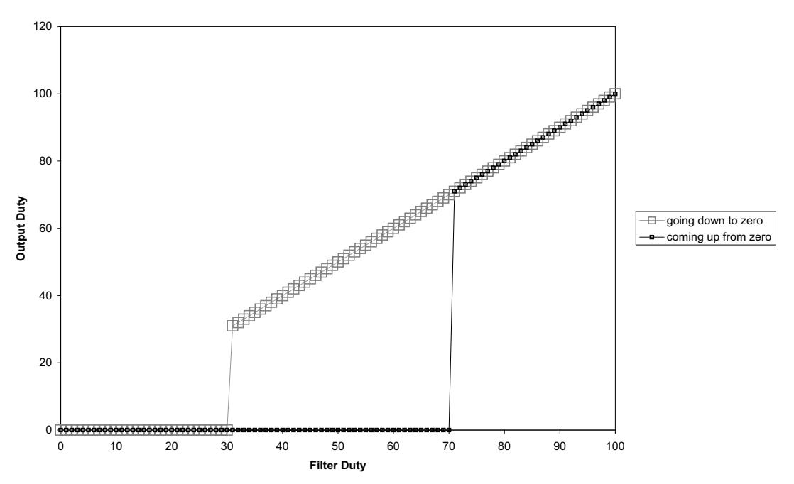

**Figure 2-15. Minimum Duty Mode 1**

#### **Min duty mode 2 with hysteresis**

<span id="page-56-0"></span>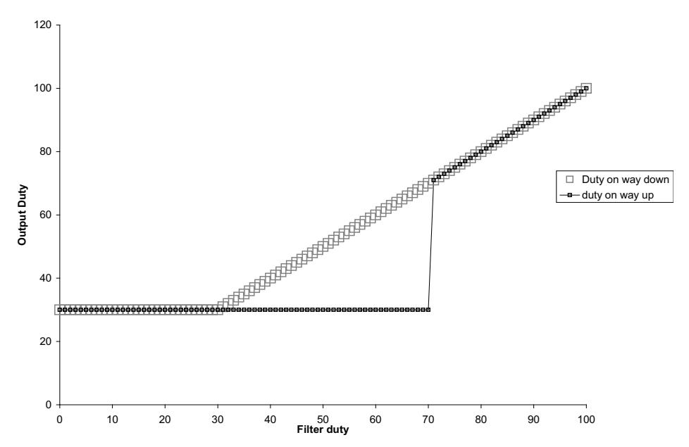

<span id="page-56-1"></span>**Figure 2-16. Minimum Duty Mode 2**


# <span id="page-57-0"></span>*2.15.6 Master Sync Control Select*

The MASTER\_SYNC\_CNTL\_SEL bit selects where the sync output of the DPWM channel comes from.

The default value, 0, causes the sync delay to come from the Phase Trigger register. This is useful for systems that have fixed intervals between phases, such as interleaved PFC and hard switching full bridge. See [Section](#page-40-0) 2.4.

Putting a 1 into this bit causes the master sync output to be controlled by the Filter output.

This bit is duplicated in the AMS registers.

# <span id="page-57-1"></span>*2.15.7 Master Sync Slave Enable*

Setting the MSYNC\_SLAVE\_EN bit enables the DPWM channel to be slaved to the sync output of another DPWM channel. This bit works together with the DPWMx\_SYNC\_SEL bits in the DPWMMUX register in [Chapter](#page-184-0) 5. The sample code below makes DPWM1 a slave to DPWM0:

```
LoopMuxRegs.DPWMMUX.bit.DPWM1_SYNC_SEL = 0; //DPWM1 is slave to DPWM0
Dpwm1Regs.DPWMCTRL0.bit.MSYNC_SLAVE_EN = 1; //enable slave mode for DPWM1
```

This bit is not duplicated in the AMS registers.

# <span id="page-57-2"></span>*2.15.8 D Enable*

Normally, the Filter Duty (D) is used to set the on-time of DPWM pins directly. In other words, OnTime = D. The D\_ENABLE bit can be used to make the OnTime = 1-D instead.

A default value (0) causes the output of the Filter to be used directly for DPWM output calculations. So in multi mode, for example, the DPWMA and B on-times would increase as the Filter Duty increases.

If the D\_ENABLE bit is set, however, the Filter Duty is subtracted from the period register. In this case, as the Filter Duty increases from zero to full range, the on-time will decrease from 100% of the period to 0% of the period.

This bit is not duplicated in the AMS registers.

# <span id="page-57-3"></span>*2.15.9 Resonant Mode Fixed Duty Enable*

The RESON\_MODE\_FIXED\_DUTY\_EN bit only controls the duty cycle width in the resonant modes. With the default (0) value, the duty cycle comes from the filter directly. This is for use above the lower resonant frequency, Fmin, and provides a duty cycle that fills half the period minus a fixed dead time.

Setting this bit causes the pulse width to be derived from the Auto Switch High Upper Threshold Register.

This bit is generally only set for LLC for the Sync FETs in the mode where the output frequency is below the lowest resonant frequency of the circuit. At this point any increases in pulse width are not beneficial, so they are stopped. There is also a waveform showing the modes in [Section](#page-47-1) 2.10.1.

This bit is duplicated in the AMS registers.

# <span id="page-57-4"></span>*2.15.10 DPWM A and B Fault Priority*

The PWM\_A\_FLT\_POL and PWM\_B\_FLT\_POL bits increase the flexibility of the DPWM by permitting arbitrary output states for the DPWM pins in case of a fault. The values in these bits will also appear on these pins when the DPWM is disabled. These values actually appear on the output of the Fault Module in the DPWM. Therefore, if the IntraMux or Edge Generation units are used, the same value may not appear on the output of the DPWM.

These bits do not affect the DPWM status after device reset. After reset, all DPWM pins are configured as outputs and actively driven low.

These bits are not duplicated in the AMS registers.


# <span id="page-58-0"></span>*2.15.11 Blank Enable*

The BLANK\_A\_EN and BLANK\_B\_EN bits are used for fault detection. They work with the blanking registers – See [Section](#page-64-5) 2.26 – to enable blanking for current limit detection. Without blanking, noise may cause false Cycle By Cycle (CBC) fault detection.

These bits are not duplicated in the AMS registers.

# <span id="page-58-1"></span>*2.15.12 DPWM Mode*

The PWM\_MODE bits select the mode for the DPWM. See [Section](#page-65-4) 2.31 for the mode numbers, and sections above for the descriptions of the various modes.

These bits are duplicated in the AMS registers.

# <span id="page-58-2"></span>*2.15.13 DPWM Invert*

The PWM\_A\_INV and PWM\_B\_INV bits invert the output of the DPWMA and DPWMB pins.

These bits do not affect the DPWM status after device reset however. After reset, all DPWM pins configured as outputs which are actively driving low.

These bits are not duplicated in the AMS registers.

# <span id="page-58-3"></span>*2.15.14 1.15.14 Filter Enable (CLA\_EN)*

In the past, the filter was called a Control Law Accelerator, so for historical reasons, the Filter Enable bit is called CLA\_EN. This bit, when set, causes the DPWM to take its input from a Filter. Otherwise, the DPWM output comes from the DPWM registers only.

This bit is duplicated in the AMS registers.

The filter which controls each DPWM is selected by the DPWMx\_FILTER\_SEL bit in the DPWMMUX register in the Loop Mux.

# <span id="page-58-4"></span>*2.15.15 DPWM Enable*

The PWM\_EN bit, when set enables the DPWM channel. If it is 0 (default), the DPWM outputs are set to the value in the DPWM Fault Polarity bits (Section [2.15.10](#page-57-4)).

Note that if edge generation is enabled, the bits will be controlled by the edge gen logic. To make the bits go to the desired values, it will be necessary to clear the EDGE\_EN bit in DPWMEDGEGEN.

This bit occurs only in the Control 0 register, not in the AMS registers.

# <span id="page-58-5"></span>**2.16 DPWM Control Register 1**

Like DPWMCRTL0, the DPWMCTRL1 register contains a wide assortment of control bits for the DPWM.

# <span id="page-58-6"></span>*2.16.1 Period Counter Preset Enable*

The PRESET\_EN bit adds flexibility for systems with multiple DPWM modules that have different period starting times. It can be used to start up all DPWMs simultaneously, even if their periods do not start at the same times. It can also be used for synchronizing these DPWMs.

Normally, the period counter is reset to zero by three events

- 1. DPWM ENABLE
- 2. Sync Received (slave mode enabled)
- 3. Counter reaches Period Register value

If PRESET\_EN is enabled, this changes:

- 1. DPWM\_ENABLE Period Counter set to preset value
- 2. Sync Received (slave mode enabled) Period Counter set to preset value
- 3. Counter reaches Period Register value Period counter set to zero


# <span id="page-59-0"></span>*2.16.2 Sync FET Ramp Enable*

The SYNC\_FET\_EN bit enables the Sync FET Ramp logic to take control of DPWM B. For more on the Ramp logic, see [Section](#page-121-0) 3.3.8. The Front End which provides the Ramp data is selected in the DPWMMUX register in the Loop Mux. The following code enables Sync FET Ramp for DPWM0, and sets up Front End 0's Ramp Engine to provide the ramp source.

```
LoopMuxRegs.DPWMMUX.bit.DPWM0_SYNC_FET_SEL = 0;
    //use ramp engine on Front End 03
Dpwm0Regs.DPWMCTRL1.bit.SYNC_FET_EN = 1; //enable sync FET ramp
```

The Sync FET Ramp logic ramps the pulse width of DPWMB up from a starting point to a width controlled by Normal mode, or by the IDE function, if enabled. It only works in Normal mode.

# <span id="page-59-1"></span>*2.16.3 Burst Mode Enable*

Setting the BURST\_EN bit enables burst (light load) mode for this DPWM. For more information on Light load mode, see the light load section.

# <span id="page-59-2"></span>*2.16.4 Current/Flux Balancing Duty Adjust*

Setting the CLA\_DUTY\_ADJ\_EN bit enables the Current Balancing logic to modify the input to the DPWM so that current controlled by this DPWM can be balanced with the current controlled by another DPWM in the same UCD3138. For more information, see the Current Balancing section.

# <span id="page-59-3"></span>*2.16.5 1.16.5 Sync Out Divisor Selection*

The SYNC\_OUT\_DIV\_SEL bit field selects a divisor generating the sync out pulse on the external sync out pin. It is only effective on the sync out, not on internal chip sync signals sent to other DPWMs.

The divisor has 4 bits, and a range from 1 to 16 for the divisor. The divisor = SYNC\_OUT\_DIV\_SEL + 1.

So 0 in the bit field would give a divisor of 1, 1 gives a divisor of 2, and so on.

# <span id="page-59-4"></span>*2.16.6 FIlter Scale*

The CLA\_SCALE bits control shifting of the Filter Duty output before it is used by the DPWM. Shifts available range from a 3 bit right shift to a 3 bit left shift. The Filter Period is not scaled by these bits.

The default value, 0, causes no shift. For the shift table, see [Section](#page-69-0) 2.31.2.

This can be used in complex topologies where the same filter output is needed for different circuits at different frequencies. It can also be used to change the overall gain of the Filter.

### *2.16.7 External Sync Enable*

Setting the EXT\_SYNC\_EN bit causes the DPWM to use the Sync In pin as a source for Sync.

# <span id="page-59-5"></span>*2.16.8 Cycle By Cycle B Side Active Enable*

Setting the EXT\_SYNC\_EN bit causes the DPWM to use the Sync In pin as a source for Sync.

# <span id="page-59-6"></span>*2.16.9 Auto Mode Switching Enable*

The AUTO\_MODE\_SEL bit, when set, enables auto mode switching.


# <span id="page-60-0"></span>*2.16.10 1.16.10 Event Update Select*

The EVENT\_UP\_SEL enables 4 different modes of DPWM Event Updating. The DPWM needs a period of 72 nanoseconds (nominal) to update its timing for the next period. During this period, it takes the latest Filter outputs and any firmware changes to register values and recalculates the timing of the DPWM signals. **The time selected for update should NOT have any DPWM edges moving in or out of the window.**

### **CAUTION**

If DPWM edges move in or out of the Event Update Window, those transitions may be missed, leading to DPWM pulses longer or shorter than expected.

#### The modes are:

- 0 As soon as Filter calculation is done
- 1 At end of period (starts at end of period, and extends 72ns into start of new period)
- 2 At time set by sample trigger 2
- 3 At both End of Period and at time set by sample trigger 2

Note that all modes except for mode 1 make the Event Update timing dependent on the position of the sample trigger. For most topologies, mode 1 is used, and dead times or minimum pulse widths are used to keep moving edges out of the first 72nsec of the DPWM period. Please refer to the reference firmware code provided with UCD3138 EVMs for specific guidance regarding each topology.

# <span id="page-60-1"></span>*2.16.11 Check Override*

The CHECK\_OVERRIDE bit, when set, overrides the internal DPWM checking. The DPWM checking will prevent invalid placement of Event settings/period settings or invalid configurations.

Setting this bit may be necessary for some topologies.

# <span id="page-60-2"></span>*2.16.12 Global Period Enable*

The GLOBAL\_PERIOD\_EN bit, if set, enables the use of the Global Period register to provide the period for this DPWM. It is intended for use with systems which use multiple DPWMs and have need for frequency dithering. This makes it possible to change the frequency of multiple DPWMs at one location.

For more information, see 5.8 PWM Global Period Register (PWMGLBPRD).

# <span id="page-60-3"></span>*2.16.13 Using DPWM Pins as General Purpose I/O*

There are 6 bits in DPWMCTRL1 which can be used to make the DPWM pins into general purpose I/O pins:

### These bits take effect immediately.

- PWM\_A\_OE 0 makes DPWMA into an output if enabled as a GPIO, 1 makes it an input
- PWM\_B\_OE 0 makes DPWMB into an output if enabled as a GPIO, 1 makes it an input
- GPIO\_A\_VAL Value put on DPWMA if it is an output
- GPIO\_B\_VAL Value put on DPWMA if it is an output

GPIO\_A\_EN – 1 enables DPWMA as a GPIO

GPIO\_B\_EN – 1 enables DPWMB as a GPIO

In addition, there are 2 bits in the DPWMOVERFLOW register which are also used for GPIO:

- GPIO\_A\_IN reports level on DPWM\_A pin if used as input
- GPIO\_B\_IN reports level on DPWM\_B pin if used as input


# <span id="page-61-0"></span>*2.16.14 High Resolution enable/disable*

There are 5 bits which all enable/disable High Resolution Mode in some way or another

- PWM\_HR\_MULT\_OUT\_EN Set only for multi mode
- HIRES\_SCALE (2 bits) Sets resolution of DPWM high res block
- ALL\_PHASE\_CLK\_ENA enables all phases or only needed phases
- HIRES\_DIS disables high res logic

As a general rule, all can be disabled when high resolution is not possible, and all should be enabled when high resolution is possible and required.

# <span id="page-61-1"></span>*2.16.15 Asynchronous Protection Disable*

The PWM\_A\_PROT\_DIS and PWM\_B\_PROT\_DIS bits disable asynchronous protection on their respective pins. Please consult to the reference firmware code provided with UCD3138 EVMs for specific guidance on whether to set these bits or not in the desired topology.

# <span id="page-61-2"></span>*2.16.16 Single Frame Enable*

The SFRAME\_EN bit enables a single frame to be output from the DPWM. It is useful for putting out a single pulse on the DPWM, and triggering a single Front End and Filter cycle. It can be used, for example, when measuring input voltage on an isolated supply. To use Single Frame enable, first initialize the DPWM module and set the SFRAME\_EN bit, and enable the DPWM globally. To actually start the single frame, set the PWM\_EN bit. This will trigger a single frame.

# <span id="page-61-3"></span>**2.17 DPWM Control Register 2**

The DPWMCTRL2 register, like the other 2 control registers, has a wide selection of bit fields.

# <span id="page-61-4"></span>*2.17.1 External Synchronization Input Divide Ratio*

The SYNC\_IN\_DIV\_RATIO bit field has 4 bits, which are initialized to zero at reset. They set the divide ratio for the synchronization both from the outside and from another DPWM. The divide ratio is the bit field value plus 1. So 0 is divide by 1, 1 divide by 2, and so on.

# <span id="page-61-5"></span>*2.17.2 Resonant Deadtime Compensation Enable*

Setting the RESON\_DEADTIME\_COMP\_EN bit enables a dead time adjustment to the CLA Duty signal from the Filter. This compensation, which only has an effect in resonant mode, makes it possible to have constant, fixed, symmetrical dead time in resonant mode for the full range of frequencies. Generally this is the best configuration for LLC. If the bit is not set, the CLA Duty Signal is used without adjustment. This leads to DPWMA putting out 50% Duty + Cycle Adjust A, and DPWMB putting 50% - dead time + Cycle Adjust B, which cannot be made to yield a symmetrical signal on A and B over the frequency range for LLC.


# <span id="page-62-0"></span>*2.17.3 Filter Duty Select*

The FILTER\_DUTY\_SEL bit field has 2 bits, selecting from 3 modes. These modes select what value is sent to the Resonant Duty input of the Filter Duty multiplicand multiplexer. For example, if LoopMux.FILTERMUX.FILTER0\_PER\_SEL is set to 0, and the OUTPUT\_MULT\_SEL bits for Filter 0 are set to 3, then the FILTER\_DUTY\_SEL will select the Filter Duty multiplicand. This value will be multiplied by the output of the filter to scale it appropriately for the DPWM.

| Bit Value | Multiplier for Filter Value | Result                                                      |
|-----------|-----------------------------|-------------------------------------------------------------|
| 0         | DPWM Period                 | Maximum Filter output gives 100% duty cycle                 |
| 1         | Event 2                     | Maximum Filter output gives Event 2 duty cycle              |
| 2         | Resonant Duty Register      | Maximum Filter output gives value of Resonant Duty Register |
| 3         | Not applicable              |                                                             |

Mode 2 is used for LLC with Resonant Mode.

# <span id="page-62-1"></span>*2.17.4 IDeal Diode Emulation (IDE) Enable for PWMB*

Setting the IDE\_DUTY\_B\_EN bit enables the digital IDE logic to take control of DPWM B. The IDE logic is used to make sync FETs turn off at the perfect times, emulating an ideal diode (one with lower voltage drop). See [Section](#page-46-0) 2.9 for more details.

# <span id="page-62-2"></span>*2.17.5 Sample Trigger 1 Oversampling*

As mentioned earlier, the DPWM module generates signals to generate a sample trigger in the Error ADC in the Front End. The DPWMs can also provide oversampling function in co-ordination with the sample triggers. The SAMP\_TRIG1\_OVERSAMPLE bit field permits oversampling of 2, 4, and 8 samples in the Front End. The samples are equally distributed in time, starting at the start of the period, and with the last sample at the Sample Trigger 1 point.

#### The values are:

- 0 1 sample at the sample trigger time.
- 1 1 sample at 1/2 of the sample trigger time, and one at the sample trigger time
- 2 4 samples at 1/4, 1/2, 3/4, and full sample trigger time
- 3 8 samples at 1/8, 1/4, 3/8, 1/2, 5/8, 3/4, 7/8 and full sample trigger

Sample trigger 1 can be used either to trigger a complete cycle with Front End and Filter, or it can be used for spatial averaging. See [Chapter](#page-110-0) 3, especially [Section](#page-115-0) 3.1.5.

# *2.17.6 Sample Trigger 1 Mode*

In addition to oversampling, Sample Trigger 1 offers several modes of calculation. The SAMPLE\_TRIG1\_MODE bit field selects from 4 of these:

- 0 Sample Trigger is set using Sample Trigger register (DPWMSAMPTRIG1)
- 1 Sample Trigger = Event 1 + (DUTY/2) + Adaptive Offset where Duty is most recent Filter Duty
- 2 Sample Trigger = Event 1 + (DUTY/2) + Adaptive Offset where Duty is Filter Duty from last cycle
- 3 Sample Trigger = Event 1 + DUTY + Adaptive Offset + Fixed Offset where Filter Duty is from last cycle

On the diagrams earlier in this chapter, option 1 is called Adaptive Sample Trigger B, and option 3 is called Adaptive Sample Trigger A.

The Adaptive Offset comes from the DPWMADAPTIVE register, which is an 11 bit signed register. Without the Adaptive Offset, the sample trigger will be in the middle of the on-time for DPWMA in Normal and Multi Modes. The Adaptive Offset is used to correct for system delays in gate drivers, FET turn-on times and voltage and current sensing circuits. Using the Adaptive Offset properly can put the sample trigger in the middle of the voltage or current on-time. The adaptive offset register has the same resolution as the Sample Trigger Register – 16 nanoseconds. The adaptive register, though is not mapped the same. Bit 0 is the first usable bit. See [Section](#page-65-4) 2.31 for more information.


Note that using adaptive offset will cause the phase delay of the control loop to change somewhat as the duty cycle changes.

The Fixed Offset in mode 3 is a value of 4. This is added to the DPWMADAPTIVE Register and to the Event 1 and Duty Terms.

# <span id="page-63-0"></span>*2.17.7 Sample Trigger Enable Bits*

Sample Trigger 2 is only driven by the Sample Trigger 2 Register - DPWMSAMPTRIG2. Setting the SAMPLE\_TRIG\_2\_EN bit enables it.

SAMPLE\_TRIG\_1\_EN enables Sample Trigger 1.

# <span id="page-63-1"></span>**2.18 Period and Event Registers**

The period and event registers DPWMPRD, DPWMEV1, DPWMEV2, DPWMEV3, and DPWMEV4 have different effects in different modes. See DPWM Modes below for more information about each mode. Generally the registers work somewhat as described above in [Section](#page-36-0) 2.2. Often, the pulse widths are controlled by the filter, and the differences between Event Registers are used as dead times.

# <span id="page-63-2"></span>**2.19 Phase Trigger Registers**

The DPWMPHASETRIG register is a low resolution (4 ns.) register. It dictates the number of 4 ns. steps between the start of the period and the output of a sync pulse for synchronizing a slave DPWM. See [Section](#page-40-0) 2.4.

# <span id="page-63-3"></span>**2.20 Cycle Adjust Registers**

DPWMCYCADJA and DPWMCYCADJB are registers that are added to the Filter Duty before the DPWM pulse width is calculated. They have different effects in different modes, see the DPWM Mode sections above. They are signed high resolution registers so that the duty can be increased or decreased from the Filter value. They only have 16 bits, so they cannot adjust the full 18 bit range of the DPWM. But their range is still +-8 milliseconds, which is typically more than a whole switching period

High resolution is 250 picosec, and the range of a signed 16 bit value is ±2 15 . So 2 <sup>15</sup> x 250 psec = 8.192 msec (1)

### <span id="page-63-4"></span>**2.21 Resonant Duty Register**

This register is used in LLC topologies to produce the correct Filter Duty output. The Filter output is multiplied by this register to calculate Filter Duty. In the LLC reference firmware (UCD3138LLCEVM-028) it is set to 1/2 of the maximum desired period. In this case, bits 13-0 are used as an unsigned number. To enable this mode, the DPWM must be in Resonant Mode, and the FILTER\_DUTY\_SEL field in DPWMCTRL2 must be set to a 2.

If FILTER\_DUTY\_SEL is set to 0 or 1 and the DPWM is in resonant mode, the 16 bit signed contents of the register are added to the Filter Period value, and the result is used for the DPWM Period. This is another option for adjusting the resonant mode timing to match other modes across a mode shift. This mode is not currently used in any topologies.

#### <span id="page-63-5"></span>**2.22 DPWM Fault Control Register**

See [Chapter](#page-225-0) 6 for information on the DPWMFLTCTRL register.

### <span id="page-63-6"></span>**2.23 DPWM Overflow Register**

The DPWMOVERFLOW register has, as already mentioned, 2 bits which give the input status of the DPWM pins when they are used as general purpose I/O.

It also has 6 bits which indicate that the protection logic for the DPWM has detected overflows.


# <span id="page-64-0"></span>**2.24 DPWM Interrupt Register**

The DPWMINT register has interrupt enable bits, interrupt flags, one interrupt flag clear bit, and one interrupt scale register.

For more information on the enable bits and flags related to faults, see [Section](#page-233-3) 6.11.

# <span id="page-64-1"></span>*2.24.1 DPWM Period Interrupt Bits*

There are three bit fields related to the Period interrupt.

PRD is the flag which indicates that there is a period interrupt occurring. It is only a strobed signal, so it is very unlikely that it will ever be read as set. If the interrupt bit is set, and no other bits are set, this means it is the period bit which has set it.

PRD\_INT\_EN enables the period interrupt.

PRD\_INT\_SCALE programs a divider for the period interrupt. The selections range from an interrupt every period to an interrupt every 256 periods. See the DPWM Reference section for the table.

Note that if the DPWM is disabled, under most circumstances, it will generate a period interrupt continuously, if the interrupt is enabled.

# <span id="page-64-2"></span>*2.24.2 Mode Switching Interrupt Bits*

There are three bit fields related to the Mode Switching Interrupt.

See Section 2.29 DPWM Auto Switch Registers, for more detail on Mode Switching.

MODE\_SWITCH goes high when the DPWM has switched modes.

MODE\_SWITCH\_INT\_EN enables this interrupt.

A rising edge on MODE\_SWITCH\_FLAG\_CLR clears the MODE\_SWITCH bit. This bit is not auto cleared, so it will be necessary to clear it with firmware before the next rising edge.

## <span id="page-64-3"></span>*2.24.3 INT Bit*

The INT bit shows that one or more of the interrupt flags is set and enabled, and the DPWM is sending an interrupt to the Central Interrupt Module (CIM). When the interrupt bits are cleared, so is the INT bit.

## <span id="page-64-4"></span>**2.25 DPWM Counter Preset Register**

If enabled, the DPWMCNTPRE register is loaded into the Period Counter at DPWM startup or on a rising sync edge. This is used for applications requiring complex synchronization and phase shifting between DPWMs. See 2.16.1 Period Counter Preset Enable for more information.

# <span id="page-64-5"></span>**2.26 Blanking Registers**

There are 4 Blanking Registers in each DPWM:

DPWMBLKABEG

DPWMBLKBBEG

DPWMBLKAEND

DPWMBLKBEND

There are two blanking periods, A and B, which both have a beginning and an end, measured in 4 nanosecond steps of the period counter.

These registers are used to blank out CBC signals during noisy times of the signal, for example around hard switching. See the Fault Mux section for more information. They can also be used to align current limit response times between multiple DPWMs with different dead times.

The Blank B values are also used to generate the DPWMC signal for the IntraMux for complex topologies. See [Section](#page-52-3) 2.15.2.


# <span id="page-65-0"></span>**2.27 DPWM Adaptive Sample Register**

The DPWMADAPTIVE register is used in adaptive sample trigger modes. See [Figure](#page-345-0) 9-11 for more information.

# <span id="page-65-1"></span>**2.28 DPWM Fault Status Register**

The DPWMFLTSTAT Register has bits which indicate faults, IDE detection, and Burst mode detection.

See [Chapter](#page-225-0) 6 for Faults, the IDE section for IDE, and the Light Load mode section for Burst mode.

# <span id="page-65-2"></span>**2.29 DPWM Auto Switch Registers**

For an overview of what these registers do, see [Section](#page-47-0) 2.10. There are 4 Auto Switch threshold registers:

DPWMAUTOSWIHIUPTHRESH

DPWMAUTOSWIHILOWTHRESH

DPWMAUTOSWILOUPTHRESH

DPWMAUTOSWILOLOWTHRESH

These registers are used in topologies which dynamically switch from one DPWM mode to another, such as Phase Shifted Full Bridge and LLC. They control which one of three registers sets many of the DPWM control bits. There are 4 registers so that each of the 2 dividing lines can have hysteresis.

The three registers are:

DPWMCTRL0

AUTOCONFIGMID

AUTOCONFIGMAX

If the Filter input to the DPWM goes above DLWMAUTOSWIHIUPTHRESH, then the AUTOCONFIGMAX register is used until the Filter input goes below the DPWMAUTOSWIHILOWTHRESH register value.

Below this value the AUTOCINFIGMID control bits are used, until the Filter value goes below DPWMAUTOSWILOLOWTHRESH. Below this value, DPWMCTRL0 is used.

Mode switching is enabled by setting the AUTO\_MODE\_SEL bit in DPWMCTRL1. Making the waveforms transition smoothly across the mode switching boundary can be complex.

# <span id="page-65-3"></span>**2.30 DPWM Edge PWM Generation Register**

DPWMEDGEGEN is used for complex systems like phase shifted full bridge, in conjunction with the IntraMux. It enables each edge to be generated from a wide selection of sources in a very flexible manner. The options are described in [Section](#page-49-0) 2.11. [Section](#page-65-4) 2.31 shows the specific bit assignments.

High Resolution should also be disabled if the Edge Generator is enabled.

### <span id="page-65-4"></span>**2.31 DPWM 0-3 Registers Reference**

### <span id="page-65-5"></span>*2.31.1 DPWM Control Register 0 (DPWMCTRL0)*

Address 00050000 – DPWM 3Control Register 0

Address 00070000 – DPWM 2 Control Register 0

Address 000A0000 – DPWM 1 Control Register 0

Address 000D0000 – DPWM 0 Control Register 0

<span id="page-66-0"></span>

**Figure 2-17. DPWM Control Register 0 (DPWMCTRL0)** 31 28 27 24 PWM\_B\_INTRA\_MUX PWM\_A\_INTR4\_MUX R/W-0000 R/W-0000 23 22 21 20 19 18 17 16 CBC\_PWM\_C \_EN MULTI\_MODE \_CLA\_B\_OFF MULTI\_MODE \_CLA\_A\_OFF CBC\_PWM\_AB \_EN CBC\_ADV \_CNT\_EN MIN\_DUTY\_MODE MASTER \_SYNC\_CNTL \_SEL R/W-000 R/W-0 R/W-0 R/W-0 R/W-0 R/W-00 R/W-0 15 14 13 12 11 10 9 8 MSYNC \_SLAVE\_EN D\_ENABLE CBC\_SYNC \_CUR\_LIMIT \_EN RESON\_MODE \_FIXED \_DUTY\_EN PWM\_B\_FLT \_POL PWM\_A\_FLT \_POL BLANK\_B\_EN BLANK\_A\_EN R/W-0 R/W-0 R/W-0 R/W-0 R/W-0 R/W-0 R/W-0 R/W-0 7 4 3 2 1 0 PWM\_MODE PWM\_B\_INV PWM\_A\_INV CLA\_EN PWM\_EN

LEGEND: R/W = Read/Write; R = Read only; -*n* = value after reset

**Table 2-6. DPWM Control Register 0 (DPWMCTRL0) Register Field Descriptions**

R/W-0010 R/W-0 R/W-0 R/W-1 R/W-0

<span id="page-66-1"></span>

| Bit   | Field                    | Type | Reset | Description                                                                                                                                                                                                                                                                                                                                                    |
|-------|--------------------------|------|-------|----------------------------------------------------------------------------------------------------------------------------------------------------------------------------------------------------------------------------------------------------------------------------------------------------------------------------------------------------------------|
| 31-28 | PWM_B_INTRA<br>_MUX      | R/W  | 0000  | Interchanges DPWM signals post edge generation<br>0 = Pass-through (Default)<br>1 = Edge-gen output, this module<br>2 = PWM-C, this module<br>3 = Crossover, this module<br>4 = Pass-through below A<br>5 = Pass-through below B<br>6 = Pass-through below C<br>7 = Pass-through below level-2 C<br>8 = Pass-through below level-3 C                           |
| 27-24 | PWM_A_INTR4<br>_MUX      | R/W  | 0000  | Combines DPWM signals are prior to HR module<br>0 = Pass-through (Default)<br>1 = Edge-gen output, this module<br>2 = PWM-C, this module<br>3 = Crossover, this module<br>4 = Pass-through below A<br>5 = Pass-through below B<br>6 = Pass-through below C<br>6 = Pass-through below C<br>7 = Pass-through below level-2 C<br>8 = Pass-through below level-3 C |
| 23    | CBC_PWM_C_EN             | R/W  | 000   | Sets if Fault CBC changes output waveform for PWM-C<br>0 = PWM-C unaffected by Fault CBC (Default)<br>1 = PWM-C affected by Fault CBC                                                                                                                                                                                                                          |
| 22    | MULTI_MODE<br>_CLA_B_OFF | R/W  | 0     | Configures control of PWM B output in Multi-Output Mode when CLA_ENABLE is<br>asserted<br>0 = PWM B pulse width controlled by Filter Calculation (Default)<br>1 = PWM B pulse width controlled by Event3 and Event4 registers                                                                                                                                  |
| 21    | MULTI_MODE<br>_CLA_A_OFF | R/W  | 0     | Configures control of PWM A output in Multi-Output Mode when CLA_ENABLE is<br>asserted<br>0 = PWM A pulse width controlled by Filter Calculation (Default)<br>1 = PWM A pulse width controlled by Event1 and Event2 registers                                                                                                                                  |


# **Table 2-6. DPWM Control Register 0 (DPWMCTRL0) Register Field Descriptions (continued)**

| Bit   | Field                            | Type | Reset | Description                                                                                                                                                                                                                                                                                 |
|-------|----------------------------------|------|-------|---------------------------------------------------------------------------------------------------------------------------------------------------------------------------------------------------------------------------------------------------------------------------------------------|
| 20    | CBC_PWM_AB<br>_EN                | R/W  | 0     | Sets if Fault CBC changes output waveform for PWM-A and PWM-B<br>0 = PWM-A and PWM-B unaffected by Fault CBC (Default)<br>1 = PWM-A and PWM-B affected by Fault CBC                                                                                                                         |
| 19    | CBC_ADV_CNT<br>_EN               | R/W  | 0     | Selects cycle-by-cycle of operation<br>Normal Mode<br>0 = CBC disabled (Default)<br>1 = CBC enabled<br>Multi and Resonant Modes<br>0 = PWM-A and PWM-B operate independently (Default)<br>1 = PWM-A and PWM-B pulse matching enabled                                                        |
| 18-17 | MIN_DUTY<br>_MODE                | R/W  | 00    | Minimum Duty Cycle Mode<br>00 = Suppression of minimum duty cycles is disabled (Default)<br>01 = CLA value is clamped to zero when below input value is less than<br>MIN_DUTY_LOW<br>10 = CLA value is clamped to MIN_DUTY_LOW register value when input value is<br>less than MIN_DUTY_LOW |
| 16    | MASTER_SYNC<br>_CNTL_SEL         | R/W  | 0     | Configures master sync location<br>0 = Master Sync controlled by Phase Trigger Register (Default)<br>1 = Master Sync controlled by CLA value                                                                                                                                                |
| 15    | MSYNC_SLAVE<br>_EN               | R/W  | 0     | Multi-Sync Slave Mode Control<br>0 = PWM not synchronized to another PWM channel (Default)<br>1 = Enable Multi-Sync Slave Mode, current channel will be slaved from<br>corresponding channel                                                                                                |
| 14    | D_ENABLE                         | R/W  | 0     | Converts CLA duty value to DPWM as period-CLA duty value<br>0 = Value used for event calculations if CLA Duty (Default)<br>1 = Value used for event calculations is period minus CLA duty value                                                                                             |
| 13    | CBC_SYNC_CUR<br>_LIMIT_EN        | R/W  | 0     | Sets how current limit affects slave sync<br>0 = Slave sync is unaffected during current limit (Default)<br>1 = Slave sync is advanced during current limit.                                                                                                                                |
| 12    | RESON_MODE<br>_FIXED_DUTY<br>_EN | R/W  | 0     | Configures how duty cycle is controlled in Resonance Mode<br>0 = Resonant mode duty cycle set by Filter duty (Default)<br>1 = Resonant mode duty cycle set by Auto Switch High Register                                                                                                     |
| 11    | PWM_B_FLT_POL                    | R/W  | 0     | Sets the fault output polarity during a disable condition (i.e. fault or module disabled)<br>0 = PWM B fault output polarity is set to low (Default)<br>1 = PWM B fault output polarity is set to high                                                                                      |
| 10    | PWM_A_FLT_POL                    | R/W  | 0     | Sets the fault output polarity during a disable condition (i.e. fault or module disabled)<br>0 = PWM A fault output polarity is set to low (Default)<br>1 = PWM A fault output polarity is set to high                                                                                      |
| 9     | BLANK_B_EN                       | R/W  | 0     | Comparator Blanking Window B Enable<br>0 = Comparator Blanking Window for PWM-B Disabled (Default)<br>1 = Comparator Blanking Window for PWM-B Enabled                                                                                                                                      |
| 8     | BLANK_A_EN                       | R/W  | 0     | Comparator Blanking Window A Enable<br>0 = Comparator Blanking Window for PWM-A Disabled (Default)<br>1 = Comparator Blanking Window for PWM-B Enabled                                                                                                                                      |
| 7-4   | PWM_MODE                         | R/W  | 0010  | DPWM Mode<br>0 = Normal Mode<br>1 = Resonant Mode<br>2 = Multi-Output Mode (Default)<br>3 = Triangular Mode<br>4 = Leading Mode                                                                                                                                                             |


# **Table 2-6. DPWM Control Register 0 (DPWMCTRL0) Register Field Descriptions (continued)**

| Bit | Field     | Type | Reset | Description                                                                                                    |
|-----|-----------|------|-------|----------------------------------------------------------------------------------------------------------------|
| 3   | PWM_B_INV | R/W  | 0     | PWM B Output Polarity Control<br>0 = Non-inverted PWM B output (Default)<br>1 = Inverts PWM B output           |
| 2   | PWM_A_INV | R/W  | 0     | PWM A Output Polarity Control<br>0 = Non-inverted PWM A output (Default)<br>1 = Inverted PWM A output          |
| 1   | CLA_EN    | R/W  | 1     | CLA Processing Enable<br>0 = Generate PWM waveforms from PWM Register values<br>1 = Enable CLA input (Default) |
| 0   | PWM_EN    | R/W  | 0     | PWM Processing Enable<br>0 = Disable PWM module, outputs zero (Default)<br>1 = Enable PWM operation            |


# <span id="page-69-0"></span>*2.31.2 DPWM Control Register 1 (DPWMCTRL1)*

Address 00050004 – DPWM 3 Control Register 1

Address 00070004 – DPWM 2 Control Register 1

Address 000A0004 – DPWM 1 Control Register 1

Address 000D0004 – DPWM 0 Control Register 1

### **Figure 2-18. DPWM Control Register 1 (DPWMCTRL1)**

<span id="page-69-1"></span>

| 31                          | 30                   | 29                 | 28                  | 27                      |                   |                       | 24           |
|-----------------------------|----------------------|--------------------|---------------------|-------------------------|-------------------|-----------------------|--------------|
| PRESET_EN                   | SYNC_FET<br>_EN      | BURST_EN           | CLA_DUTY<br>_ADJ_EN |                         | SYNC_OUT_DIV_SEL  |                       |              |
| R/W-0                       | R/W-0                | R/W-0              | R/W-0               |                         | R/W-0000          |                       |              |
| 23                          |                      | 21                 | 20                  | 19                      | 18                | 17                    | 16           |
|                             | CLA_SCALE            |                    | EXT_SYNC<br>_EN     | CBC_BSIDE<br>_ACTIVE EN | AUTO_MODE<br>_SEL |                       | EVENT_UP_SEL |
|                             | R/W-000              |                    | R/W-0               | R/W-0                   | R/W-0             |                       | R/W-01       |
| 15                          | 14                   | 13                 | 12                  | 11                      | 10                | 9                     | 8            |
| CHECK<br>_OVERRIDE          | GLOBAL<br>_PERIOD_EN | PWM_B_OE           | PWM_A_OE            | GPIO_B_VAL              | GPIO_B_EN         | GPIO_A_VAL            | GPIO_A_EN    |
| R/W-1                       | R/W-0                | R/W-0              | R/W-0               | R/W-0                   | R/W-0             | R/W-0                 | R/W-0        |
| 7                           | 6                    | 5                  | 4                   | 3                       | 2                 | 1                     | 0            |
| PWM_HR<br>_MULTI_OUT<br>_EN | SFRAME_EN            | PWM_B_PROT<br>_DIS | PWM_A_PROT<br>_DIS  |                         | HIRES_SCALE       | ALL_PHASE<br>_CLK_ENA | HIRES_DIS    |
| R/W-0                       | R/W-0                | R/W-0              | R/W-0               |                         | R/W-00            | R/W-1                 | R/W-0        |

LEGEND: R/W = Read/Write; R = Read only; -*n* = value after reset

#### **Table 2-7. DPWM Control Register 1 (DPWMCTRL1) Register Field Descriptions**

<span id="page-69-2"></span>

| Bit   | Field                | Type | Reset | Description                                                                                                                                                                                                                                                                                               |
|-------|----------------------|------|-------|-----------------------------------------------------------------------------------------------------------------------------------------------------------------------------------------------------------------------------------------------------------------------------------------------------------|
| 31    | PRESET_EN            | R/W  | 0     | Counter Preset Enable<br>0 = Counter reset to 0 upon detection of sync (Default)<br>1 = Counter preset to Preset Count Value upon detection of sync                                                                                                                                                       |
| 30    | SYNC_FET_EN          | R/W  | 0     | SyncFET Mode Enabled<br>0 = SyncFET Mode Disabled (Default)<br>1 = SyncFET Mode Enabled (Default)                                                                                                                                                                                                         |
| 29    | BURST_EN             | R/W  | 0     | Burst (Light Load) Mode Detection Enable<br>0 = Burst Mode (Light Load) Detection disabled (Default)<br>1 = Burst Mode (Light Load) Detection enabled                                                                                                                                                     |
| 28    | CLA_DUTY_ADJ<br>_EN  | R/W  | 0     | Enables CLA Duty Adjust from Current/Flux Balancing<br>0 = CLA Duty Adjust not enabled (Default)<br>1 = CLA Duty Adjust enabled                                                                                                                                                                           |
| 27-24 | SYNC_OUT_DIV<br>_SEL | R/W  | 0000  | Sets the divider for generating the Sync Out pulse.<br>0000 = Sync Out generated on every switching cycle (Default)<br>0001 = Sync Out generated once every 2 switching cycles<br>0010 = Sync Out generated once every 3 switching cycles<br><br>1111 = Sync Out generated once every 16 switching cycles |


**Table 2-7. DPWM Control Register 1 (DPWMCTRL1) Register Field Descriptions (continued)**

| Bit   | Field                                    | Type | Reset | Description                                                                                                                                                                                                                                                                                    |  |  |  |
|-------|------------------------------------------|------|-------|------------------------------------------------------------------------------------------------------------------------------------------------------------------------------------------------------------------------------------------------------------------------------------------------|--|--|--|
| 23-21 | CLA_SCALE                                | R/W  | 000   | Scaling for CLA Input Data<br>000 = CLA Value (Default)<br>001 = CLA Value multiplied by 2<br>010 = CLA Value divided by 2<br>011 = CLA Value multiplied by 4<br>100 = CLA Value divided by 4<br>101 = CLA Value multiplied by 8<br>110 = CLA Value divided by 8<br>111 = CLA Value            |  |  |  |
| 20    | EXT_SYNC_EN                              | R/W  | 0     | Slave DPWM to external sync<br>0 = DPWM not synchronized to external sync (Default)<br>1 = Slave DPWM to external sync                                                                                                                                                                         |  |  |  |
| 19    | CBC_BSIDE<br>_ACTIVE_EN                  | R/W  | 0     | Sets if CBC responds to Fault CBC when PWM-B is active, only available in Multi<br>and Reson modes<br>0 = Response to Fault CBC when PWM-A active (Default)<br>1 = Response to Fault CBC when PWM-A or PWM-B active                                                                            |  |  |  |
| 18    | AUTO_MODE<br>_SEL                        | R/W  | 0     | Auto Switching Mode Select<br>0 = Auto Switching Mode disabled (Default)<br>1 = Auto Switching Mode enabled                                                                                                                                                                                    |  |  |  |
| 17-16 | EVENT_UP_SEL                             | R/W  | 01    | Update End Period Mode<br>00 = Events updated anytime<br>01 = Events updated at End of Period (Default)<br>10 = Events updated at count value equal to Sample Trigger 2 register<br>11 = Events updated at End of Period and Sample Trigger 2 position                                         |  |  |  |
| 15    | CHECK<br>_OVERRIDE                       | R/W  | 0     | PWM Check Override<br>0 = DPWM checks mathematical settings within module, correct placement of Event<br>settings/period settings. Invalid configurations are not allowed.<br>1 = Overrides checking for invalid configurations and turns off PWM mathematical<br>checking functions (Default) |  |  |  |
| 14    | GLOBAL_PERIOD<br>_ENGLOBAL<br>_PERIOD_EN | R/W  | 0     | 0 = Event calculations use DPWM Period register (Default)<br>1 = Event calculations use Global Period register                                                                                                                                                                                 |  |  |  |
| 13    | PWM_B_OE                                 | R/W  | 0     | Direction for PWM B pin<br>0 = PWM B configured as output (Default)<br>1 = PWM B configured as input                                                                                                                                                                                           |  |  |  |
| 12    | PWM_A_OE                                 | R/W  | 0     | Direction for PWM A pin<br>0 = PWM A configured as output (Default)<br>1 = PWM A configured as input                                                                                                                                                                                           |  |  |  |
| 11    | GPIO_B_VAL                               | R/W  | 0     | Sets value of PWM B output in GPIO mode<br>0 = PWM B driven low in GPIO mode (Default)<br>1 = PWM B driven high in GPIO mode                                                                                                                                                                   |  |  |  |
| 10    | GPIO_B_EN                                | R/W  | 0     | Enables GPIO mode for PWM B output<br>0 = PWM B in DPWM mode (Default)<br>1 = PWM B in GPIO mode                                                                                                                                                                                               |  |  |  |
| 9     | GPIO_A_VAL                               | R/W  | 0     | Sets value of PWM A output in GPIO mode<br>0 = PWM A driven low in GPIO mode (Default)<br>1 = PWM A driven high in GPIO mode                                                                                                                                                                   |  |  |  |
| 8     | GPIO_A_EN                                | R/W  | 0     | Enables GPIO mode for PWM A output<br>0 = PWM A in DPWM mode (Default)<br>1 = PWM A in GPIO mode                                                                                                                                                                                               |  |  |  |


# **Table 2-7. DPWM Control Register 1 (DPWMCTRL1) Register Field Descriptions (continued)**

| Bit | Field                   | Type | Reset | Description                                                                                                                                                                                                                                                                                                                                                                                                       |
|-----|-------------------------|------|-------|-------------------------------------------------------------------------------------------------------------------------------------------------------------------------------------------------------------------------------------------------------------------------------------------------------------------------------------------------------------------------------------------------------------------|
| 7   | PWM_HR_MULTI<br>_OUT_EN | R/W  | 0     | Control bit for Hi-Res Block<br>0 = Disabled (Default)<br>1 = Enabled                                                                                                                                                                                                                                                                                                                                             |
| 6   | SFRAME_EN               | R/W  | 0     | PWM Single Step Frame Mode Enable<br>0 = Disable Single Frame Mode (Default)<br>1 = Enable Single Step Frame Mode. One EADC sample is requested, CLA then<br>Filters, then one PWM duty cycle performed, then wait on Single Frame Trigger<br>toggle before advancing to next frame.                                                                                                                              |
| 5   | PWM_B_PROT<br>_DIS      | R/W  | 0     | PWM B Asynchronous Protection Disable<br>0 = Allows asynchronous protection to turn off PWM B Output (Default)<br>1 = Disables asynchronous protection from turning off PWM B Output                                                                                                                                                                                                                              |
| 4   | PWM_A_PROT<br>_DIS      | R/W  | 0     | PWM A Asynchronous Protection Disable<br>0 = Allows asynchronous protection to turn off PWM A Output (Default)<br>1 = Disables asynchronous protection from turning off PWM A Output                                                                                                                                                                                                                              |
| 3-2 | HIRES_SCALE             | R/W  | 00    | Determines resolution of high resolution steps<br>00 = Resolution of 16 phases. Full resolution enabled. Resolution step = PCLK/16<br>(Default)<br>11 = Resolution of 2 phases. Resolution step = PCLK/2<br>10 = Resolution of 4 phases. Resolution step = PCLK/4<br>01 = Resolution of 8 phases. Resolution step = PCLK/8<br>00 = Resolution of 16 phases. Full Resolution enabled.<br>Resolution step = PCLK/16 |
| 1   | ALL_PHASE_CLK<br>_ENA   | R/W  | 1     | High Speed Oscillator Phase Enable<br>0 = Enables only required phases of clock when needed<br>1 = Enables all phases of high resolution clock from oscillator (Default)                                                                                                                                                                                                                                          |
| 0   | HIRES_DIS               | R/W  | 0     | PWM High Resolution Disable<br>0 = Enable High Resolution logic (Default)<br>1 = Disable High Resolution logic                                                                                                                                                                                                                                                                                                    |


# <span id="page-72-0"></span>*2.31.3 DPWM Control Register 2 (DPWMCTRL2)*

Address 00050008 – DPWM 3 Control Register 2

Address 00070008 – DPWM 2 Control Register 2

Address 000A0008 – DPWM 1 Control Register 2

Address 000D0008 – DPWM 0 Control Register 2

### **Figure 2-19. DPWM Control Register 2 (DPWMCTRL2)**

<span id="page-72-1"></span>

| 15                | 14       | 13                          | 12 | 11       | 10                             | 9                    | 8                    |
|-------------------|----------|-----------------------------|----|----------|--------------------------------|----------------------|----------------------|
|                   |          | SYNC_IN_DIV_RATIO           |    | Reserved | RESON_DEAD<br>TIME_COMP<br>_EN |                      | FILTER_DUTY_SEL      |
|                   |          | R/W-0000                    |    | R-0      | R/W-0                          | R/W-00               |                      |
| 7                 | 6        | 5                           | 4  | 3        | 2                              | 1                    | 0                    |
| IDE_DUTY_B<br>_EN | Reserved | SAMPLE_TRIG1<br>_OVERSAMPLE |    |          | SAMPLE_TRIG1_MODE              | SAMPLE_TRIG<br>_2_EN | SAMPLE_TRIG<br>_1_EN |
| R/W-0             | R-0      | R/W-00                      |    |          | R/W-00                         | R/W-0                | R/W-1                |

**Table 2-8. DPWM Control Register 2 (DPWMCTRL2) Register Field Descriptions**

| Bit   | Field                       | Type | Reset | Description                                                                                                                                                                                                                                                                                                                                                                                                                                                                                                                                                                                                                                |
|-------|-----------------------------|------|-------|--------------------------------------------------------------------------------------------------------------------------------------------------------------------------------------------------------------------------------------------------------------------------------------------------------------------------------------------------------------------------------------------------------------------------------------------------------------------------------------------------------------------------------------------------------------------------------------------------------------------------------------------|
| 15-12 | SYNC_IN_DIV<br>_RATIO       | R/W  | 0000  | Sets the number of syncs to be masked before a resync                                                                                                                                                                                                                                                                                                                                                                                                                                                                                                                                                                                      |
| 11    | Reserved                    | R    | 0     |                                                                                                                                                                                                                                                                                                                                                                                                                                                                                                                                                                                                                                            |
| 10    | RESON_DEAD<br>TIME_COMP_EN  | R/W  | 0     | Sets the method at which High Side CLA-Duty is used in calculations 0 = CLA Duty<br>from Filter (Default)<br>1 = CLA Duty from Filter minus deadtime adjustment                                                                                                                                                                                                                                                                                                                                                                                                                                                                            |
| 9-8   | FILTER_DUTY<br>_SEL         | R/W  | 00    | Sets which register is sent to the Resonant Duty input of the Filter. Settings of 0 and<br>1 enable the 16 bit signed value of the Resonant Duty register to be added to the<br>Filter Period value for period adjustment in resonant mode.<br>0 = PWM Period Register (Default)<br>1 = Event 2<br>2 = DPWM Resonant Duty Register (Bits 13:0)                                                                                                                                                                                                                                                                                             |
| 7     | IDE_DUTY_B_EN               | R/W  | 0     | IDE Duty Cycle Side B Enable<br>0 = Disabled (Default)<br>1 = Enabled                                                                                                                                                                                                                                                                                                                                                                                                                                                                                                                                                                      |
| 6     | Reserved                    | R    | 0     |                                                                                                                                                                                                                                                                                                                                                                                                                                                                                                                                                                                                                                            |
| 5-4   | SAMPLE_TRIG1<br>_OVERSAMPLE | R/W  | 00    | Oversample Select for Sample Trigger 1<br>00 = Trigger an EADC Sample at PWM Sample Trig Register value (Default)<br>01 = Trigger an EADC Sample at PWM Sample Trig Register value and at PWM<br>Sample Trig Register value divided by 2<br>10 = Trigger a EADC Sample at PWM Sample Trig Register value, at PWM Sample<br>Trig Register value divided by 2 and at PWM Sample Trig Register value divided by<br>4<br>11 = Trigger a EADC Sample at PWM Sample Trig Register value, at PWM Sample<br>Trig Register value divided by 2, at PWM Sample Trig Register value divided by 4<br>and at PWM Sample Trig Register value divided by 8 |
| 3-2   | SAMPLE_TRIG1<br>_MODE       | R/W  | 00    | Mode select for Sample Trigger 1<br>00 = Trigger value is set using PWM Sample Trig Register value (Default)<br>01 = Trigger value is adaptive midpoint (EV1+CLA_DUTY/2 + Adaptive Offset) and<br>uses current CLA value at update event<br>10 = Trigger value is adaptive midpoint (EV1+CLA_DUTY/2 + Adaptive Offset) and<br>uses previous CLA value at update event<br>11 = Trigger value is adaptive midpoint (EV1+CLA_DUTY + Fixed offset + Adaptive<br>Offset) and uses current CLA value at update event                                                                                                                             |


# **Table 2-8. DPWM Control Register 2 (DPWMCTRL2) Register Field Descriptions (continued)**

| Bit | Field                | Type | Reset | Description                                                                                      |
|-----|----------------------|------|-------|--------------------------------------------------------------------------------------------------|
| 1   | SAMPLE_TRIG_2<br>_EN | R/W  | 0     | Sample Trigger 2 Enable<br>0 = Disable Sample Trigger 2 (Default)<br>1 = Enable Sample Trigger 2 |
| 0   | SAMPLE_TRIG_1<br>_EN | R/W  | 1     | Sample Trigger 1 Enable<br>0 = Disable Sample Trigger 1<br>1 = Enable Sample Trigger 1 (Default) |


# <span id="page-74-0"></span>*2.31.4 DPWM Period Register (DPWMPRD)*

Address 0005000C – DPWM 3 Period Register

Address 0007000C – DPWM 2 Period Register

Address 000A000C – DPWM 1 Period Register

Address 000D000C – DPWM 0 Period Register

### **Figure 2-20. DPWM Period Register (DPWMPRD)**

<span id="page-74-1"></span>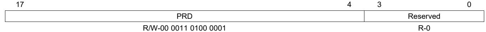

LEGEND: R/W = Read/Write; R = Read only; -*n* = value after reset

### **Table 2-9. DPWM Period Register (DPWMPRD) Register Field Descriptions**

<span id="page-74-2"></span>

| Bit  | Field    | Type | Reset                   | Description                                                     |
|------|----------|------|-------------------------|-----------------------------------------------------------------|
| 17-4 | PRD      | R/W  | 00 0011<br>0100<br>0001 | PWM Period. Low resolution register, last 4 bits are read-only. |
| 3-0  | Reserved | R    | 0                       |                                                                 |


### <span id="page-75-0"></span>*2.31.5 DPWM Event 1 Register (DPWMEV1)*

Address 00050010 – DPWM 3 Event 1 Register

Address 00070010 – DPWM 2 Event 1 Register

Address 000A0010 – DPWM 1 Event 1 Register

Address 000D0010 – DPWM 0 Event 1 Register

#### **Figure 2-21. DPWM Event 1 Register (DPWMEV1)**

<span id="page-75-1"></span>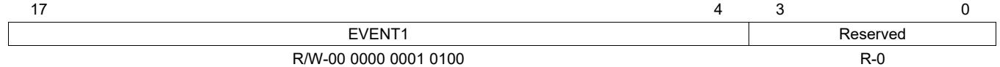

LEGEND: R/W = Read/Write; R = Read only; -*n* = value after reset

### **Table 2-10. DPWM Event 1 Register (DPWMEV1) Register Field Descriptions**

<span id="page-75-2"></span>

| Bit  | Field    | Type | Reset                   | Description                                                                                                                                |
|------|----------|------|-------------------------|--------------------------------------------------------------------------------------------------------------------------------------------|
| 17-4 | EVENT1   | R/W  | 00 0000<br>0001<br>0100 | Configures the location of Event 1. Low resolution register, last 4 bits are unused.<br>Refer to DPWM app note for additional information. |
| 3-0  | Reserved | R    | 0                       |                                                                                                                                            |


### <span id="page-76-0"></span>*2.31.6 DPWM Event 2 Register (DPWMEV2)*

Address 00050014 – DPWM 3 Event 2 Register

Address 00070014 – DPWM 2 Event 2 Register

Address 000A0014 – DPWM 1 Event 2 Register

Address 000D0014 – DPWM 0 Event 2 Register

### **Figure 2-22. DPWM Event 2 Register (DPWMEV2)**

<span id="page-76-1"></span>17 0

EVENT2 R/W-0 0000 0011 0000 0000

LEGEND: R/W = Read/Write; R = Read only; -*n* = value after reset

### **Table 2-11. DPWM Event 2 Register (DPWMEV2) Register Field Descriptions**

<span id="page-76-2"></span>

| Bit  | Field  | Type | Reset                          | Description                                                                                                                                                                                                                                                              |
|------|--------|------|--------------------------------|--------------------------------------------------------------------------------------------------------------------------------------------------------------------------------------------------------------------------------------------------------------------------|
| 17-0 | EVENT2 | R/W  | 0 0000<br>0011<br>0000<br>0000 | Configures the location of Event 2. Value equals number of PCLK clock periods in<br>Bits 17:4 and number of high resolution clock phases of PCL in Bits 3:0 (dependent<br>on Bits 3:2 of DPWM Control Register 2). Refer to DPWM app note for additional<br>information. |


### <span id="page-77-0"></span>*2.31.7 DPWM Event 3 Register (DPWMEV3)*

Address 00050018 – Loop 4 DPWM Event 3 Register

Address 00070018 – Loop 3 DPWM Event 3 Register

Address 000A0018 – Loop 2 DPWM Event 3 Register

Address 000D0018 – Loop 1 DPWM Event 3 Register

#### **Figure 2-23. DPWM Event 3 Register (DPWMEV3)**

<span id="page-77-1"></span>17 0 EVENT3

R/W-00 0000 0011 1110 0000

LEGEND: R/W = Read/Write; R = Read only; -*n* = value after reset

### **Table 2-12. DPWM Event 3 Register (DPWMEV3) Register Field Descriptions**

<span id="page-77-2"></span>

| Bit  | Field  | Type | Reset                           | Description                                                                                                                                                                                                        |
|------|--------|------|---------------------------------|--------------------------------------------------------------------------------------------------------------------------------------------------------------------------------------------------------------------|
| 17-0 | EVENT3 | R/W  | 00 0000<br>0011<br>1110<br>0000 | Configures the location of Event 3. Value equals number of PCLK clock periods in<br>Bits 17:4 and number of high resolution clock phases of PCL in Bits 3:0. Refer to<br>DPWM app note for additional information. |


#### <span id="page-78-0"></span>*2.31.8 DPWM Event 4 Register (DPWMEV4)*

Address 0005001C – Loop 4 DPWM Event 4 Register

Address 0007001C – Loop 3 DPWM Event 4 Register

Address 000A001C – Loop 2 DPWM Event 4 Register

Address 000D001C – Loop 1 DPWM Event 4 Register

### **Figure 2-24. DPWM Event 4 Register (DPWMEV4)**

<span id="page-78-1"></span>17 0 EVENT4

R/W-00 0000 0111 0000 0000

LEGEND: R/W = Read/Write; R = Read only; -*n* = value after reset

### **Table 2-13. DPWM Event 4 Register (DPWMEV4) Register Field Descriptions**

<span id="page-78-2"></span>

| Bit  | Field  | Type | Reset                           | Description                                                                                                                                                                                                        |
|------|--------|------|---------------------------------|--------------------------------------------------------------------------------------------------------------------------------------------------------------------------------------------------------------------|
| 17-0 | EVENT4 | R/W  | 00 0000<br>0111<br>0000<br>0000 | Configures the location of Event 4. Value equals number of PCLK clock periods in<br>Bits 17:4 and number of high resolution clock phases of PCL in Bits 3:0. Refer to<br>DPWM app note for additional information. |


# <span id="page-79-0"></span>*2.31.9 DPWM Sample Trigger 1 Register (DPWMSAMPTRIG1)*

Address 00050020 – DPWM 3 Sample Trigger 1 Register

Address 00070020 – DPWM 2 Sample Trigger 1 Register

Address 000A0020 – DPWM 1 Sample Trigger 1 Register

Address 000D0020 – DPWM 0 Sample Trigger 1 Register

# **Figure 2-25. DPWM Sample Trigger 1 Register (DPWMSAMPTRIG1)**

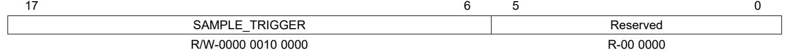

LEGEND: R/W = Read/Write; R = Read only; -*n* = value after reset

# **Table 2-14. DPWM Sample Trigger 1 Register (DPWMSAMPTRIG1) Register Field Descriptions**

<span id="page-79-1"></span>

| Bit  | Field              | Type | Reset                | Description                                                                                                                                                                                                                                                             |
|------|--------------------|------|----------------------|-------------------------------------------------------------------------------------------------------------------------------------------------------------------------------------------------------------------------------------------------------------------------|
| 17-6 | SAMPLE_<br>TRIGGER | R/W  | 0000<br>0010<br>0000 | Configures the location of the sample trigger within a PWM period. Value equals the<br>number of PCLK clock periods. Enables start of conversion for EADC. Refer to<br>DPWM app note for additional information. Low resolution register, last 6 bits are<br>read-only. |
| 5-0  | Reserved           | R    | 00 0000              |                                                                                                                                                                                                                                                                         |


# <span id="page-80-0"></span>*2.31.10 DPWM Sample Trigger 2 Register (DPWMSAMPTRIG2)*

Address 00050024 – DPWM 3 Sample Trigger 1 Register

Address 00070024 – DPWM 2 Sample Trigger 1 Register

Address 000A0024 – DPWM 1 Sample Trigger 1 Register

Address 000D0024 – DPWM 0 Sample Trigger 1 Register

# **Figure 2-26. DPWM Sample Trigger 2 Register (DPWMSAMPTRIG2)**

<span id="page-80-1"></span>

| 17<br>6            | 5<br>0    |
|--------------------|-----------|
| SAMPLE_TRIGGER     | Reserved  |
| R/W-0000 0010 0000 | R-00 0000 |

LEGEND: R/W = Read/Write; R = Read only; -*n* = value after reset

### **Table 2-15. DPWM Sample Trigger 2 Register (DPWMSAMPTRIG2) Register Field Descriptions**

<span id="page-80-2"></span>

| Bit  | Field              | Type | Reset                | Description                                                                                                                                                                                                                                                             |
|------|--------------------|------|----------------------|-------------------------------------------------------------------------------------------------------------------------------------------------------------------------------------------------------------------------------------------------------------------------|
| 17-6 | SAMPLE_<br>TRIGGER | R/W  | 0000<br>0010<br>0000 | Configures the location of the sample trigger within a PWM period. Value equals the<br>number of PCLK clock periods. Enables start of conversion for EADC. Refer to<br>DPWM app note for additional information. Low resolution register, last 6 bits are<br>read-only. |
| 5-0  | Reserved           | R    | 00 0000              |                                                                                                                                                                                                                                                                         |


# <span id="page-81-0"></span>*2.31.11 DPWM Phase Trigger Register (DPWMPHASETRIG)*

Address 00050028 – DPWM 3 Phase Trigger Register

Address 00070028 – DPWM 2 Phase Trigger Register

Address 000A0028 – DPWM 1 Phase Trigger Register

Address 000D0028 – DPWM 0 Phase Trigger Register

# **Figure 2-27. DPWM Phase Trigger Register (DPWMPHASETRIG)**

<span id="page-81-1"></span>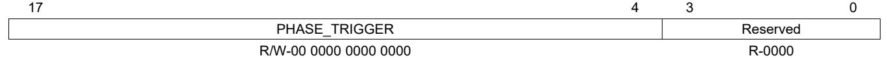

LEGEND: R/W = Read/Write; R = Read only; -*n* = value after reset

### **Table 2-16. DPWM Phase Trigger Register (DPWMPHASETRIG) Register Field Descriptions**

<span id="page-81-2"></span>

| Bit  | Field         | Type | Reset                   | Description                                                                                                                                                                                                              |
|------|---------------|------|-------------------------|--------------------------------------------------------------------------------------------------------------------------------------------------------------------------------------------------------------------------|
| 17-4 | PHASE_TRIGGER | R/W  | 00 0000<br>0000<br>0000 | Configures the phase trigger delay within multi-output mode. Value equals the<br>number of PCLK clock periods. Refer to DPWM app note for additional information.<br>Low resolution register, last 4 bits are read-only. |
| 3-0  | Reserved      | R    | 0000                    |                                                                                                                                                                                                                          |


### <span id="page-82-0"></span>*2.31.12 DPWM Cycle Adjust A Register (DPWMCYCADJA)*

Address 0005002C – DPWM 3 Cycle Adjust A Register

Address 0007002C – DPWM 2 Cycle Adjust A Register

Address 000A002C – DPWM 1 Cycle Adjust A Register

Address 000D002C – DPWM 0 Cycle Adjust A Register

# **Figure 2-28. DPWM Cycle Adjust A Register (DPWMCYCADJA)**

<span id="page-82-1"></span>15 0

CYCLE\_ADJUST\_A R/W-0000 0000 0000 0000

LEGEND: R/W = Read/Write; R = Read only; -*n* = value after reset

### **Table 2-17. DPWM Cycle Adjust A Register (DPWMCYCADJA) Register Field Descriptions**

<span id="page-82-2"></span>

| Bit  | Field              | Type | Reset                        | Description                                                                                                                                            |
|------|--------------------|------|------------------------------|--------------------------------------------------------------------------------------------------------------------------------------------------------|
| 15-0 | CYCLE_ADJUST_<br>A | R/W  | 0000<br>0000<br>0000<br>0000 | Adjusts PWM A output signal. 16-bit signed number allows output signal to be<br>delayed or sped up. Refer to DPWM app note for additional information. |


# <span id="page-83-0"></span>*2.31.13 DPWM Cycle Adjust B Register (DPWMCYCADJB)*

Address 00050030 – DPWM 3 Cycle Adjust B Register

Address 00070030 – DPWM 2 Cycle Adjust B Register

Address 000A0030 – DPWM 1 Cycle Adjust B Register

Address 000D0030 – DPWM 0 Cycle Adjust B Register

#### **Figure 2-29. DPWM Cycle Adjust B Register (DPWMCYCADJB)**

<span id="page-83-1"></span>15 0

CYCLE\_ADJUST\_B R/W-0000 0000 0000 0000

LEGEND: R/W = Read/Write; R = Read only; -*n* = value after reset

### **Table 2-18. DPWM Cycle Adjust B Register (DPWMCYCADJB) Register Field Descriptions**

<span id="page-83-2"></span>

| Bit  | Field              | Type | Reset                        | Description                                                                                                                                                |
|------|--------------------|------|------------------------------|------------------------------------------------------------------------------------------------------------------------------------------------------------|
| 15-0 | CYCLE_ADJUST_<br>B | R/W  | 0000<br>0000<br>0000<br>0000 | Adjusts the PWM B output signal. 16-bit signed number allows output signal to be<br>delayed or sped up. Refer to DPWM app note for additional information. |


# <span id="page-84-0"></span>*2.31.14 DPWM Resonant Duty Register (DPWMRESDUTY)*

Address 00050034 – DPWM 3 Resonant Duty Register

Address 00070034 – DPWM 2 Resonant Duty Register

Address 000A0034 – DPWM 1 Resonant Duty Register

Address 000D0034 – DPWM 0 Resonant Duty Register

### **Figure 2-30. DPWM Resonant Duty Register (DPWMRESDUTY)**

<span id="page-84-1"></span>15 0

RESONANT\_DUTY R/W-0000 0000 0000 0000

LEGEND: R/W = Read/Write; R = Read only; -*n* = value after reset

### **Table 2-19. DPWM Resonant Duty Register (DPWMRESDUTY) Register Field Descriptions**

<span id="page-84-2"></span>

| Bit  | Field             | Type | Reset                        | Description                                                                                             |
|------|-------------------|------|------------------------------|---------------------------------------------------------------------------------------------------------|
| 15-0 | RESONANT<br>_DUTY | R/W  | 0000<br>0000<br>0000<br>0000 | Controls the DPWM duty. 16-bit signed number is used as a Filter Output Multiplier<br>in Resonant Mode. |


# <span id="page-85-0"></span>*2.31.15 DPWM Fault Control Register (DPWMFLTCTRL)*

# **Figure 2-31. DPWM Fault Control Register (DPWMFLTCTRL)**

<span id="page-85-1"></span>

| 31               | 30               | 29       | 28 |   |               |   | 24 |
|------------------|------------------|----------|----|---|---------------|---|----|
| ALL_FAULT<br>_EN | CBC_FAULT<br>_EN | Reserved |    |   | CBC_MAX_COUNT |   |    |
| R/W-0            | R/W-0            | R-0      |    |   | R/W-0 0000    |   |    |
| 23               | 22               | 21       | 20 |   |               |   | 16 |
|                  | Reserved         |          |    |   | AB_MAX_COUNT  |   |    |
|                  | R-000            |          |    |   | R/W-0 0000    |   |    |
| 15               |                  | 13       | 12 |   |               |   | 8  |
|                  | Reserved         |          |    |   | A_MAX_COUNT   |   |    |
|                  | R-000            |          |    |   | R/W-0 0000    |   |    |
| 7                | 6                | 5        | 4  | 3 | 2             | 1 | 0  |
|                  | Reserved         |          |    |   | B_MAX_COUNT   |   |    |
|                  | R-000            |          |    |   | R/W-0 0000    |   |    |
|                  |                  |          |    |   |               |   |    |

**Table 2-20. DPWM Fault Control Register (DPWMFLTCTRL) Register Field Descriptions**

<span id="page-85-2"></span>

| Bit   | Field             | Type | Reset  | Description                                                                                                                                                                                           |
|-------|-------------------|------|--------|-------------------------------------------------------------------------------------------------------------------------------------------------------------------------------------------------------|
| 31    | ALL_FAULT_EN      | R/W  | 0      | DPWM Fault Module enable<br>0 = All DPWM Fault Modules disabled (Default)<br>1 = All DPWM Fault Modules enabled                                                                                       |
| 30    | CBC_FAULT_EN      | R/W  | 0      | Cycle by cycle Fault Enable<br>0 = Cycle by cycle just shortens DPWM pulses<br>1 = Consecutive cycle by cycle events beyond CBC_MAX_COUNT will cause the<br>DPWM to shut off as with any other fault. |
| 29    | Reserved          | R    | 0      |                                                                                                                                                                                                       |
| 28-24 | CBC_MAX<br>_COUNT | R/W  | 0 0000 | Cycle-by-Cycle Fault Count, sets the number of received sequential faults on Cycle<br>by-Cycle Fault input before asserting the fault                                                                 |
| 23-21 | Reserved          | R    | 000    |                                                                                                                                                                                                       |
| 20-16 | AB_MAX_COUNT      | R/W  | 0 0000 | Fault AB Count, sets the number of received sequential faults on Fault AB input<br>before asserting the fault                                                                                         |
| 15-13 | Reserved          | R    | 000    |                                                                                                                                                                                                       |
| 12-8  | A_MAX_COUNT       | R/W  | 0 0000 | Fault A Count, sets the number of received sequential faults on Fault A input before<br>asserting the fault                                                                                           |
| 7-5   | Reserved          | R    | 000    |                                                                                                                                                                                                       |
| 4-0   | B_MAX_COUNT       | R/W  | 0 0000 | Fault B Count, sets the number of received sequential faults on Fault B input before<br>asserting the fault                                                                                           |


# <span id="page-86-0"></span>*2.31.16 DPWM Overflow Register (DPWMOVERFLOW)*

Address 0005003C – DPWM 3 Overflow Register

Address 0007003C – DPWM 2 Overflow Register

Address 000A003C – DPWM 1 Overflow Register

Address 000D003C – DPWM 0 Overflow Register

### **Figure 2-32. DPWM Overflow Register (DPWMOVERFLOW)**

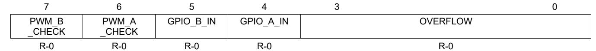

LEGEND: R/W = Read/Write; R = Read only; -*n* = value after reset

# **Table 2-21. DPWM Overflow Register (DPWMOVERFLOW) Register Field Descriptions**

<span id="page-86-1"></span>

| Bit | Field       | Type | Reset | Description                                                                                                                                                                                                                                                                                                                                                                                                                                                                                                            |
|-----|-------------|------|-------|------------------------------------------------------------------------------------------------------------------------------------------------------------------------------------------------------------------------------------------------------------------------------------------------------------------------------------------------------------------------------------------------------------------------------------------------------------------------------------------------------------------------|
| 7   | PWM_B_CHECK | R    | 0     | Value of PWM B internal check<br>0 = Passed checks<br>1 = Failed checks (override required to enable output)                                                                                                                                                                                                                                                                                                                                                                                                           |
| 6   | PWM_A_CHECK | R    | 0     | Value of PWM B input<br>0 = Passed check<br>1 = Failed check (override required to enable output)                                                                                                                                                                                                                                                                                                                                                                                                                      |
| 5   | GPIO_B_IN   | R    | 0     | Value of PWM B input<br>0 = Low signal on PWM B<br>1 = High signal on PWM B                                                                                                                                                                                                                                                                                                                                                                                                                                            |
| 4   | GPIO_A_IN   | R    | 0     | Value of PWM A input<br>0 = Low signal on PWM A<br>1 = High value on PWM A                                                                                                                                                                                                                                                                                                                                                                                                                                             |
| 3-0 | OVERFLOW    | R    | 0     | PWM Event 4 Overflow Status<br>0 = CLA Event 4 has not overflowed<br>1 = Overflow condition found on CLA Event 4<br>OVERFLOW[2] – CLA Event 4 Overflow Status<br>0 = PWM Event 4 has not overflowed<br>1 = Overflow condition found on PWM Event 4<br>OVERFLOW[1] – CLA Event 3 Overflow Status<br>0 = CLA Event 3 has not overflowed<br>1 = Overflow condition found on CLA Event 3<br>OVERFLOW[0] – CLA Event 2 Overflow Status<br>0 = CLA Event 2 has not overflowed<br>1 = Overflow condition found on CLA Event 2 |


### <span id="page-87-0"></span>*2.31.17 DPWM Interrupt Register (DPWMINT)*

Address 00050040 – DPWM 3 Interrupt Register

Address 00070040 – DPWM 2 Interrupt Register

Address 000A0040 – DPWM 1 Interrupt Register

Address 000D0040 – DPWM 0 Interrupt Register

**Figure 2-33. DPWM Interrupt Register (DPWMINT)**

<span id="page-87-1"></span>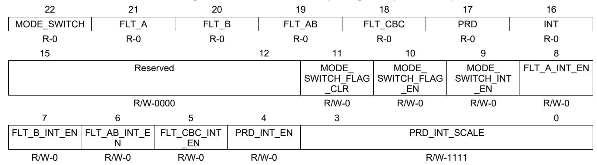

**Table 2-22. DPWM Interrupt Register (DPWMINT) Register Field Descriptions**

<span id="page-87-2"></span>

| Bit   | Field                    | Type | Reset | Description                                                                                                        |
|-------|--------------------------|------|-------|--------------------------------------------------------------------------------------------------------------------|
| 22    | MODE_SWITCH              | R    | 0     | Mode Switching Flag<br>0 = Flag is not asserted<br>1 = Flag is set                                                 |
| 21    | FLT_A                    | R    | 0     | Fault A Flag<br>0 = Flag is not asserted<br>1 = Flag is set                                                        |
| 20    | FLT_B                    | R    | 0     | Fault B Flag<br>0 = Flag is not asserted<br>1 = Flag is set                                                        |
| 19    | FLT_AB                   | R    | 0     | Fault AB Flag<br>0 = Flag is not asserted<br>1 = Flag is set                                                       |
| 18    | FLT_CBC                  | R    | 0     | Fault Cycle-by-Cycle Flag<br>0 = Flag is not asserted<br>1 = Flag is set                                           |
| 17    | PRD                      | R    | 0     | PWM Period Interrupt Flag<br>0 = PWM Period Interrupt Flag is not asserted<br>1 = PWM Period Interrupt Flag is set |
| 16    | INT                      | R    | 0     | Interrupt Out<br>0 = INT is not asserted<br>1 = INT is set                                                         |
| 15-12 | Reserved                 | R    | 0000  |                                                                                                                    |
| 11    | MODE_SWITCH_<br>FLAG_CLR | R/W  | 0     | Mode Switching Flag Clear<br>0 = (Default)<br>1 = Risedge 0-1 clears flag generated.                               |
| 10    | MODE_SWITCH_<br>FLAG_EN  | R/W  | 0     | Mode Switching Flag Clear<br>0 = (Default)<br>1 = Risedge 0-1 clears flag generated.                               |


# **Table 2-22. DPWM Interrupt Register (DPWMINT) Register Field Descriptions (continued)**

| Bit | Field                  | Type | Reset | Description                                                                                                                                                                                                                                                                                                                                                                                                                                                                                                                                                                                                                                                                                                                                                                                                                                                                                                                                                                                                                                                                                                                                                                                                                                       |
|-----|------------------------|------|-------|---------------------------------------------------------------------------------------------------------------------------------------------------------------------------------------------------------------------------------------------------------------------------------------------------------------------------------------------------------------------------------------------------------------------------------------------------------------------------------------------------------------------------------------------------------------------------------------------------------------------------------------------------------------------------------------------------------------------------------------------------------------------------------------------------------------------------------------------------------------------------------------------------------------------------------------------------------------------------------------------------------------------------------------------------------------------------------------------------------------------------------------------------------------------------------------------------------------------------------------------------|
| 9   | MODE_SWITCH<br>_INT_EN | R/W  | 0     | Mode Switching Interrupt Enable<br>0 = Interrupt is not enabled (Default)<br>1 = Interrupt is enabled                                                                                                                                                                                                                                                                                                                                                                                                                                                                                                                                                                                                                                                                                                                                                                                                                                                                                                                                                                                                                                                                                                                                             |
| 8   | FLT_A_INT_EN           | R/W  | 0     | Fault A Flag Interrupt Enable<br>0 = Interrupt is not enabled (Default)<br>1 = Interrupt is enabled                                                                                                                                                                                                                                                                                                                                                                                                                                                                                                                                                                                                                                                                                                                                                                                                                                                                                                                                                                                                                                                                                                                                               |
| 7   | FLT_B_INT_EN           | R/W  | 0     | Fault B Flag Interrupt Enable<br>0 = Interrupt is not enabled (Default)<br>1 = Interrupt is enabled                                                                                                                                                                                                                                                                                                                                                                                                                                                                                                                                                                                                                                                                                                                                                                                                                                                                                                                                                                                                                                                                                                                                               |
| 6   | FLT_AB_INT_EN          | R/W  | 0     | Fault AB Flag Interrupt Enable<br>0 = Interrupt is not enabled (Default)<br>1 = Interrupt is enabled                                                                                                                                                                                                                                                                                                                                                                                                                                                                                                                                                                                                                                                                                                                                                                                                                                                                                                                                                                                                                                                                                                                                              |
| 5   | FLT_CBC_INT_EN         | R/W  | 0     | Fault Cycle-by-Cycle Flag Interrupt Enable<br>0 = Interrupt is not enabled (Default)<br>1 = Interrupt is enabled                                                                                                                                                                                                                                                                                                                                                                                                                                                                                                                                                                                                                                                                                                                                                                                                                                                                                                                                                                                                                                                                                                                                  |
| 4   | PRD_INT_EN             | R/W  | 0     | PWM Period Interrupt Enable<br>0 = Disables generation of periodic PWM interrupt (Default)<br>1 = Enables generation of periodic PWM interrupt                                                                                                                                                                                                                                                                                                                                                                                                                                                                                                                                                                                                                                                                                                                                                                                                                                                                                                                                                                                                                                                                                                    |
| 3-0 | PRD_INT_SCALE          | R/W  | 1111  | This value scales the period interrupt signal from an interrupt every switching cycle to<br>16 switching cycles<br>0000 = Period Interrupt generated every switching cycle (Default)<br>0001 = Period Interrupt generated once every 2 switching cycles<br>0010 = Period Interrupt generated once every 4 switching cycles<br>0011 = Period Interrupt generated once every 6 switching cycles<br>0100 = Period Interrupt generated once every 8 switching cycles<br>0101 = Period Interrupt generated once every 16 switching cycles<br>0110 = Period Interrupt generated once every 32 switching cycles<br>0111 = Period Interrupt generated once every 48 switching cycles<br>1000 = Period Interrupt generated once every 64 switching cycles<br>1001 = Period Interrupt generated once every 80 switching cycles<br>1010 = Period Interrupt generated once every 96 switching cycles<br>1011 = Period Interrupt generated once every 128 switching cycles<br>1100 = Period Interrupt generated once every 160 switching cycles<br>1101 = Period Interrupt generated once every 192 switching cycles<br>1110 = Period Interrupt generated once every 224 switching cycles<br>1111 = Period Interrupt generated once every 256 switching cycles |


# <span id="page-89-0"></span>*2.31.18 DPWM Counter Preset Register (DPWMCNTPRE)*

Address 00050044 – DPWM 3 Counter Preset Register

Address 00070044 – DPWM 2 Counter Preset Register

Address 000A0044 – DPWM 1 Counter Preset Register

Address 000D0044 – DPWM 0 Counter Preset Register

#### **Figure 2-34. DPWM Counter Preset Register (DPWMCNTPRE)**

<span id="page-89-1"></span>

LEGEND: R/W = Read/Write; R = Read only; -*n* = value after reset

### **Table 2-23. DPWM Counter Preset Register (DPWMCNTPRE) Register Field Descriptions**

<span id="page-89-2"></span>

| Bit  | Field    | Type | Reset                   | Description                                                                                                                                                                    |
|------|----------|------|-------------------------|--------------------------------------------------------------------------------------------------------------------------------------------------------------------------------|
| 17-4 | PRESET   | R/W  | 00 0000<br>0000<br>0000 | Counter preset value, counter reset to this value upon detection of sync when<br>PRESET_EN bit in DPWMCTRL2 is enabled. Low resolution register, last 4 bits are<br>read-only. |
| 3-0  | Reserved | R    | 0000                    |                                                                                                                                                                                |


# <span id="page-90-0"></span>*2.31.19 DPWM Blanking A Begin Register (DPWMBLKABEG)*

Address 00050048 – DPWM 3 Blanking A Begin Register

Address 00070048 – DPWM 2 Blanking A Begin Register

Address 000A0048 – DPWM 1 Blanking A Begin Register

Address 000D0048 – DPWM 0 Blanking A Begin Register

### **Figure 2-35. DPWM Blanking A Begin Register (DPWMBLKABEG)**

| 17                    | 4 | 3 | 0        |
|-----------------------|---|---|----------|
| BLANK_A_BEGIN         |   |   | Reserved |
| R/W-00 0000 0000 0000 |   |   | R-0000   |

LEGEND: R/W = Read/Write; R = Read only; -*n* = value after reset

### **Table 2-24. DPWM Blanking A Begin Register (DPWMBLKABEG) Register Field Descriptions**

<span id="page-90-1"></span>

| Bit  | Field         | Type | Reset                   | Description                                                                                                      |
|------|---------------|------|-------------------------|------------------------------------------------------------------------------------------------------------------|
| 17-4 | BLANK_A_BEGIN | R/W  | 00 0000<br>0000<br>0000 | Configures start of Comparator Blanking Window for PWM A. Low resolution register,<br>last 4 bits are read-only. |
| 3-0  | Reserved      | R    | 0000                    |                                                                                                                  |


# <span id="page-91-0"></span>*2.31.20 DPWM Blanking A End Register (DPWMBLKAEND)*

Address 0005004C – DPWM 3 Blanking A End Register

Address 0007004C – DPWM 2 Blanking A End Register

Address 000A004C – DPWM 1 Blanking A End Register

Address 000D004C – DPWM 0 Blanking A End Register

# **Figure 2-36. DPWM Blanking A End Register (DPWMBLKAEND)**

<span id="page-91-1"></span>17 4 3 0 BLANK\_A\_END Reserved R/W-00 0000 0000 0000 R-0000

LEGEND: R/W = Read/Write; R = Read only; -*n* = value after reset

### **Table 2-25. DPWM Blanking A End Register (DPWMBLKAEND) Register Field Descriptions**

<span id="page-91-2"></span>

| Bit  | Field       | Type | Reset                   | Description                                                                                                    |
|------|-------------|------|-------------------------|----------------------------------------------------------------------------------------------------------------|
| 17-4 | BLANK_A_END | R/W  | 00 0000<br>0000<br>0000 | Configures end of Comparator Blanking Window for PWM A. Low resolution register,<br>last 4 bits are read-only. |
| 3-0  | Reserved    | R    | 0000                    |                                                                                                                |


### <span id="page-92-0"></span>*2.31.21 DPWM Blanking B Begin Register (DPWMBLKBBEG)*

Address 00050050 – DPWM 3 Blanking B Begin Register

Address 00070050 – DPWM 2 Blanking B Begin Register

Address 000A0050 – DPWM 1 Blanking B Begin Register

Address 000D0050 – DPWM 0 Blanking B Begin Register

### **Figure 2-37. DPWM Blanking B Begin Register (DPWMBLKBBEG)**

<span id="page-92-1"></span>

| 17                    | 4 | 3 | 0        |
|-----------------------|---|---|----------|
| BLANK_B_BEGIN         |   |   | Reserved |
| R/W-00 0000 0000 0000 |   |   | R-0000   |

LEGEND: R/W = Read/Write; R = Read only; -*n* = value after reset

### **Table 2-26. DPWM Blanking B Begin Register (DPWMBLKBBEG) Register Field Descriptions**

<span id="page-92-2"></span>

| Bit  | Field         | Type | Reset                   | Description                                                                                                      |
|------|---------------|------|-------------------------|------------------------------------------------------------------------------------------------------------------|
| 17-4 | BLANK_B_BEGIN | R/W  | 00 0000<br>0000<br>0000 | Configures start of Comparator Blanking Window for PWM B. Low resolution register,<br>last 4 bits are read-only. |
| 3-0  | Reserved      | R    | 0000                    |                                                                                                                  |


# <span id="page-93-0"></span>*2.31.22 DPWM Blanking B End Register (DPWMBLKBEND)*

Address 00050054 – DPWM 3 Blanking B End Register

Address 00070054 – DPWM 2 Blanking B End Register

Address 000A0054 – DPWM 1 Blanking B End Register

Address 000D0054 – DPWM 0 Blanking B End Register

#### **Figure 2-38. DPWM Blanking B End Register (DPWMBLKBEND)**

<span id="page-93-1"></span>

| 17                    | 4 | 3 | 0        |
|-----------------------|---|---|----------|
| BLANK_B_END           |   |   | Reserved |
| R/W-00 0000 0000 0000 |   |   | R-0000   |

LEGEND: R/W = Read/Write; R = Read only; -*n* = value after reset

### **Table 2-27. DPWM Blanking B End Register (DPWMBLKBEND) Register Field Descriptions**

<span id="page-93-2"></span>

| Bit  | Field       | Type | Reset                   | Description                                                                                                    |
|------|-------------|------|-------------------------|----------------------------------------------------------------------------------------------------------------|
| 17-4 | BLANK_B_END | R/W  | 00 0000<br>0000<br>0000 | Configures end of Comparator Blanking Window for PWM B. Low resolution register,<br>last 4 bits are read-only. |
| 3-0  | Reserved    | R    | 0000                    |                                                                                                                |


# <span id="page-94-0"></span>*2.31.23 DPWM Minimum Duty Cycle High Register (DPWMMINDUTYHI)*

Address 00050058 – DPWM 3 Minimum Duty Cycle High Register

Address 00070058 – DPWM 2 Minimum Duty Cycle High Register

Address 000A0058 – DPWM 1 Minimum Duty Cycle High Register

Address 000D0058 – DPWM 0 Minimum Duty Cycle High Register

**Figure 2-39. DPWM Minimum Duty Cycle High Register (DPWMMINDUTYHI)**

<span id="page-94-1"></span>

| 17                    | 4 | 3 | 0        |
|-----------------------|---|---|----------|
| MIN_DUTY_HIGH         |   |   | Reserved |
| R/W-00 0000 0000 0000 |   |   | R-0000   |

LEGEND: R/W = Read/Write; R = Read only; -*n* = value after reset

#### **Table 2-28. DPWM Minimum Duty Cycle High Register (DPWMMINDUTYHI) Register Field Descriptions**

<span id="page-94-2"></span>

| Bit  | Field         | Type | Reset                   | Description                                                                                                     |
|------|---------------|------|-------------------------|-----------------------------------------------------------------------------------------------------------------|
| 17-4 | MIN_DUTY_HIGH | R/W  | 00 0000<br>0000<br>0000 | Configures upper threshold for minimum duty cycle logic. Low resolution register, last<br>4 bits are read-only. |
| 3-0  | Reserved      | R    | 0000                    |                                                                                                                 |


# <span id="page-95-0"></span>*2.31.24 DPWM Minimum Duty Cycle Low Register (DPWMMINDUTYLO)*

Address 0005005C – DPWM 3 Minimum Duty Cycle Low Register

Address 0007005C – DPWM 2 Minimum Duty Cycle Low Register

Address 000A005C – DPWM 1 Minimum Duty Cycle Low Register

Address 000D005C – DPWM 0 Minimum Duty Cycle Low Register

**Figure 2-40. DPWM Minimum Duty Cycle Low Register (DPWMMINDUTYLO)**

<span id="page-95-1"></span>

| 17                    | 4 | 3 | 0        |
|-----------------------|---|---|----------|
| MIN_DUTY_LOW          |   |   | Reserved |
| R/W-00 0000 0000 0000 |   |   | R-0000   |

LEGEND: R/W = Read/Write; R = Read only; -*n* = value after reset

#### **Table 2-29. DPWM Minimum Duty Cycle Low Register (DPWMMINDUTYLO) Register Field Descriptions**

<span id="page-95-2"></span>

| Bit  | Field        | Type | Reset                   | Description                                                                                                     |
|------|--------------|------|-------------------------|-----------------------------------------------------------------------------------------------------------------|
| 17-4 | MIN_DUTY_LOW | R/W  | 00 0000<br>0000<br>0000 | Configures lower threshold for minimum duty cycle logic. Low resolution register, last<br>4 bits are read-only. |
| 3-0  | Reserved     | R    | 0000                    |                                                                                                                 |


### <span id="page-96-0"></span>*2.31.25 DPWM Adaptive Sample Register (DPWMADAPTIVE)*

Address 00050060 – DPWM 3 Adaptive Sample Register

Address 00070060 – DPWM 2 Adaptive Sample Register

Address 000A0060 – DPWM 1 Adaptive Sample Register

Address 000D0060 – DPWM 0 Adaptive Sample Register

**Figure 2-41. DPWM Adaptive Sample Register (DPWMADAPTIVE)**

11 0 ADAPT\_SAMP

R/W-0000 0000 0000

<span id="page-96-1"></span>LEGEND: R/W = Read/Write; R = Read only; -*n* = value after reset

### **Table 2-30. DPWM Adaptive Sample Register (DPWMADAPTIVE) Register Field Descriptions**

<span id="page-96-2"></span>

| Bit  | Field      | Type | Reset                | Description                       |
|------|------------|------|----------------------|-----------------------------------|
| 11-0 | ADAPT_SAMP | R/W  | 0000<br>0000<br>0000 | Configures Adaptive Sample Adjust |


### *2.31.26 DPWM Fault Status (DPWMFLTSTAT)*

Address 00050064 – DPWM 3 Fault Input Status Register

Address 00070064 – DPWM 2 Fault Input Status Register

Address 000A0064 – DPWM 1 Fault Input Status Register

Address 000D0064 – DPWM 0 Fault Input Status Register

#### **Figure 2-42. DPWM Fault Status (DPWMFLTSTAT)**

<span id="page-97-0"></span>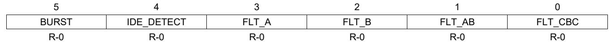

LEGEND: R/W = Read/Write; R = Read only; -*n* = value after reset

### **Table 2-31. DPWM Fault Status (DPWMFLTSTAT) Register Field Descriptions**

<span id="page-97-1"></span>

| Bit | Field      | Type | Reset | Description                                                                                                         |
|-----|------------|------|-------|---------------------------------------------------------------------------------------------------------------------|
| 5   | BURST      | R    | 0     | Burst Mode Detection Status<br>0 = Burst Mode Detection is not asserted<br>1 = Burst Mode Detection is set          |
| 4   | IDE_DETECT | R    | 0     | IDE Detection Status (from Analog Comparators)<br>0 = IDE Detection is not asserted<br>1 = IDE Detection is set     |
| 3   | FLT_A      | R    | 0     | Fault A Detection Statu<br>0 = Fault A Detection is not asserted<br>1 = Fault A Detection is set                    |
| 2   | FLT_B      | R    | 0     | Fault B Detection Status<br>0 = Fault B Detection is not asserted<br>1 = Fault B Detection is set                   |
| 1   | FLT_AB     | R    | 0     | Fault AB Detection Statu<br>0 = Fault AB Detection is not asserted<br>1 = Fault AB Detection is set                 |
| 0   | FLT_CBC    | R    | 0     | Current Limit Detection Status<br>0 = Current Limit Detection is not asserted<br>1 = Current Limit Detection is set |


# *2.31.27 DPWM Auto Switch High Upper Thresh Register (DPWMAUTOSWHIUPTHRESH)*

Address 00050068 – DPWM 3 Auto Switch High Upper Thresh Register

Address 00070068 – DPWM 2 Auto Switch High Upper Thresh Register

Address 000A0068 – DPWM 1 Auto Switch High Upper Thresh Register

Address 000D0068 – DPWM 0 Auto Switch High Upper Thresh Register

# **Figure 2-43. DPWM Auto Switch High Upper Thresh Register (DPWMAUTOSWHIUPTHRESH)**

<span id="page-98-0"></span>

| 17                     | 4 | 3 | 0        |
|------------------------|---|---|----------|
| AUTO_SWITCH_HIGH_UPPER |   |   | Reserved |
| R/W-00 0000 0000 0000  |   |   | R-0000   |

LEGEND: R/W = Read/Write; R = Read only; -*n* = value after reset

#### **Table 2-32. DPWM Auto Switch High Upper Thresh Register (DPWMAUTOSWHIUPTHRESH) Register Field Descriptions**

<span id="page-98-1"></span>

| Bit  | Field                      | Type | Reset                   | Description                                                                                                                                                                                                                   |
|------|----------------------------|------|-------------------------|-------------------------------------------------------------------------------------------------------------------------------------------------------------------------------------------------------------------------------|
| 17-4 | AUTO_SWITCH<br>_HIGH_UPPER | R/W  | 00 0000<br>0000<br>0000 | Configures upper threshold for Auto Switch Mode High operation. Mode switching<br>does not occur between Auto Switch High Upper and Auto Switch High Lower<br>thresholds. Low resolution register, last 4 bits are read-only. |
| 3-0  | Reserved                   | R    | 0000                    |                                                                                                                                                                                                                               |


# <span id="page-99-0"></span>*2.31.28 DPWM Auto Switch High Lower Thresh Register (DPWMAUTOSWHILOWTHRESH)*

Address 0005006C – DPWM 3 Auto Switch High Lower Thresh Register

Address 0007006C – DPWM 2 Auto Switch High Lower Thresh Register

Address 000A006C – DPWM 1 Auto Switch High Lower Thresh Register

Address 000D006C – DPWM 0 Auto Switch High Lower Thresh Register

# **Figure 2-44. DPWM Auto Switch High Lower Thresh Register (DPWMAUTOSWHILOWTHRESH)**

<span id="page-99-1"></span>17 4 3 0 AUTO\_SWITCH\_HIGH\_LOWER Reserved R/W-00 0000 0000 0000 R-0000

LEGEND: R/W = Read/Write; R = Read only; -*n* = value after reset

#### **Table 2-33. DPWM Auto Switch High Lower Thresh Register (DPWMAUTOSWHILOWTHRESH) Register Field Descriptions**

| Bit  | Field                      | Type | Reset                   | Description                                                                                                                                                                                                                   |
|------|----------------------------|------|-------------------------|-------------------------------------------------------------------------------------------------------------------------------------------------------------------------------------------------------------------------------|
| 17-4 | AUTO_SWITCH<br>_HIGH_UPPER | R/W  | 00 0000<br>0000<br>0000 | Configures lower threshold for Auto Switch Mode High operation. Mode switching<br>does not occur between Auto Switch High Upper and Auto Switch High Lower<br>thresholds. Low resolution register, last 4 bits are read-only. |
| 3-0  | Reserved                   | R    | 0000                    |                                                                                                                                                                                                                               |


# <span id="page-100-0"></span>*2.31.29 DPWM Auto Switch Low Upper Thresh Register (DPWMAUTOSWLOUPTHRESH)*

Address 00050070 – DPWM 3 Auto Switch Low Upper Thresh Register

Address 00070070 – DPWM 2 Auto Switch Low Upper Thresh Register

Address 000A0070 – DPWM 1 Auto Switch Low Upper Thresh Register

Address 000D0070 – DPWM 0 Auto Switch Low Upper Thresh Register

### **Figure 2-45. DPWM Auto Switch Low Upper Thresh Register (DPWMAUTOSWLOUPTHRESH)**

<span id="page-100-1"></span>

| 17                    | 4 | 3 | 0        |
|-----------------------|---|---|----------|
| AUTO_SWITCH_LOW_UPPER |   |   | Reserved |
| R/W-00 0000 0000 0000 |   |   | R-0000   |

LEGEND: R/W = Read/Write; R = Read only; -*n* = value after reset

#### **Table 2-34. DPWM Auto Switch Low Upper Thresh Register (DPWMAUTOSWLOUPTHRESH) Register Field Descriptions**

<span id="page-100-2"></span>

| Bit  | Field                     | Type | Reset                   | Description                                                                                                                                                                                                                |
|------|---------------------------|------|-------------------------|----------------------------------------------------------------------------------------------------------------------------------------------------------------------------------------------------------------------------|
| 17-4 | AUTO_SWITCH<br>_LOW_UPPER | R/W  | 00 0000<br>0000<br>0000 | Configures upper threshold for Auto Switch Mode Low operation. Mode switching<br>does not occur between Auto Switch Low Upper and Auto Switch Low Lower<br>thresholds. Low resolution register, last 4 bits are read-only. |
| 3-0  | Reserved                  | R    | 0000                    |                                                                                                                                                                                                                            |


# <span id="page-101-0"></span>*2.31.30 DPWM Auto Switch Low Lower Thresh Register (DPWMAUTOSWLOLOWTHRESH)*

Address 00050074 – DPWM 3 Auto Switch Low Lower Thresh Register

Address 00070074 – DPWM 2 Auto Switch Low Lower Thresh Register

Address 000A0074 – DPWM 1 Auto Switch Low Lower Thresh Register

Address 000D0074 – DPWM 0 Auto Switch Low Lower Thresh Register

# **Figure 2-46. DPWM Auto Switch Low Lower Thresh Register (DPWMAUTOSWLOLOWTHRESH)**

<span id="page-101-1"></span>17 4 3 0 AUTO\_SWITCH\_LOW\_LOWER Reserved R/W-00 0000 0000 0000 R-0000

LEGEND: R/W = Read/Write; R = Read only; -*n* = value after reset

#### **Table 2-35. DPWM Auto Switch Low Lower Thresh Register (DPWMAUTOSWLOLOWTHRESH) Register Field Descriptions**

<span id="page-101-2"></span>

| Bit  | Field                     | Type | Reset                   | Description                                                                                                                                                                                                                |
|------|---------------------------|------|-------------------------|----------------------------------------------------------------------------------------------------------------------------------------------------------------------------------------------------------------------------|
| 17-4 | AUTO_SWITCH<br>_LOW_LOWER | R/W  | 00 0000<br>0000<br>0000 | Configures lower threshold for Auto Switch Mode Low operation. Mode switching<br>does not occur between Auto Switch Low Upper and Auto Switch Low Lower<br>thresholds. Low resolution register, last 4 bits are read-only. |
| 3-0  | Reserved                  | R    | 0000                    |                                                                                                                                                                                                                            |


# <span id="page-102-0"></span>*2.31.31 DPWM Auto Config Max Register (DPWMAUTOMAX)*

Address 00050078 – DPWM 3 Auto Config Max Register

Address 00070078 – DPWM 2 Auto Config Max Register

Address 000A0078 – DPWM 1 Auto Config Max Register

Address 000D0078 – DPWM 0 Auto Config Max Register

**Figure 2-47. DPWM Auto Config Max Register (DPWMAUTOMAX)**

<span id="page-102-1"></span>

| 31                 |                                      |                 | 28                               | 27                 |          |                 | 24                           |
|--------------------|--------------------------------------|-----------------|----------------------------------|--------------------|----------|-----------------|------------------------------|
|                    |                                      | PWM_B_INTRA_MUX |                                  |                    |          | PWM_A_INTRA_MUX |                              |
|                    |                                      | R/W-000         |                                  |                    |          | R/W-000         |                              |
| 23                 | 22                                   | 21              | 20                               | 19                 | 18       | 17              | 16                           |
| CBC_PWM_C<br>_EN   | MULTI_MODE<br>Reserved<br>_CLA_B_OFF |                 | CBC_PWM_AB<br>_EN                | CBC_ADV<br>_CNT_EN | Reserved |                 | MASTER<br>_SYNC_CNTL<br>_SEL |
| R/W-000            | R/W-0                                |                 | R/W-0                            | R/W-0              |          | R-0             | R/W-0                        |
| 15                 | 14                                   | 13              | 12                               | 11                 |          |                 | 8                            |
|                    | Reserved<br>CBC_SYNC<br>_CUR_LIMIT   |                 | RESON_MODE<br>_FIXED_DUTY<br>_EN |                    |          | Reserved        |                              |
| R-00               |                                      | R/W-0           | R/W-0                            | R-0000 0           |          |                 |                              |
| 7                  | 6                                    |                 | 4                                | 3                  | 2        | 1               | 0                            |
| Reserved           | PWM_MODE                             |                 |                                  | Reserved<br>CLA_EN |          | Reserved        |                              |
| R-0000 0<br>R/W-00 |                                      |                 | R-00<br>R/W-0                    |                    | R-0      |                 |                              |

**Table 2-36. DPWM Auto Config Max Register (DPWMAUTOMAX) Register Field Descriptions**

<span id="page-102-2"></span>

| Bit   | Field               | Type | Reset | Description                                                                                                                                                                                                                                                                                                                                                    |  |  |
|-------|---------------------|------|-------|----------------------------------------------------------------------------------------------------------------------------------------------------------------------------------------------------------------------------------------------------------------------------------------------------------------------------------------------------------------|--|--|
| 31-28 | PWM_B_INTRA<br>_MUX | R/W  | 000   | Interchanges DPWM signals post edge generation<br>0 = Pass-through (Default)<br>1 = Edge-gen output, this module<br>2 = PWM-C, this module<br>3 = Crossover, this module<br>4 = Pass-through below A<br>5 = Pass-through below B<br>6 = Pass-through below C<br>7 = Pass-through below level-2 C<br>8 = Pass-through below level-3 C                           |  |  |
| 27-24 | PWM_A_INTRA<br>_MUX | R/W  | 000   | Combines DPWM signals are prior to HR module<br>0 = Pass-through (Default)<br>1 = Edge-gen output, this module<br>2 = PWM-C, this module<br>3 = Crossover, this module<br>4 = Pass-through below A<br>5 = Pass-through below B<br>6 = Pass-through below C<br>6 = Pass-through below C<br>7 = Pass-through below level-2 C<br>8 = Pass-through below level-3 C |  |  |
| 23    | CBC_PWM_C_EN        | R/W  | 000   | Sets if Fault CBC changes output waveform for PWM-C<br>0 = PWM-C unaffected by Fault CBC (Default)<br>1 = PWM-C affected by Fault CBC                                                                                                                                                                                                                          |  |  |


# **Table 2-36. DPWM Auto Config Max Register (DPWMAUTOMAX) Register Field Descriptions (continued)**

| Bit   | Field                            | Type | Reset  | Description                                                                                                                                                                                                                          |  |  |
|-------|----------------------------------|------|--------|--------------------------------------------------------------------------------------------------------------------------------------------------------------------------------------------------------------------------------------|--|--|
| 22    | CBC_PWM_C_EN                     | R/W  | 0      | Configures control of PWM B output in Multi-Output Mode when CLA_ENABLE is<br>asserted<br>0 = PWM B pulse width controlled by Filter Calculation (Default)<br>1 = PWM B pulse width controlled by Event3 and Event4 registers        |  |  |
| 21    | Reserved                         | R    | 0      |                                                                                                                                                                                                                                      |  |  |
| 20    | CBC_PWM_AB<br>_EN                | R/W  | 0      | Sets if Fault CBC changes output waveform for PWM-A and PWM-B<br>0 = PWM-A and PWM-B unaffected by Fault CBC (Default)<br>1 = PWM-A and PWM-B affected by Fault CBC                                                                  |  |  |
| 19    | CBC_ADV_CNT<br>_EN               | R/W  | 0      | Selects cycle-by-cycle of operation<br>Normal Mode<br>0 = CBC disabled (Default)<br>1 = CBC enabled<br>Multi and Resonant Modes<br>0 = PWM-A and PWM-B operate independently (Default)<br>1 = PWM-A and PWM-B pulse matching enabled |  |  |
| 18-17 | Reserved                         | R    | 00     |                                                                                                                                                                                                                                      |  |  |
| 16    | MASTER_SYNC<br>_CNTL_SEL         | R/W  | 0      | Configures master sync location<br>0 = Master Sync controlled by Phase Trigger Register (Default)<br>1 = Master Sync controlled by CLA value                                                                                         |  |  |
| 15-14 | Reserved                         | R    | 00     |                                                                                                                                                                                                                                      |  |  |
| 13    | CBC_SYNC_CUR<br>_LIMIT_EN        | R/W  | 0      | Sets how current limit affects slave sync<br>0 = Slave sync is unaffected during current limit (Default)<br>1 = Slave sync is advanced during current limit.                                                                         |  |  |
| 12    | RESON_MODE<br>_FIXED_DUTY<br>_EN | R/W  | 0      | Configures how duty cycle is controlled in Resonance Mode<br>0 = Resonant mode duty cycle set by Filter duty (Default)<br>1 = Resonant mode duty cycle set by Auto Switch High Register                                              |  |  |
| 11-7  | Reserved                         | R    | 0000 0 |                                                                                                                                                                                                                                      |  |  |
| 6-4   | PWM_MODE                         | R/W  | 000    | DPWM Mode<br>0 = Normal Mode (Default)<br>1 = Resonant Mode<br>2 = Multi-Output Mode<br>3 = Triangular Mode<br>4 = Leading Mode                                                                                                      |  |  |
| 3-2   | Reserved                         | R    | 00     |                                                                                                                                                                                                                                      |  |  |
| 1     | CLA_EN                           | R/W  | 0      | CLA Processing Enable<br>0 = Generate PWM waveforms from PWM Register values (Default)<br>1 = Enable CLA input                                                                                                                       |  |  |
| 0     | Reserved                         | R    | 0      |                                                                                                                                                                                                                                      |  |  |


# <span id="page-104-0"></span>*2.31.32 DPWM Auto Config Mid Register (DPWMAUTOMID)*

Address 0005007C – DPWM 3 Auto Config Mid Register

Address 0007007C – DPWM 2 Auto Config Mid Register

Address 000A007C – DPWM 1 Auto Config Mid Register

Address 000D007C – DPWM 0 Auto Config Mid Register

**Figure 2-48. DPWM Auto Config Mid Register (DPWMAUTOMID)**

<span id="page-104-1"></span>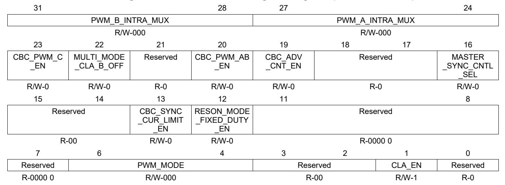

**Table 2-37. DPWM Auto Config Mid Register (DPWMAUTOMID) Register Field Descriptions**

<span id="page-104-2"></span>

| Bit   | Field               | Type | Reset | Description                                                                                                                                                                                                                                                                                                                                                    |  |
|-------|---------------------|------|-------|----------------------------------------------------------------------------------------------------------------------------------------------------------------------------------------------------------------------------------------------------------------------------------------------------------------------------------------------------------------|--|
| 31-28 | PWM_B_INTRA<br>_MUX | R/W  | 000   | Interchanges DPWM signals post edge generation<br>0 = Pass-through (Default)<br>1 = Edge-gen output, this module<br>2 = PWM-C, this module<br>3 = Crossover, this module<br>4 = Pass-through below A<br>5 = Pass-through below B<br>6 = Pass-through below C<br>7 = Pass-through below level-2 C<br>8 = Pass-through below level-3 C                           |  |
| 27-24 | PWM_A_INTRA<br>_MUX | R/W  | 000   | Combines DPWM signals are prior to HR module<br>0 = Pass-through (Default)<br>1 = Edge-gen output, this module<br>2 = PWM-C, this module<br>3 = Crossover, this module<br>4 = Pass-through below A<br>5 = Pass-through below B<br>6 = Pass-through below C<br>6 = Pass-through below C<br>7 = Pass-through below level-2 C<br>8 = Pass-through below level-3 C |  |
| 23    | CBC_PWM_C_EN        | R/W  | 000   | Sets if Fault CBC changes output waveform for PWM-C<br>0 = PWM-C unaffected by Fault CBC (Default)<br>1 = PWM-C affected by Fault CBC                                                                                                                                                                                                                          |  |


# **Table 2-37. DPWM Auto Config Mid Register (DPWMAUTOMID) Register Field Descriptions (continued)**

| Bit   | Field                            | Type | Reset  | Description                                                                                                                                                                                                                          |
|-------|----------------------------------|------|--------|--------------------------------------------------------------------------------------------------------------------------------------------------------------------------------------------------------------------------------------|
| 22    | MULTI_MODE<br>_CLA_B_OFF         | R/W  | 0      | Configures control of PWM B output in Multi-Output Mode when CLA_ENABLE is<br>asserted<br>0 = PWM B pulse width controlled by Filter Calculation (Default)<br>1 = PWM B pulse width controlled by Event3 and Event4 registers        |
| 21    | Reserved                         | R    | 0      |                                                                                                                                                                                                                                      |
| 20    | CBC_PWM_AB<br>_EN                | R/W  | 0      | Sets if Fault CBC changes output waveform for PWM-A and PWM-B 0 = PWM-A and<br>PWM-B unaffected by Fault CBC (Default) 1 = PWM-A and PWM-B affected by Fault<br>CBC                                                                  |
| 19    | CBC_ADV_CNT<br>_EN               | R/W  | 0      | Selects cycle-by-cycle of operation<br>Normal Mode<br>0 = CBC disabled (Default)<br>1 = CBC enabled<br>Multi and Resonant Modes<br>0 = PWM-A and PWM-B operate independently (Default)<br>1 = PWM-A and PWM-B pulse matching enabled |
| 18-17 | Reserved                         | R    | 00     |                                                                                                                                                                                                                                      |
| 16    | MASTER_SYNC<br>_CNTL_SEL         | R/W  | 0      | Configures master sync location<br>0 = Master Sync controlled by Phase Trigger Register (Default)<br>1 = Master Sync controlled by CLA value                                                                                         |
| 15-14 | Reserved                         | R    | 00     |                                                                                                                                                                                                                                      |
| 13    | CBC_SYNC_CUR<br>_LIMIT_EN        | R/W  | 0      | Sets how current limit affects slave sync<br>0 = Slave sync is unaffected during current limit (Default)<br>1 = Slave sync is advanced during current limit.                                                                         |
| 12    | RESON_MODE<br>_FIXED_DUTY<br>_EN | R/W  | 0      | Configures how duty cycle is controlled in Resonance Mode<br>0 = Resonant mode duty cycle set by Filter duty (Default)<br>1 = Resonant mode duty cycle set by Auto Switch High Register                                              |
| 11-7  | Reserved                         | R    | 0000 0 |                                                                                                                                                                                                                                      |
| 6-4   | PWM_MODE                         | R/W  | 000    | DPWM Mode<br>0 = Normal Mode (Default)<br>1 = Resonant Mode<br>2 = Multi-Output Mode<br>3 = Triangular Mode<br>4 = Leading Mode                                                                                                      |
| 3-2   | Reserved                         | R    | 00     |                                                                                                                                                                                                                                      |
| 1     | CLA_EN                           | R/W  | 1      | CLA Processing Enable<br>0 = Generate PWM waveforms from PWM Register values<br>1 = Enable CLA input (Default)                                                                                                                       |
| 0     | Reserved                         | R    | 0      |                                                                                                                                                                                                                                      |


# <span id="page-106-0"></span>*2.31.33 DPWM Edge PWM Generation Control Register (DPWMEDGEGEN)*

Address 00050080 – DPWM 3 Edge PWM Generation Control Register

Address 00070080 – DPWM 2 Edge PWM Generation Control Register

Address 000A0080 – DPWM 1 Edge PWM Generation Control Register

Address 000D0080 – DPWM 0 Edge PWM Generation Control Register

**Figure 2-49. DPWM Edge PWM Generation Control Register (DPWMEDGEGEN)**

<span id="page-106-1"></span>

| 16       | 15       | 14        | 13<br>12  |  | 11       | 10 | 9          | 8 |
|----------|----------|-----------|-----------|--|----------|----|------------|---|
| EDGE_EN  | Reserved |           | A_ON_EDGE |  | Reserved |    | A_OFF_EDGE |   |
| R/W-0    | R-0      |           | R/W-000   |  | R-0      |    | R/W-01     |   |
| 7        | 6        | 5         | 4         |  | 3        | 2  | 1          | 0 |
| Reserved |          | B_ON_EDGE |           |  | Reserved |    | B_OFF_EDGE |   |
| R-0      |          | R/W-10    |           |  | R-0      |    | R/W-11     |   |

**Table 2-38. DPWM Edge PWM Generation Control Register (DPWMEDGEGEN) Register Field Descriptions**

<span id="page-106-2"></span>

| Bit   | Field      | Type | Reset | Description                                                                                                                                                                                                                                                                                                                            |
|-------|------------|------|-------|----------------------------------------------------------------------------------------------------------------------------------------------------------------------------------------------------------------------------------------------------------------------------------------------------------------------------------------|
| 16    | EDGE_EN    | R/W  | 0     | Enables edge generate module. When combining dpwm's, all modules must have<br>this bit enabled.                                                                                                                                                                                                                                        |
| 15    | Reserved   | R    | 0     |                                                                                                                                                                                                                                                                                                                                        |
| 14-12 | A_ON_EDGE  | R/W  | 000   | Select input edge to trigger A ON output edge<br>0 = Current DPWM posedge A<br>1 = Current DPWM negedge A<br>2 = Current DPWM posedge B<br>3 = Current DPWM negedge B<br>4 = Below (n+1) DPWM posedge A<br>5 = Below (n+1) DPWM negedge A<br>6 = Below (n+1) DPWM posedge B<br>7 = Below (n+1) DPWM negedge B                          |
| 11    | Reserved   | R    | 0     |                                                                                                                                                                                                                                                                                                                                        |
| 10-8  | A_OFF_EDGE | R/W  | 01    | Select input edge to trigger A OFF output edge<br>0 = Current DPWM posedge A<br>1 = Current DPWM negedge A<br>2 = Current DPWM posedge B<br>3 = Current DPWM negedge B<br>4 = Below (n+1) DPWM posedge A<br>5 = Below (n+1) DPWM negedge A<br>6 = Below (n+1) DPWM posedge B<br>7 = Below (n+1) DPWM negedge B                         |
| 7     | Reserved   | R    | 0     |                                                                                                                                                                                                                                                                                                                                        |
| 6-4   | B_ON_EDGE  | R/W  | 10    | Select input edge to trigger B ON output edge<br>0 = Current DPWM posedge A = Current DPWM posedge A<br>1 = Current DPWM negedge A<br>2 = Current DPWM posedge B<br>3 = Current DPWM negedge B<br>4 = Below (n+1) DPWM posedge A<br>5 = Below (n+1) DPWM negedge A<br>6 = Below (n+1) DPWM posedge B<br>7 = Below (n+1) DPWM negedge B |
| 3     | Reserved   | R    | 0     |                                                                                                                                                                                                                                                                                                                                        |


### **Table 2-38. DPWM Edge PWM Generation Control Register (DPWMEDGEGEN) Register Field Descriptions (continued)**

| Bit | Field      | Type | Reset | Description                                                                                                                                                                                                                                                                                                    |  |
|-----|------------|------|-------|----------------------------------------------------------------------------------------------------------------------------------------------------------------------------------------------------------------------------------------------------------------------------------------------------------------|--|
| 2-0 | B_OFF_EDGE | R/W  | 11    | Select input edge to trigger B OFF output edge<br>0 = Current DPWM posedge A<br>1 = Current DPWM negedge A<br>2 = Current DPWM posedge B<br>3 = Current DPWM negedge B<br>4 = Below (n+1) DPWM posedge A<br>5 = Below (n+1) DPWM negedge A<br>6 = Below (n+1) DPWM posedge B<br>7 = Below (n+1) DPWM negedge B |  |


# <span id="page-108-0"></span>*2.31.34 DPWM Filter Duty Read Register (DPWMFILTERDUTYREAD)*

Address 00050084 – DPWM 3 Filter Duty Read Register

Address 00070084 – DPWM 2 Filter Duty Read Register

Address 000A0084 – DPWM 1 Filter Duty Read Register

Address 000D0084 – DPWM 0 Filter Duty Read Register

# **Figure 2-50. DPWM Filter Duty Read Register (DPWMFILTERDUTYREAD)**

<span id="page-108-1"></span>17 0 FILTER\_DUTY

R-0

LEGEND: R/W = Read/Write; R = Read only; -*n* = value after reset

#### **Table 2-39. DPWM Filter Duty Read Register (DPWMFILTERDUTYREAD) Register Field Descriptions**

<span id="page-108-2"></span>

| Bit  | Field       | Type | Reset | Description                               |
|------|-------------|------|-------|-------------------------------------------|
| 17-0 | FILTER_DUTY | R    | 0     | Filter Duty value received by DPWM Module |


### <span id="page-109-0"></span>*2.31.35 DPWM BIST Status Register (DPWMBISTSTAT)*

Address 00050088 – DPWM 3 BIST Status Register

Address 00070088 – DPWM 2 BIST Status Register

Address 000A0088 – DPWM 1 BIST Status Register

Address 000D0088 – DPWM 0 BIST Status Register

#### **Figure 2-51. DPWM BIST Status Register (DPWMBISTSTAT)**

<span id="page-109-1"></span>14 0

BIST\_CNT

R-0

LEGEND: R/W = Read/Write; R = Read only; -*n* = value after reset

### **Table 2-40. DPWM BIST Status Register (DPWMBISTSTAT) Register Field Descriptions**

<span id="page-109-2"></span>

| Bit  | Field    | Type | Reset | Description                             |
|------|----------|------|-------|-----------------------------------------|
| 14-0 | BIST_CNT | R    | 0     | BIST Count accumulated during BIST test |

<span id="page-110-0"></span>

# *Front End*

There are 3 Front-End modules available in UCD3138 (Front End 0, 1, 2). Here is a simplified block diagram of the Front End showing an accurate representation of the block's overall functionality:

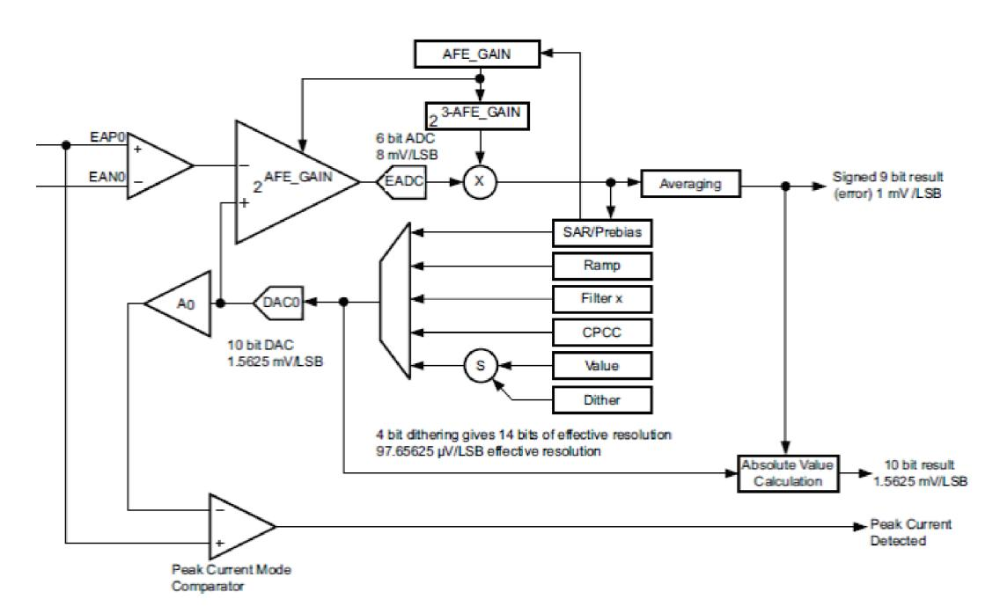

**Figure 3-1. Simplified Block Diagram of Front End in UCD3138 (Front End 2 recommended for Peak Current Mode Control)**

<span id="page-110-1"></span>The input to the Front End is a differential signal on 2 input pins (EANx, EAPx, x=0, 1, 2) of the UCD3138 device. A differential amplifier resolves this to a single ended signal, representing the difference between the two pins. Typically this signal represents voltage or current in the power supply, or some other value to be regulated via a feedback loop to be measured.

This signal is fed into another differential amplifier. The other input to this differential amplifier comes from a Digital to Analog Converter (DAC) which has an effective range of 0 to 1.6V. This DAC output typically represents a target for a regulated value (reference).

There is a gain programmable differential amplifier which outputs the difference between the DAC output and the Front End input. This analog signal typically represents the error between the regulated value and the target value. This signal is turned into a digital value by the Error Analog to Digital Converter (EADC). This digital value is typically fed to the input of one or more filters, although it can be used in other ways.

Other blocks in the UCD3138 Front End aid implementing typical power supply functions. The Successive Approximation Control turns the Front End from a high speed, limited range error ADC to a 1.6V range, slower, successive approximation ADC.

The Ramp Control ramps the EADC DAC value up or down at a programmable rate for simple soft start and soft stop functionality. The Ramp engine can also be used for other ramps as well.

The Pre-Bias Control adds pre-bias handling support.


There is also a single ended comparator connected with EAP pin and the DAC which is used for Peak Current Mode control. Front End 2 is recommended for Peak Current mode control because blanking time is available only on FE2 in UCD3138(RMH,RHA,RGC).

All of these are described in more details in later sections of this chapter.

**Topic** ........................................................................................................................... **Page**

| 3.1 | Error ADC and Front End Gain  | 113 |
|-----|-------------------------------|-----|
| 3.2 | Front End DAC                 | 118 |
| 3.3 | Ramp Module                   | 119 |
| 3.4 | Successive Approximation Mode | 123 |
| 3.5 | Absolute Value Without SAR    | 124 |
| 3.6 | EADC Modes                    | 124 |
| 3.7 | Front End Control Registers   | 124 |
|     |                               |     |


# <span id="page-112-0"></span>**3.1 Error ADC and Front End Gain**

The Error ADC (EADC) is a high speed 6 bit ADC converter.

# <span id="page-112-1"></span>*3.1.1 Front End Gain*

The Front End gain (the gain before the EADC) can be adjusted to 1X, 2X, 4X, and 8X. This gives an EADC resolution of 8mV, 4mV, 2mV, and 1mV respectively.

To set a fixed front end gain, the gain value is written to the AFE\_GAIN bits in the EADC Control register.

FeCtrl0Regs.EADCCTRL.bit.AFE\_GAIN = 2; //set AFE gain to 4X

In addition, there are 2 automatic gain setting modes, available only on Front End 0. They are enabled by setting the AUTO\_GAIN\_SHIFT\_ENABLE bit in the EADC control register.

FeCtrl0Regs.EADCCTRL.bit.AUTO\_GAIN\_SHIFT\_EN = 1; //enable auto gain shift mode.

In the simpler mode, the gain is shifted to the next lower mode whenever the EADC over or underflows. The gain is increased if the EADC output is less than +-1/4 of its range at the current gain.

By setting the AUTO\_GAIN\_SHIFT\_MODE bit in the EADCCTRL register, the second auto gain mode can be enabled. In this mode, the shift points are set by the Filter nonlinear mode thresholds. These thresholds are described in [Section](#page-152-0) 4.5. There are 3 Filters with non linear thresholds. The FECTRLxMUX register in [Chapter](#page-184-0) 5 selects which set of nonlinear thresholds are used with each Front End.

# <span id="page-112-2"></span>*3.1.2 EADC Error Output*

The internal EADC output is a 6 bit two's complement number. Depending on AFE gain, the least significant EADC bit can have a value of 1 to 8 mV. To simplify automatic AFE gain changes, this EADC output is shifted depending on the AFE gain, giving a 9 bit output to the filter.

This way, regardless of the AFE gain, the least significant bit will always have a resolution of 1mV. Depending on AFE gain, the bits and range of the output actually used will change:

**Analog Gain AFE\_GAIN Bits Input Range (mV) Bits Used Left Shift Measurement Resolution (mV)** 1 0 +248 to -256 3 - 8 3 8 2 1 +124 to -128 2 - 7 2 4 4 2 +62 to -64 1 - 6 1 2 8 3 +31 to -32 0 - 5 0 1

**Table 3-1.**


Here is a graphical representation of the EADC output:

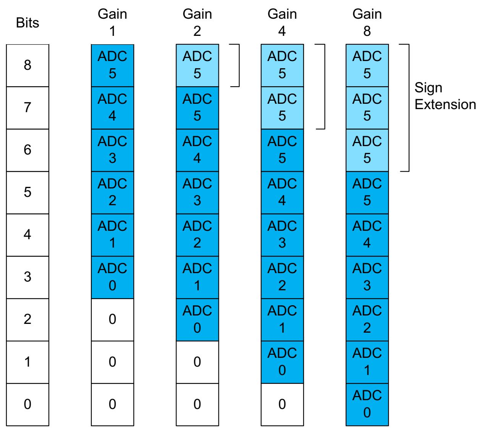

**Figure 3-2.**

<span id="page-113-0"></span>The EADC error output as described above can be read from the EADC raw value register:

```
eadc_error = FeCtrl0Regs.EADCRAWVALUE.bit.RAW_ERROR_VALUE;
```

It is also sent to the Filter, and is one of the values which can be used by the digital comparators controlled by the Fault Mux.


# <span id="page-114-0"></span>*3.1.3 EADC Triggering, EADC Output to Filter*

The EADC is generally triggered by a sample trigger signal from a DPWM module. After this trigger, if averaging is enabled, additional triggers may come from the averaging module. The EADC can also be triggered by the Successive Approximation (SAR) module. Multiple DPWMS can be used to trigger a single EADC at different times in the same period.

Each DPWM module has 2 sample trigger registers to set sample trigger timing. The DPWMs can also provide oversampling of 2, 4, or 8 samples in coordination with 1 of the 2 sample triggers. See [Section](#page-62-2) 2.17.5, for more information.

The Sample Trigger Control register in the Loop Mux module controls the routing of sample trigger signals from the DPWMs to the EADCs. There is a bit in that register for every possible DPWM/Front End combination. If that bit is set, then the sample trigger from that specific DPWM will be routed to that specific front end. For example, to use DPWM3 to trigger Front End 2, this is the code:

```
LoopMuxRegs.SAMPTRIGCTRL.bit.FE2_TRIG_DPWM3_EN = 1;
```

See [Chapter](#page-184-0) 5 for more information.

If the EADC is driving a filter, that filter will compute its output at the conclusion of the EADC conversion. The Filter Mux register in the Loop Mux selects which front ends send data to which filters. For instance to send the output from Front End 2 to Filter 1:

```
LoopMuxRegs.FILTERMUX.bit.FILTER1_FE_SEL = 2; //use Front end 2 for filter 1.
```

See [Chapter](#page-184-0) 5 for more information.

Sample triggers can also be divided so that the EADC only fires every 1 to 16 sample triggers:

```
FeCtrl0Regs.EADCCTRL.bit.SAMP_TRIG_SCALE = 4; //trigger every 5 sample triggers.
```

# <span id="page-114-1"></span>*3.1.4 EADC Timing*

The EADC takes either 16 or 32 cycles of the 250 MHz high speed clock to complete an analog to digital conversion. The timing logic runs continuously, producing samples every 64 or 128 ns. This gives maximum sample rates of 16 MHz and 8 MHz respectively. The sample trigger, when it occurs, takes the latest sample. It does not trigger the start of a conversion.

To set the EADC speed, use the Switched Cap Front End (SCFE) Divide by 2 (SCFE\_DIV\_2) bit in the EADC Control register. Setting the bit divides the sample **period** by 2. The bit is set by default, giving a nominal 64 ns sample period. Clearing the bit doubles the period:

```
FeCtrl0Regs.EADCCTRL.bit.SCFE_CLK_DIV_2 = 0; //clear for 128 ns sample interval.
```

By default the EADC switched cap filter runs continuously at a fixed rate. If the period is not an integer multiple of this rate, the sample time could shift around within a 64 nanosecond window.

To avoid this, set the Frame Sync Enable bit:

```
FeCtrl0Regs.EADCCTRL.bit.FRAME_SYNC_EN = 1;
//resync EADC sampling to frame boundary at start of each frame.
```

The frame start signal comes from 1 or more DPWMs. DPWM selection is done in the Front End Control Mux Registers in the Loop Mux. Each Front end has a Front End Control Mux register which controls many inputs to the Front End, including the frame sync for the EADC sampling reset.

For example, to use DPWM3 frame sync for Front End 2:

```
LoopMuxRegs.FECTRL2MUX.bit.DPWM3_FRAME_SYNC_EN = 1;
```

There is a bit which initializes the state machine counter for the front end to a non-zero value. This should be left at 0, however. Other numbers will cause unexpected results.

```
FeCtrl0Regs.EADCCTRL.bit.SCFE_CNT_INIT = 0; //leave at 0.
```


# <span id="page-115-0"></span>*3.1.5 EADC Averaging*

It is possible to average 2, 4, and 8 EADC samples. There are two modes of EADC Averaging – consecutive and spatial. It is true averaging – the samples are added and then divided by the number of samples. There is also a weighted average available.

Consecutive mode takes the specified number of samples immediately after the sample trigger, at the EADC sample rate of 16 or 8 MHz. It then triggers the Filter and provides the average of the samples as the filter input.

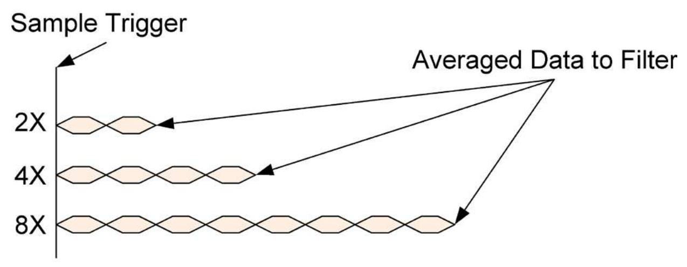

**Figure 3-3. Consecutive Mode of Averaging by EADC**

Spatial mode takes one sample for each sample trigger, and sends averaged data to the filter after the specified number of sample triggers.

<span id="page-115-1"></span>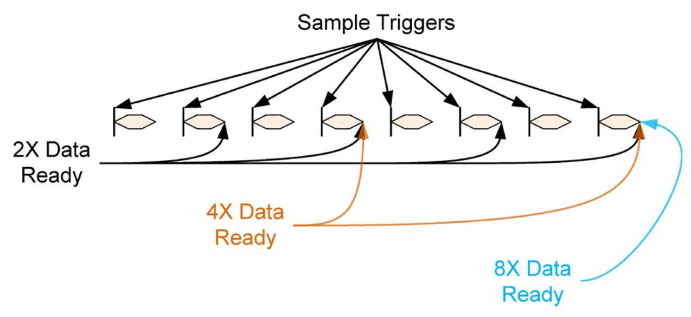

**Figure 3-4. Spatial Mode of Averaging by EADC**

<span id="page-115-2"></span>The average error value can also be read from the EADC Value register:

eadc\_error = FeCtrl0Regs.EADCVALUE.bit.ERROR\_VALUE;

This value will reflect the averaging value if averaging is enabled. Otherwise it will be the same as the raw EADC value mentioned earlier.


Averaging is controlled with the EADC control register. To select Averaging mode, write a 1 into the EADC\_MODE bits:

```
FeCtrl0Regs.EADCCTRL.bit.EADC_MODE = 1; //averaging mode
```

There are 3 bits, giving a total of 8 modes, all of which will be discussed later in this section.

The simplest mode is mode 0 – 1 sample, no averaging.

To select spatial mode, write a 1 to the AVG\_SPATIAL\_EN bit:

```
FeCtrl0Regs.EADCCTRL.bit.AVG_SPATIAL_EN = 1; //spatial averaging mode
```

A 0 in this bit will select continuous mode.

To select which number of samples to average, use the AVG\_MODE\_SEL bits. They work as follows:

```
0 = 2x Averaging (Default)
```

```
1 = 4x Averaging
```

2 = 8x Averaging

```
FeCtrl0Regs.EADCCTRL.bit.AVG_MODE_SEL = 2; //select 8X averaging
```

There is also a weighted average control bit available, which gives more weight to the most recent samples. See [Section](#page-123-2) 3.7 for details.

# *3.1.6 Enabling EADC and Front End*

There are several bits which must all be set to enable the EADC and the entire front end. Most of them are enabled by default. To save power and reduce noise, the default bits can be cleared if the EADC is not being used.

The enable bits for EADC 0 are:

```
FeCtrl0Regs.EADCCTRL.bit.EADC_ENA = 1; //1 is default
FeCtrl0Regs.EADCCTRL.bit.SCFE_ENA = 1; //1 is default
```

Some modules in the Front End can be used without enabling the EADC.

There is also a bit in the Loop Mux which must be set for the Front End 0 to start.

```
LoopMuxRegs.GLBEN.bit.FE_CTRL0_EN = 1; //0 is default
```

The GLBEN register is a special register, with enables for all front ends and all DPWMs in the same register. It is designed to allow simultaneous start up of all front ends and DPWMs, by writing to the whole register at once. This is very useful for complex topologies where all FET control waveforms need to start up simultaneously to prevent malfunction.

```
union GLBEN_REG glben_temp; //make a temp variable to accumulate desired configuration
glben_temp.bit.FE_CTRL0_EN = 1;
glben_temp.bit.FE_CTRL2_EN = 1;
glben_temp.bit.DPWM0_EN = 1;
glben_temp.bit.DPWM1_EN = 1;
LoopMuxRegs.GLBEN = glben_temp; //enable FE0, FE2, DPWM0, DPWM1
```

The code above makes a temporary variable called glben\_temp, initializes it, and then writes it all to the GLBEN register at once. It is also possible to do this:

```
LoopMuxRegs.GLBEN.all = 0x53; //enable FE0, FE2, DPWM0, DPWM1
```

This is a bit more efficient, but not nearly as readable. The best way would be:

```
#define FE_CTRL0_EN_BIT 0x100
#define FE_CTRL2_EN_BIT 0x400
#define DPWM0_EN_BIT 1
#define DPWM1_EN_BIT 2
LoopMuxRegs.GLBEN.all = FECTRL0_EN_BIT + FE+CTRL2_EN_BIT + DPWM0_EN_BIT +
DPWM1_EN_BIT;
```

Of course, writing to each bit of the register directly would not accomplish a simultaneous start up. This could cause a power supply malfunction. For both DPWM and Front End, both local bits and global bits must be set to enable these peripherals. For a simultaneous startup, it is necessary to set the local bits before writing to the global register.


*Front End DAC* [www.ti.com](http://www.ti.com)

# <span id="page-117-0"></span>**3.2 Front End DAC**

The reference voltage for the Front End is set by the DAC, sometimes called the EADC DAC. This is a 10 bit analog to digital converter, with a nominal step size of 1.5625 millivolts per bit. The DAC input is a unsigned 10 bit number, giving a range from 0 to 1.6 Volts.

In the simplest configuration, the DAC is set by writing to the EADCDAC register:

FeCtrl0Regs.EADCDAC.bit.DAC\_VALUE = 100 \* 16;//set 10 bit DAC to 100 (.15625 Volts)

The 16X multiply is necessary because the DAC logic also supports a 4 bit dither capability.

The DAC\_VALUE bit has 14 total bits - 10 actual DAC bits, and 4 bits that are used for dither:


This dither has a 4 bit counter driven by a selected DWPM signal, which will switch back and forth between 2 DAC values. For example, if the DAC value is set to 100.75 \*16, there will be a 0b11000100 (equivalent to 100) in the 10 DAC bits, and a 0b1100 (equivalent to 12 or 0.75 x 16) in the 4 dither bits.

The dither logic will put out a 100 for 4 counts and 101 for 12 counts. This will give an average of 100.75. Here is the waveform:

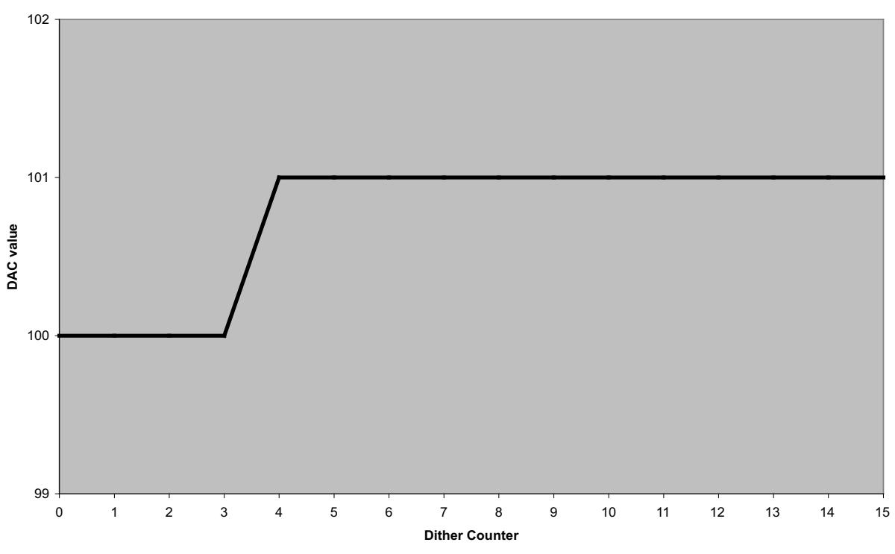

**Figure 3-6. DAC Dither**

<span id="page-117-1"></span>The dither counter will increment at the start of a pulse on DPWMA and/or DPWMB. The specific DPWM pins used are selected in the FECTRLxMUX registers in the Loop Mux.

For example, to set the rising edge of DPWM3B to trigger DAC dither on Front End 2:

```
LoopMuxRegs.FECTRL2MUX.bit.DPWM3_B_TRIG_EN = 1;
//set DPWM3B up to trigger dither.
```

Note that if the DPWM pin is not active, because of anything from a zero filter output to a fault, the dither counter will not be incremented.

To enable dither, the DAC\_DITHER\_EN bit must be set:

```
FeCtrl0Regs.EADCDAC.bit.DAC_VALUE = (int)(100.25 * 16);
```


[www.ti.com](http://www.ti.com) *Ramp Module*

```
//set 10 bit DAC to 100.25 (0.156640625 Volts)
FeCtrl0Regs.EADCDAC.bit.DAC_DITHER_EN = 1;//enable dither
```

The DAC can also be controlled by other DACs, by the output of filters, or by the constant power module.

The External DAC Control register in the Loop Mux can be used to select which DAC source is used.

There are several options:

- 0 = DAC 0 Setpoint Selected
- 1 = DAC 1 Setpoint Selected
- 2 = DAC 2 Setpoint Selected
- 3 = Output of Constant Power Module Selected
- 4 = Filter 0 Output Selected
- 5 = Filter 1 Output Selected
- 6 = Filter 2 Output Selected

LoopMuxRegs.EXTDACCTRL.bit.DAC0\_SEL = 5; //control DAC 0 with Filter 1

To enable external DAC Control, it is also necessary to set the enable bit for the specific DAC:

```
LoopMuxRegs.EXTDACCTRL.bit.EXT_DAC0_EN = 1; //enable external DAC for DAC 0
```

Filter output is used to control the DAC when two filters are used together, typically in average current mode control, where the voltage error goes to a voltage loop filter, and the output of the voltage loop filter controls the DAC for a current loop filter.

The actual value being used for the DAC at any given time can be read from the DAC Status register – DACSTAT.

```
dac_value = FeCtrl0Regs.DACSTAT.bit.DAC_VALUE;
```

# <span id="page-118-0"></span>**3.3 Ramp Module**

The Ramp Module is used to control the EADCDAC for ramp up and ramp down of current and voltage. It is also used to ramp up and down the pulse width of Synchronous Rectifier FET pulses to avoid glitches when enabling and disabling synchronous rectification. Portions of the Ramp Module are also used for Prebias handling. The Ramp module is also used for the ramp compensation in peak current mode. The Ramp module can be used for only one purpose at a time. There are three Ramp modules, one for each front end, so it is possible to have 3 ramp functions running simultaneously.

### <span id="page-118-1"></span>*3.3.1 DAC Ramp Overview*

The Front End Control Module in UCD3138 provides the capability to generate an automated ramp of the DAC set point through hardware. Firmware has the capability to configure the following parameters of the ramp:

- 1. Configurable DAC end value at completion of soft-start or soft-stop ramp
- 2. Configurable DAC step (8.10 format with 10 fractional bits)
- 3. Firmware can program number of switching cycles per DAC step (Configurable from 1-128)
- 4. Configurable number of delay cycles prior to start of ramp (Configurable from 0-65535)
- 5. Ramp can be initiated by one of the following events: firmware start bit, PMBus Control pin, Ramp Delay Completion pulse from another Front End Control Module or Ramp Completion pulse from another Front End Control Module
- 6. Firmware can configure the DAC Saturation Step Size (if EADC is in saturation at time of DAC update, hardware will increment/decrement DAC Value by DAC Saturation Step Size).

### <span id="page-118-2"></span>*3.3.2 DAC Ramp Start and End Points*

The DAC Ramp start point is taken from the EADC DAC Value Register:

```
FeCtrl0Regs.EADCDAC.bit.DAC_VALUE = 0; //start ramp at 0
```


*Ramp Module* [www.ti.com](http://www.ti.com)

### The DAC Ramp end point is taken from the Ramp DAC Ending Value register

```
FeCtrl0Regs.RAMPDACEND.bit.RAMP_DAC_VALUE = 100 * 16;
//set 10 bit DAC to 100 (.15625 Volts)
```

These two values above will lead to a ramp up. Both of these registers are 14 bits, so a dithering value is supported at the beginning and end of the ramp.

The DAC will stay at the end value until something else is asked for. Before another ramp is done, though, this end value should be written to the DAC\_VALUE register so that the ramp will start from the same place.

# <span id="page-119-0"></span>*3.3.3 DAC Ramp Steps*

The DAC Ramp steps are controlled by two bit fields, the Switch Cycles per Step field and the DAC Step register.

The Switch Cycles per Step bits determine how many DPWM inputs are required before 1 step occurs. It has 7 bits, so the register can hold values from 0 to 127, corresponding to 1 to 128 cycles.

The Switch Cycle signal is a DPWM output. The DPWM output used for the Ramp module is the same as the one for dither above:

```
LoopMuxRegs.FECTRL2MUX.bit.DPWM3_B_TRIG_EN = 1;
//set DPWM3B up to trigger dither and ramp modules.
```

The step size is an unsigned value. The Ramp module logic checks the start and end values. If the start value is lower than the end value, the step size is added to the DAC value. If the start value is higher than the end value, the step size is subtracted from the DAC value.

The step size has a 10 bit fractional part, allowing very precise and also very slow ramps. There are 10 fractional bits, below the dither portion of the DAC. There are 8 bits matching the DAC value, including dither.

DAC\_VALUE


DAC\_STEP

**Figure 3-7.**

<span id="page-119-1"></span>There is a register, not visible to the programmer, which retains the sum of the fractional bits between steps.

For instance, suppose that bit 8 was the only bit set in the DAC Step register:

```
FeCtrl0Regs.DACSTEP.bit.DAC_STEP = 0x100; //set bit 8 in DAC_STEP
```

<span id="page-119-2"></span>Every step, 0x100 would be added to the step register. The sequence would look like this:

**Table 3-2.**

| Hidden Step Register | DAC Register |
|----------------------|--------------|
| 0x000100             | 0x0000       |
| 0x000200             | 0x0000       |
| 0x000300             | 0x0000       |
| 0x000400             | 0x0001       |


[www.ti.com](http://www.ti.com) *Ramp Module*

| Hidden Step Register | DAC Register |
|----------------------|--------------|
| 0x000500             | 0x0001       |
| 0x000600             | 0x0001       |
| 0x000700             | 0x0001       |
| 0x000800             | 0x0002       |
| 0x000900             | 0x0002       |
| 0x000A00             | 0x0002       |

**Table 3-2. (continued)**

### *3.3.4 DAC Ramp Start, Interrupts, Start Delay*

DAC Ramp start is controlled by bits in the Ramp Control Register (RAMPCTRL) The DAC Ramp can be started by several events, listed above. These are all clearly described in [Section](#page-123-2) 3.7. The same register also contains a setting for pre-ramp delay, and bits which control interrupts for ramp events.

To enable the Ramp, it is also necessary to set the RAMP\_EN bit in the RAMPCTRL register.

# <span id="page-120-0"></span>*3.3.5 RAMPSTAT Register*

The RAMPSTAT register has bits which indicate ramp completion and other ramp status events. The RAMPCTRL register can also be used to enable interrupts for ramp status events.

# *3.3.6 DAC RAMP when EADC is Saturated*

DACSATSTEP configures the DAC increment/decrement value when the EADC is saturated during the Automated Ramp.

If the EADC is saturated high (Verror = Vref – Vsense), the DAC setpoint is lowered by the DACSATSTEP value. The decrement will continue until the EADC is out of saturation. This decrement when the EADC is in saturation occurs periodically when the DAC would be updated with a new DAC value during the ramp.

If the EADC is saturated low, the DAC setpoint is incremented by the DACSATSTEP value. The increment will continue until the EADC is out of saturation. This increment when the EADC is in saturation occurs periodically when the DAC would be updated with a new DAC value during the ramp.

If the step value is carefully chosen, this mode may help to keep the EADC from saturating during a ramp up. It may, however, make the ramp timing undeterministic and non-monotonic.

# <span id="page-120-1"></span>*3.3.7 Using Ramp Module for Peak Current Mode*

The ramp module is also used for Analog Peak Current Mode (APCM). Normally the PCM\_START\_SEL bit is set so that a filter output is used to drive the starting point of the ramp. The ramp end point is set to a low value so that the ramp will always go downward.

In this mode, the ramp trigger simply starts the ramp. The step comes from the Front End at a 32 nanosecond rate. There is a comparator in the Front End. This comparator compares the ramp value (in the DAC) to the EADC input value. When the EADC input exceeds the ramp value, the APCM fault output of the Front End goes active. This bit can be sent to the DPWM pins via the Loop Mux and Fault Mux.

The Front End drawing omits it for simplicity, but the DAC (and the input to the EADC amplifier) are actually differential. The PCM comparator, however, is single ended. So there is a differential to single ended converter between the DAC and the PCM comparator. This comparator must be enabled for PCM to work. The D2S\_COMP\_EN bit in the EADCCTRL register performs this function.

For additional information consult the reference firmware provided with UCD3138PSFBEVM-029 EVM and TI application note on Phase Shift Full Bridge (Peak Current mode control) implementation.


*Ramp Module* [www.ti.com](http://www.ti.com)

### <span id="page-121-0"></span>*3.3.8 Sync FET Soft On/Off using Ramp Module*

The Sync FET soft on/off can be used to control the on-time of DPWMB in normal mode. DPWMB can be ramped up and down. It can be used in conjunction with digital or analog IDE (Ideal Diode Emulation). These two modules control the width of DPWMB as shown below:

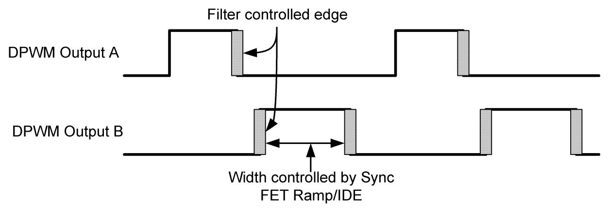

**Figure 3-8. Ideal Diode Emulation (IDE) Module in UCD3138**

<span id="page-121-1"></span>The Sync FET Ramp is similar to the DAC Ramp, and uses the same hardware, but it needs a starting point, which is provided by the SYNC\_FET\_RAMP\_START bits in the RAMPCTRL register. These bits are scaled at 1 high speed clock cycle per bit (nominally 4 nanoseconds). The RAMPDACEND.RAMP\_DAC\_VALUE register is used for the end of the Sync FET Ramp as well, with the same scaling as the start register.

The fractional position of the step size register is the same, which means that bit 10 in the step size register represents a 4 nanosecond step.

All the same start criteria can be used for the Sync FET Ramp. The difference is that the SYNC\_FET\_EN bit is set in the RAMPCTRL register, instead of the RAMP\_EN bit.

The Sync FET ramp only works in normal mode. It cannot be used with Cycle By Cycle (CBC) current limit, or with any form of Peak Current mode. For Sync FET Ramp to work correctly, the rising edge of DPWMB must be controlled by the filter. The falling edge of DPWMB is calculated by the DPWM logic during the update window. When SyncFET ramp is enabled, make sure to place EVT4 at the end of period or zero.

Any DPWM can be driven by any ramp generator, see the DPWM documentation for ramp selection as well.

The Ramp Module is also used in the DAC Ramp and in Prebias, so only one of these functions can be done by each Ramp Module at a time.

Note: Even if the Ramp Module is being used for Sync FET soft on/off, it is not possible to write to the EADCDAC for that front end while the Ramp Module is being used.


# **3.4 Successive Approximation Mode**

The EADC and DAC together can be put into Successive Approximation Mode. The SA module takes control of the DAC and the EADC. It starts at a low gain, and attempts to measure the input voltage on the EADC precisely over the full range. It does this in a manner similar to a successive approximation ADC. Note that multiple samples are taken. If the input signal is changing rapidly, the SA module may not converge.

# <span id="page-122-0"></span>*3.4.1 SAR Control Parameters*

Firmware has the capability to program the following parameters used in the SAR Control algorithm:

- Final SAR Resolution Controls the final AFE Gain setting used at the completion of the SAR process
- **SAR Window 1 Range** If error falls in the range of +/- SAR Window 1 Range, the AFE Gain is incremented to 0x1 as long as Final SAR Resolution does not equal 0x0.
- **SAR Window 2 Range** If error falls in the range of +/- SAR Window 2 Range, the AFE Gain is incremented to 0x2 as long as Final SAR Resolution does not equal 0x1
- **SAR Range** If error falls in the range of +/- SAR Range, the AFE Gain is incremented to 0x3 as long as the Final SAR Resolution does not equal 0x2
- **SAR Mode** SAR algorithm configured in Non-Continuous Mode or Continuous Mode

# <span id="page-122-1"></span>*3.4.2 SAR Algorithm Overview*

Upon initiation of the SAR process, the SAR Control Module sets the AFE gain to the Starting SAR Resolution as programmed by firmware. Initially, the MSB of the 10-bit DAC value is set to '1' or the DAC setpoint is placed at the midpoint of its range. An EADC sample is captured and compared. Based on the polarity and magnitude of the EADC error, the AFE gain and DAC setpoint are adjusted.

# <span id="page-122-2"></span>*3.4.3 Non-Continuous SAR Mode*

UCD3138 features two modes when it attempts to use a SAR algorithm to determine an absolute voltage. The first mode is Non-Continuous SAR mode. In this mode, the SAR Control Module restarts the SAR algorithm on each sample trigger from the DPWM module. Upon receipt of a sample trigger from the DPWM modules, a new EADC sample is requested at an AFE gain of 0x0 and the DAC setpoint is reset to midpoint.

The Non-Continuous SAR Mode minimizes power consumption by only running the Analog Front End when a new measurement is needed. The SAR Control Module reruns the entire SAR algorithm on every sample trigger, which may add latency to the acquisition of the absolute voltage value compared to continuous mode.

# <span id="page-122-3"></span>*3.4.4 Continuous SAR Mode*

Continuous SAR Mode configures the SAR Control Module to continually acquire new EADC samples from the Analog Front. Upon receipt of a new sample trigger from the DPWM modules, if the error is within the final SAR window, a new absolute voltage can be generated quickly since the algorithm does not need to reset the DAC setpoint to midpoint and lower the AFE Gain to 0x0.

The result of the SAR calculation can be read from the EADC value register. To check for EADC overflow, read the EADC\_SAT\_HIGH and EADC\_SAT\_LOW bits in the same register:

```
if((FeCtrl0Regs.EADCVALUE.bit.EADC_SAT_HIGH
&& FeCtrl0Regs.EADCVALUE.bit.EADC_SAT_LOW) == 0)
{
eadc_absolute = FeCtrl0Regs.EADCVALUE.bit.ABS_VALUE;
}
else
{
//adjust EADCDAC and try again
}
```


# <span id="page-123-0"></span>**3.5 Absolute Value Without SAR**

It is also possible to get absolute value data from the EADC without using SAR mode. For accurate data in this case, the Error ADC has to be within range of the EADC DAC setting.

Vabs = Veadcdac + Veadc

If EADC averaging is used, the average EADC value will be used to calculate the absolute value.

### <span id="page-123-1"></span>**3.6 EADC Modes**

There are several other front end modes for different applications.

The complete list is as follows:

- 0 = Standard mode, EADC samples based on sample triggers from DPWM module (Default)
- 1 = Averaging Mode, configured by AVG\_MODE\_SEL
- 2 = Non-continuous SAR Mode
- 3 = Continuous SAR Mode
- 4 = Reserved
- 5 = Digital Peak Current Mode
- 6 = Constant Power/Constant Current Control Mode (CPCC module controls switching between Standard Mode and Non-Continuous SAR Mode)
- 7 = Constant Power/Constant Current Control 2 Mode (CPCC module controls switching between Standard mode and Continuous SAR Mode)

# <span id="page-123-2"></span>**3.7 Front End Control Registers**

Registers for Front End Control modules 0-2 are identical in their bit definitions.

# <span id="page-123-3"></span>*3.7.1 Ramp Control Register (RAMPCTRL)*

Address 0x0008\_0000 – Front End Control 2 Ramp Control Register

Address 0x000B\_0000 – Front End Control 1 Ramp Control Register

Address 0x000E\_0000 – Front End Control 0 Ramp Control Register

**Figure 3-9. Ramp Control Register (RAMPCTRL)**

<span id="page-123-4"></span>

| 29              |                       |        |                   |                      |                     |                    | 16                |
|-----------------|-----------------------|--------|-------------------|----------------------|---------------------|--------------------|-------------------|
|                 | SYNC_FET_RAMP_START   |        |                   |                      |                     |                    |                   |
|                 | R/W-00 0000 0000 0000 |        |                   |                      |                     |                    |                   |
| 15              |                       | 13     | 12                | 11                   | 10                  | 9                  | 8                 |
|                 | Reserved              |        | RAMP_SAT<br>_EN   | RAMP_COMP<br>_INT_EN | RAMP_DLY<br>_INT_EN | PREBIAS_INT<br>_EN | PCM_START<br>_SEL |
|                 | R-00                  |        |                   | R/W-0                | R/W-0               | R/W-0              | R/W-0             |
| 7               | 6                     | 5      | 4                 | 3                    | 2                   | 1                  | 0                 |
| SYNC_FET<br>_EN | MASTER_SEL            |        | SLAVE_COMP<br>_EN | SLAVE_DELAY<br>_EN   | CONTROL_EN          | FIRMWARE<br>_START | RAMP_EN           |
| R/W-0           |                       | R/W-00 | R/W-0             | R/W-0                | R/W-0               | R/W-0              | R/W-0             |

**Table 3-3. Ramp Control Register (RAMPCTRL) Register Field Descriptions**

<span id="page-123-5"></span>

| Bit   | Field                   | Type | Reset                   | Description                                                                                                   |
|-------|-------------------------|------|-------------------------|---------------------------------------------------------------------------------------------------------------|
| 29-16 | SYNC_FET<br>_RAMP_START | R/W  | 00 0000<br>0000<br>0000 | Provides the starting value for the SyncFET Ramp with a resolution of High<br>Frequency Oscillator Period/bit |
| 15-13 | Reserved                | R    | 00                      |                                                                                                               |


**Table 3-3. Ramp Control Register (RAMPCTRL) Register Field Descriptions (continued)**

| Bit | Field                | Type | Reset | Description                                                                                                                                                                                                                                                                                                                                                                                   |  |
|-----|----------------------|------|-------|-----------------------------------------------------------------------------------------------------------------------------------------------------------------------------------------------------------------------------------------------------------------------------------------------------------------------------------------------------------------------------------------------|--|
| 12  | RAMP_SAT_EN          | R/W  | 0     | Enables addition or subtraction of DAC Saturation Step when EADC is in saturation.<br>0 = DAC Saturation Step logic is disabled, DAC incremented/decremented by value<br>calculated by Ramp logic when EADC is in saturation (Default)<br>1 = DAC Saturation Step logic is enabled, DAC incremented/decremented by value<br>stored in DAC Saturation Step register when EADC is in saturation |  |
| 11  | RAMP_COMP<br>_INT_EN | R/W  | 0     | Enables Ramp I/F Interrupt when soft-start/power-down ramp procedure is complete<br>0 = Soft-start/Power-Down Ramp Complete Interrupt is disabled (Default)<br>1 = Soft-start/Power-Down Ramp Complete Interrupt is enabled                                                                                                                                                                   |  |
| 10  | RAMP_DLY<br>_INT_EN  | R/W  | 0     | Enables Ramp I/F Interrupt when ramp delay procedure is complete<br>0 = Soft-start/Power-Down Ramp Delay Complete Interrupt is disabled (Default)<br>1 = Soft-start/Power-Down Ramp Delay Complete Interrupt is enabled                                                                                                                                                                       |  |
| 9   | PREBIAS_INT_EN       | R/W  | 0     | Enables Ramp I/F Interrupt when Pre-Bias procedure is completed<br>0 = Pre-bias Complete Interrupt is disabled (Default)<br>1 = Pre-bias Complete Interrupt is enabled                                                                                                                                                                                                                        |  |
| 8   | PCM_START_SEL        | R/W  | 0     | Peak Current Mode Ramp Start Value Select<br>0 = Ramp starts from value programmed in DAC_VALUE bits in<br>EADC_DAC_VALUE Register (Default)<br>1 = Ramp starts from filter output selected by PCM_FILTER_SEL bits in Loop Mux<br>register PCMCTRL                                                                                                                                            |  |
| 7   | SYNC_FET_EN          | R/W  | 0     | Enables SyncFET Ramp Operation<br>0 = SyncFET Ramp Operation disabled (Default)<br>1 = SyncFET Ramp Operation enabled                                                                                                                                                                                                                                                                         |  |
| 6-5 | MASTER_SEL           | R/W  | 00    | Selects Master Ramp I/F in slave mode<br>0 = Front End Control 0 acts as master (Default)<br>1 = Front End Control 1 acts as master<br>2 = Front End Control 2 acts as master                                                                                                                                                                                                                 |  |
| 4   | SLAVE_COMP<br>_EN    | R/W  | 0     | Enables syncing of ramp start to Master Ramp I/F Complete pulse<br>0 = Ramp initiated by Master Ramp Complete pulse disabled (Default)<br>1 = Ramp initiated by Master Ramp Complete pulse enabled                                                                                                                                                                                            |  |
| 3   | SLAVE_DELAY<br>_EN   | R/W  | 0     | Enables syncing of ramp start to Master Ramp I/F Delay Complete pulse<br>0 = Ramp initiated by Master Ramp Delay Complete pulse disabled (Default)<br>1 = Ramp initiated by Master Ramp Delay Complete pulse enabled                                                                                                                                                                          |  |
| 2   | CONTROL_EN           | R/W  | 0     | Enables PMBus Control line to initiate ramp<br>0 = PMBus Control does not initiate ramp (Default)<br>1 = PMBus Control initiates ramp                                                                                                                                                                                                                                                         |  |
| 1   | FIRMWARE<br>_START   | R/W  | 0     | Ramp start bit, self-clearing by ramp logic<br>0 = No ramp sequence initiated by firmware (Default)<br>1 = Ramp sequence initiated by firmware                                                                                                                                                                                                                                                |  |
| 0   | RAMP_EN              | R/W  | 0     | Enable Ramp Logic (Pre-biasing should be disabled before asserting ramp, bit 16 of<br>Pre-Bias Control Register)<br>0 = No soft start or power-down ramp controlled by hardware (Default)<br>1 = Enables hardware control of soft start or power-down ramp                                                                                                                                    |  |


### <span id="page-125-0"></span>*3.7.2 Ramp Status Register (RAMPSTAT)*

Address 0x0008\_0004 – Front End Control 2 Ramp Status Register

Address 0x000B\_0004 – Front End Control 1 Ramp Status Register

Address 0x000E\_0004 – Front End Control 0 Ramp Status Register

**Figure 3-10. Ramp Status Register (RAMPSTAT)**

<span id="page-125-1"></span>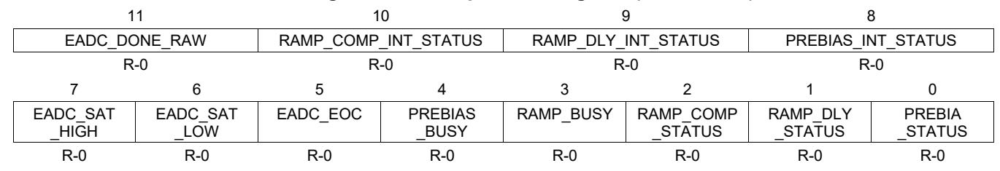

**Table 3-4. Ramp Status Register (RAMPSTAT) Register Field Descriptions**

<span id="page-125-2"></span>

| Bit | Field                    | Type | Reset | Description                                                                                                                     |
|-----|--------------------------|------|-------|---------------------------------------------------------------------------------------------------------------------------------|
| 11  | EADC_DONE<br>_RAW        | R    | 0     | EADC Conversion Done Raw Status<br>0 = EADC Conversion has not completed<br>1 = EADC Conversion has completed                   |
| 10  | RAMP_COM<br>P_INT_STATUS | R    | 0     | Ramp Delay Complete latched status<br>0 = No Ramp Delay Complete has been declared<br>1 = Ramp Delay Complete has been declared |
| 9   | RAMP_DLY_INT<br>_STATUS  | R    | 0     | Ramp Delay Complete latched status<br>0 = No Ramp Delay Complete has been declared<br>1= Ramp Delay Complete has been declared  |
| 8   | PREBIAS_INT<br>_STATUS   | R    | 0     | Pre-Bias Complete latched status<br>0 = No Pre-Bias Complete has been declared<br>1 = Pre-Bias Complete has been declared       |
| 7   | EADC_SAT_HIGH            | R    | 0     | EADC Saturation High Indicator<br>0 = EADC output is not saturated at high limit<br>1 = EADC output is saturated at high limit  |
| 6   | EADC_SAT_LOW             | R    | 0     | EADC Saturation Low Indicator<br>0 = EADC output is not saturated at low limit<br>1 = EADC output is saturated at low limit     |
| 5   | EADC_EOC                 | R    | 0     | Indicates EADC end of conversion                                                                                                |
| 4   | PREBIAS_BUSY             | R    | 0     | Pre-Bias Busy<br>0 = Pre-Bias is not in progress<br>1 = Pre-Bias in progress                                                    |
| 3   | RAMP_BUSY                | R    | 0     | Ramp Busy<br>0 = Soft-Start/Power-Down Ramp is not in progress<br>1 = Soft-Start/Power-Down Ramp is in progress                 |
| 2   | RAMP_COMP<br>_STATUS     | R    | 0     | Ramp Complete, Raw Status<br>0 = Ramp procedure is not complete<br>1 = Ramp procedure is complete                               |
| 1   | RAMP_DLY<br>_STATUS      | R    | 0     | Ramp Delay Complete, Raw Status<br>0 = Ramp delay procedure is not complete<br>1 = Ramp delay procedure is complete             |
| 0   | PREBIAS<br>_STATUS       | R    | 0     | Pre-Bias Complete, Raw Status<br>0 = Pre-Bias is not completed<br>1 = Pre-Bias is completed                                     |


### <span id="page-126-0"></span>*3.7.3 Ramp Cycle Register (RAMPCYCLE)*

Address 0x0008\_0008 – Front End Control 2 Ramp Cycle Register

Address 0x000B\_0008 – Front End Control 1 Ramp Cycle Register

Address 0x000E\_0008 – Front End Control 0 Ramp Cycle Register

**Figure 3-11. Ramp Cycle Register (RAMPCYCLE)**

<span id="page-126-1"></span>23 8 DELAY\_CYCLES R/W-0000 0000 0000 0000 7 6 0 Reserved SWITCH\_CYC\_PER\_STEP

R-0 R/W-000 0000

LEGEND: R/W = Read/Write; R = Read only; -*n* = value after reset

### **Table 3-5. Ramp Cycle Register (RAMPCYCLE) Register Field Descriptions**

<span id="page-126-2"></span>

| Bit  | Field                   | Type | Reset                        | Description                                                                                                                                                                                                                                                                                                                                                                                                                                                                                         |
|------|-------------------------|------|------------------------------|-----------------------------------------------------------------------------------------------------------------------------------------------------------------------------------------------------------------------------------------------------------------------------------------------------------------------------------------------------------------------------------------------------------------------------------------------------------------------------------------------------|
| 23-8 | DELAY_CYCLES            | R/W  | 0000<br>0000<br>0000<br>0000 | Configures the number of delay cycles before an initiation of ramp sequence. Each<br>delay cycle consists of n switching cycles, as specified by<br>SWITCH_CYC_PER_STEP (Bits 6-0). Number of delay cycles can vary from 0 to<br>65535<br>0 = Ramp starts without delay (Default)<br>1 = Ramp starts after (1*SWITCH_CYC_PER_STEP) switching cycles<br>2 = Ramp starts after (2*SWITCH_CYC_PER_STEP) switching cycles<br><br>65535 = Ramp starts after (65535*SWITCH_CYC_PER_STEP) switching cycles |
| 7    | Reserved                | R    | 0                            |                                                                                                                                                                                                                                                                                                                                                                                                                                                                                                     |
| 6-0  | SWITCH_CYC<br>_PER_STEP | R/W  | 000 0000                     | Selects number of switching cycles per DAC step. Number of subcycles can vary<br>from 1 to 128.<br>0 = 1 switching cycle per step (Default)                                                                                                                                                                                                                                                                                                                                                         |
|      |                         |      |                              | 1 = 2 subcycles per cycle                                                                                                                                                                                                                                                                                                                                                                                                                                                                           |
|      |                         |      |                              | 2 = 3 subcycles per cycle                                                                                                                                                                                                                                                                                                                                                                                                                                                                           |
|      |                         |      |                              | <br>127 = 128 subcycles per cycle                                                                                                                                                                                                                                                                                                                                                                                                                                                                   |


### <span id="page-127-0"></span>*3.7.4 EADC DAC Value Register (EADCDAC)*

Address 0x0008\_000C – Front End Control 2 EADC DAC Value Register

Address 0x000B\_000C – Front End Control 1 EADC DAC Value Register

Address 0x000E\_000C – Front End Control 0 EADC DAC Value Register

#### **Figure 3-12. EADC DAC Value Register (EADCDAC)**

15 14 13 0

| DAC_DITHER_EN | Reserved | DAC_VALUE             |
|---------------|----------|-----------------------|
| R/W-0         | R-0      | R/W-00 1111 1111 0000 |

LEGEND: R/W = Read/Write; R = Read only; -*n* = value after reset

### **Table 3-6. EADC DAC Value Register (EADCDAC) Register Field Descriptions**

<span id="page-127-1"></span>

| Bit  | Field         | Type | Reset                   | Description                                                                               |
|------|---------------|------|-------------------------|-------------------------------------------------------------------------------------------|
| 15   | DAC_DITHER_EN | R/W  | 0                       | DAC Dithering Enable<br>0 = DAC Dithering disabled (Default)<br>1 = DAC Dithering enabled |
| 14   | Reserved      | R    | 0                       |                                                                                           |
| 13-0 | DAC_VALUE     | R/W  | 00 1111<br>1111<br>0000 | Programmable DAC Value, effective LSB equals 0.09765625mV                                 |


### <span id="page-128-0"></span>*3.7.5 Ramp DAC Ending Value Register (RAMPDACEND)*

Address 0x0008\_0010 – Front End Control 2 Ramp DAC Ending Register

Address 0x000B\_0010 – Front End Control 1 Ramp DAC Ending Register

Address 0x000E\_0010 – Front End Control 0 Ramp DAC Ending Register

### **Figure 3-13. Ramp DAC Ending Value Register (RAMPDACEND)**

13 0

RAMP\_DAC\_VALUE

R/W-00 0000 0000 0000

**Table 3-7. Ramp DAC Ending Value Register (RAMPDACEND) Register Field Descriptions**

<span id="page-128-1"></span>

| Bit  | Field              | Type | Reset                   | Description                                                 |
|------|--------------------|------|-------------------------|-------------------------------------------------------------|
| 13-0 | RAMP_DAC<br>_VALUE | R/W  | 00 0000<br>0000<br>0000 | Programmable Ramp Ending DAC Value, LSB equals 0.09765625mV |


### <span id="page-129-0"></span>*3.7.6 DAC Step Register (DACSTEP)*

Address 0x0008\_0014 – Front End Control 2 DAC Step Register

Address 0x000B\_0014 – Front End Control 1 DAC Step Register

Address 0x000E\_0014 – Front End Control 0 DAC Step Register

#### **Figure 3-14. DAC Step Register (DACSTEP)**

17 0

DAC\_STEP

R/W-00 0000 0000 0000 0000

<span id="page-129-1"></span>LEGEND: R/W = Read/Write; R = Read only; -*n* = value after reset

### **Table 3-8. DAC Step Register (DACSTEP) Register Field Descriptions**

<span id="page-129-2"></span>

| Bit  | Field    | Type | Reset                           | Description                                                                                                                                                                                                         |
|------|----------|------|---------------------------------|---------------------------------------------------------------------------------------------------------------------------------------------------------------------------------------------------------------------|
| 17-0 | DAC_STEP | R/W  | 00 0000<br>0000<br>0000<br>0000 | Programmable 18-bit unsigned DAC Step. Bits 17:10 represent the real portion of the<br>DAC Step (0-255 DAC counts at bit resolution of 0.09765625mV). Bits 9:0 represent<br>the fractional portion of the DAC Step. |


# <span id="page-130-0"></span>*3.7.7 DAC Saturation Step Register (DACSATSTEP)*

Address 0x0008\_0018 – Front End Control 2 DAC Saturation Step Register

Address 0x000B\_0018 – Front End Control 1 DAC Saturation Step Register

Address 0x000E\_0018 – Front End Control 0 DAC Saturation Step Register

# **Figure 3-15. DAC Saturation Step Register (DACSATSTEP)**

<span id="page-130-1"></span>13 0

DAC\_SAT\_STEP

R/W-00 0000 0000 0000 0000

**Table 3-9. DAC Saturation Step Register (DACSATSTEP) Register Field Descriptions**

<span id="page-130-2"></span>

| Bit  | Field        | Type | Reset                   | Description                                                                                                                                                                                                                                                                |
|------|--------------|------|-------------------------|----------------------------------------------------------------------------------------------------------------------------------------------------------------------------------------------------------------------------------------------------------------------------|
| 13-0 | DAC_SAT_STEP | R/W  | 00 0000<br>0000<br>0000 | Programmable DAC Saturation Step, LSB equals 0.009765625mV<br>0 = DAC not adjusted on EADC saturation during ramp (Default)<br>1 = DAC adjusted by 1 DAC count on EADC saturation during ramp<br><br>1023 = DAC adjusted by 1023 DAC counts on EADC saturation during ramp |


# <span id="page-131-0"></span>*3.7.8 EADC Trim Register (EADCTRIM) – (For Factory Test Use Only)*

Address 0x0008\_001C – Front End Control 2 EADC Trim Register

Address 0x000B\_001C – Front End Control 1 EADC Trim Register

Address 0x000E\_001C – Front End Control 0 EADC Trim Register

### **Figure 3-16. EADC Trim Register (EADCTRIM)**

<span id="page-131-1"></span>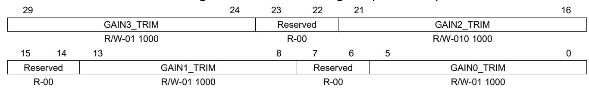

LEGEND: R/W = Read/Write; R = Read only; -*n* = value after reset

### **Table 3-10. EADC Trim Register (EADCTRIM) Register Field Descriptions**

<span id="page-131-2"></span>

| Bit   | Field      | Type | Reset   | Description                                                                                                      |
|-------|------------|------|---------|------------------------------------------------------------------------------------------------------------------|
| 29-24 | GAIN3_TRIM | R/W  | 01 1000 | Sets trim for 8X AFE Gain. Register will be programmed during test and should not<br>be overwritten by firmware  |
| 23-22 | Reserved   | R    | 00      |                                                                                                                  |
| 21-16 | GAIN2_TRIM | R/W  | 01 1000 | Sets trim for 4X AFE Gain. Register will be programmed during test and should not<br>be overwritten by firmware. |
| 15-14 | Reserved   | R    | 00      |                                                                                                                  |
| 13-8  | GAIN1_TRIM | R/W  | 01 1000 | Sets trim for 2X AFE Gain. Register will be programmed during test and should not<br>be overwritten by firmware. |
| 7-6   | Reserved   | R    | 00      |                                                                                                                  |
| 5-0   | GAIN0_TRIM | R/W  | 01 1000 | Sets trim for 1X AFE Gain. Register will be programmed during test and should not<br>be overwritten by firmware. |


# <span id="page-132-0"></span>*3.7.9 EADC Control Register (EADCCTRL)*

Address 0x0008\_0020 – Front End Control 2 EADC Control Register

Address 0x000B\_0020 – Front End Control 1 EADC Control Register

Address 0x000E\_0020 – Front End Control 0 EADC Control Register

**Figure 3-17. EADC Control Register (EADCCTRL)**

<span id="page-132-1"></span>

| 28        |                             | 27                     | 26                |                          | 25                 |                 | 24        |  |
|-----------|-----------------------------|------------------------|-------------------|--------------------------|--------------------|-----------------|-----------|--|
|           | D2S_COMP_EN<br>EN_HYST_HIGH |                        |                   | EN_HYST_LOW              |                    | SAMP_TRIG_SCALE |           |  |
| R/W-0     |                             | R/W-0                  | R/W-0             |                          | R/W-0000           |                 |           |  |
| 23        | 22                          | 21                     | 20                | 19                       |                    |                 | 16        |  |
|           | SAMP_TRIG_SCALE             | FRAME_SYNC<br>_EN      | SCFE_CNT<br>_RST  | SCFE_CNT_INIT            |                    |                 |           |  |
|           | R/W-0000                    | R/W-0                  | R/W-0             | R/W-0000                 |                    |                 |           |  |
| 15        | 14                          | 13                     | 12                | 11                       | 10                 | 9               | 8         |  |
| EADC_INV  | AUTO_GAIN<br>_SHIFT_MODE    | AUTO_GAIN<br>_SHIFT_EN | AVG_WEIGHT<br>_EN | AVG_SPATIAL<br>_EN       |                    | AVG_MODE_SEL    | EADC_MODE |  |
| R/W-0     | R/W-0                       |                        | R/W-0             | R/W-0                    |                    | R/W-00          | R/W-000   |  |
| 7         | 6                           |                        | 4                 | 3                        | 2                  | 1               | 0         |  |
| EADC_MODE |                             | AFE_GAIN               |                   | SCFE_GAIN<br>_FILTER_SEL | SCFE_CLK<br>_DIV_2 | SCFE_ENA        | EADC_ENA  |  |
| R/W-000   |                             | R/W-11                 |                   | R/W-1                    | R/W-1              | R/W-1           | R/W-1     |  |
|           |                             |                        |                   |                          |                    |                 |           |  |

**Table 3-11. EADC Control Register (EADCCTRL) Register Field Descriptions**

| Bit   | Field               | Type | Reset | Description                                                                                                                                                                                                                                                                                                                                                                      |
|-------|---------------------|------|-------|----------------------------------------------------------------------------------------------------------------------------------------------------------------------------------------------------------------------------------------------------------------------------------------------------------------------------------------------------------------------------------|
| 28    | D2S_COMP_EN         | R/W  | 0     | Analog Front End Ramp Comparator Enable<br>0 = Analog Front End Ramp Comparator disabled (Default)<br>1 = Analog Front End Ramp Comparator enabled                                                                                                                                                                                                                               |
| 27    | EN_HYST_HIGH        | R/W  | 0     | Increase comparator trip point by ~70mV<br>0 = Disables increase of ramp comparator trip point (Default)<br>1 = Enables increase of ramp comparator trip point                                                                                                                                                                                                                   |
| 26    | EN_HYST_LOW         | R/W  | 0     | Decrease comparator trip point by ~70mV<br>0 = Disables decrease of ramp comparator trip point (Default)<br>1 = Enables decrease of ramp comparator trip point                                                                                                                                                                                                                   |
| 25-22 | SAMP_TRIG<br>_SCALE | R/W  | 0000  | Provides capability to mask incoming sample triggers to Front End Control<br>0 = EADC conversion initiated on every received sample trigger (Default)<br>1 = EADC conversion initiated once every 2 received sample triggers<br>2 = EADC conversion initiated once every 3 received sample triggers<br><br>15 = EADC conversion initiated once every 16 received sample triggers |
| 21    | FRAME_SYNC<br>_EN   | R/W  | 0     | Enable synchronization of switched cap front end counter to Switching Cycle Frame<br>boundary<br>0 = Switch Cap Front End Counter not synchronized to frame (Default)<br>1 = Switch Cap Front End Counter synchronized to frame boundary                                                                                                                                         |
| 20    | SCFE_CNT_RST        | R/W  | 0     | Force reset of Switched Cap Front End Counter<br>0 = Switch Cap Front End Counter operational (Default)<br>1 = Switch Cap Front End Counter reset                                                                                                                                                                                                                                |
| 19-16 | SCFE_CNT_INIT       | R/W  | 0000  | Configures initial Switched Cap Front End Counter value out of reset or at start of<br>switching cycle in Peak Current mode                                                                                                                                                                                                                                                      |
| 15    | EADC_INV            | R/W  | 0     | Enables EADC Data Inversion on data to filter module<br>0 = EADC Data is not inverted (Default) 1 = EADC Data Inverted                                                                                                                                                                                                                                                           |


**Table 3-11. EADC Control Register (EADCCTRL) Register Field Descriptions (continued)**

| Bit  | Field                    | Type | Reset | Description                                                                                                                                                                                                                                                                                                                                                                                                                                                                                                                                               |  |  |
|------|--------------------------|------|-------|-----------------------------------------------------------------------------------------------------------------------------------------------------------------------------------------------------------------------------------------------------------------------------------------------------------------------------------------------------------------------------------------------------------------------------------------------------------------------------------------------------------------------------------------------------------|--|--|
| 14   | AUTO_GAIN<br>_SHIFT_MODE | R/W  | 0     | Configures Automatic Gain Shifting mode<br>0 = Fixed mode, gain shifting dependent on saturation of EADC for decreasing gain<br>and less than 1/4 of dynamic range for increasing gain (Default)<br>1 = NL mode, gain shifting dependent on Non-Linear limit thresholds                                                                                                                                                                                                                                                                                   |  |  |
| 13   | AUTO_GAIN<br>_SHIFT_EN   | R/W  | 0     | Enables Automatic Gain Shifting mode<br>0 = Automatic Gain Shifting Mode disabled (Default)<br>1 = Automatic Gain Shifting Mode enabled                                                                                                                                                                                                                                                                                                                                                                                                                   |  |  |
| 12   | AVG_WEIGHT<br>_EN        | R/W  | 0     | Enables weighted averaging in EADC averaging mode, only applicable in 4x and 8x<br>averaging mode. For 4x averaging, two oldest samples are each weighted by 1/8,<br>the next oldest sample has a weight of ¼ and the newest sample is weighted by ½.<br>For 8x averaging, the four oldest samples are each weighted by 1/16, the next 2<br>oldest samples are weighted by 1/8, and the two newest samples are weighted by<br>1/4.<br>0 = Weighted averaging disabled (Default)<br>1 = Weighted averaging enabled                                         |  |  |
| 11   | AVG_SPATIAL<br>_EN       | R/W  | 0     | Enables spatial mode in EADC averaging mode<br>0 = Consecutive EADC samples averaged based on every received sample trigger<br>from DPWM modules (Default)<br>1 = EADC samples averaged based on received sample triggers from DPWM<br>modules. 2 sample triggers required for a single averaged sample to filter. 4 sample<br>triggers required for a single averaged sample to filter module                                                                                                                                                            |  |  |
| 10-9 | AVG_MODE_SEL             | R/W  | 00    | Averaging Mode Configuration<br>0 = 2x Averaging (Default)<br>1 = 4x Averaging<br>2 = 8x Averaging                                                                                                                                                                                                                                                                                                                                                                                                                                                        |  |  |
| 8-6  | EADC_MODE                | R/W  | 000   | Selects EADC Mode Operation<br>0 = Standard mode, EADC samples based on sample triggers from DPWM module<br>(Default)<br>1 = Averaging Mode, configured by AVG_MODE_SEL 2 = Non-continuous SAR<br>Mode 3 = Continuous SAR Mode<br>4 = Reserved<br>5 = Peak Current Mode<br>6 = Constant Power/Constant Current Control Mode (CPCC module controls<br>switching between Standard Mode and Non-Continuous SAR Mode)<br>7 = Constant Power/Constant Current Control 2 Mode (CPCC module controls<br>switching between Standard mode and Continuous SAR Mode) |  |  |
| 5-4  | AFE_GAIN                 | R/W  | 11    | AFE Front End Gain Setting<br>0 = 1x Gain, 8mV/LSB<br>1 = 2x Gain, 4mV/LSB<br>2 = 4x Gain, 2mV/LSB<br>3 = 8x Gain, 1mV/LSB (Default)                                                                                                                                                                                                                                                                                                                                                                                                                      |  |  |
| 3    | SCFE_GAIN<br>_FILTER_SEL | R/W  | 1     | Switched Cap Noise Filter Enable<br>0 = Disables Switch Cap Noise Filter<br>1 = Enables Switch Cap Noise Filter (Default)                                                                                                                                                                                                                                                                                                                                                                                                                                 |  |  |
| 2    | SCFE_CLK_DIV_2           | R/W  | 1     | Switched Cap Front End Clock Divider Select<br>0 = Switch Cap Period divide by 1 (128 ns nominal sample period)<br>1 = Switch Cap Period divide by 2 (Default – 64 ns nominal sample period)                                                                                                                                                                                                                                                                                                                                                              |  |  |
| 1    | SCFE_ENA                 | R/W  | 1     | Switch Cap Front Enable<br>0 = Disables Switch Cap Front End logic<br>1 = Enables Switch Cap Front End logic (Default)                                                                                                                                                                                                                                                                                                                                                                                                                                    |  |  |
| 0    | EADC_ENA                 | R/W  | 1     | EADC Enable<br>0 = Disables EADC<br>1 = Enables EADC (Default)                                                                                                                                                                                                                                                                                                                                                                                                                                                                                            |  |  |


### <span id="page-134-0"></span>*3.7.10 Analog Control Register (ACTRL) (For Test Use Only)*

Address 0x0008\_0024 – Front End Control 2 Analog Control Register

Address 0x000B\_0024 – Front End Control 1 Analog Control Register

Address 0x000E\_0024 – Front End Control 0 Analog Control Register

### **Figure 3-18. Analog Control Register (ACTRL)**

<span id="page-134-1"></span>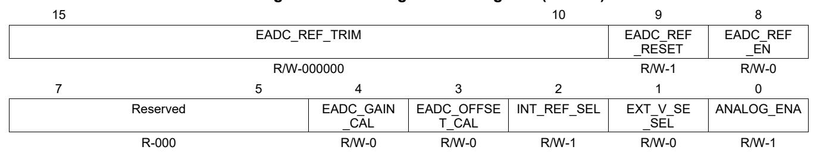

LEGEND: R/W = Read/Write; R = Read only; -*n* = value after reset

## **Table 3-12. Analog Control Register (ACTRL) Register Field Descriptions**

<span id="page-134-2"></span>

| Bit   | Field               | Type | Reset  | Description                                                                                                                                                                                                     |  |
|-------|---------------------|------|--------|-----------------------------------------------------------------------------------------------------------------------------------------------------------------------------------------------------------------|--|
| 15-10 | EADC_REF_TRIM       | R/W  | 000000 | EADC Reference Trim Value. Bits will be programmed during test and should not be<br>overwritten by firmware.                                                                                                    |  |
| 9     | EADC_REF<br>_RESET  | R/W  | 1      | EADC Reference Reset<br>0 = Reference not in reset<br>1 = Resets Reference (Default)                                                                                                                            |  |
| 8     | EADC_REF_EN         | R/W  | 0      | EADC Reference Enable<br>0 = Disables EADC Reference (Default)<br>1 = Enables EADC Reference                                                                                                                    |  |
| 7-5   | Reserved            | R    | 000    |                                                                                                                                                                                                                 |  |
| 4     | EADC_GAIN_CAL       | R/W  | 0      | EADC Gain Calibration Mode Enable<br>0 = Disables Gain Calibration Mode (Default)<br>1 = Enables Gain Calibration Mode                                                                                          |  |
| 3     | EADC_OFFSET<br>_CAL | R/W  | 0      | EADC Offset Calibration Mode Enable<br>0 = Disables Offset Calibration Mode (Default)<br>1 = Enables Offset Calibration Mode                                                                                    |  |
| 2     | INT_REF_SEL         | R/W  | 1      | EADC Reference Select<br>0 = Selects External Reference for EADC from AD8-AD9 pins. In external mode,<br>DAC_P tied to AD8 and DAC_N tied to AD9.<br>1 = Selects Internal Reference for EADC from DAC (Default) |  |
| 1     | EXT_V_SE_SEL        | R/W  | 0      | EADC Select<br>0 = Selects Internal V_SE, output from EADC (Default)<br>1 = Selects External V_SE, bypass EADC                                                                                                  |  |
| 0     | ANALOG_ENA          | R/W  | 1      | Analog Front End Enable<br>0 = Disables Analog Front End<br>1 = Enables Analog Front End (Default)                                                                                                              |  |


# <span id="page-135-0"></span>*3.7.11 Pre-Bias Control Register 0 (PREBIASCTRL0)*

Address 0x0008\_0028 – Front End Control 2 Pre-Bias Control Register 0

Address 0x000B\_0028 – Front End Control 1 Pre-Bias Control Register 0

Address 0x000E\_0028 – Front End Control 0 Pre-Bias Control Register 0

#### **Figure 3-19. Pre-Bias Control Register 0 (PREBIASCTRL0)**

<span id="page-135-1"></span>

| 17               | 16          | 15 |                | 8 | 7 | 0              |
|------------------|-------------|----|----------------|---|---|----------------|
| PRE_BIAS<br>_POL | PRE_BIAS_EN |    | PRE_BIAS_RANGE |   |   | PRE_BIAS_LIMIT |
| R/W-0            | R/W-0       |    | R/W-1111 1111  |   |   | R/W-0000 0000  |

LEGEND: R/W = Read/Write; R = Read only; -*n* = value after reset

### **Table 3-13. Pre-Bias Control Register 0 (PREBIASCTRL0) Register Field Descriptions**

<span id="page-135-2"></span>

| Bit  | Field              | Type | Reset        | Description                                                                                                                                                                                                                                                                                                               |
|------|--------------------|------|--------------|---------------------------------------------------------------------------------------------------------------------------------------------------------------------------------------------------------------------------------------------------------------------------------------------------------------------------|
| 17   | PRE_BIAS_POL       | R/W  | 0            | Configures polarity of received error voltage<br>0 = Error equals Vref-Vin (Default)<br>1 = Error equals Vin-Vref                                                                                                                                                                                                         |
| 16   | PRE_BIAS_EN        | R/W  | 0            | Enable Pre-Biasing of Error ADC (Ramp should be disabled during pre-biasing, bit 0<br>of Ramp Control Register)<br>0 = Pre-Biasing has not been initiated (Default)<br>1 = Pre-Biasing by hardware has been enabled                                                                                                       |
| 15-8 | PRE_BIAS<br>_RANGE | R/W  | 1111<br>1111 | Sets the acceptable range around the zero error point. If Error ADC value stays in<br>range for number of samples specified by PRE_BIAS_LIMIT (Bits 7:0),<br>PREBIAS_STATUS (Bit 0 of Ramp Status Register) is enabled. Range will be +/-<br>PRE_BIAS_RANGE around zero error point.                                      |
| 7-0  | PRE_BIAS_LIMIT     | R/W  | 0000<br>0000 | Sets the acceptable number of samples in which the Error ADC value stays in range<br>before asserting PREBIAS_STATUS (Bit 0 of Ramp Status Register). Counter limit<br>ranges from 0 to 255. If PREBIAS_STATUS is set, it will take PRE_BIAS_LIMIT<br>samples outside of acceptable range before clearing PREBIAS_STATUS. |


# <span id="page-136-0"></span>*3.7.12 Pre-Bias Control Register 1 (PREBIASCTRL1)*

Address 0x0008\_002C – Front End Control 2 Pre-Bias Control Register 1

Address 0x000B\_002C – Front End Control 1 Pre-Bias Control Register 1

Address 0x000E\_002C – Front End Control 0 Pre-Bias Control Register 1

### **Figure 3-20. Pre-Bias Control Register 1 (PREBIASCTRL1)**

<span id="page-136-1"></span>

| 23 |                 | 16 | 15       | 14 |  |  |
|----|-----------------|----|----------|----|--|--|
|    | SAMPLES_PER_ADJ |    | Reserved |    |  |  |
|    | R/W-0000 0000   |    |          |    |  |  |
| 13 |                 |    |          | 0  |  |  |
|    | MAX_DAC_ADJ     |    |          |    |  |  |

R/W-00 0000 0000 0000

LEGEND: R/W = Read/Write; R = Read only; -*n* = value after reset

### **Table 3-14. Pre-Bias Control Register 1 (PREBIASCTRL1) Register Field Descriptions**

<span id="page-136-2"></span>

| Bit   | Field               | Type | Reset                   | Description                                                                                                                                                                                                                                  |  |
|-------|---------------------|------|-------------------------|----------------------------------------------------------------------------------------------------------------------------------------------------------------------------------------------------------------------------------------------|--|
| 23-16 | SAMPLES_PER<br>_ADJ | R/W  | 0000<br>0000            | Configures the number of EADC samples between Pre-Bias DAC setpoint<br>adjustments 0 = DAC Setpoint adjustment on each EADC sample<br>1 = DAC Setpoint adjustment after2 EADC sample<br>2 = DAC Setpoint adjustment after 3 EADC samples<br> |  |
|       |                     |      |                         | 255 = DAC Setpoint adjustment after 256 EADC samples                                                                                                                                                                                         |  |
| 15-14 | Reserved            | R    | 00                      |                                                                                                                                                                                                                                              |  |
| 13-0  | MAX_DAC_ADJ         | R/W  | 00 0000<br>0000<br>0000 | Configures the maximum DAC setpoint adjustment step                                                                                                                                                                                          |  |


### <span id="page-137-0"></span>*3.7.13 SAR Control Register (SARCTRL)*

Address 0x0008\_0030 – Front End Control 2 SAR Control Register

Address 0x000B\_0030 – Front End Control 1 SAR Control Register

Address 0x000E\_0030 – Front End Control 0 SAR Control Register

# **Figure 3-21. SAR Control Register (SARCTRL)**

<span id="page-137-1"></span>

LEGEND: R/W = Read/Write; R = Read only; -*n* = value after reset

### **Table 3-15. SAR Control Register (SARCTRL) Register Field Descriptions**

<span id="page-137-2"></span>

| Bit   | Field              | Type | Reset        | Description                                                                                                                                                                                     |  |
|-------|--------------------|------|--------------|-------------------------------------------------------------------------------------------------------------------------------------------------------------------------------------------------|--|
| 31-24 | EADC_WINDOW<br>_2  | R/W  | 0010<br>1000 | Configures acceptable range of error values to transition to AFE Gain of 2 during<br>SAR process                                                                                                |  |
| 23-16 | EADC_WINDOW<br>_1  | R/W  | 0110<br>0000 | Configures acceptable range of error values to transition to AFE Gain of 1 during<br>SAR process                                                                                                |  |
| 15-8  | SAR_RANGE          | R/W  | 0000<br>0000 | Configures acceptable range of error values before declaring SAR completion                                                                                                                     |  |
| 7-2   | Reserved           | R    | 0000 00      |                                                                                                                                                                                                 |  |
| 1-0   | SAR_<br>RESOLUTION | R/W  | 00           | Configures the final resolution for SAR Conversions<br>0 = 8mV Resolution, 1x AFE Gain<br>1 = 4mV Resolution, 2x AFE Gain<br>2 = 2mV Resolution, 4x AFE Gain<br>3 = 1mV Resolution, 8x AFE Gain |  |


# <span id="page-138-0"></span>*3.7.14 SAR Timing Register (SARTIMING)*

Address 0x0008\_0034 – Front End Control 2 SAR Timing Register

Address 0x000B\_0034– Front End Control 1 SAR Timing Register

Address 0x000E\_0034 – Front End Control 0 SAR Timing Register

**Figure 3-22. SAR Timing Register (SARTIMING)**

<span id="page-138-1"></span>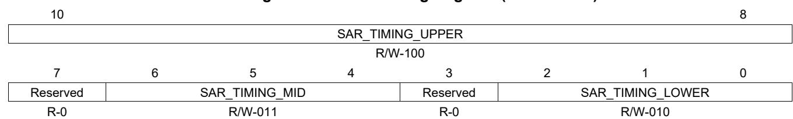

LEGEND: R/W = Read/Write; R = Read only; -*n* = value after reset

### **Table 3-16. SAR Timing Register (SARTIMING) Register Field Descriptions**

<span id="page-138-2"></span>

| Bit  | Field                | Type | Reset | Description                                                      |
|------|----------------------|------|-------|------------------------------------------------------------------|
| 10-8 | SAR_TIMING<br>_UPPER | R/W  | 100   | Configures timing for Bits 9:8 of DAC setpoint for SAR Algorithm |
| 7    | Reserved             | R    | 0     |                                                                  |
| 6-4  | SAR_TIMING_MID       | R/W  | 011   | Configures timing for Bits 7:6 of DAC setpoint for SAR Algorithm |
| 3    | Reserved             | R    | 0     |                                                                  |
| 2-0  | SAR_TIMING<br>_LOWER | R/W  | 010   | Configures timing for Bits 5:0 of DAC setpoint for SAR Algorithm |


### <span id="page-139-0"></span>*3.7.15 EADC Value Register (EADCVALUE)*

Address 0x0008\_0038 – Front End Control 2 EADC Value Register

Address 0x000B\_0038 – Front End Control 1 EADC Value Register

Address 0x000E\_0038 – Front End Control 0 EADC Value Register

**Figure 3-23. EADC Value Register (EADCVALUE)**

<span id="page-139-1"></span>

| 25                |                  |    |           |   | 16              |  |
|-------------------|------------------|----|-----------|---|-----------------|--|
|                   |                  |    | ABS_VALUE |   |                 |  |
|                   |                  |    | R-0       |   |                 |  |
| 15                | 14               | 13 |           | 9 | 8               |  |
| EADC_SAT<br>_HIGH | EADC_SAT<br>_LOW |    | Reserved  |   | ERROR_<br>VALUE |  |
| R-0               | R-0              |    | R-0       |   | R-0             |  |
| 7                 |                  |    |           |   | 0               |  |
|                   | ERROR_VALUE      |    |           |   |                 |  |
|                   |                  |    |           |   |                 |  |

R-0

**Table 3-17. EADC Value Register (EADCVALUE) Register Field Descriptions**

<span id="page-139-2"></span>

| Bit   | Field         | Type | Reset  | Description                                                                                                                    |
|-------|---------------|------|--------|--------------------------------------------------------------------------------------------------------------------------------|
| 25-16 | ABS_VALUE     | R    | 0      | 10-bit Absolute Value calculated by Front End Control Module with a resolution of<br>1.5625mV/bit                              |
| 15    | EADC_SAT_HIGH | R    | 0      | EADC Saturation High Indicator<br>0 = EADC output is not saturated at high limit<br>1 = EADC output is saturated at high limit |
| 14    | EADC_SAT_LOW  | R    | 0      | EADC Saturation Low Indicator<br>0 = EADC output is not saturated at low limit<br>1 = EADC output is saturated at low limit    |
| 13-9  | Reserved      | R    | 00 000 |                                                                                                                                |
| 8-0   | ERROR_VALUE   | R    | 0      | Signed 9-bit Error value measured by Front End Control Module with a resolution of<br>1mV/bit                                  |


#### <span id="page-140-0"></span>*3.7.16 EADC Raw Value Register (EADCRAWVALUE)*

Address 0x0008\_003C – Front End Control 2 EADC Raw Value Register

Address 0x000B\_003C – Front End Control 1 EADC Raw Value Register

Address 0x000E\_003C – Front End Control 0 EADC Raw Value Register

# **Figure 3-24. EADC Raw Value Register (EADCRAWVALUE)**

<span id="page-140-1"></span>8 0

RAW\_ERROR\_VALUE

R-0

**Table 3-18. EADC Raw Value Register (EADCRAWVALUE) Register Field Descriptions**

<span id="page-140-2"></span>

| Bit | Field               | Type | Reset | Description                                                                                                                             |
|-----|---------------------|------|-------|-----------------------------------------------------------------------------------------------------------------------------------------|
| 8-0 | RAW_ERROR<br>_VALUE | R    | 0     | Signed 9-bit Error value measured by Front End Control Module with a resolution of<br>1mV/bit. Value is raw EADC data before averaging. |


### <span id="page-141-0"></span>*3.7.17 DAC Status Register (DACSTAT)*

Address 0x0008\_0040 – Front End Control 2 DAC Status Register

Address 0x000B\_0040 – Front End Control 1 DAC Status Register

Address 0x000E\_0040 – Front End Control 0 DAC Status Register

#### **Figure 3-25. DAC Status Register (DACSTAT)**

9 0

DAC\_VALUE

R-00 0000 0000

<span id="page-141-1"></span>LEGEND: R/W = Read/Write; R = Read only; -*n* = value after reset

### **Table 3-19. DAC Status Register (DACSTAT) Register Field Descriptions**

<span id="page-141-2"></span>

| Bit | Field     | Type | Reset           | Description                      |
|-----|-----------|------|-----------------|----------------------------------|
| 9-0 | DAC_VALUE | R    | 00 0000<br>0000 | Current 10-bit Value sent to DAC |

<span id="page-142-0"></span>

# *Filter*

The UCD3138 filter is a PID filter with many enhancements for power supply control. Some of its features include:

- PID Based Architecture
- Additional α coefficient and history in D branch
- Programmable Non-Linear Limits for automated modification of filter coefficients based on received EADC error
- Multiple coefficient sets fully configurable by firmware
- Full 24-bit precision throughout Filter calculations
- Programmable clamps on Integrator Branch and Filter Output
- Ability to load values into internal filter registers while system is running
- Ability to stall calculations on any of the individual filter branches
- Ability to clear and stall calculations on any of the individual filter branches
- Duty Cycle, Resonant Period, or phase shift generation based on filter output.
- Flux Balancing
- Voltage feed forward

**Topic** ........................................................................................................................... **Page**

| 4.1  | Filter Math Details                | 144 |
|------|------------------------------------|-----|
| 4.2  | Filter Status Register             | 148 |
| 4.3  | Filter Control Register            | 148 |
| 4.4  | XN, YN Read and Write Registers    | 152 |
| 4.5  | Coefficient Configuration Register | 153 |
| 4.6  | Kp, Ki, and Kd Registers           | 155 |
| 4.7  | Alpha Registers                    | 155 |
| 4.8  | Filter Nonlinear Limit Registers   | 155 |
| 4.9  | Clamp Registers                    | 156 |
| 4.10 | Filter Preset Register             | 156 |
| 4.11 | Filter Registers Reference         | 156 |


Filter Math Details www.ti.com

#### <span id="page-143-0"></span>4.1 Filter Math Details

The Filter uses binary arithmetic. In most cases the precision of the results is preserved at the highest level until the rounding/clamping at the output of the filter. The main exception to this is the extra pole, using alpha, which has to round to a decreased resolution immediately. The filter is relatively complex, so scaling is discussed in sections. After the filter math details are described, the registers which control the filter are documented.

# <span id="page-143-1"></span>4.1.1 Filter Input and Branch Calculations

Here is a block diagram of the first part of the filter, with bit width information:

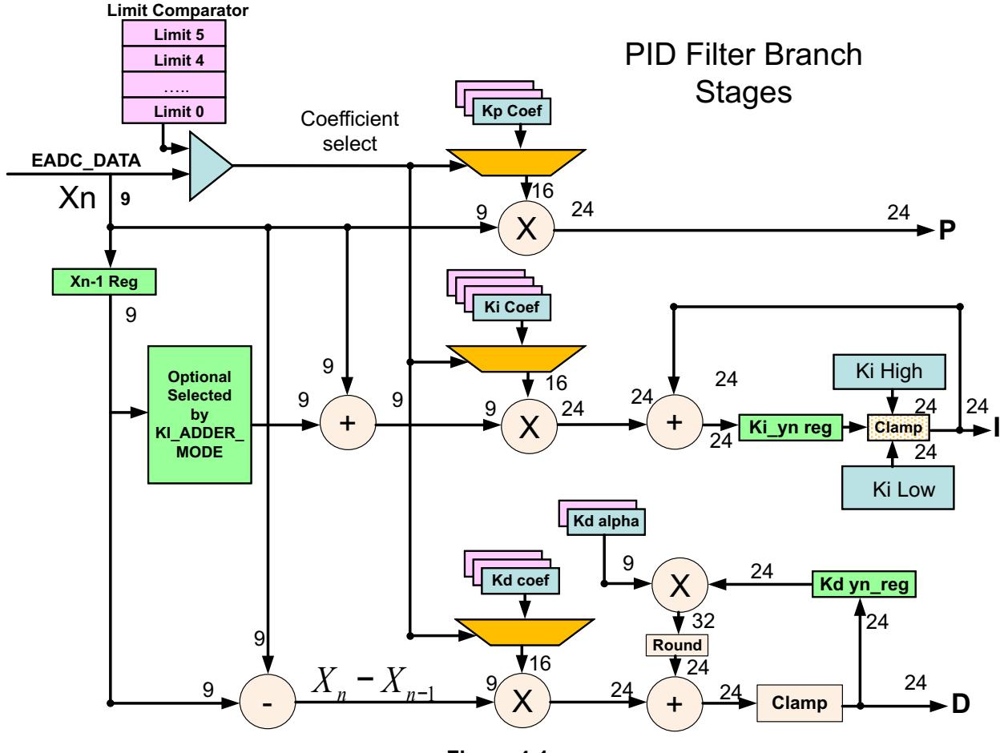

Figure 4-1.

<span id="page-143-2"></span>All values shown in the filter are signed numbers, with the most significant bit going to the sign bit. All are treated as being normalized to 1.

The main input to the filter is a 9 bit signed value from an Error ADC. It is shown on the upper left as Xn. It goes to the input for filter calculations, and it also goes to a digital comparator. The Filter provides for nonlinear calculations, with up to 7 different coefficient sets selected by the Xn value. This can be used to change the compensation of the filter with different input error ranges. For a complete discussion of this feature, see Section 4.3.6.


[www.ti.com](http://www.ti.com) *Filter Math Details*

# <span id="page-144-0"></span>*4.1.2 Proportional Branch*

The Xn value is used directly as an input to the Proportional (P) branch of the filter. It is multiplied by the 16 bit signed Kp coefficient, and the 24 bit result is used as the output of the P branch. When multiplying two signed numbers in binary arithmetic, an extra sign bit is generated. Because of this, 9 bits times 16 bits gives 24 meaningful bits, not 25.

No clamp is needed on the proportional branch. It is self-limiting, because it has no memory. It will never exceed 24 bits. If a lower maximum output is desired from the proportional branch, it can be achieved by reducing the value of Kp.

# <span id="page-144-1"></span>*4.1.3 Integral Branch*

There are two options for the use of Xn in the Integrator (I) input. The current Xn can be used by itself, or the current Xn can be added with the previous Xn-1. Doing the addition provides a trapezoidal approximation, which is sometimes considered theoretically superior to a single point. However, since the output of the adder is also 9 bits, if the Xn and Xn-1 values add up to more than 255 or less than -256, the output of the adder will be clamped at those values.

This will only occur at the lowest gain setting of the Error ADC. So if the lowest gain setting of the EADC is to be used, trapezoidal approximation may cause premature saturation on the input.

The Xn value, or the Xn + Xn-1 sum is multiplied by the Ki coefficient. Note that the trapezoidal mode will normally have double the output of the simple Xn value. This will change the overall gain of the I stage by a factor of two. This must be taken into account if the Xn addition mode is changed.

The output of this multiplication will always fit within 24 bits. This value is then added to the existing I value. The hardware will automatically clamp it at a 24 bit signed number, and there are high and low clamp registers available which can be used to clamp it to lower values. There are also status register bits that will be set if the input value exceeds the clamp.

The clamped value is fed to the next stage of the filter, and is also fed back to be added to the next Xn \* Ki value when it is calculated.

# *4.1.4 Differential Branch*

On the Differential (D) branch, Xn-1 is subtracted from Xn. The difference between the two most recent X values is then multiplied by Kd, giving a 24 bit signed number.

The D branch has an additional pole added after this multiplication, giving more control of the filter response to permit better matching to the power supply plant. This D alpha branch acts as an integrator on the output of the D stage. With each filter calculation, the 24 bit result of the previous D and D alpha calculation is multiplied by the 9 bit Kalpha (Kα). This gives a 32 bit signed result. To match the 24 bit data path, this must be rounded back down to 24 bits. This is the one rounding that actually takes place in the filter before the filter output.

There is also a simple clamp to prevent the K output from going outside a 24 bit signed number. Because of the integral element for the alpha stage, it is possible for it to exceed this range.


*Filter Math Details* [www.ti.com](http://www.ti.com)

### <span id="page-145-0"></span>*4.1.5 Add, Saturate, Scale and Clamp*

Here is a diagram of the next section of the filter:

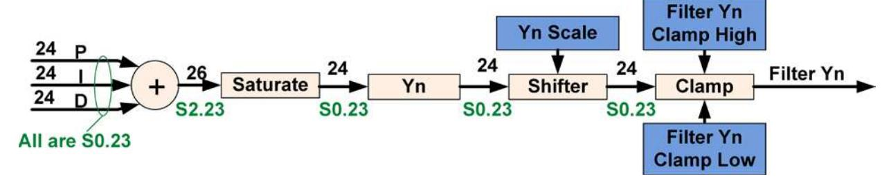

**Figure 4-2.**

<span id="page-145-1"></span>The S0.23 notation means a 24 bit number with 1 sign bits to the left of the binary point and 23 bits to the right of the point, meaning a range from 1 - 2 -23 to -1. 2.23 means a number with 1 sign bit and 2 magnitude bits to the left of the binary point, and 23 magnitude bits to the right.

This section of the filter adds the P, I, and D outputs together, giving a potential 26 bit result. Saturation logic clamps this back down to 24 bits. If the value is above the maximum value for 24 bits, the output of the saturation logic will be set to the maximum (0x7fffff or 8388607) Negative values out of range will be clamped to the most negative value.

The output of the saturation section goes to a programmable shifter which can be programmed for 8 different shifts, including no shift at all. This can be used to compensate for the scaling of the filter coefficients.

After the scaling, there is a clamp with independent clamp high and clamp low values which are set by writing to registers. This clamp also has status bits which are set when the clamp limits are exceeded.

Note however, that there is no saturation unit at this point. Bits over 24 are simply truncated and ignored. If the shifter is set to shift by 0, or to shift to the right, all input numbers will give the expected result. If a left shift is used, the programmer must make sure that the result will always fit within 24 bits, or results may be unexpected.


www.ti.com Filter Math Details

# <span id="page-146-0"></span>4.1.6 Filter Output Stage

Here is the final stage of the filter:

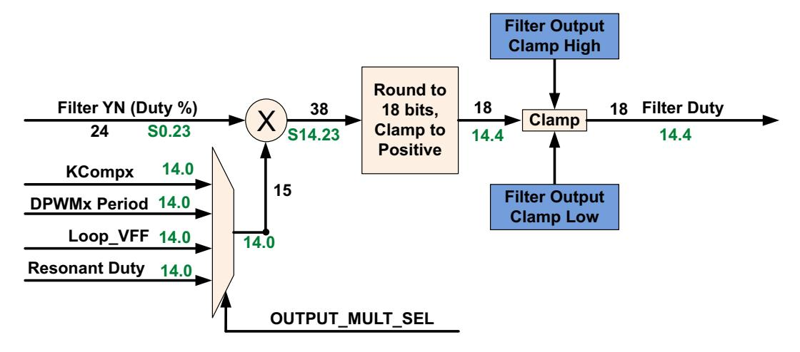

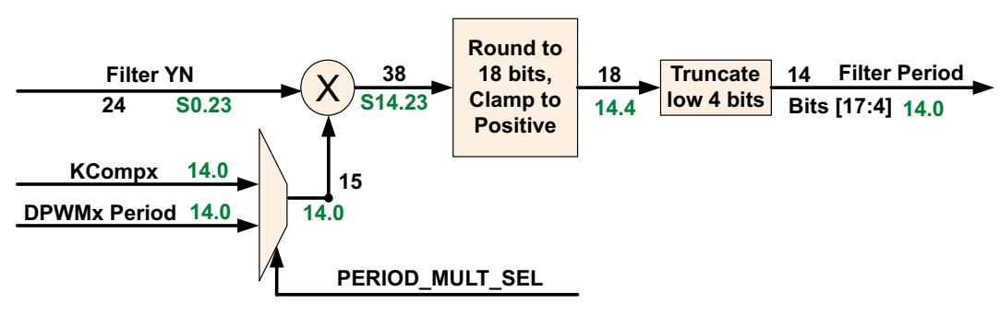

Figure 4-3.

<span id="page-146-1"></span>This stage converts the filter output to match the input requirements of the DPWM. Two different calculations are performed sequentially, using the same multiplier, but with different settings. One calculation provides a DPWM duty value, and the other provides a DPWM period value. In many topologies, only the duty value is used. In LLC, both values are used.

At the start of this stage, the PID output is multiplied by one of several 14 bit unsigned numbers, giving a 38 bit output. For the Filter Duty calculation, there are 4 numbers which can be used. See Section 4.3.8 for a discussion of these numbers. For the Filter Period calculation, only 2 numbers can be selected.

After the multiplication, there is a 38 bit signed result. Negative values are clamped to zero and the sign bit is removed. This gives a 37 bit positive result. This number is rounded to the 18 most significant bits. This section is the same for both calculations.

After rounding and clamping, the two outputs are handled differently. The Filter Duty value is clamped using the values in the Filter Output Clamp High Register (FILTEROCLPHI) and the Filter Output Clamp Low Register (FILTEROCLPLO). After that, the Filter Duty value is used by the DPWM as a time value. It is considered a 14.4 bit value, with the low 4 bits going to the high resolution section of the DPWM. So the resolution of the Filter Duty value is 250 psec.

The Filter Period value gets no clamp. The DPWM Period does not support high resolution, so the low 4 bits from the 18 bit result are truncated. The Filter Period only presents the high 14 bits to the DPWM, giving a resolution of a nominal 4 nanoseconds.


*Filter Status Register* [www.ti.com](http://www.ti.com)

Here is an example of a typical use of the Filter Output Stage:

Filter YN (50% Duty) 0x400000 or 4194304

X DPWM Period (100 kHz) 0x9C4 or 2500

=

0x271000000 or 10485760000

Shift right by 19 bits and round: 0

x4E20 or 20000

This result is what goes to the DPWM, with high resolution.

To convert it back to the period scale and check results, we can divide by 16, which is the same as shifting right by 4 bits. This gives:

0x4e2 or 1250,

which is half the period, so we do get a 50% duty cycle.

# **4.2 Filter Status Register**

The Filter status register has 5 bits.

FILTER\_BUSY

YN\_LOW\_CLAMP

YN\_HIGH\_CLAMP

KI\_YN\_LOW\_CLAMP

KI\_YN\_HIGH\_CLAMP

The FILTER\_BUSY bit is high when the filter is calculating. This calculation time is very short, only a few instruction cycles. It is very difficult to reliably detect the high time of the Filter Busy bit.

The other bits are written to each time the filter calculation is complete. They reflect the result of the most recent filter calculation.

### <span id="page-147-0"></span>**4.3 Filter Control Register**

The Filter Control Register (FILTERCTRL) has 13 fields. They are used to configure the filter operation. Filter sources and destinations are set in the Loop Mux registers

KI\_ADDER\_MODE

PERIOD\_MULT\_SEL

OUTPUT\_MULT\_SEL

YN\_SCALE

NL\_MODE

KD\_STALL

KI\_STALL

KP\_OFF

KD\_OFF KI\_OFF

FORCE\_START

USE\_CPU\_SAMPLE F

ILTER\_EN


[www.ti.com](http://www.ti.com) *Filter Control Register*

# <span id="page-148-0"></span>*4.3.1 Filter Enable*

The Filter Enable (FILTER\_EN) bit enables the filter. Unlike the DPWM and Front End, there are no filter enable bits in the GLBEN (Global Enable) Register in the Loop Mux registers. These bits are unnecessary for the filter because it only operates when it is triggered by the Front End or some other external event. The default for the Filter Enable bit is a 1, which enables the filter. If the filter is disabled after running for at least one cycle, the value sent to the DPWM will continue to control the DPWM. In addition, the last Filter Status state will also remain.

# <span id="page-148-1"></span>*4.3.2 Use CPU Sample*

The CPU Sample bit (USE\_CPU\_SAMPLE) is used for open loop testing of the Filter and DPWM configuration, or in other cases where a firmware input to the Filter is desired. If the USE\_CPU\_SAMPLE bit is set, the Filter input comes from the CPU\_SAMPLE bit field in the CPU Xn register (CPUXN).

Here is an example of using CPU\_SAMPLE:

```
Filter1Regs.FILTERCTRL.bit.USE_CPU_SAMPLE = 1; //enable CPU sample
Filter1Regs.CPUXN.bit.CPU_SAMPLE = -34; //put negative value into CPU sample
```

# <span id="page-148-2"></span>*4.3.3 Force Start*

The FORCE\_START bit triggers a single filter calculation. It can be used with the CPU\_SAMPLE value to run a controlled calculation in the filter. If CPU Sample is not enabled, it will use whatever input is selected for this filter.

# <span id="page-148-3"></span>*4.3.4 Kp Off, Kd Off, Ki Off*

The KP\_OFF, KD\_OFF, and KI\_OFF bits disable these sections of the filter, and replace those values with a zero. They also clear any history to a zero where it is present (I and D). Note that the history values are loaded with a zero the next time the filter is triggered. Normally the EADC is triggered by a sample trigger signal from a DPWM module. When the EADC conversion is complete, the filter is triggered. The filter can also be triggered by writing a 1 to the FORCE\_START bit in the FILTERCTRL register. If neither of these events happens, the history will not be reset. So if the DPWM is not running, the history will not be cleared. Even if the DPWM is running, writing a 1 followed by a 0 to the KD and KI\_OFF bits will not always clear the history. It depends if the filter is triggered and run while the bits are 1. If a quick clear is desired, use the FILTERPRESET register instead.

#### <span id="page-148-4"></span>*4.3.5 Kd Stall, Ki Stall*

The KD\_STALL and KI\_STALL registers stall these filter elements at their current value. They do not reset them. They are useful for suppressing response to transients when such response is not desirable.

### <span id="page-148-5"></span>*4.3.6 Nonlinear Mode*

The NL\_MODE bit selects which nonlinear mode is used. 0 is for asymmetric mode, while 1 selects symmetric mode. Refer to [Section](#page-152-0) 4.5 through [Section](#page-154-2) 4.8 for more information.

# <span id="page-148-6"></span>*4.3.7 Output Scaling*

The 3 OUTPUT\_SCALE bits permit shifting of the filter output. This gives flexibility in the scaling of the filter peripherals. It is a 2's complement number, where 0 means no shift, 1 means a shift right by 1, 2 means shift right by 2, -1 means shift left by 1, and so on.

```
Filter1Regs.FILTERCTRL.bit.OUTPUT_SCALE = -3; //shift filter output left by 3
```


*Filter Control Register* [www.ti.com](http://www.ti.com)

### <span id="page-149-0"></span>*4.3.8 Output Multiplier Select*

The OUTPUT\_MULT\_SEL bits select what value is multiplied by the filter output to determine the DPWM pulse width. See the Filter Reference section for specific bit assignments. The options are:

- 1. KComp This enables special scaling of the output to the DPWM independent of the period.
- 2. Switching Period This results in the Filter output translating directly to a DPWM on-time percentage. Full scale on the filter output will equal a 100 % on time.
- 3. Feed Forward value This permits the output of the filter to be controlled by the output of another filter. This could be, for example, a voltage feed-forward value
- 4. Resonant Duty value received from the DPWM module This is used for resonant mode, for example for LLC architecture.

Note that the default is KComp. This is not intuitive, especially for users of the UCD3000 series digital power controller. They UCD3000 had no options in this area, period was always used. It is easy to overlook this bitfield when setting up for a simple period based system. The OUTPUT\_MULT\_SEL register works with the FILTERMUX register in the Loop Mux for value selections. FILTERMUX selects which KComp is used, which DPWM Period is used, and which Filter output is used for Feed Forward. Resonant Duty also comes from a DPWM module and is also selected by FILTERMUX. See 5.4 Filter Mux Register (FILTERMUX).

Switching Period is provided by the DPWM. The default is the value from the DPWM Period register, and this is used for most topologies. However, there are two other DPWM registers which can also be sent to the Filter for this value. See 2.17.3 Filter Duty Select, for more details.

# <span id="page-149-1"></span>*4.3.9 Switching Period as Output Multiplier*

Using the Switching Period as an output multiplier leads to the DPWM duty being directly proportional to the Filter output, with a full range output being equal to about 100% of the period. Here is the bit pattern of the multiply:

The filter output is a 24 bit signed number, with a range from 0x7fffff (8388607) to 0x800000 (-8388608).

All of the output multipliers are unsigned 14 bit numbers with a range from 0x3fff (16383) to 0.

The product of these two numbers is a 38 bit number. This number is then scaled and rounded down to a 18 bit number and used for the high resolution events in the DPWM.

So suppose that the filter output is at about 50% or 4194304. If the period is the same as the example above, 2500, the product of the two will be 10485760000. To reduce this from a 38 bit signed number to a 18 bit unsigned number, we drop the sign bit off the top and divide by 2 19 . Negative filter outputs make no sense in terms of DPWM timing, so they will be clamped to zero.

Dividing by 2 <sup>19</sup> gives a result of 20000. This is a high resolution value for the 4 GHz clock of the DPWM. To convert it to the lower resolution, 250 MHz clock used for the period, we need to divide by 16. This gives a result of 1250, or half the period. Other filter output values follow the exact same scaling.

There is a register in the Loop Mux, the FILTERMUX register, which selects the period source for each filter.

See [Section](#page-190-2) 5.14 for more information on this register. Here is an example of its use:

LoopMuxRegs.FILTERMUX.bit.FILTER0\_PER\_SEL = 2; //use DPWM2 period for filter 0


[www.ti.com](http://www.ti.com) *Filter Control Register*

# *4.3.10 KComp as Output Multiplier*

Using KComp as an output multiplier can be useful in places where the DPWM output is limited to less than 100%, for example. This can permit using the whole dynamic range of the Filter for a more limited range, and remove the need for output clamping. The scaling works exactly the same, except the 14 bit KCOMP value is used instead of the 14 bit period value.

This option also makes it possible to change the gain of the Filter dynamically without change pole and zero positions. It can also be used to increase the gain of the Filter beyond what the normal Filter structure supports. It is also used to match up the PWM and Resonant mode waveforms in the LLC configuration.

There are registers in the Loop Mux which contain KCOMP values and select which of 3 KCOMP values is used for each filter.

Here is an example of a code which would provide a maximum output of 50%:

```
#define SWITCHING_PERIOD 2500 // 250 MHz clock divided by period of 100 KHZ
Dpwm0Regs.DPWMPRD.bit.PRD = SWITCHING_PERIOD;
LoopMuxRegs.FILTERKCOMPA.bit.KCOMP0 = SWITCHING_PERIOD >> 1;
//KCOMP = period/2
LoopMuxRegs.FILTERMUX.bit.FILTER0_KCOMP_SEL = 0; //select KCOMP0 for filter 0
Filter1Regs.FILTERCTRL.bit.OUTPUT_MULT_SEL = 0; //Multiply output by KCOMP
```

This approach yields 1 more bit of filter resolution than clamping the Filter output at 50%, which should reduce the size of any limit cycling.

# <span id="page-150-0"></span>*4.3.11 Feed Forward as Output Multiplier*

When the feed forward is selected as the output multiplier, the multiplier value is the most significant 14 bits of the filter output from a different filter. The FILTERMUX register in the Loop Mux is also used to select this filter. Configuring the link between the two filters is simple and is shown below. The actual filter settings and operation for feed forward are available in the Hard Switching Full Bridge EVM (UCD3138HSFBEVM-029) reference code from Texas Instruments.

Here is an example of link code:

```
LoopMuxRegs.FILTERMUX.bit.FILTER0_FFWD_SEL = 0; //select Filter1 as ffwd input
LoopMuxRegs.FILTERMUX.bit.FILTER0_FFWD_SEL = 0;
 //select feed forward as output multiplier
```

See [Section](#page-157-0) 4.11.2 in [Section](#page-155-2) 4.11 for more information on these bit fields.

## <span id="page-150-1"></span>*4.3.12 Period Multiplier Select*

The Filter has a second output. In addition to Filter Duty, there is Filter Period.

The PERIOD\_MULT\_SEL bit is used to select the multiplier for Filter Period.

The only options are DPWM Period and KCOMP. Filter Period is used in LLC topologies so that the Filter can control the switching frequency of the power supply

# <span id="page-150-2"></span>*4.3.13 Ki Adder Mode*

The KI\_ADDER\_MODE bit selects from two modes for calculating the input to Ki.

A 1 in KI\_ADDER\_MODE will select a trapezoidal mode which adds Xn and Xn-1. At the lowest AFE gain setting, this may lead to saturation of the calculation.

With a 0 in the KI\_ADDER\_MODE bit, only Xn is used as an input to the integrator. This does not provide trapezoidal calculations, but it does avoid any saturation issues. For a more complete description see 4.1.3 Integral Branch.


# <span id="page-151-0"></span>**4.4 XN, YN Read and Write Registers**

There are several registers which allow access to dynamic values inside the filter. For register formats, consult the Filter Reference section below.

# <span id="page-151-1"></span>*4.4.1 CPU Xn Register*

The CPUXN register is used in the CPU Sample mode described above. This is where the firmware writes the CPU controlled value in CPU Sample mode. See [Section](#page-148-1) 4.3.2.

# <span id="page-151-2"></span>*4.4.2 Filter XN Read Register*

This register provides both Xn and Xn-1 for read by the firmware.

# <span id="page-151-3"></span>*4.4.3 Filter YN Read Registers*

There are three read registers for internal filter results:

FILTERKIYNREAD

FILTERKDYNREAD

FILTERYNREAD

These provide the outputs of the Integrator, Differentiator, and the total filter.

The proportional output is not provided. It can be determined by multiplying Xn by KP, or by subtracting KiYn and KdYn from Yn.


# <span id="page-152-0"></span>**4.5 Coefficient Configuration Register**

The COECONFIG register is used to configure filter coefficients for nonlinear mode. Each Filter coefficient has from 2 to 4 values which are programmable via Filter registers. Kp, Ki, and Kd are arranged into 7 coefficient sets as shown in [Figure](#page-152-1) 4-4.

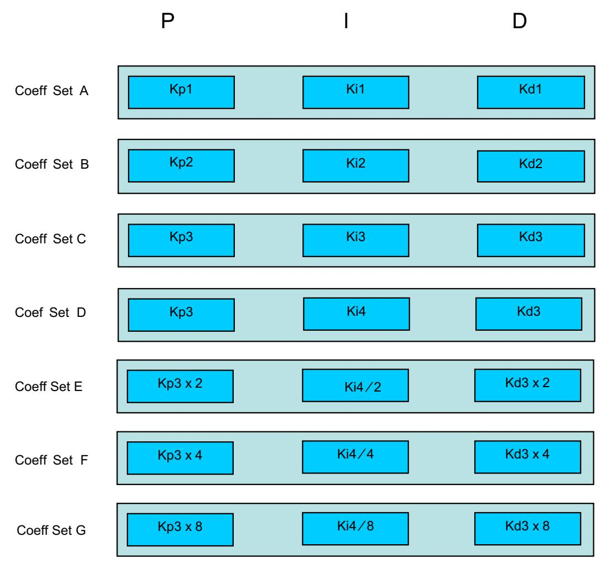

**Figure 4-4.**

<span id="page-152-1"></span>These sets are designed so that bandwidth increases as the set goes from A to G. These sets can be mapped in any possible combination into 7 bins, numbered from Bin 0 to Bin 6.

These bins are selected based on the nonlinear limit register contents and the Xn value into the filter. There are two options – symmetrical and non-symmetrical. Here are the bins for the two modes:


#### **Symmetric (13 Bins)**

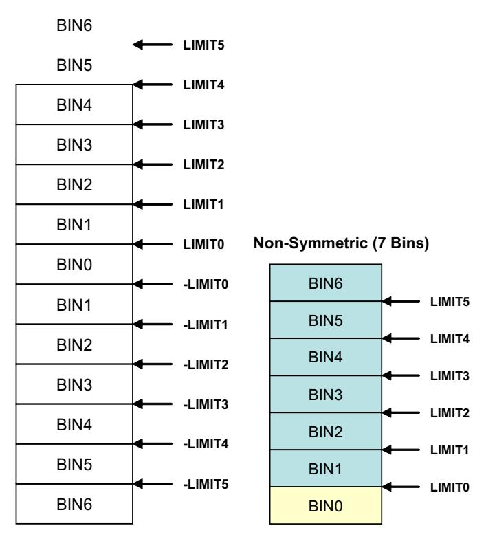

**Figure 4-5.**

<span id="page-153-0"></span>There are many possible combinations. In symmetric mode, if bandwidth is to increase as error increases, then Bin 0 could be set to Coefficient Set A, Bin 1 set to Coefficient Set B, and so on.

If fewer bins are desired, then Bins 0 and 1 could both be set to Coefficient Set A, Bins 2 and 3 to B, and so on.

The default configuration is the non-symmetric mode, with all bins set to Coefficient Set A.

Limit values must be increasing, with limit 0 the lowest possible value, Limit 1 higher, and so on. In symmetric mode, all limit values must be positive.

Each bin has a separate bit which selects one of the 2 alpha values.

Here is a code example which uses all the Coefficient sets with increasing bandwidth for increasing error:

```
Filter0Regs.COEFCONFIG.bit.BIN0_CONFIG = 0; //coefficient set A
Filter0Regs.COEFCONFIG.bit.BIN1_CONFIG = 1; //coefficient set B
Filter0Regs.COEFCONFIG.bit.BIN2_CONFIG = 2; //coefficient set C
Filter0Regs.COEFCONFIG.bit.BIN3_CONFIG = 3; //coefficient set D
Filter0Regs.COEFCONFIG.bit.BIN4_CONFIG = 4; //coefficient set E
Filter0Regs.COEFCONFIG.bit.BIN5_CONFIG = 5; //coefficient set F
Filter0Regs.COEFCONFIG.bit.BIN6_CONFIG = 6; //coefficient set G
Filter0Regs.COEFCONFIG.bit.BIN0_ALPHA = 0; //alpha 0
Filter0Regs.COEFCONFIG.bit.BIN1_ALPHA = 0; //alpha 0
Filter0Regs.COEFCONFIG.bit.BIN2_ALPHA = 0; //alpha 0
Filter0Regs.COEFCONFIG.bit.BIN3_ALPHA = 0; //alpha 0
Filter0Regs.COEFCONFIG.bit.BIN4_ALPHA = 1; //alpha 1
Filter0Regs.COEFCONFIG.bit.BIN5_ALPHA = 1; //alpha 1
Filter0Regs.COEFCONFIG.bit.BIN6_ALPHA = 1; //alpha 1
```

[www.ti.com](http://www.ti.com) *Kp, Ki, and Kd Registers*

# <span id="page-154-0"></span>**4.6 Kp, Ki, and Kd Registers**

There are several registers which hold the Kp, Ki, and Kd coefficients:

FILTERKPCOEF0

FILTERKPCOEF1

FILTERKICOEF0

FILTERKICOEF1

FILTERKDDOEF0

FILTERKDCOEF1

These registers hold all of the coefficients for the PID for the various coefficient sets as described above. For specific details, see the Filter Reference chapter below. All of the K coefficients are 16 bit signed numbers. They are stored 1 or 2 per register. Systems which do not use nonlinear mode only need to load Coefficient Set A. Here is an example:

```
Filter1Regs.FILTERKPCOEF0.bit.KP_COEF_0 = 500;
Filter1Regs.FILTERKICOEF0.bit.KI_COEF_0 = 150;
Filter1Regs.FILTERKDCOEF0.bit.KD_COEF_0 = 250;
```

# <span id="page-154-1"></span>**4.7 Alpha Registers**

The FILTERKDALPHA register holds the two alpha coefficients which can be selected by the BINx\_ALPHA bits in the COEFCONFIG register. Alpha is stored as a 9 bit signed number. Here is an example which only loads KD\_ALPHA\_0:

```
Filter1Regs.FILTERKDALPHA.bit.KD_ALPHA_0 = 134;
```

# <span id="page-154-2"></span>**4.8 Filter Nonlinear Limit Registers**

There are 6 nonlinear limits, as shown above in [Section](#page-152-0) 4.5. These are 9 bit signed numbers, although they must be positive for symmetric mode. They are stored 2 to a register in three registers:

FILTERNL0

FILTERNL1

FILTERNL2

Here is a code example loading them for symmetric mode:

```
Filter1Regs.FILTERNL2.bit.LIMIT5 = 218; //symmetric values
Filter1Regs.FILTERNL2.bit.LIMIT4 = 182;
Filter1Regs.FILTERNL1.bit.LIMIT3 = 145;
Filter1Regs.FILTERNL1.bit.LIMIT2 = 109;
Filter1Regs.FILTERNL0.bit.LIMIT1 = 72;
Filter1Regs.FILTERNL0.bit.LIMIT0 = 36;
```


*Clamp Registers* [www.ti.com](http://www.ti.com)

# <span id="page-155-0"></span>**4.9 Clamp Registers**

There are 3 clamps in the filter structure, for the integrator, the output of the PID filter, and the output after the feed forward multiplier. The integrator and filter clamps are signed 24 bit numbers, like the output of the integrator and filter are. The overall output clamp is an unsigned 18 bit number, like the overall output.

Here is an example of clamping everything to a range from 10% to 50% of full scale.

```
Filter2Regs.FILTERYNCLPHI.bit.YN_CLAMP_HIGH = 0x400000; //50% of full scale
Filter2Regs.FILTERYNCLPLO.bit.YN_CLAMP_LOW = (int)(((float)0x800000) *.1);
        //10% of full scale
Filter2Regs.FILTERKICLPHI.bit.KI_CLAMP_HIGH = 0x400000; //50% of full scale
Filter2Regs.FILTERKICLPLO.bit.KI_CLAMP_LOW = (int)(((float)0x800000) *.1);
        //10% of full scale
Filter2Regs.FILTEROCLPHI.bit.OUTPUT_CLAMP_HIGH = 0x20000; //50% of full scale
Filter2Regs.FILTEROCLPLO.bit.OUTPUT_CLAMP_LOW = (int)(((float)0x40000) *.1);
        //10% of full scale
```

# <span id="page-155-1"></span>**4.10 Filter Preset Register**

The FILTERPRESET register is used to preset the values in several calculated registers within the filter. The preset register works between filter calculations. If the Filter is calculating when the Filter Preset is enabled, the target register in the Filter is not written to immediately. The hardware waits for the filter to stop calculating and then writes to the target register.

If the filter is not running, the Filter Preset takes effect immediately.

There are three bit fields in the Filter Preset Register.

The PRESET\_EN bit is set to enable the preset, and can be polled to tell when it is complete.

The 3 PRESET\_REG\_SEL bits select which register will be preset, see the Filter Reference Section for the exact values.

Finally, the value to be preset is loaded into the PRESET\_VALUE bits.

Here is an example code for using the preset register:

```
while(Filter0Regs.FILTERPRESET.bit.PRESET_EN == 1)
{
    ; //wait for previous preset to take effect
}
Filter0Regs.FILTERPRESET.bit.PRESET_VALUE = 15; //put a 15
Filter0Regs.FILTERPRESET.bit.PRESET_REG_SEL = 1; //into I holding register
Filter0Regs.FILTERPRESET.bit.PRESET_EN = 1; //set bit to make it happen
```

## <span id="page-155-2"></span>**4.11 Filter Registers Reference**

Registers for Filter Modules 0-2 are identical in their bit definitions.

# <span id="page-155-3"></span>*4.11.1 Filter Status Register (FILTERSTATUS)*

```
Address 00060000 – Filter 2 Status Register
Address 00090000 – Filter 1 Status Register
Address 000C0000 – Filter 0 Status Register
```

### **Figure 4-6. Filter Status Register (FILTERSTATUS)**

<span id="page-155-4"></span>


#### **Table 4-1. Filter Status Register (FILTERSTATUS) Register Field Descriptions**

<span id="page-156-0"></span>

| Bit | Field                | Type | Reset | Description                                                                                                     |
|-----|----------------------|------|-------|-----------------------------------------------------------------------------------------------------------------|
| 4   | FILTER_BUSY          | R    | 0     | Filter Busy Indicator<br>0 = Filter is waiting for new data<br>1= Filter busy calculating                       |
| 3   | YN_LOW_CLAMP         | R    | 0     | PID Output Low Rail Indicator<br>0 = PID Output not equal to low rail<br>1 = PID Output equal to low rail       |
| 2   | YN_HIGH_<br>CLAMP    | R    | 0     | PID Output High Rail Indicator<br>0 = PID Output not equal to high rail<br>1 = PID Output equal to high rail    |
| 1   | KI_YN_LOW_<br>CLAMP  | R    | 0     | KI Feedback Low Rail Indicator<br>0 = KI Feedback not equal to low rail<br>1 = KI Feedback equal to low rail    |
| 0   | KI_YN_HIGH_CLA<br>MP | R    | 0     | KI Feedback High Rail Indicator<br>0 = KI Feedback not equal to high rail<br>1 = KI Feedback equal to high rail |


# <span id="page-157-0"></span>*4.11.2 Filter Control Register (FILTERCTRL)*

Address 00060004 – Filter 2 Control Register

Address 00090004 – Filter 1 Control Register

Address 000C0004 – Filter 0 Control Register

### **Figure 4-7. Filter Control Register (FILTERCTRL)**

<span id="page-157-1"></span>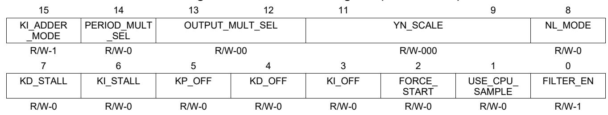

LEGEND: R/W = Read/Write; R = Read only; -*n* = value after reset

## **Table 4-2. Filter Control Register (FILTERCTRL) Register Field Descriptions**

<span id="page-157-2"></span>

| Bit   | Field               | Type | Reset | Description                                                                                                                                                                                                                                                                                                                                                                                                                                         |  |
|-------|---------------------|------|-------|-----------------------------------------------------------------------------------------------------------------------------------------------------------------------------------------------------------------------------------------------------------------------------------------------------------------------------------------------------------------------------------------------------------------------------------------------------|--|
| 15    | KI_ADDER_MODE       | R/W  | 1     | Configures addition of Xn and Xn-1 in Integral branch<br>0 = Only Xn used for addition (Xn + 0)<br>1 = Xn + Xn-1 used for addition (Default)                                                                                                                                                                                                                                                                                                        |  |
| 14    | PERIOD_MULT<br>_SEL | R/W  | 0     | Selects output multiplicand used for multiplying with filter output to calculate DPWM<br>Period value in Resonant Mode<br>0 = Switching period received from Loop Mux module (Default)<br>1 = KComp received from Loop Mux module                                                                                                                                                                                                                   |  |
| 13-12 | OUTPUT_MULT<br>_SEL | R/W  | 00    | Selects output multiplicand used for multiplying with filter output to calculate DPWM<br>Duty value<br>0 = KComp received from Loop Mux module (Default)<br>1 = Switching period received from Loop Mux module<br>2 = Feed-Forward value received from Loop Mux module<br>3 = Resonant Duty value received from DPWM Module                                                                                                                         |  |
| 11-9  | YN_SCALE            | R/W  | 000   | Controls scaling of Yn value to compensate for filter coefficient scaling<br>-4 = Filter output (Yn) left shifted by 4<br>-3 = Filter output (Yn) left shifted by 3<br>-2 = Filter output (Yn) left shifted by 2<br>-1 = Filter output (Yn) left shifted by 1<br>0 = Filter output (Yn) not scaled (Default)<br>1 = Filter output (Yn) right shifted by 1<br>2 = Filter output (Yn) right shifted by 2<br>3 = Filter output (Yn) right shifted by 3 |  |
| 8     | NL_MODE             | R/W  | 0     | Sets non-linear gain table configuration. Coefficient Bin mapping is controlled by<br>Coefficient Configuration Register. Limit configuration is controlled by the Filter<br>Nonlinear Limit Registers (See Section 4.5)<br>0 = Non-symmetric mode (Default)<br>1 = Symmetric mode                                                                                                                                                                  |  |
| 7     | KD_STALL            | R/W  | 0     | Freezes KD Branch, KD_YN remains at current value<br>0 = KD_YN recalculated on each filter update (Default)<br>1 = KD_YN stalled at present value                                                                                                                                                                                                                                                                                                   |  |
| 6     | KI_STALL            | R/W  | 0     | Freezes KI Branch, KI_YN remains at current value<br>0 = KI_YN recalculated on each filter update (Default)<br>1 = KI_YN stalled at present value                                                                                                                                                                                                                                                                                                   |  |


#### **Table 4-2. Filter Control Register (FILTERCTRL) Register Field Descriptions (continued)**

| Bit | Field              | Type | Reset | Description                                                                                                                                                                           |  |
|-----|--------------------|------|-------|---------------------------------------------------------------------------------------------------------------------------------------------------------------------------------------|--|
| 5   | KP_OFF             | R/W  | 0     | Turns off the KP branch<br>0 = KP branch calculating new outputs (Default)<br>1 = KP branch turned off                                                                                |  |
| 4   | KD_OFF             | R/W  | 0     | Turns off the KD branch, KD_YN cleared to zero<br>0 = KD branch calculating new outputs (Default)<br>1 = KD branch turned off                                                         |  |
| 3   | KI_OFF             | R/W  | 0     | Turns off the KI branch, KI_YN cleared to zero<br>0 = KI branch calculating new outputs (Default)<br>1 = KI branch halted                                                             |  |
| 2   | FORCE_START        | R/W  | 0     | Initiates a filter calculation under firmware control<br>0 = No calculation started (Default)<br>1 = Calculation started                                                              |  |
| 1   | USE_CPU<br>_SAMPLE | R/W  | 0     | Forces filter to use error sample from CPU XN register (Section 4.4)<br>0 = Filter Mode, input data received from EADC (Default)<br>1 = CPU Mode, input data based on CPU XN register |  |
| 0   | FILTER_EN          | R/W  | 1     | Filter Enable<br>0 = Disables Filter operation<br>1 = Enables Filter operation (Default)                                                                                              |  |


### <span id="page-159-0"></span>*4.11.3 CPU XN Register (CPUXN)*

Address 00060008 – Filter 2 CPU XN Register

Address 00090008 – Filter 1 CPU XN Register

Address 000C0008 – Filter 0 CPU XN Register

### **Figure 4-8. CPU XN Register (CPUXN)**

8 0

CPU\_SAMPLE

R/W-0 0000 0000

LEGEND: R/W = Read/Write; R = Read only; -*n* = value after reset

#### **Table 4-3. CPU XN Register (CPUXN) Register Field Descriptions**

<span id="page-159-1"></span>

| Bit | Field      | Type | Reset          | Description                                                                                                                                    |
|-----|------------|------|----------------|------------------------------------------------------------------------------------------------------------------------------------------------|
| 8-0 | CPU_SAMPLE | R/W  | 0 0000<br>0000 | Forced Xn value, allows processor to use filter as ALU. Set Bit 2 of Filter Control<br>Register to '1' to force CPU_SAMPLE as input to Filter. |


### <span id="page-160-0"></span>*4.11.4 Filter XN Read Register (FILTERXNREAD)*

Address 0006000C – Filter 2 XN Read Register

Address 0009000C – Filter 1 XN Read Register

Address 000C000C – Filter 0 XN Read Register

### **Figure 4-9. Filter XN Read Register (FILTERXNREAD)**

<span id="page-160-1"></span>

| 24    | 16 | 15 | 9          | 8 | 0   |  |
|-------|----|----|------------|---|-----|--|
| XN_M1 |    |    | Reserved   |   | XN  |  |
| R-0   |    |    | R-000 0000 |   | R-0 |  |

LEGEND: R/W = Read/Write; R = Read only; -*n* = value after reset

### **Table 4-4. Filter XN Read Register (FILTERXNREAD) Register Field Descriptions**

<span id="page-160-2"></span>

| Bit   | Field    | Type | Reset    | Description                                  |
|-------|----------|------|----------|----------------------------------------------|
| 24-16 | XN_M1    | R    | 0        | 9-bit signed XN_M1 register value, read-only |
| 15-9  | Reserved | R    | 000 0000 |                                              |
| 8-0   | XN       | R    | 0        | 9-bit signed XN register value, read-only    |

*Filter*


# <span id="page-161-0"></span>*4.11.5 Filter KI\_YN Read Register (FILTERKIYNREAD)*

Address 00060010 – Filter 2 KI\_YN Read Register

Address 00090010 – Filter 1 KI\_YN Read Register

Address 000C0010 – Filter 0 KI\_YN Read Register

### **Figure 4-10. Filter KI\_YN Read Register (FILTERKIYNREAD)**

<span id="page-161-1"></span>23 0 KI\_YN

R-0

LEGEND: R/W = Read/Write; R = Read only; -*n* = value after reset

### **Table 4-5. Filter KI\_YN Read Register (FILTERKIYNREAD) Register Field Descriptions**

| Bit  | Field | Type | Reset | Description                                   |
|------|-------|------|-------|-----------------------------------------------|
| 23-0 | KI_YN | R    | 0     | 24-bit signed KI_YN register value, read-only |


# <span id="page-162-0"></span>*4.11.6 Filter KD\_YN Read Register (FILTERKDYNREAD)*

Address 00060014 – Filter 2 KD\_YN Register

Address 00090014 – Filter 1 KD\_YN Register

Address 000C0014 – Filter 0 KD\_YN Register

**Figure 4-11. Filter KD\_YN Read Register (FILTERKDYNREAD)**

<span id="page-162-1"></span>23 0 KD\_YN

R-0

LEGEND: R/W = Read/Write; R = Read only; -*n* = value after reset

### **Table 4-6. Filter KD\_YN Read Register (FILTERKDYNREAD) Register Field Descriptions**

<span id="page-162-2"></span>

| Bit  | Field | Type | Reset | Description                                   |
|------|-------|------|-------|-----------------------------------------------|
| 23-0 | KD_YN | R    | 0     | 24-bit signed KD_YN register value, read-only |


### <span id="page-163-0"></span>*4.11.7 Filter YN Read Register (FILTERYNREAD)*

# **Figure 4-12. Filter YN Read Register (FILTERYNREAD)**

<span id="page-163-1"></span>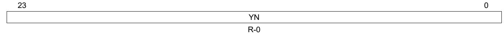

LEGEND: R/W = Read/Write; R = Read only; -*n* = value after reset

### **Table 4-7. 9.7 Filter YN Read Register (FILTERYNREAD) Register Field Descriptions**

<span id="page-163-2"></span>

| Bit  | Field | Type | Reset | Description                                |
|------|-------|------|-------|--------------------------------------------|
| 23-0 | YN    | R    | 0     | 24-bit signed YN register value, read-only |


# <span id="page-164-0"></span>*4.11.8 Coefficient Configuration Register (COEFCONFIG)*

Address 0006001C – Filter 2 Coefficient Configuration Register

Address 0009001C – Filter 1 Coefficient Configuration Register

Address 000C001C – Filter 0 Coefficient Configuration Register

**Figure 4-13. Coefficient Configuration Register (COEFCONFIG)**

<span id="page-164-1"></span>

| 27               |    | 26          |             |            |    | 24          |    |
|------------------|----|-------------|-------------|------------|----|-------------|----|
| BIN6_ALPHA       |    |             | BIN6_CONFIG |            |    |             |    |
| R/W-0            |    |             |             | R/W-000    |    |             |    |
| 23               | 22 |             | 20          | 19         | 18 |             | 16 |
| BIN5_ALPHA       |    | BIN5_CONFIG |             | BIN4_ALPHA |    | BIN4_CONFIG |    |
| R/W-0            |    | R/W-000     |             | R/W-0      |    | R/W-000     |    |
| 15               | 14 |             | 12          | 11         | 10 |             | 8  |
| BIN3_ALPHA       |    | BIN3_CONFIG |             | BIN2_ALPHA |    | BIN2_CONFIG |    |
| R/W-0            |    | R/W-000     |             | R/W-0      |    | R/W-000     |    |
| 7                | 6  | 5           | 4           | 3          | 2  | 1           | 0  |
| BIN1_ALPHA       |    | BIN1_CONFIG |             | BIN0_ALPHA |    | BIN0_CONFIG |    |
| R/W-0<br>R/W-000 |    |             |             | R/W-0      |    | R/W-000     |    |

**Table 4-8. Coefficient Configuration Register (COEFCONFIG) Register Field Descriptions**

<span id="page-164-2"></span>

| Bit   | Field       | Type | Reset | Description                                                                                                                                                                                                                                                                                                                                                                                                                 |
|-------|-------------|------|-------|-----------------------------------------------------------------------------------------------------------------------------------------------------------------------------------------------------------------------------------------------------------------------------------------------------------------------------------------------------------------------------------------------------------------------------|
| 27    | BIN6_ALPHA  | R/W  | 0     | Selects which alpha value to use in Bin 6 of Non-Linear Table. These bits are<br>shadowed and updated to filter when filter is not processing an EADC sample<br>0 = Bank 0 KD Alpha (KD_ALPHA_0) selected (Default)<br>1 = Bank 1 KD Alpha (KD_ALPHA_1) selected                                                                                                                                                            |
| 26-24 | BIN6_CONFIG | R/W  | 000   | Selects which coefficient set to place in Bin 6 of Non-Linear Table. These bits are<br>shadowed and updated to filter when filter is not processing an EADC sample.<br>0 = Coefficient Set A Selected (Default)<br>1 = Coefficient Set B Selected<br>2 = Coefficient Set C Selected<br>3 = Coefficient Set D Selected<br>4 = Coefficient Set E Selected<br>5 = Coefficient Set F Selected<br>6 = Coefficient Set G Selected |
| 23    | BIN5_ALPHA  | R/W  | 0     | Selects which alpha value to use in Bin 5 of Non-Linear Table. These bits are<br>shadowed and updated to filter when filter is not processing an EADC sample<br>0 = Bank 0 KD Alpha (KD_ALPHA_0) selected (Default)<br>1 = Bank 1 KD Alpha (KD_ALPHA_1) selected                                                                                                                                                            |
| 22-20 | BIN5_CONFIG | R/W  | 000   | Selects which coefficient set to place in Bin 5 of Non-Linear Table. These bits are<br>shadowed and updated to filter when filter is not processing an EADC sample.<br>0 = Coefficient Set A Selected (Default)<br>1 = Coefficient Set B Selected<br>2 = Coefficient Set C Selected<br>3 = Coefficient Set D Selected<br>4 = Coefficient Set E Selected<br>5 = Coefficient Set F Selected<br>6 = Coefficient Set G Selected |
| 19    | BIN4_ALPHA  | R/W  | 0     | Selects which alpha value to use in Bin 4 of Non-Linear Table. These bits are<br>shadowed and updated to filter when filter is not processing an EADC sample<br>0 = Bank 0 KD Alpha (KD_ALPHA_0) selected (Default)<br>1 = Bank 1 KD Alpha (KD_ALPHA_1) selected                                                                                                                                                            |


# **Table 4-8. Coefficient Configuration Register (COEFCONFIG) Register Field Descriptions (continued)**

| Bit   | Field       | Type | Reset | Description                                                                                                                                                                                                                                                                                                                                                                                                                 |
|-------|-------------|------|-------|-----------------------------------------------------------------------------------------------------------------------------------------------------------------------------------------------------------------------------------------------------------------------------------------------------------------------------------------------------------------------------------------------------------------------------|
| 18-16 | BIN4_CONFIG | R/W  | 000   | Selects which coefficient set to place in Bin 4 of Non-Linear Table. These bits are<br>shadowed and updated to filter when filter is not processing an EADC sample.<br>0 = Coefficient Set A Selected (Default)<br>1 = Coefficient Set B Selected<br>2 = Coefficient Set C Selected<br>3 = Coefficient Set D Selected<br>4 = Coefficient Set E Selected<br>5 = Coefficient Set F Selected<br>6 = Coefficient Set G Selected |
| 15    | BIN3_ALPHA  | R/W  | 0     | Selects which alpha value to use in Bin 3 of Non-Linear Table. These bits are<br>shadowed and updated to filter when filter is not processing an EADC sample<br>0 = Bank 0 KD Alpha (KD_ALPHA_0) selected (Default)<br>1 = Bank 1 KD Alpha (KD_ALPHA_1) selected                                                                                                                                                            |
| 14-12 | BIN3_CONFIG | R/W  | 000   | Selects which coefficient set to place in Bin 3 of Non-Linear Table. These bits are<br>shadowed and updated to filter when filter is not processing an EADC sample.<br>0 = Coefficient Set A Selected (Default)<br>1 = Coefficient Set B Selected<br>2 = Coefficient Set C Selected<br>3 = Coefficient Set D Selected<br>4 = Coefficient Set E Selected<br>5 = Coefficient Set F Selected<br>6 = Coefficient Set G Selected |
| 11    | BIN2_ALPHA  | R/W  | 0     | Selects which alpha value to use in Bin 2 of Non-Linear Table. These bits are<br>shadowed and updated to filter when filter is not processing an EADC sample<br>0 = Bank 0 KD Alpha (KD_ALPHA_0) selected (Default)<br>1 = Bank 1 KD Alpha (KD_ALPHA_1) selected                                                                                                                                                            |
| 10-8  | BIN2_CONFIG | R/W  | 000   | Selects which coefficient set to place in Bin 2 of Non-Linear Table. These bits are<br>shadowed and updated to filter when filter is not processing an EADC sample.<br>0 = Coefficient Set A Selected (Default)<br>1 = Coefficient Set B Selected<br>2 = Coefficient Set C Selected<br>3 = Coefficient Set D Selected<br>4 = Coefficient Set E Selected<br>5 = Coefficient Set F Selected<br>6 = Coefficient Set G Selected |
| 7     | BIN1_ALPHA  | R/W  | 0     | Selects which alpha value to use in Bin 1 of Non-Linear Table. These bits are<br>shadowed and updated to filter when filter is not processing an EADC sample<br>0 = Bank 0 KD Alpha (KD_ALPHA_0) selected (Default)<br>1 = Bank 1 KD Alpha (KD_ALPHA_1) selected                                                                                                                                                            |
| 6-4   | BIN1_CONFIG | R/W  | 000   | Selects which coefficient set to place in Bin 1 of Non-Linear Table. These bits are<br>shadowed and updated to filter when filter is not processing an EADC sample.<br>0 = Coefficient Set A Selected (Default)<br>1 = Coefficient Set B Selected<br>2 = Coefficient Set C Selected<br>3 = Coefficient Set D Selected<br>4 = Coefficient Set E Selected<br>5 = Coefficient Set F Selected<br>6 = Coefficient Set G Selected |
| 3     | BIN0_ALPHA  | R/W  | 0     | Selects which alpha value to use in Bin 0 of Non-Linear Table. These bits are<br>shadowed and updated to filter when filter is not processing an EADC sample<br>0 = Bank 0 KD Alpha (KD_ALPHA_0) selected (Default)<br>1 = Bank 1 KD Alpha (KD_ALPHA_1) selected                                                                                                                                                            |


# **Table 4-8. Coefficient Configuration Register (COEFCONFIG) Register Field Descriptions (continued)**

| Bit | Field       | Type | Reset | Description                                                                                                                                                         |
|-----|-------------|------|-------|---------------------------------------------------------------------------------------------------------------------------------------------------------------------|
| 2-0 | BIN0_CONFIG | R/W  | 000   | Selects which coefficient set to place in Bin 1 of Non-Linear Table. These bits are<br>shadowed and updated to filter when filter is not processing an EADC sample. |
|     |             |      |       | 0 = Coefficient Set A Selected (Default)                                                                                                                            |
|     |             |      |       | 1 = Coefficient Set B Selected                                                                                                                                      |
|     |             |      |       | 2 = Coefficient Set C Selected                                                                                                                                      |
|     |             |      |       | 3 = Coefficient Set D Selected                                                                                                                                      |
|     |             |      |       | 4 = Coefficient Set E Selected                                                                                                                                      |
|     |             |      |       | 5 = Coefficient Set F Selected                                                                                                                                      |
|     |             |      |       | 6 = Coefficient Set G Selected                                                                                                                                      |


### <span id="page-167-0"></span>*4.11.9 Filter KP Coefficient 0 Register (FILTERKPCOEF0)*

Address 00060020 – Filter 2 KP Coefficient 0 Register

Address 00090020 – Filter 1 KP Coefficient 0 Register

Address 000C0020 – Filter 0 KP Coefficient 0 Register

### **Figure 4-14. Filter KP Coefficient 0 Register (FILTERKPCOEF0)**

<span id="page-167-1"></span>

| 31<br>16                | 15<br>0                 |
|-------------------------|-------------------------|
| KP_COEF_1               | KP_COEF_0               |
| R/W-0000 0000 0000 0000 | R/W-0100 0010 0011 0100 |

LEGEND: R/W = Read/Write; R = Read only; -*n* = value after reset

### **Table 4-9. Filter KP Coefficient 0 Register (FILTERKPCOEF0) Register Field Descriptions**

| Bit   | Field     | Type | Reset                        | Description                                                                                                    |
|-------|-----------|------|------------------------------|----------------------------------------------------------------------------------------------------------------|
| 31-16 | KP_COEF_1 | R/W  | 0000<br>0000<br>0000<br>0000 | KP Coefficient 1, 16-bit signed coefficient, configurable to any bin using the<br>Coefficient Control Register |
| 15-0  | KP_COEF_0 | R/W  | 0100<br>0010<br>0011<br>0100 | KP Coefficient 0, 16-bit signed coefficient, configurable to any bin using the<br>Coefficient Control Register |


# <span id="page-168-0"></span>*4.11.10 Filter KP Coefficient 1 Register (FILTERKPCOEF1)*

Address 00060024 – Filter 2 KP Coefficient 1 Register

Address 00090024 – Filter 1 KP Coefficient 1 Register

Address 000C0024 – Filter 0 KP Coefficient 1 Register

# **Figure 4-15. Filter KP Coefficient 1 Register (FILTERKPCOEF1)**

<span id="page-168-1"></span>15 0

KP\_COEF\_2

R/W-0000 0000 0000 0000

LEGEND: R/W = Read/Write; R = Read only; -*n* = value after reset

### **Table 4-10. Filter KP Coefficient 1 Register (FILTERKPCOEF1) Register Field Descriptions**

<span id="page-168-2"></span>

| Bit  | Field     | Type | Reset                        | Description                                                                                                    |
|------|-----------|------|------------------------------|----------------------------------------------------------------------------------------------------------------|
| 15-0 | KP_COEF_2 | R/W  | 0000<br>0000<br>0000<br>0000 | KP Coefficient 2, 16-bit signed coefficient, configurable to any bin using the<br>Coefficient Control Register |


### <span id="page-169-0"></span>*4.11.11 Filter KI Coefficient 0 Register (FILTERKICOEF0)*

Address 00060028 – Filter 2 KI Coefficient 0 Register

Address 00090028 – Filter 1 KI Coefficient 0 Register

Address 000C0028 – Filter 0 KI Coefficient 0 Register

#### **Figure 4-16. Filter KI Coefficient 0 Register (FILTERKICOEF0)**

<span id="page-169-1"></span>

| 31<br>16                | 15<br>0                 |
|-------------------------|-------------------------|
| KI_COEF_1               | KI_COEF_0               |
| R/W-0000 0000 0000 0000 | R/W-0010 0100 0001 0010 |

LEGEND: R/W = Read/Write; R = Read only; -*n* = value after reset

### **Table 4-11. Filter KI Coefficient 0 Register (FILTERKICOEF0) Register Field Descriptions**

<span id="page-169-2"></span>

| Bit   | Field     | Type | Reset                        | Description                                                                                                    |
|-------|-----------|------|------------------------------|----------------------------------------------------------------------------------------------------------------|
| 31-16 | KI_COEF_1 | R/W  | 0000<br>0000<br>0000<br>0000 | KI Coefficient 1, 16-bit signed coefficient, configurable to any bin using the<br>Coefficient Control Register |
| 15-0  | KI_COEF_0 | R/W  | 0010<br>0100<br>0001<br>0010 | KI Coefficient 0, 16-bit signed coefficient, configurable to any bin using the<br>Coefficient Control Register |


### <span id="page-170-0"></span>*4.11.12 Filter KI Coefficient 1 Register (FILTERKICOEF1)*

Address 0006002C – Filter 2 KI Coefficient 1 Register

Address 0009002C – Filter 1 KI Coefficient 1 Register

Address 000C002C – Filter 0 KI Coefficient 1 Register

### **Figure 4-17. Filter KI Coefficient 1 Register (FILTERKICOEF1)**

<span id="page-170-1"></span>31 16 15 0 KI\_COEF\_3 KI\_COEF\_2 R/W-0000 0000 0000 0000 R/W-0000 0000 0000 0000

LEGEND: R/W = Read/Write; R = Read only; -*n* = value after reset

### **Table 4-12. Filter KI Coefficient 1 Register (FILTERKICOEF1) Register Field Descriptions**

<span id="page-170-2"></span>

| Bit   | Field     | Type | Reset                        | Description                                                                                                    |
|-------|-----------|------|------------------------------|----------------------------------------------------------------------------------------------------------------|
| 31-16 | KI_COEF_3 | R/W  | 0000<br>0000<br>0000<br>0000 | KI Coefficient 3, 16-bit signed coefficient, configurable to any bin using the<br>Coefficient Control Register |
| 15-0  | KI_COEF_2 | R/W  | 0000<br>0000<br>0000<br>0000 | KI Coefficient 2, 16-bit signed coefficient, configurable to any bin using the<br>Coefficient Control Register |


### <span id="page-171-0"></span>*4.11.13 Filter KD Coefficient 0 Register (FILTERKDCOEF0)*

Address 00060030 – Filter 2 KD Coefficient 0 Register

Address 00090030 – Filter 1 KD Coefficient 0 Register

Address 000C0030 – Filter 0 KD Coefficient 0 Register

### **Figure 4-18. Filter KD Coefficient 0 Register (FILTERKDCOEF0)**

<span id="page-171-1"></span>

| 31<br>16                | 15<br>0                 |
|-------------------------|-------------------------|
| KD_COEF_1               | KD_COEF_0               |
| R/W-0000 0000 0000 0000 | R/W-1100 0100 0000 0001 |

LEGEND: R/W = Read/Write; R = Read only; -*n* = value after reset

### **Table 4-13. Filter KD Coefficient 0 Register (FILTERKDCOEF0) Register Field Descriptions**

<span id="page-171-2"></span>

| Bit   | Field     | Type | Reset                        | Description                                                                                                    |
|-------|-----------|------|------------------------------|----------------------------------------------------------------------------------------------------------------|
| 31-16 | KD_COEF_1 | R/W  | 0000<br>0000<br>0000<br>0000 | KD Coefficient 1, 16-bit signed coefficient, configurable to any bin using the<br>Coefficient Control Register |
| 15-0  | KD_COEF_0 | R/W  | 1100<br>0100<br>0000<br>0001 | KD Coefficient 0, 16-bit signed coefficient, configurable to any bin using the<br>Coefficient Control Register |


# <span id="page-172-0"></span>*4.11.14 Filter KD Coefficient 1 Register (FILTERKDCOEF1)*

Address 00060034 – Filter 2 KD Coefficient 1 Register

Address 00090034 – Filter 1 KD Coefficient 1 Register

Address 000C0034 – Filter 0 KD Coefficient 1 Register

# **Figure 4-19. Filter KD Coefficient 1 Register (FILTERKDCOEF1)**

<span id="page-172-1"></span>15 0 KD\_COEF\_2

R/W-0000 0000 0000 0000

**Table 4-14. Filter KD Coefficient 1 Register (FILTERKDCOEF1) Register Field Descriptions**

<span id="page-172-2"></span>

| Bit  | Field     | Type | Reset                        | Description                                                                                                    |
|------|-----------|------|------------------------------|----------------------------------------------------------------------------------------------------------------|
| 15-0 | KD_COEF_2 | R/W  | 0000<br>0000<br>0000<br>0000 | KD Coefficient 2, 16-bit signed coefficient, configurable to any bin using the<br>Coefficient Control Register |


### <span id="page-173-0"></span>*4.11.15 Filter KD Alpha Register (FILTERKDALPHA)*

Address 00060038 – Filter 2 KD Alpha Register

Address 00090038 – Filter 1 KD Alpha Register

Address 000C0038 – Filter 0 KD Alpha Register

#### **Figure 4-20. Filter KD Alpha Register (FILTERKDALPHA)**

<span id="page-173-1"></span>

|                 | 24         | 16 | 15  | 9               | 8          | 0 |
|-----------------|------------|----|-----|-----------------|------------|---|
|                 | KD_ALPHA_1 |    |     | Reserved        | KD_ALPHA_0 |   |
| R/W-0 0000 0000 |            |    | R-0 | R/W-0 0101 0010 |            |   |

LEGEND: R/W = Read/Write; R = Read only; -*n* = value after reset

### **Table 4-15. Filter KD Alpha Register (FILTERKDALPHA) Register Field Descriptions**

<span id="page-173-2"></span>

| Bit   | Field      | Type                  | Reset          | Description                                                                                            |  |  |
|-------|------------|-----------------------|----------------|--------------------------------------------------------------------------------------------------------|--|--|
| 24-16 | KD_ALPHA_1 | R/W                   | 0 0000<br>0000 | Bank 1 KD Alpha, 9-bit signed value, configurable to any bin using the Coefficient<br>Control Register |  |  |
| 15-9  | Reserved   | R                     | 0              |                                                                                                        |  |  |
| 8-0   | KD_ALPHA_0 | R/W<br>0 0101<br>0010 |                | Bank 0 KD Alpha, 9-bit signed value, configurable to any bin using the Coefficient<br>Control Register |  |  |


# *4.11.16 Filter Nonlinear Limit Register 0 (FILTERNL0)*

Address 0006003C – Filter 2 Nonlinear Limit Register 0

Address 0009003C – Filter 1 Nonlinear Limit Register 0

Address 000C003C – Filter 0 Nonlinear Limit Register 0

### **Figure 4-21. Filter Nonlinear Limit Register 0 (FILTERNL0)**

<span id="page-174-0"></span>

|        | 24              | 16 | 15       | 9      | 8               | 0 |
|--------|-----------------|----|----------|--------|-----------------|---|
| LIMIT1 |                 |    | Reserved | LIMIT0 |                 |   |
|        | R/W-0 0000 0000 |    |          | R-0    | R/W-0 0000 0000 |   |

LEGEND: R/W = Read/Write; R = Read only; -*n* = value after reset

### **Table 4-16. Filter Nonlinear Limit Register 0 (FILTERNL0) Register Field Descriptions**

<span id="page-174-1"></span>

| Bit   | Field    | Type | Reset          | Description                                       |
|-------|----------|------|----------------|---------------------------------------------------|
| 24-16 | LIMIT1   | R/W  | 0 0000<br>0000 | Configures LIMIT1 in Nonlinear Coefficient tables |
| 15-9  | Reserved | R    | 0              |                                                   |
| 8-0   | LIMIT0   | R/W  | 0 0000<br>0000 | Configures LIMIT0 in Nonlinear Coefficient tables |


# <span id="page-175-0"></span>*4.11.17 Filter Nonlinear Limit Register 1 (FILTERNL1)*

Address 00060040 – Filter 2 Nonlinear Limit Register 1

Address 00090040 – Filter 1 Nonlinear Limit Register 1

Address 000C0040 – Filter 0 Nonlinear Limit Register 1

#### **Figure 4-22. Filter Nonlinear Limit Register 1 (FILTERNL1)**

<span id="page-175-1"></span>

| 24              | 16 | 15 | 9        | 8 | 0               |
|-----------------|----|----|----------|---|-----------------|
| LIMIT3          |    |    | Reserved |   | LIMIT2          |
| R/W-0 0000 0000 |    |    | R-0      |   | R/W-0 0000 0000 |

LEGEND: R/W = Read/Write; R = Read only; -*n* = value after reset

### **Table 4-17. Filter Nonlinear Limit Register 1 (FILTERNL1) Register Field Descriptions**

<span id="page-175-2"></span>

| Bit   | Field    | Type | Reset          | Description                                       |
|-------|----------|------|----------------|---------------------------------------------------|
| 24-16 | LIMIT3   | R/W  | 0 0000<br>0000 | Configures LIMIT3 in Nonlinear Coefficient tables |
| 15-9  | Reserved | R    | 0              |                                                   |
| 8-0   | LIMIT2   | R/W  | 0 0000<br>0000 | Configures LIMIT2 in Nonlinear Coefficient tables |


# <span id="page-176-0"></span>*4.11.18 Filter Nonlinear Limit Register 2 (FILTERNL2)*

Address 00060044 – Filter 2 Nonlinear Limit Register 2

Address 00090044 – Filter 1 Nonlinear Limit Register 2

Address 000C0044 – Filter 0 Nonlinear Limit Register 2

#### **Figure 4-23. Filter Nonlinear Limit Register 2 (FILTERNL2)**

<span id="page-176-1"></span>

| 24              | 16 | 15       |     | 9 | 8      | 0               |
|-----------------|----|----------|-----|---|--------|-----------------|
| LIMIT5          |    | Reserved |     |   | LIMIT4 |                 |
| R/W-0 0000 0000 |    |          | R-0 |   |        | R/W-0 0000 0000 |

LEGEND: R/W = Read/Write; R = Read only; -*n* = value after reset

### **Table 4-18. Filter Nonlinear Limit Register 2 (FILTERNL2) Register Field Descriptions**

<span id="page-176-2"></span>

| Bit   | Field    | Type | Reset          | Description                                       |
|-------|----------|------|----------------|---------------------------------------------------|
| 24-16 | LIMIT5   | R/W  | 0 0000<br>0000 | Configures LIMIT5 in Nonlinear Coefficient tables |
| 15-9  | Reserved | R    | 0              |                                                   |
| 8-0   | LIMIT4   | R/W  | 0 0000<br>0000 | Configures LIMIT4 in Nonlinear Coefficient tables |


### <span id="page-177-0"></span>*4.11.19 Filter KI Feedback Clamp High Register (FILTERKICLPHI)*

Address 00060048 – Filter 2 KI Feedback Clamp High Register

Address 00090048 – Filter 1 KI Feedback Clamp High Register

Address 000C0048 – Filter 0 KI Feedback Clamp High Register

### **Figure 4-24. Filter KI Feedback Clamp High Register (FILTERKICLPHI)**

<span id="page-177-1"></span>23 0 KI\_CLAMP\_HIGH

R/W-0111 1111 1111 1111 1111 1111

LEGEND: R/W = Read/Write; R = Read only; -*n* = value after reset

### **Table 4-19. Filter KI Feedback Clamp High Register (FILTERKICLPHI) Register Field Descriptions**

<span id="page-177-2"></span>

| Bit  | Field         | Type | Reset                                        | Description                                                                                                                         |
|------|---------------|------|----------------------------------------------|-------------------------------------------------------------------------------------------------------------------------------------|
| 23-0 | KI_CLAMP_HIGH | R/W  | 0111<br>1111<br>1111<br>1111<br>1111<br>1111 | Sets the upper limit of KI_YN value. If calculated KI_YN exceeds this threshold, the<br>KI_YN register will be set to KI_CLAMP_HIGH |


### <span id="page-178-0"></span>*4.11.20 Filter KI Feedback Clamp Low Register (FILTERKICLPLO)*

Address 0006004C – Filter 2 KI Feedback Clamp Low Register

Address 0009004C – Filter 1 KI Feedback Clamp Low Register

Address 000C004C – Filter 0 KI Feedback Clamp Low Register

# **Figure 4-25. Filter KI Feedback Clamp Low Register (FILTERKICLPLO)**

23 0

KI\_CLAMP\_LOW

R/W-0000 0000 0000 0000 0000 0000 LEGEND: R/W = Read/Write; R = Read only; -*n* = value after reset

### **Table 4-20. Filter KI Feedback Clamp Low Register (FILTERKICLPLO) Register Field Descriptions**

<span id="page-178-1"></span>

| Bit  | Field        | Type | Reset                                        | Description                                                                                                                            |
|------|--------------|------|----------------------------------------------|----------------------------------------------------------------------------------------------------------------------------------------|
| 23-0 | KI_CLAMP_LOW | R/W  | 0000<br>0000<br>0000<br>0000<br>0000<br>0000 | Sets the lower limit of KI_YN value. If calculated KI_YN falls below this threshold, the<br>KI_YN register will be set to KI_CLAMP_LOW |


### <span id="page-179-0"></span>*4.11.21 Filter YN Clamp High Register (FILTERYNCLPHI)*

Address 00060050 – Filter 2 YN Clamp High Register

Address 00090050 – Filter 1 YN Clamp High Register

Address 000C0050 – Filter 0 YN Clamp High Register

#### **Figure 4-26. Filter YN Clamp High Register (FILTERYNCLPHI)**

23 0

YN\_CLAMP\_HIGH

R/W-0111 1111 1111 1111 1111 1111

**Table 4-21. Filter YN Clamp High Register (FILTERYNCLPHI) Register Field Descriptions**

<span id="page-179-1"></span>

| Bit  | Field         | Type | Reset                                        | Description                                                                                                                |
|------|---------------|------|----------------------------------------------|----------------------------------------------------------------------------------------------------------------------------|
| 23-0 | YN_CLAMP_HIGH | R/W  | 0111<br>1111<br>1111<br>1111<br>1111<br>1111 | Sets the upper limit of YN value. If calculated YN exceeds this threshold, the YN<br>register will be set to YN_CLAMP_HIGH |


# <span id="page-180-0"></span>*4.11.22 Filter YN Clamp Low Register (FILTERYNCLPLO)*

Address 00060054 – Filter 2 YN Clamp Low Register

Address 00090054 – Filter 1 YN Clamp Low Register

Address 000C0054 – Filter 0 YN Clamp Low Register

# **Figure 4-27. Filter YN Clamp Low Register (FILTERYNCLPLO)**

<span id="page-180-1"></span>23 0

YN\_CLAMP\_LOW

R/W-0000 0000 0000 0000 0000 0000

LEGEND: R/W = Read/Write; R = Read only; -*n* = value after reset

### **Table 4-22. Filter YN Clamp Low Register (FILTERYNCLPLO) Register Field Descriptions**

<span id="page-180-2"></span>

| Bit  | Field        | Type | Reset                                        | Description                                                                                                                   |
|------|--------------|------|----------------------------------------------|-------------------------------------------------------------------------------------------------------------------------------|
| 23-0 | YN_CLAMP_LOW | R/W  | 0000<br>0000<br>0000<br>0000<br>0000<br>0000 | Sets the lower limit of YN value. If calculated YN falls below this threshold, the YN<br>register will be set to YN_CLAMP_LOW |

*Filter*


# <span id="page-181-0"></span>*4.11.23 Filter Output Clamp High Register (FILTEROCLPHI)*

Address 00060058 – Filter 2 Output Clamp High Register

Address 00090058 – Filter 1 Output Clamp High Register

Address 000C0058 – Filter 0 Output Clamp High Register

### **Figure 4-28. Filter Output Clamp High Register (FILTEROCLPHI)**

<span id="page-181-1"></span>23 0

OUTPUT\_CLAMP\_HIGH

R/W-11 1111 1111 1111 1111

LEGEND: R/W = Read/Write; R = Read only; -*n* = value after reset

### **Table 4-23. Filter Output Clamp High Register (FILTEROCLPHI) Register Field Descriptions**

<span id="page-181-2"></span>

| Bit  | Field                 | Type | Reset                           | Description                                                                                                                                            |
|------|-----------------------|------|---------------------------------|--------------------------------------------------------------------------------------------------------------------------------------------------------|
| 23-0 | OUTPUT_CLAMP<br>_HIGH | R/W  | 11 1111<br>1111<br>1111<br>1111 | Sets the upper limit of filter output value. If calculated filter output exceeds this<br>threshold, the filter output will be set to OUTPUT_CLAMP_HIGH |


# <span id="page-182-0"></span>*4.11.24 Filter Output Clamp Low Register (FILTEROCLPLO)*

Address 0006005C – Filter 2 Output Clamp Low Register

Address 0009005C – Filter 1 Output Clamp Low Register

Address 000C005C – Filter 0 Output Clamp Low Register

### **Figure 4-29. Filter Output Clamp Low Register (FILTEROCLPLO)**

<span id="page-182-1"></span>17 0

OUTPUT\_CLAMP\_LOW R/W-00 0000 0000 0000 0000

LEGEND: R/W = Read/Write; R = Read only; -*n* = value after reset

### **Table 4-24. Filter Output Clamp Low Register (FILTEROCLPLO) Register Field Descriptions**

<span id="page-182-2"></span>

| Bit  | Field                | Type | Reset                           | Description                                                                                                                                               |
|------|----------------------|------|---------------------------------|-----------------------------------------------------------------------------------------------------------------------------------------------------------|
| 17-0 | OUTPUT_CLAMP<br>_LOW | R/W  | 00 0000<br>0000<br>0000<br>0000 | Sets the lower limit of filter output value. If calculated filter output falls below this<br>threshold, the filter output will be set to OUTPUT_CLAMP_LOW |


### *4.11.25 Filter Preset Register (FILTERPRESET)*

Address 00060060 – Filter 2 Filter Preset Register

Address 00090060 – Filter 1 Filter Preset Register

Address 000C0060 – Filter 0 Filter Preset Register

#### **Figure 4-30. Filter Preset Register (FILTERPRESET)**

<span id="page-183-0"></span>27 26 24 23 16 PRESET\_EN PRESET\_REG\_SEL PRESET\_VALUE R/W-00 R/W-000 R/W-0000 0000 0000 0000 0000 0000 15 0 PRESET\_VALUE

R/W-0000 0000 0000 0000 0000 0000

LEGEND: R/W = Read/Write; R = Read only; -*n* = value after reset

### **Table 4-25. Filter Preset Register (FILTERPRESET) Register Field Descriptions**

<span id="page-183-1"></span>

| Bit   | Field              | Type | Reset                                        | Description                                                                                                                                                                                                                                                                 |
|-------|--------------------|------|----------------------------------------------|-----------------------------------------------------------------------------------------------------------------------------------------------------------------------------------------------------------------------------------------------------------------------------|
| 27    | PRESET_EN          | R/W  | 00                                           | Set to '1' to initiate write of internal filter register (Self cleared by hardware after<br>successful programming)                                                                                                                                                         |
| 26-24 | PRESET_REG_<br>SEL | R/W  | 000                                          | Selects internal filter register to preset by processor<br>0 = XN_M1 Register (only bits 10:0 of PRESET_VALUE will be programmed into<br>register)<br>1 = KI_YN Register<br>2 = KD_YN Register<br>3 = YN Register<br>4 = 18-bit Filter Data Register (after multiplication) |
| 23-0  | PRESET_VALUE       | R/W  | 0000<br>0000<br>0000<br>0000<br>0000<br>0000 | Value to preset into selected register                                                                                                                                                                                                                                      |

<span id="page-184-0"></span>

# *Loop Mux*

The Loop Mux controls the connections between the different parts of the control loop – the Front End, the Filter, and the DPWM:

- Front End Control Mux 0, 1, 2 controls how DPWMs trigger the front end ramp module and DAC dither.
- Sample Trigger Control Register controls how DPWMs trigger the EADC
- External DAC control Register controls what DAC setting is used for each Front End
- Filter Mux Selects Sources of data for the filter
- DPWM Mux Register Selects inputs for the DPWM

The Loop Mux also has several registers which control multiple modules in one register:

- Global Enable Register (GLBEN) enables Front Ends and DPWMs simultaneously
- PWM Global Period Register (PWMGLBPRD) permits changing multiple periods simultaneously
- Sync Control Register (SYNCCTRL) Configures the SYNC pin

In addition, it controls several modules which tie multiple parts together and have logic of their own:

- Constant Power/Constant Current (CPCC) Module
- Cycle Adjustment Module (used for balancing current and flux)
- Light Load Module
- Analog Peak Current Mode (PCM) Module

[Table](#page-184-1) 5-1 shows the connections of the Loop Mux. "I" indicates an input to the Loop Mux register or module, "O" indicates an output.

**Table 5-1.**

<span id="page-184-1"></span>

|                  |      | Front End |     |        |      | Loop Mux |       |
|------------------|------|-----------|-----|--------|------|----------|-------|
| Registers        | EADC | Ramp      | DAC | Filter | DPWM | CPCC     | KCOMP |
| FECTRLxMUX       | O    | O         |     | I      | I    |          |       |
| SAMPTRIGCTRL     | O    |           |     |        | I    |          |       |
| EXTDACCTRL       |      |           | IO  | I      |      | I        |       |
| FILTERMUX        | I    |           |     | IO     | I    |          | I     |
| FILTERKCOMPx     |      |           |     | O      |      |          |       |
| DPWMMUX          |      | I         |     | I      | IO   |          |       |
| GLBEN            | O    | O         | O   |        | O    |          |       |
| PWMGLBPRD        |      |           |     |        | O    |          |       |
| SYNCCTRL         |      |           |     |        | IO   |          |       |
| Modules          |      |           |     |        |      |          |       |
| CPCC             | I    |           | I   | IO     | O    |          |       |
| Cycle Adjustment | I    |           |     |        | IO   |          |       |
| Light Load       | I    |           |     | I      | O    |          |       |
| Analog PCM       | I    | O         | O   | I      | O    |          |       |

This chapter covers the Loop Mux registers. The modules have chapters of their own.


| Front End Control Muxes (FECTRL0MUX, FECTRL1MUX, FECTRL2MUX)<br>5.1<br>187<br>Sample Trigger Control (SAMPTRIGCTRL)<br>5.2<br>187<br>External DAC Control (EXTDACCTRL)<br>5.3<br>187<br>Filter Mux Register (FILTERMUX)<br>5.4<br>188<br>Filter KComp Registers (FILTERKCOMPx)<br>5.5<br>188<br>DPWM Mux Register (DPWMMUX)<br>5.6<br>188<br>Global Enable Register (GLBEN)<br>5.7<br>188<br>PWM Global Period Register (PWMGLBPRD)<br>5.8<br>189<br>Sync Control (SYNCCTRL)<br>5.9<br>189<br>Light Load (Burst) Mode<br>5.10<br>189 | Page |
|--------------------------------------------------------------------------------------------------------------------------------------------------------------------------------------------------------------------------------------------------------------------------------------------------------------------------------------------------------------------------------------------------------------------------------------------------------------------------------------------------------------------------------------|------|
|                                                                                                                                                                                                                                                                                                                                                                                                                                                                                                                                      |      |
|                                                                                                                                                                                                                                                                                                                                                                                                                                                                                                                                      |      |
|                                                                                                                                                                                                                                                                                                                                                                                                                                                                                                                                      |      |
|                                                                                                                                                                                                                                                                                                                                                                                                                                                                                                                                      |      |
|                                                                                                                                                                                                                                                                                                                                                                                                                                                                                                                                      |      |
|                                                                                                                                                                                                                                                                                                                                                                                                                                                                                                                                      |      |
|                                                                                                                                                                                                                                                                                                                                                                                                                                                                                                                                      |      |
|                                                                                                                                                                                                                                                                                                                                                                                                                                                                                                                                      |      |
|                                                                                                                                                                                                                                                                                                                                                                                                                                                                                                                                      |      |
|                                                                                                                                                                                                                                                                                                                                                                                                                                                                                                                                      |      |
|                                                                                                                                                                                                                                                                                                                                                                                                                                                                                                                                      |      |
| Constant Current / Constant Power<br>5.11<br>189                                                                                                                                                                                                                                                                                                                                                                                                                                                                                     |      |
| Analog Peak Current Mode<br>5.12<br>190                                                                                                                                                                                                                                                                                                                                                                                                                                                                                              |      |
| Automatic Cycle Adjustment<br>5.13<br>190                                                                                                                                                                                                                                                                                                                                                                                                                                                                                            |      |
| Loop Mux Registers Reference<br>5.14<br>191                                                                                                                                                                                                                                                                                                                                                                                                                                                                                          |      |


# <span id="page-186-0"></span>**5.1 Front End Control Muxes (FECTRL0MUX, FECTRL1MUX, FECTRL2MUX)**

These registers select what DPWM signals are used to trigger DAC control functions in the Front end, Ramp and Dither. The selected signals are also used when the Ramp Module is used for Sync FET ramps. Two signals can be used:

- 1. Rising edges of DPWMA and DPWMB from all DPWM modules
- 2. Frame sync from all DPWM Modules

Frame sync occurs at the beginning of the DPWM period. It always occurs whenever the DPWM is running. DPWMA and DPWMB are dependent on the actual rising edges of DPWMA and DPWMB. If no DPWM pulse is occurring, then the trigger will not take place. DPWMA\_F and DPWMB\_F are used. These are the signals coming out of the Fault Block, as shown in [Figure](#page-34-1) 2-1. Anything in the Timing or Fault modules which prevents DPWMA and DPWMB from going high will prevent triggering of the Front End by these signals. Anything further down in the signal chain, such as the Intra Mux or the Edge Generator will have no effect at all.

This trigger should not be confused with the sample trigger, which triggers the EADC conversion. Ideally the DAC control function should be triggered just after the end of the EADC conversion to allow maximum DAC settling time. For DAC settling time, please refer to the UCD3138 device datasheet.

The FECTRLxMUX registers also permit using the Nonlinear Select registers in the Filter to set the step points for Automatic Gain Shifting in the Front End.

For exact FECTRLxMUX bit assignments, see: [Section](#page-190-3) 5.14.1, Front End Control 0 Mux Register (FECTRL0MUX).

# <span id="page-186-1"></span>**5.2 Sample Trigger Control (SAMPTRIGCTRL)**

The SAMPTRIGCTRL register has a bit for each combination of Front End and DPWM module. As a default, none of these bits are set, so no sample triggers are enabled. Any DPWM can trigger any Front End. Multiple triggers can be used for any Front End, and multiple Front Ends can use the same trigger. The DPWMs can generate two triggers (A and B). They can generate multiple triggers – oversampling. All of this is automatically transmitted to the Front End if the bit in SAMPTRIGCTRL is set. See [Section](#page-196-0) 5.14.4, Sample Trigger Control Register (SAMPTRIGCTRL), for the register details.

### <span id="page-186-2"></span>**5.3 External DAC Control (EXTDACCTRL)**

The EXTDACCTRL register permits control of the EADCDAC in each Front End from different sources. If the EXT\_DACx\_EN bit is 0, the Front End controls its own DAC. If EXT\_DACx\_EN is 1, other sources will have control:

- 1. Other EADCDACs this can be used to slave two Front Ends together.
- 2. Output of Constant Power Module this is used for constant power control
- 3. Filter x Output this is used to put loops in series, for example, a voltage loop can control a current loop by using the voltage loop output to control the EADCDAC for the current loop.

See [Section](#page-197-0) 5.14.5, External DAC Control Register (EXTDACCTRL), for bitfield details.


# <span id="page-187-0"></span>**5.4 Filter Mux Register (FILTERMUX)**

FILTERMUX controls some inputs to the filters. It selects which Front End provides the error signal to each filter. FILTERMUX also selects values for multiplication in the filter output stage (see [Section](#page-146-0) 4.1.6). For this function, FILTERMUX works together with the PERIOD\_MULT\_SEL and OUTPUT\_MUL\_SEL fields in the FILTERCTRL register.

For each Filter, FILTERMUX selects one of each from:

- FILTERx\_KCOMPSEL selects from KCOMP0, KCOMP1, or KCOMP2
- FILTERx\_FFWD\_SEL selects the Feedforward value from one of the other 2 filters
- FILTERx\_PER\_SEL selects the Period from DPWM0, 1, 2, or 3.
- FILTERx\_PER\_SEL also selects the source for Resonant Duty.

Then OUTPUT\_MULT\_SEL bits select from these preselected values. OUTPUT\_MULT\_SEL can select any of the 4 inputs. PER\_MULT\_SEL can only select from Period or KComp.

# <span id="page-187-1"></span>**5.5 Filter KComp Registers (FILTERKCOMPx)**

There are two registers, FILTERKCOMPA and FILTERKCOMPB. FILTER KCOMPA holds both KCOMP0 and KCOMP1. FILTERKCOMPB holds only KCOMP3. All KComp values are 14 bit unsigned numbers.

# <span id="page-187-2"></span>**5.6 DPWM Mux Register (DPWMMUX)**

DPWMMUX selects inputs to the DPWM modules. It selects

- Ramp module which controls Synchronous FET ramp.
- Master DPWM which provides sync pulse if DPWM module is a slave
- Source which controls duty cycle/resonant period for DPWM. This source can be a Filter, the Constant Power Module, or the Light Load Control Module.

# <span id="page-187-3"></span>**5.7 Global Enable Register (GLBEN)**

GLBEN has bits which enable each DPWM and each Front End. These bits are anded with the individual enable bits in each DPWM and Front End. Both global and local bits must be set for the modules to start. For simultaneous, synchronous start up, first set all the local enable bits, and then write a single time to the GLBEN register. This simultaneous write can be done in at least two ways:

1. Define a temporary variable which has the same structure as GLBEN

```
union GLBEN_REG glben_store; //collect global enable bits for simultaneous use
glben_store.all = 0;
glben_store.bit.DPWM0_EN = 1;
glben_store.bit.DPWM1_EN = 1;
glben_store.bit.FE_CTRL0_EN = 1;
LoopMuxRegs.GLBEN = glben_store;
```

### 2. Simply write to GLBEN:

```
LoopMuxRegs.GLBEN = 0x13;
```


# <span id="page-188-0"></span>**5.8 PWM Global Period Register (PWMGLBPRD)**

If the Global Period Enable (GLOBAL\_PERIOD\_EN) bit is set in DPWMCTRL1 of a DPWM module, it will use the value in PWMGLBPRD for its period. This can be used to change the periods of multiple DPWMs with one C statement. This is useful for frequency dithering. Note that the period change takes effect at the end of the previous period. If DPWMs are out of phase, the frequency change will take place at a different time for each DPWM.

Also note that the if the Filter is using the Period from the DPWM for calculations, it will still use the DPWM Period Register even if the Global Period is enabled. So to use the Global Period, it is necessary to use the KCOMP register as a multiplier and to change both the Global Period Register and the KCOMP register at the same time. In fact, a careful sequence should be followed:

If the period is increasing – first change the Global Period Register, then wait 1 period, then change the KCOMP. This sequence guards against dead time violations.

For the same reason, when decreasing the period, change the KCOMP first.

For any frequency change, the order of changes should be carefully designed based on the actual topology and IC configuration.

# **5.9 Sync Control (SYNCCTRL)**

SYNCTRL controls the Sync pin. The Sync pin can be an input or an output. It can output the Sync pulse from any DPWM, or it can be used as a general purpose output. It can also output some internal processor clocks for debugging purposes.

As an input, it can be used as a sync input to the DPWMs, and as a general purpose input. To use it as a sync input to the DPWMs, set the EXT\_SYNC\_EN bit in DPWMCTRL1.

# <span id="page-188-1"></span>**5.10 Light Load (Burst) Mode**

There are several registers in the Loop Mux related to Burst mode/Light Load Mode. This mode works based on the output of a selected filter. In its simplest form, it disables DPWM output pulses when the filter output goes below a threshold – LoopMuxRegs.LLDISTHRESH. It reenables them when the filter goes above another threshold – LoopMuxRegs.LLENTHRESH.bit.TURN\_ON\_THRESH. There are bits in the LLCTRL register to enable Light Load Mode, and to select which filter output is used to drive the Light Load control.

To enable the single Light Load Module to control a DPWM module, the BURST\_EN bit in DPWMCTRL1 must be set.

In normal mode, if PWM pulses get very short, they will stop altogether. The output voltage will drop by a small amount, and the filter output will rise again, and it will start up again. There are added features which permit output of fixed size pulses in burst mode. This function is very application specific. Consult the reference firmware code provided with the UCD3138 EVM for the desired topology for further information.

It may be necessary to adjust the thresholds as a function of Vin, for example.

# <span id="page-188-2"></span>**5.11 Constant Current / Constant Power**

Constant Current/Constant Power is very dependent on topology for configuration and utilization. Consult the appropriate EVM firmware for the appropriate Constant Current/Constant Power setup.


# <span id="page-189-1"></span>5.12 Analog Peak Current Mode

In the Loop Mux, there are two simple registers - PCMCTRL and APCMCTRL.

PCMCTRL has only one bitfield:

• <u>PCM\_FILTER\_SEL</u>. This field selects a filter output. The filter output is used for the start of the compensating ramp.

ADPCMCTRL has 3 bitfields:

- PCM\_FE\_SEL selects which Front End is used to compare the compensation ramp to the power supply current
- PCM\_LATCH\_EN enables the latching of the peak current detection to the end of the PCM frame
- PCM EN enables peak current mode

Refer to the reference firmware code provided with UCD3138PSFBEVM-027 and TI application note for Phase Shift Full Bridge peak current mode control implementation with UCD3138.

# 5.13 Automatic Cycle Adjustment

The Loop Mux contains registers which control and monitor automatic cycle adjustment. It can be used to balance current between two legs of a parallel topology, such as a multiphase PFC. It can also be used for flux balancing in bridge topologies. Figure 5-1 illustrates an example of it being used in a bridge topology. The cycle adjustment is shown on the bottom left hand side, connecting the output of EADC2 to  $D_{adj}$ . Current is being measured on each half cycle, so the two samples come from the same EADC. The output is being used to adjust DPWM3 Duty to maintain flux balance.

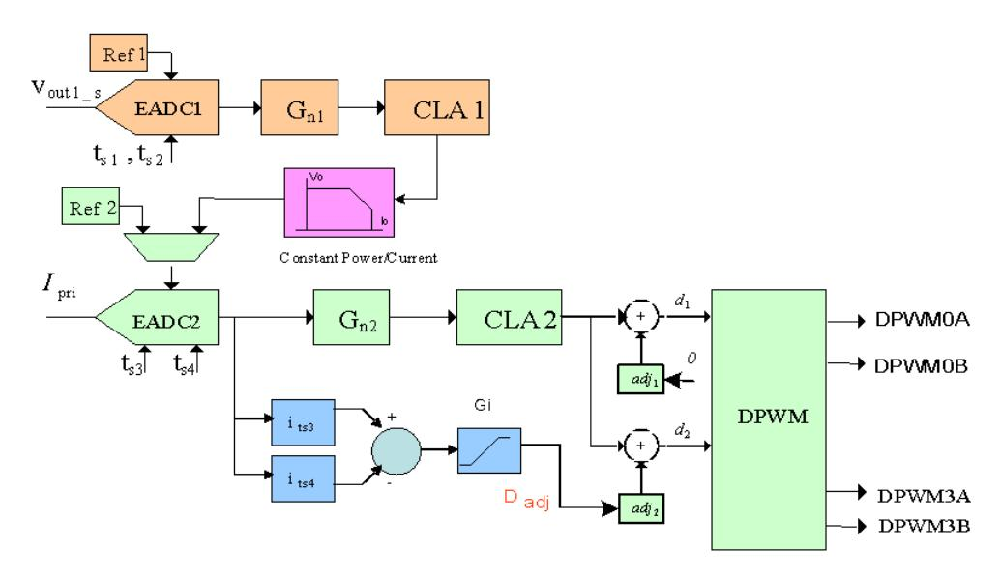

Figure 5-1. UCD3138 Flux Balancing Approach

#### <span id="page-189-2"></span><span id="page-189-0"></span>5.13.1 Calculation

The output of this logic is a cycle adjustment number provided to the DPWM based on the difference between two samples from one or two front end EADCs. The equation is:

$$D_{adj} = \llbracket (E \rrbracket_1 - E_2) 2^{CYC_{ADJ}}_{GAIN}$$

where

- Dadi = Duty Cycle Adjust
- $E_1E_2$  = EADC error values( $i_{ts2}$  and  $i_{ts4}$ ) shown in the figure CYC\_ADJ\_GAIN = bitfield value in CYCADJCTRL register (2)


# <span id="page-190-0"></span>*5.13.2 Configuration*

Most of the control is in the CYCADJCTRL register.

The measurement starts after a DPWMxA rising edge selected by CYC\_ADJ\_SYNC. After the rising edge, the logic waits for a sample from the Front End selected by FIRST\_SAMPLE\_SEL.

After the first sample, the logic waits for a sample from the Front End selected by SECOND\_SAMPLE\_SEL. After that, it calculates D adj and presents it to the DPWM modules.

All the bit-fields mentioned above are in CYCADJCTRL. There is also a CYC\_ADJ\_EN bit to enable automatic cycle adjustment.

To enable the DPWM to accept the adjustment, it is necessary to set the CLA\_DUTY\_ADJ\_EN bit in DPWMCTRL1.

It is also necessary to provide sample triggers to the EADC, of course.

To prevent excessive adjustment in the event of a measurement failure, the Cycle Adjustment Limit Register (CYCADJLIM) provides upper and lower limits for the

# <span id="page-190-1"></span>*5.13.3 Scaling*

The EADC error signal is scaled at a nominal 1 mV. The output of the Automatic Cycle Adjust Module is scaled at normal resolution – 1 step = 4 ns.

So if is 1 mV, and CYC\_ADJ\_GAIN is 0, the cycle adjustment will be 4 nanoseconds. This will make the duty cycle on any DPWM with CLA\_DUTY\_ADJ\_EN set 4 nanoseconds longer.

# <span id="page-190-2"></span>**5.14 Loop Mux Registers Reference**

# <span id="page-190-3"></span>*5.14.1 Front End Control 0 Mux Register (FECTRL0MUX)*

Address 00020000

**Figure 5-2. Front End Control 0 Mux Register (FECTRL0MUX)**

<span id="page-190-4"></span>

| 13                  |                     | 12                      | 11                      | 10                  |                         | 9                       | 8                   |
|---------------------|---------------------|-------------------------|-------------------------|---------------------|-------------------------|-------------------------|---------------------|
| NL_SEL              |                     | DPWM3_FRAME_<br>SYNC_EN | DPWM2_FRAME_<br>SYNC_EN |                     | DPWM1_FRAME_<br>SYNC_EN | DPWM0_FRAME_<br>SYNC_EN |                     |
|                     | R/W-00              |                         | R/W-0                   | R/W-0               |                         | R/W-0                   | R/W-0               |
| 7                   | 6                   | 5                       | 4                       | 3                   | 2                       | 1                       | 0                   |
| DPWM3_B_<br>TRIG_EN | DPWM2_B_<br>TRIG_EN | DPWM1_B_<br>TRIG_EN     | DPWM0_B_<br>TRIG_EN     | DPWM3_A_<br>TRIG_EN | DPWM2_A_<br>TRIG_EN     | DPWM1_A_<br>TRIG_EN     | DPWM0_A_<br>TRIG_EN |
| R/W-0               | R/W-0               | R/W-0                   | R/W-0                   | R/W-0               | R/W-0                   | R/W-0                   | R/W-0               |

**Table 5-2. Front End Control 0 Mux Register (FECTRL0MUX) Register Field Descriptions**

<span id="page-190-5"></span>

| Bit   | Field                   | Type | Reset | Description                                                                                                                                                                              |
|-------|-------------------------|------|-------|------------------------------------------------------------------------------------------------------------------------------------------------------------------------------------------|
| 13-12 | NL_SEL                  | R/W  | 00    | Configures source of Non-Linear (NL) comparison results used in Automatic Gain<br>Shifting                                                                                               |
|       |                         |      |       | 0 = Filter 0 NL Results used                                                                                                                                                             |
|       |                         |      |       | 1 = Filter 1 NL Results used                                                                                                                                                             |
|       |                         |      |       | 2 = Filter 2 NL Results used (Default)                                                                                                                                                   |
| 11    | DPWM3_FRAME_<br>SYNC_EN | R/W  | 0     | Enables DPWM Trigger from DPWM 3 Frame Sync to Front End Control<br>0 = DPWM 3 Frame Sync not routed to Front End Control (Default)<br>1 = DPWM 3 Frame Sync routed to Front End Control |
| 10    | DPWM2_FRAME_<br>SYNC_EN | R/W  | 0     | Enables DPWM Trigger from DPWM 2 Frame Sync to Front End Control<br>0 = DPWM 2 Frame Sync not routed to Front End Control (Default)<br>1 = DPWM 2 Frame Sync routed to Front End Control |


# **Table 5-2. Front End Control 0 Mux Register (FECTRL0MUX) Register Field Descriptions (continued)**

| Bit | Field                   | Type | Reset | Description                                                                                                                                                                               |  |  |  |
|-----|-------------------------|------|-------|-------------------------------------------------------------------------------------------------------------------------------------------------------------------------------------------|--|--|--|
| 9   | DPWM1_FRAME_<br>SYNC_EN | R/W  | 0     | Enables DPWM Trigger from DPWM 1 Frame Sync to Front End Control<br>0 = DPWM 1 Frame Sync not routed to Front End Control (Default)<br>1 = DPWM 1 Frame Sync routed to Front End Control  |  |  |  |
| 8   | DPWM0_FRAME_<br>SYNC_EN | R/W  | 0     | Enables DPWM Trigger from DPWM 0 Frame Sync to Front End Control<br>0 = DPWM 0 Frame Sync not routed to Front End Control (Default)<br>1 = DPWM 0 Frame Sync routed to Front End Control  |  |  |  |
| 7   | DPWM3_B_TRIG_<br>EN     | R/W  | 0     | Enables DPWM Trigger from DPWM 3 PWM-B to Front End Contro<br>l0 = DPWM 3 PWM-B trigger not routed to Front End Control (Default)<br>1 = DPWM 3 PWM-B trigger routed to Front End Control |  |  |  |
| 6   | DPWM2_B_TRIG_<br>EN     | R/W  | 0     | Enables DPWM Trigger from DPWM 2 PWM-B to Front End Control<br>0 = DPWM 2 PWM-B trigger not routed to Front End Control (Default)<br>1 = DPWM 2 PWM-B trigger routed to Front End Control |  |  |  |
| 5   | DPWM1_B_TRIG_<br>EN     | R/W  | 0     | Enables DPWM Trigger from DPWM 1 PWM-B to Front End Control<br>0 = DPWM 1 PWM-B trigger not routed to Front End Control (Default)<br>1 = DPWM 1 PWM-B trigger routed to Front End Control |  |  |  |
| 4   | DPWM0_B_TRIG_<br>EN     | R/W  | 0     | Enables DPWM Trigger from DPWM 0 PWM-B to Front End Control<br>0 = DPWM 0 PWM-B trigger not routed to Front End Control (Default)<br>1 = DPWM 0 PWM-B trigger routed to Front End Control |  |  |  |
| 3   | DPWM3_A_TRIG_<br>EN     | R/W  | 0     | Enables DPWM Trigger from DPWM 3 PWM-A to Front End Control<br>0 = DPWM 3 PWM-A trigger not routed to Front End Control (Default)<br>1 = DPWM 3 PWM-A trigger routed to Front End Control |  |  |  |
| 2   | DPWM2_A_TRIG_<br>EN     | R/W  | 0     | Enables DPWM Trigger from DPWM 2 PWM-B to Front End Control<br>0 = DPWM 2 PWM-A trigger not routed to Front End Control (Default)<br>1 = DPWM 2 PWM-A trigger routed to Front End Control |  |  |  |
| 1   | DPWM1_A_TRIG_<br>EN     | R/W  | 0     | Enables DPWM Trigger from DPWM 1 PWM-B to Front End Control<br>0 = DPWM 1 PWM-A trigger not routed to Front End Control (Default)<br>1 = DPWM 1 PWM-A trigger routed to Front End Control |  |  |  |
| 0   | DPWM0_A_TRIG_<br>EN     | R/W  | 0     | Enables DPWM Trigger from DPWM 0 PWM-B to Front End Control<br>0 = DPWM 0 PWM-A trigger not routed to Front End Control (Default)<br>1 = DPWM 0 PWM-A trigger routed to Front End Control |  |  |  |


# <span id="page-192-0"></span>*5.14.2 Front End Control 1 Mux Register (FECTRL1MUX)*

Address 00020004

#### **Figure 5-3. Front End Control 1 Mux Register (FECTRL1MUX)**

<span id="page-192-1"></span>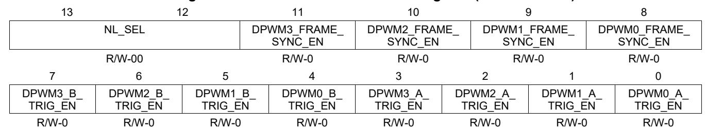

**Table 5-3. Front End Control 1 Mux Register (FECTRL1MUX) Register Field Descriptions**

<span id="page-192-2"></span>

| Bit   | Field                   | Type | Reset | Description                                                                                                                                                                                          |  |  |
|-------|-------------------------|------|-------|------------------------------------------------------------------------------------------------------------------------------------------------------------------------------------------------------|--|--|
| 13-12 | NL_SEL                  | R/W  | 00    | Configures source of Non-Linear (NL) comparison results used in Automatic Gain<br>Shifting<br>0 = Filter 0 NL Results used<br>1 = Filter 1 NL Results used<br>2 = Filter 2 NL Results used (Default) |  |  |
| 11    | DPWM3_FRAME_<br>SYNC_EN | R/W  | 0     | Enables DPWM Trigger from DPWM 3 Frame Sync to Front End Control<br>0 = DPWM 3 Frame Sync not routed to Front End Control (Default)<br>1 = DPWM 3 Frame Sync routed to Front End Control             |  |  |
| 10    | DPWM2_FRAME_<br>SYNC_EN | R/W  | 0     | Enables DPWM Trigger from DPWM 2 Frame Sync to Front End Control<br>0 = DPWM 2 Frame Sync not routed to Front End Control (Default)<br>1 = DPWM 2 Frame Sync routed to Front End Control             |  |  |
| 9     | DPWM1_FRAME_<br>SYNC_EN | R/W  | 0     | Enables DPWM Trigger from DPWM 1 Frame Sync to Front End Control<br>0 = DPWM 1 Frame Sync not routed to Front End Control (Default)<br>1 = DPWM 1 Frame Sync routed to Front End Control             |  |  |
| 8     | DPWM0_FRAME_<br>SYNC_EN | R/W  | 0     | Enables DPWM Trigger from DPWM 0 Frame Sync to Front End Control<br>0 = DPWM 0 Frame Sync not routed to Front End Control (Default)<br>1 = DPWM 0 Frame Sync routed to Front End Control             |  |  |
| 7     | DPWM3_B_TRIG_<br>EN     | R/W  | 0     | Enables DPWM Trigger from DPWM 3 PWM-B to Front End Control<br>0 = DPWM 3 PWM-B trigger not routed to Front End Control (Default)<br>1 = DPWM 3 PWM-B trigger routed to Front End Control            |  |  |
| 6     | DPWM2_B_TRIG_<br>EN     | R/W  | 0     | Enables DPWM Trigger from DPWM 2 PWM-B to Front End Control<br>0 = DPWM 2 PWM-B trigger not routed to Front End Control (Default)<br>1 = DPWM 2 PWM-B trigger routed to Front End Control            |  |  |
| 5     | DPWM1_B_TRIG_<br>EN     | R/W  | 0     | Enables DPWM Trigger from DPWM 1 PWM-B to Front End Control<br>0 = DPWM 1 PWM-B trigger not routed to Front End Control (Default)<br>1 = DPWM 1 PWM-B trigger routed to Front End Control            |  |  |
| 4     | DPWM0_B_TRIG_<br>EN     | R/W  | 0     | Enables DPWM Trigger from DPWM 0 PWM-B to Front End Control<br>0 = DPWM 0 PWM-B trigger not routed to Front End Control (Default)<br>1 = DPWM 0 PWM-B trigger routed to Front End Control            |  |  |
| 3     | DPWM3_A_TRIG_<br>EN     | R/W  | 0     | Enables DPWM Trigger from DPWM 3 PWM-A to Front End Control<br>0 = DPWM 3 PWM-A trigger not routed to Front End Control (Default)<br>1 = DPWM 3 PWM-A trigger routed to Front End Control            |  |  |
| 2     | DPWM2_A_TRIG_<br>EN     | R/W  | 0     | Enables DPWM Trigger from DPWM 2 PWM-B to Front End Control<br>0 = DPWM 2 PWM-A trigger not routed to Front End Control (Default)<br>1 = DPWM 2 PWM-A trigger routed to Front End Control            |  |  |


### **Table 5-3. Front End Control 1 Mux Register (FECTRL1MUX) Register Field Descriptions (continued)**

| Bit | Field               | Type | Reset | Description                                                                                                                                                                               |
|-----|---------------------|------|-------|-------------------------------------------------------------------------------------------------------------------------------------------------------------------------------------------|
| 1   | DPWM1_A_TRIG_<br>EN | R/W  | 0     | Enables DPWM Trigger from DPWM 1 PWM-B to Front End Control<br>0 = DPWM 1 PWM-A trigger not routed to Front End Control (Default)<br>1 = DPWM 1 PWM-A trigger routed to Front End Control |
| 0   | DPWM0_A_TRIG_<br>EN | R/W  | 0     | Enables DPWM Trigger from DPWM 0 PWM-B to Front End Control<br>0 = DPWM 0 PWM-A trigger not routed to Front End Control (Default)<br>1 = DPWM 0 PWM-A trigger routed to Front End Control |


# <span id="page-194-0"></span>*5.14.3 Front End Control 2 Mux Register (FECTRL2MUX)*

Address 00020008

#### **Figure 5-4. Front End Control 2 Mux Register (FECTRL2MUX)**

| 13                  | 12                  |                     | 11                      | 10                      |                     | 9                       | 8                       |
|---------------------|---------------------|---------------------|-------------------------|-------------------------|---------------------|-------------------------|-------------------------|
|                     | NL_SEL              |                     | DPWM3_FRAME_<br>SYNC_EN | DPWM2_FRAME_<br>SYNC_EN |                     | DPWM1_FRAME_<br>SYNC_EN | DPWM0_FRAME_<br>SYNC_EN |
|                     | R/W-00              |                     | R/W-0                   | R/W-0                   |                     | R/W-0                   | R/W-0                   |
| 7                   | 6                   | 5                   | 4                       | 3                       | 2                   | 1                       | 0                       |
| DPWM3_B_<br>TRIG_EN | DPWM2_B_<br>TRIG_EN | DPWM1_B_<br>TRIG_EN | DPWM0_B_<br>TRIG_EN     | DPWM3_A_<br>TRIG_EN     | DPWM2_A_<br>TRIG_EN | DPWM1_A_<br>TRIG_EN     | DPWM0_A_<br>TRIG_EN     |
| R/W-0               | R/W-0               | R/W-0               | R/W-0                   | R/W-0                   | R/W-0               | R/W-0                   | R/W-0                   |

**Table 5-4. Front End Control 2 Mux Register (FECTRL2MUX) Register Field Descriptions**

<span id="page-194-1"></span>

| Bit   | Field                   | Type | Reset | Description                                                                                                                                                                               |  |  |  |
|-------|-------------------------|------|-------|-------------------------------------------------------------------------------------------------------------------------------------------------------------------------------------------|--|--|--|
| 13-12 | NL_SEL                  | R/W  | 00    | Configures source of Non-Linear (NL) comparison results used in Automatic Gain<br>Shifting<br>0 = Filter 0 NL Results used<br>1 = Filter 1 NL Results used                                |  |  |  |
|       |                         |      |       | 2 = Filter 2 NL Results used (Default)                                                                                                                                                    |  |  |  |
| 11    | DPWM3_FRAME_<br>SYNC_EN | R/W  | 0     | Enables DPWM Trigger from DPWM 3 Frame Sync to Front End Control<br>0 = DPWM 3 Frame Sync not routed to Front End Control (Default)<br>1 = DPWM 3 Frame Sync routed to Front End Control  |  |  |  |
| 10    | DPWM2_FRAME_<br>SYNC_EN | R/W  | 0     | Enables DPWM Trigger from DPWM 2 Frame Sync to Front End Control<br>0 = DPWM 2 Frame Sync not routed to Front End Control (Default)<br>1 = DPWM 2 Frame Sync routed to Front End Control  |  |  |  |
| 9     | DPWM1_FRAME_<br>SYNC_EN | R/W  | 0     | Enables DPWM Trigger from DPWM 1 Frame Sync to Front End Control<br>0 = DPWM 1 Frame Sync not routed to Front End Control (Default)<br>1 = DPWM 1 Frame Sync routed to Front End Control  |  |  |  |
| 8     | DPWM0_FRAME_<br>SYNC_EN | R/W  | 0     | Enables DPWM Trigger from DPWM 0 Frame Sync to Front End Control<br>0 = DPWM 0 Frame Sync not routed to Front End Control (Default)<br>1 = DPWM 0 Frame Sync routed to Front End Control  |  |  |  |
| 7     | DPWM3_B_TRIG_<br>EN     | R/W  | 0     | Enables DPWM Trigger from DPWM 3 PWM-B to Front End Control<br>0 = DPWM 3 PWM-B trigger not routed to Front End Control (Default)<br>1 = DPWM 3 PWM-B trigger routed to Front End Control |  |  |  |
| 6     | DPWM2_B_TRIG_<br>EN     | R/W  | 0     | Enables DPWM Trigger from DPWM 2 PWM-B to Front End Control<br>0 = DPWM 2 PWM-B trigger not routed to Front End Control (Default)<br>1 = DPWM 2 PWM-B trigger routed to Front End Control |  |  |  |
| 5     | DPWM1_B_TRIG_<br>EN     | R/W  | 0     | Enables DPWM Trigger from DPWM 1 PWM-B to Front End Control<br>0 = DPWM 1 PWM-B trigger not routed to Front End Control (Default)<br>1 = DPWM 1 PWM-B trigger routed to Front End Control |  |  |  |
| 4     | DPWM0_B_TRIG_<br>EN     | R/W  | 0     | Enables DPWM Trigger from DPWM 0 PWM-B to Front End Control<br>0 = DPWM 0 PWM-B trigger not routed to Front End Control (Default)<br>1 = DPWM 0 PWM-B trigger routed to Front End Control |  |  |  |
| 3     | DPWM3_A_TRIG_<br>EN     | R/W  | 0     | Enables DPWM Trigger from DPWM 3 PWM-A to Front End Control<br>0 = DPWM 3 PWM-A trigger not routed to Front End Control (Default)<br>1 = DPWM 3 PWM-A trigger routed to Front End Control |  |  |  |
| 2     | DPWM2_A_TRIG_<br>EN     | R/W  | 0     | Enables DPWM Trigger from DPWM 2 PWM-B to Front End Control<br>0 = DPWM 2 PWM-A trigger not routed to Front End Control (Default)<br>1 = DPWM 2 PWM-A trigger routed to Front End Control |  |  |  |


### **Table 5-4. Front End Control 2 Mux Register (FECTRL2MUX) Register Field Descriptions (continued)**

| Bit | Field               | Type | Reset | Description                                                                                                                                                                               |
|-----|---------------------|------|-------|-------------------------------------------------------------------------------------------------------------------------------------------------------------------------------------------|
| 1   | DPWM1_A_TRIG_<br>EN | R/W  | 0     | Enables DPWM Trigger from DPWM 1 PWM-B to Front End Control<br>0 = DPWM 1 PWM-A trigger not routed to Front End Control (Default)<br>1 = DPWM 1 PWM-A trigger routed to Front End Control |
| 0   | DPWM0_A_TRIG_<br>EN | R/W  | 0     | Enables DPWM Trigger from DPWM 0 PWM-B to Front End Control<br>0 = DPWM 0 PWM-A trigger not routed to Front End Control (Default)<br>1 = DPWM 0 PWM-A trigger routed to Front End Control |


# <span id="page-196-0"></span>*5.14.4 Sample Trigger Control Register (SAMPTRIGCTRL)*

Address 0002000C

**Figure 5-5. Sample Trigger Control Register (SAMPTRIGCTRL)**

<span id="page-196-1"></span>

| 11                    |                       |                       | 10                    |                       | 9                     | 8                     |                       |
|-----------------------|-----------------------|-----------------------|-----------------------|-----------------------|-----------------------|-----------------------|-----------------------|
| FE2_TRIG_DPWM3_EN     |                       | FE2_TRIG_DPWM2_EN     |                       | FE2_TRIG_DPWM1_EN     |                       | FE2_TRIG_DPWM0_EN     |                       |
| R/W-0                 |                       | R/W-0                 |                       | R/W-0                 |                       | R/W-0                 |                       |
| 7                     | 6                     | 5                     | 4                     | 3                     | 2                     | 1                     | 0                     |
| FE1_TRIG_<br>DPWM3_EN | FE1_TRIG_<br>DPWM2_EN | FE1_TRIG_<br>DPWM1_EN | FE1_TRIG_<br>DPWM0_EN | FE0_TRIG_<br>DPWM3_EN | FE0_TRIG_<br>DPWM2_EN | FE0_TRIG_<br>DPWM1_EN | FE0_TRIG_<br>DPWM0_EN |
| R/W-0                 | R/W-0                 | R/W-0                 | R/W-0                 | R/W-0                 | R/W-0                 | R/W-0                 | R/W-0                 |

**Table 5-5. Sample Trigger Control Register (SAMPTRIGCTRL) Register Field Descriptions**

<span id="page-196-2"></span>

| Bit | Field                 | Type | Reset | Description                                                                                                                                                                                   |  |  |  |
|-----|-----------------------|------|-------|-----------------------------------------------------------------------------------------------------------------------------------------------------------------------------------------------|--|--|--|
| 11  | FE2_TRIG_<br>DPWM3_EN | R/W  | 0     | Enables Sample Trigger from DPWM 3 to Front End Control 2<br>0 = DPWM 3 Sample Trigger not routed to Front End Control 2 (Default)<br>1 = DPWM 3 Sample Trigger routed to Front End Control 2 |  |  |  |
| 10  | FE2_TRIG_<br>DPWM2_EN | R/W  | 0     | Enables Sample Trigger from DPWM 2 to Front End Control 2<br>0 = DPWM 2 Sample Trigger not routed to Front End Control 2 (Default)<br>1 = DPWM 2 Sample Trigger routed to Front End Control 2 |  |  |  |
| 9   | FE2_TRIG_<br>DPWM1_EN | R/W  | 0     | Enables Sample Trigger from DPWM 1 to Front End Control 2<br>0 = DPWM 1 Sample Trigger not routed to Front End Control 2 (Default)<br>1 = DPWM 1 Sample Trigger routed to Front End Control 2 |  |  |  |
| 8   | FE2_TRIG_<br>DPWM0_EN | R/W  | 0     | Enables Sample Trigger from DPWM 0 to Front End Control 2<br>0 = DPWM 0 Sample Trigger not routed to Front End Control 2 (Default)<br>1 = DPWM 0 Sample Trigger routed to Front End Control 2 |  |  |  |
| 7   | FE1_TRIG_<br>DPWM3_EN | R/W  | 0     | Enables Sample Trigger from DPWM 3 to Front End Control 1<br>0 = DPWM 3 Sample Trigger not routed to Front End Control 1 (Default)<br>1 = DPWM 3 Sample Trigger routed to Front End Control 1 |  |  |  |
| 6   | FE1_TRIG_<br>DPWM2_EN | R/W  | 0     | Enables Sample Trigger from DPWM 2 to Front End Control 1<br>0 = DPWM 2 Sample Trigger not routed to Front End Control 1 (Default)<br>1 = DPWM 2 Sample Trigger routed to Front End Control 1 |  |  |  |
| 5   | FE1_TRIG_<br>DPWM1_EN | R/W  | 0     | Enables Sample Trigger from DPWM 1 to Front End Control 1<br>0 = DPWM 1 Sample Trigger not routed to Front End Control 1 (Default)<br>1 = DPWM 1 Sample Trigger routed to Front End Control 1 |  |  |  |
| 4   | FE1_TRIG_<br>DPWM0_EN | R/W  | 0     | Enables Sample Trigger from DPWM 0 to Front End Control 1<br>0 = DPWM 0 Sample Trigger not routed to Front End Control 1 (Default)<br>1 = DPWM 0 Sample Trigger routed to Front End Control 1 |  |  |  |
| 3   | FE0_TRIG_<br>DPWM3_EN | R/W  | 0     | Enables Sample Trigger from DPWM 3 to Front End Control 0<br>0 = DPWM 3 Sample Trigger not routed to Front End Control 0 (Default)<br>1 = DPWM 3 Sample Trigger routed to Front End Control 0 |  |  |  |
| 2   | FE0_TRIG_<br>DPWM2_EN | R/W  | 0     | Enables Sample Trigger from DPWM 2 to Front End Control 0<br>0 = DPWM 2 Sample Trigger not routed to Front End Control 0 (Default)<br>1 = DPWM 2 Sample Trigger routed to Front End Control 0 |  |  |  |
| 1   | FE0_TRIG_<br>DPWM1_EN | R/W  | 0     | Enables Sample Trigger from DPWM 1 to Front End Control 0<br>0 = DPWM 1 Sample Trigger not routed to Front End Control 0 (Default)<br>1 = DPWM 1 Sample Trigger routed to Front End Control 0 |  |  |  |
| 0   | FE0_TRIG_<br>DPWM0_EN | R/W  | 0     | Enables Sample Trigger from DPWM 0 to Front End Control 0<br>0 = DPWM 0 Sample Trigger not routed to Front End Control 0 (Default)<br>1 = DPWM 0 Sample Trigger routed to Front End Control 0 |  |  |  |


# <span id="page-197-0"></span>*5.14.5 External DAC Control Register (EXTDACCTRL)*

Address 00020010

### **Figure 5-6. External DAC Control Register (EXTDACCTRL)**

<span id="page-197-1"></span>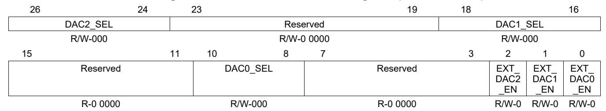

**Table 5-6. External DAC Control Register (EXTDACCTRL) Register Field Descriptions**

<span id="page-197-2"></span>

| Bit   | Field       | Type | Reset  | Description                                                                                      |
|-------|-------------|------|--------|--------------------------------------------------------------------------------------------------|
| 26-24 | DAC2_SEL    | R/W  | 000    | Configures DAC 2 setpoint in External DAC Mode<br>0 = DAC 0 Setpoint Selected (Default)          |
|       |             |      |        | 1 = DAC 1 Setpoint Selected                                                                      |
|       |             |      |        | 3 = Output of Constant Power Module Selected                                                     |
|       |             |      |        | 4 = Filter 0 Output Selected                                                                     |
|       |             |      |        | 5 = Filter 1 Output Selected                                                                     |
|       |             |      |        | 6 = Filter 2 Output Selected                                                                     |
| 23-19 | Reserved    | R    | 0 0000 |                                                                                                  |
| 18-16 | DAC1_SEL    | R/W  | 000    | Configures DAC 1 setpoint in External DAC Mode                                                   |
|       |             |      |        | 0 = DAC 0 Setpoint Selected (Default)                                                            |
|       |             |      |        | 2 = DAC 2 Setpoint Selected                                                                      |
|       |             |      |        | 3 = Output of Constant Power Module Selected                                                     |
|       |             |      |        | 4 = Filter 0 Output Selected                                                                     |
|       |             |      |        | 5 = Filter 1 Output Selected                                                                     |
|       |             |      |        | 6 = Filter 2 Output Selected                                                                     |
| 15-11 | Reserved    | R    | 0 0000 |                                                                                                  |
| 10-8  | DAC0_SEL    | R/W  | 000    | Configures DAC 0 setpoint in External DAC Mode                                                   |
|       |             |      |        | 1 = DAC 1 Setpoint Selected                                                                      |
|       |             |      |        | 2 = DAC 2 Setpoint Selected                                                                      |
|       |             |      |        | 3 = Output of Constant Power Module Selected                                                     |
|       |             |      |        | 4 = Filter 0 Output Selected                                                                     |
|       |             |      |        | 5 = Filter 1 Output Selected                                                                     |
|       |             |      |        | 6 = Filter 2 Output Selected                                                                     |
| 7-3   | Reserved    | R    | 0 0000 |                                                                                                  |
| 2     | EXT_DAC2_EN | R/W  | 0      | External DAC 1 Mode Enable                                                                       |
|       |             |      |        | 0 = External DAC Mode disabled. DAC 1 setpoint driven from Front End Control<br>Module (Default) |
|       |             |      |        | 1 = External DAC Mode enabled, DAC 1 setpoint driven by DAC1_SEL configuration                   |
| 1     | EXT_DAC1_EN | R/W  | 0      | External DAC 1 Mode Enable                                                                       |
|       |             |      |        | 0 = External DAC Mode disabled. DAC 1 setpoint driven from Front End Control<br>Module (Default) |
|       |             |      |        | 1 = External DAC Mode enabled, DAC 1 setpoint driven by DAC1_SEL configuration                   |
| 0     | EXT_DAC0_EN | R/W  | 0      | External DAC 0 Mode Enable                                                                       |
|       |             |      |        | 0 = External DAC Mode disabled. DAC 0 setpoint driven from Front End Control<br>Module (Default) |
|       |             |      |        | 1 = External DAC Mode enabled, DAC 0 setpoint driven by DAC0_SEL configuration                   |


# <span id="page-198-0"></span>*5.14.6 Filter Mux Register (FILTERMUX)*

Address 00020014

**Figure 5-7. Filter Mux Register (FILTERMUX)**

<span id="page-198-1"></span>

| 29       | 28                |          | 27              | 26                |                      | 25                   | 24                   |  |  |
|----------|-------------------|----------|-----------------|-------------------|----------------------|----------------------|----------------------|--|--|
|          | FILTER2_KCOMP_SEL |          |                 | FILTER1_KCOMP_SEL |                      |                      | FILTER0_KCOMP_SEL    |  |  |
|          | R/W-00            |          |                 | R/W-00            |                      | R/W-00               |                      |  |  |
| 23       |                   |          |                 | 19                | 18                   | 17                   | 16                   |  |  |
|          |                   | Reserved |                 |                   | FILTER2_<br>FFWD_SEL | FILTER1_<br>FFWD_SEL | FILTER0_<br>FFWD_SEL |  |  |
|          |                   | R-0 0000 |                 |                   | R/W-0                | R/W-0                | R/W-0                |  |  |
| 15       | 14                | 13       | 12              | 11                | 10                   | 9                    | 8                    |  |  |
| Reserved |                   |          | FILTER2_PER_SEL |                   | FILTER1_PER_SEL      |                      | FILTER0_PER_SEL      |  |  |
| R-00     |                   |          | R/W-00          |                   | R/W-00               |                      | R/W-00               |  |  |
| 7        | 6                 | 5        | 4               | 3                 | 2                    | 1                    | 0                    |  |  |
| Reserved |                   |          | FILTER2_FE_SEL  | FILTER1_FE_SEL    |                      | FILTER0_FE_SEL       |                      |  |  |
|          | R-00<br>R/W-10    |          |                 | R/W-01            |                      | R/W-00               |                      |  |  |

LEGEND: R/W = Read/Write; R = Read only; -*n* = value after reset

### **Table 5-7. Filter Mux Register (FILTERMUX) Register Field Descriptions**

<span id="page-198-2"></span>

| Bit   | Field                 | Type | Reset  | Description                                                                                                                                                                                        |
|-------|-----------------------|------|--------|----------------------------------------------------------------------------------------------------------------------------------------------------------------------------------------------------|
| 29-28 | FILTER2_KCOMP<br>_SEL | R/W  | 00     | Selects KComp value routed to Filter 2 Module<br>0 = KComp 0 Value Selected (Default)<br>1 = KComp 1 Value Selected<br>2 = KComp 2 Value Selected                                                  |
| 27-26 | FILTER1_KCOMP<br>_SEL | R/W  | 00     | Selects KComp value routed to Filter 1 Module<br>0 = KComp 0 Value Selected (Default)<br>1 = KComp 1 Value Selected<br>2 = KComp 2 Value Selected                                                  |
| 25-24 | FILTER0_KCOMP<br>_SEL | R/W  | 00     | Selects KComp value routed to Filter 0 Module<br>0 = KComp 0 Value Selected (Default)<br>1 = KComp 1 Value Selected<br>2 = KComp 2 Value Selected                                                  |
| 23-19 | Reserved              | R    | 0 0000 |                                                                                                                                                                                                    |
| 18    | FILTER2_FFWD<br>_SEL  | R/W  | 0      | Configures Feedforward value routed to Filter 2 Module<br>0 = Filter 0 Output Selected (Default)<br>1 = Filter 1 Output Selected                                                                   |
| 17    | FILTER1_FFWD<br>_SEL  | R/W  | 0      | Configures Feedforward value routed to Filter 1 Module<br>0 = Filter 0 Output Selected (Default)<br>1 = Filter 2 Output Selected                                                                   |
| 16    | FILTER0_FFWD<br>_SEL  | R/W  | 0      | Configures Feedforward value routed to Filter 0 Module<br>0 = Filter 1 Output Selected (Default)<br>1 = Filter 2 Output Selected                                                                   |
| 15-14 | Reserved              | R    | 00     |                                                                                                                                                                                                    |
| 13-12 | FILTER2_PER<br>_SEL   | R/W  | 00     | Selects source of switching cycle period for Filter 2 Module<br>0 = DPWM 0 Switching Period (Default)<br>1 = DPWM 1 Switching Period<br>2 = DPWM 2 Switching Period<br>3 = DPWM 3 Switching Period |


# **Table 5-7. Filter Mux Register (FILTERMUX) Register Field Descriptions (continued)**

| Bit   | Field               | Type | Reset | Description                                                                                                                                                                                                                      |
|-------|---------------------|------|-------|----------------------------------------------------------------------------------------------------------------------------------------------------------------------------------------------------------------------------------|
| 11-10 | FILTER1_PER<br>_SEL | R/W  | 00    | Selects source of switching cycle period for Filter 1 Module<br>0 = DPWM 0 Switching Period (Default)<br>1 = DPWM 1 Switching Period<br>2 = DPWM 2 Switching Period<br>3 = DPWM 3 Switching Period                               |
| 9-8   | FILTER0_PER<br>_SEL | R/W  | 00    | Selects source of switching cycle period for Filter 0 Module<br>0 = DPWM 0 Switching Period (Default)<br>1 = DPWM 1 Switching Period<br>2 = DPWM 2 Switching Period<br>3 = DPWM 3 Switching Period                               |
| 7-6   | Reserved            | R    |       |                                                                                                                                                                                                                                  |
| 5-4   | FILTER2_FE_SEL      | R/W  | 10    | Selects which Front End Module provides data for Filter 2 Module<br>0 = Front End Module 0 provides data to Filter<br>1 = Front End Module 1 provides data to Filter<br>2 = Front End Module 2 provides data to Filter (Default) |
| 3-2   | FILTER1_FE_SEL      | R/W  | 01    | Selects which Front End Module provides data for Filter 1 Module<br>0 = Front End Module 0 provides data to Filter<br>1 = Front End Module 1 provides data to Filter (Default)<br>2 = Front End Module 2 provides data to Filter |
| 1-0   | FILTER0_FE_SEL      | R/W  | 00    | Selects which Front End Module provides data for Filter 0 Module<br>0 = Front End Module 0 provides data to Filter (Default)<br>1 = Front End Module 1 provides data to Filter<br>2 = Front End Module 2 provides data to Filter |


# <span id="page-200-0"></span>*5.14.7 Filter KComp A Register (FILTERKCOMPA)*

Address 00020018

### **Figure 5-8. Filter KComp A Register (FILTERKCOMPA)**

<span id="page-200-1"></span>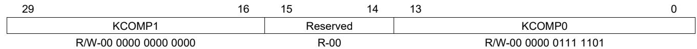

LEGEND: R/W = Read/Write; R = Read only; -*n* = value after reset

### **Table 5-8. Filter KComp A Register (FILTERKCOMPA) Register Field Descriptions**

<span id="page-200-2"></span>

| Bit   | Field    | Type | Reset                   | Description                                                                                  |
|-------|----------|------|-------------------------|----------------------------------------------------------------------------------------------|
| 29-16 | KCOMP1   | R/W  | 00 0000<br>0000<br>0000 | 14-bit value used in filter output calculations replacing the DPWM switching period<br>value |
| 15-14 | Reserved | R    | 00                      |                                                                                              |
| 13-0  | KCOMP0   | R/W  | 00 0000<br>0111<br>1101 | 14-bit value used in filter output calculations replacing the DPWM switching period<br>value |


### <span id="page-201-0"></span>*5.14.8 Filter KComp B Register (FILTERKCOMPB)*

Address 0002001C

# **Figure 5-9. Filter KComp B Register (FILTERKCOMPB)**

<span id="page-201-1"></span>13 0

KCOMP2

R/W-00 0000 0000 0000

LEGEND: R/W = Read/Write; R = Read only; -*n* = value after reset

### **Table 5-9. Filter KComp B Register (FILTERKCOMPB) Register Field Descriptions**

<span id="page-201-2"></span>

| Bit  | Field  | Type | Reset                   | Description                                                                                  |
|------|--------|------|-------------------------|----------------------------------------------------------------------------------------------|
| 13-0 | KCOMP2 | R/W  | 00 0000<br>0000<br>0000 | 14-bit value used in filter output calculations replacing the DPWM switching period<br>value |


# <span id="page-202-0"></span>*5.14.9 DPWM Mux Register (DPWMMUX)*

Address 00020020

### **Figure 5-10. DPWM Mux Register (DPWMMUX)**

<span id="page-202-1"></span>

| 31 | 30                               | 29                 | 28               | 27                 | 26               | 25                 | 24                   |
|----|----------------------------------|--------------------|------------------|--------------------|------------------|--------------------|----------------------|
|    | DPWM3_SYNC_FET_SEL               | DPWM2_SYNC_FET_SEL |                  | DPWM1_SYNC_FET_SEL |                  | DPWM0_SYNC_FET_SEL |                      |
|    | R/W-00                           | R/W-00             |                  | R/W-00             |                  | R/W-00             |                      |
| 23 | 22                               | 21                 | 20               | 19                 | 18               | 17                 | 16                   |
|    |                                  | Reserved           |                  | DPWM3_SYNC_SEL     |                  |                    | DPWM2_SYNC_SEL       |
|    | R-0000                           |                    |                  | R/W-00             |                  | R/W-00             |                      |
| 15 | 14                               | 13                 | 12               | 11                 | 10               | 9                  | 8                    |
|    | DPWM1_SYNC_SEL<br>DPWM0_SYNC_SEL |                    |                  | DPWM3_FILTER_SEL   |                  |                    | DPWM2_<br>FILTER_SEL |
|    | R/W-00                           |                    | R/W-00           |                    | R/W-010          |                    | R/W-010              |
| 7  | 6<br>5                           |                    | 4                | 3                  | 2                | 1                  | 0                    |
|    | DPWM2_FILTER_SEL                 |                    | DPWM1_FILTER_SEL |                    | DPWM0_FILTER_SEL |                    |                      |
|    | R/W-010                          |                    | R/W-001          |                    | R/W-000          |                    |                      |

LEGEND: R/W = Read/Write; R = Read only; -*n* = value after reset

# **Table 5-10. DPWM Mux Register (DPWMMUX) Register Field Descriptions**

| Bit   | Field                  | Type | Reset | Description                                                                                                                                                                               |
|-------|------------------------|------|-------|-------------------------------------------------------------------------------------------------------------------------------------------------------------------------------------------|
| 31-30 | DPWM3_SYNC<br>_FET_SEL | R/W  | 00    | Selects Ramp source for DPWM3 PWM-B SyncFET soft on/off<br>0 = Front End 0 Ramp output selected (Default)<br>1 = Front End 1 Ramp output selected<br>2 = Front End 2 Ramp output selected |
| 29-28 | DPWM2_SYNC<br>_FET_SEL | R/W  | 00    | Selects Ramp source for DPWM2 PWM-B SyncFET soft on/off<br>0 = Front End 0 Ramp output selected (Default)<br>1 = Front End 1 Ramp output selected<br>2 = Front End 2 Ramp output selected |
| 27-26 | DPWM1_SYNC<br>_FET_SEL | R/W  | 00    | Selects Ramp source for DPWM1 PWM-B SyncFET soft on/off<br>0 = Front End 0 Ramp output selected (Default)<br>1 = Front End 1 Ramp output selected<br>2 = Front End 2 Ramp output selected |
| 25-24 | DPWM0_SYNC<br>_FET_SEL | R/W  | 00    | Selects Ramp source for DPWM0 PWM-B SyncFET soft on/off<br>0 = Front End 0 Ramp output selected (Default)<br>1 = Front End 1 Ramp output selected<br>2 = Front End 2 Ramp output selected |
| 23-20 | Reserved               | R    | 0000  |                                                                                                                                                                                           |
| 19-18 | DPWM3_SYNC<br>_SEL     | R/W  | 00    | Selects Master Sync for DPWM 3 when DPWM 3 configured in slave mode<br>0 = DPWM 0 Sync (Default)<br>1 = DPWM 1 Sync<br>2 = DPWM 2 Sync<br>3 = DPWM 3 Sync                                 |
| 17-16 | DPWM2_SYNC<br>_SEL     | R/W  | 00    | Selects Master Sync for DPWM 2 when DPWM 2 configured in slave mode<br>0 = DPWM 0 Sync (Default)<br>1 = DPWM 1 Sync<br>2 = DPWM 2 Sync<br>3 = DPWM 3 Sync                                 |
| 15-14 | DPWM1_SYNC<br>_SEL     | R/W  | 00    | Selects Master Sync for DPWM 1 when DPWM 1 configured in slave mode<br>0 = DPWM 0 Sync (Default)<br>1 = DPWM 1 Sync<br>2 = DPWM 2 Sync<br>3 = DPWM 3 Sync                                 |


# **Table 5-10. DPWM Mux Register (DPWMMUX) Register Field Descriptions (continued)**

| Bit   | Field                | Type | Reset | Description                                                                                                                                                                                                                                                               |
|-------|----------------------|------|-------|---------------------------------------------------------------------------------------------------------------------------------------------------------------------------------------------------------------------------------------------------------------------------|
| 13-12 | DPWM0_SYNC<br>_SEL   | R/W  | 00    | Selects Master Sync for DPWM 0 when DPWM 0 configured in slave mode<br>0 = DPWM 0 Sync (Default)<br>1 = DPWM 1 Sync<br>2 = DPWM 2 Sync<br>3 = DPWM 3 Sync                                                                                                                 |
| 11-9  | DPWM3_FILTER<br>_SEL | R/W  | 010   | Selects source of duty cycle/resonant period for DPWM Module 3<br>0 = Filter 0 Output Selected (Default)<br>1 = Filter 1 Output Selected<br>2 = Filter 2 Output Selected<br>3 = Constant Power Module Selected<br>4 = DPWM_ON_TIME value from Light Load Control Register |
| 8-6   | DPWM2_FILTER<br>_SEL | R/W  | 010   | Selects source of duty cycle/resonant period for DPWM Module 2<br>0 = Filter 0 Output Selected (Default)<br>1 = Filter 1 Output Selected<br>2 = Filter 2 Output Selected<br>3 = Constant Power Module Selected<br>4 = DPWM_ON_TIME value from Light Load Control Register |
| 5-3   | DPWM1_FILTER<br>_SEL | R/W  | 001   | Selects source of duty cycle/resonant period for DPWM Module 1<br>0 = Filter 0 Output Selected (Default)<br>1 = Filter 1 Output Selected<br>2 = Filter 2 Output Selected<br>3 = Constant Power Module Selected<br>4 = DPWM_ON_TIME value from Light Load Control Register |
| 2-0   | DPWM0_FILTER<br>_SEL | R/W  | 000   | Selects source of duty cycle/resonant period for DPWM Module 0<br>0 = Filter 0 Output Selected (Default)<br>1 = Filter 1 Output Selected<br>2 = Filter 2 Output Selected<br>3 = Constant Power Module Selected<br>4 = DPWM_ON_TIME value from Light Load Control Register |


# <span id="page-204-0"></span>*5.14.10 Constant Power Control Register (CPCTRL)*

Address 00020024

**Figure 5-11. Constant Power Control Register (CPCTRL)**

<span id="page-204-1"></span>

| 15              | 14                | 13                | 12                  | 11 | 10          | 9               | 8         |
|-----------------|-------------------|-------------------|---------------------|----|-------------|-----------------|-----------|
| DAC_COMP<br>_EN | FW_DIVISOR<br>_EN | LOWER<br>_COMP_EN | VLOOP<br>_FREEZE_EN |    | VLOOP_SEL   |                 | CLOOP_SEL |
| R/W-0           | R/W-0             | R/W-0             | R/W-0               |    | R/W-00      |                 | R/W-00    |
| 7               | 6                 | 5                 | 4                   | 3  | 2           | 1               | 0         |
|                 | THRESH_SEL        |                   | DIVISOR_SEL         |    | CCPC_INT_EN | CPCC_<br>CONFIG | CPCC_EN   |
|                 | R/W-000           |                   | R/W-00              |    | R/W-0       | R/W-0           | R/W-0     |

**Table 5-11. Constant Power Control Register (CPCTRL) Register Field Descriptions**

<span id="page-204-2"></span>

| Bit   | Field               | Type | Reset | Description                                                                                                                                                                                                                      |
|-------|---------------------|------|-------|----------------------------------------------------------------------------------------------------------------------------------------------------------------------------------------------------------------------------------|
| 15    | DAC_COMP_EN         | R/W  | 0     | Enables comparison of DAC Setpoint and quotient of Max Power/Sense Current in<br>Loop Switching Mode. Minimum of DAC setpoint and calculated quotient sets voltage<br>loop setpoint in Constant Voltage and Constant Power modes |
|       |                     |      |       | 0 = Operating Mode controls Voltage Loop DAC Setpoint (Default)                                                                                                                                                                  |
|       |                     |      |       | 1 = Minimum of DAC setpoint and calculated quotient used as Voltage Loop DAC<br>Setpoint                                                                                                                                         |
| 14    | FW_DIVISOR_EN       | R/W  | 0     | Enables Firmware value for divisor in Constant Power calculations                                                                                                                                                                |
|       |                     |      |       | 0 = Divisor selected by DIVISOR_SEL (Bits 7:6) (Default)                                                                                                                                                                         |
|       |                     |      |       | 1 = Divisor driven by Firmware Current Register                                                                                                                                                                                  |
| 13    | LOWER_COMP<br>_EN   | R/W  | 0     | Enables output of lowest duty from current or voltage loop when Constant<br>Power/Constant Current module controls loop output                                                                                                   |
|       |                     |      |       | 0 = Loop output controlled by mode selection, voltage loop selected in constant<br>voltage and constant power mode, current loop selected in constant current mode<br>(Default)                                                  |
|       |                     |      |       | 1 = Loop output controlled by lowest duty from voltage or current loops                                                                                                                                                          |
| 12    | VLOOP_FREEZE<br>_EN | R/W  | 0     | Enables freezing of Voltage Loop Integrator when current loop selected in Loop<br>Switching configuration                                                                                                                        |
|       |                     |      |       | 0 = Freezing of Voltage Loop Integrator disabled (Default)                                                                                                                                                                       |
|       |                     |      |       | 1 = Freezing of Voltage Loop Integrator enabled                                                                                                                                                                                  |
| 11-10 | VLOOP_SEL           | R/W  | 00    | Configures voltage loop for loop switching mode                                                                                                                                                                                  |
|       |                     |      |       | 0 = Filter 0 Output Selected (Default)                                                                                                                                                                                           |
|       |                     |      |       | 1 = Filter 1 Output Selected                                                                                                                                                                                                     |
|       |                     |      |       | 2 = Filter 2 Output Selected                                                                                                                                                                                                     |
| 9-8   | CLOOP_SEL           | R/W  | 00    | Configures current loop for loop switching mode                                                                                                                                                                                  |
|       |                     |      |       | 0 = Filter 0 Output Selected (Default)                                                                                                                                                                                           |
|       |                     |      |       | 1 = Filter 1 Output Selected                                                                                                                                                                                                     |
|       |                     |      |       | 2 = Filter 2 Output Selected                                                                                                                                                                                                     |
| 7-5   | THRESH_SEL          | R/W  | 000   | Configures input threshold selected for use in Constant Power comparison                                                                                                                                                         |
|       |                     |      |       | 0 = Filter 0 Output Selected (Default)                                                                                                                                                                                           |
|       |                     |      |       | 1 = Filter 1 Output Selected                                                                                                                                                                                                     |
|       |                     |      |       | 2 = Filter 2 Output Selected                                                                                                                                                                                                     |
|       |                     |      |       | 3 = Front End 0 Absolute Value Data Selected                                                                                                                                                                                     |
|       |                     |      |       | 4 = Front End 1 Absolute Value Data Selected                                                                                                                                                                                     |
|       |                     |      |       | 5 = Front End 2 Absolute Value Data Selected                                                                                                                                                                                     |
| 4-3   | DIVISOR_SEL         | R/W  | 00    | Configures value used for divisor in Constant Power calculations                                                                                                                                                                 |
|       |                     |      |       | 0 = Front End 0 Absolute Value Data Selected (Default)                                                                                                                                                                           |
|       |                     |      |       | 1 = Front End 1 Absolute Value Data Selected                                                                                                                                                                                     |
|       |                     |      |       | 2 = Front End 2 Absolute Value Data Selected                                                                                                                                                                                     |


# **Table 5-11. Constant Power Control Register (CPCTRL) Register Field Descriptions (continued)**

| Bit | Field       | Type | Reset | Description                                                                                                                                                                 |
|-----|-------------|------|-------|-----------------------------------------------------------------------------------------------------------------------------------------------------------------------------|
| 2   | CCPC_INT_EN | R/W  | 0     | Constant Power/Constant Current Interrupt Enable<br>0 = Interrupt disabled on mode switches (Default)<br>1 = Interrupt enabled on mode switches                             |
| 1   | CPCC_CONFIG | R/W  | 0     | Controls Constant Power/Constant Current module configuration<br>0 = Average Current Mode (Default)<br>1 = Constant Power Module controls selection of voltage/current loop |
| 0   | CPCC_EN     | R/W  | 0     | Constant Power Constant/Current Module Enable<br>0 = Constant Power/Constant Current Module disabled (Default)<br>1 = Constant Power/Constant Current Module enabled        |


# *5.14.11 Constant Power Nominal Threshold Register (CPNOM)*

Address 00020028

# **Figure 5-12. Constant Power Nominal Threshold Register (CPNOM)**

<span id="page-206-0"></span>

| 25 |                   | 16 | 15 |           | 10 | 9 |                   | 0 |
|----|-------------------|----|----|-----------|----|---|-------------------|---|
|    | NOM_CURRENT_UPPER |    |    | Reserved  |    |   | NOM_CURRENT_LOWER |   |
|    | R/W-00 0000 0000  |    |    | R-00 0000 |    |   | R/W-00 0000 0000  |   |

LEGEND: R/W = Read/Write; R = Read only; -*n* = value after reset

### **Table 5-12. Constant Power Nominal Threshold Register (CPNOM) Register Field Descriptions**

<span id="page-206-1"></span>

| Bit   | Field                 | Type | Reset           | Description                                                                                                                                                                                             |
|-------|-----------------------|------|-----------------|---------------------------------------------------------------------------------------------------------------------------------------------------------------------------------------------------------|
| 25-16 | NOM_CURRENT_<br>UPPER | R/W  | 00 0000<br>0000 | Configures INOM value used in Constant Power/Constant Current Calculations,<br>when sensed value exceeds NOM_CURRENT_UPPER in Constant Voltage mode,<br>setpoint will switch to Constant Power mode     |
| 15-10 | Reserved              | R    | 00 0000         |                                                                                                                                                                                                         |
| 9-0   | NOM_CURRENT_<br>LOWER | R/W  | 00 0000<br>0000 | Configures INOM value used in Constant Power/Constant Current Calculations,<br>when sensed value falls below NOM_CURRENT_LOWER in Constant Power mode,<br>setpoint will switch to Constant Voltage mode |


### <span id="page-207-0"></span>*5.14.12 Constant Power Max Threshold Register (CPMAX)*

Address 0002002C

### **Figure 5-13. Constant Power Max Threshold Register (CPMAX)**

<span id="page-207-1"></span>

| 25                | 16 | 15 |           | 10 | 9 | 0                 |  |
|-------------------|----|----|-----------|----|---|-------------------|--|
| MAX_CURRENT_UPPER |    |    | Reserved  |    |   | MAX_CURRENT_LOWER |  |
| R/W-00 0000 0000  |    |    | R-00 0000 |    |   | R/W-00 0000 0000  |  |

LEGEND: R/W = Read/Write; R = Read only; -*n* = value after reset

### **Table 5-13. Constant Power Max Threshold Register (CPMAX) Register Field Descriptions**

<span id="page-207-2"></span>

| Bit   | Field                 | Type | Reset           | Description                                                                                                                                                                                        |
|-------|-----------------------|------|-----------------|----------------------------------------------------------------------------------------------------------------------------------------------------------------------------------------------------|
| 25-16 | MAX_CURRENT_<br>UPPER | R/W  | 00 0000<br>0000 | Configures IMAX value used in Constant Power/Constant Current Calculations, when<br>sensed value exceeds MAX_CURRENT_UPPER in Constant Power mode, setpoint<br>will switch to Max Current mode     |
| 15-10 | Reserved              | R    | 00 0000         |                                                                                                                                                                                                    |
| 9-0   | MAX_CURRENT_<br>LOWER | R/W  | 00 0000<br>0000 | Configures IMAX value used in Constant Power/Constant Current Calculations, when<br>sensed value falls below MAX_CURRENT_LOWER in Max Current mode, setpoint<br>will switch to Constant Power mode |


# <span id="page-208-0"></span>*5.14.13 Constant Power Configuration Register (CPCONFIG)*

Address 00020030

#### **Figure 5-14. Constant Power Configuration Register (CPCONFIG)**

<span id="page-208-1"></span>

| 25 |                  | 16 | 15 |           | 10 | 9 |                  | 0 |
|----|------------------|----|----|-----------|----|---|------------------|---|
|    | MAX_CURRENT      |    |    | Reserved  |    |   | NOM_VOLTAGE      |   |
|    | R/W-00 0000 0000 |    |    | R-00 0000 |    |   | R/W-00 0000 0000 |   |

LEGEND: R/W = Read/Write; R = Read only; -*n* = value after reset

### **Table 5-14. Constant Power Configuration Register (CPCONFIG) Register Field Descriptions**

<span id="page-208-2"></span>

| Bit   | Field       | Type | Reset           | Description                                                                                                                                   |
|-------|-------------|------|-----------------|-----------------------------------------------------------------------------------------------------------------------------------------------|
| 25-16 | MAX_CURRENT | R/W  | 00 0000<br>0000 | Configures IMAX setpoint used in Constant Power/Constant Current Calculations in<br>Max Current mode                                          |
| 15-10 | Reserved    | R    | 00 0000         |                                                                                                                                               |
| 9-0   | NOM_VOLTAGE | R/W  | 00 0000<br>0000 | Configures VNOM setpoint used in Constant Power/Constant Current Calculations in<br>Constant Voltage mode (Loop Oring configuration selected) |


# <span id="page-209-0"></span>*5.14.14 Constant Power Max Power Register (CPMAXPWR)*

Address 00020034

### **Figure 5-15. Constant Power Max Power Register (CPMAXPWR)**

<span id="page-209-1"></span>19 0

MAX\_POWER

R/W-0000 0000 0000 0000 0000

LEGEND: R/W = Read/Write; R = Read only; -*n* = value after reset

### **Table 5-15. Constant Power Max Power Register (CPMAXPWR)Register Field Descriptions**

| Bit  | Field     | Type | Reset                                | Description                                                                                          |
|------|-----------|------|--------------------------------------|------------------------------------------------------------------------------------------------------|
| 19-0 | MAX_POWER | R/W  | 0000<br>0000<br>0000<br>0000<br>0000 | Configures PMAX value used in Constant Power/Constant Current calculations in<br>Constant Power mode |

<span id="page-210-0"></span>


# *5.14.15 Constant Power Integrator Threshold Register (CPINTTHRESH)*

Address 00020038

**Figure 5-16. Constant Power Integrator Threshold Register (CPINTTHRESH)**

23 0

<span id="page-210-1"></span>INT\_THRESH

R/W-0000 0000 0000 0000 0000

LEGEND: R/W = Read/Write; R = Read only; -*n* = value after reset

#### **Table 5-16. Constant Power Integrator Threshold Register (CPINTTHRESH) Register Field Descriptions**

<span id="page-210-2"></span>

| Bit  | Field      | Type | Reset                                | Description                                                                                                 |
|------|------------|------|--------------------------------------|-------------------------------------------------------------------------------------------------------------|
| 23-0 | INT_THRESH | R/W  | 0000<br>0000<br>0000<br>0000<br>0000 | 24-bit signed value added to Current Loop Duty value to determine when to freeze<br>Current Loop Integrator |


# <span id="page-211-0"></span>*5.14.16 Constant Power Firmware Divisor Register (CPFWDIVISOR)*

Address 0002003C

### **Figure 5-17. Constant Power Firmware Divisor Register (CPFWDIVISOR)**

<span id="page-211-1"></span>9 0

FW\_DIVISOR

R/W-00 0000 0000

LEGEND: R/W = Read/Write; R = Read only; -*n* = value after reset

### **Table 5-17. Constant Power Firmware Divisor Register (CPFWDIVISOR) Register Field Descriptions**

<span id="page-211-2"></span>

| Bit | Field      | Type | Reset           | Description                                                                                                                     |  |  |  |
|-----|------------|------|-----------------|---------------------------------------------------------------------------------------------------------------------------------|--|--|--|
| 9-0 | FW_DIVISOR | R/W  | 00 0000<br>0000 | 10-bit value used in Constant Power calculation when firmware value is selected in<br>Bit 17 of Constant Power Control Register |  |  |  |


# <span id="page-212-0"></span>*5.14.17 Constant Power Status Register (CPSTAT)*

Address 00020040

### **Figure 5-18. onstant Power Status Register (CPSTAT)**

<span id="page-212-1"></span>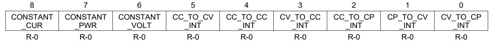

LEGEND: R/W = Read/Write; R = Read only; -*n* = value after reset

# **Table 5-18. onstant Power Status Register (CPSTAT) Register Field Descriptions**

| Bit | Field             | Type | Reset | Description                                                                                                                                                                                                                 |  |  |  |  |  |
|-----|-------------------|------|-------|-----------------------------------------------------------------------------------------------------------------------------------------------------------------------------------------------------------------------------|--|--|--|--|--|
| 8   | CONSTANT_CUR      | R    | 0     | Constant Current Mode Indication<br>0 = Constant Current Mode not enabled<br>1 = Constant Current Mode enabled                                                                                                              |  |  |  |  |  |
| 7   | CONSTANT_PWR      | R    | 0     | Constant Power Mode Indication<br>0 = Constant Power Mode not enabled<br>1 = Constant Power Mode enabled                                                                                                                    |  |  |  |  |  |
| 6   | CONSTANT<br>_VOLT | R    | 0     | Constant Voltage Mode Indication<br>0 = Constant Voltage Mode not enabled<br>1 = Constant Voltage Mode enabled                                                                                                              |  |  |  |  |  |
| 5   | CC_TO_CV_INT      | R    | 0     | Constant Current Mode to Constant Voltage Mode latched status, cleared on read<br>0 = No transition from Constant Current to Constant Voltage detected<br>1 = Transition from Constant Current to Constant Voltage detected |  |  |  |  |  |
| 4   | CC_TO_CC_INT      | R    | 0     | Constant Voltage Mode to Constant Current Mode latched status, cleared on read<br>0 = No transition from Constant Voltage to Constant Current detected<br>1 = Transition from Constant Voltage to Constant Current detected |  |  |  |  |  |
| 3   | CV_TO_CC_INT      | R    | 0     | Constant Current Mode to Constant Power Mode latched status, cleared on read<br>0 = No transition from Constant Current to Constant Power detected<br>1 = Transition from Constant Current to Constant Power detected       |  |  |  |  |  |
| 2   | CC_TO_CP_INT      | R    | 0     | Constant Power Mode to Constant Current Mode latched status, cleared on read<br>0 = No transition from Constant Power to Constant Current detected<br>1 = Transition from Constant Power to Constant Current detected       |  |  |  |  |  |
| 1   | CP_TO_CV_INT      | R    | 0     | Constant Power Mode to Constant Voltage Mode latched status, cleared on read<br>0 = No transition from Constant Power to Constant Voltage detected<br>1 = Transition from Constant Power to Constant Voltage detected       |  |  |  |  |  |
| 0   | CV_TO_CP_INT      | R    | 0     | Constant Voltage Mode to Constant Power Mode latched status, cleared on read<br>0 = No transition from Constant Voltage to Constant Power detected<br>1 = Transition from Constant Voltage to Constant Power detected       |  |  |  |  |  |


# <span id="page-213-1"></span>*5.14.18 Cycle Adjustment Control Register (CYCADJCTRL)*

Address 00020044

#### **Figure 5-19. Cycle Adjustment Control Register (CYCADJCTRL)**

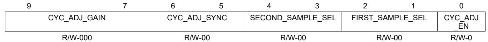

LEGEND: R/W = Read/Write; R = Read only; -*n* = value after reset

# **Table 5-19. Cycle Adjustment Control Register (CYCADJCTRL) Register Field Descriptions**

<span id="page-213-0"></span>

| Bit | Field                 | Type | Reset | Description                                                                                                                                                                                                                                                                                                         |  |  |  |
|-----|-----------------------|------|-------|---------------------------------------------------------------------------------------------------------------------------------------------------------------------------------------------------------------------------------------------------------------------------------------------------------------------|--|--|--|
| 9-7 | CYC_ADJ_GAIN          | R/W  | 000   | Configures gain of Cycle Adjustment calculation<br>0 = 1x gain (Default)<br>1 = 2x gain<br>2 = 4x gain<br>3 = 8x gain<br>4 = 16x gain<br>5 = 32x gain<br>6 = 64x gain<br>7 = 128x gain                                                                                                                              |  |  |  |
| 6-5 | CYC_ADJ_SYNC          | R/W  | 00    | Selects which DPWM A trigger synchronizes cycle adjustment calculation, first 2<br>samples after receipt of DPWM A trigger will be used for Cycle Adjustment<br>Calculation.<br>0 = DPWM-1A trigger selected (Default)<br>1 = DPWM-2A trigger selected 2 = DPWM-3A trigger selected 3 = DPWM-4A trigger<br>selected |  |  |  |
| 4-3 | SECOND<br>_SAMPLE_SEL | R/W  | 00    | Configures Front End Module Data used for Second Sample of Cycle Adjustment<br>Calculation<br>0 = Front End Module 0 Error Data selected (Default)<br>1 = Front End Module 1 Error Data selected<br>2 = Front End Module 2 Error Data selected                                                                      |  |  |  |
| 2-1 | FIRST_SAMPLE<br>_SEL  | R/W  | 00    | Configures Front End Module Data used for First Sample of Cycle Adjustment<br>Calculation<br>0 = Front End Module 0 Error Data selected (Default)<br>1 = Front End Module 1 Error Data selected<br>2 = Front End Module 2 Error Data selected                                                                       |  |  |  |
| 0   | CYC_ADJ_EN            | R/W  | 0     | Cycle Adjustment Calculation Enable<br>0 = Cycle Adjustment Calculation disabled (Default)<br>1 = Cycle Adjustment Calculation enabled                                                                                                                                                                              |  |  |  |


# <span id="page-214-0"></span>*5.14.19 Cycle Adjustment Limit Register (CYCADJLIM)*

Address 00020048

### **Figure 5-20. Cycle Adjustment Limit Register (CYCADJLIM)**

<span id="page-214-1"></span>

| 28 |                      | 16 | 15 |          | 13 | 12 |                      | 0 |
|----|----------------------|----|----|----------|----|----|----------------------|---|
|    | CYC_ADJ_UPPER_LIMIT  |    |    | Reserved |    |    | CYC_ADJ_LOWER_LIM    |   |
|    | R/W-0 0000 0000 0000 |    |    | R-000    |    |    | R/W-0 0000 0000 0000 |   |

LEGEND: R/W = Read/Write; R = Read only; -*n* = value after reset

### **Table 5-20. Cycle Adjustment Limit Register (CYCADJLIM) Register Field Descriptions**

<span id="page-214-2"></span>

| Bit   | Field                   | Type | Reset                  | Description                                                                                                                                                                                                                                     |
|-------|-------------------------|------|------------------------|-------------------------------------------------------------------------------------------------------------------------------------------------------------------------------------------------------------------------------------------------|
| 28-16 | CYC_ADJ<br>_UPPER_LIMIT | R/W  | 0 0000<br>0000<br>0000 | Cycle Adjustment Calculation signed upper limit value, output of Cycle Adjustment<br>Calculation is clamped at the upper limit, if calculated result exceeds the upper limit.<br>LSB resolution equals High Frequency Oscillator period/16.     |
| 15-13 | Reserved                | R    | 000                    |                                                                                                                                                                                                                                                 |
| 12-0  | CYC_ADJ<br>_LOWER_LIM   | R/W  | 0 0000<br>0000<br>0000 | Cycle Adjustment Calculation signed lower limit value, output of Cycle Adjustment<br>Calculation is clamped at the lower limit, if calculated result falls below the lower<br>limit. LSB resolution equals High Frequency Oscillator period/16. |


### <span id="page-215-0"></span>*5.14.20 Cycle Adjustment Status Register (CYCADJSTAT)*

Address 0002004C

### **Figure 5-21. Cycle Adjustment Status Register (CYCADJSTAT)**

<span id="page-215-1"></span>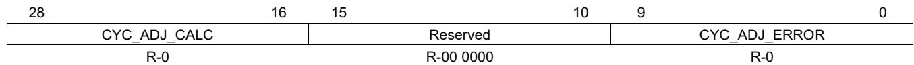

LEGEND: R/W = Read/Write; R = Read only; -*n* = value after reset

### **Table 5-21. Cycle Adjustment Status Register (CYCADJSTAT) Register Field Descriptions**

| Bit   | Field             | Type | Reset   | Description                                                                                                            |
|-------|-------------------|------|---------|------------------------------------------------------------------------------------------------------------------------|
| 28-16 | CYC_ADJ_CALC      | R    | 0       | 13-bit signed value representing calculated Cycle Adjustment provided to DPWM<br>module based on first 2 error samples |
| 15-10 | Reserved          | R    | 00 0000 |                                                                                                                        |
| 9-0   | CYC_ADJ<br>_ERROR | R    | 0       | 10-bit signed value representing calculated error of the first 2 error samples received                                |


# <span id="page-216-0"></span>*5.14.21 Global Enable Register (GLBEN)*

Address 00020050

#### **Figure 5-22. Global Enable Register (GLBEN)**

<span id="page-216-1"></span>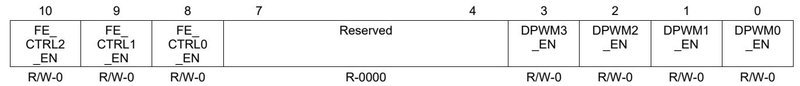

LEGEND: R/W = Read/Write; R = Read only; -*n* = value after reset

### **Table 5-22. Global Enable Register (GLBEN)Register Field Descriptions**

| Bit | Field       | Type | Reset | Description                                                                                                                                          |
|-----|-------------|------|-------|------------------------------------------------------------------------------------------------------------------------------------------------------|
| 10  | FE_CTRL2_EN | R/W  | 0     | Global Firmware Enable for Front End Control 2 Module<br>0 = Front End Control 2 Module Disabled (Default)<br>1 = Front End Control 2 Module Enabled |
| 9   | FE_CTRL1_EN | R/W  | 0     | Global Firmware Enable for Front End Control 1 Module<br>0 = Front End Control 1 Module Disabled (Default)<br>1 = Front End Control 1 Module Enabled |
| 8   | FE_CTRL0_EN | R/W  | 0     | Global Firmware Enable for Front End Control 0 Module<br>0 = Front End Control 0 Module Disabled (Default)<br>1 = Front End Control 0 Module Enabled |
| 7-4 | Reserved    | R    | 0000  |                                                                                                                                                      |
| 3   | DPWM3_EN    | R/W  | 0     | Global Firmware Enable for DPWM 3 Module<br>0 = DPWM 3 Module Disabled (Default)<br>1 = DPWM 3 Module Enabled                                        |
| 2   | DPWM2_EN    | R/W  | 0     | Global Firmware Enable for DPWM 2 Module<br>0 = DPWM 2 Module Disabled (Default)<br>1 = DPWM 2 Module Enabled                                        |
| 1   | DPWM1_EN    | R/W  | 0     | Global Firmware Enable for DPWM 1 Module<br>0 = DPWM 1 Module Disabled (Default)<br>1 = DPWM 1 Module Enabled                                        |
| 0   | DPWM0_EN    | R/W  | 0     | Global Firmware Enable for DPWM 0 Module<br>0 = DPWM 0 Module Disabled (Default)<br>1 = DPWM 0 Module Enabled                                        |


# <span id="page-217-0"></span>*5.14.22 PWM Global Period Register (PWMGLBPRD)*

Address 00020054

### **Figure 5-23. PWM Global Period Register (PWMGLBPRD)**

<span id="page-217-1"></span>17 4 3 0 PRD Reserved

R/W-00 0000 0000 0000 R-0000

LEGEND: R/W = Read/Write; R = Read only; -*n* = value after reset

#### **Table 5-23. PWM Global Period Register (PWMGLBPRD) Register Field Descriptions**

<span id="page-217-2"></span>

| Bit  | Field    | Type | Reset                   | Description                                                                                                            |
|------|----------|------|-------------------------|------------------------------------------------------------------------------------------------------------------------|
| 17-4 | PRD      | R/W  | 00 0000<br>0000<br>0000 | Global PWM Period value, overriding DPWM Period settings when global PWM<br>period is selected within each DPWM module |
| 3-0  | Reserved | R    | 0000                    |                                                                                                                        |


# <span id="page-218-0"></span>*5.14.23 Sync Control Register (SYNCCTRL)*

Address 00020058

#### **Figure 5-24. Sync Control Register (SYNCCTRL)**

<span id="page-218-1"></span>

LEGEND: R/W = Read/Write; R = Read only; -*n* = value after reset

### **Table 5-24. Sync Control Register (SYNCCTRL) Register Field Descriptions**

<span id="page-218-2"></span>

| Bit | Field        | Type | Reset | Description                                                                                                                                                                                                                                                                                                                                         |
|-----|--------------|------|-------|-----------------------------------------------------------------------------------------------------------------------------------------------------------------------------------------------------------------------------------------------------------------------------------------------------------------------------------------------------|
| 5   | SYNC_IN      | R    | 0     | Value of Sync pin<br>0 = Logic level low present on Sync pin<br>1 = Logic level high present on Sync pin                                                                                                                                                                                                                                            |
| 4-2 | SYNC_MUX_SEL | R/W  | 000   | Selects which module controls Sync pin output<br>000 = DPWM 0 Sync Output (Default)<br>001 = DPWM 1 Sync Output<br>010 = DPWM 2 Sync Output<br>011 = DPWM 3 Sync Output<br>100 = Value from SYNC_OUT (Bit 1)<br>101 = Value from CLKOUT signal in TSAR Module (See Section 15.1)<br>110 = Low-Frequency Oscillator Clock Output<br>111 = Driven low |
| 1   | SYNC_OUT     | R/W  | 1     | Configure output value for Sync pin, if used as an output<br>0 = Sync pin driven low in output mode<br>1 = Sync pin driven high in output mode (Default)                                                                                                                                                                                            |
| 0   | SYNC_DIR     | R/W  | 1     | Configure direction of Sync pin<br>0 = Sync pin configured as an output pin<br>1 = Sync pin configured as an input pin (Default)                                                                                                                                                                                                                    |


# *5.14.24 Light Load Control Register (LLCTRL)*

Address 0002005C

### **Figure 5-25. Light Load Control Register (LLCTRL)**

<span id="page-219-0"></span>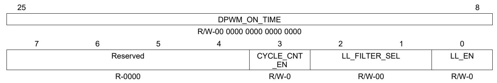

LEGEND: R/W = Read/Write; R = Read only; -*n* = value after reset

### **Table 5-25. Light Load Control Register (LLCTRL) Register Field Descriptions**

<span id="page-219-1"></span>

| Bit  | Field         | Type | Reset                           | Description                                                                                                                                                                                            |
|------|---------------|------|---------------------------------|--------------------------------------------------------------------------------------------------------------------------------------------------------------------------------------------------------|
| 25-8 | DPWM_ON_TIME  | R/W  | 00 0000<br>0000<br>0000<br>0000 | DPWM pulse width used for EADC-based light load mode operation, when selected<br>Filter data exceeds TURN_ON_THRESH value                                                                              |
| 7-4  | Reserved      | R    | 0000                            |                                                                                                                                                                                                        |
| 3    | CYCLE_CNT_EN  | R/W  | 0                               | Enables Switching Cycle Counter for enabling constant pulse widths when<br>configured in Light Load operation<br>0 = Switching Cycle Counter disabled (Default)<br>1 = Switching Cycle Counter enabled |
| 2-1  | LL_FILTER_SEL | R/W  | 00                              | Configures source of filter data for Light Load comparisons<br>0 = Filter 0 data selected (Default)<br>1 = Filter 1 data selected 2 = Filter 2 data selected                                           |
| 0    | LL_EN         | R/W  | 0                               | EADC-based Light Load Mode Enable<br>0 = Light Load Mode disabled (Default)<br>1 = Light Load Mode enabled                                                                                             |


# <span id="page-220-1"></span>*5.14.25 Light Load Enable Threshold Register (LLENTHRESH)*

Address 00020060

### **Figure 5-26. Light Load Enable Threshold Register (LLENTHRESH)**

<span id="page-220-2"></span>

| 31            |                  | 24 | 23        |          | 18 | 17                         | 0              |
|---------------|------------------|----|-----------|----------|----|----------------------------|----------------|
|               | CYCLE_CNT_THRESH |    |           | Reserved |    |                            | TURN_ON_THRESH |
| R/W-0000 0000 |                  |    | R-0000 00 |          |    | R/W-00 0000 0000 0000 0000 |                |

LEGEND: R/W = Read/Write; R = Read only; -*n* = value after reset

### **Table 5-26. Light Load Enable Threshold Register (LLENTHRESH) Register Field Descriptions**

<span id="page-220-0"></span>

| Bit   | Field                | Type | Reset                       | Description                                                                                                                                |
|-------|----------------------|------|-----------------------------|--------------------------------------------------------------------------------------------------------------------------------------------|
| 31-24 | CYCLE_CNT<br>_THRESH | R/W  | 0000<br>0000                | Switching Cycle threshold where constant width DPWM pulses are enabled when<br>number of switching cycles without pulses exceeds threshold |
| 23-18 | Reserved             | R    | 0000 00                     |                                                                                                                                            |
| 17-0  | TURN_ON<br>_THRESH   | R/W  | 00 0000<br>0000 000<br>0000 | Filter data threshold where constant width DPWM pulses are enabled when filter<br>data exceeds threshold                                   |


# <span id="page-221-0"></span>*5.14.26 Light Load Disable Threshold Register (LLDISTHRESH)*

Address 00020064

# **Figure 5-27. Light Load Disable Threshold Register (LLDISTHRESH)**

<span id="page-221-1"></span>17 0

TURN\_OFF\_THRESH

R/W-00 0000 0000 0000 0000

LEGEND: R/W = Read/Write; R = Read only; -*n* = value after reset

### **Table 5-27. Light Load Disable Threshold Register (LLDISTHRESH) Register Field Descriptions**

<span id="page-221-2"></span>

| Bit  | Field               | Type | Reset                           | Description                                                                                                   |
|------|---------------------|------|---------------------------------|---------------------------------------------------------------------------------------------------------------|
| 17-0 | TURN_OFF<br>_THRESH | R/W  | 00 0000<br>0000<br>0000<br>0000 | Filter data threshold where constant width DPWM pulses are disabled when filter<br>data falls below threshold |


# <span id="page-222-0"></span>*5.14.27 Peak Current Mode Control Register (PCMCTRL)*

Address 00020068

### **Figure 5-28. Peak Current Mode Control Register (PCMCTRL)**

<span id="page-222-1"></span>

LEGEND: R/W = Read/Write; R = Read only; -*n* = value after reset

### **Table 5-28. Peak Current Mode Control Register (PCMCTRL) Register Field Descriptions**

<span id="page-222-2"></span>

| Bit | Field              | Type | Reset | Description                                                                                                                                                                                                           |
|-----|--------------------|------|-------|-----------------------------------------------------------------------------------------------------------------------------------------------------------------------------------------------------------------------|
| 5-4 | PCM_FILTER<br>_SEL | R/W  | 00    | Selects source of Peak Current Slope Compensation Ramp Start<br>0 = Filter 0 data selected (Default)<br>1 = Filter 1 data selected<br>2 = Filter 2 data selected<br>3 = Constant Power/Constant Current data selected |
| 3-0 | Reserved           | R    | 0000  |                                                                                                                                                                                                                       |


# <span id="page-223-0"></span>*5.14.28 Analog Peak Current Mode Control Register (APCMCTRL)*

Address 00020070

# **Figure 5-29. Analog Peak Current Mode Control Register (APCMCTRL)**

<span id="page-223-1"></span>

| 3            | 2          | 1 | 0      |
|--------------|------------|---|--------|
| PCM_LATCH_EN | PCM_FE_SEL |   | PCM_EN |
| R/W-0        | R/W-00     |   | R/W-0  |

LEGEND: R/W = Read/Write; R = Read only; -*n* = value after reset

### **Table 5-29. Analog Peak Current Mode Control Register (APCMCTRL)Register Field Descriptions**

<span id="page-223-2"></span>

| Bit | Field        | Type | Reset | Description                                                                                                                                                                                                                                                       |
|-----|--------------|------|-------|-------------------------------------------------------------------------------------------------------------------------------------------------------------------------------------------------------------------------------------------------------------------|
| 3   | PCM_LATCH_EN | R/W  | 0     | Enables latching of Peak Current Flag to end of frame<br>0 = PCM Flag is not latched to end of PCM Frame (Default)<br>1 = PCM Flag is latched to end of PCM Frame                                                                                                 |
| 2-1 | PCM_FE_SEL   | R/W  | 00    | Selects source of Front End Comparator output for Analog Peak Current Mode<br>Control<br>0 = Front End Control 0 Comparator output selected (Default)<br>1 = Front End Control 1 Comparator output selected<br>2 = Front End Control 2 Comparator output selected |
| 0   | PCM_EN       | R/W  | 0     | Analog Peak Current Mode Control Module Enable<br>0 = Analog Peak Current Mode Control Module disabled (Default)<br>1 = Analog Peak Current Mode Control Module enabled                                                                                           |


# <span id="page-224-0"></span>*5.14.29 Loop Mux Test Register (LOOPMUXTEST) (Test Use Only)*

Address 00020074

### **Figure 5-30. Loop Mux Test Register (LOOPMUXTEST) (Test Use Only)**

<span id="page-224-1"></span>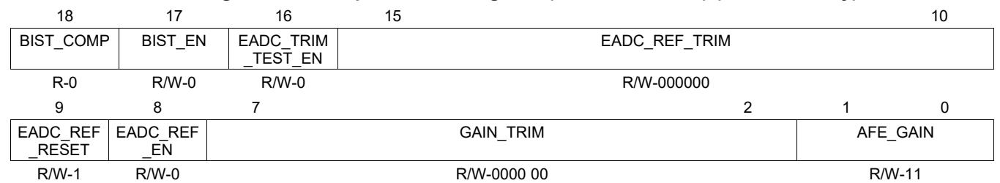

LEGEND: R/W = Read/Write; R = Read only; -*n* = value after reset

# **Table 5-30. Loop Mux Test Register (LOOPMUXTEST) (Test Use Only) Register Field Descriptions**

<span id="page-224-2"></span>

| Bit   | Field                 | Type | Reset   | Description                                                                                                                                                          |
|-------|-----------------------|------|---------|----------------------------------------------------------------------------------------------------------------------------------------------------------------------|
| 18    | BIST_COMP             | R    | 0       | High-Speed Loop BIST Complete Status<br>0 = High-Speed Loop BIST not complete<br>1 = High-Speed Loop BIST completed                                                  |
| 17    | BIST_EN               | R/W  | 0       | High-Speed Loop BIST Enable<br>0 = High-Speed Loop BIST disabled (Default)<br>1 = High-Speed Loop BIST enabled                                                       |
| 16    | EADC_TRIM<br>_TEST_EN | R/W  | 0       | EADC Trim Test Mode Enable<br>0 = EADC Trim Test Mode disabled (Default)<br>1 = EADC Trim Test Mode enabled, bits 15:0 provided to all 3 Analog Front End<br>modules |
| 15-10 | EADC_REF_TRIM         | R/W  | 000000  | EADC Reference Trim Value. Bits will be programmed during test and should not be<br>overwritten by firmware.                                                         |
| 9     | EADC_REF<br>_RESET    | R/W  | 1       | EADC Reference Reset<br>0 = Reference not in reset<br>1 = Resets Reference (Default)                                                                                 |
| 8     | EADC_REF_EN           | R/W  | 0       | EADC Reference Enable<br>0 = Disables EADC Reference (Default)<br>1 = Enables EADC Reference                                                                         |
| 7-2   | GAIN_TRIM             | R/W  | 0000 00 | Sets trim for EADC Gain.                                                                                                                                             |
| 1-0   | AFE_GAIN              | R/W  | 11      | AFE Front End Gain Setting<br>0 = 1x Gain, 8mV/LSB<br>1 = 2x Gain, 4mV/LSB<br>2 = 4x Gain, 2mV/LSB<br>3 = 8x Gain, 1mV/LSB (Default)                                 |

<span id="page-225-0"></span>

# *Fault Mux*

The Fault Mux registers control a multiplexer which connects power supply fault signals to DPWMs. They also perform several other functions

- Configuration of analog and digital comparators and fault pins for fault detection
- Monitoring of fault status
- Digital Ideal Diode Emulation circuit for synchronous rectification FETs
- Processor clock failure detection
- Support for analog peak current mode control

The Fault Mux is responsible for fault detection and connection, while the DPWM is responsible for the action taken to handle the fault. Even though most of the control for fault response action is based in the DPWM registers, it is discussed in this section (in this way all information relating to the Fault information is available in one location).

Here is an overview of the fault handling system in the UCD3138:

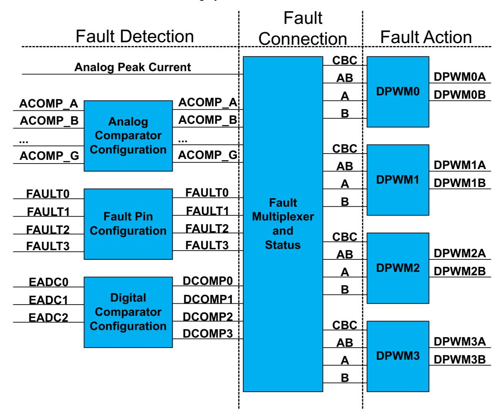

<span id="page-225-1"></span>**Figure 6-1. UCD3138 Fault Handling System**


The system is very flexible and powerful. There are 7 analog comparators, 4 fault pins, and 4 digital comparators. Each DPWM has 4 fault inputs which affect its outputs in different ways. Any combination of fault detection outputs can be connected to drive any combination of DPWM fault inputs.

### Here are three examples:

- 1. Many fault outputs mapped to a single fault input An analog comparator in charge of over voltage protection, a digital comparator in charge of over current protection and an external digital fault pin can be all mapped to a fault-A signal connected to a single DPWM fault input and shut down DPWM1-A.
- 2. Single fault output mapped to many fault inputs inside many DPWM modules An analog comparator in charge of over current protection can be mapped to all DPWM-0 through DPWM-3 through several fault modules.
- 3. Many fault sources mapped to a many fault modules inside many DPWM modules. A flexible combination of both above mentioned alternatives.

**Topic** ........................................................................................................................... **Page**

| 6.1  | Analog Comparator Configuration  | 228 |
|------|----------------------------------|-----|
| 6.2  | Analog Comparator Ramp           | 229 |
| 6.3  | Digital Comparator Configuration | 229 |
| 6.4  | Fault Pin Configuration          | 230 |
| 6.5  | Analog Peak Current              | 230 |
| 6.6  | Fault Status Registers           | 230 |
| 6.7  | Fault Mux Control Registers      | 230 |
| 6.8  | DPWM Fault Action                | 231 |
| 6.9  | IDE / DCM Detection Control      | 232 |
| 6.10 | Oscillator Failure Detection     | 234 |
| 6.11 | Fault Mux Registers Reference    | 234 |
|      |                                  |     |


# <span id="page-227-0"></span>**6.1 Analog Comparator Configuration**

The analog comparators are controlled by the ACOMPCTRL0 to ACOMPCTRL3 registers. [Figure](#page-227-7) 6-2 shows how the control works:

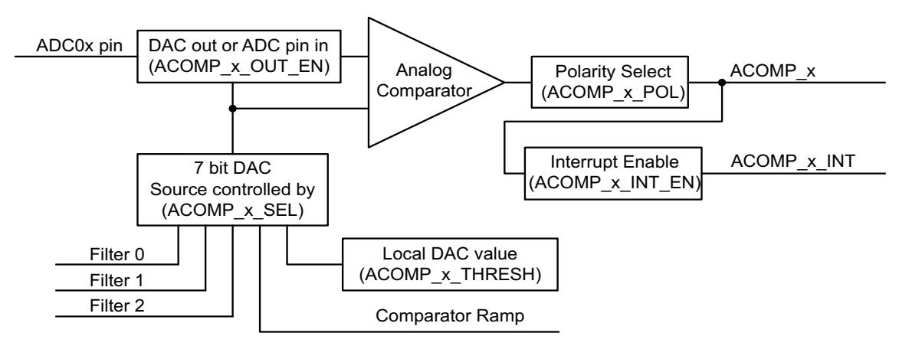

**Figure 6-2. UCD3138 Analog Comparator Control**

<span id="page-227-7"></span>All the names in parentheses on the drawing above are bitfield names in the ACOMPCTRL registers. The Analog Comparators are sampled at the HFO rate (nominal 250 MHz). Any fault on the Analog Comparators will be transmitted to the Fault Mux regardless of the DPWM timing.

# <span id="page-227-1"></span>*6.1.1 ACOMP\_EN*

The first step in starting the analog comparators is to set the ACOMP\_EN bit in ACOMPCTRL0.

FaultMuxRegs.ACOMPCTRL0.bit.ACOMP\_EN = 1;

This bit enables all the analog comparators.

# <span id="page-227-2"></span>*6.1.2 ACOMP\_x\_THRESH*

For typical operation - detecting an overcurrent or over voltage fault - only the ACOMP\_x\_THRESH register needs to be written. It is written with a value that corresponds to the fault level on the input pin.

FaultMuxRegs.ACOMPCTRL1.bit.ACOMP\_C\_THRESH = OVER\_VOLTAGE\_THRESH;

All the other registers are set to defaults which work for this application.

### <span id="page-227-3"></span>*6.1.3 ACOMP\_x\_POL*

To detect a fault caused by a voltage going below a threshold, rather than above, clear the ACOMP\_x\_POL bit. A zero in this bit causes the ACOMP\_x signal to go active when the ADC pin goes below the comparator threshold.

# <span id="page-227-4"></span>*6.1.4 ACOMP\_x\_INT\_EN*

The ACOMP\_x\_INT\_EN bit, when set enables an interrupt from the Analog Comparator.

### <span id="page-227-5"></span>*6.1.5 ACOMP\_x\_OUT\_EN*

The ACOMP\_x\_OUT\_EN bit when set, puts the DAC value out on the ADC pin, which can be used as an external reference. Consult the UCD3138 device datasheet for additional information. When this bit is enabled, obviously the comparator output signals are not valid.

# <span id="page-227-6"></span>*6.1.6 ACOMP\_x\_SEL*

The comparator DAC can also be driven by other data – Filter outputs and a comparator ramp engine. The ACOMP\_x\_SEL register selects which of these sources is used.


# <span id="page-228-0"></span>*6.1.7 ACOMP\_F\_REF\_SEL*

Analog Comparator F is a special case. It can be configured to use AD07 as a reference instead of the DAC. To enable this, set the ACOMP\_F\_REF\_SEL bit in ACOMPCTRL2.

# *6.1.8 ACOMPCTRL Register Arrangement*

There are 7 Analog Comparators, but only 4 ACOMPCTRL registers. The comparators are organized 2 to a register.

# <span id="page-228-1"></span>**6.2 Analog Comparator Ramp**

The analog comparator ramp logic is a digital circuit which can provide a ramping value to the comparator reference DACs. It is a simpler, lower resolution version of the ramp engines in the Front Ends (for information regarding the Front End ramp engines, refer to [Section](#page-118-0) 3.3). The key differentiating features of the Analog Comparator Ramp are as follows:

- Only 7 bits of resolution
- Ramp steps are triggered by MCLK (Nominal 31.25 MHz.)
- Ramp start is triggered by DPWMx frame start as selected by DPWMx\_TRIG\_EN bits.
- Ramp always falls, ramp end value is always 0x00 (DAC minimum)

# <span id="page-228-2"></span>**6.3 Digital Comparator Configuration**

The Digital Comparator is another fault detection mechanism. Instead of a direct analog input, it uses the result of the Front End EADC measurement to detect faults.

There are 4 Digital Comparators, controlled by the DCOMPCTRL0, 1, 2, and 3 registers.

They use the FE\_SEL bitfield to select which Front End is used as a source, and whether the absolute or error data from that Front End is used.

Like the Analog Comparators, they can be programmed to detect a fault either above or below the threshold. The COMP\_POL bit is used to select this.

There is also an INT\_EN bit to enable the interrupt. Each Digital Comparator has its own COMP\_EN bit to enable it.

The reference threshold for the comparator is much simpler, it only comes from the THRESH bit-field. It does have 11 bits of resolution, more than the Analog comparator.

The Digital Comparator adds a counter that can require several sequential fault detections before the signal is passed on to the Fault Mux.

The CNT\_THRESH bitfield controls the number of fault detections required. Writing a 1 to the CNT\_CLR bit will clear the counter and the associated fault.

If the counter reaches the CNT\_THRESH value, it will be locked, and the DCOMP\_x signal will be sent to the Fault Mux.

The Digital Comparator performs its comparison on each sample from the selected Front End. Fault detection can only occur after each sample from the Front End.

The CNT\_CONFIG bit controls handling of sequences of samples which contain some fault samples and some non-fault samples. In the default mode – CNT\_CONFIG = 0 – a non-fault sample will clear the counter (assuming it hasn't reached CNT\_THRESH).

If CNT\_CONFIG = 1, a non-fault event will decrement the counter, unless the counter is already zero. With this setting, if the fault occurs more than 50% of the time, eventually the counter will reach the threshold.

There is also a DCOMPCNTSTAT register which gives the value in each of the counters. This register is read only.


*Fault Pin Configuration* [www.ti.com](http://www.ti.com)

### <span id="page-229-0"></span>**6.4 Fault Pin Configuration**

There are 4 fault pins, Fault 0 to Fault 3. Their configuration is very simple.

- FAULTx\_POL sets polarity
- FAULTx\_INT\_EN enables the interrupt
- FAULTx\_DET\_EN enables fault detection.

All these bits are in the EXTFAULTCTRL register. Like the Analog Comparators, the fault pins are sampled at the MCLK rate.

# <span id="page-229-1"></span>**6.5 Analog Peak Current**

Analog Peak Current is another input to the Fault Mux. It is not technically a fault, since it is controls the normal operation of a power supply based on peak current mode control. The Analog Peak Current signal comes from a Front End, and can only be routed to the CBC (Cycle by Cycle) input of the DPWM. For additional information consult the reference firmware provided with UCD3138PSFBEVM-029 EVM and TI application note on Phase Shift Full Bridge (Peak Current mode control) implementation.

# <span id="page-229-2"></span>**6.6 Fault Status Registers**

There are two registers which give the fault detection status: FAULTMUXINTSTAT and FAULTMUXRAWSTAT.

Both have the same bits, but they mean different things.

FAULTMUXRAWSTAT shows the instantaneous status of each fault.

FAULTMUXINTSTAT shows any faults which:

- Have occured since the last read of FAULTMUXINTSTAT
- Have interrupts enabled

This is especially useful for detecting faults which may occur only for short times during a period. Reading from this register clears the fault from the fault detection interrupt logic. This interrupt logic is independent of the signals routed to the Fault Mux and to the DPWM. These signals are latched only in the DPWM logic, not anywhere else.

瞬时的

The registers also have bits for LFO\_FAIL (Low Frequency Oscillator Fail) and for DCM\_DETECT (Discontinuous Mode Detected). These sources are described elsewhere. Neither of these signals is used as an input to the Fault Mux.

### <span id="page-229-3"></span>**6.7 Fault Mux Control Registers**

There are 4 DPWM modules, 0-3. Each DPWM module has 4 fault inputs, CLIM, AB, A, and B.

There are 3 fault Mux registers for each DPWM:

- DPWMxCLIM controls CLIM, also known as CBC
- DPWMxFLTABDET controls the AB fault input
- DPWMxFAULTDET controls the A and B fault inputs.

Programming these registers is very simple. There is a bit for each fault detection source in each register. Setting it connects that fault detection source to the fault input and DPWM for that register. Here is an example:

```
FaultMuxRegs.DPWM0FLTABDET.bit.ACOMP_B_EN = 1;
// Connect analog comp B to DPWM0 fault input AB
```

### Controlling the A and B fault inputs in the same register works like this:

```
FaultMuxRegs.DPWM0FAULTDET.bit.PWMA_ACOMP_B_EN = 1;
//Connect analog comparator B to DPWM0 fault A
FaultMuxRegs.DPWM0FAULTDET.bit.PWMB_ACOMP_B_EN = 1;
//Connect analog comparator B to DPWM0 fault B
```


[www.ti.com](http://www.ti.com) *DPWM Fault Action*

Almost any fault detection circuit can be connected to any fault input on any DPWM. The only exception is the Analog Peak Current mode, which can only be connected to the CLIM fault input:

FaultMuxRegs.DPWM0CLIM.bit.ANALOG\_PCM\_EN = 1;

# <span id="page-230-0"></span>**6.8 DPWM Fault Action**

The final section in the fault chain is the fault action, which takes place in the DPWM module. Here is a drawing showing the main points of fault action:

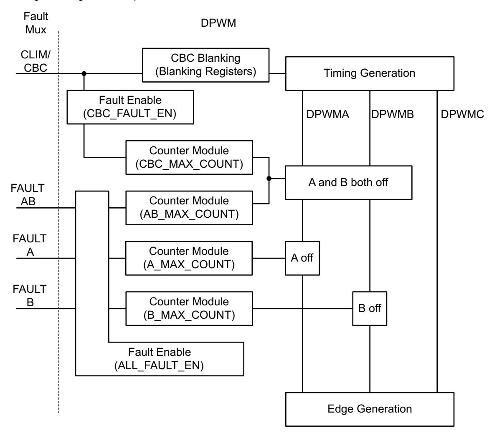

**Figure 6-3. UCD3138 DPWM Fault Action**

<span id="page-230-1"></span>This drawing fits in with the overview of the DPWM in [Figure](#page-34-1) 2-1. The portion expanded here is the fault handler portion. The connection of the CLIM/CBC signal to the Timing Generation Module is also shown.

For information on the effect of CLIM/CBC in the timing module, see [Section](#page-53-0) 2.15.3. The bits described in that section affect the CLIM/CBC signal which is sent to the Timing Generator. [Chapter](#page-32-0) 2 also describes the Blanking Registers in the DPWM, which permit blanking of the CLIM/CBC signal to the Timing Generation section. These registers are used to prevent switching noise from causing false triggers of the CBC logic. They can also be used to synchronize CBC triggers between DPWMs with different on-times. The blanking registers affect different edges depending on topology. The effects are as follows:

- For normal and resonant modes, blanking A and B windows are applied to PWM-A only
- For triangular mode, blanking A and B windows are applied to PWM-B only
- For all other modes, blanking A and B windows are applied to PWM-A and PWM-B respectively


CLIM/CBC is also used by the Fault Handler, which is described below. The two mechanisms are completely independent of each other, except they have the same input signal. The Blanking Registers do not affect the CLIM/CBC signal which goes to the Fault Handler.

This section will describe the logic in the fault handling portion of the DPWM.

All 4 signals, CLIM/CBC, AB,A, and B can be used as fault signals, and all are used in exactly the same way, except they shut off different DPWM signals.

As shown, there are 2 enable bits, CBC\_FAULT\_EN for CLIM/CBC, and ALL\_FAULT\_EN for the other 3. Each fault has its own 5 bit counter, with a maximum value set by a dedicated x\_MAX\_COUNT bit-field. The fault lines are monitored continuously, but only one event per DPWM period is counted. If the x\_MAX\_COUNT value is set to 0, the first fault event will shut off the appropriate DPWM pins. The maximum number of sequential fault periods is 31, if the x\_MAX\_COUNT field is loaded with a 0x1f.

The faults must occur sequentially. If any period completes without a fault, the counter will be reset.

The faults handler is much simpler than the CLIM/CBC in the timing generator. They simply latch off either 1 or 2 of the DPWM pins. To restart the DPWM, it is necessary to disable it using either the global enable register:

```
void global_enable(void)
{
    //Enable DPWM0, DPWM1, DPWM2, DPWM3, FE_CTRL0 AND FE_CTRL1 simultaneously.
    LoopMuxRegs.GLBEN.all = 0x30F;
}
void global_disable(void)
{
    //Disable DPWM0, DPMW1, DPWM2 and DPWM3 simultaneously.
    LoopMuxRegs.GLBEN.all = 0x300;
}
Or the local DPWM enable register:
    Dpwm0Regs.DPWMCTRL0.bit.PWM_EN = 0;
```

The DPWMINT register can be used to configure Fault interrupts, as well as other interrupts. It can also be used to read the status of those interrupts. The interrupt bits are cleared by a read. The DPWMFLTSTAT register shows the status of the faults. These bits are also clear on read bits. See the reference section for bit mapping of these registers.

If the fault is enabled by the ALL\_FAULT\_EN bit, and it occurs, the FLT\_A, FLT\_B, FLT\_AB flags will be set. If the appropriate INT\_EN bit is set, the DPWM will send and interrupt to the Central Interrupt Module (CIM). If the interrupt for that DPWM is enabled in the CIM, then an interrupt will be given to the processor.

# <span id="page-231-0"></span>**6.9 IDE / DCM Detection Control**

Dpwm0Regs.DPWMCTRL0.bit.PWM\_EN = 1;

In addition to the fault detection and connection described above, there are other registers in the Fault Mux Registers that control other functions. One of these functions is IDE/DCM detection. IDE stands for Ideal Diode Emulation. DCM stands for Discontinuous Mode. They are both controlled by the IDECTRL register in the Fault Mux register set.

Some isolated power topologies simple employ rectification diodes on the secondary side. In Ideal Diode emulation, FETs are used instead of diodes. They are turned on when the diode would be conducting and turned off when the diode would be reverse biased. This increases efficiency because the voltage drop across the FET is lower than the drop across the diode. This is called Synchronous Rectification, so the FETs are called Sync FETs for short.

In continuous mode, current is always flowing, and the sync FET can be turned on for the entire time when the primary side is off, except for dead times. This function is served perfectly by the Normal Mode of the DPWM module. Note that IDE/DCM Detection only works in Normal Mode.

In discontinuous mode, however, current is not flowing continuously, so the sync FET must be turned off before the end of the period to emulate the diode. Otherwise energy can flow back from the secondary to the primary.


In discontinuous mode, the on time(duty) for the sync FET (Db) is proportional to the DPWMA on-time (Da). The multiplying factor depends on the topology, the circuit configuration and on Vin and Vout. This multiplying factor needs to be frequently calculated by firmware and placed in the IDE\_KD register.

FaultMuxRegs.IDECTRL.bit.IDE\_KD = kd\_value;

### IDE must also be enabled in the DPWM module:

Dpwm1Regs.DPWMCTRL2.bit.IDE\_DUTY\_B\_EN = 1; //enable ide

Db is calculated by Da (Filter Duty) times IDE\_KD. KD is an unsigned value with 4 integer bits and 9 fractional bits. For example, a 0b0001.000000000 would equate to a multiplier of 1 ("0b" signifies binary, and the "." is used to divide the fractional from the integer part). This would correspond to a hex value of 0x200. For this value of Kd, Db would be exactly the same as Da. There is only one IDE\_KD register, but each Filter can can calculate using the KD. Each Filter's output of the IDE value is controlled by the IDE\_EN bit in a DPWM module. The DPWM module is selected by the LoopMux.FILTERMUX.bit.FILTERx\_PER\_SEL bitfield as shown below:

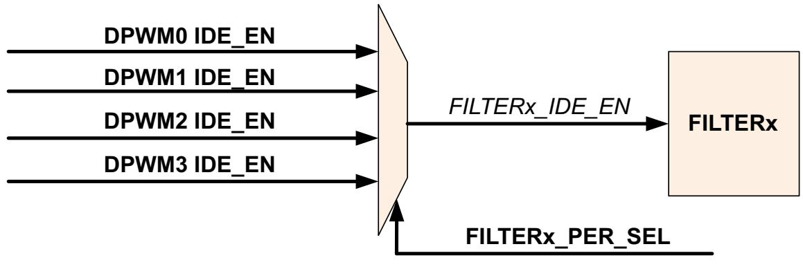

**Figure 6-4.**

<span id="page-232-0"></span>Normally FILTERx\_PER\_SEL will already be pointing at the right Filter, because it is also used to provide the period for the Filter to use in calculating the duty value.

In some cases, however, for example where KCOMP is used instead of period, it is still necessary to set FILTERx\_PER\_SEL so that IDE\_EN can be multiplexed properly.

Note also that IDE\_EN still needs to be set on any DPWM which is using IDE, even though that DPWM may not be providing IDE\_EN to the Filter. If IDE\_EN is not set, the normal dead times will be used to control DPWMB.

The IDECTRL register also contains a means to detect DCM. As mentioned before, in continuous mode, the sync FET is on for the entire time that DPWMA is off. So Db = 1-Da. In discontinuous mode, Db < 1- Da. So the DCM detection logic triggers an interrupt when Db < 1-Da. Hysteresis is provided to prevent the interrupt from triggering repeatedly when steady state is close to the boundary between continuous and discontinuous. This is done with the DCM\_LIMIT\_H and DCIM\_LIMIT\_L registers.

The DCM\_DETECT bit is set when:

$$Db < ((1-Da) - DCIM\_LIMIT\_L$$
 (3)

It is reset when:

$$Db > ((1-Da) + DCIM\_LIMIT\_H$$
 (4)

The DCM\_DETECT bit can be monitored in the FAULTMUXRAWSTAT register. The status of the interrupt can be read in the FAULTMUXINTSTAT register. The interrupt is enabled by DCM\_INT\_EN in the IDECTRL register.


*Oscillator Failure Detection* [www.ti.com](http://www.ti.com)

### <span id="page-233-0"></span>**6.10 Oscillator Failure Detection**

The Fault Mux Module provides the capability to detect failures of the High Frequency and Low Frequency Oscillator blocks. Detection of a High Frequency Oscillator failure can be configured to generate a chip reset. Firmware can configure the Fault Mux Module to generate an interrupt upon detection of a Low Frequency Oscillator Failure.

# <span id="page-233-1"></span>*6.10.1 High Frequency Oscillator Failure Detection*

Two counters are used to detect a failure with the High Frequency Oscillator block. One counter is implemented in the High Frequency Oscillator clock domain, while the other counter is implemented in the Low Frequency Oscillator clock domain. The High Frequency Oscillator counter generates a clear signal once the counter reaches a firmware programmable 17-bit threshold. This clear signal clears the free running Low Frequency Oscillator counter. In the case of a High Frequency Oscillator failure, no clear signal is generated and the Low Frequency Oscillator counter will overflow, generating an oscillator fail flag to the SYS module. Based on the SYS module setup, a chip reset may be generated from the oscillator failure.

There are 2 bitfields in the HFO Failure detection register HFOFAILDET.

HFO\_FAIL\_THRESH – Configures threshold where a clear flag is used to clear a counter in the Low Frequency Oscillator domain (if LFO counter overflows, a reset will be generated), resolution of threshold equals High Frequency Oscillator perio

Bit 0: HFO\_DETECT\_EN – a 1 enables High Frequency Oscillator Failure Detection logic, device will be reset upon detection of an oscillator failure .

here is no interrupt or status bit for HFO failure. This is because if the HFO fails, the processor will not be working.

# <span id="page-233-2"></span>*6.10.2 Low Frequency Oscillator Failure Detection*

The Low Frequency Oscillator is used for the watchdog timer, and to test the functionality of the HFO as described above. As with the High Frequency Oscillator Failure detection, two counters are used to detect a failure with the Low Frequency Oscillator block. The counter roles are reversed in the Low Frequency Oscillator failure detection with the Low Frequency Oscillator clock generating a clear signal once the counter reaches a firmware programmable 5-bit threshold. This clear signal clears the free running High Frequency Oscillator counter. In the case of a Low Frequency Oscillator failure, no clear signal is generated and the High Frequency Oscillator counter will overflow. Firmware can detect the Low Frequency Oscillator Failure through the Fault Mux interrupt or through polling the status register in the Fault Mux Registers. There are three bit fields in the LFOFAILDET register:

- LFO\_FAIL\_THRESH Configures threshold where a clear flag is used to clear a counter in the High Frequency Oscillator domain (if HFO counter overflows, a reset will be generated), resolution of threshold equals Low Frequency Oscillator period
- LFO\_FAIL\_INT\_EN a 1 enables Interrupt Generation upon LFO Failure Detection
- LFO\_DETECT\_EN a 1 enables the LFO failure detection circuitry.

There are LFO\_FAIL bits in the FAULTMUXRAWSTAT and FAULTMUXINTSTAT registers, giving status of the LFO fault detection status and interrupt status.

### <span id="page-233-3"></span>**6.11 Fault Mux Registers Reference**

#### *6.11.1 Analog Comparator Control 0 Register (ACOMPCTRL0)*

Address 00030000


<span id="page-234-0"></span>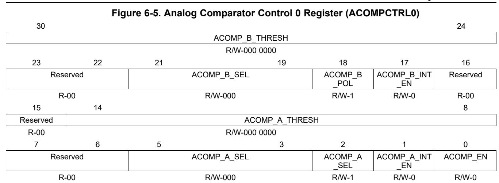

**Table 6-1. Analog Comparator Control 0 Register (ACOMPCTRL0) Register Field Descriptions**

<span id="page-234-1"></span>

| Bit            | Field                   | Type     | Reset     | Description                                                                                                                                                                                                                                                                                                                                                     |
|----------------|-------------------------|----------|-----------|-----------------------------------------------------------------------------------------------------------------------------------------------------------------------------------------------------------------------------------------------------------------------------------------------------------------------------------------------------------------|
| 30-24          | ACOMP_B_<br>THRESH      | R/W      | 000 0000  | Configures Analog Comparator B Threshold value<br>0 = Comparator Reference of 19.53125 mV (Default)<br>1 = Comparator Reference of 39.0625 mV<br>                                                                                                                                                                                                               |
|                |                         |          |           | 127 = Comparator Reference of 2.5 V                                                                                                                                                                                                                                                                                                                             |
| 23-22<br>21-19 | Reserved<br>ACOMP_B_SEL | R<br>R/W | 00<br>000 | Configures Analog Comparator B Threshold<br>0 = Analog Comparator B Threshold set by ACOMP_B_THRESH (Default)<br>1 = Analog Comparator B Threshold set by Comparator Ramp 0<br>2 = Analog Comparator B Threshold set by Filter 0 Output<br>3 = Analog Comparator B Threshold set by Filter 1 Output<br>4 = Analog Comparator B Threshold set by Filter 2 Output |
| 18             | ACOMP_B_POL             | R/W<br>1 |           | Analog Comparator B Polarity<br>0 = Comparator result enabled when input falls below threshold<br>1 = Comparator result enabled when input exceeds threshold (Default)                                                                                                                                                                                          |
| 17             | ACOMP_B_INT_<br>EN      | R/W<br>0 |           | Analog Comparator B Interrupt Enable<br>0 = Disables Analog Comparator B Interrupt generation (Default)<br>1 = Enables Analog Comparator B Interrupt generation                                                                                                                                                                                                 |
| 16-15          | Reserved                | R        | 00        |                                                                                                                                                                                                                                                                                                                                                                 |
| 14-8           | ACOMP_A_<br>THRESH      | R/W      | 000 0000  | Configures Analog Comparator A Threshold<br>0 = Comparator Reference of 19.53125 mV (Default)<br>1 = Comparator Reference of 39.0625 mV<br><br>127 = Comparator Reference of 2.5 V                                                                                                                                                                              |
| 7-6            | Reserved                | R        | 00        |                                                                                                                                                                                                                                                                                                                                                                 |
| 5-3            | ACOMP_A_SEL             | R/W      | 000       | Configures Analog Comparator A Threshold<br>0 = Analog Comparator A Threshold set by ACOMP_A_THRESH (Default)<br>1 = Analog Comparator A Threshold set by Comparator Ramp 0<br>2 = Analog Comparator A Threshold set by Filter 0 Output<br>3 = Analog Comparator A Threshold set by Filter 1 Output<br>4 = Analog Comparator A Threshold set by Filter 2 Output |
| 2              | ACOMP_A_POL             | R/W<br>1 |           | Analog Comparator A Polarity<br>0 = Comparator result enabled when input falls below threshold<br>1 = Comparator result enabled when input exceeds threshold (Default)                                                                                                                                                                                          |


# **Table 6-1. Analog Comparator Control 0 Register (ACOMPCTRL0) Register Field Descriptions (continued)**

| Bit | Field              | Type | Reset | Description                                                                                                                                                     |
|-----|--------------------|------|-------|-----------------------------------------------------------------------------------------------------------------------------------------------------------------|
| 1   | ACOMP_A_INT_<br>EN | R/W  | 0     | Analog Comparator A Interrupt Enable<br>0 = Disables Analog Comparator A Interrupt generation (Default)<br>1 = Enables Analog Comparator A Interrupt generation |
| 0   | ACOMP_EN           | R/W  | 0     | Analog Comparators Enable<br>0 = Analog Comparators Disabled (Default)<br>1 = Analog Comparators Enabled                                                        |


# <span id="page-236-0"></span>*6.11.2 Analog Comparator Control 1 Register (ACOMPCTRL1)*

Address 00030004

**Figure 6-6. Analog Comparator Control 1 Register (ACOMPCTRL1)**

<span id="page-236-1"></span>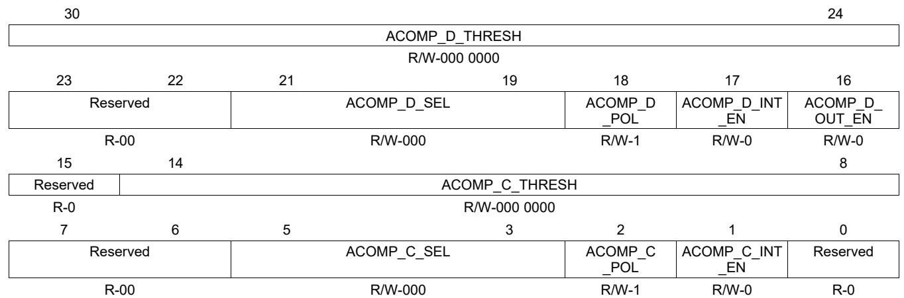

**Table 6-2. Analog Comparator Control 1 Register (ACOMPCTRL1) Register Field Descriptions**

<span id="page-236-2"></span>

| Bit   | Field              | Type | Reset    | Description                                                                                                                                                                                                                                                                                                                                                     |
|-------|--------------------|------|----------|-----------------------------------------------------------------------------------------------------------------------------------------------------------------------------------------------------------------------------------------------------------------------------------------------------------------------------------------------------------------|
| 30-24 | ACOMP_D_<br>THRESH | R/W  | 000 0000 | Configures Analog Comparator D Threshold<br>0 = Comparator Reference of 19.53125 mV (Default)<br>1 = Comparator Reference of 39.0625 mV<br><br>127 = Comparator Reference of 2.5 V                                                                                                                                                                              |
| 23-22 | Reserved           | R    | 00       |                                                                                                                                                                                                                                                                                                                                                                 |
| 21-19 | ACOMP_D_SEL        | R/W  | 000      | Configures Analog Comparator D Threshold<br>0 = Analog Comparator D Threshold set by ACOMP_D_THRESH (Default)<br>1 = Analog Comparator D Threshold set by Comparator Ramp 0<br>2 = Analog Comparator D Threshold set by Filter 0 Output<br>3 = Analog Comparator D Threshold set by Filter 1 Output<br>4 = Analog Comparator D Threshold set by Filter 2 Output |
| 18    | ACOMP_D_POL        | R/W  | 1        | Analog Comparator D Polarity<br>0 = Comparator result enabled when input falls below threshold<br>1 = Comparator result enabled when input exceeds threshold (Default)                                                                                                                                                                                          |
| 17    | ACOMP_D_INT_<br>EN | R/W  | 0        | Analog Comparator D Interrupt Enable<br>0 = Disables Analog Comparator D Interrupt generation (Default)<br>1 = Enables Analog Comparator D Interrupt generation                                                                                                                                                                                                 |
| 16    | ACOMP_D_OUT_<br>EN | R/W  | 0        | Analog Comparator D DAC Output Enable<br>0 = Disables output of Comparator DAC D onto AD pin (Default)<br>1 = Enables output of Comparator DAC D onto AD pin                                                                                                                                                                                                    |
| 15    | Reserved           | R    | 0        |                                                                                                                                                                                                                                                                                                                                                                 |
| 14-8  | ACOMP_C_<br>THRESH | R/W  | 000 0000 | Configures Analog Comparator C Threshold<br>0 = Comparator Reference of 19.53125 mV (Default)<br>1 = Comparator Reference of 39.0625 mV<br><br>127 = Comparator Reference of 2.5 V                                                                                                                                                                              |
| 7-6   | Reserved           | R    | 00       |                                                                                                                                                                                                                                                                                                                                                                 |


# **Table 6-2. Analog Comparator Control 1 Register (ACOMPCTRL1) Register Field Descriptions (continued)**

| Bit | Field              | Type | Reset | Description                                                                                                                                                                                                                                                                                                                                                     |
|-----|--------------------|------|-------|-----------------------------------------------------------------------------------------------------------------------------------------------------------------------------------------------------------------------------------------------------------------------------------------------------------------------------------------------------------------|
| 5-3 | ACOMP_C_SEL        | R/W  | 000   | Configures Analog Comparator C Threshold<br>0 = Analog Comparator C Threshold set by ACOMP_C_THRESH (Default)<br>1 = Analog Comparator C Threshold set by Comparator Ramp 0<br>2 = Analog Comparator C Threshold set by Filter 0 Output<br>3 = Analog Comparator C Threshold set by Filter 1 Output<br>4 = Analog Comparator C Threshold set by Filter 2 Output |
| 2   | ACOMP_C_POL        | R/W  | 1     | Analog Comparator C Polarity<br>0 = Comparator result enabled when input falls below threshold<br>1 = Comparator result enabled when input exceeds threshold (Default)                                                                                                                                                                                          |
| 1   | ACOMP_C_INT_<br>EN | R/W  | 0     | Analog Comparator C Interrupt Enable<br>0 = Disables Analog Comparator C Interrupt generation (Default)<br>1 = Enables Analog Comparator C Interrupt generation                                                                                                                                                                                                 |
| 0   | Reserved           | R    | 0     |                                                                                                                                                                                                                                                                                                                                                                 |


# <span id="page-238-0"></span>*6.11.3 Analog Comparator Control 2 Register (ACOMPCTRL2)*

Address 00030008

**Figure 6-7. Analog Comparator Control 2 Register (ACOMPCTRL2)**

<span id="page-238-1"></span>

| 30             |                     |                      |                |                 |                    | 24                 |  |  |  |  |
|----------------|---------------------|----------------------|----------------|-----------------|--------------------|--------------------|--|--|--|--|
| ACOMP_F_THRESH |                     |                      |                |                 |                    |                    |  |  |  |  |
| R/W-000 0000   |                     |                      |                |                 |                    |                    |  |  |  |  |
| 23             | 22                  | 21<br>19<br>18<br>17 |                |                 |                    |                    |  |  |  |  |
| Reserved       | ACOMP_F_<br>REF_SEL |                      | ACOMP_F_SEL    | ACOMP_F<br>_POL | ACOMP_F_INT<br>_EN | ACOMP_F_<br>OUT_EN |  |  |  |  |
| R-0            | R/W-0               |                      | R/W-000        | R/W-1           | R/W-0              | R/W-0              |  |  |  |  |
| 15             | 14                  |                      |                |                 |                    | 8                  |  |  |  |  |
| Reserved       |                     |                      | ACOMP_E_THRESH |                 |                    |                    |  |  |  |  |
| R-0            |                     |                      |                | R/W-000 0000    |                    |                    |  |  |  |  |
| 7              | 6                   | 5                    | 3              | 2               | 1                  | 0                  |  |  |  |  |
|                | Reserved            |                      | ACOMP_E_SEL    |                 | ACOMP_E_INT<br>_EN | ACOMP_E_<br>OUT_EN |  |  |  |  |
|                | R-00                |                      | R/W-000        | R/W-1           | R/W-0              | R/W-0              |  |  |  |  |

**Table 6-3. Analog Comparator Control 2 Register (ACOMPCTRL2) Register Field Descriptions**

<span id="page-238-2"></span>

| Bit   | Field               | Type | Reset    | Description                                                                                                                                                                                                                                                                                                                                                     |
|-------|---------------------|------|----------|-----------------------------------------------------------------------------------------------------------------------------------------------------------------------------------------------------------------------------------------------------------------------------------------------------------------------------------------------------------------|
| 30-24 | ACOMP_F_<br>THRESH  | R/W  | 000 0000 | Configures Analog Comparator F Threshold<br>0 = Comparator Reference of 19.53125 mV (Default)<br>1 = Comparator Reference of 39.0625 mV<br><br>127 = Comparator Reference of 2.5 V                                                                                                                                                                              |
| 23    | Reserved            | R    | 0        |                                                                                                                                                                                                                                                                                                                                                                 |
| 22    | ACOMP_F_REF_<br>SEL | R/W  | 0        | Analog Comparator F Reference Select<br>0 = Selects internal DAC reference (Default)<br>1 = Selects reference driven from AD-07 pin                                                                                                                                                                                                                             |
| 21-19 | ACOMP_F_SEL         | R/W  | 000      | Configures Analog Comparator F Threshold<br>0 = Analog Comparator F Threshold set by ACOMP_F_THRESH (Default)<br>1 = Analog Comparator F Threshold set by Comparator Ramp 0<br>2 = Analog Comparator F Threshold set by Filter 0 Output<br>3 = Analog Comparator F Threshold set by Filter 1 Output<br>4 = Analog Comparator F Threshold set by Filter 2 Output |
| 18    | ACOMP_F_POL         | R/W  | 1        | Analog Comparator F Polarity<br>0 = Comparator result enabled when input falls below threshold<br>1 = Comparator result enabled when input exceeds threshold (Default)                                                                                                                                                                                          |
| 17    | ACOMP_F_INT_<br>EN  | R/W  | 0        | Analog Comparator F Interrupt Enable<br>0 = Disables Analog Comparator F Interrupt generation (Default)<br>1 = Enables Analog Comparator F Interrupt generation                                                                                                                                                                                                 |
| 16    | ACOMP_F_OUT_<br>EN  | R/W  | 0        | Analog Comparator F DAC Output Enable<br>0 = Disables output of Comparator DAC F onto AD pin (Default)<br>1 = Enables output of Comparator DAC F onto AD pin                                                                                                                                                                                                    |
| 15    | Reserved            | R    | 0        |                                                                                                                                                                                                                                                                                                                                                                 |
| 14-8  | ACOMP_E_<br>THRESH  | R/W  | 000 0000 | Configures Analog Comparator E Threshold<br>0 = Comparator Reference of 19.53125 mV (Default)<br>1 = Comparator Reference of 39.0625 mV<br><br>127 = Comparator Reference of 2.5 V                                                                                                                                                                              |
| 7-6   | Reserved            | R    | 00       |                                                                                                                                                                                                                                                                                                                                                                 |


# **Table 6-3. Analog Comparator Control 2 Register (ACOMPCTRL2) Register Field Descriptions (continued)**

| Bit | Field              | Type | Reset | Description                                                                                                                                                                                                                                                                                                                                                     |
|-----|--------------------|------|-------|-----------------------------------------------------------------------------------------------------------------------------------------------------------------------------------------------------------------------------------------------------------------------------------------------------------------------------------------------------------------|
| 5-3 | ACOMP_E_SEL        | R/W  | 000   | Configures Analog Comparator E Threshold<br>0 = Analog Comparator E Threshold set by ACOMP_E_THRESH (Default)<br>1 = Analog Comparator E Threshold set by Comparator Ramp 0<br>2 = Analog Comparator E Threshold set by Filter 0 Output<br>3 = Analog Comparator E Threshold set by Filter 1 Output<br>4 = Analog Comparator E Threshold set by Filter 2 Output |
| 2   | ACOMP_E_POL        | R/W  | 1     | Analog Comparator E Polarity<br>0 = Comparator result enabled when input falls below threshold<br>1 = Comparator result enabled when input exceeds threshold (Default)                                                                                                                                                                                          |
| 1   | ACOMP_E_INT<br>_EN | R/W  | 0     | Analog Comparator E Interrupt Enable<br>0 = Disables Analog Comparator E Interrupt generation (Default)<br>1 = Enables Analog Comparator E Interrupt generation                                                                                                                                                                                                 |
| 0   | ACOMP_E_OUT_<br>EN | R/W  | 0     | Analog Comparator E DAC Output Enable<br>0 = Disables output of Comparator DAC E onto AD pin (Default)<br>1 = Enables output of Comparator DAC E onto AD pin                                                                                                                                                                                                    |


# <span id="page-240-0"></span>*6.11.4 Analog Comparator Control 3 Register (ACOMPCTRL3)*

Address 0003000C

**Figure 6-8. Analog Comparator Control 3 Register (ACOMPCTRL3)**

<span id="page-240-1"></span>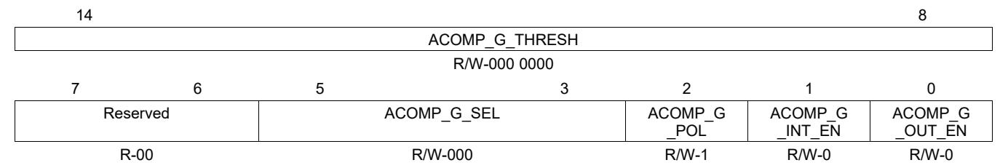

**Table 6-4. Analog Comparator Control 3 Register (ACOMPCTRL3) Register Field Descriptions**

<span id="page-240-2"></span>

| Bit  | Field              | Type | Reset    | Description                                                                                                                                                                                                                                                                                                                                                     |
|------|--------------------|------|----------|-----------------------------------------------------------------------------------------------------------------------------------------------------------------------------------------------------------------------------------------------------------------------------------------------------------------------------------------------------------------|
| 14-8 | ACOMP_G_<br>THRESH | R/W  | 000 0000 | Configures Analog Comparator G Threshold<br>0 = Comparator Reference of 19.53125 mV (Default)<br>1 = Comparator Reference of 39.0625 mV<br><br>127 = Comparator Reference of 2.5 V                                                                                                                                                                              |
| 7-6  | Reserved           | R    | 00       |                                                                                                                                                                                                                                                                                                                                                                 |
| 5-3  | ACOMP_G_SEL        | R/W  | 000      | Configures Analog Comparator G Threshold<br>0 = Analog Comparator G Threshold set by ACOMP_G_THRESH (Default)<br>1 = Analog Comparator G Threshold set by Comparator Ramp 0<br>2 = Analog Comparator G Threshold set by Filter 0 Output<br>3 = Analog Comparator G Threshold set by Filter 1 Output<br>4 = Analog Comparator G Threshold set by Filter 2 Output |
| 2    | ACOMP_G_<br>POL    | R/W  | 1        | Analog Comparator G Polarity<br>0 = Comparator result enabled when input falls below threshold<br>1 = Comparator result enabled when input exceeds threshold (Default)                                                                                                                                                                                          |
| 1    | ACOMP_G_INT_<br>EN | R/W  | 0        | Analog Comparator G Interrupt Enable<br>0 = Disables Analog Comparator G Interrupt generation (Default)<br>1 = Enables Analog Comparator G Interrupt generation                                                                                                                                                                                                 |
| 0    | ACOMP_G_OUT_<br>EN | R/W  | 0        | Analog Comparator G DAC Output Enable<br>0 = Disables output of Comparator DAC G onto AD pin (Default)<br>1 = Enables output of Comparator DAC G onto AD pin                                                                                                                                                                                                    |


# <span id="page-241-0"></span>*6.11.5 External Fault Control Register (EXTFAULTCTRL)*

Address 00030010

**Figure 6-9. External Fault Control Register (EXTFAULTCTRL)**

<span id="page-241-1"></span>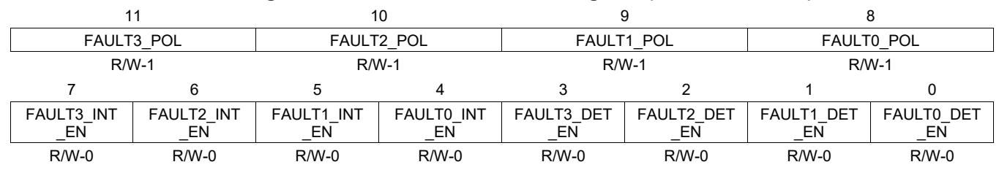

**Table 6-5. External Fault Control Register (EXTFAULTCTRL) Register Field Descriptions**

<span id="page-241-2"></span>

| Bit | Field         | Type | Reset | Description                                                                                                                                      |
|-----|---------------|------|-------|--------------------------------------------------------------------------------------------------------------------------------------------------|
| 11  | FAULT3_POL    | R/W  | 1     | Polarity configuration for FAULT[3] pin<br>0 = Fault detection enabled on falling edge<br>1 = Fault detection enabled on rising edge (Default)   |
| 10  | FAULT2_POL    | R/W  | 1     | Polarity configuration for FAULT[2] pin<br>0 = Fault detection enabled on falling edge<br>1 = Fault detection enabled on rising edge (Default)   |
| 9   | FAULT1_POL    | R/W  | 1     | Polarity configuration for FAULT[1] pin<br>0 = Fault detection enabled on falling edge<br>1 = Fault detection enabled on rising edge (Default)   |
| 8   | FAULT0_POL    | R/W  | 1     | Polarity configuration for FAULT[0] pin<br>0 = Fault detection enabled on falling edge<br>1 = Fault detection enabled on rising edge (Default)   |
| 7   | FAULT3_INT_EN | R/W  | 0     | FAULT[3] Pin Interrupt Enable<br>0 = Disables Fault Detection Interrupt generation (Default)<br>1 = Enables Fault Detection Interrupt generation |
| 6   | FAULT2_INT_EN | R/W  | 0     | FAULT[2] Pin Interrupt Enable<br>0 = Disables Fault Detection Interrupt generation (Default)<br>1 = Enables Fault Detection Interrupt generation |
| 5   | FAULT1_INT_EN | R/W  | 0     | FAULT[1] Pin Interrupt Enable<br>0 = Disables Fault Detection Interrupt generation (Default)<br>1 = Enables Fault Detection Interrupt generation |
| 4   | FAULT0_INT_EN | R/W  | 0     | FAULT[0] Pin Interrupt Enable<br>0 = Disables Fault Detection Interrupt generation (Default)<br>1 = Enables Fault Detection Interrupt generation |
| 3   | FAULT3_DET_EN | R/W  | 0     | FAULT[3] Pin Detection Enable<br>0 = Fault Detection Disabled (Default)<br>1 = Fault Detection Enabled                                           |
| 2   | FAULT2_DET_EN | R/W  | 0     | FAULT[2] Pin Detection Enable<br>0 = Fault Detection Disabled (Default)<br>1 = Fault Detection Enabled                                           |
| 1   | FAULT1_DET_EN | R/W  | 0     | FAULT[1] Pin Detection Enable<br>0 = Fault Detection Disabled (Default)<br>1 = Fault Detection Enabled                                           |
| 0   | FAULT0_DET_EN | R/W  | 0     | FAULT[0] Pin Detection Enable<br>0 = Fault Detection Disabled (Default)<br>1 = Fault Detection Enabled                                           |


# <span id="page-242-0"></span>*6.11.6 Fault Mux Interrupt Status Register (FAULTMUXINTSTAT)*

Address 00030014

#### **Figure 6-10. Fault Mux Interrupt Status Register (FAULTMUXINTSTAT)**

<span id="page-242-1"></span>

| 16         | 15      | 14      | 13      | 12       | 11      | 10      | 9       | 8       |
|------------|---------|---------|---------|----------|---------|---------|---------|---------|
| DCOMP3     | DCOMP2  | DCOMP1  | DCOMP0  | LFO_FAIL | FAULT3  | FAULT2  | FAULT1  | FAULT0  |
| R-0        | R-0     | R-0     | R-0     | R-0      | R-0     | R-0     | R-0     | R-0     |
| 7          | 6       | 5       | 4       |          | 3       | 2       | 1       | 0       |
| DCM_DETECT | ACOMP_G | ACOMP_F | ACOMP_E |          | ACOMP_D | ACOMP_C | ACOMP_B | ACOMP_A |
| R-0        | R-0     | R-0     | R-0     |          | R-0     | R-0     | R-0     | R-0     |

LEGEND: R/W = Read/Write; R = Read only; -*n* = value after reset

# **Table 6-6. Fault Mux Interrupt Status Register (FAULTMUXINTSTAT) Register Field Descriptions**

<span id="page-242-2"></span>

| Bit | Field      | Type | Reset | Description                                                                                                                                                                        |  |  |  |
|-----|------------|------|-------|------------------------------------------------------------------------------------------------------------------------------------------------------------------------------------|--|--|--|
| 16  | DCOMP3     | R    | 0     | Digital Comparator 3 Interrupt Status, cleared by read of status register<br>0 = Comparator threshold interrupt inactive<br>1 = Comparator threshold interrupt active              |  |  |  |
| 15  | DCOMP2     | R    | 0     | Digital Comparator 2 Interrupt Status, cleared by read of status register<br>0 = Comparator threshold interrupt inactive<br>1 = Comparator threshold interrupt active              |  |  |  |
| 14  | DCOMP1     | R    | 0     | Digital Comparator 1 Interrupt Status, cleared by read of status register<br>0 = Comparator threshold interrupt inactive<br>1 = Comparator threshold interrupt active              |  |  |  |
| 13  | DCOMP0     | R    | 0     | Digital Comparator 0 Interrupt Status, cleared by read of status register<br>0 = Comparator threshold interrupt inactive<br>1 = Comparator threshold interrupt active              |  |  |  |
| 12  | LFO_FAIL   | R    | 0     | Low Frequency Oscillator Failure Interrupt Status, cleared by read of status register<br>0 = Low Frequency Oscillator operational<br>1 = Low Frequency Oscillator failure detected |  |  |  |
| 11  | FAULT3     | R    | 0     | External FAULT[3] Interrupt Detection<br>0 = No External GPIO detection found<br>1 = External GPIO detection found                                                                 |  |  |  |
| 10  | FAULT2     | R    | 0     | External FAULT[2] Interrupt Detection<br>0 = No External GPIO detection found<br>1 = External GPIO detection found                                                                 |  |  |  |
| 9   | FAULT1     | R    | 0     | External FAULT[1] Interrupt Detection<br>0 = No External GPIO detection found<br>1 = External GPIO detection found                                                                 |  |  |  |
| 8   | FAULT0     | R    | 0     | External FAULT[0] Interrupt Detection<br>0 = No External GPIO detection found<br>1 = External GPIO detection found                                                                 |  |  |  |
| 7   | DCM_DETECT | R    | 0     | Discontinuous Conduction Mode Interrupt Status, cleared by read of status register<br>0 = Discontinuous Conduction Mode detected<br>1 = Discontinuous Conduction Mode not detected |  |  |  |
| 6   | ACOMP_G    | R    | 0     | Analog Comparator G Interrupt Status, cleared by read of status register<br>0 = Comparator threshold interrupt inactive<br>1 = Comparator threshold interrupt active               |  |  |  |
| 5   | ACOMP_F    | R    | 0     | Analog Comparator F Interrupt Status, cleared by read of status register<br>0 = Comparator threshold interrupt inactive<br>1 = Comparator threshold interrupt active               |  |  |  |


### **Table 6-6. Fault Mux Interrupt Status Register (FAULTMUXINTSTAT) Register Field Descriptions (continued)**

| Bit | Field   | Type | Reset | Description                                                                                                                                                          |
|-----|---------|------|-------|----------------------------------------------------------------------------------------------------------------------------------------------------------------------|
| 4   | ACOMP_E | R    | 0     | Analog Comparator E Interrupt Status, cleared by read of status register<br>0 = Comparator threshold interrupt inactive<br>1 = Comparator threshold interrupt active |
| 3   | ACOMP_D | R    | 0     | Analog Comparator D Interrupt Status, cleared by read of status register<br>0 = Comparator threshold interrupt inactive<br>1 = Comparator threshold interrupt active |
| 2   | ACOMP_C | R    | 0     | Analog Comparator C Interrupt Status, cleared by read of status register<br>0 = Comparator threshold interrupt inactive<br>1 = Comparator threshold interrupt active |
| 1   | ACOMP_B | R    | 0     | Analog Comparator B Interrupt Status, cleared by read of status register<br>0 = Comparator threshold interrupt inactive<br>1 = Comparator threshold interrupt active |
| 0   | ACOMP_A | R    | 0     | Analog Comparator A Interrupt Status, cleared by read of status register<br>0 = Comparator threshold interrupt inactive<br>1 = Comparator threshold interrupt active |


# <span id="page-244-0"></span>*6.11.7 Fault Mux Raw Status Register (FAULTMUXRAWSTAT)*

Address 00030018

**Figure 6-11. Fault Mux Raw Status Register (FAULTMUXRAWSTAT)**

<span id="page-244-1"></span>

| 16         | 15      | 14      | 13      | 12       | 11      | 10      | 9       | 8       |
|------------|---------|---------|---------|----------|---------|---------|---------|---------|
| DCOMP3     | DCOMP2  | DCOMP1  | DCOMP0  | LFO_FAIL | FAULT3  | FAULT2  | FAULT1  | FAULT0  |
| R-0        | R-0     | R-0     | R-0     | R-0      | R-0     | R-0     | R-0     | R-0     |
| 7          | 6       | 5       | 4       |          | 3       | 2       | 1       | 0       |
| DCM_DETECT | ACOMP_G | ACOMP_F | ACOMP_E |          | ACOMP_D | ACOMP_C | ACOMP_B | ACOMP_A |
| R-0        | R-0     | R-0     | R-0     |          | R-0     | R-0     | R-0     | R-0     |

**Table 6-7. Fault Mux Raw Status Register (FAULTMUXRAWSTAT) Register Field Descriptions**

<span id="page-244-2"></span>

| Bit | Field      | Type | Reset | Description                                                                                                                              |  |  |  |
|-----|------------|------|-------|------------------------------------------------------------------------------------------------------------------------------------------|--|--|--|
| 16  | DCOMP3     | R    | 0     | Digital Comparator 3 Raw Status<br>0 = Comparator threshold not exceeded<br>1 = Comparator threshold exceeded                            |  |  |  |
| 15  | DCOMP2     | R    | 0     | Digital Comparator 2 Raw Status<br>0 = Comparator threshold not exceeded<br>1 = Comparator threshold exceeded                            |  |  |  |
| 14  | DCOMP1     | R    | 0     | Digital Comparator 1 Raw Status<br>0 = Comparator threshold not exceeded<br>1 = Comparator threshold exceeded                            |  |  |  |
| 13  | DCOMP0     | R    | 0     | Digital Comparator 0 Raw Status<br>0 = Comparator threshold not exceeded<br>1 = Comparator threshold exceeded                            |  |  |  |
| 12  | LFO_FAIL   | R    | 0     | Low Frequency Oscillator Failure Raw Status<br>0 = Low Frequency Oscillator operationaL<br>1 = Low Frequency Oscillator failure detected |  |  |  |
| 11  | FAULT3     | R    | 0     | External Fault Detection on FAULT[3] pin<br>0 = No External FAULT[3] detection found<br>1 = External GPIO detection found                |  |  |  |
| 10  | FAULT2     | R    | 0     | External Fault Detection on FAULT[2] pin<br>0 = No External FAULT[2] detection found<br>1 = External GPIO detection found                |  |  |  |
| 9   | FAULT1     | R    | 0     | External Fault Detection on FAULT[1] pin<br>0 = No External FAULT[1] detection found<br>1 = External GPIO detection found                |  |  |  |
| 8   | FAULT0     | R    | 0     | External Fault Detection on FAULT[0] pin<br>0 = No External FAULT[0] detection found<br>1 = External GPIO detection found                |  |  |  |
| 7   | DCM_DETECT | R    | 0     | Discontinuous Conduction Mode Raw Status<br>0 = Discontinuous Conduction Mode detected<br>1 = Discontinuous Conduction Mode not detected |  |  |  |
| 6   | ACOMP_G    | R    | 0     | Analog Comparator G Raw Result<br>0 = Comparator threshold not exceeded<br>1 = Comparator threshold exceeded                             |  |  |  |
| 5   | ACOMP_F    | R    | 0     | Analog Comparator F Raw Result<br>0 = Comparator threshold not exceeded<br>1 = Comparator threshold exceeded                             |  |  |  |


# **Table 6-7. Fault Mux Raw Status Register (FAULTMUXRAWSTAT) Register Field Descriptions (continued)**

| Bit | Field   | Type | Reset | Description                                                                                                  |  |  |  |
|-----|---------|------|-------|--------------------------------------------------------------------------------------------------------------|--|--|--|
| 4   | ACOMP_E | R    | 0     | Analog Comparator E Raw Result<br>0 = Comparator threshold not exceeded<br>1 = Comparator threshold exceeded |  |  |  |
| 3   | ACOMP_D | R    | 0     | Analog Comparator D Raw Result<br>0 = Comparator threshold not exceeded<br>1 = Comparator threshold exceeded |  |  |  |
| 2   | ACOMP_C | R    | 0     | Analog Comparator C Raw Result<br>0 = Comparator threshold not exceeded<br>1 = Comparator threshold exceeded |  |  |  |
| 1   | ACOMP_B | R    | 0     | Analog Comparator B Raw Result<br>0 = Comparator threshold not exceeded<br>1 = Comparator threshold exceeded |  |  |  |
| 0   | ACOMP_A | R    | 0     | Analog Comparator A Raw Result<br>0 = Comparator threshold not exceeded<br>1 = Comparator threshold exceeded |  |  |  |


# <span id="page-246-1"></span>*6.11.8 Comparator Ramp Control 0 Register (COMPRAMP0)*

Comparator Ramp Control 0 Register (COMPRAMP0)

**Figure 6-12. Comparator Ramp Control 0 Register (COMPRAMP0)**

<span id="page-246-2"></span>

| 31 |                            | 28                | 27                         |                   |                   | 24      |  |  |  |  |
|----|----------------------------|-------------------|----------------------------|-------------------|-------------------|---------|--|--|--|--|
|    | START_VALUE_SEL            |                   | STEP_SIZE                  |                   |                   |         |  |  |  |  |
|    | R/W-0000                   |                   | R/W-00 0000 0000 0000 0000 |                   |                   |         |  |  |  |  |
| 23 |                            |                   |                            |                   |                   | 16      |  |  |  |  |
|    |                            |                   | STEP_SIZE                  |                   |                   |         |  |  |  |  |
|    | R/W-00 0000 0000 0000 0000 |                   |                            |                   |                   |         |  |  |  |  |
| 15 |                            |                   |                            | 10                | 9                 | 8       |  |  |  |  |
|    | STEP_SIZE                  |                   | CLKS_PER_STEP              |                   |                   |         |  |  |  |  |
|    | R/W-00 0000 0000 0000 0000 |                   | R/W-0 0000                 |                   |                   |         |  |  |  |  |
| 7  | 5                          | 4                 | 3                          | 2                 | 1                 | 0       |  |  |  |  |
|    | CLKS_PER_STEP              | DPWM3_TRIG<br>_EN | DPWM2_TRIG<br>_EN          | DPWM1_TRIG<br>_EN | DPWM0_TRIG<br>_EN | RAMP_EN |  |  |  |  |
|    | R/W-0 0000                 | R/W-0             | R/W-0                      | R/W-0             | R/W-0             | R/W-0   |  |  |  |  |

**Table 6-8. Comparator Ramp Control 0 Register (COMPRAMP0) Register Field Descriptions**

<span id="page-246-0"></span>

| Bit   | Field               | Type | Reset                           | Description                                                                                                                                                                                                                                                                                                                                                                                                                                                                  |
|-------|---------------------|------|---------------------------------|------------------------------------------------------------------------------------------------------------------------------------------------------------------------------------------------------------------------------------------------------------------------------------------------------------------------------------------------------------------------------------------------------------------------------------------------------------------------------|
| 31-28 | START_VALUE<br>_SEL | R/W  | 0000                            | Configures comparator ramp starting value<br>0 = Filter 0 Output (Bits 17-11) (Default)<br>1 = Filter 1 Output (Bits 17-11)<br>2 = Filter 2 Output (Bits 17-11)<br>3 = Analog Comparator Threshold A Value<br>4 = Analog Comparator Threshold B Value<br>5 = Analog Comparator Threshold C Value<br>6 = Analog Comparator Threshold D Value<br>7 = Analog Comparator Threshold E Value<br>8 = Analog Comparator Threshold F Value<br>9 = Analog Comparator Threshold G Value |
| 27-10 | STEP_SIZE           | R/W  | 00 0000<br>0000<br>0000<br>0000 | Programmable 18-bit unsigned comparator step with Bits 27:24 representing the<br>integer portion of the comparator step (0-15 Comparator steps of 19.5mV each) and<br>Bits 23:10 representing the fractional portion of the comparator step                                                                                                                                                                                                                                  |
| 9-5   | CLKS_PER_STEP       | R/W  | 0 0000                          | Selects number of MCLK (HFO_OSC/8) clock cycles per comparator step where<br>number of subcycles can vary from 1 to 32<br>0 = 1 MCLK clock cycles per step (Default)<br>1 = 2 MCLK clock cycles per step<br>2 = 3 MCLK clock cycles per step<br><br>31 = 32 MCLK clock cycles per step                                                                                                                                                                                       |
| 4     | DPWM3_TRIG<br>_EN   | R/W  | 0                               | Enables DPWM Trigger from DPWM 3 to Analog Comparator Ramp 0<br>0 = DPWM 3 trigger not routed to Analog Comparator Ramp 0 (Default)<br>1 = DPWM 3 trigger routed to Analog Comparator Ramp 0                                                                                                                                                                                                                                                                                 |
| 3     | DPWM2_TRIG<br>_EN   | R/W  | 0                               | Enables DPWM Trigger from DPWM 2 to Analog Comparator Ramp 0<br>0 = DPWM 2 trigger not routed to Analog Comparator Ramp 0 (Default)<br>1 = DPWM 2 trigger routed to Analog Comparator Ramp 0                                                                                                                                                                                                                                                                                 |
| 2     | DPWM1_TRIG<br>_EN   | R/W  | 0                               | Enables DPWM Trigger from DPWM 1 to Analog Comparator Ramp 0<br>0 = DPWM 1 trigger not routed to Analog Comparator Ramp 0 (Default)<br>1 = DPWM 1 trigger routed to Analog Comparator Ramp 0                                                                                                                                                                                                                                                                                 |


### **Table 6-8. Comparator Ramp Control 0 Register (COMPRAMP0) Register Field Descriptions (continued)**

| Bit | Field             | Type | Reset | Description                                                                                                                                                                                  |
|-----|-------------------|------|-------|----------------------------------------------------------------------------------------------------------------------------------------------------------------------------------------------|
| 1   | DPWM0_TRIG<br>_EN | R/W  | 0     | Enables DPWM Trigger from DPWM 0 to Analog Comparator Ramp 0<br>0 = DPWM 0 trigger not routed to Analog Comparator Ramp 0 (Default)<br>1 = DPWM 0 trigger routed to Analog Comparator Ramp 0 |
| 0   | RAMP_EN           | R/W  | 0     | Enable for Analog Comparator Ramp 0<br>0 = Analog Comparator Ramp disabled (Default)<br>1 = Analog Comparator Ramp enabled                                                                   |


# <span id="page-248-0"></span>*6.11.9 Digital Comparator Control 0 Register (DCOMPCTRL0)*

Address 0x00030020

**Figure 6-13. Digital Comparator Control 0 Register (DCOMPCTRL0)**

<span id="page-248-1"></span>

**Table 6-9. Digital Comparator Control 0 Register (DCOMPCTRL0) Register Field Descriptions**

<span id="page-248-2"></span>

| Bit   | Field      | Type | Reset            | Description                                                                                                                                                                                                                                                                                                                                      |
|-------|------------|------|------------------|--------------------------------------------------------------------------------------------------------------------------------------------------------------------------------------------------------------------------------------------------------------------------------------------------------------------------------------------------|
| 31-24 | CNT_THRESH | R/W  | 0000<br>0000     | Sets the number of received comparator events before declaring a fault                                                                                                                                                                                                                                                                           |
| 23-19 | Reserved   | R    | 0000 0           |                                                                                                                                                                                                                                                                                                                                                  |
| 18    | COMP_POL   | R/W  | 0                | Digital Comparator 0 Polarity<br>0 = Digital Comparator result asserted if value below threshold (Default)<br>1 = Digital Comparator result asserted if value above threshold                                                                                                                                                                    |
| 17-15 | FE_SEL     | R/W  | 000              | Selects which Front End absolute data is used for Digital Comparison with threshold<br>0 = Front End 0 absolute data selected (Default)<br>1 = Front End 1 absolute data selected<br>2 = Front End 2 absolute data selected<br>3 = Front End 0 error data selected<br>4 = Front End 1 error data selected<br>5 = Front End 2 error data selected |
| 14    | CNT_CLR    | R/W  | 0                | Comparator Detection Counter clear<br>0 = No clear of Comparator Detection Counter (Default)<br>1 = Clear Comparator Detection counter and associated fault                                                                                                                                                                                      |
| 13    | CNT_CONFIG | R/W  | 0                | Comparator Detection Counter configuration<br>0 = Counter clears upon receipt of sample which does not exceed comparator<br>threshold (Default)<br>1 = Counter decrements by 1 upon receipt of sample which does not exceed<br>comparator threshold                                                                                              |
| 12    | INT_EN     | R/W  | 0                | Comparator Interrupt Enable<br>0 = Disables Comparator Interrupt generation (Default)<br>1 = Enables Comparator Interrupt generation                                                                                                                                                                                                             |
| 11    | COMP_EN    | R/W  | 0                | Digital Comparator 0 Enable<br>0 = Disables Digital Comparator 0 (Default)<br>1 = Enables Digital Comparator 0                                                                                                                                                                                                                                   |
| 10-0  | THRESH     | R/W  | 000 0000<br>0000 | Sets the digital comparator threshold, 11-bit signed value with resolution of<br>1.5625mV/bit                                                                                                                                                                                                                                                    |


# <span id="page-249-0"></span>*6.11.10 Digital Comparator Control 1 Register (DCOMPCTRL1)*

Address 0x00030024

**Figure 6-14. Digital Comparator Control 1 Register (DCOMPCTRL1)**

<span id="page-249-1"></span>

**Table 6-10. Digital Comparator Control 1 Register (DCOMPCTRL1) Register Field Descriptions**

<span id="page-249-2"></span>

| Bit   | Field      | Type | Reset            | Description                                                                                                                                                                                                                                                                                                                                      |
|-------|------------|------|------------------|--------------------------------------------------------------------------------------------------------------------------------------------------------------------------------------------------------------------------------------------------------------------------------------------------------------------------------------------------|
| 31-24 | CNT_THRESH | R/W  | 0000<br>0000     | Sets the number of received comparator events before declaring a fault                                                                                                                                                                                                                                                                           |
| 23-19 | Reserved   | R    | 0000 0           |                                                                                                                                                                                                                                                                                                                                                  |
| 18    | COMP_POL   | R/W  | 0                | Digital Comparator 0 Polarity<br>0 = Digital Comparator result asserted if value below threshold (Default)<br>1 = Digital Comparator result asserted if value above threshold                                                                                                                                                                    |
| 17-15 | FE_SEL     | R/W  | 000              | Selects which Front End absolute data is used for Digital Comparison with threshold<br>0 = Front End 0 absolute data selected (Default)<br>1 = Front End 1 absolute data selected<br>2 = Front End 2 absolute data selected<br>3 = Front End 0 error data selected<br>4 = Front End 1 error data selected<br>5 = Front End 2 error data selected |
| 14    | CNT_CLR    | R/W  | 0                | Comparator Detection Counter clear<br>0 = No clear of Comparator Detection Counter (Default)<br>1 = Clear Comparator Detection counter and associated fault                                                                                                                                                                                      |
| 13    | CNT_CONFIG | R/W  | 0                | Comparator Detection Counter configuration<br>0 = Counter clears upon receipt of sample which does not exceed comparator<br>threshold (Default)<br>1 = Counter decrements by 1 upon receipt of sample which does not exceed<br>comparator threshold                                                                                              |
| 12    | INT_EN     | R/W  | 0                | Comparator Interrupt Enable<br>0 = Disables Comparator Interrupt generation (Default)<br>1 = Enables Comparator Interrupt generation                                                                                                                                                                                                             |
| 11    | COMP_EN    | R/W  | 0                | Digital Comparator 0 Enable<br>0 = Disables Digital Comparator 0 (Default)<br>1 = Enables Digital Comparator 0                                                                                                                                                                                                                                   |
| 10-0  | THRESH     | R/W  | 000 0000<br>0000 | Sets the digital comparator threshold, 11-bit signed value with resolution of<br>1.5625mV/bit                                                                                                                                                                                                                                                    |


# <span id="page-250-0"></span>*6.11.11 Digital Comparator Control 2 Register (DCOMPCTRL2)*

Address 0x00030028

**Figure 6-15. Digital Comparator Control 2 Register (DCOMPCTRL2)**

<span id="page-250-1"></span>

**Table 6-11. Digital Comparator Control 2 Register (DCOMPCTRL2) Register Field Descriptions**

<span id="page-250-2"></span>

| Bit   | Field      | Type | Reset            | Description                                                                                                                                                                                                                                                                                                                                      |
|-------|------------|------|------------------|--------------------------------------------------------------------------------------------------------------------------------------------------------------------------------------------------------------------------------------------------------------------------------------------------------------------------------------------------|
| 31-24 | CNT_THRESH | R/W  | 0000<br>0000     | Sets the number of received comparator events before declaring a fault                                                                                                                                                                                                                                                                           |
| 23-19 | Reserved   | R    | 0000 0           |                                                                                                                                                                                                                                                                                                                                                  |
| 18    | COMP_POL   | R/W  | 0                | Digital Comparator 0 Polarity<br>0 = Digital Comparator result asserted if value below threshold (Default)<br>1 = Digital Comparator result asserted if value above threshold                                                                                                                                                                    |
| 17-15 | FE_SEL     | R/W  | 000              | Selects which Front End absolute data is used for Digital Comparison with threshold<br>0 = Front End 0 absolute data selected (Default)<br>1 = Front End 1 absolute data selected<br>2 = Front End 2 absolute data selected<br>3 = Front End 0 error data selected<br>4 = Front End 1 error data selected<br>5 = Front End 2 error data selected |
| 14    | CNT_CLR    | R/W  | 0                | Comparator Detection Counter clear<br>0 = No clear of Comparator Detection Counter (Default)<br>1 = Clear Comparator Detection counter and associated fault                                                                                                                                                                                      |
| 13    | CNT_CONFIG | R/W  | 0                | Comparator Detection Counter configuration<br>0 = Counter clears upon receipt of sample which does not exceed comparator<br>threshold (Default)<br>1 = Counter decrements by 1 upon receipt of sample which does not exceed<br>comparator threshold                                                                                              |
| 12    | INT_EN     | R/W  | 0                | Comparator Interrupt Enable<br>0 = Disables Comparator Interrupt generation (Default)<br>1 = Enables Comparator Interrupt generation                                                                                                                                                                                                             |
| 11    | COMP_EN    | R/W  | 0                | Digital Comparator 0 Enable<br>0 = Disables Digital Comparator 0 (Default)<br>1 = Enables Digital Comparator 0                                                                                                                                                                                                                                   |
| 10-0  | THRESH     | R/W  | 000 0000<br>0000 | Sets the digital comparator threshold, 11-bit signed value with resolution of<br>1.5625mV/bit                                                                                                                                                                                                                                                    |


# <span id="page-251-0"></span>*6.11.12 Digital Comparator Control 3 Register (DCOMPCTRL3)*

Address 0x0003002C

**Figure 6-16. Digital Comparator Control 3 Register (DCOMPCTRL3)**

<span id="page-251-1"></span>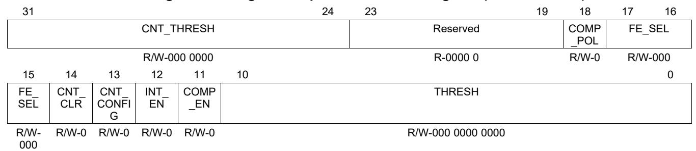

**Table 6-12. Digital Comparator Control 3 Register (DCOMPCTRL3) Register Field Descriptions**

<span id="page-251-2"></span>

| Bit   | Field      | Type | Reset            | Description                                                                                                                                                                                                                                                                                                                                      |
|-------|------------|------|------------------|--------------------------------------------------------------------------------------------------------------------------------------------------------------------------------------------------------------------------------------------------------------------------------------------------------------------------------------------------|
| 31-24 | CNT_THRESH | R/W  | 0000<br>0000     | Sets the number of received comparator events before declaring a fault                                                                                                                                                                                                                                                                           |
| 23-19 | Reserved   | R    | 0000 0           |                                                                                                                                                                                                                                                                                                                                                  |
| 18    | COMP_POL   | R/W  | 0                | Digital Comparator 1 Polarity<br>0 = Digital Comparator result asserted if value below threshold (Default)<br>1 = Digital Comparator result asserted if value above threshold                                                                                                                                                                    |
| 17-15 | FE_SEL     | R/W  | 000              | Selects which Front End absolute data is used for Digital Comparison with threshold<br>0 = Front End 0 absolute data selected (Default)<br>1 = Front End 1 absolute data selected<br>2 = Front End 2 absolute data selected<br>3 = Front End 0 error data selected<br>4 = Front End 1 error data selected<br>5 = Front End 2 error data selected |
| 14    | CNT_CLR    | R/W  | 0                | Comparator Detection Counter clear<br>0 = No clear of Comparator Detection Counter (Default)<br>1 = Clear Comparator Detection counter and associated fault                                                                                                                                                                                      |
| 13    | CNT_CONFIG | R/W  | 0                | Comparator Detection Counter configuration<br>0 = Counter clears upon receipt of sample which does not exceed comparator<br>threshold (Default)<br>1 = Counter decrements by 1 upon receipt of sample which does not exceed<br>comparator threshold                                                                                              |
| 12    | INT_EN     | R/W  | 0                | Comparator Interrupt Enable<br>0 = Disables Comparator Interrupt generation (Default)<br>1 = Enables Comparator Interrupt generation                                                                                                                                                                                                             |
| 11    | COMP_EN    | R/W  | 0                | Digital Comparator 3 Enable<br>0 = Disables Digital Comparator 3 (Default)<br>1 = Enables Digital Comparator 3                                                                                                                                                                                                                                   |
| 10-0  | THRESH     | R/W  | 000 0000<br>0000 | Sets the digital comparator threshold, 11-bit signed value with resolution of<br>1.5625mV/bit                                                                                                                                                                                                                                                    |


# <span id="page-252-0"></span>*6.11.13 Digital Comparator Counter Status Register (DCOMPCNTSTAT)*

Address 0x00030030

#### **Figure 6-17. Digital Comparator Counter Status Register (DCOMPCNTSTAT)**

<span id="page-252-1"></span>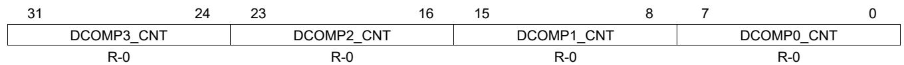

LEGEND: R/W = Read/Write; R = Read only; -*n* = value after reset

#### **Table 6-13. Digital Comparator Counter Status Register (DCOMPCNTSTAT) Register Field Descriptions**

| Bit   | Field      | Type | Reset | Description                                             |
|-------|------------|------|-------|---------------------------------------------------------|
| 31-24 | DCOMP3_CNT | R    | 0     | Current value of Digital Comparator 3 detection counter |
| 23-16 | DCOMP2_CNT | R    | 0     | Current value of Digital Comparator 2 detection counter |
| 15-8  | DCOMP1_CNT | R    | 0     | Current value of Digital Comparator 1 detection counter |
| 7-0   | DCOMP0_CNT | R    | 0     | Current value of Digital Comparator 0 detection counter |


# <span id="page-253-0"></span>*6.11.14 DPWM 0 Current Limit Control Register (DPWM0CLIM)*

Address 0x00030034

# **Figure 6-18. DPWM 0 Current Limit Control Register (DPWM0CLIM)**

<span id="page-253-1"></span>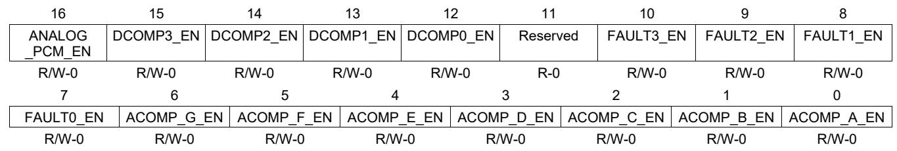

LEGEND: R/W = Read/Write; R = Read only; -*n* = value after reset

# **Table 6-14. DPWM 0 Current Limit Control Register (DPWM0CLIM) Register Field Descriptions**

<span id="page-253-2"></span>

| Bit | Field             | Type | Reset | Description                                                                                                                                                                                                    |
|-----|-------------------|------|-------|----------------------------------------------------------------------------------------------------------------------------------------------------------------------------------------------------------------|
| 16  | ANALOG_PCM<br>_EN | R/W  | 0     | Enables Analog Peak Current detection result for DPWM 0 Current Limit<br>0 = Analog Peak Current detection disabled for current limit (Default)<br>1 = Analog Peak Current detection enabled for current limit |
| 15  | DCOMP3_EN         | R/W  | 0     | Enables Digital Comparator 3 result for DPWM 0 Current Limit<br>0 = Digital Comparator 3 result disabled for current limit (Default)<br>1 = Digital Comparator 3 result enabled for current limit              |
| 14  | DCOMP2_EN         | R/W  | 0     | Enables Digital Comparator 2 result for DPWM 0 Current Limit<br>0 = Digital Comparator 2 result disabled for current limit (Default)<br>1 = Digital Comparator 2 result enabled for current limit              |
| 13  | DCOMP1_EN         | R/W  | 0     | Enables Digital Comparator 1 result for DPWM 0 Current Limit<br>0 = Digital Comparator 1 result disabled for current limit (Default)<br>1 = Digital Comparator 1 result enabled for current limit              |
| 12  | DCOMP0_EN         | R/W  | 0     | Enables Digital Comparator 0 result for DPWM 0 Current Limit<br>0 = Digital Comparator 0 result disabled for current limit (Default)<br>1 = Digital Comparator 0 result enabled for current limit              |
| 11  | Reserved          | R    | 0     |                                                                                                                                                                                                                |
| 10  | FAULT3_EN         | R/W  | 0     | Enables FAULT[3] pin for DPWM 0 Current Limit<br>0 = External Fault pin disabled for current limit (Default)<br>1 = External Fault pin enabled for current limit                                               |
| 9   | FAULT2_EN         | R/W  | 0     | Enables FAULT[2] pin for DPWM 0 Current Limit<br>0 = External Fault pin disabled for current limit (Default)<br>1 = External Fault pin enabled for current limit                                               |
| 8   | FAULT1_EN         | R/W  | 0     | Enables FAULT[1] pin for DPWM 0 Current Limit<br>0 = External Fault pin disabled for current limit (Default)<br>1 = External Fault pin enabled for current limit                                               |
| 7   | FAULT0_EN         | R/W  | 0     | Enables FAULT[0] pin for DPWM 0 Current Limit<br>0 = External Fault pin disabled for current limit (Default)<br>1 = External Fault pin enabled for current limit                                               |
| 6   | ACOMP_G_EN        | R/W  | 0     | Enables Analog Comparator G result for DPWM 0 Current Limit<br>0 = Analog Comparator result disabled for current limit (Default)<br>1 = Analog Comparator result enabled for current limit                     |
| 5   | ACOMP_F_EN        | R/W  | 0     | Enables Analog Comparator F result for DPWM 0 Current Limit<br>0 = Analog Comparator result disabled for current limit (Default)<br>1 = Analog Comparator result enabled for current limit                     |
| 4   | ACOMP_E_EN        | R/W  | 0     | Enables Analog Comparator E result for DPWM 0 Current Limit<br>0 = Analog Comparator result disabled for current limit (Default)<br>1 = Analog Comparator result enabled for current limit                     |


#### **Table 6-14. DPWM 0 Current Limit Control Register (DPWM0CLIM) Register Field Descriptions (continued)**

| Bit | Field      | Type | Reset | Description                                                                                                                                                                                |
|-----|------------|------|-------|--------------------------------------------------------------------------------------------------------------------------------------------------------------------------------------------|
| 3   | ACOMP_D_EN | R/W  | 0     | Enables Analog Comparator D result for DPWM 0 Current Limit<br>0 = Analog Comparator result disabled for current limit (Default)<br>1 = Analog Comparator result enabled for current limit |
| 2   | ACOMP_C_EN | R/W  | 0     | Enables Analog Comparator C result for DPWM 0 Current Limit<br>0 = Analog Comparator result disabled for current limit (Default)<br>1 = Analog Comparator result enabled for current limit |
| 1   | ACOMP_B_EN | R/W  | 0     | Enables Analog Comparator B result for DPWM 0 Current Limit<br>0 = Analog Comparator result disabled for current limit (Default)<br>1 = Analog Comparator result enabled for current limit |
| 0   | ACOMP_A_EN | R/W  | 0     | Enables Analog Comparator A result for DPWM 0 Current Limit<br>0 = Analog Comparator result disabled for current limit (Default)<br>1 = Analog Comparator result enabled for current limit |


# <span id="page-255-0"></span>*6.11.15 DPWM 0 Fault AB Detection Register (DPWM0FLTABDET)*

Address 0x00030038

#### **Figure 6-19. DPWM 0 Fault AB Detection Register (DPWM0FLTABDET)**

<span id="page-255-1"></span>

| 14        | 13         | 12         |            | 11         | 10         | 9          | 8          |  |
|-----------|------------|------------|------------|------------|------------|------------|------------|--|
| DCOMP3_EN | DCOMP2_EN  | DCOMP1_EN  |            | DCOMP0_EN  | FAULT3_EN  | FAULT2_EN  | FAULT1_EN  |  |
| R/W-0     | R/W-0      | R/W-0      |            | R/W-0      | R/W-0      | R/W-0      | R/W-0      |  |
| 7         | 6          | 5          | 4          | 3          | 2          | 1          | 0          |  |
| FAULT0_EN | ACOMP_G_EN | ACOMP_F_EN | ACOMP_E_EN | ACOMP_D_EN | ACOMP_C_EN | ACOMP_B_EN | ACOMP_A_EN |  |
| R/W-0     | R/W-0      | R/W-0      | R/W-0      | R/W-0      | R/W-0      | R/W-0      | R/W-0      |  |

LEGEND: R/W = Read/Write; R = Read only; -*n* = value after reset

# **Table 6-15. DPWM 0 Fault AB Detection Register (DPWM0FLTABDET) Register Field Descriptions**

<span id="page-255-2"></span>

| Bit | Field      | Type | Reset | Description |
|-----|------------|------|-------|-------------|
| 14  | DCOMP3_EN  | R/W  | 0     |             |
| 13  | DCOMP2_EN  | R/W  | 0     |             |
| 12  | DCOMP1_EN  | R/W  | 0     |             |
| 11  | DCOMP0_EN  | R/W  | 0     |             |
| 10  | FAULT3_EN  | R/W  | 0     |             |
| 9   | FAULT2_EN  | R/W  | 0     |             |
| 8   | FAULT1_EN  | R/W  | 0     |             |
| 7   | FAULT0_EN  | R/W  | 0     |             |
| 6   | ACOMP_G_EN | R/W  | 0     |             |
| 5   | ACOMP_F_EN | R/W  | 0     |             |
| 4   | ACOMP_E_EN | R/W  | 0     |             |
| 3   | ACOMP_D_EN | R/W  | 0     |             |
| 2   | ACOMP_C_EN | R/W  | 0     |             |
| 1   | ACOMP_B_EN | R/W  | 0     |             |
| 0   | ACOMP_A_EN | R/W  | 0     |             |


# <span id="page-256-0"></span>*6.11.16 DPWM 0 Fault Detection Register (DPWM0FAULTDET)*

Address 0x0003003C

**Figure 6-20. DPWM 0 Fault Detection Register (DPWM0FAULTDET)**

| 30<br>29           |                     | 28                  |                     | 27                  | 26                  | 25                  | 24                  |
|--------------------|---------------------|---------------------|---------------------|---------------------|---------------------|---------------------|---------------------|
| PWMB_DCOMP<br>3_EN | PWMB_DCOMP2<br>_EN  | PWMB_DCOMP1<br>_EN  |                     | PWMB_DCOMP0<br>_EN  | PWMB_FAULT3<br>_EN  | PWMB_FAULT2<br>_EN  | PWMB_FAULT1<br>_EN  |
| R/W-0              | R/W-0               | R/W-0               |                     | R/W-0               | R/W-0               | R/W-0               | R/W-0               |
| 23                 | 22                  | 21                  | 20                  | 19                  | 18                  | 17                  | 16                  |
| PWMB_<br>FAULT0_EN | PWMB_<br>ACOMP_G_EN | PWMB_<br>ACOMP_F_EN | PWMB_<br>ACOMP_E_EN | PWMB_<br>ACOMP_D_EN | PWMB_<br>ACOMP_C_EN | PWMB_<br>ACOMP_B_EN | PWMB_<br>ACOMP_A_EN |
| R/W-0              | R/W-0               | R/W-0               | R/W-0               | R/W-0               | R/W-0               | R/W-0               | R/W-0               |
|                    |                     |                     |                     |                     |                     |                     |                     |
| 15                 | 14                  | 13                  | 12                  | 11                  | 10                  | 9                   | 8                   |
| Reserved           | PWMA_<br>DCOMP3_EN  | PWMA_<br>DCOMP2_EN  | PWMA_<br>DCOMP1_EN  | PWMA_<br>DCOMP0_EN  | PWMA_<br>FAULT3_EN  | PWMA_<br>FAULT2_EN  | PWMA_<br>FAULT1_EN  |
| R/W-0              | R/W-0               | R/W-0               | R/W-0               | R/W-0               | R/W-0               | R/W-0               | R/W-0               |
| 7                  | 6                   | 5                   | 4                   | 3                   | 2                   | 1                   | 0                   |
| PWMA_<br>FAULT0_EN | PWMA_<br>ACOMP_G_EN | PWMA_<br>ACOMP_F_EN | PWMA_<br>ACOMP_E_EN | PWMA_<br>ACOMP_D_EN | PWMA_<br>ACOMP_C_EN | PWMA_<br>ACOMP_B_EN | PWMA_<br>ACOMP_A_EN |

**Table 6-16. DPWM 0 Fault Detection Register (DPWM0FAULTDET) Register Field Descriptions**

<span id="page-256-1"></span>

| Bit | Field               | Type | Reset | Description                                                                                                                                                                                            |  |  |  |  |  |
|-----|---------------------|------|-------|--------------------------------------------------------------------------------------------------------------------------------------------------------------------------------------------------------|--|--|--|--|--|
| 30  | PWMB_DCOMP3<br>_EN  | R/W  | 0     | Enables Digital Comparator 3 result for DPWM 0 PWM-B Fault Detection<br>0 = Digital Comparator 3 disabled for fault detection (Default)<br>1 = Digital Comparator 3 enabled for fault detection        |  |  |  |  |  |
| 29  | PWMB_DCOMP<br>2_EN  | R/W  | 0     | Enables Digital Comparator 2 result for DPWM 0 PWM-B Fault Detection<br>0 = Digital Comparator 2 disabled for fault detection (Default)<br>1 = Digital Comparator 2 enabled for fault detection        |  |  |  |  |  |
| 28  | PWMB_DCOMP1<br>_EN  | R/W  | 0     | Enables Digital Comparator 1 result for DPWM 0 PWM-B Fault Detection<br>0 = Digital Comparator 1 disabled for fault detection (Default)<br>1 = Digital Comparator 1 enabled for fault detection        |  |  |  |  |  |
| 27  | PWMB_DCOMP0<br>_EN  | R/W  | 0     | Enables Digital Comparator 0 result for DPWM 0 PWM-B Fault Detection<br>0 = Digital Comparator 0 disabled for fault detection (Default)<br>1 = Digital Comparator 0 enabled for fault detection        |  |  |  |  |  |
| 26  | PWMB_FAULT3<br>_EN  | R/W  | 0     | Enables FAULT[3] pin for DPWM 0 PWM-B Fault Detection<br>0 = External Fault pin disabled for fault detection (Default)<br>1 = External Fault pin enabled for fault detection                           |  |  |  |  |  |
| 25  | PWMB_FAULT2<br>_EN  | R/W  | 0     | Enables FAULT[2] pin for DPWM 0 PWM-B Fault Detection<br>0 = External Fault pin disabled for fault detection (Default)<br>1 = External Fault pin enabled for fault detection                           |  |  |  |  |  |
| 24  | PWMB_FAULT1<br>_EN  | R/W  | 0     | Enables FAULT[1] pin for DPWM 0 PWM-B Fault Detection<br>0 = External Fault pin disabled for fault detection (Default)<br>1 = External Fault pin enabled for fault detection                           |  |  |  |  |  |
| 23  | PWMB_FAULT0<br>_EN  | R/W  | 0     | Enables FAULT[0] pin for DPWM 0 PWM-B Fault Detection<br>0 = External Fault pin disabled for fault detection (Default)<br>1 = External Fault pin enabled for fault detection                           |  |  |  |  |  |
| 22  | PWMB_ACOMP<br>_G_EN | R/W  | 0     | Enables Analog Comparator G result for DPWM 0 PWM-B Fault detection<br>0 = Analog Comparator result disabled for fault detection (Default)<br>1 = Analog Comparator result enabled for fault detection |  |  |  |  |  |


# **Table 6-16. DPWM 0 Fault Detection Register (DPWM0FAULTDET) Register Field Descriptions (continued)**

| Bit | Field               | Type | Reset | Description                                                                                                                                                                                            |  |  |  |  |  |
|-----|---------------------|------|-------|--------------------------------------------------------------------------------------------------------------------------------------------------------------------------------------------------------|--|--|--|--|--|
| 21  | PWMB_ACOMP<br>_F_EN | R/W  | 0     | Enables Analog Comparator F result for DPWM 0 PWM-B Fault detection<br>0 = Analog Comparator result disabled for fault detection (Default)<br>1 = Analog Comparator result enabled for fault detection |  |  |  |  |  |
| 20  | PWMB_ACOM<br>P_E_EN | R/W  | 0     | Enables Analog Comparator E result for DPWM 0 PWM-B Fault detection<br>0 = Analog Comparator result disabled for fault detection (Default)<br>1 = Analog Comparator result enabled for fault detection |  |  |  |  |  |
| 19  | PWMB_ACOMP<br>_D_EN | R/W  | 0     | Enables Analog Comparator D result for DPWM 0 PWM-B Fault detection<br>0 = Analog Comparator result disabled for fault detection (Default)<br>1 = Analog Comparator result enabled for fault detection |  |  |  |  |  |
| 18  | PWMB_ACOMP<br>_C_EN | R/W  | 0     | Enables Analog Comparator C result for DPWM 0 PWM-B Fault detection<br>0 = Analog Comparator result disabled for fault detection (Default)<br>1 = Analog Comparator result enabled for fault detection |  |  |  |  |  |
| 17  | PWMB_ACOMP<br>_B_EN | R/W  | 0     | Enables Analog Comparator B result for DPWM 0 PWM-B Fault detection<br>0 = Analog Comparator result disabled for fault detection (Default)<br>1 = Analog Comparator result enabled for fault detection |  |  |  |  |  |
| 16  | PWMB_ACOMP<br>_A_EN | R/W  | 0     | Enables Analog Comparator A result for DPWM 0 PWM-B Fault detection<br>0 = Analog Comparator result disabled for fault detection (Default)<br>1 = Analog Comparator result enabled for fault detection |  |  |  |  |  |
| 15  | Reserved            | R    | 0     | Enables Analog Comparator A result for DPWM 0 PWM-B Fault detection<br>0 = Analog Comparator result disabled for fault detection (Default)<br>1 = Analog Comparator result enabled for fault detection |  |  |  |  |  |
| 14  | PWMA_DCOMP3<br>_EN  | R/W  | 0     | Enables Digital Comparator 3 result for DPWM 0 PWM-A Fault Detection<br>0 = Digital Comparator 3 disabled for fault detection (Default)<br>1 = Digital Comparator 3 enabled for fault detection        |  |  |  |  |  |
| 13  | PWMA_DCOMP<br>2_EN  | R/W  | 0     | Enables Digital Comparator 2 result for DPWM 0 PWM-A Fault Detection<br>0 = Digital Comparator 2 disabled for fault detection (Default)<br>1 = Digital Comparator 2 enabled for fault detection        |  |  |  |  |  |
| 12  | PWMA_DCOMP1<br>_EN  | R/W  | 0     | Enables Digital Comparator 1 result for DPWM 0 PWM-A Fault Detection<br>0 = Digital Comparator 1 disabled for fault detection (Default)<br>1 = Digital Comparator 1 enabled for fault detection        |  |  |  |  |  |
| 11  | PWMA_DCOMP0<br>_EN  | R/W  | 0     | Enables Digital Comparator 0 result for DPWM 0 PWM-A Fault Detection<br>0 = Digital Comparator 0 disabled for fault detection (Default)<br>1 = Digital Comparator 0 enabled for fault detection        |  |  |  |  |  |
| 10  | PWMA_FAULT3<br>_EN  | R/W  | 0     | Enables FAULT[3] pin for DPWM 0 PWM-A Fault Detection<br>0 = External Fault pin disabled for fault detection (Default)<br>1 = External Fault pin enabled for fault detection                           |  |  |  |  |  |
| 9   | PWMA_FAULT2<br>_EN  | R/W  | 0     | Enables FAULT[2] pin for DPWM 0 PWM-A Fault Detection<br>0 = External Fault pin disabled for fault detection (Default)<br>1 = External Fault pin enabled for fault detection                           |  |  |  |  |  |
| 8   | PWMA_FAULT1<br>_EN  | R/W  | 0     | Enables FAULT[1] pin for DPWM 0 PWM-A Fault Detection<br>0 = External Fault pin disabled for fault detection (Default)<br>1 = External Fault pin enabled for fault detection                           |  |  |  |  |  |
| 7   | PWMA_FAULT0<br>_EN  | R/W  | 0     | Enables FAULT[0] pin for DPWM 0 PWM-A Fault Detection<br>0 = External Fault pin disabled for fault detection (Default)<br>1 = External Fault pin enabled for fault detection                           |  |  |  |  |  |
| 6   | PWMA_ACOMP<br>_G_EN | R/W  | 0     | Enables Analog Comparator G result for DPWM 0 PWM-A Fault detection<br>0 = Analog Comparator result disabled for fault detection (Default)<br>1 = Analog Comparator result enabled for fault detection |  |  |  |  |  |


# **Table 6-16. DPWM 0 Fault Detection Register (DPWM0FAULTDET) Register Field Descriptions (continued)**

| Bit | Field               | Type     | Reset | Description                                                                                                                                                                                            |  |  |  |  |
|-----|---------------------|----------|-------|--------------------------------------------------------------------------------------------------------------------------------------------------------------------------------------------------------|--|--|--|--|
| 5   | PWMA_ACOMP<br>_F_EN | R/W<br>0 |       | Enables Analog Comparator F result for DPWM 0 PWM-A Fault detection<br>0 = Analog Comparator result disabled for fault detection (Default)<br>1 = Analog Comparator result enabled for fault detection |  |  |  |  |
| 4   | PWMA_ACOMP<br>_E_EN | R/W      | 0     | Enables Analog Comparator E result for DPWM 0 PWM-A Fault detection<br>0 = Analog Comparator result disabled for fault detection (Default)<br>1 = Analog Comparator result enabled for fault detection |  |  |  |  |
| 3   | PWMA_ACOMP<br>_D_EN | R/W      | 0     | Enables Analog Comparator D result for DPWM 0 PWM-A Fault detection<br>0 = Analog Comparator result disabled for fault detection (Default)<br>1 = Analog Comparator result enabled for fault detection |  |  |  |  |
| 2   | PWMA_ACOMP<br>_C_EN | R/W      | 0     | Enables Analog Comparator C result for DPWM 0 PWM-A Fault detection<br>0 = Analog Comparator result disabled for fault detection (Default)<br>1 = Analog Comparator result enabled for fault detection |  |  |  |  |
| 1   | PWMA_ACOMP<br>_B_EN | R/W      | 0     | Enables Analog Comparator B result for DPWM 0 PWM-A Fault detection<br>0 = Analog Comparator result disabled for fault detection (Default)<br>1 = Analog Comparator result enabled for fault detection |  |  |  |  |
| 0   | PWMA_ACOMP<br>_A_EN | R/W      | 0     | Enables Analog Comparator A result for DPWM 0 PWM-A Fault detection<br>0 = Analog Comparator result disabled for fault detection (Default)<br>1 = Analog Comparator result enabled for fault detection |  |  |  |  |


# <span id="page-259-0"></span>*6.11.17 DPWM 1 Current Limit Control Register (DPWM1CLIM)*

Address 0x00030044

# **Figure 6-21. DPWM 1 Current Limit Control Register (DPWM1CLIM)**

<span id="page-259-1"></span>

LEGEND: R/W = Read/Write; R = Read only; -*n* = value after reset

# **Table 6-17. DPWM 1 Current Limit Control Register (DPWM1CLIM) Register Field Descriptions**

<span id="page-259-2"></span>

| Bit | Field             | Type | Reset | Description                                                                                                                                                                                                    |  |  |  |  |
|-----|-------------------|------|-------|----------------------------------------------------------------------------------------------------------------------------------------------------------------------------------------------------------------|--|--|--|--|
| 16  | ANALOG_PCM<br>_EN | R/W  | 0     | Enables Analog Peak Current detection result for DPWM 2 Current Limit<br>0 = Analog Peak Current detection disabled for current limit (Default)<br>1 = Analog Peak Current detection enabled for current limit |  |  |  |  |
| 15  | DCOMP3_EN         | R/W  | 0     | Enables Digital Comparator 3 result for DPWM 2 Current Limit<br>0 = Digital Comparator 3 result disabled for current limit (Default)<br>1 = Digital Comparator 3 result enabled for current limit              |  |  |  |  |
| 14  | DCOMP2_EN         | R/W  | 0     | Enables Digital Comparator 2 result for DPWM 2 Current Limit<br>0 = Digital Comparator 2 result disabled for current limit (Default)<br>1 = Digital Comparator 2 result enabled for current limit              |  |  |  |  |
| 13  | DCOMP1_EN         | R/W  | 0     | Enables Digital Comparator 1 result for DPWM 2 Current Limit<br>0 = Digital Comparator 1 result disabled for current limit (Default)<br>1 = Digital Comparator 1 result enabled for current limit              |  |  |  |  |
| 12  | DCOMP0_EN         | R/W  | 0     | Enables Digital Comparator 0 result for DPWM 2 Current Limit<br>0 = Digital Comparator 0 result disabled for current limit (Default)<br>1 = Digital Comparator 0 result enabled for current limit              |  |  |  |  |
| 11  | Reserved          | R    | 0     |                                                                                                                                                                                                                |  |  |  |  |
| 10  | FAULT3_EN         | R/W  | 0     | Enables FAULT[3] pin for DPWM 2 Current Limit<br>0 = External Fault pin disabled for current limit (Default)<br>1 = External Fault pin enabled for current limit                                               |  |  |  |  |
| 9   | FAULT2_EN         | R/W  | 0     | Enables FAULT[2] pin for DPWM 2 Current Limit<br>0 = External Fault pin disabled for current limit (Default)<br>1 = External Fault pin enabled for current limit                                               |  |  |  |  |
| 8   | FAULT1_EN         | R/W  | 0     | Enables FAULT[1] pin for DPWM 2 Current Limit<br>0 = External Fault pin disabled for current limit (Default)<br>1 = External Fault pin enabled for current limit                                               |  |  |  |  |
| 7   | FAULT0_EN         | R/W  | 0     | Enables FAULT[0] pin for DPWM 2 Current Limit<br>0 = External Fault pin disabled for current limit (Default)<br>1 = External Fault pin enabled for current limit                                               |  |  |  |  |
| 6   | ACOMP_G_EN        | R/W  | 0     | Enables Analog Comparator G result for DPWM 2 Current Limit<br>0 = Analog Comparator result disabled for current limit (Default)<br>1 = Analog Comparator result enabled for current limit                     |  |  |  |  |
| 5   | ACOMP_F_EN        | R/W  | 0     | Enables Analog Comparator Fresult for DPWM 2 Current Limit<br>0 = Analog Comparator result disabled for current limit (Default)<br>1 = Analog Comparator result enabled for current limit                      |  |  |  |  |
| 4   | ACOMP_E_EN        | R/W  | 0     | Enables Analog Comparator E result for DPWM 2 Current Limit<br>0 = Analog Comparator result disabled for current limit (Default)<br>1 = Analog Comparator result enabled for current limit                     |  |  |  |  |


#### **Table 6-17. DPWM 1 Current Limit Control Register (DPWM1CLIM) Register Field Descriptions (continued)**

| Bit | Field      | Type | Reset | Description                                                                                                                                                                                |  |  |  |
|-----|------------|------|-------|--------------------------------------------------------------------------------------------------------------------------------------------------------------------------------------------|--|--|--|
| 3   | ACOMP_D_EN | R/W  | 0     | Enables Analog Comparator D result for DPWM 2 Current Limit<br>0 = Analog Comparator result disabled for current limit (Default)<br>1 = Analog Comparator result enabled for current limit |  |  |  |
| 2   | ACOMP_C_EN | R/W  | 0     | Enables Analog Comparator C result for DPWM 2 Current Limit<br>0 = Analog Comparator result disabled for current limit (Default)<br>1 = Analog Comparator result enabled for current limit |  |  |  |
| 1   | ACOMP_B_EN | R/W  | 0     | Enables Analog Comparator B result for DPWM 2 Current Limit<br>0 = Analog Comparator result disabled for current limit (Default)<br>1 = Analog Comparator result enabled for current limit |  |  |  |
| 0   | ACOMP_A_EN | R/W  | 0     | Enables Analog Comparator A result for DPWM 2 Current Limit<br>0 = Analog Comparator result disabled for current limit (Default)<br>1 = Analog Comparator result enabled for current limit |  |  |  |


# <span id="page-261-0"></span>*6.11.18 DPWM 1 Fault AB Detection Register (DPWM1FLTABDET)*

Address 0x00030048

### **Figure 6-22. DPWM 1 Fault AB Detection Register (DPWM1FLTABDET)**

<span id="page-261-1"></span>

| 14        | 13         | 12         |            | 11         | 10         | 9          | 8          |
|-----------|------------|------------|------------|------------|------------|------------|------------|
| DCOMP3_EN | DCOMP2_EN  | DCOMP1_EN  |            | DCOMP0_EN  | FAULT3_EN  | FAULT2_EN  | FAULT1_EN  |
| R/W-0     | R/W-0      | R/W-0      |            | R/W-0      | R/W-0      | R/W-0      | R/W-0      |
| 7         | 6          | 5          | 4          | 3          | 2          | 1          | 0          |
| FAULT0_EN | ACOMP_G_EN | ACOMP_F_EN | ACOMP_E_EN | ACOMP_D_EN | ACOMP_C_EN | ACOMP_B_EN | ACOMP_A_EN |
| R/W-0     | R/W-0      | R/W-0      | R/W-0      | R/W-0      | R/W-0      | R/W-0      | R/W-0      |

LEGEND: R/W = Read/Write; R = Read only; -*n* = value after reset

# **Table 6-18. DPWM 1 Fault AB Detection Register (DPWM1FLTABDET) Register Field Descriptions**

<span id="page-261-2"></span>

| Bit | Field      | Type | Reset | Description                                                                                                                                                                                       |
|-----|------------|------|-------|---------------------------------------------------------------------------------------------------------------------------------------------------------------------------------------------------|
| 14  | DCOMP3_EN  | R/W  | 0     | Enables Digital Comparator 3 result for DPWM 2 Current Limit<br>0 = Digital Comparator 3 result disabled for current limit (Default)<br>1 = Digital Comparator 3 result enabled for current limit |
| 13  | DCOMP2_EN  | R/W  | 0     | Enables Digital Comparator 2 result for DPWM 2 Current Limit<br>0 = Digital Comparator 2 result disabled for current limit (Default)<br>1 = Digital Comparator 2 result enabled for current limit |
| 12  | DCOMP1_EN  | R/W  | 0     | Enables Digital Comparator 1 result for DPWM 2 Current Limit<br>0 = Digital Comparator 1 result disabled for current limit (Default)<br>1 = Digital Comparator 1 result enabled for current limit |
| 11  | DCOMP0_EN  | R/W  | 0     | Enables Digital Comparator 0 result for DPWM 2 Current Limit<br>0 = Digital Comparator 0 result disabled for current limit (Default)<br>1 = Digital Comparator 0 result enabled for current limit |
| 10  | FAULT3_EN  | R/W  | 0     | Enables FAULT[3] pin for DPWM 2 Current Limit<br>0 = External Fault pin disabled for current limit (Default)<br>1 = External Fault pin enabled for current limit                                  |
| 9   | FAULT2_EN  | R/W  | 0     | Enables FAULT[2] pin for DPWM 2 Current Limit<br>0 = External Fault pin disabled for current limit (Default)<br>1 = External Fault pin enabled for current limit                                  |
| 8   | FAULT1_EN  | R/W  | 0     | Enables FAULT[1] pin for DPWM 2 Current Limit<br>0 = External Fault pin disabled for current limit (Default)<br>1 = External Fault pin enabled for current limit                                  |
| 7   | FAULT0_EN  | R/W  | 0     | Enables FAULT[0] pin for DPWM 2 Current Limit<br>0 = External Fault pin disabled for current limit (Default)<br>1 = External Fault pin enabled for current limit                                  |
| 6   | ACOMP_G_EN | R/W  | 0     | Enables Analog Comparator G result for DPWM 2 Current Limit<br>0 = Analog Comparator result disabled for current limit (Default)<br>1 = Analog Comparator result enabled for current limit        |
| 5   | ACOMP_F_EN | R/W  | 0     | Enables Analog Comparator Fresult for DPWM 2 Current Limit<br>0 = Analog Comparator result disabled for current limit (Default)<br>1 = Analog Comparator result enabled for current limit         |
| 4   | ACOMP_E_EN | R/W  | 0     | Enables Analog Comparator E result for DPWM 2 Current Limit<br>0 = Analog Comparator result disabled for current limit (Default)<br>1 = Analog Comparator result enabled for current limit        |
| 3   | ACOMP_D_EN | R/W  | 0     | Enables Analog Comparator D result for DPWM 2 Current Limit<br>0 = Analog Comparator result disabled for current limit (Default)<br>1 = Analog Comparator result enabled for current limit        |


#### **Table 6-18. DPWM 1 Fault AB Detection Register (DPWM1FLTABDET) Register Field Descriptions (continued)**

| Bit | Field      | Type | Reset | Description                                                                                                                                                                                |
|-----|------------|------|-------|--------------------------------------------------------------------------------------------------------------------------------------------------------------------------------------------|
| 2   | ACOMP_C_EN | R/W  | 0     | Enables Analog Comparator C result for DPWM 2 Current Limit<br>0 = Analog Comparator result disabled for current limit (Default)<br>1 = Analog Comparator result enabled for current limit |
| 1   | ACOMP_B_EN | R/W  | 0     | Enables Analog Comparator B result for DPWM 2 Current Limit<br>0 = Analog Comparator result disabled for current limit (Default)<br>1 = Analog Comparator result enabled for current limit |
| 0   | ACOMP_A_EN | R/W  | 0     | Enables Analog Comparator A result for DPWM 2 Current Limit<br>0 = Analog Comparator result disabled for current limit (Default)<br>1 = Analog Comparator result enabled for current limit |


# <span id="page-263-0"></span>*6.11.19 DPWM 1 Fault Detection Register (DPWM1FAULTDET)*

Address 0x0003004C

# **Figure 6-23. DPWM 1 Fault Detection Register (DPWM1FAULTDET)**

<span id="page-263-1"></span>

| 30                 | 29                  | 28                  |                     | 27                  |                     |       | 26                  |  | 25                  | 24                  |
|--------------------|---------------------|---------------------|---------------------|---------------------|---------------------|-------|---------------------|--|---------------------|---------------------|
| PWMB_DCOMP3<br>_EN | PWMB_DCOMP2<br>_EN  | PWMB_DCOMP<br>1_EN  |                     |                     | PWMB_DCOMP0<br>_EN  |       | PWMB_FAULT3<br>_EN  |  | PWMB_FAULT2<br>_EN  | PWMB_FAULT1<br>_EN  |
| R/W-0              | R/W-0               | R/W-0               |                     | R/W-0               |                     | R/W-0 |                     |  | R/W-0               | R/W-0               |
| 23                 | 22                  | 21                  |                     | 20                  | 19                  |       | 18                  |  | 17                  | 16                  |
| PWMB_<br>FAULT0_EN | PWMB_<br>ACOMP_G_EN | PWMB_<br>ACOMP_F_EN |                     | PWMB_<br>ACOMP_E_EN | PWMB_<br>ACOMP_D_EN |       | PWMB_<br>ACOMP_C_EN |  | PWMB_<br>ACOMP_B_EN | PWMB_A<br>COMP_A_EN |
| R/W-0              | R/W-0               | R/W-0               |                     | R/W-0               | R/W-0               |       | R/W-0               |  | R/W-0               | R/W-0               |
| 15                 | 14<br>13            |                     |                     | 12                  |                     |       | 10                  |  | 9                   | 8                   |
| Reserved           | PWMA_<br>DCOMP3_EN  | PWMA_<br>DCOMP2_EN  |                     | PWMA_<br>DCOMP1_EN  | PWMA_<br>DCOMP0_EN  |       | PWMA_<br>FAULT3_EN  |  | PWMA_<br>FAULT2_EN  | PWMA_<br>FAULT1_EN  |
| R/W-0              | R/W-0               | R/W-0               |                     | R/W-0               | R/W-0               |       | R/W-0               |  | R/W-0               | R/W-0               |
| 7                  | 6                   | 5                   |                     | 4<br>3              |                     |       | 2                   |  | 1                   | 0                   |
| PWMA_<br>FAULT0_EN | PWMA_<br>ACOMP_G_EN | PWMA_<br>ACOMP_F_EN | PWMA_<br>ACOMP_E_EN |                     | PWMA_<br>ACOMP_D_EN |       | PWMA_<br>ACOMP_C_EN |  | PWMA_<br>ACOMP_B_EN | PWMA_<br>ACOMP_A_EN |
| R/W-0              | R/W-0               | R/W-0               |                     | R/W-0               | R/W-0               |       | R/W-0               |  | R/W-0               | R/W-0               |

**Table 6-19. DPWM 1 Fault Detection Register (DPWM1FAULTDET) Register Field Descriptions**

<span id="page-263-2"></span>

| Bit | Field               | Type | Reset | Description                                                                                                                                                                                            |
|-----|---------------------|------|-------|--------------------------------------------------------------------------------------------------------------------------------------------------------------------------------------------------------|
| 30  | PWMB_DCOMP3<br>_EN  | R/W  | 0     | Enables Digital Comparator 3 result for DPWM 0 PWM-B Fault Detection<br>0 = Digital Comparator 3 disabled for fault detection (Default)<br>1 = Digital Comparator 3 enabled for fault detection        |
| 29  | PWMB_DCOMP2<br>_EN  | R/W  | 0     | Enables Digital Comparator 2 result for DPWM 0 PWM-B Fault Detection<br>0 = Digital Comparator 2 disabled for fault detection (Default)<br>1 = Digital Comparator 2 enabled for fault detection        |
| 28  | PWMB_DCOMP1<br>_EN  | R/W  | 0     | Enables Digital Comparator 1 result for DPWM 0 PWM-B Fault Detection<br>0 = Digital Comparator 1 disabled for fault detection (Default)<br>1 = Digital Comparator 1 enabled for fault detection        |
| 27  | PWMB_DCOMP0<br>_EN  | R/W  | 0     | Enables Digital Comparator 0 result for DPWM 0 PWM-B Fault Detection<br>0 = Digital Comparator 0 disabled for fault detection (Default)<br>1 = Digital Comparator 0 enabled for fault detection        |
| 26  | PWMB_FAULT3<br>_EN  | R/W  | 0     | Enables FAULT[3] pin for DPWM 0 PWM-B Fault Detection<br>0 = External Fault pin disabled for fault detection (Default)<br>1 = External Fault pin enabled for fault detection                           |
| 25  | PWMB_FAULT2<br>_EN  | R/W  | 0     | Enables FAULT[2] pin for DPWM 0 PWM-B Fault Detection<br>0 = External Fault pin disabled for fault detection (Default)<br>1 = External Fault pin enabled for fault detection                           |
| 24  | PWMB_FAULT1<br>_EN  | R/W  | 0     | Enables FAULT[1] pin for DPWM 0 PWM-B Fault Detection<br>0 = External Fault pin disabled for fault detection (Default)<br>1 = External Fault pin enabled for fault detection                           |
| 23  | PWMB_FAULT0<br>_EN  | R/W  | 0     | Enables FAULT[0] pin for DPWM 0 PWM-B Fault Detection<br>0 = External Fault pin disabled for fault detection (Default)<br>1 = External Fault pin enabled for fault detection                           |
| 22  | PWMB_ACOMP<br>_G_EN | R/W  | 0     | Enables Analog Comparator G result for DPWM 0 PWM-B Fault detection<br>0 = Analog Comparator result disabled for fault detection (Default)<br>1 = Analog Comparator result enabled for fault detection |


# **Table 6-19. DPWM 1 Fault Detection Register (DPWM1FAULTDET) Register Field Descriptions (continued)**

| Bit | Field               | Type | Reset | Description                                                                                                                                                                                            |  |  |  |
|-----|---------------------|------|-------|--------------------------------------------------------------------------------------------------------------------------------------------------------------------------------------------------------|--|--|--|
| 21  | PWMB_ACOMP<br>_F_EN | R/W  | 0     | Enables Analog Comparator F result for DPWM 0 PWM-B Fault detection<br>0 = Analog Comparator result disabled for fault detection (Default)<br>1 = Analog Comparator result enabled for fault detection |  |  |  |
| 20  | PWMB_ACOMP<br>_E_EN | R/W  | 0     | Enables Analog Comparator E result for DPWM 0 PWM-B Fault detection<br>0 = Analog Comparator result disabled for fault detection (Default)<br>1 = Analog Comparator result enabled for fault detection |  |  |  |
| 19  | PWMB_ACOMP<br>_D_EN | R/W  | 0     | Enables Analog Comparator D result for DPWM 0 PWM-B Fault detection<br>0 = Analog Comparator result disabled for fault detection (Default)<br>1 = Analog Comparator result enabled for fault detection |  |  |  |
| 18  | PWMB_ACOMP<br>_C_EN | R/W  | 0     | Enables Analog Comparator C result for DPWM 0 PWM-B Fault detection<br>0 = Analog Comparator result disabled for fault detection (Default)<br>1 = Analog Comparator result enabled for fault detection |  |  |  |
| 17  | PWMB_ACOMP<br>_B_EN | R/W  | 0     | Enables Analog Comparator B result for DPWM 0 PWM-B Fault detection<br>0 = Analog Comparator result disabled for fault detection (Default)<br>1 = Analog Comparator result enabled for fault detection |  |  |  |
| 16  | PWMB_ACOMP<br>_A_EN | R/W  | 0     | Enables Analog Comparator A result for DPWM 0 PWM-B Fault detection<br>0 = Analog Comparator result disabled for fault detection (Default)<br>1 = Analog Comparator result enabled for fault detection |  |  |  |
| 15  | Reserved            | R    | 0     | Enables Analog Comparator A result for DPWM 0 PWM-B Fault detection<br>0 = Analog Comparator result disabled for fault detection (Default)<br>1 = Analog Comparator result enabled for fault detection |  |  |  |
| 14  | PWMA_DCOMP3<br>_EN  | R/W  | 0     | Enables Digital Comparator 3 result for DPWM 0 PWM-A Fault Detection<br>0 = Digital Comparator 3 disabled for fault detection (Default)<br>1 = Digital Comparator 3 enabled for fault detection        |  |  |  |
| 13  | PWMA_DCOMP2<br>_EN  | R/W  | 0     | Enables Digital Comparator 2 result for DPWM 0 PWM-A Fault Detection<br>0 = Digital Comparator 2 disabled for fault detection (Default)<br>1 = Digital Comparator 2 enabled for fault detection        |  |  |  |
| 12  | PWMA_DCOMP1<br>_EN  | R/W  | 0     | Enables Digital Comparator 1 result for DPWM 0 PWM-A Fault Detection<br>0 = Digital Comparator 1 disabled for fault detection (Default)<br>1 = Digital Comparator 1 enabled for fault detection        |  |  |  |
| 11  | PWMA_DCOMP0<br>_EN  | R/W  | 0     | Enables Digital Comparator 0 result for DPWM 0 PWM-A Fault Detection<br>0 = Digital Comparator 0 disabled for fault detection (Default)<br>1 = Digital Comparator 0 enabled for fault detection        |  |  |  |
| 10  | PWMA_FAULT3<br>_EN  | R/W  | 0     | Enables FAULT[3] pin for DPWM 0 PWM-A Fault Detection<br>0 = External Fault pin disabled for fault detection (Default)<br>1 = External Fault pin enabled for fault detection                           |  |  |  |
| 9   | PWMA_FAULT2<br>_EN  | R/W  | 0     | Enables FAULT[2] pin for DPWM 0 PWM-A Fault Detection<br>0 = External Fault pin disabled for fault detection (Default)<br>1 = External Fault pin enabled for fault detection                           |  |  |  |
| 8   | PWMA_FAULT1<br>_EN  | R/W  | 0     | Enables FAULT[1] pin for DPWM 0 PWM-A Fault Detection<br>0 = External Fault pin disabled for fault detection (Default)<br>1 = External Fault pin enabled for fault detection                           |  |  |  |
| 7   | PWMA_FAULT0<br>_EN  | R/W  | 0     | Enables FAULT[0] pin for DPWM 0 PWM-A Fault Detection<br>0 = External Fault pin disabled for fault detection (Default)<br>1 = External Fault pin enabled for fault detection                           |  |  |  |
| 6   | PWMA_ACOMP<br>_G_EN | R/W  | 0     | Enables Analog Comparator G result for DPWM 0 PWM-A Fault detection<br>0 = Analog Comparator result disabled for fault detection (Default)<br>1 = Analog Comparator result enabled for fault detection |  |  |  |


# **Table 6-19. DPWM 1 Fault Detection Register (DPWM1FAULTDET) Register Field Descriptions (continued)**

| Bit | Field               | Type | Reset | Description                                                                                                                                                                                            |
|-----|---------------------|------|-------|--------------------------------------------------------------------------------------------------------------------------------------------------------------------------------------------------------|
| 5   | PWMA_ACOMP<br>_F_EN | R/W  | 0     | Enables Analog Comparator F result for DPWM 0 PWM-A Fault detection<br>0 = Analog Comparator result disabled for fault detection (Default)<br>1 = Analog Comparator result enabled for fault detection |
| 4   | PWMA_ACOMP<br>_E_EN | R/W  | 0     | Enables Analog Comparator E result for DPWM 0 PWM-A Fault detection<br>0 = Analog Comparator result disabled for fault detection (Default)<br>1 = Analog Comparator result enabled for fault detection |
| 3   | PWMA_ACOMP<br>_D_EN | R/W  | 0     | Enables Analog Comparator D result for DPWM 0 PWM-A Fault detection<br>0 = Analog Comparator result disabled for fault detection (Default)<br>1 = Analog Comparator result enabled for fault detection |
| 2   | PWMA_ACOMP<br>_C_EN | R/W  | 0     | Enables Analog Comparator C result for DPWM 0 PWM-A Fault detection<br>0 = Analog Comparator result disabled for fault detection (Default)<br>1 = Analog Comparator result enabled for fault detection |
| 1   | PWMA_ACOMP<br>_B_EN | R/W  | 0     | Enables Analog Comparator B result for DPWM 0 PWM-A Fault detection<br>0 = Analog Comparator result disabled for fault detection (Default)<br>1 = Analog Comparator result enabled for fault detection |
| 0   | PWMA_ACOMP<br>_A_EN | R/W  | 0     | Enables Analog Comparator A result for DPWM 0 PWM-A Fault detection<br>0 = Analog Comparator result disabled for fault detection (Default)<br>1 = Analog Comparator result enabled for fault detection |


# <span id="page-266-0"></span>*6.11.20 DPWM 2 Current Limit Control Register (DPWM2CLIM)*

Address 0x00030054

#### **Figure 6-24. DPWM 2 Current Limit Control Register (DPWM2CLIM)**

<span id="page-266-1"></span>

| 16                | 15         | 14         | 13         | 12        | 11         | 10         | 9          | 8          |
|-------------------|------------|------------|------------|-----------|------------|------------|------------|------------|
| ANALOG_<br>PCM_EN | DCOMP3_EN  | DCOMP2_EN  | DCOMP1_EN  | DCOMP0_EN | Reserved   | FAULT3_EN  | FAULT2_EN  | FAULT1_EN  |
| R/W-0             | R/W-0      | R/W-0      | R/W-0      | R/W-0     | R-0        | R/W-0      | R/W-0      | R/W-0      |
| 7                 | 6          | 5          | 4          |           | 3          | 2          | 1          | 0          |
| FAULT0_EN         | ACOMP_G_EN | ACOMP_F_EN | ACOMP_E_EN |           | ACOMP_D_EN | ACOMP_C_EN | ACOMP_B_EN | ACOMP_A_EN |
| R/W-0             | R/W-0      | R/W-0      | R/W-0      |           | R/W-0      | R/W-0      | R/W-0      | R/W-0      |

LEGEND: R/W = Read/Write; R = Read only; -*n* = value after reset

# **Table 6-20. DPWM 2 Current Limit Control Register (DPWM2CLIM) Register Field Descriptions**

<span id="page-266-2"></span>

| Bit | Field             | Type | Reset | Description                                                                                                                                                                                                    |
|-----|-------------------|------|-------|----------------------------------------------------------------------------------------------------------------------------------------------------------------------------------------------------------------|
| 16  | ANALOG_PCM<br>_EN | R/W  | 0     | Enables Analog Peak Current detection result for DPWM 2 Current Limit<br>0 = Analog Peak Current detection disabled for current limit (Default)<br>1 = Analog Peak Current detection enabled for current limit |
| 15  | DCOMP3_EN         | R/W  | 0     | Enables Digital Comparator 3 result for DPWM 2 Current Limit<br>0 = Digital Comparator 3 result disabled for current limit (Default)<br>1 = Digital Comparator 3 result enabled for current limit              |
| 14  | DCOMP2_EN         | R/W  | 0     | Enables Digital Comparator 2 result for DPWM 2 Current Limit<br>0 = Digital Comparator 2 result disabled for current limit (Default)<br>1 = Digital Comparator 2 result enabled for current limit              |
| 13  | DCOMP1_EN         | R/W  | 0     | Enables Digital Comparator 1 result for DPWM 2 Current Limit<br>0 = Digital Comparator 1 result disabled for current limit (Default)<br>1 = Digital Comparator 1 result enabled for current limit              |
| 12  | DCOMP0_EN         | R/W  | 0     | Enables Digital Comparator 0 result for DPWM 2 Current Limit<br>0 = Digital Comparator 0 result disabled for current limit (Default)<br>1 = Digital Comparator 0 result enabled for current limit              |
| 11  | Reserved          | R    | 0     |                                                                                                                                                                                                                |
| 10  | FAULT3_EN         | R/W  | 0     | Enables FAULT[3] pin for DPWM 2 Current Limit<br>0 = External Fault pin disabled for current limit (Default)<br>1 = External Fault pin enabled for current limit                                               |
| 9   | FAULT2_EN         | R/W  | 0     | Enables FAULT[2] pin for DPWM 2 Current Limit<br>0 = External Fault pin disabled for current limit (Default)<br>1 = External Fault pin enabled for current limit                                               |
| 8   | FAULT1_EN         | R/W  | 0     | Enables FAULT[1] pin for DPWM 2 Current Limit<br>0 = External Fault pin disabled for current limit (Default)<br>1 = External Fault pin enabled for current limit                                               |
| 7   | FAULT0_EN         | R/W  | 0     | Enables FAULT[0] pin for DPWM 2 Current Limit<br>0 = External Fault pin disabled for current limit (Default)<br>1 = External Fault pin enabled for current limit                                               |
| 6   | ACOMP_G_EN        | R/W  | 0     | Enables Analog Comparator G result for DPWM 2 Current Limit<br>0 = Analog Comparator result disabled for current limit (Default)<br>1 = Analog Comparator result enabled for current limit                     |
| 5   | ACOMP_F_EN        | R/W  | 0     | Enables Analog Comparator Fresult for DPWM 2 Current Limit<br>0 = Analog Comparator result disabled for current limit (Default)<br>1 = Analog Comparator result enabled for current limit                      |
| 4   | ACOMP_E_EN        | R/W  | 0     | Enables Analog Comparator E result for DPWM 2 Current Limit<br>0 = Analog Comparator result disabled for current limit (Default)<br>1 = Analog Comparator result enabled for current limit                     |


### **Table 6-20. DPWM 2 Current Limit Control Register (DPWM2CLIM) Register Field Descriptions (continued)**

| Bit | Field      | Type | Reset | Description                                                                                                                                                                                |
|-----|------------|------|-------|--------------------------------------------------------------------------------------------------------------------------------------------------------------------------------------------|
| 3   | ACOMP_D_EN | R/W  | 0     | Enables Analog Comparator D result for DPWM 2 Current Limit<br>0 = Analog Comparator result disabled for current limit (Default)<br>1 = Analog Comparator result enabled for current limit |
| 2   | ACOMP_C_EN | R/W  | 0     | Enables Analog Comparator C result for DPWM 2 Current Limit<br>0 = Analog Comparator result disabled for current limit (Default)<br>1 = Analog Comparator result enabled for current limit |
| 1   | ACOMP_B_EN | R/W  | 0     | Enables Analog Comparator B result for DPWM 2 Current Limit<br>0 = Analog Comparator result disabled for current limit (Default)<br>1 = Analog Comparator result enabled for current limit |
| 0   | ACOMP_A_EN | R/W  | 0     | Enables Analog Comparator A result for DPWM 2 Current Limit<br>0 = Analog Comparator result disabled for current limit (Default)<br>1 = Analog Comparator result enabled for current limit |


# <span id="page-268-0"></span>*6.11.21 DPWM 2 Fault AB Detection Register (DPWM2FLTABDET)*

Address 0x00030058

#### **Figure 6-25. DPWM 2 Fault AB Detection Register (DPWM2FLTABDET)**

| 14        | 13         | 12         |            | 11         | 10         | 9          | 8          |
|-----------|------------|------------|------------|------------|------------|------------|------------|
| DCOMP3_EN | DCOMP2_EN  | DCOMP1_EN  |            | DCOMP0_EN  | FAULT3_EN  | FAULT2_EN  | FAULT1_EN  |
| R/W-0     | R/W-0      | R/W-0      |            | R/W-0      | R/W-0      | R/W-0      | R/W-0      |
| 7         | 6          | 5          | 4          | 3          | 2          | 1          | 0          |
| FAULT0_EN | ACOMP_G_EN | ACOMP_F_EN | ACOMP_E_EN | ACOMP_D_EN | ACOMP_C_EN | ACOMP_B_EN | ACOMP_A_EN |
| R/W-0     | R/W-0      | R/W-0      | R/W-0      | R/W-0      | R/W-0      | R/W-0      | R/W-0      |

LEGEND: R/W = Read/Write; R = Read only; -*n* = value after reset

# **Table 6-21. DPWM 2 Fault AB Detection Register (DPWM2FLTABDET) Register Field Descriptions**

<span id="page-268-1"></span>

| Bit | Field      | Type | Reset | Description                                                                                                                                                                                               |
|-----|------------|------|-------|-----------------------------------------------------------------------------------------------------------------------------------------------------------------------------------------------------------|
| 14  | DCOMP3_EN  | R/W  | 0     | Enables Digital Comparator 3 result for DPWM 2 Fault AB Detection<br>0 = Digital Comparator 3 disabled for Fault AB detection (Default)<br>1 = Digital Comparator 3 enabled for Fault AB detection        |
| 13  | DCOMP2_EN  | R/W  | 0     | Enables Digital Comparator 2 result for DPWM 2 Fault AB Detection<br>0 = Digital Comparator 2 disabled for Fault AB detection (Default)<br>1 = Digital Comparator 2 enabled for Fault AB detection        |
| 12  | DCOMP1_EN  | R/W  | 0     | Enables Digital Comparator 1 result for DPWM 2 Fault AB Detection<br>0 = Digital Comparator 1 disabled for Fault AB detection (Default)<br>1 = Digital Comparator 1 enabled for Fault AB detection        |
| 11  | DCOMP0_EN  | R/W  | 0     | Enables Digital Comparator 0 result for DPWM 2 Fault AB Detection<br>0 = Digital Comparator 0 disabled for Fault AB detection (Default)<br>1 = Digital Comparator 0 enabled for Fault AB detection        |
| 10  | FAULT3_EN  | R/W  | 0     | Enables FAULT[3] pin for DPWM 2 Fault AB detection<br>0 = External Fault pin disabled for Fault AB detection (Default)<br>1 = External Fault pin enabled for Fault AB detection                           |
| 9   | FAULT2_EN  | R/W  | 0     | Enables FAULT[2] pin for DPWM 2 Fault AB detection<br>0 = External Fault pin disabled for Fault AB detection (Default)<br>1 = External Fault pin enabled for Fault AB detection                           |
| 8   | FAULT1_EN  | R/W  | 0     | Enables FAULT[1] pin for DPWM 2 Fault AB detection<br>0 = External Fault pin disabled for Fault AB detection (Default)<br>1 = External Fault pin enabled for Fault AB detection                           |
| 7   | FAULT0_EN  | R/W  | 0     | Enables FAULT[0] pin for DPWM 2 Fault AB detection<br>0 = External Fault pin disabled for Fault AB detection (Default)<br>1 = External Fault pin enabled for Fault AB detection                           |
| 6   | ACOMP_G_EN | R/W  | 0     | Enables Analog Comparator G result for DPWM 2 Fault AB detection<br>0 = Analog Comparator result disabled for Fault AB detection (Default)<br>1 = Analog Comparator result enabled for Fault AB detection |
| 5   | ACOMP_F_EN | R/W  | 0     | Enables Analog Comparator F result for DPWM 2 Fault AB detection<br>0 = Analog Comparator result disabled for Fault AB detection (Default)<br>1 = Analog Comparator result enabled for Fault AB detection |
| 4   | ACOMP_E_EN | R/W  | 0     | Enables Analog Comparator E result for DPWM 2 Fault AB detection<br>0 = Analog Comparator result disabled for Fault AB detection (Default)<br>1 = Analog Comparator result enabled for Fault AB detection |
| 3   | ACOMP_D_EN | R/W  | 0     | Enables Analog Comparator D result for DPWM 2 Fault AB detection<br>0 = Analog Comparator result disabled for Fault AB detection (Default)<br>1 = Analog Comparator result enabled for Fault AB detection |


### **Table 6-21. DPWM 2 Fault AB Detection Register (DPWM2FLTABDET) Register Field Descriptions (continued)**

| Bit | Field      | Type | Reset | Description                                                                                                                                                                                               |
|-----|------------|------|-------|-----------------------------------------------------------------------------------------------------------------------------------------------------------------------------------------------------------|
| 2   | ACOMP_C_EN | R/W  | 0     | Enables Analog Comparator C result for DPWM 2 Fault AB detection<br>0 = Analog Comparator result disabled for Fault AB detection (Default)<br>1 = Analog Comparator result enabled for Fault AB detection |
| 1   | ACOMP_B_EN | R/W  | 0     | Enables Analog Comparator B result for DPWM 2 Fault AB detection<br>0 = Analog Comparator result disabled for Fault AB detection (Default)<br>1 = Analog Comparator result enabled for Fault AB detection |
| 0   | ACOMP_A_EN | R/W  | 0     | Enables Analog Comparator A result for DPWM 2 Fault AB detection<br>0 = Analog Comparator result disabled for Fault AB detection (Default)<br>1 = Analog Comparator result enabled for Fault AB detection |


# <span id="page-270-0"></span>*6.11.22 DPWM 2 Fault Detection Register (DPWM2FAULTDET)*

DPWM 2 Fault Detection Register (DPWM2FAULTDET)

# **Figure 6-26. DPWM 2 Fault Detection Register (DPWM2FAULTDET)**

<span id="page-270-1"></span>

| 30                 | 29                  | 28                  |                     |                    | 27                  |  | 26                  | 25                  | 24                  |
|--------------------|---------------------|---------------------|---------------------|--------------------|---------------------|--|---------------------|---------------------|---------------------|
| PWMB_DCOMP3<br>_EN | PWMB_DCOMP<br>2_EN  | PWMB_DCOMP1<br>_EN  |                     | PWMB_DCOMP0<br>_EN |                     |  | PWMB_FAULT3<br>_EN  | PWMB_FAULT2<br>_EN  | PWMB_FAULT1<br>_EN  |
| R/W-0              | R/W-0               | R/W-0               |                     | R/W-0              |                     |  | R/W-0               | R/W-0               | R/W-0               |
| 23                 | 22                  | 21                  | 20                  |                    | 19                  |  | 18                  | 17                  | 16                  |
| PWMB_<br>FAULT0_EN | PWMB_<br>ACOMP_G_EN | PWMB_<br>ACOMP_F_EN | PWMB_<br>ACOMP_E_EN |                    | PWMB_<br>ACOMP_D_EN |  | PWMB_<br>ACOMP_C_EN | PWMB_<br>ACOMP_B_EN | PWMB_<br>ACOMP_A_EN |
| R/W-0              | R/W-0               | R/W-0               | R/W-0               |                    | R/W-0               |  | R/W-0               | R/W-0               | R/W-0               |
| 15                 | 14                  | 13                  | 12                  |                    | 11                  |  | 10                  | 9                   | 8                   |
| Reserved           | PWMA_<br>DCOMP3_EN  | PWMA_<br>DCOMP2_EN  | PWMA_<br>DCOMP1_EN  |                    | PWMA_<br>DCOMP0_EN  |  | PWMA_<br>FAULT3_EN  | PWMA_<br>FAULT2_EN  | PWMA_<br>FAULT1_EN  |
| R-0                | R/W-0               | R/W-0               | R/W-0               |                    | R/W-0               |  | R/W-0               | R/W-0               | R/W-0               |
| 7                  | 6                   | 5                   | 4                   |                    | 3                   |  | 2                   | 1                   | 0                   |
| PWMA_<br>FAULT0_EN | PWMA_<br>ACOMP_G_EN | PWMA_<br>ACOMP_F_EN | PWMA_<br>ACOMP_E_EN |                    | PWMA_<br>ACOMP_D_EN |  | PWMA_<br>ACOMP_C_EN | PWMA_<br>ACOMP_B_EN | PWMA_<br>ACOMP_A_EN |
| R/W-0              | R/W-0               | R/W-0               | R/W-0               |                    | R/W-0               |  | R/W-0               | R/W-0               | R/W-0               |

**Table 6-22. DPWM 2 Fault Detection Register (DPWM2FAULTDET) Register Field Descriptions**

<span id="page-270-2"></span>

| Bit | Field               | Type | Reset | Description                                                                                                                                                                                            |
|-----|---------------------|------|-------|--------------------------------------------------------------------------------------------------------------------------------------------------------------------------------------------------------|
| 30  | PWMB_DCOMP3<br>_EN  | R/W  | 0     | Enables Digital Comparator 3 result for DPWM 2 PWM-B Fault Detection<br>0 = Digital Comparator 3 disabled for fault detection (Default)<br>1 = Digital Comparator 3 enabled for fault detection        |
| 29  | PWMB_DCOMP2<br>_EN  | R/W  | 0     | Enables Digital Comparator 2 result for DPWM 2 PWM-B Fault Detection<br>0 = Digital Comparator 2 disabled for fault detection (Default)<br>1 = Digital Comparator 2 enabled for fault detection        |
| 28  | PWMB_DCOMP1<br>_EN  | R/W  | 0     | Enables Digital Comparator 1 result for DPWM 2 PWM-B Fault Detection<br>0 = Digital Comparator 1 disabled for fault detection (Default)<br>1 = Digital Comparator 1 enabled for fault detection        |
| 27  | PWMB_DCOMP0<br>_EN  | R/W  | 0     | Enables Digital Comparator 0 result for DPWM 2 PWM-B Fault Detection<br>0 = Digital Comparator 0 disabled for fault detection (Default)<br>1 = Digital Comparator 0 enabled for fault detection        |
| 26  | PWMB_FAULT3<br>_EN  | R/W  | 0     | Enables FAULT[3] pin for DPWM 2 PWM-B Fault Detection<br>0 = External Fault pin disabled for fault detection (Default)<br>1 = External Fault pin enabled for fault detection                           |
| 25  | PWMB_FAULT2<br>_EN  | R/W  | 0     | Enables FAULT[2] pin for DPWM 2 PWM-B Fault Detection<br>0 = External Fault pin disabled for fault detection (Default)<br>1 = External Fault pin enabled for fault detection                           |
| 24  | PWMB_FAULT1<br>_EN  | R/W  | 0     | Enables FAULT[1] pin for DPWM 2 PWM-B Fault Detection<br>0 = External Fault pin disabled for fault detection (Default)<br>1 = External Fault pin enabled for fault detection                           |
| 23  | PWMB_FAULT0<br>_EN  | R/W  | 0     | Enables FAULT[0] pin for DPWM 2 PWM-B Fault Detection<br>0 = External Fault pin disabled for fault detection (Default)<br>1 = External Fault pin enabled for fault detection                           |
| 22  | PWMB_ACOMP<br>_G_EN | R/W  | 0     | Enables Analog Comparator G result for DPWM 2 PWM-B Fault detection<br>0 = Analog Comparator result disabled for fault detection (Default)<br>1 = Analog Comparator result enabled for fault detection |


# **Table 6-22. DPWM 2 Fault Detection Register (DPWM2FAULTDET) Register Field Descriptions (continued)**

| Bit | Field               | Type | Reset | Description                                                                                                                                                                                            |
|-----|---------------------|------|-------|--------------------------------------------------------------------------------------------------------------------------------------------------------------------------------------------------------|
| 21  | PWMB_ACOMP<br>_F_EN | R/W  | 0     | Enables Analog Comparator F result for DPWM 2 PWM-B Fault detection<br>0 = Analog Comparator result disabled for fault detection (Default)<br>1 = Analog Comparator result enabled for fault detection |
| 20  | PWMB_ACOMP<br>_E_EN | R/W  | 0     | Enables Analog Comparator E result for DPWM 2 PWM-B Fault detection<br>0 = Analog Comparator result disabled for fault detection (Default)<br>1 = Analog Comparator result enabled for fault detection |
| 19  | PWMB_ACOMP<br>_D_EN | R/W  | 0     | Enables Analog Comparator D result for DPWM 2 PWM-B Fault detection<br>0 = Analog Comparator result disabled for fault detection (Default)<br>1 = Analog Comparator result enabled for fault detection |
| 18  | PWMB_ACOMP<br>_C_EN | R/W  | 0     | Enables Analog Comparator C result for DPWM 2 PWM-B Fault detection<br>0 = Analog Comparator result disabled for fault detection (Default)<br>1 = Analog Comparator result enabled for fault detection |
| 17  | PWMB_ACOMP<br>_B_EN | R/W  | 0     | Enables Analog Comparator B result for DPWM 2 PWM-B Fault detection<br>0 = Analog Comparator result disabled for fault detection (Default)<br>1 = Analog Comparator result enabled for fault detection |
| 16  | PWMB_ACOMP<br>_A_EN | R/W  | 0     | Enables Analog Comparator A result for DPWM 2 PWM-B Fault detection<br>0 = Analog Comparator result disabled for fault detection (Default)<br>1 = Analog Comparator result enabled for fault detection |
| 15  | Reserved            | R    | 0     |                                                                                                                                                                                                        |
| 14  | PWMA_DCOMP3<br>_EN  | R/W  | 0     | Enables Digital Comparator 3 result for DPWM 2 PWM-A Fault Detection<br>0 = Digital Comparator 3 disabled for fault detection (Default)<br>1 = Digital Comparator 3 enabled for fault detection        |
| 13  | PWMA_DCOMP2<br>_EN  | R/W  | 0     | Enables Digital Comparator 2 result for DPWM 2 PWM-A Fault Detection<br>0 = Digital Comparator 2 disabled for fault detection (Default)<br>1 = Digital Comparator 2 enabled for fault detection        |
| 12  | PWMA_DCOMP1<br>_EN  | R/W  | 0     | Enables Digital Comparator 1 result for DPWM 2 PWM-A Fault Detection<br>0 = Digital Comparator 1 disabled for fault detection (Default)<br>1 = Digital Comparator 1 enabled for fault detection        |
| 11  | PWMA_DCOMP0<br>_EN  | R/W  | 0     | Enables Digital Comparator 0 result for DPWM 2 PWM-A Fault Detection<br>0 = Digital Comparator 0 disabled for fault detection (Default)<br>1 = Digital Comparator 0 enabled for fault detection        |
| 10  | PWMA_FAULT3<br>_EN  | R/W  | 0     | Enables FAULT[3] pin for DPWM 2 PWM-A Fault Detection<br>0 = External Fault pin disabled for fault detection (Default)<br>1 = External Fault pin enabled for fault detection                           |
| 9   | PWMA_FAULT2<br>_EN  | R/W  | 0     | Enables FAULT[2] pin for DPWM 2 PWM-A Fault Detection<br>0 = External Fault pin disabled for fault detection (Default)<br>1 = External Fault pin enabled for fault detection                           |
| 8   | PWMA_FAULT1<br>_EN  | R/W  | 0     | Enables FAULT[1] pin for DPWM 2 PWM-A Fault Detection<br>0 = External Fault pin disabled for fault detection (Default)<br>1 = External Fault pin enabled for fault detection                           |
| 7   | PWMA_FAULT0<br>_EN  | R/W  | 0     | Enables FAULT[0] pin for DPWM 2 PWM-A Fault Detection<br>0 = External Fault pin disabled for fault detection (Default)<br>1 = External Fault pin enabled for fault detection                           |
| 6   | PWMA_ACOMP<br>_G_EN | R/W  | 0     | Enables Analog Comparator G result for DPWM 2 PWM-A Fault detection<br>0 = Analog Comparator result disabled for fault detection (Default)<br>1 = Analog Comparator result enabled for fault detection |
| 5   | PWMA_ACOMP<br>_F_EN | R/W  | 0     | Enables Analog Comparator F result for DPWM 2 PWM-A Fault detection<br>0 = Analog Comparator result disabled for fault detection (Default)<br>1 = Analog Comparator result enabled for fault detection |


### **Table 6-22. DPWM 2 Fault Detection Register (DPWM2FAULTDET) Register Field Descriptions (continued)**

| Bit | Field               | Type | Reset | Description                                                                                                                                                                                            |
|-----|---------------------|------|-------|--------------------------------------------------------------------------------------------------------------------------------------------------------------------------------------------------------|
| 4   | PWMA_ACOMP<br>_E_EN | R/W  | 0     | Enables Analog Comparator E result for DPWM 2 PWM-A Fault detection<br>0 = Analog Comparator result disabled for fault detection (Default)<br>1 = Analog Comparator result enabled for fault detection |
| 3   | PWMA_ACOMP<br>_D_EN | R/W  | 0     | Enables Analog Comparator D result for DPWM 2 PWM-A Fault detection<br>0 = Analog Comparator result disabled for fault detection (Default)<br>1 = Analog Comparator result enabled for fault detection |
| 2   | PWMA_ACOMP<br>_C_EN | R/W  | 0     | Enables Analog Comparator C result for DPWM 2 PWM-A Fault detection<br>0 = Analog Comparator result disabled for fault detection (Default)<br>1 = Analog Comparator result enabled for fault detection |
| 1   | PWMA_ACOMP<br>_B_EN | R/W  | 0     | Enables Analog Comparator B result for DPWM 2 PWM-A Fault detection<br>0 = Analog Comparator result disabled for fault detection (Default)<br>1 = Analog Comparator result enabled for fault detection |
| 0   | PWMA_ACOMP<br>_A_EN | R/W  | 0     | Enables Analog Comparator A result for DPWM 2 PWM-A Fault detection<br>0 = Analog Comparator result disabled for fault detection (Default)<br>1 = Analog Comparator result enabled for fault detection |


# <span id="page-273-0"></span>*6.11.23 DPWM 3 Current Limit Control Register (DPWM3CLIM)*

Address 0x00030064

# **Figure 6-27. DPWM 3 Current Limit Control Register (DPWM3CLIM)**

<span id="page-273-1"></span>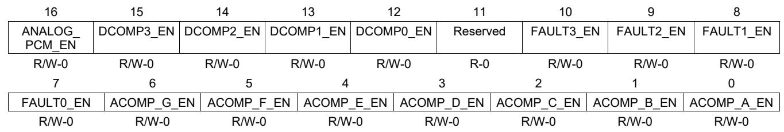

LEGEND: R/W = Read/Write; R = Read only; -*n* = value after reset

# **Table 6-23. DPWM 3 Current Limit Control Register (DPWM3CLIM) Register Field Descriptions**

<span id="page-273-2"></span>

| Bit | Field             | Type | Reset | Description                                                                                                                                                                                                    |
|-----|-------------------|------|-------|----------------------------------------------------------------------------------------------------------------------------------------------------------------------------------------------------------------|
| 16  | ANALOG_PCM<br>_EN | R/W  | 0     | Enables Analog Peak Current detection result for DPWM 2 Current Limit<br>0 = Analog Peak Current detection disabled for current limit (Default)<br>1 = Analog Peak Current detection enabled for current limit |
| 15  | DCOMP3_EN         | R/W  | 0     | Enables Digital Comparator 3 result for DPWM 3 Current Limit<br>0 = Digital Comparator 3 result disabled for current limit (Default)<br>1 = Digital Comparator 3 result enabled for current limit              |
| 14  | DCOMP2_EN         | R/W  | 0     | Enables Digital Comparator 2 result for DPWM 3 Current Limit<br>0 = Digital Comparator 2 result disabled for current limit (Default)<br>1 = Digital Comparator 2 result enabled for current limit              |
| 13  | DCOMP1_EN         | R/W  | 0     | Enables Digital Comparator 1 result for DPWM 3 Current Limit<br>0 = Digital Comparator 1 result disabled for current limit (Default)<br>1 = Digital Comparator 1 result enabled for current limit              |
| 12  | DCOMP0_EN         | R/W  | 0     | Enables Digital Comparator 0 result for DPWM 3 Current Limit<br>0 = Digital Comparator 0 result disabled for current limit (Default)<br>1 = Digital Comparator 0 result enabled for current limit              |
| 11  | Reserved          | R    | 0     |                                                                                                                                                                                                                |
| 10  | FAULT3_EN         | R/W  | 0     | Enables FAULT[3] pin for DPWM 3 Current Limit<br>0 = External Fault pin disabled for current limit (Default)<br>1 = External Fault pin enabled for current limit                                               |
| 9   | FAULT2_EN         | R/W  | 0     | Enables FAULT[2] pin for DPWM 3 Current Limit<br>0 = External Fault pin disabled for current limit (Default)<br>1 = External Fault pin enabled for current limit                                               |
| 8   | FAULT1_EN         | R/W  | 0     | Enables FAULT[1] pin for DPWM 3 Current Limit<br>0 = External Fault pin disabled for current limit (Default)<br>1 = External Fault pin enabled for current limit                                               |
| 7   | FAULT0_EN         | R/W  | 0     | Enables FAULT[0] pin for DPWM 3 Current Limit<br>0 = External Fault pin disabled for current limit (Default)<br>1 = External Fault pin enabled for current limit                                               |
| 6   | ACOMP_G_EN        | R/W  | 0     | Enables Analog Comparator G result for DPWM 3 Current Limit<br>0 = Analog Comparator result disabled for current limit (Default)<br>1 = Analog Comparator result enabled for current limit                     |
| 5   | ACOMP_F_EN        | R/W  | 0     | Enables Analog Comparator F result for DPWM 3 Current Limit<br>0 = Analog Comparator result disabled for current limit (Default)<br>1 = Analog Comparator result enabled for current limit                     |
| 4   | ACOMP_E_EN        | R/W  | 0     | Enables Analog Comparator E result for DPWM 3 Current Limit<br>0 = Analog Comparator result disabled for current limit (Default)<br>1 = Analog Comparator result enabled for current limit                     |


#### **Table 6-23. DPWM 3 Current Limit Control Register (DPWM3CLIM) Register Field Descriptions (continued)**

| Bit | Field      | Type | Reset | Description                                                                                                                                                                                |
|-----|------------|------|-------|--------------------------------------------------------------------------------------------------------------------------------------------------------------------------------------------|
| 3   | ACOMP_D_EN | R/W  | 0     | Enables Analog Comparator D result for DPWM 3 Current Limit<br>0 = Analog Comparator result disabled for current limit (Default)<br>1 = Analog Comparator result enabled for current limit |
| 2   | ACOMP_C_EN | R/W  | 0     | Enables Analog Comparator C result for DPWM 3 Current Limit<br>0 = Analog Comparator result disabled for current limit (Default)<br>1 = Analog Comparator result enabled for current limit |
| 1   | ACOMP_B_EN | R/W  | 0     | Enables Analog Comparator B result for DPWM 3 Current Limit<br>0 = Analog Comparator result disabled for current limit (Default)<br>1 = Analog Comparator result enabled for current limit |
| 0   | ACOMP_A_EN | R/W  | 0     | Enables Analog Comparator A result for DPWM 3 Current Limit<br>0 = Analog Comparator result disabled for current limit (Default)<br>1 = Analog Comparator result enabled for current limit |


# <span id="page-275-0"></span>*6.11.24 DPWM 3 Fault AB Detection Register (DPWM3FLTABDET)*

Address 0x00030068

#### **Figure 6-28. DPWM 3 Fault AB Detection Register (DPWM3FLTABDET)**

<span id="page-275-1"></span>

| 14                     | 13         | 12         |            | 11         |           | 10         | 9          | 8          |
|------------------------|------------|------------|------------|------------|-----------|------------|------------|------------|
| DCOMP3_EN<br>DCOMP2_EN |            | DCOMP1_EN  |            | DCOMP0_EN  | FAULT3_EN |            | FAULT2_EN  | FAULT1_EN  |
| R/W-0                  | R/W-0      | R/W-0      |            | R/W-0      | R/W-0     |            | R/W-0      | R/W-0      |
| 7                      | 6          | 5          | 4          | 3          |           | 2          | 1          | 0          |
| FAULT0_EN              | ACOMP_G_EN | ACOMP_F_EN | ACOMP_E_EN | ACOMP_D_EN |           | ACOMP_C_EN | ACOMP_B_EN | ACOMP_A_EN |
| R/W-0                  | R/W-0      | R/W-0      | R/W-0      | R/W-0      |           | R/W-0      | R/W-0      | R/W-0      |

LEGEND: R/W = Read/Write; R = Read only; -*n* = value after reset

# **Table 6-24. DPWM 3 Fault AB Detection Register (DPWM3FLTABDET) Register Field Descriptions**

<span id="page-275-2"></span>

| Bit | Field      | Type | Reset | Description                                                                                                                                                                                               |  |  |  |  |  |
|-----|------------|------|-------|-----------------------------------------------------------------------------------------------------------------------------------------------------------------------------------------------------------|--|--|--|--|--|
| 14  | DCOMP3_EN  | R/W  | 0     | Enables Digital Comparator 3 result for DPWM 3 Fault AB Detection<br>0 = Digital Comparator 3 disabled for Fault AB detection (Default)<br>1 = Digital Comparator 3 enabled for Fault AB detection        |  |  |  |  |  |
| 13  | DCOMP2_EN  | R/W  | 0     | Enables Digital Comparator 2 result for DPWM 3 Fault AB Detection<br>0 = Digital Comparator 2 disabled for Fault AB detection (Default)<br>1 = Digital Comparator 2 enabled for Fault AB detection        |  |  |  |  |  |
| 12  | DCOMP1_EN  | R/W  | 0     | Enables Digital Comparator 1 result for DPWM 3 Fault AB Detection<br>0 = Digital Comparator 1 disabled for Fault AB detection (Default)<br>1 = Digital Comparator 1 enabled for Fault AB detection        |  |  |  |  |  |
| 11  | DCOMP0_EN  | R/W  | 0     | Enables Digital Comparator 0 result for DPWM 3 Fault AB Detection<br>0 = Digital Comparator 0 disabled for Fault AB detection (Default)<br>1 = Digital Comparator 0 enabled for Fault AB detection        |  |  |  |  |  |
| 10  | FAULT3_EN  | R/W  | 0     | Enables FAULT[3] pin for DPWM 3 Fault AB detection<br>0 = External Fault pin disabled for Fault AB detection (Default)<br>1 = External Fault pin enabled for Fault AB detection                           |  |  |  |  |  |
| 9   | FAULT2_EN  | R/W  | 0     | Enables FAULT[2] pin for DPWM 3 Fault AB detection<br>0 = External Fault pin disabled for Fault AB detection (Default)<br>1 = External Fault pin enabled for Fault AB detection                           |  |  |  |  |  |
| 8   | FAULT1_EN  | R/W  | 0     | Enables FAULT[1] pin for DPWM 3 Fault AB detection<br>0 = External Fault pin disabled for Fault AB detection (Default)<br>1 = External Fault pin enabled for Fault AB detection                           |  |  |  |  |  |
| 7   | FAULT0_EN  | R/W  | 0     | Enables FAULT[0] pin for DPWM 3 Fault AB detection<br>0 = External Fault pin disabled for Fault AB detection (Default)<br>1 = External Fault pin enabled for Fault AB detection                           |  |  |  |  |  |
| 6   | ACOMP_G_EN | R/W  | 0     | Enables Analog Comparator G result for DPWM 3 Fault AB detection<br>0 = Analog Comparator result disabled for Fault AB detection (Default)<br>1 = Analog Comparator result enabled for Fault AB detection |  |  |  |  |  |
| 5   | ACOMP_F_EN | R/W  | 0     | Enables Analog Comparator F result for DPWM 3 Fault AB detection<br>0 = Analog Comparator result disabled for Fault AB detection (Default)<br>1 = Analog Comparator result enabled for Fault AB detection |  |  |  |  |  |
| 4   | ACOMP_E_EN | R/W  | 0     | Enables Analog Comparator E result for DPWM 3 Fault AB detection<br>0 = Analog Comparator result disabled for Fault AB detection (Default)<br>1 = Analog Comparator result enabled for Fault AB detection |  |  |  |  |  |
| 3   | ACOMP_D_EN | R/W  | 0     | Enables Analog Comparator D result for DPWM 3 Fault AB detection<br>0 = Analog Comparator result disabled for Fault AB detection (Default)<br>1 = Analog Comparator result enabled for Fault AB detection |  |  |  |  |  |


#### **Table 6-24. DPWM 3 Fault AB Detection Register (DPWM3FLTABDET) Register Field Descriptions (continued)**

| Bit | Field      | Type | Reset | Description                                                                                                                                                                                               |
|-----|------------|------|-------|-----------------------------------------------------------------------------------------------------------------------------------------------------------------------------------------------------------|
| 2   | ACOMP_C_EN | R/W  | 0     | Enables Analog Comparator C result for DPWM 3 Fault AB detection<br>0 = Analog Comparator result disabled for Fault AB detection (Default)<br>1 = Analog Comparator result enabled for Fault AB detection |
| 1   | ACOMP_B_EN | R/W  | 0     | Enables Analog Comparator B result for DPWM 3 Fault AB detection<br>0 = Analog Comparator result disabled for Fault AB detection (Default)<br>1 = Analog Comparator result enabled for Fault AB detection |
| 0   | ACOMP_A_EN | R/W  | 0     | Enables Analog Comparator A result for DPWM 3 Fault AB detection<br>0 = Analog Comparator result disabled for Fault AB detection (Default)<br>1 = Analog Comparator result enabled for Fault AB detection |


# <span id="page-277-0"></span>*6.11.25 DPWM 3 Fault Detection Register (DPWM3FAULTDET)*

Address 0x0003006C

# **Figure 6-29. DPWM 3 Fault Detection Register (DPWM3FAULTDET)**

<span id="page-277-1"></span>

| 30                 | 29<br>28            |                     |                     | 27                 |                     |                    | 26                  |  | 25                  | 24                  |
|--------------------|---------------------|---------------------|---------------------|--------------------|---------------------|--------------------|---------------------|--|---------------------|---------------------|
| PWMB_DCOMP3<br>_EN | PWMB_DCOMP<br>2_EN  | PWMB_DCOMP1<br>_EN  |                     | PWMB_DCOMP0<br>_EN |                     | PWMB_FAULT3<br>_EN |                     |  | PWMB_FAULT2<br>_EN  | PWMB_FAULT1<br>_EN  |
| R/W-0              | R/W-0               |                     | R/W-0               |                    | R/W-0               |                    | R/W-0               |  | R/W-0               | R/W-0               |
| 23                 | 22                  | 21                  | 20                  |                    | 19                  |                    | 18                  |  | 17                  | 16                  |
| PWMB_<br>FAULT0_EN | PWMB_<br>ACOMP_G_EN | PWMB_<br>ACOMP_F_EN | PWMB_<br>ACOMP_E_EN |                    | PWMB_<br>ACOMP_D_EN |                    | PWMB_<br>ACOMP_C_EN |  | PWMB_<br>ACOMP_B_EN | PWMB_<br>ACOMP_A_EN |
| R/W-0              | R/W-0               | R/W-0               | R/W-0               |                    | R/W-0               |                    | R/W-0               |  | R/W-0               | R/W-0               |
| 15                 | 14                  | 13                  | 12                  |                    | 11                  |                    | 10                  |  | 9                   | 8                   |
| Reserved           | PWMA_<br>DCOMP3_EN  | PWMA_<br>DCOMP2_EN  | PWMA_<br>DCOMP1_EN  |                    | PWMA_<br>DCOMP0_EN  |                    | PWMA_<br>FAULT3_EN  |  | PWMA_<br>FAULT2_EN  | PWMA_<br>FAULT1_EN  |
| R-0                | R/W-0               | R/W-0               | R/W-0               |                    | R/W-0               |                    | R/W-0               |  | R/W-0               | R/W-0               |
| 7                  | 6                   | 5                   | 4                   |                    | 3                   |                    | 2                   |  | 1                   | 0                   |
| PWMA_<br>FAULT0_EN | PWMA_<br>ACOMP_G_EN | PWMA_<br>ACOMP_F_EN | PWMA_<br>ACOMP_E_EN |                    | PWMA_<br>ACOMP_D_EN |                    | PWMA_<br>ACOMP_C_EN |  | PWMA_<br>ACOMP_B_EN | PWMA_<br>ACOMP_A_EN |
| R/W-0              | R/W-0               | R/W-0               | R/W-0               |                    | R/W-0               |                    | R/W-0               |  | R/W-0               | R/W-0               |

**Table 6-25. DPWM 3 Fault Detection Register (DPWM3FAULTDET) Register Field Descriptions**

<span id="page-277-2"></span>

| Bit | Field               | Type | Reset | Description                                                                                                                                                                                            |  |
|-----|---------------------|------|-------|--------------------------------------------------------------------------------------------------------------------------------------------------------------------------------------------------------|--|
| 30  | PWMB_DCOMP3<br>_EN  | R/W  | 0     | Enables Digital Comparator 3 result for DPWM 3 PWM-B Fault Detection<br>0 = Digital Comparator 3 disabled for fault detection (Default)<br>1 = Digital Comparator 3 enabled for fault detection        |  |
| 29  | PWMB_DCOMP2<br>_EN  | R/W  | 0     | Enables Digital Comparator 2 result for DPWM 3 PWM-B Fault Detection<br>0 = Digital Comparator 2 disabled for fault detection (Default)<br>1 = Digital Comparator 2 enabled for fault detection        |  |
| 28  | PWMB_DCOMP1<br>_EN  | R/W  | 0     | Enables Digital Comparator 1 result for DPWM 3 PWM-B Fault Detection<br>0 = Digital Comparator 1 disabled for fault detection (Default)<br>1 = Digital Comparator 1 enabled for fault detection        |  |
| 27  | PWMB_DCOMP0<br>_EN  | R/W  | 0     | Enables Digital Comparator 0 result for DPWM 3 PWM-B Fault Detection<br>0 = Digital Comparator 0 disabled for fault detection (Default)<br>1 = Digital Comparator 0 enabled for fault detection        |  |
| 26  | PWMB_FAULT3<br>_EN  | R/W  | 0     | Enables FAULT[3] pin for DPWM 3 PWM-B Fault Detection<br>0 = External Fault pin disabled for fault detection (Default)<br>1 = External Fault pin enabled for fault detection                           |  |
| 25  | PWMB_FAULT2<br>_EN  | R/W  | 0     | Enables FAULT[2] pin for DPWM 3 PWM-B Fault Detection<br>0 = External Fault pin disabled for fault detection (Default)<br>1 = External Fault pin enabled for fault detection                           |  |
| 24  | PWMB_FAULT1<br>_EN  | R/W  | 0     | Enables FAULT[1] pin for DPWM 3 PWM-B Fault Detection<br>0 = External Fault pin disabled for fault detection (Default)<br>1 = External Fault pin enabled for fault detection                           |  |
| 23  | PWMB_FAULT0<br>_EN  | R/W  | 0     | Enables FAULT[0] pin for DPWM 3 PWM-B Fault Detection<br>0 = External Fault pin disabled for fault detection (Default)<br>1 = External Fault pin enabled for fault detection                           |  |
| 22  | PWMB_ACOMP<br>_G_EN | R/W  | 0     | Enables Analog Comparator G result for DPWM 3 PWM-B Fault detection<br>0 = Analog Comparator result disabled for fault detection (Default)<br>1 = Analog Comparator result enabled for fault detection |  |


# **Table 6-25. DPWM 3 Fault Detection Register (DPWM3FAULTDET) Register Field Descriptions (continued)**

| Bit | Field               | Type | Reset | Description                                                                                                                                                                                            |  |  |  |
|-----|---------------------|------|-------|--------------------------------------------------------------------------------------------------------------------------------------------------------------------------------------------------------|--|--|--|
| 21  | PWMB_ACOMP<br>_F_EN | R/W  | 0     | Enables Analog Comparator F result for DPWM 3 PWM-B Fault detection<br>0 = Analog Comparator result disabled for fault detection (Default)<br>1 = Analog Comparator result enabled for fault detection |  |  |  |
| 20  | PWMB_ACOMP<br>_E_EN | R/W  | 0     | Enables Analog Comparator E result for DPWM 3 PWM-B Fault detection<br>0 = Analog Comparator result disabled for fault detection (Default)<br>1 = Analog Comparator result enabled for fault detection |  |  |  |
| 19  | PWMB_ACOMP<br>_D_EN | R/W  | 0     | Enables Analog Comparator D result for DPWM 3 PWM-B Fault detection<br>0 = Analog Comparator result disabled for fault detection (Default)<br>1 = Analog Comparator result enabled for fault detection |  |  |  |
| 18  | PWMB_ACOMP<br>_C_EN | R/W  | 0     | Enables Analog Comparator C result for DPWM 3 PWM-B Fault detection<br>0 = Analog Comparator result disabled for fault detection (Default)<br>1 = Analog Comparator result enabled for fault detection |  |  |  |
| 17  | PWMB_ACOMP<br>_B_EN | R/W  | 0     | Enables Analog Comparator B result for DPWM 3 PWM-B Fault detection<br>0 = Analog Comparator result disabled for fault detection (Default)<br>1 = Analog Comparator result enabled for fault detection |  |  |  |
| 16  | PWMB_ACOMP<br>_A_EN | R/W  | 0     | Enables Analog Comparator A result for DPWM 3 PWM-B Fault detection<br>0 = Analog Comparator result disabled for fault detection (Default)<br>1 = Analog Comparator result enabled for fault detection |  |  |  |
| 15  | Reserved            | R    | 0     |                                                                                                                                                                                                        |  |  |  |
| 14  | PWMA_DCOMP3<br>_EN  | R/W  | 0     | Enables Digital Comparator 3 result for DPWM 3 PWM-A Fault Detection<br>0 = Digital Comparator 3 disabled for fault detection (Default)<br>1 = Digital Comparator 3 enabled for fault detection        |  |  |  |
| 13  | PWMA_DCOMP2<br>_EN  | R/W  | 0     | Enables Digital Comparator 2 result for DPWM 3 PWM-A Fault Detection<br>0 = Digital Comparator 2 disabled for fault detection (Default)<br>1 = Digital Comparator 2 enabled for fault detection        |  |  |  |
| 12  | PWMA_DCOMP1<br>_EN  | R/W  | 0     | Enables Digital Comparator 1 result for DPWM 3 PWM-A Fault Detection<br>0 = Digital Comparator 1 disabled for fault detection (Default)<br>1 = Digital Comparator 1 enabled for fault detection        |  |  |  |
| 11  | PWMA_DCOMP0<br>_EN  | R/W  | 0     | Enables Digital Comparator 0 result for DPWM 3 PWM-A Fault Detection<br>0 = Digital Comparator 0 disabled for fault detection (Default)<br>1 = Digital Comparator 0 enabled for fault detection        |  |  |  |
| 10  | PWMA_FAULT3<br>_EN  | R/W  | 0     | Enables FAULT[3] pin for DPWM 3 PWM-A Fault Detection<br>0 = External Fault pin disabled for fault detection (Default)<br>1 = External Fault pin enabled for fault detection                           |  |  |  |
| 9   | PWMA_FAULT2<br>_EN  | R/W  | 0     | Enables FAULT[2] pin for DPWM 3 PWM-A Fault Detection<br>0 = External Fault pin disabled for fault detection (Default)<br>1 = External Fault pin enabled for fault detection                           |  |  |  |
| 8   | PWMA_FAULT1<br>_EN  | R/W  | 0     | Enables FAULT[1] pin for DPWM 3 PWM-A Fault Detection<br>0 = External Fault pin disabled for fault detection (Default)<br>1 = External Fault pin enabled for fault detection                           |  |  |  |
| 7   | PWMA_FAULT0<br>_EN  | R/W  | 0     | Enables FAULT[0] pin for DPWM 3 PWM-A Fault Detection<br>0 = External FaulT pin disabled for fault detection (Default)<br>1 = External Fault pin enabled for fault detection                           |  |  |  |
| 6   | PWMA_ACOMP<br>_G_EN | R/W  | 0     | Enables Analog Comparator G result for DPWM 3 PWM-A Fault detection<br>0 = Analog Comparator result disabled for fault detection (Default)<br>1 = Analog Comparator result enabled for fault detection |  |  |  |
| 5   | PWMA_ACOMP<br>_F_EN | R/W  | 0     | Enables Analog Comparator F result for DPWM 3 PWM-A Fault detection<br>0 = Analog Comparator result disabled for fault detection (Default)<br>1 = Analog Comparator result enabled for fault detection |  |  |  |


# **Table 6-25. DPWM 3 Fault Detection Register (DPWM3FAULTDET) Register Field Descriptions (continued)**

| Bit | Field               | Type | Reset | Description                                                                                                                                                                                            |
|-----|---------------------|------|-------|--------------------------------------------------------------------------------------------------------------------------------------------------------------------------------------------------------|
| 4   | PWMA_ACOMP<br>_E_EN | R/W  | 0     | Enables Analog Comparator E result for DPWM 3 PWM-A Fault detection<br>0 = Analog Comparator result disabled for fault detection (Default)<br>1 = Analog Comparator result enabled for fault detection |
| 3   | PWMA_ACOMP<br>_D_EN | R/W  | 0     | Enables Analog Comparator D result for DPWM 3 PWM-A Fault detection<br>0 = Analog Comparator result disabled for fault detection (Default)<br>1 = Analog Comparator result enabled for fault detection |
| 2   | PWMA_ACOMP<br>_C_EN | R/W  | 0     | Enables Analog Comparator C result for DPWM 3 PWM-A Fault detection<br>0 = Analog Comparator result disabled for fault detection (Default)<br>1 = Analog Comparator result enabled for fault detection |
| 1   | PWMA_ACOMP<br>_B_EN | R/W  | 0     | Enables Analog Comparator B result for DPWM 3 PWM-A Fault detection<br>0 = Analog Comparator result disabled for fault detection (Default)<br>1 = Analog Comparator result enabled for fault detection |
| 0   | PWMA_ACOMP<br>_A_EN | R/W  | 0     | Enables Analog Comparator A result for DPWM 3 PWM-A Fault detection<br>0 = Analog Comparator result disabled for fault detection (Default)<br>1 = Analog Comparator result enabled for fault detection |


# <span id="page-280-0"></span>*6.11.26 HFO Fail Detect Register (HFOFAILDET)*

Address 0x00030074

#### **Figure 6-30. HFO Fail Detect Register (HFOFAILDET)**

<span id="page-280-1"></span>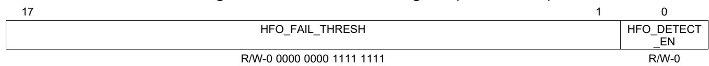

LEGEND: R/W = Read/Write; R = Read only; -*n* = value after reset

### **Table 6-26. HFO Fail Detect Register (HFOFAILDET) Register Field Descriptions**

<span id="page-280-2"></span>

| Bit  | Field               | Type | Reset                          | Description                                                                                                                                                                                                                                                 |  |  |  |
|------|---------------------|------|--------------------------------|-------------------------------------------------------------------------------------------------------------------------------------------------------------------------------------------------------------------------------------------------------------|--|--|--|
| 17-1 | HFO_FAIL<br>_THRESH | R/W  | 0 0000<br>0000<br>1111<br>1111 | Configures threshold where a clear flag is used to clear a counter in the Low<br>Frequency Oscillator domain (if LFO counter overflows, a reset will be generated),<br>resolution of threshold equals High Frequency Oscillator period                      |  |  |  |
| 0    | HFO_DETECT<br>_EN   | R/W  | 0                              | Enables High Frequency Oscillator Failure Detection logic, device will be reset upon<br>detection of an oscillator failure<br>0 = Disables High Frequency Oscillator Failure Detection (Default)<br>1 = Enables High Frequency Oscillator Failure Detection |  |  |  |


# <span id="page-281-0"></span>*6.11.27 LFO Fail Detect Register (LFOFAILDET)*

Address 0x00030078

# **Figure 6-31. LFO Fail Detect Register (LFOFAILDET)**

<span id="page-281-1"></span>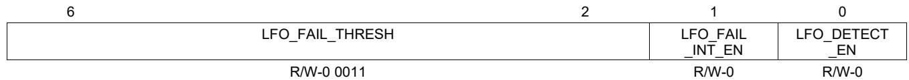

LEGEND: R/W = Read/Write; R = Read only; -*n* = value after reset

### **Table 6-27. LFO Fail Detect Register (LFOFAILDET) Register Field Descriptions**

<span id="page-281-2"></span>

| Bit | Field               | Type | Reset  | Description                                                                                                                                                                                                                                                     |  |  |  |
|-----|---------------------|------|--------|-----------------------------------------------------------------------------------------------------------------------------------------------------------------------------------------------------------------------------------------------------------------|--|--|--|
| 6-2 | LFO_FAIL<br>_THRESH | R/W  | 0 0011 | Configures threshold where a clear flag is used to clear a counter in the High<br>Frequency Oscillator domain (if HFO counter overflows, a reset will be generated),<br>resolution of threshold equals Low Frequency Oscillator period                          |  |  |  |
| 1   | LFO_FAIL_INT<br>_EN | R/W  | 0      | Low Frequency Oscillator Fail Interrupt Enable<br>0 = Disables Interrupt Generation upon LFO Failure Detection (Default)<br>1 = Enables Interrupt Generation upon LFO Failure Detection                                                                         |  |  |  |
| 0   | LFO_DETECT_EN       | R/W  | 0      | Enables Low Frequency Oscillator Failure Detection logic, interrupt will be generated<br>upon detection of an oscillator failure<br>0 = Disables Low Frequency Oscillator Failure Detection (Default)<br>1 = Enables Low Frequency Oscillator Failure Detection |  |  |  |


# <span id="page-282-0"></span>*6.11.28 IDE Control Register (IDECTRL)*

Address 0003007C

### **Figure 6-32. IDE Control Register (IDECTRL)**

<span id="page-282-1"></span>

| 31 | 30            | 29 | 28     | 27                   | 26 | 25 | 24          | 23 | 22 | 21            | 20 | 19 | 18 | 17 | 16 |  |  |
|----|---------------|----|--------|----------------------|----|----|-------------|----|----|---------------|----|----|----|----|----|--|--|
|    |               |    |        | DCM_LIMIT_H          |    |    | DCM_LIMIT_L |    |    |               |    |    |    |    |    |  |  |
|    | R/W-0000 0000 |    |        |                      |    |    |             |    |    | R/W-0000 0000 |    |    |    |    |    |  |  |
| 15 | 14            | 13 | 12     | 11                   | 10 | 9  | 8           | 7  | 6  | 5             | 4  | 3  | 2  | 1  | 0  |  |  |
|    | Reserved      |    | IDE_KD |                      |    |    |             |    |    |               |    |    |    |    |    |  |  |
|    | R-00<br>R/W-0 |    |        | R/W-0 0000 0000 0000 |    |    |             |    |    |               |    |    |    |    |    |  |  |

LEGEND: R/W = Read/Write; R = Read only; -*n* = value after reset

# **Table 6-28. IDE Control Register (IDECTRL) Register Field Descriptions**

| Bit   | Field       | Type | Reset                  | Description                                                                                                                                                                                                                                                             |  |  |  |
|-------|-------------|------|------------------------|-------------------------------------------------------------------------------------------------------------------------------------------------------------------------------------------------------------------------------------------------------------------------|--|--|--|
| 31-24 | DCM_LIMIT_H | R/W  | 0000<br>0000           | Value added to 1-Da value to provide hysteresis for exiting DCM mode                                                                                                                                                                                                    |  |  |  |
| 23-16 | DCM_LIMIT_L | R/W  | 0000<br>0000           | Value subtracted from 1-Da value to provide hysteresis for entering DCM mode                                                                                                                                                                                            |  |  |  |
| 15-14 | Reserved    | R    | 00                     |                                                                                                                                                                                                                                                                         |  |  |  |
| 13    | DCM_INT_EN  | R/W  | 0                      | Enables Discontinuous Conduction Mode (DCM) interrupt generation based on<br>selected Filter outputs                                                                                                                                                                    |  |  |  |
|       |             |      |                        | 0 = Disables DCM Detection Interrupt (Default)                                                                                                                                                                                                                          |  |  |  |
|       |             |      |                        | 1 = Enables DCM Detection Interrupt                                                                                                                                                                                                                                     |  |  |  |
| 12-0  | IDE_KD      | R/W  | 0 0000<br>0000<br>0000 | 13-bit unsigned value used to calculate the DPWM B Pulse width when configured in<br>IDE Mode. IDE_KD is configured in 4.9 format, with the integer portion of the KD<br>value ranging from 0 to 15 and 9 fractional bits available for the pulse width<br>calculation. |  |  |  |

<span id="page-283-0"></span>

# *GIO Module*

The GIO Module offers general purpose input/output pins. These pins can also be used as inputs to the fault logic above. These pins can also be used for fault interrupts. The GIO registers also control and monitor the external interrupt pin. They are similar to GPIO functions on many microcontrollers.

GIO Registers have the following attributes:

- Addresses placed on word boundaries
- Byte, Half-word and Word Writes are permitted
- All Registers can be read in any mode
- All Registers are writeable

**Topic** ........................................................................................................................... **Page**

| 7.1  | Fault IO Direction Register (FAULTDIR)            | 285 |
|------|---------------------------------------------------|-----|
| 7.2  | Fault Input Register (FAULTIN)                    | 286 |
| 7.3  | Fault Output Register (FAULTOUT)                  | 287 |
| 7.4  | Fault Interrupt Enable Register (FAULTINTENA)     | 288 |
| 7.5  | Fault Interrupt Polarity Register (FAULTINTPOL)   | 289 |
| 7.6  | Fault Interrupt Pending Register (FAULTINTPEND)   | 290 |
| 7.7  | External Interrupt Direction Register (EXTINTDIR) | 291 |
| 7.8  | External Interrupt Input Register (EXTINTIN)      | 292 |
| 7.9  | External Interrupt Output Register (EXTINTOUT)    | 293 |
| 7.10 | External Interrupt Enable Register (EXTINTENA)    | 294 |
| 7.11 | External Interrupt Polarity Register (EXTTINTPOL) | 295 |
| 7.12 | External Interrupt Pending Register (EXTINTPEND)  | 296 |
| 7.13 | References                                        | 296 |


# <span id="page-284-0"></span>**7.1 Fault IO Direction Register (FAULTDIR)**

Address FFF7FA00

### **Figure 7-1. Fault IO Direction Register (FAULTDIR)**

<span id="page-284-1"></span>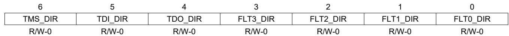

LEGEND: R/W = Read/Write; R = Read only; -*n* = value after reset

### **Table 7-1. Fault IO Direction Register (FAULTDIR) Register Field Descriptions**

<span id="page-284-2"></span>

| Bit | Field    | Type | Reset | Description                                                                                                                                    |
|-----|----------|------|-------|------------------------------------------------------------------------------------------------------------------------------------------------|
| 6   | TMS_DIR  | R/W  | 0     | TMS Pin Configuration<br>0 = TMS pin configured as an input pin in GPIO mode (Default)<br>1 = TMS pin configured as an output pin in GPIO mode |
| 5   | TDI_DIR  | R/W  | 0     | TDI Pin Configuration<br>0 = TDI pin configured as an input pin in GPIO mode (Default)<br>1 = TDI pin configured as an output pin in GPIO mode |
| 4   | TDO_DIR  | R/W  | 0     | TDO Pin Configuration<br>0 = TDO pin configured as an input pin in GPIO mode (Default)<br>1 = TDO pin configured as an output pin in GPIO mode |
| 3   | FLT3_DIR | R/W  | 0     | FAULT[3] Pin Configuration<br>0 = FAULT[3] pin configured as an input pin (Default)<br>1 = FAULT[3] pin configured as an output pin            |
| 2   | FLT2_DIR | R/W  | 0     | FAULT[2] Pin Configuration<br>0 = FAULT[2] pin configured as an input pin (Default)<br>1 = FAULT[2] pin configured as an output pin            |
| 1   | FLT1_DIR | R/W  | 0     | FAULT[1] Pin Configuration<br>0 = FAULT[1] pin configured as an input pin (Default)<br>1 = FAULT[1] pin configured as an output pin            |
| 0   | FLT0_DIR | R/W  | 0     | FAULT[0] Pin Configuration<br>0 = FAULT[0] pin configured as an input pin (Default)<br>1 = FAULT[0] pin configured as an output pin            |


# <span id="page-285-0"></span>**7.2 Fault Input Register (FAULTIN)**

Address FFF7FA04

#### **Figure 7-2. Fault Input Register (FAULTIN)**

<span id="page-285-1"></span>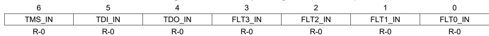

LEGEND: R/W = Read/Write; R = Read only; -*n* = value after reset

# **Table 7-2. Fault Input Register (FAULTIN) Register Field Descriptions**

<span id="page-285-2"></span>

| Bit | Field   | Type | Reset | Description                                                                                           |
|-----|---------|------|-------|-------------------------------------------------------------------------------------------------------|
| 6   | TMS_IN  | R    | 0     | Input Value of TMS Pin<br>0 = TMS pin driven low in GPIO mode<br>1 = TMS pin driven high in GPIO mode |
| 5   | TDI_IN  | R    | 0     | Input Value of TDI Pin<br>0 = TDI pin driven low in GPIO mode<br>1 = TDI pin driven high in GPIO mode |
| 4   | TDO_IN  | R    | 0     | Input Value of TDO Pin<br>0 = TDO pin driven low in GPIO mode<br>1 = TDO pin driven high in GPIO mode |
| 3   | FLT3_IN | R    | 0     | Input Value of FAULT[3] Pin<br>0 = FAULT[3] pin driven low<br>1 = FAULT[3] pin driven high            |
| 2   | FLT2_IN | R    | 0     | Input Value of FAULT[2] Pin<br>0 = FAULT[2] pin driven low<br>1 = FAULT[2] pin driven high            |
| 1   | FLT1_IN | R    | 0     | Input Value of FAULT[1]<br>Pin 0 = FAULT[1] pin driven low<br>1 = FAULT[1] pin driven high            |
| 0   | FLT0_IN | R    | 0     | Input Value of FAULT[0]<br>Pin 0 = FAULT[0] pin driven low<br>1 = FAULT[0] pin driven high            |


# <span id="page-286-0"></span>**7.3 Fault Output Register (FAULTOUT)**

Address FFF7FA08

#### **Figure 7-3. Fault Output Register (FAULTOUT)**

<span id="page-286-1"></span>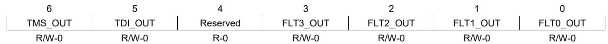

LEGEND: R/W = Read/Write; R = Read only; -*n* = value after reset

### **Table 7-3. Fault Output Register (FAULTOUT) Register Field Descriptions**

| Bit | Field    | Type | Reset | Description                                                                                                                                                       |
|-----|----------|------|-------|-------------------------------------------------------------------------------------------------------------------------------------------------------------------|
| 6   | TMS_OUT  | R/W  | 0     | TMS Pin Output Value<br>0 = TMS pin driven low when configured as output in GPIO mode (Default)<br>1 = TMS pin driven high when configured as output in GPIO mode |
| 5   | TDI_OUT  | R/W  | 0     | TDI Pin Output Value<br>0 = TDI pin driven low when configured as output in GPIO mode (Default)<br>1 = TDI pin driven high when configured as output in GPIO mode |
| 4   | Reserved | R    | 0     |                                                                                                                                                                   |
| 3   | FLT3_OUT | R/W  | 0     | FAULT[3] Pin Output Value<br>0 = FAULT[3] pin driven low when configured as output (Default)<br>1 = FAULT[3] pin driven high when configured as output            |
| 2   | FLT2_OUT | R/W  | 0     | FAULT[2] Pin Output Value<br>0 = FAULT[2] pin driven low when configured as output (Default)<br>1 = FAULT[2] pin driven high when configured as output            |
| 1   | FLT1_OUT | R/W  | 0     | FAULT[1] Pin Output Value<br>0 = FAULT[1] pin driven low when configured as output (Default)<br>1 = FAULT[1] pin driven high when configured as output            |
| 0   | FLT0_OUT | R/W  | 0     | FAULT[0] Pin Output Value<br>0 = FAULT[0] pin driven low when configured as output (Default)<br>1 = FAULT[0] pin driven high when configured as output            |


# <span id="page-287-0"></span>**7.4 Fault Interrupt Enable Register (FAULTINTENA)**

Address FFF7FA14

#### **Figure 7-4. Fault Interrupt Enable Register (FAULTINTENA)**

<span id="page-287-1"></span>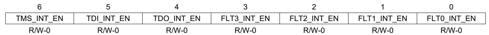

LEGEND: R/W = Read/Write; R = Read only; -*n* = value after reset

### **Table 7-4. Fault Interrupt Enable Register (FAULTINTENA) Register Field Descriptions**

<span id="page-287-2"></span>

| Bit | Field       | Type | Reset | Description                                                                                                              |
|-----|-------------|------|-------|--------------------------------------------------------------------------------------------------------------------------|
| 6   | TMS_INT_EN  | R/W  | 0     | TMS Interrupt Enable<br>0 = Interrupt disabled for TMS pin (Default)<br>1 = Interrupt enabled for TMS pin in GPIO mode   |
| 5   | TDI_INT_EN  | R/W  | 0     | TDI Interrupt Enable<br>0 = Interrupt disabled for TDI pin (Default)<br>1 = Interrupt enabled for TDI pin in GPIO mode   |
| 4   | TDO_INT_EN  | R/W  | 0     | TDO Interrupt Enable<br>0 = Interrupt disabled for TDO pin (Default)<br>1 = Interrupt enabled for TDO pin in GPIO mode   |
| 3   | FLT3_INT_EN | R/W  | 0     | FAULT[3] Interrupt Enable<br>0 = Interrupt disabled for FAULT[3] pin (Default)<br>1 = Interrupt enabled for FAULT[3] pin |
| 2   | FLT2_INT_EN | R/W  | 0     | FAULT[2] Interrupt Enable<br>0 = Interrupt disabled for FAULT[2] pin (Default)<br>1 = Interrupt enabled for FAULT[2] pin |
| 1   | FLT1_INT_EN | R/W  | 0     | FAULT[1] Interrupt Enable<br>0 = Interrupt disabled for FAULT[1] pin (Default)<br>1 = Interrupt enabled for FAULT[1] pin |
| 0   | FLT0_INT_EN | R/W  | 0     | FAULT[0] Interrupt Enable<br>0 = Interrupt disabled for FAULT[0] pin (Default)<br>1 = Interrupt enabled for FAULT[0] pin |


# <span id="page-288-0"></span>**7.5 Fault Interrupt Polarity Register (FAULTINTPOL)**

Address FFF7FA18

### **Figure 7-5. Fault Interrupt Polarity Register (FAULTINTPOL)**

<span id="page-288-2"></span>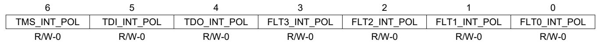

LEGEND: R/W = Read/Write; R = Read only; -*n* = value after reset

# **Table 7-5. Fault Interrupt Polarity Register (FAULTINTPOL) Register Field Descriptions**

<span id="page-288-1"></span>

| Bit | Field        | Type | Reset | Description                                                                                                                                     |
|-----|--------------|------|-------|-------------------------------------------------------------------------------------------------------------------------------------------------|
| 6   | TMS_INT_POL  | R/W  | 0     | TMS_INT_POL– TMS Interrupt Polarity Select<br>0 = Interrupt generated on falling edge (Default)<br>1 = Interrupt generated on rising edge       |
| 5   | TDI_INT_POL  | R/W  | 0     | TDI_INT_POL– TDI Interrupt Polarity Select<br>0 = Interrupt generated on falling edge (Default)<br>1 = Interrupt generated on rising edge       |
| 4   | TDO_INT_POL  | R/W  | 0     | TDO_INT_POL– TDO Interrupt Polarity Select<br>0 = Interrupt generated on falling edge (Default)<br>1 = Interrupt generated on rising edge       |
| 3   | FLT3_INT_POL | R/W  | 0     | FLT3_INT_POL– FAULT[3] Interrupt Polarity Select<br>0 = Interrupt generated on falling edge (Default)<br>1 = Interrupt generated on rising edge |
| 2   | FLT2_INT_POL | R/W  | 0     | FLT2_INT_POL– FAULT[2] Interrupt Polarity Select<br>0 = Interrupt generated on falling edge (Default)<br>1 = Interrupt generated on rising edge |
| 1   | FLT1_INT_POL | R/W  | 0     | FLT1_INT_POL– FAULT[1] Interrupt Polarity Select<br>0 = Interrupt generated on falling edge (Default)<br>1 = Interrupt generated on rising edge |
| 0   | FLT0_INT_POL | R/W  | 0     | FLT0_INT_POL– FAULT[0] Interrupt Polarity Select<br>0 = Interrupt generated on falling edge (Default)<br>1 = Interrupt generated on rising edge |


# <span id="page-289-0"></span>**7.6 Fault Interrupt Pending Register (FAULTINTPEND)**

Address FFF7FA1C

#### **Figure 7-6. Fault Interrupt Pending Register (FAULTINTPEND)**

<span id="page-289-1"></span>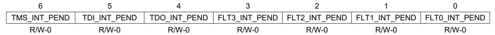

LEGEND: R/W = Read/Write; R = Read only; -*n* = value after reset

# **Table 7-6. Fault Interrupt Pending Register (FAULTINTPEND) Register Field Descriptions**

<span id="page-289-2"></span>

| Bit | Field         | Type | Reset | Description                                                                                                                                          |
|-----|---------------|------|-------|------------------------------------------------------------------------------------------------------------------------------------------------------|
| 6   | TMS_INT_PEND  | R/W  | 0     | TMS has caused an interrupt. Writing a 1 to a bit will clear the interrupt flag<br>0 = No Interrupt detected (Default)<br>1 = Interrupt pending      |
| 5   | TDI_INT_PEND  | R/W  | 0     | TDI has caused an interrupt. Writing a 1 to a bit will clear the interrupt flag<br>0 = No Interrupt detected (Default)<br>1 = Interrupt pending      |
| 4   | TDO_INT_PEND  | R/W  | 0     | TDO has caused an interrupt. Writing a 1 to a bit will clear the interrupt flag<br>0 = No Interrupt detected (Default)<br>1 = Interrupt pending      |
| 3   | FLT3_INT_PEND | R/W  | 0     | FAULT[3] has caused an interrupt. Writing a 1 to a bit will clear the interrupt flag<br>0 = No Interrupt detected (Default)<br>1 = Interrupt pending |
| 2   | FLT2_INT_PEND | R/W  | 0     | FAULT[2] has caused an interrupt. Writing a 1 to a bit will clear the interrupt flag<br>0 = No Interrupt detected (Default)<br>1 = Interrupt pending |
| 1   | FLT1_INT_PEND | R/W  | 0     | FAULT[1] has caused an interrupt. Writing a 1 to a bit will clear the interrupt flag<br>0 = No Interrupt detected (Default)<br>1 = Interrupt pending |
| 0   | FLT0_INT_PEND | R/W  | 0     | FAULT[0] has caused an interrupt. Writing a 1 to a bit will clear the interrupt flag<br>0 = No Interrupt detected (Default)<br>1 = Interrupt pending |


# <span id="page-290-0"></span>**7.7 External Interrupt Direction Register (EXTINTDIR)**

Address FFF7FA20

**Figure 7-7. External Interrupt Direction Register (EXTINTDIR)**

0

<span id="page-290-1"></span>EXT\_INT\_DIR

R/W-0

LEGEND: R/W = Read/Write; R = Read only; -*n* = value after reset

### **Table 7-7. External Interrupt Direction Register (EXTINTDIR) Register Field Descriptions**

<span id="page-290-2"></span>

| Bit | Field       | Type | Reset | Description                                          |
|-----|-------------|------|-------|------------------------------------------------------|
| 0   | EXT_INT_DIR | R/W  | 0     | EXT-INT Pin Configuration                            |
|     |             |      |       | 0 = EXT-INT pin configured as an input pin (Default) |
|     |             |      |       | 1 = EXT-INT pin configured as an output pin          |


# **7.8 External Interrupt Input Register (EXTINTIN)**

Address FFF7FA24

### **Figure 7-8. External Interrupt Input Register (EXTINTIN)**

0

EXT\_INT\_EN

R-0

LEGEND: R/W = Read/Write; R = Read only; -*n* = value after reset

### **Table 7-8. External Interrupt Input Register (EXTINTIN) Register Field Descriptions**

<span id="page-291-0"></span>

| Bit | Field      | Type | Reset | Description                                                                                                       |
|-----|------------|------|-------|-------------------------------------------------------------------------------------------------------------------|
| 0   | EXT_INT_EN | R    | 0     | Input Value of EXT-INT Pin<br>0 = EXT-INT pin driven low in GPIO mode<br>1 = EXT-INT pin driven high in GPIO mode |


# <span id="page-292-1"></span><span id="page-292-0"></span>**7.9 External Interrupt Output Register (EXTINTOUT)**

Address FFF7FA28

**Figure 7-9. External Interrupt Output Register (EXTINTOUT)**

0

EXT\_INT\_OUT R/W-0

LEGEND: R/W = Read/Write; R = Read only; -*n* = value after reset

### **Table 7-9. External Interrupt Output Register (EXTINTOUT) Register Field Descriptions**

<span id="page-292-2"></span>

| Bit | Field       | Type | Reset | Description                          |
|-----|-------------|------|-------|--------------------------------------|
| 0   | EXT_INT_OUT | R/W  | 0     | EXT-INT Pin Output Value             |
|     |             |      |       | 0 = EXT-INT pin driven low (Default) |
|     |             |      |       | 1 = EXT-INT pin driven high          |


# <span id="page-293-0"></span>**7.10 External Interrupt Enable Register (EXTINTENA)**

Address FFF7FA34

#### **Figure 7-10. External Interrupt Enable Register (EXTINTENA)**

0

<span id="page-293-1"></span>EXT\_INT\_EN R/W-0

LEGEND: R/W = Read/Write; R = Read only; -*n* = value after reset

### **Table 7-10. External Interrupt Enable Register (EXTINTENA) Register Field Descriptions**

<span id="page-293-2"></span>

| Bit | Field      | Type | Reset | Description                                                                                                           |
|-----|------------|------|-------|-----------------------------------------------------------------------------------------------------------------------|
| 0   | EXT_INT_EN | R/W  | 0     | EXT-INT Interrupt Enable<br>0 = Interrupt disabled for EXT-INT pin (Default)<br>1 = Interrupt enabled for EXT-INT pin |


# <span id="page-294-0"></span>**7.11 External Interrupt Polarity Register (EXTTINTPOL)**

Address FFF7FA38

**Figure 7-11. External Interrupt Polarity Register (EXTTINTPOL)**

0

EXT\_INT\_POL

R/W-0

LEGEND: R/W = Read/Write; R = Read only; -*n* = value after reset

### **Table 7-11. External Interrupt Polarity Register (EXTTINTPOL) Register Field Descriptions**

<span id="page-294-1"></span>

| Bit | Field       | Type | Reset | Description                                       |
|-----|-------------|------|-------|---------------------------------------------------|
| 0   | EXT_INT_POL | R/W  | 0     | EXT-INT Interrupt Polarity Select                 |
|     |             |      |       | 0 = Interrupt generated on falling edge (Default) |
|     |             |      |       | 1 = Interrupt generated on rising edge            |


# <span id="page-295-0"></span>**7.12 External Interrupt Pending Register (EXTINTPEND)**

Address FFF7FA3C

### **Figure 7-12. External Interrupt Pending Register (EXTINTPEND)**

0

<span id="page-295-2"></span>EXT\_INT\_PEND R/W-0

LEGEND: R/W = Read/Write; R = Read only; -*n* = value after reset

### **Table 7-12. External Interrupt Pending Register (EXTINTPEND) Register Field Descriptions**

<span id="page-295-3"></span>

| Bit | Field        | Type | Reset | Description                                                                                                                                          |
|-----|--------------|------|-------|------------------------------------------------------------------------------------------------------------------------------------------------------|
| 0   | EXT_INT_PEND | R/W  | 0     | EXT-INT has caused an interrupt. Writing a 1 to a bit will clear the interrupt flag.<br>0 = No Interrupt detected (Default)<br>1 = Interrupt pending |

# <span id="page-295-1"></span>**7.13 References**

- 1. UCD3138 ARM and Digital System Programmer's Manual ([SLUU996](http://www.ti.com/lit/pdf/SLUU996))
- 2. UCD3138 ARM and Digital System Programmer's Manual ([SLUU994](http://www.ti.com/lit/pdf/SLUU994))
- 3. UCD3138 Device Datasheet [\(SLUSAP2](http://www.ti.com/lit/pdf/SLUSAP2))

<span id="page-296-1"></span>

# *ADC12 Overview*

The ADC 12 in UCD3138 digital controller is a 12 bit, high speed analog to digital converter. It comes equipped with the following features:

- Typical conversion speed of 267 ksps
- Conversions can range from 1 to 16 ADC channel conversions in any desired sequence
- Post conversion averaging capability, ranging from 4X, 8X, 16X or 32X samples
- Configurable triggering for ADC conversions from the following sources: firmware, DPWM rising edge, ADC\_EXT\_TRIG pin or Analog Comparator results
- Interrupt capability to embedded processor at completion of ADC conversion
- Six digital comparators on the first 6 channels of the conversion sequence using either raw ADC data or averaged ADC data
- Two 10 µA current sources for excitation of PMBus addressing resistors
- Dual sample & Hold for accurate power measurement
- Internal temperature sensor for temperature protection and monitoring.

The control module, shown in [Figure](#page-296-0) 8-1, contains the control and conversion logic for auto-sequencing a series of conversions. The sequencing is fully configurable for any combination of 16 possible ADC channels through an analog multiplexer embedded in the ADC12 block. Once converted, the selected channel value is stored in the result register associated with the sequence number. Input channels can be sampled in any desired order or programmed to repeat conversions on the same channel multiple times during a conversion sequence. Selected channel conversions are also stored in the result registers in order of conversion, where the result 0 register is the first conversion of a 16-channel sequence and result 15 register is the last conversion of a 16-channel sequence. The number of channels converted in a sequence can vary from 1 to 16.

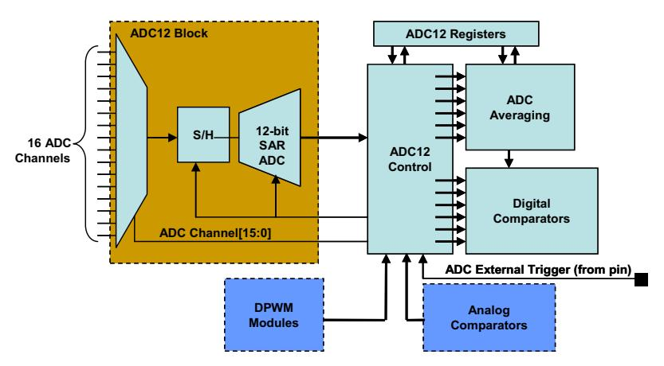

**Figure 8-1. ADC12 Control Block Diagram**

<span id="page-296-0"></span>Unlike the EADC converters in the Digital Power Peripherals portion of UCD3138, which feature a substantially faster conversion rate and hence are primarily designed for closing high speed voltage/current feedback loops of the power supply, the ADC12 is not usually used for loop compensation purposes. The ADC12 features make it best suited for monitoring and detection of currents, voltages, temperatures and faults.


Unbuffered multiplexed input is a popular option in CMOS switched capacitor ADCs. Compared with buffered inputs, the power consumption of unbuffered option is much lower. But there exists several problems: First, in general, the input impedance of this kind of ADC is very high at low frequency range and rolls off when frequency gets higher. Second, in unbuffered multiplexed ADC, the charge injection from the internal sampling capacitors and network reflects a small amount of signal, which is packed with high frequency content back onto the front-end circuitry and incoming signal. This may cause settling errors for the elements connected to the analog inputs of the converter. Another problem is that all the sampling channels use the same S/H capacitor in a sequence, if the sampling speed is very high, the charge remain on the S/H capacitor of one conversion may affect the result of the next conversion channel.

**Topic** ........................................................................................................................... **Page**

| 8.1  | ADC12 Input Impedance Model                                       | 299 |
|------|-------------------------------------------------------------------|-----|
| 8.2  | ADC12 Impedance vs. Sampling Frequency Data                       | 300 |
| 8.3  | Effect of External Capacitance                                    | 301 |
| 8.4  | Channel to Channel Crosstalk                                      | 301 |
| 8.5  | Impedance Roll-Off Due to Crosstalk                               | 302 |
| 8.6  | ADC12 Control FSM                                                 | 302 |
| 8.7  | Conversion                                                        | 302 |
| 8.8  | Sequencing                                                        | 303 |
| 8.9  | Digital Comparators                                               | 304 |
| 8.10 | ADC Averaging                                                     | 305 |
| 8.11 | Temperature Sensor                                                | 305 |
| 8.12 | Temp Sensor Control Register (TEMPSENCTRL)                        | 306 |
| 8.13 | PMBus Addressing                                                  | 307 |
| 8.14 | Dual Sample and Hold                                              | 308 |
| 8.15 | Usage of Sample and Hold Circuitry for High Impedance Measurement | 309 |
| 8.16 | ADC Configuration Examples                                        | 311 |
| 8.17 | Useful C Language Statement Examples                              | 315 |
| 8.18 | ADC Registers                                                     | 316 |
|      |                                                                   |     |


# <span id="page-298-0"></span>**8.1 ADC12 Input Impedance Model**

[Figure](#page-298-1) 8-2 shows a simplified model of the input circuit of UCD3138 ADC12.

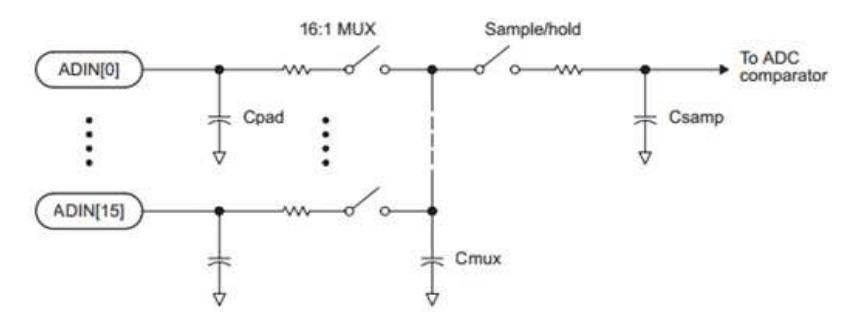

**Figure 8-2. ADC12 Input Impedance Model**

<span id="page-298-1"></span>The first portion is a 16-to-1 multiplexer that selects the channel to be converted. The second portion is the sample and hold circuit that is controlled by the control block of ADC12. There are several factors to be considered in the ADC input path: the resistance of the CMOS switches and the capacitances associated with them; the leakage resistance, and the sample and hold capacitance.

The external components are also to be considered. [Figure](#page-298-2) 8-3 shows the ADC input model of one channel containing the external circuit and the source impedance.

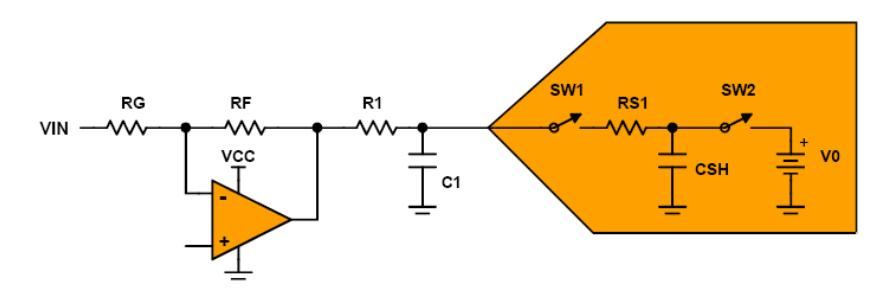

<span id="page-298-2"></span>**Figure 8-3. ADC Input Impedance Model Containing External Circuits**


# <span id="page-299-0"></span>**8.2 ADC12 Impedance vs. Sampling Frequency Data**

The ADC12 channel impedance measurement setup is shown in [Figure](#page-299-1) 8-4. Two 1Mohm resistors are connected as a voltage divider. Vsource is 2V DC. The ADC channel impedance is modeled as Z and in parallel with R2. The value of Z is calculated based on the voltage measured at node A. No external filtering capacitance is added to the ADC input channel.

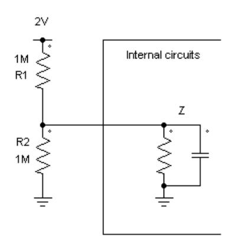

**Figure 8-4. Impedance Test Setup**

<span id="page-299-1"></span>The ADC12 channel input impedance vs. sampling frequency data is shown in the [Figure](#page-299-2) 8-5. At highest sampling frequency that UCD3138 ADC12 can, the input impedance is around 300kohm; at a sampling frequency of below 150kHz, the channel impedance is above 3Mohm. This data can be used as a general guideline of designing proper input R for the UCD3138 ADC12, or determine a proper operation frequency for a given R.

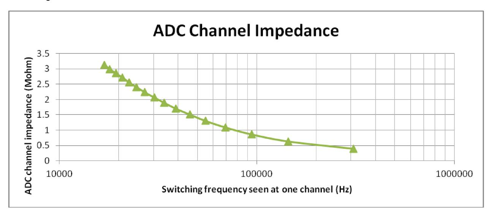

**Figure 8-5. ADC12 Channel Impedance**

<span id="page-299-2"></span>Generally, ADC conversion should be done after the voltage on the S/H capacitor is charged up to less than 1/2 LSB error. But at high conversion speed and in the condition of large external R, it can be difficult to charge the S/H capacitor to within 1/2 LSB error in the allotted conversion time. That's the reason we see impedance rolls off.


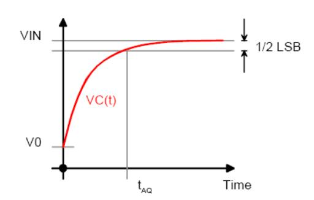

**Figure 8-6. S/H Capacitor Charge vs. Settling Time**

# <span id="page-300-2"></span><span id="page-300-0"></span>**8.3 Effect of External Capacitance**

The above experiment measures DC voltage without external filtering capacitor. In this chapter, the effect of external capacitance is discussed. It is obvious that the external capacitor affects the cutoff frequency of the first order filter; and this cut off frequency should be determined by the frequency range of the interested signal. But it may not be obvious that the external C also plays the role in adjusting the source impedance and should be determined by the sampling frequency of the ADC as well.

Take the above experiment setup as an example; if an external capacitor is added as shown in [Figure](#page-300-3) 8-7, the external impedance becomes smaller. Thus, larger external capacitance helps reducing the charge time and makes the measurement more accurate.

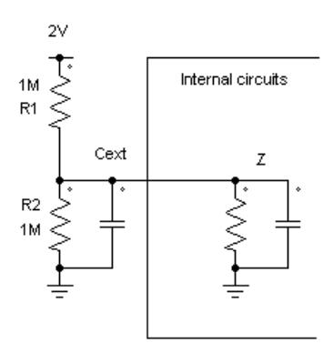

**Figure 8-7. External Capacitance Makes Lower Source Impedance**

# <span id="page-300-3"></span><span id="page-300-1"></span>**8.4 Channel to Channel Crosstalk**

<span id="page-300-4"></span>The 16 multiplexed ADC channels share the same S/H capacitor. Channel to channel crosstalk is negligible when source impedance and sampling frequency are low. But when source impedance is high, channel to channel crosstalk can be observed easily.

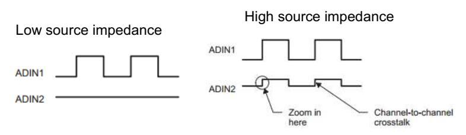

**Figure 8-8. Channel to Channel Crosstalk**


# <span id="page-301-0"></span>**8.5 Impedance Roll-Off Due to Crosstalk**

Except for the external and internal RC values, the initial charge V0 on the S/H capacitor also affects the time needed to charge the S/H capacitor to the desired voltage level. If the source impedance is high, there is a large time constant for the S/H capacitor to discharge. Thus the voltage remaining on the S/H capacitor will affect the next conversion.

Generally, for UCD3138, several ADC channels are used for different monitoring purposes. When designing the ADC input circuit, it is highly recommended to avoid high impedance node, because high impedance node may result in extra impedance roll-offs due to crosstalk.

# <span id="page-301-1"></span>**8.6 ADC12 Control FSM**

The ADC12 control Finite State Machine (FSM) module controls the conversion, sequencing and storing of converted ADC data based on the configuration set by firmware. Conversions are controlled by the FSM and initiated based on the selected trigger reference. Modes of operation for ADC12 conversion are highly configurable to suit the desired application.

# <span id="page-301-2"></span>**8.7 Conversion**

The ADC conversion is controlled by the ADC12 FSM that provides all the necessary control signals for the successive approximation register (SAR) ADC operation. The binary search algorithm, sampling time and bit timing are controlled by the state machine based on firmware configuration. 8 sample and hold timing configurations are provided to run the ADC12 at various sampling frequencies.

Address 0x00040000

**Figure 8-9. ADC Control Register (ADCCTRL)**

<span id="page-301-3"></span>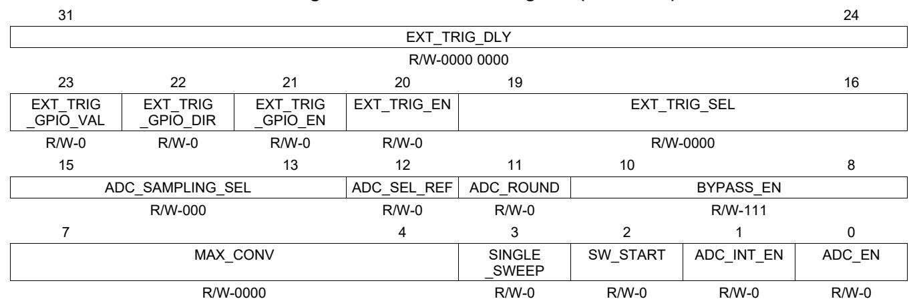

LEGEND: R/W = Read/Write; R = Read only; -*n* = value after reset

**NOTE:** Even though the ADC12 sampling frequency is preset to 267 Ksps as default by setting the ADC\_SAMPLINGSEL to zero, in order to achieve the best measurement results it is recommended to set the sampling rate to 267 Ksps by setting the ADC\_SAMPLINGSEL to 6:

AdcRegs.ADCCTRL.bit.ADC\_SAMPLINGSEL = 6; // Means: ADC sampling rate is set to 267 KS/s


[www.ti.com](http://www.ti.com) *Sequencing*

# <span id="page-302-0"></span>**8.8 Sequencing**

The ADC12 FSM can "auto-sequence" up to 16 conversions of any combination of ADC channels in a single sequence configuration. The result of each conversion is stored into 16 ADC result registers, representing the raw ADC data. The desired ADC channel for each sequenced conversion is programmed into the ADC sequence select registers. Any of the 16 ADC channels can be programmed into one of the conversion slots configured by the ADC Sequence Select Registers. Also, it is possible to program the same ADC channel into multiple or all of the conversion slots for a given sequence. The conversion sequence always starts with the programmed ADC channel in ADC Sequence Select Register 0 (Bits 3:0). Conversions will continue until the configured number of maximum conversions is reached.

The sequencer can be triggered by the firmware or through a multitude of external trigger sources. The external trigger sources include the rising edge of any DPWM output, any of the 7 Analog Comparator results or the external ADC\_EXT\_TRIG pin (allowing trigger from off device). Additionally, the sequencer can be configured to perform a single sequence or continually start the sequence of the external trigger source. The sequencer can also be enabled to generate an interrupt to the embedded processor at the end of a sequence.

The start of the sequencer can be delayed from the receipt of an external trigger. A counter within the ADC12 Control Finite State Machine will delay the start of the sequence based on a programmable delay configured by firmware. After the delay, the sequencer will start the conversions. For example, in order to initiate a sequence of measurements 128nS after the ADC\_EXT\_TRIG pin trips, the following setting should be applied.

```
AdcRegs.ADCCTRL.bit.EXT_TRIG_SEL = 8; // ADC_EXT_TRIG pin triggers the conversion
AdcRegs.ADCCTRL.bit.EXT_TRIG_DLY = 8; // 8 times 16 ns delay after the pin toggling
AdcRegs.ADCCTRL.bit.EXT_TRIG_EN = 1; // Enable ADC-12 triggering via external sources
```

Channel Mapping - The ADC12 is utilized to measure both internal and external voltage signals. The 16 inputs to the ADC12 block are referred to by channel numbers. 14 of the ADC Channels are connected to external pins. The remaining 2 channels are tied to an internal temperature sensor and an internal test channel. The following table details the channel mapping utilized on UCD3138.

| Channel Number | Internal/External Signal | Description                           |
|----------------|--------------------------|---------------------------------------|
| 0              | AD-00                    | GP Analog Input to ADC12              |
| 1              | AD-01                    | GP Analog Input to ADC12              |
| 2              | AD-02                    | GP Analog Input to ADC12              |
| 3              | AD-03                    | GP Analog Input to ADC12              |
| 4              | AD-04                    | GP Analog Input to ADC12              |
| 5              | AD-05                    | GP Analog Input to ADC12              |
| 6              | AD-06                    | GP Analog Input to ADC12              |
| 7              | AD-07                    | GP Analog Input to ADC12              |
| 8              | AD-08                    | GP Analog Input to ADC12              |
| 9              | AD-09                    | GP Analog Input to ADC12              |
| 10             | AD-10                    | GP Analog Input to ADC12              |
| 11             | AD-11                    | GP Analog Input to ADC12              |
| 12             | AD-12                    | GP Analog Input to ADC12              |
| 13             | AD-13                    | GP Analog Input to ADC12              |
| 14             | Temp Sensor              | Internal Temperature Sensor           |
| 15             | Test Channel             | Internal Test Channel (Test Use Only) |


*Digital Comparators* [www.ti.com](http://www.ti.com)

# <span id="page-303-0"></span>**8.9 Digital Comparators**

The ADC12 control module provides 6 Digital comparators that can be utilized to compare either raw ADC data or averaged ADC data against programmable high and low thresholds. The first 6 conversion result registers (ADC Result Registers 0-5) or the first 6 conversion averaged result registers (ADC Averaged Result Registers 0-5) of the ADC sequence are tied to the 6 Digital Comparators. Therefore, for any signals requiring auto limit monitoring, the user must use these 6 ADC conversion slots for monitoring of those signals. All 12 bits of conversion result are used for comparison. The Digital Comparators provide 12 status bits for monitoring, two from each ADC result comparison. These status bits indicate whether the ADC result is higher or equal to the Limit High threshold or if it is lower or equal to the Limit Low threshold.

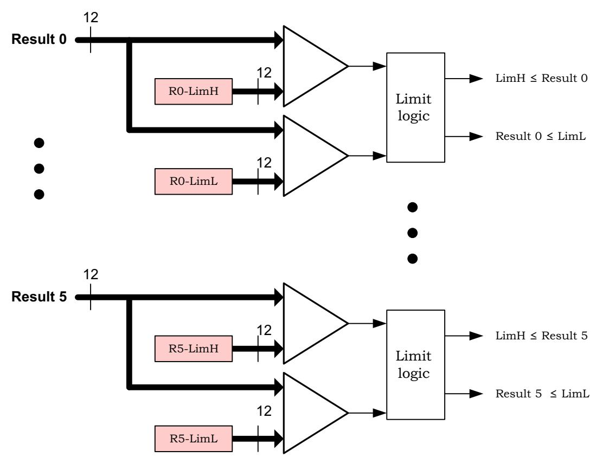

**Figure 8-10. UCS3138 Digital Comparators Control Block Diagram**

<span id="page-303-1"></span>**NOTE:** The ADCCOMPRESULT provide both raw (non-latched) and latched comparator output results. There is no need to enable the bits DCOMPx\_LO\_INT\_EN or DCOMPx\_UP\_INT\_EN in order for the DCOMPx\_LO\_INT or DCOMPx\_UP\_INT to trip.

The latched results are clear on read and the first read of the ADCCOMPRESULT will clear all latched values. For example, both statements below will clear all of the latched results.

```
int scrap;
scrap = AdcRegs.ADCCOMPRESULT.all;
or
scrap = AdcRegs.ADCCOMPRESULT.bit.DCOMP3_LO_INT;
```


[www.ti.com](http://www.ti.com) *ADC Averaging*

### <span id="page-304-0"></span>**8.10 ADC Averaging**

The ADC12 control provides capability for averaging of ADC results. The averaging module utilizes a modified moving average (**MMA**) algorithm, to reduce hardware resources and avoid the need to store up to 32 ADC samples per result. Averaging is provided on the first 6 result registers (ADC Result Register 0- 5). Averaged ADC results can be read by firmware in the ADC Averaged Result Registers following completion of an ADC conversion sequence.

Modified Moving Average (**MMA**) algorithm is a type of IIR filter defined by the following equation: Y[n] = X[n] / N + Y[n - 1]\*(N - 1) / N

### where

- X[n] is the new sample
- Y[n] is the average value
- N is the number of averaged samples (5)

Firmware can select from 4 options for ADC averaging (4X, 8X, 16X, 32X):

- 4-sample moving average: 1/4 of current sample and 3/4 of previous average
- 8-sample moving average: 1/8 of current sample and 7/8 of previous average
- 16-sample moving average: 1/16 of current sample and 15/16 of previous average
- 32-sample moving average: 1/32 of current sample and 31/32 of previous average

The averaging result register is stored immediately following the calculation of the moving average. Upon receipt of the next ADC sample, the ADC sample value and current moving average are used for calculation of the next moving average. In addition, 5 fractional bits from the moving average calculation are stored for use in the next moving average calculation. These fractional bits ensure better accuracy of the moving average over time.

**NOTE:** No oversampling or decimation is used during the averaging process. The average value is calculated over several separate consecutive sequences of conversion. Therefore the non averaged result is always more responsive than the averaged result.

# <span id="page-304-1"></span>**8.11 Temperature Sensor**

The ADC-12's channel-14 is internally connected to a temperature sensor. The internal sensor may be used for purposes like overtemperature protection and/or temperature compensation of control related parameters like voltage reference or switching frequency. Some applications may require additional external temperature sensor/s for measurement of switching stage temperature/s and for copper trace current sensing temperature compensation.

In order to activate the internal temperature sensor the following bit in TEMPSENCTRL register at [Chapter](#page-296-1) 8 need to be cleared.

MiscAnalogRegs.TEMPSENCTRL.bit.TEMP\_SENSE\_DIS = 0;


# <span id="page-305-0"></span>**8.12 Temp Sensor Control Register (TEMPSENCTRL)**

Address FFF7F02C

### **Figure 8-11. Temp Sensor Control Register (TEMPSENCTRL)**

<span id="page-305-1"></span>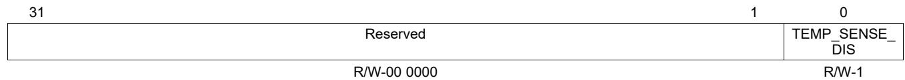

LEGEND: R/W = Read/Write; R = Read only; -*n* = value after reset

### **Table 8-1. Temp Sensor Control Register (TEMPSENCTRL) Register Field Descriptions**

<span id="page-305-2"></span>

| Bit  | Field              | Type | Reset   | Description                                                                                               |
|------|--------------------|------|---------|-----------------------------------------------------------------------------------------------------------|
| 31-1 | Reserved           | R/W  | 00 0000 |                                                                                                           |
| 0    | TEMP_SENSE_<br>DIS | R/W  | 1       | Temperature Sensor Disable<br>0 = Enables Temperature Sensor<br>1 = Disables Temperature Sensor (Default) |

#### **CAUTION**

Writing into the reserved bits is NOT RECOMMENDED since it is likely to have an adverse effect on the normal operation of Temperature Sensor. In the process of Clearing (or setting) the **TEMP\_SENSE\_DIS** bit, the other bits in the register need to remain intact. Therefore it is recommended to use a readmodify-write technique to clear or set this bit.


[www.ti.com](http://www.ti.com) *PMBus Addressing*

# <span id="page-306-0"></span>**8.13 PMBus Addressing**

UCD3138 offers two constant current sources for excitation of resistors used for setting the PMBus address, as shown in [Figure](#page-307-1) 8-13. The two current sources are connected to CH-0 and CH-1 of ADC-12 and are disabled as default. The nominal current is preset to 10 µA.

To activate these current sources the following bits in PMBCTRL3 register in PMBUS registers section need to be set.

```
PMBusRegs.PMBCTRL3.bit.IBIAS_A_ENA = 1;
PMBusRegs.PMBCTRL3.bit.IBIAS_B_ENA = 1;
```

# <span id="page-306-1"></span>*8.13.1 PMBus Control Register 3 (PMBCTRL3)*

Address FFF7F620

### **Figure 8-12. PMBus Control Register 3 (PMBCTRL3)**

<span id="page-306-2"></span>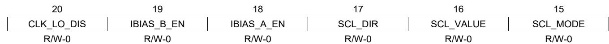

LEGEND: R/W = Read/Write; R = Read only; -*n* = value after reset

# **Table 8-2. PMBus Control Register 3 (PMBCTRL3) Register Field Descriptions**

<span id="page-306-3"></span>

| Bit | Field      | Type | Reset | Description                                                                                                                                                                     |
|-----|------------|------|-------|---------------------------------------------------------------------------------------------------------------------------------------------------------------------------------|
| 20  | CLK_LO_DIS | R/W  | 0     |                                                                                                                                                                                 |
| 19  | IBIAS_B_EN | R/W  | 0     | PMBus Current Source B Control<br>0 = Disables Current Source for PMBUS address detection thru ADC (Default)<br>1 = Enables Current Source for PMBUS address detection thru ADC |
| 18  | IBIAS_A_EN | R/W  | 0     | PMBus Current Source A Control<br>0 = Disables Current Source for PMBUS address detection thru ADC (Default)<br>1 = Enables Current Source for PMBUS address detection thru ADC |
| 17  | SCL_DIR    | R/W  | 0     |                                                                                                                                                                                 |
| 16  | SCL_VALUE  | R/W  | 0     |                                                                                                                                                                                 |
| 15  | SCL_MODE   | R/W  | 0     |                                                                                                                                                                                 |


*Dual Sample and Hold* [www.ti.com](http://www.ti.com)

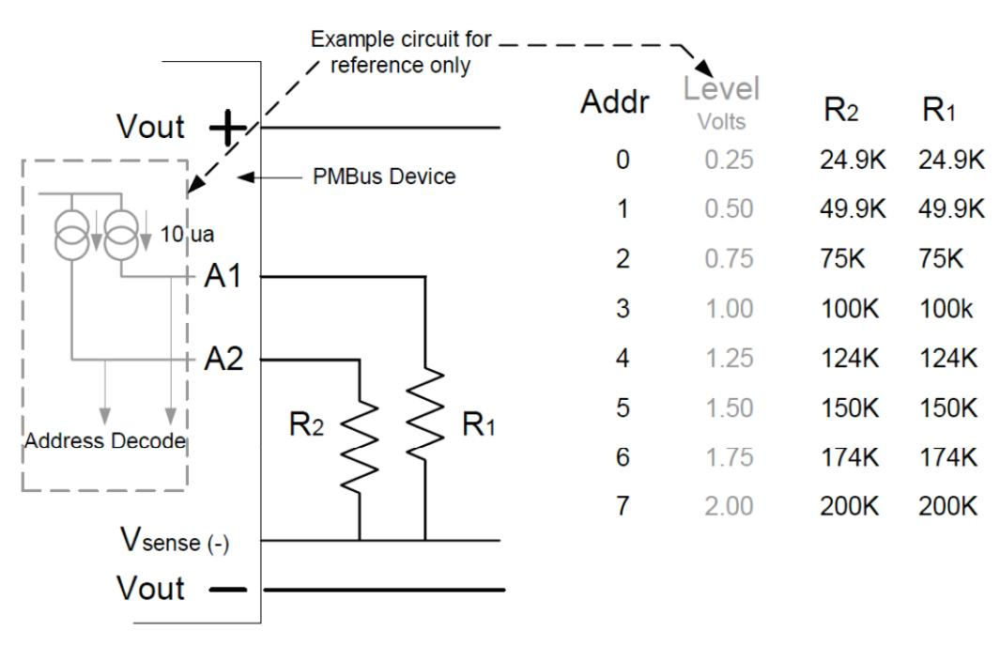

**Figure 8-13. PMBus Addressing**

# <span id="page-307-1"></span><span id="page-307-0"></span>**8.14 Dual Sample and Hold**

The Dual Sample and Hold is primarily designed to support accurate measurement of electrical power in AC/DC converters. Sampling of both current and voltage signal simultaneously will provide no delay in the measurement sequence in order to increase the measurement precision. This feature can be turned on via clearing of bit-8 through bit-10 in ADCCTRL register. It is worth noting that this mechanism can not hold more than a single voltage at a time.

The operation and configuration of Dual sample and hold is as follows:

- Dual sample and hold provides simultaneous sampling of two ADC inputs. This is simply done by sampling and holding one channel exactly at the time a second channel is sampled for conversion and converting the sample and hold channel at a later event in the current measurement sequence.
- Channels 2, 1 and 0 are the ONLY channels with sample and hold capability. These channels can be sampled simultaneously with certain other "converting channels".
- Only One "Dual sample and hold channel" can be selected per ADC sequence. Selection of this single channel is controlled by bypass firmware controlled bits and shown in [Table](#page-307-2) 8-3. In other words only one of the channels (0, 1 and 2) can be held for upcoming "Dual Sample Measurement".

**Table 8-3. Selection of "Dual Sample and Hold" Channel**

<span id="page-307-2"></span>

| BYPASS_EN[2] | BYPASS_EN[1] | BYPASS_EN[0] | BYPASS_EN[2:0] value<br>in hex | Selected Dual<br>Sample/Hold Channel |
|--------------|--------------|--------------|--------------------------------|--------------------------------------|
| 1            | 1            | 0            | 0x6                            | Channel 0                            |
| 1            | 0            | 1            | 0x5                            | Channel 1                            |
| 0            | 1            | 1            | 0x3                            | Channel 2                            |


[www.ti.com](http://www.ti.com) *Dual Sample and Hold*

- From this table, it can be seen that the location of the "moving zero" determines the number of selected channel. Since only one channel at a time can be selected, the only valid values for BYPASS\_EN[2:0] are 6, 5 and 3.
- The "Dual Sampled Channel" must be placed in the sequence anywhere after the "converting channel".
- Simultaneous sampling of the "Converted channel" with the "sample and hold channel" is determined by setting the bits SEQ0\_SH, SEQ2\_SH and SEQ04\_SH in ADCSEQSEL registers. For example if SEQ4\_SH is set, then one of the channels (0, 1 or 2) will be sampled together with channel 4 sampling time.
- Only channels CH0, CH2 and CH4 can be selected as "Converting channels" in UCD3138. Therefore setting of SEQx\_SH bits on any channel other than CH-0, CH-2 and CH-4 is not effective.

# <span id="page-308-0"></span>*8.14.1 ADC Control Register (ADCCTRL)*

Address 0x00040000

**Figure 8-14. ADC Control Register (ADCCTRL)**

<span id="page-308-2"></span>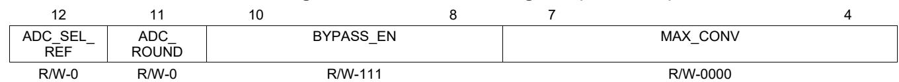

LEGEND: R/W = Read/Write; R = Read only; -*n* = value after reset

### **Table 8-4. ADC Control Register (ADCCTRL) Register Field Descriptions**

| Bit  | Field       | Type | Reset | Description                                                                                                                                                                                                                                                 |
|------|-------------|------|-------|-------------------------------------------------------------------------------------------------------------------------------------------------------------------------------------------------------------------------------------------------------------|
| 12   | ADC_SEL_REF | R/W  | 0     |                                                                                                                                                                                                                                                             |
| 11   | ADC_ROUND   | R/W  | 0     |                                                                                                                                                                                                                                                             |
| 10-8 | BYPASS_EN   | R/W  | 111   | Bypasses the dual sample and hold circuitry, Bit 10 controls ADC Channel 2, Bit 9<br>controls ADC Channel 1 and Bit 8 controls ADC Channel 0<br>0 = Enables the Dual Sample and Hold circuitry<br>1 = Disables the Dual Sample and Hold circuitry (Default) |
| 7-4  | MAX_CONV    | R/W  | 0000  |                                                                                                                                                                                                                                                             |

#### <span id="page-308-1"></span>**8.15 Usage of Sample and Hold Circuitry for High Impedance Measurement**

In UCD3138, there is another solution to this problem: use dual sample and hold circuitry. The dual sample and hold circuitry are designed to enable the sampling of two channels together, thus it's suitable for power measurement, which requires that the sampling of voltage and current are in phase. There is only one conversion unit in UCD3138 ADC. But there are two S/H units to enable dual sample and hold function. The first one is the normal one we used for all channels. The second one shown in [Figure](#page-309-0) 8-15 is the dual sample and hold S/H. If dual sample and hold function is enabled, two S/H units will work simultaneously. There is an S/H buffer inside the circuitry which makes the source impedance much lower. Thus this circuitry can be used for high impedance node measurement as well.

SEQx = y selects channel y to be converted in sequence x of the first S/H unit.

SEQx\_SH = 1 enables the dual sample and hold S/H to sample at the same time as channel y.

BYPASS\_EN selects the dual sample and hold channel. This register has 3 bits. 1 means bypass and 0 means connect to the S/H buffer. As shown in [Figure](#page-309-0) 8-15.


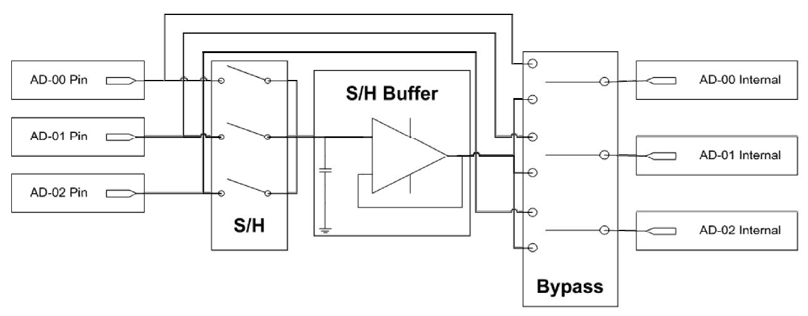

**Figure 8-15. Dual Sample and Hold Circuitry in ADC12**

<span id="page-309-0"></span>[Figure](#page-309-1) 8-16 shows the ADC12 dual sample and hold configuration table and operation principles.

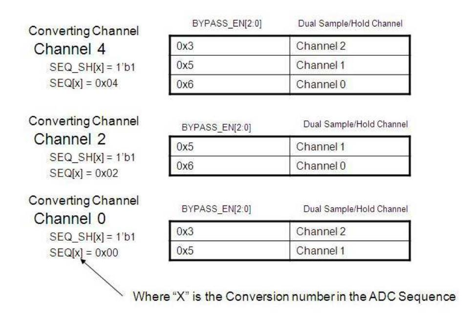

**Figure 8-16. ADC12 Dual Sample and Hold Configuration**

<span id="page-309-1"></span>Here is an application example:

To use AD01 on high impedance node:

```
BYPASS_EN = 5; // select AD01 as dual sample and hold channel. A buffer will be added to AD01
SEQ0 = 4; //put AD04 on sequence 0
SEQ0_SH = 1; //enable AD04 to do dual sample and hold with AD01
SEQ1 = 1; //put AD01 on sequence1
```


# <span id="page-310-0"></span>*8.15.1 C Code Example*

The following example code demonstrates how to configure the ADC 12 for dual sample and hold operation. In this example AD04 and AD00 are configured to measure simultaneously.

```
void init_ADC_polled(void)
{
  AdcRegs.ADCCTRL.bit.MAX_CONV = 2; // A total of 3 measurements
  AdcRegs.ADCCTRL.bit.SINGLE_SWEEP = 1;
  AdcRegs.ADCCTRL.bit.ADC_EN = 1;
  AdcRegs.ADCSEQSEL0.bit.SEQ0 = 4; // First measure AD04
  AdcRegs.ADCSEQSEL0.bit.SEQ1 = 3; // Second measure AD03
  AdcRegs.ADCSEQSEL0.bit.SEQ2 = 0; // Third measure AD00
  AdcRegs.ADCSEQSEL0.bit.SEQ0_SH = 1;
  // Sample and Hold AD04 for simultaneous measurement with a following channel
  AdcRegs.ADCCTRL.bit.BYPASS_EN = 6;
  // 6 is "110 in binary", which means AD00 is the
  // following/Converting channel that is measured together with AD04
}
```

# <span id="page-310-1"></span>**8.16 ADC Configuration Examples**

# *8.16.1 Software Initiated Conversions*

The following example code demonstrates how to configure ADC12 to initiate a sequence of conversions triggered by software.

Requirement: 10 conversions need to be sequenced during a single session with triggering done via firmware. The required channels are as follows: Conversions = 09, 10, 02, 02, 02, 04, 04, 04, 12 and 14. Here the maximum number of conversion is set to 9 and the ADC Sequence Select Register is configured to:

|           | Bits  | Field Name | Channel Select Value |
|-----------|-------|------------|----------------------|
|           | 4:0   | SEQ00      | 9                    |
| SEQCHSEL0 | 9:5   | SEQ01      | 10                   |
|           | 14:10 | SEQ02      | 2                    |
|           | Bits  | Field Name | Channel Select Value |
|           | 4:0   | SEQ03      | 2                    |
| SEQCHSEL1 | 9:5   | SEQ04      | 2                    |
|           | 14:10 | SEQ05      | 4                    |
|           | Bits  | Field Name | Channel Select Value |
|           | 4:0   | SEQ06      | 4                    |
| SEQCHSEL2 | 9:5   | SEQ07      | 4                    |
|           | 14:10 | SEQ08      | 12                   |
|           | Bits  | Field Name | Channel Select Value |
|           | 4:0   | SEQ09      | 14                   |
| SEQCHSEL3 | 9:5   | SEQ10      | X                    |
|           | 14:10 | SEQ11      | X                    |

A conversion session is initiated by firmware writing to the software start bit (SW\_START) in the ADC control register. When the sequence completes all the requested conversions, the sequencer sits idle waiting for another software start bit transition from 0 to 1. The conversion results are placed in the ADC result buffers.


| Buffer Registers | ADC Conversion Result |
|------------------|-----------------------|
| RESULT-00        | ADC-09                |
| RESULT-01        | ADC-10                |
| RESULT-02        | ADC-02                |
| RESULT-03        | ADC-02                |
| RESULT-04        | ADC-02                |
| RESULT-05        | ADC-04                |
| RESULT-06        | ADC-04                |
| RESULT-07        | ADC-04                |
| RESULT-08        | ADC-12                |
| RESULT-09        | ADC-14                |
| RESULT-10        | X                     |
| RESULT-11        | X                     |
| RESULT-12        | X                     |
| RESULT-13        | X                     |
| RESULT-14        | X                     |
| RESULT-15        | X                     |

# <span id="page-311-0"></span>*8.16.2 Single Sweep Operation*

The following example code demonstrates how to configure (initialize) the ADC-12 for a start stop software initiated operation.

Requirement: Configure the ADC-12 in single weep mode and then periodically read the conversion results and start a new measurement sequence immediately after the read of results.

The function init\_ADC\_polled(); configures the number of conversions in a single sweep sequence, sets the order of channels within the sequence and configures the post conversion averaging setting for each measurement.

```
void init_ADC_polled(void)
{
 AdcRegs.ADCCTRL.bit.MAX_CONV = 6; // A total of 7 conversions
 AdcRegs.ADCCTRL.bit.SINGLE_SWEEP = 1;
 AdcRegs.ADCCTRL.bit.ADC_EN = 1;
 AdcRegs.ADCSEQSEL0.bit.SEQ0 = 3; // Vout-AD03
 AdcRegs.ADCSEQSEL0.bit.SEQ1 = 2; // Iout-AD02
 AdcRegs.ADCSEQSEL0.bit.SEQ2 = 4; // Ipri-AD04
 AdcRegs.ADCSEQSEL0.bit.SEQ3 = 5; // Ishare-AD05
 AdcRegs.ADCSEQSEL1.bit.SEQ4 = 6; // Vin voltage sensing
 AdcRegs.ADCSEQSEL1.bit.SEQ5 = 7; // Copper-Temp-AD12
 AdcRegs.ADCSEQSEL1.bit.SEQ6 = 8; // Ext-Temp-AD08
 AdcRegs.ADCAVGCTRL.bit.AVG0_CONFIG = 2; // Average 16 samples
 AdcRegs.ADCAVGCTRL.bit.AVG0_EN = 1; // Module0 averaging enabled
 AdcRegs.ADCAVGCTRL.bit.AVG1_CONFIG = 2; // Average 16 samples
 AdcRegs.ADCAVGCTRL.bit.AVG1_EN = 1; // Module1 averaging enabled
 AdcRegs.ADCAVGCTRL.bit.AVG2_CONFIG = 2; // Average 16 samples
 AdcRegs.ADCAVGCTRL.bit.AVG2_EN = 1; // Module2 averaging enabled
 AdcRegs.ADCAVGCTRL.bit.AVG3_CONFIG = 2; // Average 16 samples
 AdcRegs.ADCAVGCTRL.bit.AVG3_EN = 1; // Module3 averaging enabled
 AdcRegs.ADCAVGCTRL.bit.AVG4_CONFIG = 2; // Average 16 samples
 AdcRegs.ADCAVGCTRL.bit.AVG4_EN = 1; // Module4 averaging enabled
 AdcRegs.ADCAVGCTRL.bit.AVG5_CONFIG = 2; // Average 16 samples
 AdcRegs.ADCAVGCTRL.bit.AVG5_EN = 1; // Module5 averaging enabled
}
```

The function poll\_adc(); is reading the measurement results after it verifies that the conversion of last sequence is concluded. The function also starts a new sequence of measurements that can be read when the function is called next time.


#### **NOTE:** The raw (not averaged) result of AD07 is being read here.

```
void poll_adc(void)
{
   if(AdcRegs.ADCSTAT.bit.ADC_INT == 1) //If the conversion isn't complete
   {
          adc_values.Vout = AdcRegs.ADCAVGRESULT[0].bit.RESULT; // AD01
          adc_values.isec = AdcRegs.ADCAVGRESULT[1].bit.RESULT; // AD02
          adc_values.i_pri = AdcRegs.ADCAVGRESULT[2].bit.RESULT; // AD04
          adc_values.ishare = AdcRegs.ADCAVGRESULT[3].bit.RESULT; // AD05
          adc_values.Vin = AdcRegs.ADCAVGRESULT[4].bit.RESULT; // AD05
                   adc_values.current_temp = AdcRegs.ADCAVGRESULT[5].bit.RESULT; // AD12
                   adc_values.temp_sense = AdcRegs.ADCRESULT[6].bit.RESULT; // AD07
            }
   AdcRegs.ADCCTRL.bit.SW_START = 1; // trigger anew measurement sequence
}
```

Now poll\_adc(); can be called from any part of the code that is periodically executed. In this example the function call is placed in the standard interrupt which is invoked by a timer interrupt in 100µs intervals. Since conversion of a sequence of 6 measurements will require less than 30µs, the verification of end of conversion is not really required.

```
#pragma INTERRUPT(standard_interrupt,IRQ)
void standard_interrupt(void)
{
    poll_adc();
}
```

# <span id="page-312-0"></span>*8.16.3 Auto-Triggered Conversions*

A conversion sequence may also be initiated via external triggers without firmware initiation. Sources of external triggering include the DPWM outputs, the analog comparators and the ADC\_EXT\_TRIG pin. The sequencer operation is defined by the external trigger enable bit in the ADC Control Register. The single sweep bit can set the sequencer in one of two modes, (1) start/stop or (2) continuous conversion on the external trigger event. Some key points to note:

- Only one external trigger can be enabled
- A software trigger via the embedded processor is also regarded as a valid trigger
- If an external trigger event occurs but the current sequence has not been completed, the event is skipped until the next trigger event occurs when the sequencer is ready

# <span id="page-312-1"></span>*8.16.4 Continuous Conversions*

Here the sequencer is synchronized to a DPWM trigger separated in time. This operating mode is nothing more than the previous example, but with the sequencer allowed to be re-triggered without being reset to the initial state of seq00.

Requirement: Auto convert 6 currents (I<sup>1</sup> ,I2 ,…I<sup>6</sup> ) every 100us synchronized to the external trigger.

<span id="page-312-2"></span>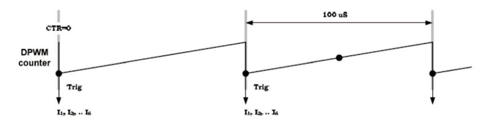

**Figure 8-17.**


The maximum number of conversions is set to 5 and the sequence select register is set as shown in the following table Note for convenience, I1, I2, ...etc are used to represent the sequence select value.

|            | Bits  | Field Name | Channel Select Value |
|------------|-------|------------|----------------------|
| SEQCHSEL0  | 4:0   | SEQ00      | I <sub>1</sub>       |
|            | 9:5   | SEQ01      | l <sub>2</sub>       |
|            | 14:10 | SEQ02      | l <sub>3</sub>       |
|            | Bits  | Field Name | Channel Select Value |
| SEOCHSEL 4 | 4:0   | SEQ03      | I <sub>4</sub>       |
| SEQCHSEL1  | 9:5   | SEQ04      | I <sub>5</sub>       |
|            | 14:10 | SEQ05      | I <sub>6</sub>       |
|            | Bits  | Field Name | Channel Select Value |
| SEOCHSEL 2 | 4:0   | SEQ06      | X                    |
| SEQCHSEL2  | 9:5   | SEQ07      | X                    |
|            | 14:10 | SEQ08      | X                    |
|            | Bits  | Field Name | Channel Select Value |
| SEQCHSEL3  | 4:0   | SEQ09      | X                    |
| SEQUESEL3  | 9:5   | SEQ10      | X                    |
|            | 14:10 | SEQ11      | X                    |

Once reset and initialized, the sequencer waits for an external trigger. At the 1st trigger, six conversions (sequence select values of  $SEQ00(I_1)$ ,  $SEQ01(I_2)$ ,  $SEQ02(I_3)$ ,  $SEQ03(I_4)$ ,  $SEQ04(I_5)$  and  $SEQ05(I_6)$ ) are performed. At the end of the auto-conversion session, the ADC result registers have the following values:

| Buffer Registers | ADC Conversion Result |
|------------------|-----------------------|
| RESULT-00        | I <sub>1</sub>        |
| RESULT-01        | I <sub>2</sub>        |
| RESULT-02        | I <sub>3</sub>        |
| RESULT-03        | I <sub>4</sub>        |
| RESULT-04        | I <sub>5</sub>        |
| RESULT-05        | I <sub>6</sub>        |

Note at this point, the sequencer remains at its current state waiting for another trigger.

#### 8.16.5 Start/Stop Operation (External Trigger)

Here the sequencer is synchronized to the start of an external trigger. At the end of the conversion sequence, when the maximum number of conversions has occurred, the sequencer performs only a single sweep of conversions.

Requirement: Automatically convert 4 voltages (V1/V2/V3/V4) every 100us synchronized to an external trigger. In this example, the maximum number of conversions is set to 3 and the sequence select registers are set as follows:

|           | Bits  | Field Name | Channel Select Value |
|-----------|-------|------------|----------------------|
| SEQCHSEL0 | 4:0   | SEQ00      | V <sub>1</sub>       |
|           | 9:5   | SEQ01      | $V_2$                |
|           | 14:10 | SEQ02      | $V_3$                |
|           | Bits  | Field Name | Channel Select Value |
| SEQCHSEL1 | 4:0   | SEQ03      | $V_4$                |
| SEQUISELI | 9:5   | SEQ04      | X                    |
|           | 14:10 | SEQ05      | X                    |


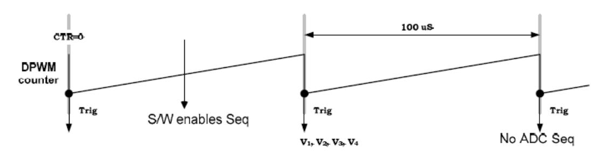

**Figure 8-18.**

# <span id="page-314-1"></span><span id="page-314-0"></span>**8.17 Useful C Language Statement Examples**

```
#define ADCCTRL_SINGLE_SWEEP 8
#define ADCCTRL_MAXCONV_SHIFT 4
#define ADCCTRL_ADC_ENA 1
#define ADCCOMPEN_COMP0_EN 1
#define ADCCOMPEN_COMP3_EN 8
#define ADCCOMPEN_COMP5_EN 0x20
int Temporary;
AdcRegs.ADCCTRL.all = ADCCTRL_SINGLE_SWEEP + (7 << ADCCTRL_MAXCONV_SHIFT) + ADCCTRL_ADC_ENA;
AdcRegs.ADCAVGCTRL.bit.AVG2_EN = 1;
// Means: Averaging on the result of the third measurement in the sequence is enabled
AdcRegs.ADCAVGCTRL.bit.AVG2_CONFIG = 2;
// Means: The third sequence result will undergo moving average of 16 samples
AdcRegs.ADCSEQSEL0.bit.SEQ0 = 15;
//Means that channel 15 (the very last input channel) is selected as the very first measurement
in the measurement sequence.
AdcRegs.ADCSEQSEL1.all = 5 + (6 << 5) + (7 << 10)
//Means, the channels 5, 6 and 7 are set to be the fifth, sixth and the seventh (SEQ4 to SEQ6)
respectively in the measurement sequence.
AdcRegs.ADCCTRL.bit.SW_START = 1;
//Means; the ADC is instructed to start a new conversion sequence
AdcRegs.ADCCTRL.bit.ADC_INT_EN = 1; // Means: enable interrupt at local ADC level
CimRegs.REQMASK.bit.REQMASK_ADC_CONV =1; // Means: Enable ADC interrupt at CPU level.
if (AdcRegs.ADCSTAT.bit.ADC_INT == 1) // Means; if ADC measurement completed.
Temporary = AdcRegs.ADCCTRL.all; // Means :read and clear completion flags
Temporary = AdcRegs.ADCRESULT[3].all; // Read the fourth raw ( non averaged) result register
Temporary = AdcRegs.ADCAVGRESULT[0].all; // Read the first averaged result register
if (AdcRegs.ADCCOMPRESULT.bit.DCOMP0_LO_RAW == 1)
//Means: if the lower limit is exceeded on the first comparator
AdcRegs.ADCCOMPEN.all = ADCCOMPEN_COMP0_EN + ADCCOMPEN_COMP3_EN + ADCCOMPEN_COMP5_EN;
//Means : Enable the first, the fourth and the sixth digital comparators.
AdcRegs.ADCCOMPEN.bit.COMP5_EN = 1;
// Enable the sixth digital comparison mechanism
AdcRegs.ADCCOMPEN.bit.COMP4_DATA_SEL = 1;
//Means: The fifth comparator is configured to compare the average data from ADC12 and not the
raw data
```

AdcRegs.ADCCOMPEN.bit.COMP3\_UP\_INT\_EN = 1;


*ADC Registers* [www.ti.com](http://www.ti.com)

```
// Means: Enable Digital comparator 3 interrupt when exceeding upper limit at Local level
AdcRegs.ADCCOMPLIM[5].bit.LOWER_LIMIT = 0x0FA;
// Sets the lower limit to be compared to the sixth result register
//( Note: bit does not necessarily mean one bit, but a bits field of any length
CimRegs.REQMASK.bit. REQMASK_DIGI_COMP =1;
// Means: Enable Digital comparator interrupt at CPU(CIM) level.
```

# <span id="page-315-0"></span>**8.18 ADC Registers**

# <span id="page-315-1"></span>*8.18.1 ADC Control Register (ADCCTRL)*

Address 00040000

**Figure 8-19. ADC Control Register (ADCCTRL)**

<span id="page-315-2"></span>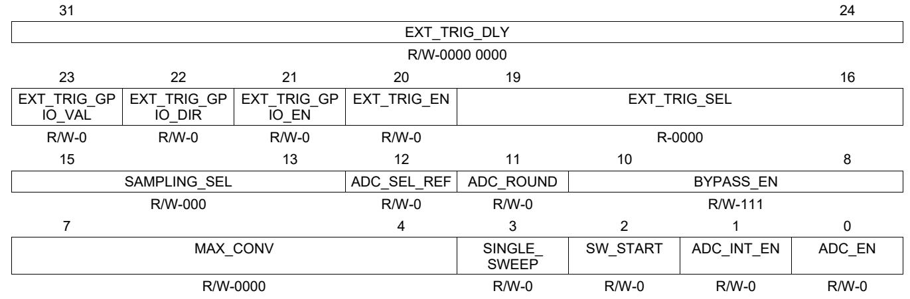

**Table 8-5. ADC Control Register (ADCCTRL) Register Field Descriptions**

| Bit   | Field                 | Type | Reset        | Description                                                                                                                                                                                                           |
|-------|-----------------------|------|--------------|-----------------------------------------------------------------------------------------------------------------------------------------------------------------------------------------------------------------------|
| 31-24 | EXT_TRIG_DLY          | R/W  | 0000<br>0000 | 8-bit External ADC Trigger Delay configuration, LSB bit resolution equals period of<br>ADC Clock (High Frequency Oscillator Frequency divided by 4)                                                                   |
| 23    | EXT_TRIG_GPIO_<br>VAL | R/W  | 0            | Output value of ADC_EXT_TRIG pin when configured in GPIO mode<br>0 = ADC_EXT_TRIG pin driven low (Default)<br>1 = ADC_EXT_TRIG pin driven high                                                                        |
| 22    | EXT_TRIG_GPIO_<br>DIR | R/W  | 0            | Direction of ADC_EXT_TRIG pin when configured in GPIO mode<br>0 = ADC_EXT_TRIG pin configured as input (Default)<br>1 = ADC_EXT_TRIG pin configured as output                                                         |
| 21    | EXT_TRIG_GPIO_<br>EN  | R/W  | 0            | Configuration of ADC_EXT_TRIG pin<br>0 = ADC_EXT_TRIG pin configured in functional mode (Default)<br>1 = ADC_EXT_TRIG pin configured in GPIO mode                                                                     |
| 20    | EXT_TRIG_EN           | R/W  | 0            | External Trigger Enable, conversions are started using the external trigger as<br>selectable by the EXT_TRIG_SEL bits.<br>0 = Disable External Trigger capability (Default)<br>1 = Enable External Trigger capability |


[www.ti.com](http://www.ti.com) *ADC Registers*

### **Table 8-5. ADC Control Register (ADCCTRL) Register Field Descriptions (continued)**

| Bit   | Field        | Type | Reset | Description                                                                                                               |
|-------|--------------|------|-------|---------------------------------------------------------------------------------------------------------------------------|
| 19-16 | EXT_TRIG_SEL | R    | 0000  | Selects which external trigger can start a conversion loop. 0 = HS Loop1 Event 1<br>(DPWMA Low Resolution Edge) (Default) |
|       |              |      |       | 1 = HS Loop1 Event 3 (DPWMB Low Resolution Edge)                                                                          |
|       |              |      |       | 2 = HS Loop2 Event 1 (DPWMA Low Resolution Edge)                                                                          |
|       |              |      |       | 3 = HS Loop2 Event 3 (DPWMB Low Resolution Edge)                                                                          |
|       |              |      |       | 4 = HS Loop3 Event 1 (DPWMA Low Resolution Edge)                                                                          |
|       |              |      |       | 5 = HS Loop3 Event 3 (DPWMB Low Resolution Edge)                                                                          |
|       |              |      |       | 6 = HS Loop4 Event 1 (DPWMA Low Resolution Edge)                                                                          |
|       |              |      |       | 7 = HS Loop4 Event 3 (DPWMB Low Resolution Edge)                                                                          |
|       |              |      |       | 8 = ADC_EXT_TRIG pin                                                                                                      |
|       |              |      |       | 9 = Analog Comparator A Output                                                                                            |
|       |              |      |       | A = Analog Comparator B Output                                                                                            |
|       |              |      |       | B = Analog Comparator C Output                                                                                            |
|       |              |      |       |                                                                                                                           |
|       |              |      |       | C = Analog Comparator D Output                                                                                            |
|       |              |      |       | D = Analog Comparator E Output                                                                                            |
|       |              |      |       | E = Analog Comparator F Output                                                                                            |
|       |              |      |       | F = Analog Comparator G Output                                                                                            |
| 15-13 | SAMPLING_SEL | R/W  | 000   | Defines ADC sampling and hold timing setup                                                                                |
|       |              |      |       | 111 = 1008KS/s                                                                                                            |
|       |              |      |       | 110 = 267KS/s                                                                                                             |
|       |              |      |       | 101 = 1008KS/s                                                                                                            |
|       |              |      |       | 100 = 538KS/s                                                                                                             |
|       |              |      |       | 011 = 504KS/s                                                                                                             |
|       |              |      |       | 010 = 744KS/s                                                                                                             |
|       |              |      |       | 001 = 744KS/s                                                                                                             |
|       |              |      |       | 000 = 267KS/s (Default)                                                                                                   |
| 12    | ADC_SEL_REF  | R/W  | 0     | ADC Voltage Reference Select                                                                                              |
|       |              |      |       | 0= Selects Internal ADC voltage reference (Default)                                                                       |
|       |              |      |       | 1 = Selects AVDD as ADC voltage reference                                                                                 |
| 11    | ADC_ROUND    | R/W  | 0     | Enables rounding of ADC Result to 10 bits                                                                                 |
|       |              |      |       |                                                                                                                           |
|       |              |      |       | 0 = ADC Results are not rounded (Default)<br>1 = ADC Results are rounded to 10 most significant bits                      |
|       |              |      |       |                                                                                                                           |
| 10-8  | BYPASS_EN    | R/W  | 111   | Bypasses the dual sample and hold circuitry, Bit 10 controls ADC Channel 5, Bit 9                                         |
|       |              |      |       | controls ADC Channel 3 and Bit 8 controls ADC Channel 1                                                                   |
|       |              |      |       | 0 = Enables the Dual Sample and Hold circuitry                                                                            |
|       |              |      |       | 1 = Disables the Dual Sample and Hold circuitry (Default)                                                                 |
| 7-4   | MAX_CONV     | R/W  | 0000  | Maximum number of conversion done in one conversion loop                                                                  |
|       |              |      |       | 0x0 = 1 conversion selection converted in the loop (Default)                                                              |
|       |              |      |       | 0xF = All 16 conversion selections converted in the loop                                                                  |
| 3     | SINGLE_SWEEP | R/W  | 0     | ADC Conversion Mode                                                                                                       |
|       |              |      |       | 0 = Continuous conversion loop runs (Default)                                                                             |
|       |              |      |       | 1 = Single conversion loop run                                                                                            |
| 2     | SW_START     | R/W  | 0     |                                                                                                                           |
|       |              |      |       | Firmware ADC Conversion Start, bit will be cleared automatically by hardware at end<br>of ADC conversion                  |
|       |              |      |       |                                                                                                                           |
|       |              |      |       | 0 = Conversions not initiated by firmware (Default)<br>1 = Initiate an ADC conversion loop                                |
| 1     | ADC_INT_EN   | R/W  | 0     |                                                                                                                           |
|       |              |      |       | End-of-conversion Interrupt Enable                                                                                        |
|       |              |      |       | 0 = Disable End-of-Conversion Interrupt (Default)                                                                         |
|       |              |      |       | 1 = Enable End-of-Conversion Interrupt                                                                                    |
| 0     | ADC_EN       | R/W  | 0     | ADC12 Enable Control                                                                                                      |
|       |              |      |       |                                                                                                                           |
|       |              |      |       | 0 = Disables ADC (Default)                                                                                                |


*ADC Registers* [www.ti.com](http://www.ti.com)

# <span id="page-317-0"></span>*8.18.2 ADC Status Register (ADCSTAT)*

Address 00040004

#### **Figure 8-20. ADC Status Register (ADCSTAT)**

<span id="page-317-1"></span>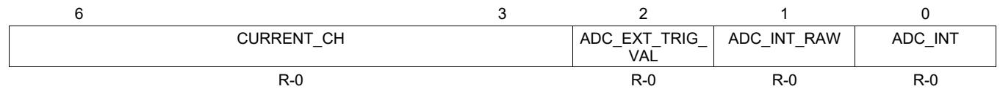

LEGEND: R/W = Read/Write; R = Read only; -*n* = value after reset

### **Table 8-6. ADC Status Register (ADCSTAT) Register Field Descriptions**

<span id="page-317-2"></span>

| Bit | Field                | Type | Reset | Description                                                                                                                               |
|-----|----------------------|------|-------|-------------------------------------------------------------------------------------------------------------------------------------------|
| 6-3 | CURRENT_CH           | R    | 0     | Register shows the currently converting channel                                                                                           |
| 2   | ADC_EXT_TRIG_<br>VAL | R    | 0     | ADC_EXT_TRIG pin value<br>0 = ADC_EXT_TRIG pin driven low<br>1 = ADC_EXT_TRIG pin driven high                                             |
| 1   | ADC_INT_RAW          | R    | 0     | End-of-conversion interrupt flag, raw version<br>0 = No End-of-conversion interrupt detected<br>1 = End-of-conversion interrupt found     |
| 0   | ADC_INT              | R    | 0     | End-of-conversion interrupt flag, latched version<br>0 = No End-of-conversion interrupt detected<br>1 = End-of-conversion interrupt found |


[www.ti.com](http://www.ti.com) *ADC Registers*

# <span id="page-318-0"></span>*8.18.3 ADC Test Control Register (ADCTSTCTRL)*

Address 00040008

#### **Figure 8-21. ADC Test Control Register (ADCTSTCTRL)**

<span id="page-318-1"></span>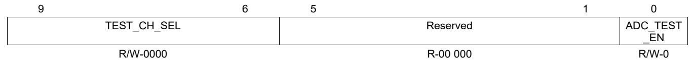

LEGEND: R/W = Read/Write; R = Read only; -*n* = value after reset

# **Table 8-7. ADC Test Control Register (ADCTSTCTRL) Register Field Descriptions**

<span id="page-318-2"></span>

| Bit | Field       | Type | Reset  | Description                                                      |
|-----|-------------|------|--------|------------------------------------------------------------------|
| 9-6 | TEST_CH_SEL | R/W  | 0000   | Selects channel to convert in ADC Test Mode                      |
|     |             |      |        | 0 = Channel 0 selected (Default)                                 |
|     |             |      |        | 1 = Channel 1 selected                                           |
|     |             |      |        | 2 = Channel 2 selected                                           |
|     |             |      |        | 3 = Channel 3 selected                                           |
|     |             |      |        | 4 = Channel 4 selected                                           |
|     |             |      |        | 5 = Channel 5 selected                                           |
|     |             |      |        | 6 = Channel 6 selected                                           |
|     |             |      |        | 7 = Channel 7 selected                                           |
|     |             |      |        | 8 = Channel 8 selected                                           |
|     |             |      |        | 9 = Channel 9 selected                                           |
|     |             |      |        | 10 = Channel 10 selected                                         |
|     |             |      |        | 11 = Channel 11 selected                                         |
|     |             |      |        | 12 = Channel 12 selected                                         |
|     |             |      |        | 13 = Channel 13 selected                                         |
|     |             |      |        | 14 = Channel 14 selected                                         |
|     |             |      |        | 15 = Channel 15 selected                                         |
| 5-1 | Reserved    | R    | 00 000 |                                                                  |
| 0   | ADC_TEST_EN | R/W  | 0      | ADC Test Mode Enable                                             |
|     |             |      |        | 0 = Disables ADC Test Mode (Default)                             |
|     |             |      |        | 1 = Enables ADC Test Mode for enabling controls in this register |


*ADC Registers* [www.ti.com](http://www.ti.com)

### <span id="page-319-0"></span>*8.18.4 ADC Sequence Select Register 0 (ADCSEQSEL0)*

Address 0004000C

### **Figure 8-22. ADC Sequence Select Register 0 (ADCSEQSEL0)**

<span id="page-319-1"></span>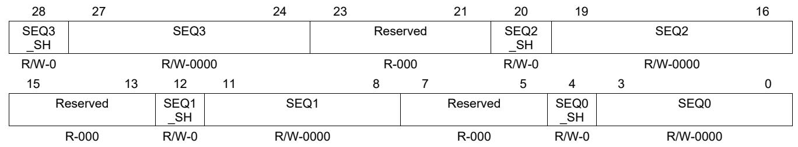

**Table 8-8. ADC Sequence Select Register 0 (ADCSEQSEL0) Register Field Descriptions**

<span id="page-319-2"></span>

| Bit   | Field    | Type | Reset | Description                                                                                                                          |
|-------|----------|------|-------|--------------------------------------------------------------------------------------------------------------------------------------|
| 28    | SEQ3_SH  | R/W  | 0     | Dual channel sequence select<br>0 = Not selected for Dual Sampling (Default)<br>1 = Selected for Dual Sampling                       |
| 27-24 | SEQ3     | R/W  | 0000  | Channel to be converted fourth<br>0000 = Channel 0 selected (Default)<br>0001 = Channel 1 selected<br>                               |
| 23-21 | Reserved | R    | 000   | 1111 = Channel 15 selected                                                                                                           |
| 20    | SEQ2_SH  | R/W  | 0     | Dual channel sequence select<br>0 = Not selected for Dual Sampling (Default)<br>1 = Selected for Dual Sampling                       |
| 19-16 | SEQ2     | R/W  | 0000  | Channel to be converted third<br>0000 = Channel 0 selected (Default)<br>0001 = Channel 1 selected<br><br>1111 = Channel 15 selected  |
| 15-13 | Reserved | R    | 000   |                                                                                                                                      |
| 12    | SEQ1_SH  | R/W  | 0     | Dual channel sequence select<br>0 = Not selected for Dual Sampling (Default)<br>1 = Selected for Dual Sampling                       |
| 11-8  | SEQ1     | R/W  | 0000  | Channel to be converted second<br>0000 = Channel 0 selected (Default)<br>0001 = Channel 1 selected<br><br>1111 = Channel 15 selected |
| 7-5   | Reserved | R    | 000   |                                                                                                                                      |
| 4     | SEQ0_SH  | R/W  | 0     | Dual channel sequence select<br>0 = Not selected for Dual Sampling (Default)<br>1 = Selected for Dual Sampling                       |
| 3-0   | SEQ0     | R/W  | 0000  | Channel to be converted first<br>0000 = Channel 0 selected (Default)<br>0001 = Channel 1 selected<br><br>1111 = Channel 15 selected  |


[www.ti.com](http://www.ti.com) *ADC Registers*

# <span id="page-320-0"></span>*8.18.5 ADC Sequence Select Register 1 (ADCSEQSEL1)*

Address 00040010

### **Figure 8-23. ADC Sequence Select Register 1 (ADCSEQSEL1)**

<span id="page-320-1"></span>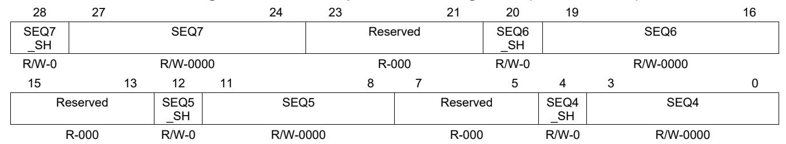

**Table 8-9. ADC Sequence Select Register 1 (ADCSEQSEL1) Register Field Descriptions**

<span id="page-320-2"></span>

| Bit   | Field    | Type | Reset | Description                                                                                                                           |
|-------|----------|------|-------|---------------------------------------------------------------------------------------------------------------------------------------|
| 28    | SEQ7_SH  | R/W  | 0     | Dual channel sequence select<br>0 = Not selected for Dual Sampling (Default)<br>1 = Selected for Dual Sampling                        |
| 27-24 | SEQ7     | R/W  | 0000  | Channel to be converted eighth<br>0000 = Channel 0 selected (Default)<br>0001 = Channel 1 selected<br><br>1111 = Channel 15 selected  |
| 23-21 | Reserved | R    | 000   |                                                                                                                                       |
| 20    | SEQ6_SH  | R/W  | 0     | Dual channel sequence select<br>0 = Not selected for Dual Sampling (Default)<br>1 = Selected for Dual Sampling                        |
| 19-16 | SEQ6     | R/W  | 0000  | Channel to be converted seventh<br>0000 = Channel 0 selected (Default)<br>0001 = Channel 1 selected<br><br>1111 = Channel 15 selected |
| 15-13 | Reserved | R    | 000   |                                                                                                                                       |
| 12    | SEQ5_SH  | R/W  | 0     | Dual channel sequence select<br>0 = Not selected for Dual Sampling (Default)<br>1 = Selected for Dual Sampling                        |
| 11-8  | SEQ5     | R/W  | 0000  | Channel to be converted sixth<br>0000 = Channel 0 selected (Default)<br>0001 = Channel 1 selected<br><br>1111 = Channel 15 selected   |
| 7-5   | Reserved | R    | 000   |                                                                                                                                       |
| 4     | SEQ4_SH  | R/W  | 0     | Dual channel sequence select<br>0 = Not selected for Dual Sampling (Default)<br>1 = Selected for Dual Sampling                        |
| 3-0   | SEQ4     | R/W  | 0000  | Channel to be converted fifth<br>0000 = Channel 0 selected (Default)<br>0001 = Channel 1 selected<br><br>1111 = Channel 15 selected   |


*ADC Registers* [www.ti.com](http://www.ti.com)

### <span id="page-321-0"></span>*8.18.6 ADC Sequence Select Register 2 (ADCSEQSEL2)*

Address 00040014

#### **Figure 8-24. ADC Sequence Select Register 2 (ADCSEQSEL2)**

<span id="page-321-1"></span>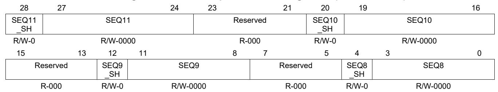

**Table 8-10. ADC Sequence Select Register 2 (ADCSEQSEL2) Register Field Descriptions**

<span id="page-321-2"></span>

| Bit   | Field    | Type | Reset | Description                                                                                                                            |
|-------|----------|------|-------|----------------------------------------------------------------------------------------------------------------------------------------|
| 28    | SEQ11_SH | R/W  | 0     | Dual channel sequence select<br>0 = Not selected for Dual Sampling (Default)<br>1 = Selected for Dual Sampling                         |
| 27-24 | SEQ11    | R/W  | 0000  | Channel to be converted twelfth<br>0000 = Channel 0 selected (Default)<br>0001 = Channel 1 selected<br>                                |
|       |          |      |       | 1111 = Channel 15 selected                                                                                                             |
| 23-21 | Reserved | R    | 000   |                                                                                                                                        |
| 20    | SEQ10_SH | R/W  | 0     | Dual channel sequence select<br>0 = Not selected for Dual Sampling (Default)<br>1 = Selected for Dual Sampling                         |
| 19-16 | SEQ10    | R/W  | 0000  | Channel to be converted eleventh<br>0000 = Channel 0 selected (Default)<br>0001 = Channel 1 selected<br><br>1111 = Channel 15 selected |
| 15-13 | Reserved | R    | 000   |                                                                                                                                        |
| 12    | SEQ9_SH  | R/W  | 0     | Dual channel sequence select<br>0 = Not selected for Dual Sampling (Default)<br>1 = Selected for Dual Sampling                         |
| 11-8  | SEQ9     | R/W  | 0000  | Channel to be converted tenth<br>0000 = Channel 0 selected (Default)<br>0001 = Channel 1 selected<br><br>1111 = Channel 15 selected    |
| 7-5   | Reserved | R    | 000   |                                                                                                                                        |
| 4     | SEQ8_SH  | R/W  | 0     | Dual channel sequence select<br>0 = Not selected for Dual Sampling (Default)<br>1 = Selected for Dual Sampling                         |
| 3-0   | SEQ8     | R/W  | 0000  | Channel to be converted ninth<br>0000 = Channel 0 selected (Default)<br>0001 = Channel 1 selected<br><br>1111 = Channel 15 selected    |


[www.ti.com](http://www.ti.com) *ADC Registers*

# <span id="page-322-0"></span>*8.18.7 ADC Sequence Select Register 3 (ADCSEQSEL3)*

Address 00040018

#### **Figure 8-25. ADC Sequence Select Register 3 (ADCSEQSEL3)**

<span id="page-322-1"></span>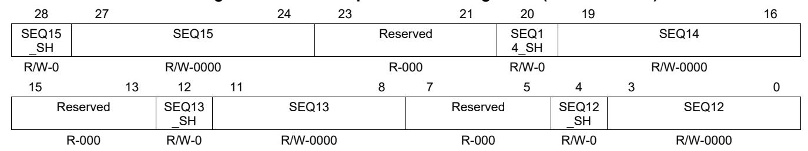

**Table 8-11. ADC Sequence Select Register 3 (ADCSEQSEL3) Register Field Descriptions**

<span id="page-322-2"></span>

| Bit   | Field    | Type | Reset | Description                                                                                                                              |  |  |  |
|-------|----------|------|-------|------------------------------------------------------------------------------------------------------------------------------------------|--|--|--|
| 28    | SEQ15_SH | R/W  | 0     | Dual channel sequence select<br>0 = Not selected for Dual Sampling (Default)<br>1 = Selected for Dual Sampling                           |  |  |  |
| 27-24 | SEQ15    | R/W  | 0000  | Channel to be converted sixteenth<br>0000 = Channel 0 selected (Default)<br>0001 = Channel 1 selected<br><br>1111 = Channel 15 selected  |  |  |  |
| 23-21 | Reserved | R    | 000   |                                                                                                                                          |  |  |  |
| 20    | SEQ14_SH | R/W  | 0     | Dual channel sequence select<br>0 = Not selected for Dual Sampling (Default)<br>1 = Selected for Dual Sampling                           |  |  |  |
| 19-16 | SEQ14    | R/W  | 0000  | Channel to be converted fifteenth<br>0000 = Channel 0 selected (Default)<br>0001 = Channel 1 selected<br><br>1111 = Channel 15 selected  |  |  |  |
| 15-13 | Reserved | R    | 000   |                                                                                                                                          |  |  |  |
| 12    | SEQ13_SH | R/W  | 0     | Dual channel sequence select<br>0 = Not selected for Dual Sampling (Default)<br>1 = Selected for Dual Sampling                           |  |  |  |
| 11-8  | SEQ13    | R/W  | 0000  | Channel to be converted fourteenth<br>0000 = Channel 0 selected (Default)<br>0001 = Channel 1 selected<br><br>1111 = Channel 15 selected |  |  |  |
| 7-5   | Reserved | R    | 000   |                                                                                                                                          |  |  |  |
| 4     | SEQ12_SH | R/W  | 0     | Dual channel sequence select<br>0 = Not selected for Dual Sampling (Default)<br>1 = Selected for Dual Sampling                           |  |  |  |
| 3-0   | SEQ12    | R/W  | 0000  | Channel to be converted thirteenth<br>0000 = Channel 0 selected (Default)<br>0001 = Channel 1 selected<br><br>1111 = Channel 15 selected |  |  |  |


*ADC Registers* [www.ti.com](http://www.ti.com)

### <span id="page-323-0"></span>*8.18.8 ADC Result Registers 0-15 (ADCRESULTx, x=0:15)*

Address 0004001C – ADC Result Register 0

Address 00040020 – ADC Result Register 1

Address 00040024 – ADC Result Register 2

Address 00040028 – ADC Result Register 3

Address 0004002C – ADC Result Register 4

Address 00040030 – ADC Result Register 5

Address 00040034 – ADC Result Register 6

Address 00040038 – ADC Result Register 7

Address 0004003C – ADC Result Register 8

Address 00040040 – ADC Result Register 9

Address 00040044 – ADC Result Register 10

Address 00040048 – ADC Result Register 11

Address 0004004C – ADC Result Register 12

Address 00040050 – ADC Result Register 13

Address 00040054 – ADC Result Register 14

Address 00040058 – ADC Result Register 15

# **Figure 8-26. ADC Result Registers 0-15 (ADCRESULTx, x=0:15)**

<span id="page-323-1"></span>11 0

RESULT R-0

LEGEND: R/W = Read/Write; R = Read only; -*n* = value after reset

#### **Table 8-12. ADC Result Registers 0-15 (ADCRESULTx, x=0:15) Register Field Descriptions**

<span id="page-323-2"></span>

| Bit  | Field  | Type | Reset | Description                                    |
|------|--------|------|-------|------------------------------------------------|
| 11-0 | RESULT | R    | 0     | Each sequence has a dedicated result register. |


[www.ti.com](http://www.ti.com) *ADC Registers*

#### <span id="page-324-0"></span>*8.18.9 ADC Averaged Result Registers 0-5 (ADCAVGRESULTx, x=0:15)*

Address 0004005C – ADC Averaged Result Register 0

Address 00040060 – ADC Averaged Result Register 1

Address 00040064 – ADC Averaged Result Register 2

Address 00040068 – ADC Averaged Result Register 3

Address 0004006C – ADC Averaged Result Register 4

Address 00040070 – ADC Averaged Result Register 5

**Figure 8-27. ADC Averaged Result Registers 0-5 (ADCAVGRESULTx, x=0:15)**

<span id="page-324-1"></span>11 0 RESULT

R-0

**Table 8-13. ADC Averaged Result Registers 0-5 (ADCAVGRESULTx, x=0:15) Register Field Descriptions**

<span id="page-324-2"></span>

| Bit  | Field  | Type | Reset | Description                                 |  |
|------|--------|------|-------|---------------------------------------------|--|
| 11-0 | RESULT | R    | 0     | First 6 ADC Results have an averaged result |  |


*ADC Registers* [www.ti.com](http://www.ti.com)

# <span id="page-325-0"></span>*8.18.10 ADC Digital Compare Limits Register 0-5 (ADCCOMPLIMx, x=0:5)*

Address 00040074 – ADC Digital Compare Limits Register 0

Address 00040078 – ADC Digital Compare Limits Register 1

Address 0004007C – ADC Digital Compare Limits Register 2

Address 00040080 – ADC Digital Compare Limits Register 3

Address 00040084 – ADC Digital Compare Limits Register 4

Address 00040088 – ADC Digital Compare Limits Register 5

### **Figure 8-28. ADC Digital Compare Limits Register 0-5 (ADCCOMPLIMx, x=0:5)**

<span id="page-325-1"></span>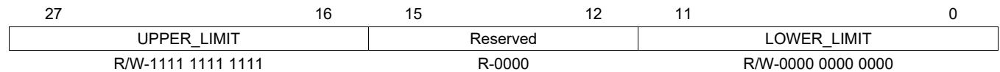

LEGEND: R/W = Read/Write; R = Read only; -*n* = value after reset

#### **Table 8-14. ADC Digital Compare Limits Register 0-5 (ADCCOMPLIMx, x=0:5) Register Field Descriptions**

<span id="page-325-2"></span>

| Bit   | Field       | Type | Reset                | Description                                                                                                                                                                                                                                                                                     |
|-------|-------------|------|----------------------|-------------------------------------------------------------------------------------------------------------------------------------------------------------------------------------------------------------------------------------------------------------------------------------------------|
| 27-16 | UPPER_LIMIT | R/W  | 1111<br>1111<br>1111 | Configures the upper limit value. If the ADC conversion selected is equal or greater<br>than the limit, the Digital Compare Interrupt Flag is set (bit 22 of ADC Control<br>Register 1). Results of comparison can be read from the ADC Digital Compare<br>Results Register (see Section 4.12). |
| 15-12 | Reserved    | R    | 0000                 |                                                                                                                                                                                                                                                                                                 |
| 11-0  | LOWER_LIMIT | R/W  | 0000<br>0000<br>0000 | Configures the lower limit value. If the ADC conversion selected is equal or less than<br>the limit, the Digital Compare Interrupt Flag is set (bit 22 of ADC Control Register 1).<br>Results of comparison can be read from the ADC Digital Compare Results Register<br>(see Section 4.12).    |


[www.ti.com](http://www.ti.com) *ADC Registers*

### <span id="page-326-0"></span>*8.18.11 ADC Digital Compare Enable Register (ADCCOMPEN)*

Address 0004008C

#### **Figure 8-29. ADC Digital Compare Enable Register (ADCCOMPEN)**

<span id="page-326-1"></span>

|                     | 27                  |                     | 26                  | 25                  |                     | 24                  |                     |
|---------------------|---------------------|---------------------|---------------------|---------------------|---------------------|---------------------|---------------------|
|                     | COMP5_UP_INT_EN     |                     | COMP5_LO_INT_EN     | COMP4_UP_INT_EN     |                     | COMP4_LO_INT_EN     |                     |
|                     | R/W-0               |                     | R/W-0               |                     | R/W-0               | R/W-0               |                     |
| 23                  | 22                  | 21                  | 20                  | 19                  | 18                  | 17                  | 16                  |
| COMP3_UP<br>_INT_EN | COMP3_LO<br>_INT_EN | COMP2_UP<br>_INT_EN | COMP2_LO<br>_INT_EN | COMP1_UP<br>_INT_EN | COMP1_LO<br>_INT_EN | COMP0_UP<br>_INT_EN | COMP0_LO<br>_INT_EN |
| R/W-0               | R/W-0               | R/W-0               | R/W-0               | R/W-0               | R/W-0               | R/W-0               | R/W-0               |
| 15                  | 14                  | 13                  | 12                  | 11                  | 10                  | 9                   | 8                   |
|                     | Reserved            |                     | COMP4_DATA<br>_SEL  | COMP3_DATA<br>_SEL  | COMP2_DATA<br>_SEL  | COMP1_DATA<br>_SEL  | COMP0_DATA<br>_SEL  |
|                     | R-00                |                     | R/W-0               | R/W-0               | R/W-0               | R/W-0               | R/W-0               |
| 7<br>6              |                     | 5                   | 4                   | 3                   | 2                   | 1                   | 0                   |
|                     | Reserved            |                     | COMP4_EN            | COMP3_EN            | COMP2_EN            | COMP1_EN            | COMP0_EN            |
| R-00                |                     | R/W-0               | R/W-0               | R/W-0               | R/W-0               | R/W-0               | R/W-0               |

LEGEND: R/W = Read/Write; R = Read only; -*n* = value after reset

# **Table 8-15. ADC Digital Compare Enable Register (ADCCOMPEN) Register Field Descriptions**

<span id="page-326-2"></span>

| Bit | Field               | Type | Reset | Description                                                                                                                                                                                  |  |
|-----|---------------------|------|-------|----------------------------------------------------------------------------------------------------------------------------------------------------------------------------------------------|--|
| 27  | COMP5_UP_INT_<br>EN | R/W  | 0     | Digital Comparator 5 Upper Limit Interrupt Enable<br>0 = Interrupt generation disabled on result above upper limit (Default)<br>1 = Interrupt generation enabled on result above upper limit |  |
| 26  | COMP5_LO_INT_<br>EN | R/W  | 0     | Digital Comparator 5 Lower Limit Interrupt Enable<br>0 = Interrupt generation disabled on result below lower limit (Default)<br>1 = Interrupt generation enabled on result below lower limit |  |
| 25  | COMP4_UP_INT_<br>EN | R/W  | 0     | Digital Comparator 4 Upper Limit Interrupt Enable<br>0 = Interrupt generation disabled on result above upper limit (Default)<br>1 = Interrupt generation enabled on result above upper limit |  |
| 24  | COMP4_LO_INT_<br>EN | R/W  | 0     | Digital Comparator 4 Lower Limit Interrupt Enable<br>0 = Interrupt generation disabled on result below lower limit (Default)<br>1 = Interrupt generation enabled on result below lower limit |  |
| 23  | COMP3_UP_INT_<br>EN | R/W  | 0     | Digital Comparator 3 Upper Limit Interrupt Enable<br>0 = Interrupt generation disabled on result above upper limit (Default)<br>1 = Interrupt generation enabled on result above upper limit |  |
| 22  | COMP3_LO_INT_<br>EN | R/W  | 0     | Digital Comparator 3 Lower Limit Interrupt Enable<br>0 = Interrupt generation disabled on result below lower limit (Default)<br>1 = Interrupt generation enabled on result below lower limit |  |
| 21  | COMP2_UP_INT_<br>EN | R/W  | 0     | Digital Comparator 2 Upper Limit Interrupt Enable<br>0 = Interrupt generation disabled on result above upper limit (Default)<br>1 = Interrupt generation enabled on result above upper limit |  |
| 20  | COMP2_LO_INT_<br>EN | R/W  | 0     | Digital Comparator 2 Lower Limit Interrupt Enable<br>0 = Interrupt generation disabled on result below lower limit (Default)<br>1 = Interrupt generation enabled on result below lower limit |  |
| 19  | COMP1_UP_INT_<br>EN | R/W  | 0     | Digital Comparator 1 Upper Limit Interrupt Enable<br>0 = Interrupt generation disabled on result above upper limit (Default)<br>1 = Interrupt generation enabled on result above upper limit |  |
| 18  | COMP1_LO_INT_<br>EN | R/W  | 0     | Digital Comparator 1 Lower Limit Interrupt Enable<br>0 = Interrupt generation disabled on result below lower limit (Default)<br>1 = Interrupt generation enabled on result below lower limit |  |


*ADC Registers* [www.ti.com](http://www.ti.com)

### **Table 8-15. ADC Digital Compare Enable Register (ADCCOMPEN) Register Field Descriptions (continued)**

| Bit   | Field               | Type | Reset | Description                                                                                                                                                                                  |
|-------|---------------------|------|-------|----------------------------------------------------------------------------------------------------------------------------------------------------------------------------------------------|
| 17    | COMP0_UP_INT_<br>EN | R/W  | 0     | Digital Comparator 0 Upper Limit Interrupt Enable<br>0 = Interrupt generation disabled on result above upper limit (Default)<br>1 = Interrupt generation enabled on result above upper limit |
| 16    | COMP0_LO_INT_<br>EN | R/W  | 0     | Digital Comparator 0 Lower Limit Interrupt Enable<br>0 = Interrupt generation disabled on result below lower limit (Default)<br>1 = Interrupt generation enabled on result below lower limit |
| 15-14 | Reserved            | R    | 00    |                                                                                                                                                                                              |
| 13    | COMP5_DATA_S<br>EL  | R/W  | 0     | Digital Comparator 5 Data Select<br>0 = Raw ADC Result 5 used for comparison (Default)<br>1 = Averaged ADC Result 5 used for comparison                                                      |
| 12    | COMP4_DATA_S<br>EL  | R/W  | 0     | Digital Comparator 4 Data Select<br>0 = Raw ADC Result 4 used for comparison (Default)<br>1 = Averaged ADC Result 4 used for comparison                                                      |
| 11    | COMP3_DATA_S<br>EL  | R/W  | 0     | Digital Comparator 3 Data Select<br>0 = Raw ADC Result 3 used for comparison (Default)<br>1 = Averaged ADC Result 3 used for comparison                                                      |
| 10    | COMP2_DATA_S<br>EL  | R/W  | 0     | Digital Comparator 2 Data Select<br>0 = Raw ADC Result 2 used for comparison (Default)<br>1 = Averaged ADC Result 2 used for comparison                                                      |
| 9     | COMP1_DATA_S<br>EL  | R/W  | 0     | Digital Comparator 1 Data Select<br>0 = Raw ADC Result 1 used for comparison (Default)<br>1 = Averaged ADC Result 1 used for comparison                                                      |
| 8     | COMP0_DATA_S<br>EL  | R/W  | 0     | Digital Comparator 0 Data Select<br>0 = Raw ADC Result 0 used for comparison (Default)<br>1 = Averaged ADC Result 0 used for comparison                                                      |
| 7-6   | Reserved            | R    | 00    |                                                                                                                                                                                              |
| 5     | COMP5_EN            | R/W  | 0     | Digital Comparator 5 Enable<br>0 = Comparator Disabled (Default)<br>1 = Comparator Enabled                                                                                                   |
| 4     | COMP4_EN            | R/W  | 0     | Digital Comparator 4 Enable<br>0 = Comparator Disabled (Default)<br>1 = Comparator Enabled                                                                                                   |
| 3     | COMP3_EN            | R/W  | 0     | Digital Comparator 3 Enable<br>0 = Comparator Disabled (Default)<br>1 = Comparator Enabled                                                                                                   |
| 2     | COMP2_EN            | R/W  | 0     | Digital Comparator 2 Enable<br>0 = Comparator Disabled (Default)<br>1 = Comparator Enabled                                                                                                   |
| 1     | COMP1_EN            | R/W  | 0     | Digital Comparator 1 Enable<br>0 = Comparator Disabled (Default)<br>1 = Comparator Enabled                                                                                                   |
| 0     | COMP0_EN            | R/W  | 0     | Digital Comparator 0 Enable<br>0 = Comparator Disabled (Default)<br>1 = Comparator Enabled                                                                                                   |


[www.ti.com](http://www.ti.com) *ADC Registers*

# <span id="page-328-0"></span>*8.18.12 ADC Digital Compare Results Register (ADCCOMPRESULT)*

Address 00040090

**Figure 8-30. ADC Digital Compare Results Register (ADCCOMPRESULT)**

<span id="page-328-1"></span>

|                   | 27                |                   | 26                |                   | 25                | 24                |                   |
|-------------------|-------------------|-------------------|-------------------|-------------------|-------------------|-------------------|-------------------|
|                   | DCOMP5_UP_RAW     |                   | DCOMP5_LO_RAW     |                   | DCOMP4_UP_RAW     | DCOMP4_LO_RAW     |                   |
|                   | R-0               | R-0               |                   |                   | R-0               | R-0               |                   |
| 23                | 22                | 21                | 20                | 19                | 18                | 17                | 16                |
| DCOMP3_<br>UP_RAW | DCOMP3_<br>LO_RAW | DCOMP2_<br>UP_RAW | DCOMP2_<br>LO_RAW | DCOMP1_<br>UP_RAW | DCOMP1_<br>LO_RAW | DCOMP0_<br>UP_RAW | DCOMP0_<br>LO_RAW |
| R-0               | R-0               | R-0               | R-0               | R-0               | R-0               | R-0               | R-0               |
| 15                |                   |                   | 12                | 11                | 10                | 9                 | 8                 |
|                   |                   | Reserved          |                   | DCOMP5_<br>UP_INT | DCOMP5_<br>LO_INT | DCOMP4_<br>UP_INT | DCOMP4_<br>LO_INT |
|                   |                   | R-0000            |                   | R-0               | R-0               | R-0               | R-0               |
| 7                 | 6                 | 5                 |                   | 3                 | 2                 | 1                 | 0                 |
| DCOMP3_<br>UP_INT | DCOMP3_<br>LO_INT | DCOMP2_<br>UP_INT | DCOMP2_<br>LO_INT | DCOMP1_<br>UP_INT | DCOMP1_<br>LO_INT | DCOMP0_<br>UP_INT | DCOMP0_<br>LO_INT |
| R-0               | R-0               | R-0               | R-0               | R-0               | R-0               | R-0               | R-0               |

**Table 8-16. ADC Digital Compare Results Register (ADCCOMPRESULT) Register Field Descriptions**

<span id="page-328-2"></span>

| Bit | Field         | Type | Reset | Description                                                                                 |
|-----|---------------|------|-------|---------------------------------------------------------------------------------------------|
| 27  | DCOMP5_UP_RAW | R    | 0     | Digital Comparator 5 Upper Limit Raw Result<br>0 = Limit not exceeded<br>1 = Limit exceeded |
| 26  | DCOMP5_LO_RAW | R    | 0     | Digital Comparator 5 Lower Limit Raw Result<br>0 = Limit not exceeded<br>1 = Limit exceeded |
| 25  | DCOMP4_UP_RAW | R    | 0     | Digital Comparator 4 Upper Limit Raw Result<br>0 = Limit not exceeded<br>1 = Limit exceeded |
| 24  | DCOMP4_LO_RAW | R    | 0     | Digital Comparator 4 Lower Limit Raw Result<br>0 = Limit not exceeded<br>1 = Limit exceeded |
| 23  | DCOMP3_UP_RAW | R    | 0     | Digital Comparator 3 Upper Limit Raw Result<br>0 = Limit not exceeded<br>1 = Limit exceeded |
| 22  | DCOMP3_LO_RAW | R    | 0     | Digital Comparator 3 Lower Limit Raw Result<br>0 = Limit not exceeded<br>1 = Limit exceeded |
| 21  | DCOMP2_UP_RAW | R    | 0     | Digital Comparator 2 Upper Limit Raw Result<br>0 = Limit not exceeded<br>1 = Limit exceeded |
| 20  | DCOMP2_LO_RAW | R    | 0     | Digital Comparator 2 Lower Limit Raw Result<br>0 = Limit not exceeded<br>1 = Limit exceeded |
| 19  | DCOMP1_UP_RAW | R    | 0     | Digital Comparator 1 Upper Limit Raw Result<br>0 = Limit not exceeded<br>1 = Limit exceeded |


*ADC Registers* [www.ti.com](http://www.ti.com)

#### **Table 8-16. ADC Digital Compare Results Register (ADCCOMPRESULT) Register Field Descriptions (continued)**

| Bit   | Field         | Type | Reset | Description                                                                                                        |
|-------|---------------|------|-------|--------------------------------------------------------------------------------------------------------------------|
| 18    | DCOMP1_LO_RAW | R    | 0     | Digital Comparator 1 Lower Limit Raw Result<br>0 = Limit not exceeded<br>1 = Limit exceeded                        |
| 17    | DCOMP0_UP_RAW | R    | 0     | Digital Comparator 0 Upper Limit Raw Result<br>0 = Limit not exceeded<br>1 = Limit exceeded                        |
| 16    | DCOMP0_LO_RAW | R    | 0     | Digital Comparator 0 Lower Limit Raw Result<br>0 = Limit not exceeded<br>1 = Limit exceeded                        |
| 15-12 | Reserved      | R    | 0000  |                                                                                                                    |
| 11    | DCOMP5_UP_INT | R    | 0     | Digital Comparator 5 Upper Limit Interrupt Result, cleared on read<br>0 = Limit not exceeded<br>1 = Limit exceeded |
| 10    | DCOMP5_LO_INT | R    | 0     | Digital Comparator 5 Lower Limit Interrupt Result, cleared on read<br>0 = Limit not exceeded<br>1 = Limit exceeded |
| 9     | DCOMP4_UP_INT | R    | 0     | Digital Comparator 4 Upper Limit Interrupt Result, cleared on read<br>0 = Limit not exceeded<br>1 = Limit exceeded |
| 8     | DCOMP4_LO_INT | R    | 0     | Digital Comparator 4 Lower Limit Interrupt Result, cleared on read<br>0 = Limit not exceeded<br>1 = Limit exceeded |
| 7     | DCOMP3_UP_INT | R    | 0     | Digital Comparator 3 Upper Limit Interrupt Result, cleared on read<br>0 = Limit not exceeded<br>1 = Limit exceeded |
| 6     | DCOMP3_LO_INT | R    | 0     | Digital Comparator 3 Lower Limit Interrupt Result, cleared on read<br>0 = Limit not exceeded<br>1 = Limit exceeded |
| 5     | DCOMP2_UP_INT | R    | 0     | Digital Comparator 2 Upper Limit Interrupt Result, cleared on read<br>0 = Limit not exceeded<br>1 = Limit exceeded |
| 4     | DCOMP2_LO_INT | R    | 0     | Digital Comparator 2 Lower Limit Interrupt Result, cleared on read<br>0 = Limit not exceeded<br>1 = Limit exceeded |
| 3     | DCOMP1_UP_INT | R    | 0     | Digital Comparator 1 Upper Limit Interrupt Result, cleared on read<br>0 = Limit not exceeded<br>1 = Limit exceeded |
| 2     | DCOMP1_LO_INT | R    | 0     | Digital Comparator 1 Lower Limit Interrupt Result, cleared on read<br>0 = Limit not exceeded<br>1 = Limit exceeded |
| 1     | DCOMP0_UP_INT | R    | 0     | Digital Comparator 0 Upper Limit Interrupt Result, cleared on read<br>0 = Limit not exceeded<br>1 = Limit exceeded |
| 0     | DCOMP0_LO_INT | R    | 0     | Digital Comparator 0 Lower Limit Interrupt Result, cleared on read<br>0 = Limit not exceeded<br>1 = Limit exceeded |


[www.ti.com](http://www.ti.com) *ADC Registers*

# *8.18.13 ADC Averaging Control Register (ADCAVGCTRL)*

Address 00040094

#### **Figure 8-31. ADC Averaging Control Register (ADCAVGCTRL)**

<span id="page-330-0"></span>

| 22          | 21          |             | 20 |                     | 19 |             | 18          | 17     | 16    |
|-------------|-------------|-------------|----|---------------------|----|-------------|-------------|--------|-------|
| AVG5_CONFIG |             | AVG5_EN     |    | Reserved            |    | AVG4_CONFIG | AVG4        |        |       |
|             | R/W-00      |             |    | R/W-0               |    | R-0         |             | R/W-00 | R/W-0 |
| 15          | 14          | 13          |    | 12                  |    |             | 10          | 9      | 8     |
| Reserved    |             | AVG3_CONFIG |    | AVG3_EN<br>Reserved |    |             | AVG2_CONFIG |        | AVG2  |
| R-0         | R/W-00      |             |    | R/W-0<br>R-0        |    |             | R/W-00      |        | R/W-0 |
| 7           | 6           | 5           |    | 4                   |    |             | 2           | 1      | 0     |
| Reserved    | AVG1_CONFIG |             |    | AVG1_EN<br>Reserved |    |             | AVG0_CONFIG |        | AVG0  |
| R-0         | R/W-00      |             |    | R/W-0<br>R-0        |    |             | R/W-00      |        | R/W-0 |

**Table 8-17. ADC Averaging Control Register (ADCAVGCTRL) Register Field Descriptions**

<span id="page-330-1"></span>

| Bit   | Field       | Type | Reset | Description                                                                                                                                                                                  |
|-------|-------------|------|-------|----------------------------------------------------------------------------------------------------------------------------------------------------------------------------------------------|
| 22-21 | AVG5_CONFIG | R/W  | 00    | ADC Averaging Module 5 Configuration<br>0 = Moving average of 4 samples (Default)<br>1 = Moving average of 8 samples<br>2 = Moving average of 16 samples<br>3 = Moving average of 32 samples |
| 20    | AVG5_EN     | R/W  | 0     | ADC Averaging Module 5 Enable<br>0 = ADC Averaging Disabled (Default)<br>1 = ADC Averaging Enabled                                                                                           |
| 19    | Reserved    | R    | 0     |                                                                                                                                                                                              |
| 18-17 | AVG4_CONFIG | R/W  | 00    | ADC Averaging Module 4 Configuration<br>0 = Moving average of 4 samples (Default)<br>1 = Moving average of 8 samples<br>2 = Moving average of 16 samples<br>3 = Moving average of 32 samples |
| 16    | AVG4_EN     | R/W  | 0     | ADC Averaging Module 4 Enable<br>0 = ADC Averaging Disabled (Default)<br>1 = ADC Averaging Enabled                                                                                           |
| 15    | Reserved    | R    | 0     |                                                                                                                                                                                              |
| 14-13 | AVG3_CONFIG | R/W  | 00    | ADC Averaging Module 3 Configuration<br>0 = Moving average of 4 samples (Default)<br>1 = Moving average of 8 samples<br>2 = Moving average of 16 samples<br>3 = Moving average of 32 samples |
| 12    | AVG3_EN     | R/W  | 0     | ADC Averaging Module 3 Enable<br>0 = ADC Averaging Disabled (Default)<br>1 = ADC Averaging Enabled                                                                                           |
| 11    | Reserved    | R    | 0     |                                                                                                                                                                                              |
| 10-9  | AVG2_CONFIG | R/W  | 00    | ADC Averaging Module 2 Configuration<br>0 = Moving average of 4 samples (Default)<br>1 = Moving average of 8 samples<br>2 = Moving average of 16 samples<br>3 = Moving average of 32 samples |
| 8     | AVG2_EN     | R/W  | 0     | ADC Averaging Module 4 Enable<br>0 = ADC Averaging Disabled (Default)<br>1 = ADC Averaging Enabled                                                                                           |


*ADC Registers* [www.ti.com](http://www.ti.com)

### **Table 8-17. ADC Averaging Control Register (ADCAVGCTRL) Register Field Descriptions (continued)**

| Bit | Field       | Type | Reset | Description                                                                                                                                                                                  |
|-----|-------------|------|-------|----------------------------------------------------------------------------------------------------------------------------------------------------------------------------------------------|
| 7   | Reserved    | R    | 0     |                                                                                                                                                                                              |
| 6-5 | AVG1_CONFIG | R/W  | 00    | ADC Averaging Module 1 Configuration<br>0 = Moving average of 4 samples (Default)<br>1 = Moving average of 8 samples<br>2 = Moving average of 16 samples<br>3 = Moving average of 32 samples |
| 4   | AVG1_EN     | R/W  | 0     | ADC Averaging Module 1 Enable<br>0 = ADC Averaging Disabled (Default)<br>1 = ADC Averaging Enabled                                                                                           |
| 3   | Reserved    | R    | 0     |                                                                                                                                                                                              |
| 2-1 | AVG0_CONFIG | R/W  | 00    | ADC Averaging Module 0 Configuration<br>0 = Moving average of 4 samples (Default)<br>1 = Moving average of 8 samples<br>2 = Moving average of 16 samples<br>3 = Moving average of 32 samples |
| 0   | AVG0_EN     | R/W  | 0     | ADC Averaging Module 0 Enable<br>0 = ADC Averaging Disabled (Default)<br>1 = ADC Averaging Enabled                                                                                           |

<span id="page-332-0"></span>

# *Advanced Power Management Control Functions*

The Miscellaneous Analog Control (MAC) Registers are a catch-all of registers that control and monitor a wide variety of functions. These functions include device supervisory features such as Brown-Out and power saving configuration, general purpose input/output configuration and interfacing, internal temperature sensor control and current sharing control.

The MAC module also provides trim signals to the oscillator and AFE blocks. These controls are usually used at the time of trimming at IC manufacturing; therefore this document will not cover these trim controls.

Please note that despite the name "Miscellaneous Analog Control", the MAC module does not only control analog functions.

All the MAC registers and peripherals are available in the UCD3138RGC (64 pin version). The UCD3138RHA (40 pin version) device may have reduced resources. Consult device datasheet for details.

**Topic** ........................................................................................................................... **Page**

| 9.1  | Package ID Information                          | 334 |
|------|-------------------------------------------------|-----|
| 9.2  | Brownout                                        | 334 |
| 9.3  | Temperature Sensor Control                      | 334 |
| 9.4  | I/O Mux Control                                 | 334 |
| 9.5  | Current Sharing Control                         | 334 |
| 9.6  | Temperature Reference                           | 336 |
| 9.7  | Power Disable Control or (Clock Gating Control) | 336 |
| 9.8  | Miscellaneous Analog Control Registers          | 336 |
| 9.9  | GPIO Overview                                   | 343 |
| 9.10 | Interaction with a Single Pin                   | 344 |
| 9.11 | Interaction with Multiple Pins                  | 345 |
| 9.12 | Registers                                       | 346 |
| 9.13 | Trim and Test Registers - Note                  | 351 |

*Package ID Information* [www.ti.com](http://www.ti.com)

# <span id="page-333-1"></span>**9.1 Package ID Information**

Package ID register includes information regarding the package type of the device and can be read by firmware for reporting through PMBus or for other package sensitive decision makings.

### **Figure 9-1.**

<span id="page-333-5"></span>1 0 PKG\_ID R/W-00

LEGEND: R/W = Read/Write; R = Read only; -*n* = value after reset

# <span id="page-333-2"></span>**9.2 Brownout**

Brownout function is used to determine if the device supply voltage is lower than a threshold voltage, a condition that may be considered unsafe for proper operation of the device.

The Brownout threshold is higher than the Reset threshold voltage; Therefore when the device supply voltage is lower than brownout threshold, it does not necessarily trigger a device reset.

The brownout interrupt flag can be polled or alternatively can trigger an interrupt to service such case by an interrupt service routine.

Please refer to Section 3.6 of UCD3138 device datasheet for more information about specific Brownout threshold levels.

# <span id="page-333-0"></span>**9.3 Temperature Sensor Control**

Temperature sensor control register provides internal temperature sensor enabling and trimming capabilities. The internal temperature sensor is disabled as default.

# <span id="page-333-3"></span>**9.4 I/O Mux Control**

In different package versions of UCD3138, different I/O functions are multiplexed and routed toward a single physical pin. Consult the UCD3138 device datasheet for specific information related to each version.

I/O Mux Control register may be used in order to choose a specific functionality that is desired to be assigned to a physical device pin.

Please note that the default value of IOMUX does not configure the TDO pin as a JTAG pin. Hence, IOMUX configuration must be changed in order to implement JTAG communication to UCD3138.

### <span id="page-333-4"></span>**9.5 Current Sharing Control**

UCD3138 provides three separate modes of current sharing operation.

- Analog bus current sharing
- PWM bus current sharing
- Master/Slave current sharing

A simplified schematic of the current sharing circuitry integrated in UCD3138 is shown in the drawing below:


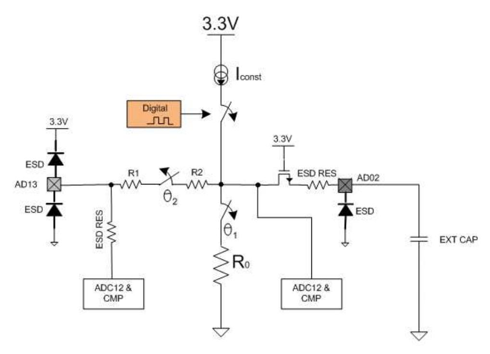

**Figure 9-2.**

**Table 9-1. Tolerance**

<span id="page-334-1"></span><span id="page-334-0"></span>

| Name   | Typical | + - % | Comment                                            |
|--------|---------|-------|----------------------------------------------------|
| R0     | 10K     | 2     | Accurate internal resistor with temp. compensation |
| R1     | 400     | 25    | Resistor with switch resistance lump               |
| R2     | 3.2K    | 25    | Resistor support no more than 1 mA                 |
| ESDRES | 250     | 25    | ESD resistor                                       |
| Iconst | 250µA   | 2     | Use in PWM output current                          |

**Table 9-2.**

<span id="page-334-2"></span>

| Current Sharing Mode                         | CSCTRL.bit.TEST_MODE | Switch θ1 | Switch θ2 | Digital-PWM |
|----------------------------------------------|----------------------|-----------|-----------|-------------|
| Tri-state or Slave mode                      | 0                    | OFF       | OFF       | OFF         |
| PWM average current Bus                      | 1                    | ON        | OFF       | ACTIVE      |
| Analog average current Bus or<br>Master mode | 3                    | OFF       | ON        | OFF         |

The period and the duty of 8-bit PWM current source and the state of the θ1 and θ2 switches can be controlled through the current sharing control register (CSCTRL).

For more details please refer to Application Note on UCD3138 Current Sharing.

*Temperature Reference* [www.ti.com](http://www.ti.com)

# <span id="page-335-0"></span>**9.6 Temperature Reference**

The temperature reference register (TEMPREF) provides the ADC12 count when ADC12 measured the internal temperature sensor during the factory trim and calibration. This information can be used by different periodic temperature compensation routines implemented in the firmware. But it should not be overwritten by firmware; otherwise this factory written value will be lost.

Address FFF7F03C

#### **Figure 9-3.**

<span id="page-335-4"></span>11 0 TEMP\_REF

R/W-0000 0000 0000

LEGEND: R/W = Read/Write; R = Read only; -*n* = value after reset

# <span id="page-335-1"></span>**9.7 Power Disable Control or (Clock Gating Control)**

Power Disable Control register provides control bits that can enable or disable arrival of clock to several peripherals such as, PCM, CPCC, digital filters, front ends, DPWMs, UARTs, ADC-12 and more.

All these controls are enabled as default. If a specific peripheral is not used in a specific application the clock gate can be disabled in order to block the propagation of clock signal to that peripheral and therefore reduce the overall current consumption of the device. Please refer to [Section](#page-341-0) 9.8.7 and Section 3.7 of UCD3138 device datasheet for more information.

# <span id="page-335-2"></span>**9.8 Miscellaneous Analog Control Registers**

# <span id="page-335-3"></span>*9.8.1 Package ID Register (PKGID)*

Address FFF7F010

**Figure 9-4. Package ID Register (PKGID)**

<span id="page-335-5"></span>1 0 PKG\_ID R/W-00

LEGEND: R/W = Read/Write; R = Read only; -*n* = value after reset

#### **Table 9-3. Package ID Register (PKGID) Register Field Descriptions**

<span id="page-335-6"></span>

| Bit | Field  | Type | Reset | Description                       |
|-----|--------|------|-------|-----------------------------------|
| 1-0 | PKG_ID | R/W  | 00    | Represents package type of device |
|     |        |      |       | 0 = 64-pin package (Default)      |
|     |        |      |       | 1 = 40-pin package                |


# <span id="page-336-0"></span>*9.8.2 Brownout Register (BROWNOUT)*

Address FFF7F014

### **Figure 9-5. Brownout Register (BROWNOUT)**

<span id="page-336-1"></span>

LEGEND: R/W = Read/Write; R = Read only; -*n* = value after reset

### **Table 9-4. Brownout Register (BROWNOUT) Register Field Descriptions**

<span id="page-336-2"></span>

| Bit | Field   | Type | Reset | Description                                                                                                             |
|-----|---------|------|-------|-------------------------------------------------------------------------------------------------------------------------|
| 2   | INT     | R    | 0     | Brownout Interrupt Status<br>0 = No Brownout Condition observed<br>1 = Brownout Condition observed                      |
| 1   | INT_EN  | R/W  | 0     | Brownout Interrupt Enable<br>0 = Brownout Interrupt disabled (Default)<br>1 = Brownout Interrupt enabled                |
| 0   | COMP_EN | R/W  | 0     | Brownout Comparator Enable<br>0 = Brownout comparator logic disabled (Default)<br>1 = Brownout comparator logic enabled |


# <span id="page-337-0"></span>*9.8.3 Temp Sensor Control Register (TEMPSENCTRL)*

Address FFF7F02C

#### **Figure 9-6. Temp Sensor Control Register (TEMPSENCTRL)**

<span id="page-337-1"></span>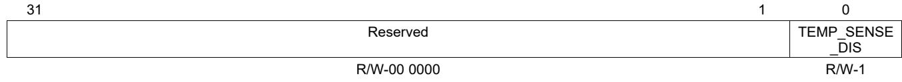

LEGEND: R/W = Read/Write; R = Read only; -*n* = value after reset

# **Table 9-5. Temp Sensor Control Register (TEMPSENCTRL) Register Field Descriptions**

<span id="page-337-2"></span>

| Bit  | Field              | Type | Reset   | Description                                                                                               |
|------|--------------------|------|---------|-----------------------------------------------------------------------------------------------------------|
| 31-1 | Reserved           | R/W  | 00 0000 | Temperature Sensor Disable<br>0 = Enables Temperature Sensor<br>1 = Disables Temperature Sensor (Default) |
| 0    | TEMP_SENSE<br>_DIS | R/W  | 0       |                                                                                                           |

#### **CAUTION**

Writing into the reserved bits is NOT RECOMMENDED since it is likely to have an adverse effect on the normal operation of Temperature Sensor. In the process of Clearing (or setting) the TEMP\_SENSE\_DIS bit, the other bits in the register need to be stayed intact. Therefore you should use a read-modify-write technique to clear or set this bit.


### <span id="page-338-0"></span>*9.8.4 I/O Mux Control Register (IOMUX)*

Address FFF7F030

### **Figure 9-7. I/O Mux Control Register (IOMUX)**

<span id="page-338-1"></span>

| 9 | 8                | 7                | 6 | 5                 | 4 | 3 | 2            | 1                | 0                 |
|---|------------------|------------------|---|-------------------|---|---|--------------|------------------|-------------------|
|   | EXT_TRIG_MUX_SEL | JTAG_CLK_MUX_SEL |   | JTAG_DATA_MUX_SEL |   |   | SYNC_MUX_SEL | UART_MUX<br>_SEL | PMBUS_<br>MUX_SEL |
|   | R/W-00           | R/W-00           |   | R/W-00            |   |   | R/W-00       | R/W-0            | R/W-0             |

LEGEND: R/W = Read/Write; R = Read only; -*n* = value after reset

### **Table 9-6. Bits 9-8: EXT\_TRIG\_MUX\_SEL – EXT\_TRIG Pin Mux Select**

| I/O Pin  | 0        | 1    | 2    | 3     |
|----------|----------|------|------|-------|
| EXT TRIG | EXT TRIG | TCAP | SYNC | PWM-0 |

# **Table 9-7. Bits 7-6: JTAG\_CLK\_MUX\_SEL – TCK Pin Mux Select**

<span id="page-338-2"></span>

| I/O Pin | 0   | 1    | 2    | 3     |
|---------|-----|------|------|-------|
| TCK     | TCK | TCAP | SYNC | PWM-0 |

# **Table 9-8. Bits 5-4: JTAG\_DATA\_MUX\_SEL – TDO/TDI Pin Mux Select**

<span id="page-338-3"></span>

| I/O Pin | 0   | 1        | 2       | 3       |
|---------|-----|----------|---------|---------|
| TDO     | TDO | SCI_TX-0 | ALERT   | FAULT-0 |
| TDI     | TDI | SCI_RX-0 | CONTROL | FAULT-1 |

#### **Table 9-9. Bits 3-2: SYNC\_MUX\_SEL – SYNC Pin Mux Select**

<span id="page-338-4"></span>

| I/O Pin | 0    | 1    | 2        | 3     |
|---------|------|------|----------|-------|
| SYNC    | SYNC | TCAP | EXT TRIG | PWM-0 |

### **Table 9-10. Bit 1: UART\_MUX\_SEL – SCL/SDA Pins Mux Select**

<span id="page-338-5"></span>

| I/O Pin  | 0        | 1       |
|----------|----------|---------|
| SCI_TX-1 | SCI_TX-1 | ALERT   |
| SCI_RX-1 | SCI_RX-1 | CONTROL |

### **Table 9-11. Bit 0: PMBUS\_MUX\_SEL – SCL/SDA Pins Mux Select**

<span id="page-338-6"></span>

| I/O Pin | 0   | 1        |
|---------|-----|----------|
| SCL     | SCL | SCI_TX-0 |
| SDA     | SDA | SCI_RX-0 |


# <span id="page-339-0"></span>*9.8.5 Current Sharing Control Register (CSCTRL)*

Address FFF7F038

### **Figure 9-8. Current Sharing Control Register (CSCTRL)**

<span id="page-339-1"></span>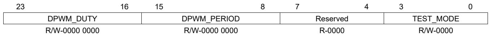

LEGEND: R/W = Read/Write; R = Read only; -*n* = value after reset

### **Table 9-12. Current Sharing Control Register (CSCTRL) Register Field Descriptions**

<span id="page-339-2"></span>

| Bit   | Field       | Type | Reset        | Description                                                                                                                                                            |
|-------|-------------|------|--------------|------------------------------------------------------------------------------------------------------------------------------------------------------------------------|
| 23-16 | DPWM_DUTY   | R/W  | 0000<br>0000 | Configures Pulse Width/Duty Cycle for DPWM output to Current Sharing circuit.<br>Resolution of LSB equals period of MCLK clock (32 ns).                                |
| 15-8  | DPWM_PERIOD | R/W  | 0000<br>0000 | Configures Period for DPWM output to Current Sharing circuit. Output period equals<br>DPWM_PERIOD+1 * LSB resolution. Resolution of LSB equals period of MCLK<br>clock |
| 7-4   | Reserved    | R/W  | 0000         |                                                                                                                                                                        |
| 3-0   | TEST_MODE   | R/W  | 0000         | Controls Current Sharing Operation                                                                                                                                     |

#### **Table 9-13.**

<span id="page-339-3"></span>

| Current Sharing Mode                         | CSCTRL.bit.TEST_MODE | Switch θ1 | Switch θ2 | Digital-PWM |
|----------------------------------------------|----------------------|-----------|-----------|-------------|
| Tri-state or Slave mode                      | 0                    | OFF       | OFF       | OFF         |
| PWM average current Bus                      | 1                    | ON        | OFF       | ACTIVE      |
| Analog average current Bus or<br>Master mode | 3                    | OFF       | ON        | OFF         |


# *9.8.6 Temperature Reference Register (TEMPREF)*

Address FFF7F03C

### **Figure 9-9. Temperature Reference Register (TEMPREF)**

11 0

<span id="page-340-0"></span>TEMP\_REF

R/W-0000 0000 0000

LEGEND: R/W = Read/Write; R = Read only; -*n* = value after reset

### **Table 9-14. Temperature Reference Register (TEMPREF) Register Field Descriptions**

<span id="page-340-1"></span>

| Bit  | Field    | Type | Reset                | Description                                                                                                                                                |
|------|----------|------|----------------------|------------------------------------------------------------------------------------------------------------------------------------------------------------|
| 11-0 | TEMP_REF | R/W  | 0000<br>0000<br>0000 | Reference measurement taken during factory trim, ADC12 measurement of the<br>internal temperature sensor at room temperature for use in offset calibration |


# <span id="page-341-0"></span>*9.8.7 Power Disable Control Register (PWRDISCTRL)*

Address FFF7F040

**Figure 9-10. Power Disable Control Register (PWRDISCTRL)**

<span id="page-341-1"></span>

|                    |                    | 17                 |                     | 16                  |                     |                  |                  |
|--------------------|--------------------|--------------------|---------------------|---------------------|---------------------|------------------|------------------|
|                    |                    | PCM_CLK_EN         |                     | CPCC_CLK_EN         |                     |                  |                  |
|                    |                    | R/W-1              |                     | R/W-1               |                     |                  |                  |
| 15                 | 14                 | 13                 | 12                  | 11                  | 10                  | 9                | 8                |
| FILTER2<br>_CLK_EN | FILTER1<br>_CLK_EN | FILTER0<br>_CLK_EN | FE_CTRL2<br>_CLK_EN | FE_CTRL1<br>_CLK_EN | FE_CTRL0<br>_CLK_EN | DPWM3<br>_CLK_EN | DPWM2<br>_CLK_EN |
| R/W-1              | R/W-1              | R/W-1              | R/W-1               | R/W-1               | R/W-1               | R/W-1            | R/W-1            |
| 7                  | 6                  | 5                  | 4                   | 3                   | 2                   | 1                | 0                |
| DPWM1<br>_CLK_EN   | DPWM0<br>_CLK_EN   | SCI1_CLK_EN        | SCI0_CLK_EN         | ADC12_CLK<br>_EN    | PMBUS_CLK<br>_EN    | GIO_CLK_EN       | TIMER_CLK<br>_EN |
| R/W-1              | R/W-1              | R/W-1              | R/W-1               | R/W-1               | R/W-1               | R/W-1            | R/W-1            |

**Table 9-15. Power Disable Control Register (PWRDISCTRL) Register Field Descriptions**

<span id="page-341-2"></span>

| Bit | Field               | Type | Reset | Description                                                                                                                                                                                        |  |
|-----|---------------------|------|-------|----------------------------------------------------------------------------------------------------------------------------------------------------------------------------------------------------|--|
| 17  | PCM_CLK_EN          | R/W  | 1     | Clock Enable for Digital Peak Current Control Module<br>0 = Disables clocks to Digital Peak Current Control Module<br>1 = Enables clocks to Digital Peak Current Control Module (Default)          |  |
| 16  | CPCC_CLK_EN         | R/W  | 1     | Clock Enable for Constant Power/Constant Current Module<br>0 = Disables clocks to Constant Power/Constant Current Module<br>1 = Enables clocks to Constant Power/Constant Current Module (Default) |  |
| 15  | FILTER2_CLK_EN      | R/W  | 1     | Clock Enable for Filter 2 Module<br>0 = Disables clocks to Filter 2 Module<br>1 = Enables clocks to Filter 2 Module (Default)                                                                      |  |
| 14  | FILTER1_CLK_EN      | R/W  | 1     | Clock Enable for Filter 1 Module<br>0 = Disables clocks to Filter 1 Module<br>1 = Enables clocks to Filter 1 Module (Default)                                                                      |  |
| 13  | FILTER0_CLK_EN      | R/W  | 1     | Clock Enable for Filter 0 Module<br>0 = Disables clocks to Filter 0 Module<br>1 = Enables clocks to Filter 0 Module (Default)                                                                      |  |
| 12  | FE_CTRL2_CLK_<br>EN | R/W  | 1     | Clock Enable for Front End Control 2 Module<br>0 = Disables clocks to Front End Control 2 Module<br>1 = Enables clocks to Front End Control 2 Module (Default)                                     |  |
| 11  | FE_CTRL1_CLK_<br>EN | R/W  | 1     | Clock Enable for Front End Control 1 Module<br>0 = Disables clocks to Front End Control 1 Module<br>1 = Enables clocks to Front End Control 1 Module (Default)                                     |  |
| 10  | FE_CTRL0_CLK_<br>EN | R/W  | 1     | Clock Enable for Front End Control 0 Module<br>0 = Disables clocks to Front End Control 0 Module<br>1 = Enables clocks to Front End Control 0 Module (Default)                                     |  |
| 9   | DPWM3_CLK_EN        | R/W  | 1     | Clock Enable for DPWM 3 Module<br>0 = Disables clocks to DPWM 3 Module<br>1 = Enables clocks to DPWM 3 Module (Default)                                                                            |  |
| 8   | DPWM2_CLK_EN        | R/W  | 1     | Clock Enable for DPWM 2 Module<br>0 = Disables clocks to DPWM 2 Module<br>1 = Enables clocks to DPWM 2 Module (Default)                                                                            |  |
| 7   | DPWM1_CLK_EN        | R/W  | 1     | Clock Enable for DPWM 1 Module<br>0 = Disables clocks to DPWM 1 Module<br>1 = Enables clocks to DPWM 1 Module (Default)                                                                            |  |


[www.ti.com](http://www.ti.com) *GPIO Overview*

**Table 9-15. Power Disable Control Register (PWRDISCTRL) Register Field Descriptions (continued)**

| Bit | Field        | Type | Reset | Description                                                                                                                                        |  |
|-----|--------------|------|-------|----------------------------------------------------------------------------------------------------------------------------------------------------|--|
| 6   | DPWM0_CLK_EN | R/W  | 1     | Clock Enable for SCI/UART 1 Module<br>0 = Disables clocks to SCI/UART 1 Module<br>1 = Enables clocks to SCI/UART 1 Module (Default)                |  |
| 5   | SCI1_CLK_EN  | R/W  | 1     | Clock Enable for SCI/UART 1 Module<br>0 = Disables clocks to SCI/UART 1 Module<br>1 = Enables clocks to SCI/UART 1 Module (Default)                |  |
| 4   | SCI0_CLK_EN  | R/W  | 1     | Clock Enable for SCI/UART 0 Module<br>0 = Disables clocks to SCI/UART 0 Module<br>1 = Enables clocks to SCI/UART 0 Module (Default)                |  |
| 3   | ADC12_CLK_EN | R/W  | 1     | Clock Enable for ADC12 Control Module<br>0 = Disables clocks to ADC12 Control Module<br>1 = Enables clocks to ADC12 Control Module (Default)       |  |
| 2   | PMBUS_CLK_EN | R/W  | 1     | Clock Enable for PMBus Interface Module<br>0 = Disables clocks to PMBus Interface Module<br>1 = Enables clocks to PMBus Interface Module (Default) |  |
| 1   | GIO_CLK_EN   | R/W  | 1     | Clock Enable for GIO Module<br>0 = Disables clocks to GIO Module<br>1 = Enables clocks to GIO Module (Default)                                     |  |
| 0   | TIMER_CLK_EN | R/W  | 1     | Clock Enable for Timer Module<br>0 = Disables clocks to Timer Module<br>1 = Enables clocks to Timer Module (Default)                               |  |

# <span id="page-342-0"></span>**9.9 GPIO Overview**

Majority of the pins in UCD3138 can be configured to serve as a general purpose input or output pin (GPIO). The only pins that can not be configured as GPIO pins are the Supply pins, Ground pins, ADC-12 analog input pins, EADC analog input pins and RESET pin.

All digital pins, with the exception of RESET pin, can be configured as GPIOs. There are two ways to configure and use the digital pins as GPIO pins:

- 1. Through the centralized Global I/O control registers.
- 2. Through the distributed control registers in the specific peripheral that shares it pins with the standard GPIO functionality.

This document explains how to use Global I/O registers in order to:

- 1. Configure each pin as a GPIO
- 2. Set each pin as input or output
- 3. Read the pin's logic state, if it is configured as an input pin
- 4. Set the logic state of the pin, if it is configured as an output pin
- 5. Configure pin/pins as open drain or push-pull (Normal)

Specific information regarding access of GPIO pins through peripherals localized to those pins can be found in the respective UCD3138 Programmer's manual covering the peripheral.

In case interaction with a GPIO pin is time critical, GPIO usage via local peripheral settings may be advantageous. In other words interaction with some of the GPIO pins via Global I/O control registers is slower than interacting with the same GPIO pin via local peripheral settings.

As previously mentioned, in the different package options of UCD3138 several I/O functions are multiplexed and routed toward a single physical pin. I/O Mux Control register may be used in order to choose a single specific functionality that is desired to be assigned to a physical device pin for the application.


Please note, Global IO naming and assignment is tied to a specific I/O pin and has a one-to-one relationship with the normal function of each I/O pin. Therefore configuration of a pin functionality using the IOMUX register will not affect its GPIO assignment.

For example, if TCK pin is configured by IOMUX to serve as PWM-0, then the bit

- "MiscAnalogRegs.GLBIOEN.bit.TCK\_IO\_EN" will still control this pin, and
- "MiscAnalogRegs.GLBIOEN.bit.TMR\_PWM0\_IO\_EN" will have no effect on the state of this pin.

# <span id="page-343-0"></span>**9.10 Interaction with a Single Pin**

Each bit in the global I/O register is defined as a single bit bit-field inside the UCD3138\_misc\_analog.h header file.

The following examples demonstrate interaction with these bits. The examples also intend to clarify and compare the utilization of local peripheral controls versus the use of centralized "Global I/O" controls.

Example 1: Setting a DPWM3B pin as a general purpose output (GPO), and set the output high. The following examples demonstrate two alternatives.

```
Example 1.1: configuration through DPWM registers:
Dpwm3Regs.DPWMCTRL1.bit.GPIO_A_ENA = 1; // Configure DPWM3A as a GPIO
Dpwm3Regs.DPWMCTRL1.bit.PWM_A_OE = 0; // 0 means output, 1 means input
Dpwm3Regs.DPWMCTRL1.bit.GPIO_A_VAL = 1; // Set output to high
Example 1.2: configuration through Global I/O registers:
MiscAnalogRegs.GLBIOEN.bit.DPWM3A_IO_EN = 1; // Set DPWM3A as GPIO
MiscAnalogRegs.GLBIOOE.bit.DPWM3A_IO_OE = 1; // 1 = output, 0 = input
MiscAnalogRegs.GLBIOVAL.bit.DPWM3A_IO_VALUE = 1;// Set output to high
```

#### Example 2: Setting a pin as a general purpose input (GPO). The following examples demonstrate two alternatives.

```
Example 2.1: configuration through GIO (fault) registers:
GioRegs.FAULTDIR.bit.FLT2_DIR = 0; // 1 means output, 0 means input
Example 2.2: configuration through Global I/O registers:
MiscAnalogRegs.GLBIOEN.bit.FAULT2_IO_EN = 1; //Configure FAULT2 as GPIO
MiscAnalogRegs.GLBIOOE.bit.FAULT2_IO_OE = 0; // 1 = output, 0 = input
```


# <span id="page-344-0"></span>**9.11 Interaction with Multiple Pins**

Even though single bits in Global I/O registers can be accessed sequentially in order to interact with multiple I/O pins, the following suggested alternative way can save some code and execution time.

The file Global\_IO.h contains several constants (masks) to accommodate interaction with Global I/O bits.

### Examples:

```
// Configure the ADC_EXT_TRIG, TMR_PWM1, FAULT2, FAULT3 and SYNC pins as GPIO pins
MiscAnalogRegs.GLBIOEN.all |= ADC_EXT_TRIG_GLBIO_BIT_MASK | TMR_PWM1
| FAULT2_GLBIO_BIT_MASK | FAULT3_GLBIO_BIT_MASK | SYNC_GLBIO_BIT_MASK;
// Set Both FAULT2 and FAULT3 pins high
MiscAnalogRegs.GLBIOOE.all |= FAULT2_GLBIO_BIT_MASK
| FAULT3_GLBIO_BIT_MASK;
// Clear Both FAULT2 and FAULT3 pins (set to low)
MiscAnalogRegs.GLBIOOE.all &= (FAULT2_GLBIO_BIT_MASK
| FAULT3_GLBIO_BIT_MASK);
// Connect pull-up FETs to both ADC_EXT_TRIG and SYNC pins
MiscAnalogRegs.GLBIOOD.all |= ADC_EXT_TRIG_GLBIO_BIT_MASK
| SYNC_GLBIO_BIT_MASK;
// check whether the ADC_EXT_TRIG pin or the SYNC pin are pulled high
if( MiscAnalogRegs.GLBIOREAD.all &
    (ADC_EXT_TRIG_GLBIO_BIT_MASK | SYNC_GLBIO_BIT_MASK))
```


*Registers* [www.ti.com](http://www.ti.com)

# <span id="page-345-1"></span>**9.12 Registers**

# <span id="page-345-2"></span>*9.12.1 Global I/O EN Register (GBIOEN)*

Address FFF7F018

### **Figure 9-11. Global I/O EN Register (GBIOEN)**

<span id="page-345-0"></span>29 0 GLOBAL\_IO\_EN

R/W-00 0000 0000 0000 0000 0000 0000 0000

LEGEND: R/W = Read/Write; R = Read only; -*n* = value after reset

# **Table 9-16. ADC Control Register (ADCCTRL) Register Field Descriptions**

<span id="page-345-3"></span>

| Bit  | Field        | Type | Reset                                                   | Description                                                                                                                                                                                         |
|------|--------------|------|---------------------------------------------------------|-----------------------------------------------------------------------------------------------------------------------------------------------------------------------------------------------------|
| 29-0 | GLOBAL_IO_EN | R/W  | 00 0000<br>0000<br>0000<br>0000<br>0000<br>0000<br>0000 | This register enables the global control of digital I/O pins<br>0 = Control of IO is done by the functional block assigned to the IO (Default)<br>1 = Control of IO is done by Global IO registers. |

| BIT | PIN_NAME     | BIT | PIN_NAME |
|-----|--------------|-----|----------|
| 29  | FAULT[3]     | 14  | CONTROL  |
| 28  | ADC_EXT_TRIG | 13  | ALERT    |
| 27  | TCK          | 12  | EXT_INT  |
| 26  | TDO          | 11  | FAULT[2] |
| 25  | TMS          | 10  | FAULT[1] |
| 24  | TDI          | 9   | FAULT[0] |
| 23  | SCI_TX[1]    | 8   | SYNC     |
| 22  | SCI_TX[0]    | 7   | DPWM3B   |
| 21  | SCI_RX[1]    | 6   | DPWM3A   |
| 20  | SCI_RX[0]    | 5   | DPWM2B   |
| 19  | TMR_CAP      | 4   | DPWM2A   |
| 18  | TMR_PWM[1]   | 3   | DPWM1B   |
| 17  | TMR_PWM[0]   | 2   | DPWM1A   |
| 16  | PMBUS-CLK    | 1   | DPWM0B   |
| 15  | PMBUS-DATA   | 0   | DPWM0A   |


[www.ti.com](http://www.ti.com) *Registers*

### <span id="page-346-0"></span>*9.12.2 Global I/O OE Register (GLBIOOE)*

Address FFF7F01C

### **Figure 9-12. Global I/O OE Register (GLBIOOE)**

<span id="page-346-1"></span>29 0

GLOBAL\_IO\_OE

R/W-00 0000 0000 0000 0000 0000 0000 0000

LEGEND: R/W = Read/Write; R = Read only; -*n* = value after reset

### **Table 9-17. Global I/O OE Register (GLBIOOE) Register Field Descriptions**

<span id="page-346-2"></span>

| Bit  | Field        | Type | Reset                                                   | Description                                                                                                    |
|------|--------------|------|---------------------------------------------------------|----------------------------------------------------------------------------------------------------------------|
| 29-0 | GLOBAL_IO_OE | R/W  | 00 0000<br>0000<br>0000<br>0000<br>0000<br>0000<br>0000 | This register controls the output enable signals for all digital I/O pins<br>0 = Input (Default)<br>1 = Output |

| BIT | PIN_NAME     | BIT | PIN_NAME |
|-----|--------------|-----|----------|
| 29  | FAULT[3]     | 14  | CONTROL  |
| 28  | ADC_EXT_TRIG | 13  | ALERT    |
| 27  | TCK          | 12  | EXT_INT  |
| 26  | TDO          | 11  | FAULT[2] |
| 25  | TMS          | 10  | FAULT[1] |
| 24  | TDI          | 9   | FAULT[0] |
| 23  | SCI_TX[1]    | 8   | SYNC     |
| 22  | SCI_TX[0]    | 7   | DPWM3B   |
| 21  | SCI_RX[1]    | 6   | DPWM3A   |
| 20  | SCI_RX[0]    | 5   | DPWM2B   |
| 19  | TMR_CAP      | 4   | DPWM2A   |
| 18  | TMR_PWM[1]   | 3   | DPWM1B   |
| 17  | TMR_PWM[0]   | 2   | DPWM1A   |
| 16  | PMBUS-CLK    | 1   | DPWM0B   |
| 15  | PMBUS-DATA   | 0   | DPWM0A   |


*Registers* [www.ti.com](http://www.ti.com)

### <span id="page-347-1"></span>*9.12.3 Global I/O Open Drain Control Register (GLBIOOD)*

Address FFF7F020

### **Figure 9-13. Global I/O Open Drain Control Register (GLBIOOD)**

<span id="page-347-0"></span>29 0

GLOBAL\_IO\_OD

R/W-00 0000 0000 0000 0000 0000 0000 0000

LEGEND: R/W = Read/Write; R = Read only; -*n* = value after reset

### **Table 9-18. Global I/O Open Drain Control Register (GLBIOOD) Register Field Descriptions**

<span id="page-347-2"></span>

| Bit  | Field        | Type | Reset                                                   | Description                                                                                                                                                                                  |
|------|--------------|------|---------------------------------------------------------|----------------------------------------------------------------------------------------------------------------------------------------------------------------------------------------------|
| 29-0 | GLOBAL_IO_OD | R/W  | 00 0000<br>0000<br>0000<br>0000<br>0000<br>0000<br>0000 | This register controls if the global IO is configured as an open drain. This bit<br>multiplexes the GLOBAL_IO_VALUE register to the OE signals<br>0 = Normal I/O (Default)<br>1 = Open Drain |

| BIT | PIN_NAME     | BIT | PIN_NAME |
|-----|--------------|-----|----------|
| 29  | FAULT[3]     | 14  | CONTROL  |
| 28  | ADC_EXT_TRIG | 13  | ALERT    |
| 27  | TCK          | 12  | EXT_INT  |
| 26  | TDO          | 11  | FAULT[2] |
| 25  | TMS          | 10  | FAULT[1] |
| 24  | TDI          | 9   | FAULT[0] |
| 23  | SCI_TX[1]    | 8   | SYNC     |
| 22  | SCI_TX[0]    | 7   | DPWM3B   |
| 21  | SCI_RX[1]    | 6   | DPWM3A   |
| 20  | SCI_RX[0]    | 5   | DPWM2B   |
| 19  | TMR_CAP      | 4   | DPWM2A   |
| 18  | TMR_PWM[1]   | 3   | DPWM1B   |
| 17  | TMR_PWM[0]   | 2   | DPWM1A   |
| 16  | PMBUS-CLK    | 1   | DPWM0B   |
| 15  | PMBUS-DATA   | 0   | DPWM0A   |


[www.ti.com](http://www.ti.com) *Registers*

# <span id="page-348-0"></span>*9.12.4 Global I/O Value Register (GLBIOVAL)*

Address FFF7F024

### **Figure 9-14. Global I/O Value Register (GLBIOVAL)**

<span id="page-348-1"></span>29 0

GLOBAL\_IO\_VALUE

R/W-00 0000 0000 0000 0000 0000 0000 0000

LEGEND: R/W = Read/Write; R = Read only; -*n* = value after reset

### **Table 9-19. Global I/O Value Register (GLBIOVAL) Register Field Descriptions**

<span id="page-348-2"></span>

| Bit  | Field               | Type | Reset                                                   | Description                                                                                                                                                                                                      |
|------|---------------------|------|---------------------------------------------------------|------------------------------------------------------------------------------------------------------------------------------------------------------------------------------------------------------------------|
| 29-0 | GLOBAL_IO_<br>VALUE | R/W  | 00 0000<br>0000<br>0000<br>0000<br>0000<br>0000<br>0000 | This register set the output value of the digital I/O pins when configured as outputs<br>0 = Digital I/O pin configured as low in output mode (Default)<br>1 = Digital I/O pin configured as high in output mode |

| BIT | PIN_NAME     | BIT | PIN_NAME |
|-----|--------------|-----|----------|
| 29  | FAULT[3]     | 14  | CONTROL  |
| 28  | ADC_EXT_TRIG | 13  | ALERT    |
| 27  | TCK          | 12  | EXT_INT  |
| 26  | TDO          | 11  | FAULT[2] |
| 25  | TMS          | 10  | FAULT[1] |
| 24  | TDI          | 9   | FAULT[0] |
| 23  | SCI_TX[1]    | 8   | SYNC     |
| 22  | SCI_TX[0]    | 7   | DPWM3B   |
| 21  | SCI_RX[1]    | 6   | DPWM3A   |
| 20  | SCI_RX[0]    | 5   | DPWM2B   |
| 19  | TMR_CAP      | 4   | DPWM2A   |
| 18  | TMR_PWM[1]   | 3   | DPWM1B   |
| 17  | TMR_PWM[0]   | 2   | DPWM1A   |
| 16  | PMBUS-CLK    | 1   | DPWM0B   |
| 15  | PMBUS-DATA   | 0   | DPWM0A   |


*Registers* [www.ti.com](http://www.ti.com)

### <span id="page-349-0"></span>*9.12.5 Global I/O Read Register (GLBIOREAD)*

Address FFF7F028

### **Figure 9-15. Global I/O Read Register (GLBIOREAD)**

<span id="page-349-1"></span>29 0 GLOBAL\_IO\_READ

R-0

LEGEND: R/W = Read/Write; R = Read only; -*n* = value after reset

# **Table 9-20. Global I/O Read Register (GLBIOREAD) Register Field Descriptions**

<span id="page-349-2"></span>

| Bit  | Field              | Type | Reset | Description                                                                                                                         |
|------|--------------------|------|-------|-------------------------------------------------------------------------------------------------------------------------------------|
| 29-0 | GLOBAL_IO_<br>READ | R    | 0     | This register provides the value on these signals after I/O muxing<br>0 = Digital I/O pin low (Default)<br>1 = Digital I/O pin high |

| BIT | PIN_NAME     | BIT | PIN_NAME |
|-----|--------------|-----|----------|
| 29  | FAULT[3]     | 14  | CONTROL  |
| 28  | ADC_EXT_TRIG | 13  | ALERT    |
| 27  | TCK          | 12  | EXT_INT  |
| 26  | TDO          | 11  | FAULT[2] |
| 25  | TMS          | 10  | FAULT[1] |
| 24  | TDI          | 9   | FAULT[0] |
| 23  | SCI_TX[1]    | 8   | SYNC     |
| 22  | SCI_TX[0]    | 7   | DPWM3B   |
| 21  | SCI_RX[1]    | 6   | DPWM3A   |
| 20  | SCI_RX[0]    | 5   | DPWM2B   |
| 19  | TMR_CAP      | 4   | DPWM2A   |
| 18  | TMR_PWM[1]   | 3   | DPWM1B   |
| 17  | TMR_PWM[0]   | 2   | DPWM1A   |
| 16  | PMBUS-CLK    | 1   | DPWM0B   |
| 15  | PMBUS-DATA   | 0   | DPWM0A   |


# <span id="page-350-0"></span>**9.13 Trim and Test Registers - Note**

There are several trim and test registers in the Miscellaneous Analog Control register set.

### **CAUTION**

It is highly recommended that nearly all of the bit-fields in these registers be untouched by a customer program. There is one exception:

• For the best clock accuracy over temperature, the HFO\_LN\_FILTER\_EN bit in the CLKTRIM register should be cleared.

The data sheet specification for clock performance is characterized with this bit cleared. It is necessary for the customer program to clear this bit, since the default value is for this bit to be set.

### <span id="page-350-1"></span>*9.13.1 Clock Trim Register (CLKTRIM) (For Factory Test Use Only, Except HFO\_LN\_FILTER\_EN)*

Address FFF7F000

**Figure 9-16. Clock Trim Register (CLKTRIM) (For Factory Test Use Only, Except HFO\_LN\_FILTER\_EN)**

<span id="page-350-2"></span>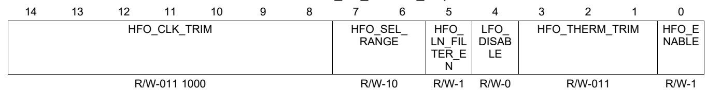

**Table 9-21. Clock Trim Register (CLKTRIM) (For Factory Test Use Only, Except HFO\_LN\_FILTER\_EN) Register Field Descriptions**

| Bit  | Field                | Type | Reset    | Description                                                                                                                                                                                                          |
|------|----------------------|------|----------|----------------------------------------------------------------------------------------------------------------------------------------------------------------------------------------------------------------------|
| 14-8 | HFO_CLK_TRIM         | R/W  | 011 1000 | High Frequency Oscillator Clock Trim Bits. Register will be programmed during test<br>and should not be overwritten by firmware                                                                                      |
| 7-6  | HFO_SEL_<br>RANGE    | R/W  | 10       | High Frequency Oscillator Range Select Bits. Register will be programmed during<br>test and should not be overwritten by firmware.                                                                                   |
| 5    | HFO_LN_FILTER<br>_EN | R/W  | 1        | High Frequency Oscillator Low Noise Filter. Register should be cleared by firmware.                                                                                                                                  |
| 4    | LFO_DISABLE          | R/W  | 0        | Low Frequency Oscillator Disable. Register will be programmed during test and<br>should not be overwritten by firmware.<br>0 = Low Frequency Oscillator Enabled (Default)<br>1 = Low Frequency Oscillator Disabled   |
| 3-1  | HFO_THERM<br>_TRIM   | R/W  | 011      | High Frequency Oscillator Thermal Coefficient Trim Bits. Register will be<br>programmed during test and should not be overwritten by firmware                                                                        |
| 0    | HFO_ENABLE           | R/W  | 1        | High Frequency Oscillator Enable. Register will be programmed during test and<br>should not be overwritten by firmware.<br>0 = High Frequency Oscillator Disabled<br>1 = High Frequency Oscillator Enabled (Default) |

<span id="page-351-0"></span>

# *PMBus Interface/I2C Interface*

The UCD3138 family has a powerful and flexible PMBus/I2C interface. It has support for master mode, but its primary use is in slave mode. Here are some of its features in slave mode:

- Supports most I2C functions.
- Designed to reduce CPU overhead
  - Receives/Transmits up to 4 bytes at once
  - Handles all PMBus sequencing in hardware
  - Automatic Stop/Start sequence detection in hardware
  - Provides automatic optimized clock stretching
  - Automatic Acknowledge of Address, Command, and Data
  - Can be used with polling alone, no interrupts needed
  - Provides automatic PEC generation/checking
  - Automatic hardware implementation of Alert arbitration
  - Automatic Clock Low Timeout detection in hardware
  - Address Mask permits automatic acknowledge of multiple addresses

### • Flexible

- Supports polling and interrupt-driven firmware
- Can be configured to automatically acknowledge 1, 2, or 3 bytes of data at a time on the fly.
- Auto or manual acknowledge of Address and Command bytes
- Supports 100 and 400 kHz
- Access to state of each PMBus Pin
- Additional features supported on some devices
  - 2 address registers permit automatic acknowledgement of any 2 addresses
  - 2 PMBus/I2C interfaces on one device
  - Clock High Timeout detection in hardware
  - Support for I2C in Master mode

**Topic** ........................................................................................................................... **Page**

| 10.1  | PMBus Register Summary                      | 353 |
|-------|---------------------------------------------|-----|
| 10.2  | PMBus Slave Mode Initialization             | 353 |
| 10.3  | PMBus Slave Mode Command Examples           | 355 |
| 10.4  | Avoiding Clock Stretching                   | 367 |
| 10.5  | PMBus Slave Mode Low Level Timing           | 369 |
| 10.6  | Effect of MAN_SLAVE_ACK bit on EOM Handling | 371 |
| 10.7  | Master Mode Operation Reference             | 372 |
| 10.8  | PMBUS Communications Fault Handling         | 381 |
| 10.9  | Other Functions of the PMBus Module         | 382 |
| 10.10 | PMBus Interface Registers Reference         | 382 |
|       |                                             |     |


# <span id="page-352-0"></span>**10.1 PMBus Register Summary**

The PMBus interface has 9 registers.

- PMBCTRL1 control for master mode only
- PMBCTRL2 control for slave mode only
- PMBCTRL3 control for both modes and for using pins as GPIO
- PMBINTM interrupt masks for both modes
- PMBST status bits many are clear on read bits
- PMBRXBUF holds up to 4 bytes of received data
- PMBTXBUF holds up to 4 bytes of data to be transmitted
- PMBACK write a 1 to ACK, or a 0 to NACK
- PMBHSA holds slave address which was automatically acknowledged

For a detailed description of each register and bitfield see [Section](#page-381-2) 10.10.

# <span id="page-352-1"></span>**10.2 PMBus Slave Mode Initialization**

This section and the following ones reference specific registers and bitfields in the PMBus/I2C interface. There are several ways to use the PMBus for slave mode. Many TI EVM codes use polling, not interrupts. It's not hard to write the background loop to call the PMBus function every 2 or 3 msec worst case. This is plenty to meet the PMBus timing requirements. It frees up the CPU for more urgent power supply tasks. It is also possible to use interrupts to run the PMBus.

# <span id="page-352-2"></span>*10.2.1 Initialization for Polling and Maximum Automatic Acknowledgement*

Here are the register settings to disable interrupts and to set up for as much automatic acknowledgement and PEC calculation as possible:

- PMBCTRL1 All zeroes this is the default, so no write is necessary
- PMBCTRL2 Several bits need to be set
  - RX\_BYTE\_ACK\_CNT = 3 this means up to 3 bytes will be auto acknowledged it is the default state of these bits after reset
  - PEC\_ENA = 1 this enables the automatic PEC calculation logic this is not the default state
  - SLAVE\_MASK = 0x7F This makes the interface auto acknowledge only one address this is the default state.
  - SLAVE\_ADDR = desired slave address this defaults to 0x7c
  - The other bits in PMBCTRL2 should be left in the default zero state for this mode
- PMBCTRL3 set SLAVE\_EN, clear all other bits this is the default state
  - In slave mode, even if 400 kHz is desired, there's no need to set the FAST\_MODE bit.
  - FAST\_MODE only affects the timing of the BUS\_FREE bit and, of course, the output clock rate, both of which are only used in master mode. It has no effect on any slave mode timings.
- PMBINTM set all bits to mask off all PMBus interrupts this is the default state

#### <span id="page-352-3"></span>*10.2.2 Initialization for Interrupts and for Manual Acknowledgement*

If an interrupt driven PMBus interface is desired, just write ones to the appropriate bits in PMBINTM. Note that DATA\_READY, DATA\_REQUEST and EOM are the only ones absolutely required. Some of the other interrupts are only for master mode, some are for Alert and Control, and some are discretionary for slave mode.

If manual acknowledgement is desired, there are three bitfields which can be modified, all in PMBCTRL2.

- RX\_BYTE\_CNT
  - Default = 3, meaning 3 bytes auto acknowledged, 2 for 2 bytes, and so on
  - These settings are useful if the Master requires invalid data to be NACKed
  - They can be set dynamically as the message comes in.


- MAN\_CMD
  - Default = 0 command auto acknowledged
  - 1 command must be acknowledged by firmware.
  - This is useful if the Master requires invalid commands to be NACKed
- MAN\_SLAVE\_ACK
  - Default = 0 slave address ACKed automatically.
  - 1 Slave address must be acknowledged by firmware
  - This is useful if multiple slave addresses are desired and the mask register can't provide them automatically

All manual ACKs should only be used if necessary for the application, as they will increase CPU and bus overhead.

# <span id="page-353-0"></span>*10.2.3 Initialization for I2C*

The I2C bus is very similar to the PMBus. One difference is that the I2C has no maximum clock low time. The PMBus has a 35 msec maximum clock low time, and the UCD3138 PMBus interface automatically detect violations of this. If this functionality is not desired, you can set the CLK\_LO\_DIS bit in PMBCTRL3.

# <span id="page-353-1"></span>*10.2.4 Initialization for Advanced Features in Some Devices*

Several newer UCD3138 family members have advanced features in the PMBus interface:

# **10.2.4.1 Auto Acknowledge of Second Address**

The UCD3138A64, UCD3138A64A, UCD3138128 and UCD3138128A can automatically acknowledge a second address. To use this:

- Write the address to the SLAVE\_ADDR\_2 bitfield in PMBCTRL2
- Set the SLAVE\_ADDR\_2\_EN bit in PMBCTRL2
- These fields are only available on the '128 and '128A devices

### **10.2.4.2 Clock High Timeout Detection**

The UCD3138 and UCD3138064 devices have bits called CLK\_HIGH\_DETECT (in PBINTM) and CLK\_HIGH\_TIMEOUT (in PMBST) but they are not recommended for use.

On the UCD3138A, UCD3138064A, UCD3138A64, UCD3138A64A, UCD3138128 and UCD3138128A, the Clock High Timeout function is usable. Because of the need for backward compatibility, the UCD3138A and the UCD3138064A handle it a bit differently than the other devices.

All of the devices which support Clock High Timeout have an enable/disable bit added to PMBCTRL3. On the 'A64, 'A64A, '128 and '128A, the bit is an disable bit which defaults to a 1. On the UCD3138A and the '064A, it is an enable bit which defaults to a zero. This is to provide backward compatibility because bit was a zero in the non-a versions of those chips.

The name of the bit in PBINTM also changes. Here is a table of all the chips with the bit names:

**Table 10-1.**

<span id="page-353-2"></span>

|            | PMBST            | PMBINTM              | PMBCTRL3   | Notes         |
|------------|------------------|----------------------|------------|---------------|
| UCD3138    | CLK_HIGH_TIMEOUT | CLK_HIGH_D<br>ETECT  | N/A        | Do not use    |
| UCD3138064 | CLK_HIGH_TIMEOUT | CLK_HIGH_D<br>ETECT  | N/A        | Do not use    |
| UCD3138A64 | CLK_HIGH_TIMEOUT | CLK_HIGH_TI<br>MEOUT | CLK_HI_DIS | Low to enable |
| UCD3138128 | CLK_HIGH_TIMEOUT | CLK_HIGH_TI<br>MEOUT | CLK_HI_DIS | Low to enable |


**Table 10-1. (continued)**

|             | PMBST            | PMBINTM              | PMBCTRL3   | Notes          |
|-------------|------------------|----------------------|------------|----------------|
| UCD3138A    | CLK_HIGH_TIMEOUT | CLK_HIGH_D<br>ETECT  | CLK_HI_EN  | High to enable |
| UCD3138064A | CLK_HIGH_TIMEOUT | CLK_HIGH_D<br>ETECT  | CLK_HI_EN  | High to enable |
| UCD3138A64A | CLK_HIGH_TIMEOUT | CLK_HIGH_TI<br>MEOUT | CLK_HI_DIS | Low to enable  |
| UCD3138128A | CLK_HIGH_TIMEOUT | CLK_HIGH_TI<br>MEOUT | CLK_HI_DIS | Low to enable  |

To enable clock high detection on the chips which support it, either set the CLK\_HI\_EN bit or clear the CLK\_HI\_DIS bit in PMBCTRL3. If the PMBus Clock pin stays high for 50 msec in the middle of a message to the UCD, the CLK\_HIGH\_TIMEOUT bit in PMBST will be set and the PMBus hardware will go to an idle state and wait for a new message. To enable an interrupt, clear the bit in PMBINTM.

The 50 msec time is not an official PMBus specification, but it is a useful way to determine if the bus clock is stuck high. With the hardware timeout detection, it is not necessary to use any firmware to detect timeout.

# <span id="page-354-0"></span>**10.3 PMBus Slave Mode Command Examples**

The logic and timing of the PMBus interface is best explained by some examples of PMBus commands. The detailed timing numbers are in [Section](#page-368-0) 10.5.

# <span id="page-354-1"></span>*10.3.1 Write Command (Send Byte), No PEC*

This is the simplest PMBus command, requiring only 2 bytes. The messages will first be shown with all auto acknowledgement enabled. With auto-acknowledgement, this message and all short write messages can be handled with one short sequence of code, executed once per message. The start of the next message is included in the drawing. This shows the timing requirements if a second message follows with no delay.


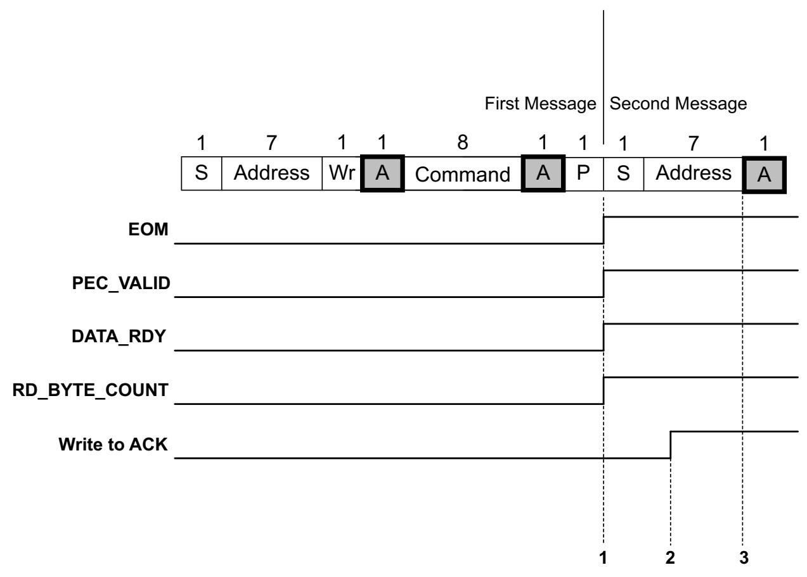

- **Figure 10-1.**
- <span id="page-355-0"></span>1. End of Message indicated by rising edge on PMBUS\_DATA pin (PMBus STOP)
  - After a delay of tEOM from the falling edge, 4 things occur simultaneously
    - EOM bit is set
    - PEC\_VALID is set if the last byte matches a valid PEC. Since this message doesn't have a PEC, the result will be random, depending if the PEC calculation happens to match. In all these drawings, a rising edge on the PEC\_VALID line means that the PEC\_VALID bit is set or cleared to indicate whetehre the last byte was a valid PEC for the message.
    - DATA\_RDY is set
    - RD\_BYTE\_COUNT is set to 1
- 2. The firmware will read the PMBST (status) register. This will clear all the clear on read status bits. It will also clear any interrupts caused by those bits. The firmware will determine which message type is present from the PMBST bits.
- 3. Next the firmware needs to get the data from the RXBUF register. Then it needs to write a 1 to the ACK register. This tells the PMBus hardware that it can accept new data. In this case, the ACK is only used internally to tell the interface that the firmware has recognized the EOM. The ACK bit is cleared immediately on being set. Writing a NACK (zero) to the ACK register is not appropriate here, since the entire message has already been ACKed by the hardware. Writing a NACK may cause issues with later messages.
- 4. If the ACK register is not written to from by point 3, and the address for the second message is also auto acknowledged by the hardware, clock stretching will start at the beginning of the next ACK. If the address doesn't match what's programmed into the PMBus slave address, no clock stretching will occur. The timing between a write to the ACK register and the release of the clock stretch will be tACKWRITE. The clock stretching is automatically provided by the hardware with no firmware action required.


### <span id="page-356-0"></span>10.3.2 Other Simple Writes with Auto Acknowledge

Writes with an address and up to 3 bytes of data/command/PEC will be handled essentially the same way as the one with a single byte.

For simplicity, the ACK and clock stretching sequence will be left off these drawings.

<span id="page-356-1"></span>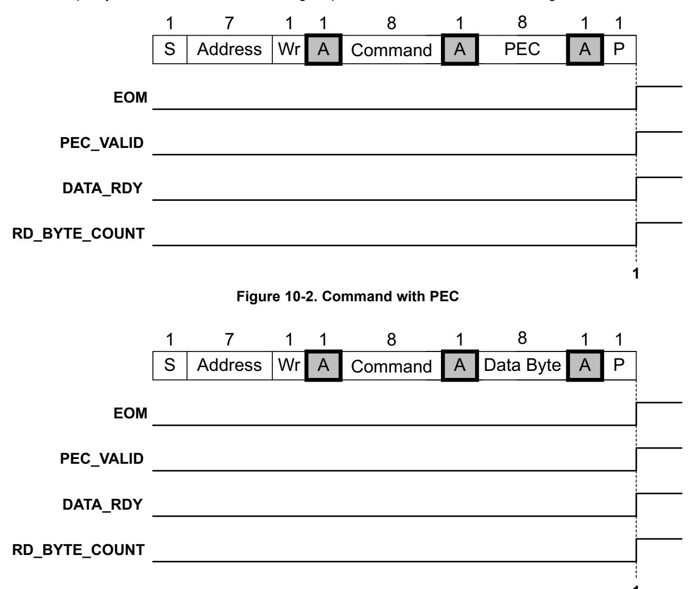

<span id="page-356-2"></span>Figure 10-3. Write Command and Byte - No PEC


<span id="page-357-2"></span>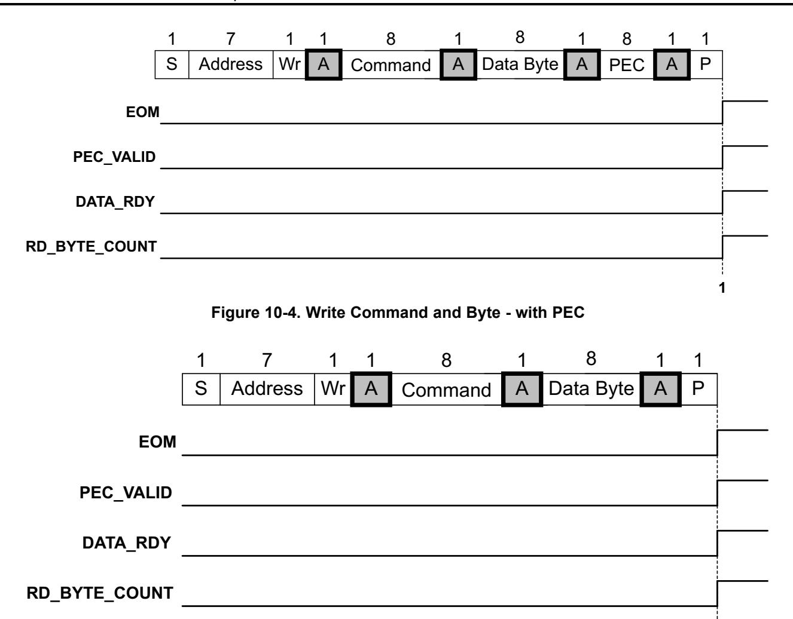

Figure 10-5. Write 2 Bytes with no PEC

<span id="page-357-3"></span>All of these diagrams have the same basic operation – at the end of the message the firmware simply has to read the RXBUF and set the ACK bit, and process the message. The only difference is the number put in RD\_BYTE\_COUNT, and the value put in PEC\_VALID. The command byte, any data bytes, and the PEC all are included in the RD\_BYTE\_COUNT.

#### <span id="page-357-0"></span>10.3.3 Quick Command Write

The Quick Command has only the address byte with the R/W bit cleared to indicate a write. It is just the same as the messages above, except the DATA\_RDY and RD\_BYTE\_COUNT bits will not be set. Since there is no data, only the EOM bit will be set. Ignore PEC\_VALID.

### <span id="page-357-1"></span>10.3.4 Writes of 4 Bytes or More With Full Auto Acknowledge

At 4 bytes counting command, data, and PEC, if any, the 4 byte RXBUF will be full. The RXBUF must be read, and the ACK bit set, before the PMBus hardware can accept more data. If the firmware is quick enough, there will be no clock stretching. The PMBus hardware automatically provides clock stretching on the ACK for the 4th byte, if it is necessary. Here is the timing diagram:

1


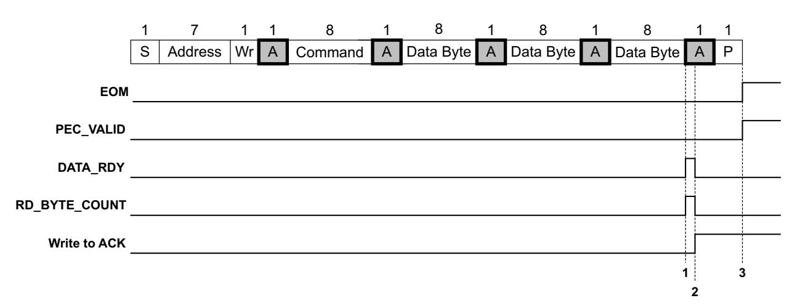

Figure 10-6. Timing Diagram

- <span id="page-358-0"></span>1. RXBUF is full, number of bytes received is equivalent to RX\_BYTE\_ACK\_CNT. DATA\_RDY is set and RD\_BYTE\_COUNT is loaded with a 4. The interface is prepared to stretch the clock. This occurs t<sub>DRDY</sub> after the falling edge of the clock for bit 8.
- 2. The firmware reads the data from RXBUF and writes a 1 to the ACK bit. This turns off the clock stretch. The delay between write to ACK and disable of clock stretch is t<sub>ACKWRITE</sub>. Reading from PMBST clears the DATA\_RDY bit and the RD\_BYTE\_COUNT bits.
- 3. On the falling edge of PMBUS\_CLK indicating the STOP signal, the EOM bit is set, and the PEC\_VALID bit is set or cleared to indicate if the last byte was a valid PEC. The timing after the falling edge is tEOM.

If step 3 is delayed, clock stretching of the next valid address will occur in the same way as described in Section 10.3.1.

The exact same sequence will occur if the 3rd data byte is replaced with a valid PEC, except that the PEC\_VALID bit will be always set.

For messages with 5 through 7 bytes, the sequence will be as described below:

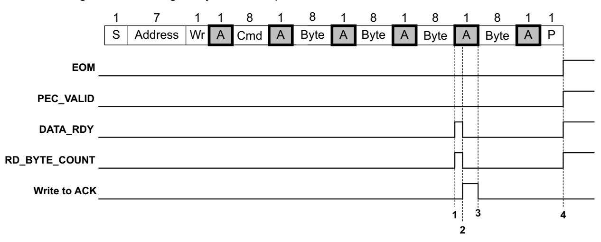

Figure 10-7. Write 4 Bytes + Command

<span id="page-358-1"></span>There are 4 items here:

- 1. DATA\_RDY and RD\_BYTE\_COUNT set as described above
- 2. DATA\_RDY and RD\_BYTE\_COUNT cleared by read from PMBST, data read from RXBUF, 1 written to ACK bit. Clock stretch released.


- 3. ACK bit cleared by occurrence of ACK on bus.
- 4. Here the EOM and DATA\_RDY bit are set, and the RD\_BYTE\_COUNT and PEC\_VALID bits are loaded with appropriate values. RD\_BYTE\_COUNT will be loaded with a 1, showing that there is one byte in the RXBUF. After this, the sequence is the same as described in [Section](#page-354-1) 10.3.1.

Writing 6 and 7 total bytes will have the same effect, except that there will be a different number in the RD\_BYTE\_COUNT register. At 8 bytes, the sequence at the end of the message will be the same as at 4 bytes, because RXBUF will be full again. At 9 bytes, the end of the message will be the same as at 5. And it will continue the same after that. If the RXBUF is not full when the STOP occurs, all 4 bitfields will be loaded simultaneously. If the last byte fills up RXBUF, the data must be acknowledged by writing to ACK before the clock stretch will be released.

# <span id="page-359-0"></span>*10.3.5 Writes with Less than 3 Bytes Auto-Acknowledged*

All the timing above assumes that RX\_BYTE\_ACK\_CNT is set to the maximum value of 3, meaning that 3 bytes will be ACKed automatically. If it is set to 2, for example, the sequence will repeat every 3 bytes, instead of every 4.

If it is set to 0, every byte will need to be ACKed the same way as shown above for every 4 bytes.

Using less than 4 bytes in the RX\_BYTE\_ACK\_CNT is only recommended if the requirement is for NACK of invalid data. Otherwise it leads to unnecessary overhead for the CPU and the bus.

# <span id="page-359-1"></span>*10.3.6 Manual Slave Address ACK for Write.*

If the MAN\_SLAVE\_ACK bit is set, then the firmware must manually ACK the slave address. Normally this is used if there are multiple addresses which must be decoded, and where the mask register will not cover them all. Here is the sequence when a write occurs:

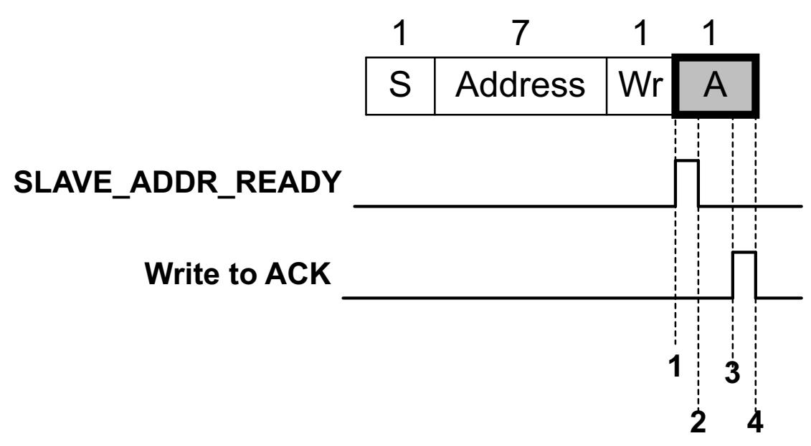

**Figure 10-8. Slave Address Manual ACK for Write**

#### <span id="page-359-2"></span>The steps are:

- 1. At delay tSAR after the falling edge of the clock for the 8th bit in the address, the SLAVE\_ADDR\_READY bit is set.
- 2. The firmware reads PMBST, clearing the SLAVE\_ADDR\_READY bit. The firmware then reads the slave address from the RXBUF. The slave address is in the first 7 bits, the most significant bit is random, and should be masked out.
- 3. The firmware writes a 1 (if the address matches) or a 0 (if the address doesn't match) to the ACK bit. Clock stretch will be cleared tACKWRITE after the ACK bit is written to. If the firmware is fast enough, no clock stretch will occur.


4. The ACK will be cleared by the end of the ACK sequence.

The manual slave ACK has no effect on later bytes in the sequence, so there is no need to show full sequences with manual slave ACK at the beginning. All sequences will be the same as if there is an automatic slave ACK after step 4 in the figure above.

# <span id="page-360-0"></span>*10.3.7 Manual Command ACK*

If the MAN\_CMD bit is set, the firmware will be required to manually acknowledge every command. This should only be used if there is a requirement for NACK of invalid commands. Here is the sequence for this byte:

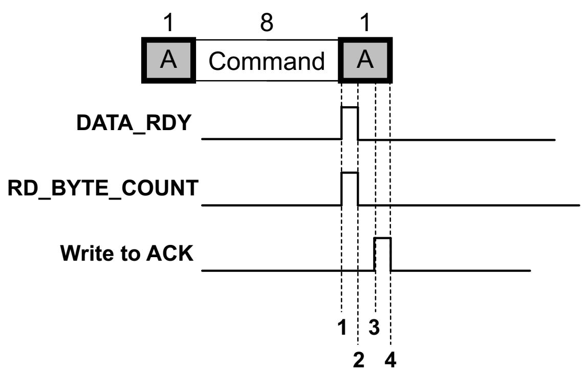

**Figure 10-9. Manual ACK Command**

<span id="page-360-2"></span>Manual command timing is actually exactly the same as the timing for a byte when the RXBUF needs to be read:

- 1. tDRDY after the falling clock for the last bit of the command, DATA\_RDY is set, and 1 is put into RD\_BYTE\_COUNT.
- 2. The firmware reads PMBST, and then reads the command from RXBUF
- 3. The firmware writes a 1 or a 0 to the ACK register, depending on whether the command is accepted or not. tACKWRITE after the write to ACK, any clock stretch is ended. If the firmware is fast enough, clock stretching will not occur at all.
- 4. The ACK bit is cleared by the end of the ACK signal on the bus.

### <span id="page-360-1"></span>*10.3.8 Read Messages with Full Automation*

Like write messages, read messages can be handled most efficiently by using the full 4 bits of the buffer, TXBUF in this case. With automatic address acknowledgement, the Read command can be handled almost as efficiently as the write command. This is especially true of the simplest case, which is I2C specific, not supported in the PMBus – read only. Here is the sequence diagram:


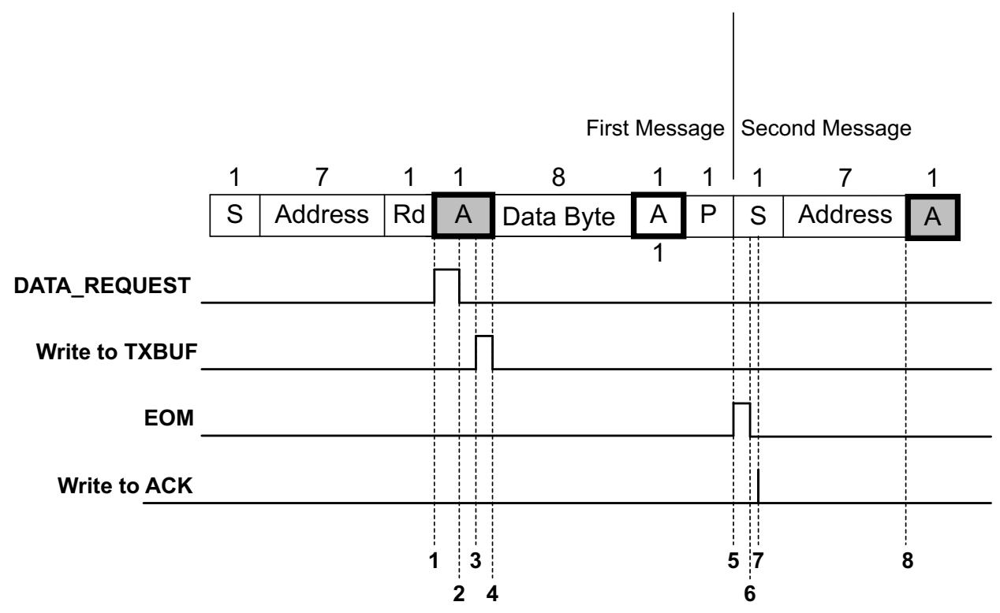

**Figure 10-10. Simple Read with Full Automation**

- <span id="page-361-1"></span>1. DATA\_REQUEST is set tDREQ1 nanoseconds after the falling edge of the clock for the last bit of the address.
- 2. The firmware reads from PMBST, clearing the DATA\_REQUEST bit. Since one byte is being sent out, the firmware needs to make sure that TX\_COUNT is set to 1.
- 3. Next the firmware needs to write the byte to TXBUF. It takes ttxbwrite ns after the write for any clock stretching of the ACK to be ended. If the firmware is fast enough, no clock stretching will occur.
- 4. As soon as the data starts being transmitted, the TXBUF is transferred to the shift register
- 5. The EOM bit will be set tEOM ns after the falling edge of the data line indicating the stop signal.
- 6. The firmware needs to read the PMBST register, which will clear the EOM bit.
- 7. Then the firmware needs to write to the ACK register. This is just an internal ACK to tell the interface that the EOM has been detected. The ACK bit is cleared immediately, since there is no wait for an external ACK to complete.
- 8. Like the write message, there is no clock stretch until a valid address is detected. If the ACK is written to before this, there is no clock stretch at all.

Note that the A with a 1 below and with no grey background means a NACK from the master, which is appropriate for the last byte of a read message.

#### <span id="page-361-0"></span>*10.3.9 Simple Read of 4 Bytes with Full Automation*

Up to 4 bytes can be read with the same number of firmware steps as 1 byte, taking advantage of the 4 byte TXBUF. Here is a sequence diagram for 4 bytes:


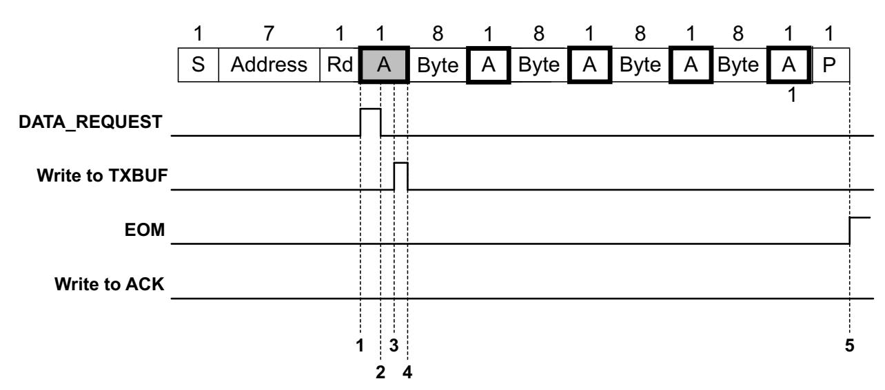

**Figure 10-11. Simple Read of 4 Bytes with Full Automation**

<span id="page-362-1"></span>The steps are exactly the same as the sequence for 1 byte above, except that TX\_COUNT needs to be 4 before TXBUF is written. Steps 6, 7, and 8 are the same for all reads, and will only be shown in the 1 byte case to reduce complexity on the longer message sequence diagrams.

# <span id="page-362-0"></span>*10.3.10 Simple Read of More than 4 Bytes with Full Automation*

After the 4 byte TXBUF is emptied, there is a sequence for reloading it. Here is the diagram:

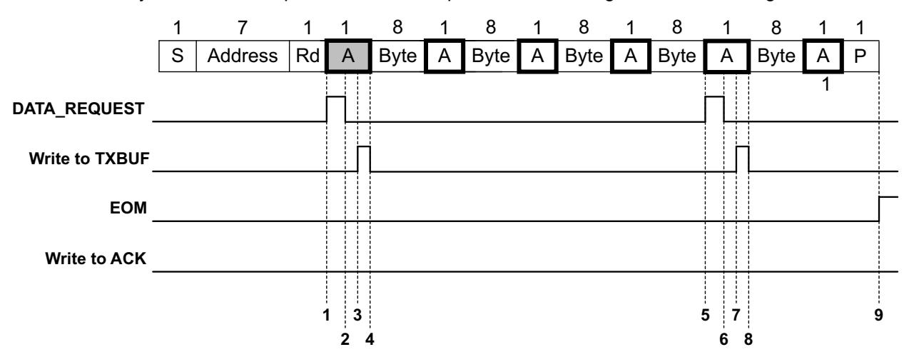

**Figure 10-12. Simple Read of 5 Bytes with Full Automation**

- <span id="page-362-2"></span>1. DATA\_REQUEST is set tDREQ1 nanoseconds after the falling edge of the clock for the last bit of the address.
- 2. The firmware reads from PMBST, clearing the DATA\_REQUEST bit. Since 4 bytes are being sent out, the firmware needs to make sure that TX\_COUNT is set to 4.
- 3. Next the firmware needs to write the bytes to TXBUF. All 4 bytes must be written in a single word write operation. It takes ttxbwrite ns after the write for any clock stretching of the ACK to be ended. If the firmware is fast enough, no clock stretching will occur.
- 4. As soon as the data starts being transmitted, the TXBUF is transferred to the shift register
- 5. DATA\_REQUEST is set tDREQ1 nanoseconds after the falling edge of the clock for the last bit of the fourth byte.
- 6. The firmware reads from PMBST, clearing the DATA\_REQUEST bit. Since one byte is being sent out,


the firmware needs to make sure that TX\_COUNT is set to 1.

- 7. Next the firmware needs to write the byte to TXBUF. It takes Ttxbwrite ns after the write for any clock stretching of the ACK to be ended. If the firmware is fast enough, no clock stretching will occur.
- 8. As soon as the data starts being transmitted, the TXBUF is transferred to the shift register
- 9. The EOM bit will be set tEOM ns after the falling edge of the data line indicating the stop signal.

EOM ACK handling is the same as the one byte read above. For 6, 7, and 8 bytes, it is only necessary to put more bytes into the TXBUF register and a higher number into TX\_COUNT. At 9 bytes, the TXBUF reload needs to occur again. This continues with TXBUF reloads every 4 bytes until the end of the message is reached.

If code is being ported from an processor limited to a 1 byte TXBUF, it is possible to always write only 1 byte to TXBUF, and to keep TX¬¬¬\_COUNT always a 1. This will significantly increase overhead because the data request, write to TXBUF sequence will occur on every byte, instead of every 4.

# <span id="page-363-0"></span>*10.3.11 Quick Command Read*

New PMBus standards have introduced a quick command read, where the Master send just an address with teh alst bit set for a read, followed by a stop. This needs to be handled like any other read command, including putting at least one byte into the RXBUF. The STOP from the master will terminate the transmission from the slave, so it will be handled properly. As described above, the PMBus hardware will not ACK the address until something is written to RXBUF.

# <span id="page-363-1"></span>*10.3.12 Simple Read with Manual Slave Address ACK*

Manual slave address ACK is different with a read than with a write. This is because of the generation of the DATA\_REQUEST bit and the need to write to TXBUF right after the address is received.

Here is the sequence diagram:

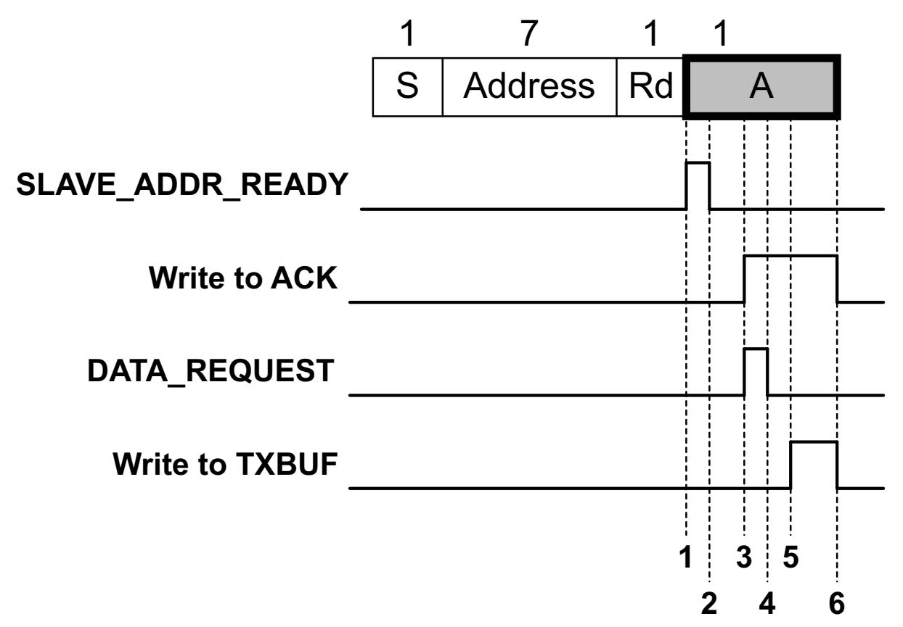

<span id="page-363-2"></span>**Figure 10-13. Slave Address Manual ACK on a Read Address**


- 1. The SLAVE\_ADDR\_RDY BIT is set tSAR ns after the falling edge of the clock for the R/W bit of the address.
- 2. The firmware reads from the PMBST register, clearing the SLAVE\_ADDR\_RDY bit. Next the firmware reads the address from the RXBUF, using only the low 7 bits – the most significant bit is random and must be masked out.
- 3. The firmware writes to the ACK bit. If a 1 is written, the DATA\_REQUEST bit will be set tDREQ2 ns after the ACK bit is set.
- 4. The firmware reads the PMBST register, clearing the DATA\_REQUEST bit.
- 5. Then the firmware writes the appropriate outgoing data into the TXBUF register, after first making sure that the TX\_COUNT bits reflect the correct number of bytes. Any clock stretch will be cleared tTXWRITE ns after the write to TXBUF. If the firmware is fast enough, no clock stretch will occur.
- 6. Once the ACK is over, the ACK bit will be cleared, and the TXBUF will be moved into the shift register for transmission.

After the manual slave ACK, the rest of the read will continue as described in the sequences above.

# <span id="page-364-0"></span>*10.3.13 Write/Read with Repeated Start*

Both PMBus and I2C provide for a read message which starts with a write of address and command, followed by a repeated start and a simple read command as above. Here is a sequence diagram with full automation:


**Figure 10-14. Write/Read with Repeated Start**

- <span id="page-364-1"></span>1. RPT\_START and DATA\_RDY are set tRPTSTART ns after the falling edge on the data line which indicates the repeated start. RD\_BYTE\_CNT is set to a 1.
- 2. The firmware reads the PMBST, clearing the status bits. The firmware then reads RXBUF to get the command.
- 3. The firmware then writes a 1 to the ACK bit. This is an internal ACK to tell the interface that the RXBUF has been read.
- 4. If the ACK is not written by this time, the clock will be stretched until the ACK is written

All byte sequences after the repeated start will be the same as described above in the simple read sequences after the start.


The write sequence at the beginning of a read is basically the same as the write sequence at the beginning of this section. The difference is that RPT\_START is set instead of EOM and PEC\_VALID. The same rule applies to longer writes followed by a repeated start. Any number of bytes written, followed by a repeated start, and they will be the same as a standard write sequence, except that they end with a repeated start, rather than an EOM.

# <span id="page-365-0"></span>*10.3.14 Automatic PEC Addition*

For PMBus commands, the UCD also provides for automatic addition of a PEC byte at the end. When writing the last bytes in the message to the TXBUF, first set the TX\_PEC bit. The interface will automatically send out the number of bytes in TXBUF, and then add a PEC byte at the end. This option should not be used if the master is not guaranteed to send a stop signal after the PEC. If the system requires that the UCD continue to transmit bytes after the PEC, the PEC should be calculated in firmware and added as a normal data byte. The UCD PMBus/I2C hardware assumes that the PEC will be the last byte in the message.


### <span id="page-366-0"></span>10.4 Avoiding Clock Stretching

For many applications, clock stretching is acceptable, but there may be requirements for minimal or no clock stretching. The UCD3138 family PMBus/I2C architecture permits this for some cases

For example, write messages up to 3 bytes and command can be handled in one operation using the 4 byte buffer and automated ACK. This gives an entire byte time for the firmware to respond, assuming that the master sends another message to the slave immediately after the first message. Even at 1 MHz, this is about 8 µsec, which should be time enough for a quick interrupt function to collect the data.

Read is more problematic. Using conventional methods, it should be possible to handle read messages, at least at 100 KHz. Here is the relevant timing diagram, assuming automatic slave address ACK is used:


Figure 10-15. Clock Stretch Timing for Read

<span id="page-366-2"></span> $t_{\chi}$  shows the timing caused by the combination of the firmware and the interface delays.

 $t_X = t_{DREQ1} + firmware delay + t_{ACKWRITE}$ 

To avoid clock stretching, t<sub>x</sub> needs to be smaller than the clock low time for the PMBus/I2C clock speed.

Since  $t_{DREQ1} + t_{ACKWRITE} = 1.076$  µsec maximum, it's possible to just subtract this number from the minimum clock low time for the data rate.

At 100 KHz, clock low minimum is 4.7  $\mu$ sec, giving about 3.7  $\mu$ sec for firmware, which should be attainable with an optimized interrupt.

Obviously the minimum clock low time of 1.3  $\mu$ sec at 400 KHz gives less that .3  $\mu$ sec for the firmware, which isn't enough.

### <span id="page-366-1"></span>10.4.1 Using Early TXBUF Write to Avoid Clock Stretch

It hasn't been tested exhaustively for robustness, but it may be possible to use early writes to TXBUF to avoid a clock stretch. The standard PMBus firmware actually writes to TXBUFF early on a read. It writes as soon as the interface receives the repeated start signal. This gives an entire byte delay for the receipt of the slave address with the read bit set for the firmware to respond.

This approach can also be used in an I2C case where the command is first written with a write message, and then the read is done with a simple read address. It is possible to write to the TXBUF register when the command is written, then the read will get the values that were written.

This method doesn't help, though, with messages that use more than one RXBUF or TXBUF full. In those cases, it is necessary to detect the data request or data ready, and deal with the RXBUF or TXBUF in a half clock cycle. So longer messages will definitely require clock stretching at frequencies over 100 KHz.


# <span id="page-367-1"></span><span id="page-367-0"></span>*10.4.2 Alert Response*

# S Alert Response Addr Rd A Device Addr NA P

### **Figure 10-16. Alert Response**

The UCD3138 PMBus interface provides an automated handling of the ALERT Response. To enable it, set the ALERT\_EN bit in PMBCTRL3. This will pull the ALERT pin low, and enable the ALERT response from the hardware. If MAN\_SLAVE\_ACK is not set, the hardware will automatically acknowledge the special ALERT address, and will automatically to the arbitration with the device address. If the UCD wins the arbitration, it will automatically release the ALERT line and clear the ALERT\_EN bit.

In manual address acknowledge mode (MAN\_SLAVE\_ACK is set), the firmware must read the received address from the Receive Data Register and transmit the desired slave address back to the Master. The firmware must check for LOST\_ARB, and clear the ALERT\_EN bit if the arbitration is won.


# <span id="page-368-0"></span>10.5 PMBus Slave Mode Low Level Timing

These diagrams give the low level timing for the PMBus logic. They show the timing between events on the PMBus pins and PMBus register changes.

For each timing parameter, only one case is shown. Note that the same timing parameter may occur in different places in a PMBus message.

Some of the timing diagrams show a clock stretch. These are optional. If the firmware can respond fast enough, no clock stretch will be necessary.

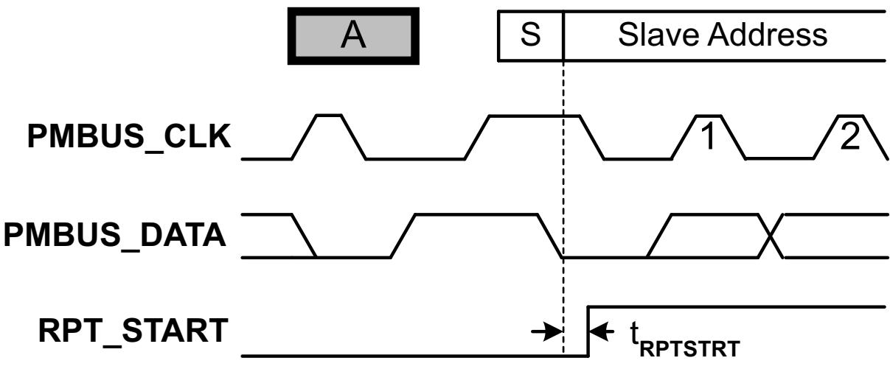

Figure 10-17. Address Byte Timing

Note: Stretch is optional, depending on firmware timing.

<span id="page-368-1"></span>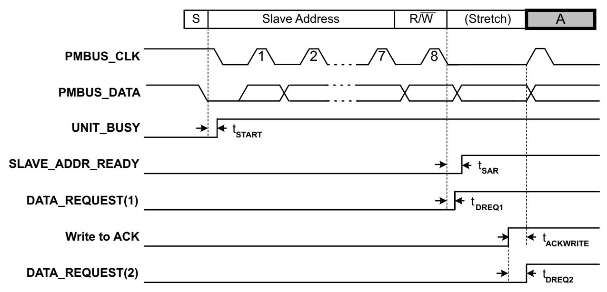

<span id="page-368-2"></span>Figure 10-18. Repeated Start Timing


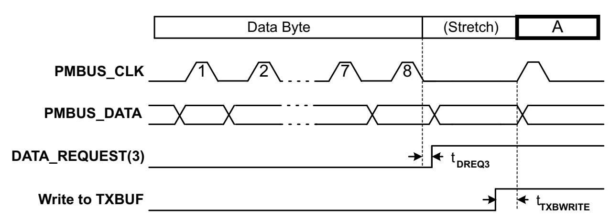

**Figure 10-19. Read Byte Timing**

Note: Stretch is optional, depending on firmware timing.

<span id="page-369-0"></span>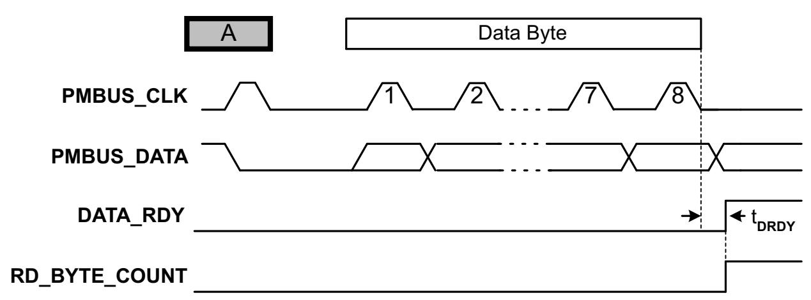

**Figure 10-20. Write Byte Timing**

<span id="page-369-1"></span>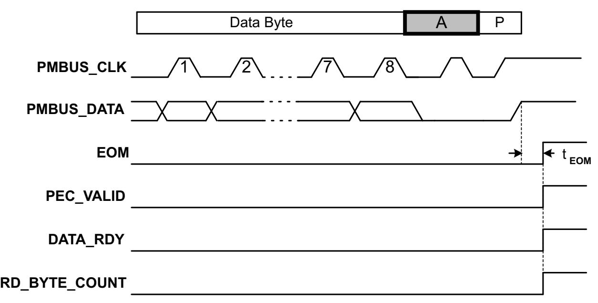

<span id="page-369-2"></span>**Figure 10-21. Write Byte Stop Timing**


### **Table 10-2. Timing Parameters from Timing Diagrams**

<span id="page-370-1"></span>

| Parameter                                                                                                                                             | Min | Max | Units |
|-------------------------------------------------------------------------------------------------------------------------------------------------------|-----|-----|-------|
| tSTART – Time from PMBUS_DATA low for Start signal to UNIT_BUSY bit<br>set                                                                            | 366 | 470 | ns    |
| tSAR – Time from PMBUS_CLK low on bit 8 to SLAVE_ADDR_READY bit<br>set                                                                                | 488 | 605 | ns    |
| tDREQ1 – Time from PMBUS_CLK low on bit 8 of address byte to<br>DATA_REQUEST bit set                                                                  | 427 | 538 | ns    |
| tACKWRITE – Time from write to ACK bit until UCD releases clock stretch                                                                               | 427 | 538 | ns    |
| tDREQ2 – Time from write to ACK bit until DATA_REQUEST bit is set                                                                                     |     |     | ns    |
| tRPTSTRT – Time from PMBUS_DATA low for Repeated Start to<br>RPT_START bit set                                                                        | 366 | 470 | ns    |
| tDREQ3 – Time from PMBUS_CLK low on bit 8 of read byte to<br>DATA_REQUEST bit set                                                                     | 427 | 538 | ns    |
| tTXBWRITE – Time from PMBUS_CLK low on bit 8 to SLAVE_ADDR_READY<br>bit set                                                                           | 427 | 538 | ns    |
| tDRDY – Time from PMBUS_CLK low on bit 8 to DATA_RDY bit set                                                                                          | 488 | 605 | ns    |
| tEOM – Time from PMBUS_CLK high for Stop signal to EOM and<br>DATA_RDY bits set, as well as PEC VALID and RD_BYTE_COUNT<br>loaded with correct value. | 427 | 538 | ns    |

#### **Table 10-3.**

<span id="page-370-2"></span>

| PMBus/I2C edge which triggers change    | Bit Field<br>Changed         | Min(ns) | Max(ns) |
|-----------------------------------------|------------------------------|---------|---------|
| SCL rise or fall                        | SCL_RAW set<br>or clear      | 244     | 336     |
| SDA rise or fall                        | SDA_RAW set<br>or clear      | 244     | 336     |
| CONTROL rise or fall                    | CONTROL_RA<br>W set or clear | 244     | 336     |
| ALERT rise or fall                      | ALERT_RAW<br>set or clear    | 244     | 336     |
| CONTROL edge specified by CNTL_INT_EDGE | CONTROL_EDG<br>E             | 244     | 336     |
| ALERT falling edge                      | ALERT_EDGE                   | 244     | 336     |
| SCL and SDA high for nominal 50 usec    | BUS_FREE set                 | 122     | 202     |

#### **Table 10-4. Simple Timing Parameters (No Timing Diagram)**

| Interval                           | Min(ns) | Max(ns) |
|------------------------------------|---------|---------|
| PMBST Bit Set to Interrupt Trigger | 61      | 67      |

#### <span id="page-370-3"></span><span id="page-370-0"></span>**10.6 Effect of MAN\_SLAVE\_ACK bit on EOM Handling**

Even though MAN\_SLAVE\_ACK primarily affects the handling of the beginning of the message, it also changes how the end of the message is handled.

In both modes, the PMBus hardware is designed to stretch the clock until the firmware is done processing the previous message.

When MAN\_SLAVE\_ACK is low, the firmware must ACK after the EOM. This tells the hardware that it is OK to ack the next address automatically and put the new address value into the PMBHSA. The EOM should not be ACKed until the firmware has read the PMBHSA for the message.

The next bit set in the status register will be either DATA\_READY or DATA\_REQUEST.


If MAN\_SLAVE\_ACK is high, EOM does not need to be ACKed. The hardware will accept the address without an ACK, and set the SLAVE\_ADDR\_READY bit. This also means that if the STOP signal on the PMBus is followed quickly by a new address, the firmware may see both the EOM and SLAVE\_ADDR\_READY bits set. The firmware must be written to deal with this, first handling the message that just ended, and then dealing with the message that is starting.

Just taking auto address ACK firmware and enabling manual address ACK is not sufficient.

# <span id="page-371-0"></span>**10.7 Master Mode Operation Reference**

The PMBus Interface has the capability to initiate any of the available message protocols used for communication with connected slave modules. Initiating a message begins with programming the Master Control Register (Address 0h). Upon programming of this register, the message will begin transmission on the PMBus once the bus is idle and ready for additional messages.

Note that the default mode of the PMBus interface is Slave mode. To operate in Master Mode, it is necessary to clear the SLAVE\_EN bit and to set the MASTER\_EN bit in the PMBCTRL3 register.

Within the bits of the Master Control Register, a number of options are provided that help to configure the PMBus message. The PMBus Interface includes an optional PEC enable bit (Bit 18). Enabled the PEC\_EN bit forces the PMBus Interface to append a PEC byte onto the end of the message. The firmware is not required to calculate the PEC value or account for the PEC byte when entering the number of bytes in the message.

The Byte Count bits (Bits 15-8) within the Master Control Register configures the number of data bytes within the outgoing message. The firmware is required to program the byte count at the start of each message. A byte count of zero will result in the transmission of a Quick Command message. The byte count does not include any command bytes, PEC bytes, address bytes or the block length (found in Block Write/Read messages). The PMBus Interface in Master Mode automatically terminates a valid message based on the values programmed in the byte count bits. In cases of a slave NACK, the PMBus Interface also automatically initiates a stop condition to terminate the message and provides the appropriate alarms to the firmware through the Status Register.

Inclusion of command bytes in the message initiated by the Master is configured through the CMD\_EN and EXT\_CMD bits (Bits 17-16 of the Master Control Register). Enabling CMD\_EN forces the PMBus Interface to include a single command byte in the message. On the first programming of the Transmit Data Register, bits 7-0 will represent the command byte. When enabling EXT\_CMD, support for extended commands is enabled. Bits 15-0 of the Transmit Data Register, after the first program of the Transmit Data Register, represent the extended command bytes.

Additional control bits within the Master Control Register enable various message protocols for PMBus applications. Protocols such as Process Call and Group Command Messages require additional programming with these bits.


# <span id="page-372-3"></span><span id="page-372-0"></span>*10.7.1 Quick Command*

# S Device Addr R/W A P

**Figure 10-22. Quick Command Format**

Quick commands are initiated in Master Mode by simply programming the desired slave device address into the Master Control Register. The byte count within the Master Control Register is configured to 0 bytes by writing all zeros to bits 15-8. Upon transmission of the device address, the PMBus Interface will monitor the slave acknowledgement of the address. If the address is not acknowledged, the Nacked bit within the status register is enabled and the PMBus Interface automatically enables a stop condition on the PMBus to terminate the message. If the address is acknowledged, a data request is issued to the processor. The firmware writes a '0' to the Acknowledge Register to terminate the message, forcing the PMBus Interface to write a stop condition onto the PMBus.

# <span id="page-372-4"></span><span id="page-372-1"></span>*10.7.2 Send Byte*


**Figure 10-23. Send Byte w/o PEC Byte**


**Figure 10-24. Send Byte with PEC Byte**

<span id="page-372-5"></span>A Send Byte message consists of the device address, a single data byte and an optional PEC byte. To initiate a Send Byte message, the data byte to be transmitted to the slave is loaded into bits 7-0 of the Transmit Data Register. The Master Control Register is configured with the device address. To transmit a PEC byte with the message, the PEC\_EN bit within the Master Control Register is asserted high when the address is programmed.

After programming the Master Control Register, the PMBus Interface initiates the Send Byte message onto the PMBus. The firmware can wait for an End of Message interrupt from the PMBus Interface. Upon receipt of the EOM interrupt, the Status Register is read to verify the slave properly acknowledged the transmitted data.

# <span id="page-372-6"></span><span id="page-372-2"></span>*10.7.3 Receive Byte*


**Figure 10-25. Receive Byte w/o PEC Byte**


**Figure 10-26. Receive Byte with PEC Byte**

<span id="page-372-7"></span>A Receive Byte message consists of the device address, a single data byte and an optional PEC byte. Data is being read from the slave in a Receive Byte message. To initiate a Receive Byte message, the firmware programs the device address, the R/W bit and the optional PEC\_EN into the Master Control Register. The R/W bit is enabled high to indicate a read message type (data transmitted from Slave to Master).


After programming the Master Control Register, the PMBus Interface initiates a Receive Byte message onto the PMBus. The firmware can wait for an End of Message interrupt from the PMBus Interface to verify the accuracy of the message transmission. Upon receipt of the EOM interrupt, the Status Register is read to verify proper slave acknowledgement of the device address and to determine if any data is available for reading in the Receive Data Register. If PEC\_EN was asserted in the Master Control Register, the PEC\_VALID bit in the Status Register is also checked to ensure a proper PEC byte was received from the Slave with the received data.

# <span id="page-373-2"></span><span id="page-373-1"></span><span id="page-373-0"></span>*10.7.4 Write Byte/Word*


**Figure 10-27. Write Byte w/o PEC Byte**


**Figure 10-28. Write Byte with PEC Byte**

S Device Addr Wr A Command A Byte #0 A Byte #1 A P

<span id="page-373-3"></span>**Figure 10-29. Write Word w/o PEC Byte**


**Figure 10-30. Write Word with PEC Byte**

The Write Byte and Write Word messages consist of a device address, a command byte, transmitted data bytes and an optional PEC byte. Write Byte messages include a single byte, while the Write Word messages support transmission of 2 bytes to the corresponding slave module. Similar to the Send Byte protocol, the Master Control Register is configured to send 1 or 2 bytes, the CMD\_EN bit is set to enable command byte transmission and the optional PEC\_EN bit is set.

With the command byte transmission enabled, the format of the Transmit Data Register differs from the Send Byte protocol. In Bits 7-0 of the Transmit Data Register, the firmware must program the command byte to be sent to the slave. The data byte(s) are programmed into bits 15-8 and bits 23-16.

After programming the Master Control Register, the PMBus Interface initiates a Write Byte/Word message on the PMBus. The firmware can wait for an End of Message interrupt from the interface to verify the accuracy of the message transmission. The Status Register indicates if the slave acknowledged the message properly.


### <span id="page-374-1"></span><span id="page-374-0"></span>*10.7.5 Read Byte/Read Word*


**Figure 10-31. Read Byte w/o PEC Byte**

<span id="page-374-2"></span>S Device Addr Wr A Command A Sr Device Addr Rd A Byte #0 A PEC NA P

**Figure 10-32. Read Byte with PEC Byte**

S Device Addr Wr A Command A Sr Device Addr Rd A Byte #0 A Byte #1 NA P

**Figure 10-33. Read Word w/o PEC Byte**


**Figure 10-34. Read Word with PEC Byte**

<span id="page-374-4"></span><span id="page-374-3"></span>The Read Byte and Read Word messages consist of a device address, a command byte, received data bytes from a slave and an optional PEC byte. Read Byte messages include a single byte, while the Read Word message protocol supports receipt of 2 bytes from the slave. Similar to the Receive Byte Protocol, the Master Control Register is configured to receive 1 or 2 bytes, the CMD\_EN bit is set and the PEC\_EN is configured to expect or not expect a PEC byte appended to the message. The PMBus Interface will automatically terminate the message after the expected number of bytes is received from the slave or if the slave does not properly acknowledge any portion of the message.

In addition to programming the Master Control Register, the firmware is expected to load the command byte into bits 7-0 of the Transmit Data Register. Any data received from the slave will be found in the Receive Data Register.

After programming the Master Control Register, the PMBus Interface initiates a Read Byte/Read Word message on the PMBus. The firmware can wait for an End of Message interrupt from the interface. Upon the EOM interrupt, the Status Register is read to determine the number of bytes received (1 for a Read Byte/2 for a Read Word). The received data bytes are found in Bits 15-0 of the Receive Data Register. If PEC is enabled for the message, the PEC\_VAL bit in the Status Register can be verified to check the accuracy of the received PEC byte from the Slave.


# <span id="page-375-1"></span><span id="page-375-0"></span>*10.7.6 Process Call*

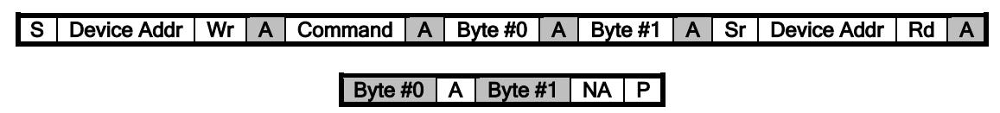

**Figure 10-35. Process Call w/o PEC Byte**

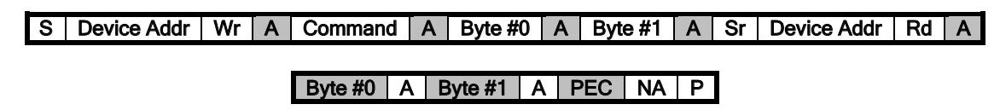

**Figure 10-36. Process Call with PEC Byte**

<span id="page-375-2"></span>The Process Call protocol consists of a Write Word message, followed by a Read Word message, without a stop condition between the two messages. A PEC byte can be appended to the read data from the slave as an option to the message protocol. The Master Control Register includes a PRC\_CALL bit, which enables the transmission of a Process Call message onto the PMBus. The PMBus Interface will automatically generate a repeated start condition and initiate the Read Word portion of the message when the process call bit is enabled.

To complete the Write Word portion of the Process Call, the Transmit Data Register is loaded with the command byte in Bits 7-0 and the data bytes are loaded into Bits 23-8 of the register.

After programming the Master Control Register, the PMBus Interface initiates the Process Call Message on the PMBus. The firmware can wait for an End of Message interrupt from the interface to determine the validity of the message. Upon the receipt of the EOM, the Status Register should indicate the receipt of 2 bytes from the Read Word portion of the Process Call message and the status of the Slave acknowledgement of the transmit data. If PEC processing is enabled, the PEC\_VAL bit within the Status Register indicates the accuracy of the PEC byte received from the Slave during the Read Word part of the message.

The PRC\_CALL bit within the Master Control Register should be disabled on the next message not of the Process Call protocol. Please note that any write to the Master Control Register initiates a message, so reconfiguration of the Master is not recommended until the firmware requires a new message to be transmitted on the PMBus.


# *10.7.7 Block Write*

<span id="page-376-1"></span><span id="page-376-0"></span>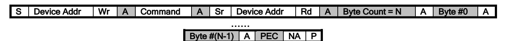

**Figure 10-37. Block Write w/o PEC Byte**


**Figure 10-38. Block Write with PEC Byte**

<span id="page-376-2"></span>The Block Write protocol is similar to a Write Word in its structure, with the exception of transmission of more than 2 data bytes in the message. Additionally, the first data byte following the command byte specifies the length of the block of data bytes. As with a majority of the message protocols, the PEC byte can be appended to the end of the write data to the Slave.

To initiate a Block Write message on the PMBus, the Master Control Register is programmed with the block length in the Byte Count bits. The block length is the number of data bytes, excluding the command byte and the first data byte that contains the block length. The PMBus Interface will automatically insert the block length into the message if the number of data bytes specified by the firmware exceeds 2. The initial write data is loaded into the Transmit Data Register. With bits 7-0 representing the command byte, the remaining 3 bytes represent the first three data bytes following the block length.

Following programming of the Master Control Register, the Block Write message is initiated on the PMBus. If the block length exceeds three bytes, the PMBus Interface will provide a data request interrupt, indicating the need for additional data bytes in the Transmit Data Register. The PMBus Interface assumes that if more than 4 bytes are needed to complete the message, the firmware will utilize all 4 bytes when programming the Transmit Data Register. If less than 4 bytes are needed to finish the Block Write message, the firmware only needs to program the appropriate bits of the Transmit Data Register.

Upon completion of the message, the PMBus Interface issues an EOM interrupt. The interface can be checked to verify the slave accepted the block of write data.


### <span id="page-377-0"></span>*10.7.8 Block Read*

S Device Addr Wr A Command A Sr Device Addr Rd A Byte Count = N A Byte #0 A **……**

Byte #(N-1) NA P

**Figure 10-39. Block Read w/o PEC Byte**

<span id="page-377-2"></span><span id="page-377-1"></span>S Device Addr Wr A Command A Sr Device Addr Rd A Byte Count = N A Byte #0 A **……**

> Byte #(N-1) A PEC NA P **Figure 10-40. Block Read with PEC Byte**

The Block Read protocol is similar to a Read Word in its structure, with the exception of reception of more than 2 data bytes from the Slave. The first data byte transmitted by the Slave represents the block length of the data being written by the slave. If PEC processing is enabled, the Slave appends a PEC byte to the

end of the message.

To initiate a Block Read message on the PMBus, the Master Control Register is programmed with the block length in the Byte Count bits. This count excludes the command byte, any slave address and the block length bytes in the message. The command byte to be transmitted to the Slave is written into bits 7- 0 of the Transmit Data Register prior to the programming of the Master Control Register.

After configuring the Master Control Register, the Block Read message is initiated on the PMBus. The interface interrupts the firmware upon receipt of 4 data bytes from the slave. If the block length is 3, the EOM interrupt will be received concurrently with the data ready interrupt. Otherwise, a data ready interrupt is asserted, indicating 4 bytes are ready for reading by the firmware. At the end of the message, less than 4 bytes may be stored in the Receive Data Register. The RX Byte Count bits in the Status Register indicate the number of bytes available in the final data transfer. The firmware may verify the received PEC upon detection of the End of Message interrupt.


### <span id="page-378-2"></span><span id="page-378-0"></span>*10.7.9 Block Write-Block Read Process Call*

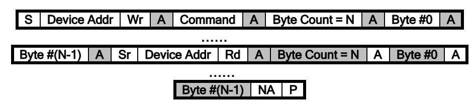

**Figure 10-41. Block Write-Block Read Process Call w/o PEC Byte**

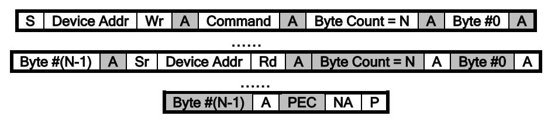

**Figure 10-42. Block Write-Block Read Process Call with PEC Byte**

<span id="page-378-3"></span>The Block Read-Block Write Process Call protocol combines the Block Write and Block Read protocols, removing the stop condition between the two messages. The operation of the Master is similar to a Block Write operation. Loading the block length into the byte count bits of the Master Control Register provides the length of the Block Write portion of the message. In addition, the PRC\_CALL bit within the Master Control Register must be enabled. Upon completion of the Block Write part of the message, the PMBus Interface will automatically issue a Repeated Start condition on the PMBus and start transmission of the Block Read portion of the message. Operation of the PMBus Interface after the Repeated Start condition is the same as would be in a simple Block Read Message.

# <span id="page-378-4"></span><span id="page-378-1"></span>*10.7.10 Alert Response*


**Figure 10-43. Alert Response**

The Alert Response Message is utilized when the Master detects an alert condition from a Slave on the PMBus. In Master mode, the Alert Response Message is simply a Receive Byte message with PEC disable and the Slave Address set to 0xC (Alert Response Address). The PMBus Interface detects the Alert condition on an input and interrupts the firmware indicating the assertion of an alert condition (Slave desires to communicate with Master). Programming the Master Control Register with the Alert Response Address, initiates the Alert Response message and provides the device address of the Slave requesting service. The device address will be found in the Receive Data Register following receipt of the EOM interrupt.


# <span id="page-379-1"></span><span id="page-379-0"></span>*10.7.11 Extended Command - Write Byte/Word, Read Byte/Word*

S Device Addr Wr A Command Byte A Ext Command Byte A Byte #0 A P

**Figure 10-44. Extended Command Write Byte w/o PEC Byte**

S Device Addr Wr A Command Byte A Ext Command Byte A Byte #0 A PEC A P

**Figure 10-45. Extended Command Write Byte with PEC Byte**

<span id="page-379-2"></span>S Device Addr Wr A Command Byte A Ext Command Byte A Byte #0 A Byte #1 A P

**Figure 10-46. Extended Command Write Word w/o PEC Byte**

S Device Addr Wr A Command Byte A Ext Command Byte A Byte #0 A Byte #1 A PEC A P

**Figure 10-47. Extended Command Write Word with PEC Byte**

<span id="page-379-4"></span><span id="page-379-3"></span>S Device Addr Wr A Command Byte A Ext Command Byte A Sr Device Addr Rd A

Byte #0 NA P **Figure 10-48. Extended Command Read Byte w/o PEC Byte**

<span id="page-379-5"></span>S Device Addr Wr A Command Byte A Ext Command Byte A Sr Device Addr Rd A

Byte #0 A PEC NA P **Figure 10-49. Extended Command Read Byte with PEC Byte**

<span id="page-379-6"></span>S Device Addr Wr A Command Byte A Ext Command Byte A Sr Device Addr Rd A

Byte #0 A Byte #1 NA P

**Figure 10-50. Extended Command Read Word w/o PEC Byte**

<span id="page-379-8"></span><span id="page-379-7"></span>S Device Addr Wr A Command Byte A Ext Command Byte A Sr Device Addr Rd A Byte #0 A Byte #1 A PEC NA P

**Figure 10-51. Extended Command Read Word with PEC Byte**


The PMBus Interface provides support for extended commands which allow for an extra 256 command codes. By asserting the EXT\_CMD bit within the Master Control Register, two command bytes are transmitted on the message protocol. Extended commands can be added to the Read Byte, Read Word, Write Byte and Write Word protocols. Operation of the PMBus interface in extended command mode is similar to these formats. In programming the write data or first part of the read message, the second command byte is loaded into Bits 15-8 of the Transmit Data Register with the remaining data bytes. The remaining operation of the PMBus is identical to the previous protocols, except for the inclusion of a Repeated Start condition and slave address in the write messages. No support is required by firmware for these additional bytes in the write messages. The interface will interpret the EXT\_CMD bit and make the appropriate format changes.

# <span id="page-380-0"></span>*10.7.12 Group Command*

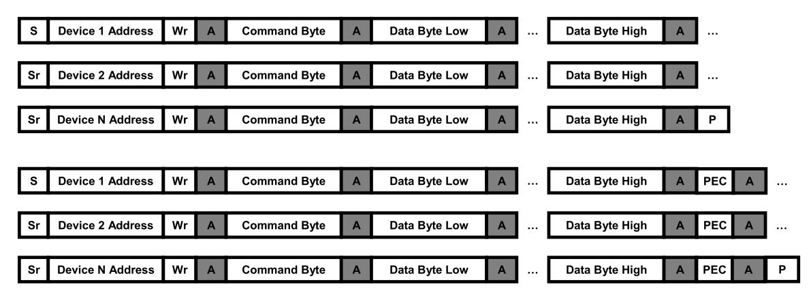

**Figure 10-52.**

<span id="page-380-3"></span>The PMBus Interface must support the Group Command Protocol. The Group Command Protocol is used to send commands to more than one device within the same message. When devices on the PMBus detect the stop condition at the conclusion of the Group Command message, the received commands are executed concurrently. To initiate a Group Command, the GRP\_CMD bit within the Master Control Register must be set when programming the slave address for the first device in the message. The rest of the message is processed as a write byte/word message. At the conclusion of the first part of the Group Command message, the firmware programs the next device address in the Master Control Register. The PMBus Interface will initiate a repeated start on the bus and start the next part of the message. When programming the last device address of the Group Command message, the firmware must disable the GRP CMD bit when programming the Master Control Register.

### <span id="page-380-1"></span>**10.8 PMBUS Communications Fault Handling**

The UCD3138 PMBus interface hardware and firmware is designed to handle communications faults caused by glitches, interruptions, and stuck signals on the PMBus lines. In many cases, the system will recover immediately. In some cases, for example if one or both of the lines are stuck high or low, no communication will be possible. There are a few cases in which the system will may require an additional message transmission for recovery. Here are two of them:

#### <span id="page-380-2"></span>*10.8.1 Bit Counter*

If a PMBus message to the UCD is halted in the middle of a byte, the UCD bit counter may not be reset to zero. Therefore the UCD may not respond correctly to the next message. Normally the bit counter will be resychronized after this one incorrect response, so subsequent messages will be handled correctly.

On the UCD3138, and UCD3138064, this is the case. On the UCD3138A64 and UCD3138128 and all A versions, stopping the message in the middle of the byte should be handled correctly.


### <span id="page-381-0"></span>*10.8.2 Test Mode (Manufacturer Reserved Address Match)*

If a PMBus message to the UCD accesses the reserved address of 0x7f, the UCD may begin a test mode entry sequence. It may hold the data line low. In this case, additional transitions on the PMBus clock line will return the PMBus to normal functionality. On the UCD3138128/A64 and the A versions of the same device, the test mode entry address is 0x7e. This is less likely to occur as a fault case.

# <span id="page-381-1"></span>**10.9 Other Functions of the PMBus Module**

There are other functions available in the PMBus module. The 4 PMBus pins can be used as general purpose I/O. This can be done using the GLOBAL IO registers in the Miscellaneous Analog memory space. It can also be done using the PMBCTRL3 register for configuration and the PMBST register for monitoring. All of these bits follow standard microprocessor peripheral protocol, so no further description is necessary beyond the reference section above.

The PMBCTRL3 register also has 2 bits called IBIAS\_A\_EN and IBIAS\_B\_EN. These bits are used to enable a small current onto 2 ADC pins to permit the use of resistors on those pins for setting the PMBus address. See [Section](#page-306-0) 8.13 for more information.

# <span id="page-381-2"></span>**10.10 PMBus Interface Registers Reference**

# <span id="page-381-3"></span>*10.10.1 PMBUS Control Register 1 (PMBCTRL1)*

Address FFF7F600

**Figure 10-53. PMBUS Control Register 1 (PMBCTRL1)**

<span id="page-381-4"></span>

|    | 20            |    |    | 19      |    |   |         | 18    |       |            | 17           |   | 16      |   |       |
|----|---------------|----|----|---------|----|---|---------|-------|-------|------------|--------------|---|---------|---|-------|
|    | PRC_CALL      |    |    | GRP_CMD |    |   | PEC_ENA |       |       | EXT_CMD    |              |   | CMD_ENA |   |       |
|    | R/W-0         |    |    | R/W-0   |    |   |         | R/W-0 | R/W-0 |            |              |   | R/W-0   |   |       |
| 15 | 14            | 13 | 12 | 11      | 10 | 9 | 8       | 7     | 6     | 5          | 4            | 3 | 2       | 1 | 0     |
|    | BYTE_COUNT    |    |    |         |    |   |         |       |       | SLAVE_ADDR |              |   |         |   |       |
|    | R/W-0000 0000 |    |    |         |    |   |         |       |       |            | R/W-000 0000 |   |         |   | R/W-0 |

LEGEND: R/W = Read/Write; R = Read only; -*n* = value after reset

#### **Table 10-5. PMBUS Control Register 1 (PMBCTRL1) Register Field Descriptions**

<span id="page-381-5"></span>

| Bit  | Field      | Type | Reset        | Description                                                                                                                                                                                                                                                                                                                                                                                                                                                    |
|------|------------|------|--------------|----------------------------------------------------------------------------------------------------------------------------------------------------------------------------------------------------------------------------------------------------------------------------------------------------------------------------------------------------------------------------------------------------------------------------------------------------------------|
| 20   | PRC_CALL   | R/W  | 0            | Master Process Call Message Enable<br>0 = Default state for all messages besides Process Call message (Default)<br>1 = Enables transmission of Process Call message                                                                                                                                                                                                                                                                                            |
| 19   | GRP_CMD    | R/W  | 0            | Master Group Command Message Enable<br>0 = Default state for all messages besides Group Command message (Default)<br>1 = Enables transmission of Group Command message                                                                                                                                                                                                                                                                                         |
| 18   | PEC_ENA    | R/W  | 0            | Master PEC Processing Enable<br>0 = Disables PEC processing (Default)<br>1 = Enables PEC byte transmission/reception                                                                                                                                                                                                                                                                                                                                           |
| 17   | EXT_CMD    | R/W  | 0            | Master Extended Command Code Enable<br>0 = Use 1 byte for Command Code (Default)<br>1 = Use 2 bytes for Command Code                                                                                                                                                                                                                                                                                                                                           |
| 16   | CMD_ENA    | R/W  | 0            | Master Command Code Enable<br>0 = Disables use of command code on Master initiated messages (Default)<br>1 = Enables use of command code on Master initiated messages                                                                                                                                                                                                                                                                                          |
| 15-8 | BYTE_COUNT | R/W  | 0000<br>0000 | Indicates number of data bytes transmitted in current message. Byte count does not<br>include any device addresses, command words or block lengths in block messages.<br>In block messages, the PMBus Interface automatically inserts the block length into<br>the message based on the byte count setting. The firmware only needs to load the<br>address, command words and data to be transmitted. PMBus Interface supports byte<br>writes up to 255 bytes. |


# **Table 10-5. PMBUS Control Register 1 (PMBCTRL1) Register Field Descriptions (continued)**

| Bit | Field      | Type | Reset    | Description                                                                                                                                                                                                                      |
|-----|------------|------|----------|----------------------------------------------------------------------------------------------------------------------------------------------------------------------------------------------------------------------------------|
| 7-1 | SLAVE_ADDR | R/W  | 000 0000 | Specifies the address of the slave to which the current message is directed towards.                                                                                                                                             |
| 0   | RW         | R/W  | 0        | Indicates if current Master initiated message is read operation or write operation.<br>0 = Message is a write transaction (data from Master to Slave) (Default)<br>1 = Message is a read transaction (data from Slave to Master) |


### <span id="page-383-0"></span>*10.10.2 PMBus Transmit Data Buffer (PMBTXBUF)*

Address FFF7F604

### **Figure 10-54. PMBus Transmit Data Buffer (PMBTXBUF)**

<span id="page-383-1"></span>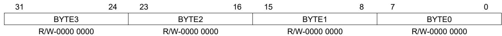

LEGEND: R/W = Read/Write; R = Read only; -*n* = value after reset

### **Table 10-6. PMBus Transmit Data Buffer (PMBTXBUF) Register Field Descriptions**

<span id="page-383-2"></span>

| Bit   | Field | Type | Reset        | Description                                            |
|-------|-------|------|--------------|--------------------------------------------------------|
| 31-24 | BYTE3 | R/W  | 0000<br>0000 | Last data byte transmitted from Transmit Data Buffer   |
| 23-16 | BYTE2 | R/W  | 0000<br>0000 | Third data byte transmitted from Transmit Data Buffer  |
| 15-8  | BYTE1 | R/W  | 0000<br>0000 | Second data byte transmitted from Transmit Data Buffer |
| 7-0   | BYTE0 | R/W  | 0000<br>0000 | First data byte transmitted from Transmit Data Buffer  |


# <span id="page-384-0"></span>*10.10.3 PMBus Receive Data Register (PMBRXBUF)*

Address FFF7F608

### **Figure 10-55. PMBus Receive Data Register (PMBRXBUF)**

<span id="page-384-1"></span>

LEGEND: R/W = Read/Write; R = Read only; -*n* = value after reset

### **Table 10-7. PMBus Receive Data Register (PMBRXBUF) Register Field Descriptions**

<span id="page-384-2"></span>

| Bit   | Field | Type | Reset | Description                                      |
|-------|-------|------|-------|--------------------------------------------------|
| 31-24 | BYTE3 | R    | 0     | Last data byte received in Receive Data Buffer   |
| 23-16 | BYTE2 | R    | 0     | Third data byte received in Receive Data Buffer  |
| 15-8  | BYTE1 | R    | 0     | Second data byte received in Receive Data Buffer |
| 7-0   | BYTE0 | R    | 0     | First data byte received in Receive Data Buffer  |


### <span id="page-385-0"></span>*10.10.4 PMBus Acknowledge Register (PMBACK)*

Address FFF7F60C

### **Figure 10-56. PMBus Acknowledge Register (PMBACK)**

0

<span id="page-385-1"></span>

LEGEND: R/W = Read/Write; R = Read only; -*n* = value after reset

### **Table 10-8. PMBus Acknowledge Register (PMBACK) Register Field Descriptions**

| Bit | Field | Type | Reset | Description                                                                                                                                                                 |  |  |  |
|-----|-------|------|-------|-----------------------------------------------------------------------------------------------------------------------------------------------------------------------------|--|--|--|
| 0   | ACL   | R/W  | 0     | Allows firmware to acknowledge or not acknowledge received data<br>0 = NACK received data (Default)<br>1 = Acknowledge received data, bit clears upon issue of ACK on PMBus |  |  |  |


# <span id="page-386-0"></span>*10.10.5 PMBus Status Register (PMBST)*

Address FFF7F610

#### **Figure 10-57. PMBus Status Register (PMBST)**

<span id="page-386-1"></span>

| 21        |            | 20<br>19 |          | 18  |                  | 17         |               | 16                                            |     |            |                     |  |
|-----------|------------|----------|----------|-----|------------------|------------|---------------|-----------------------------------------------|-----|------------|---------------------|--|
| SCL_RAW   |            |          | SDA_RAW  |     | CONTROL_RAW      | ALERT_RAW  |               | CONTROL_EDGE                                  |     | ALERT_EDGE |                     |  |
| R-0       |            |          | R-0      |     | R-0              | R-0        |               | R-0                                           |     |            | R-0                 |  |
| 15        | 14<br>13   |          |          |     | 12               | 11         |               | 10                                            | 9   |            | 8                   |  |
| MASTER    |            | LOST_ARB | BUS_FREE |     | UNIT_BUSY        | RPT_START  |               | SLAVE_ADDR<br>CLK_HIGH_<br>_READY<br>DETECTED |     |            | CLK_LOW_<br>TIMEOUT |  |
| R-0       |            | R-0      | R-0      |     | R-0              | R-0        | R-0           |                                               | R-0 |            | R-0                 |  |
| 7         |            | 6        | 5        |     | 4                | 3          |               | 2                                             | 1   |            | 0                   |  |
| PEC_VALID |            | NACK     | EOM      |     | DATA_<br>REQUEST | DATA_READY | RD_BYTE_COUNT |                                               |     |            |                     |  |
| R-0       | R-0<br>R-0 |          |          | R-0 | R-0              |            | R-0           |                                               |     |            |                     |  |

LEGEND: R/W = Read/Write; R = Read only; -*n* = value after reset

### **Table 10-9. PMBus Status Register (PMBST) Register Field Descriptions**

<span id="page-386-2"></span>

| Bit | Field        | Type | Reset | Description                                                                                                                                       |  |  |  |  |
|-----|--------------|------|-------|---------------------------------------------------------------------------------------------------------------------------------------------------|--|--|--|--|
| 21  | SCL_RAW      | R    | 0     | PMBus Clock Pin Real Time Status<br>0 = PMBus clock pin observed at logic level low<br>1 = PMBus clock pin observed at logic level high           |  |  |  |  |
| 20  | SDA_RAW      | R    | 0     | PMBus Data Pin Real Time Status<br>0 = PMBus data pin observed at logic level low<br>1 = PMBus data pin observed at logic level high              |  |  |  |  |
| 19  | CONTROL_RAW  | R    | 0     | Control Pin Real Time Status<br>0 = Control pin observed at logic level low<br>1 = Control pin observed at logic level high                       |  |  |  |  |
| 18  | ALERT_RAW    | R    | 0     | Alert Pin Real Time Status<br>0 = Alert pin observed at logic level low<br>1 = Alert pin observed at logic level high                             |  |  |  |  |
| 17  | CONTROL_EDGE | R    | 0     | Control Edge Detection Status<br>0 = Control pin has not transitioned<br>1 = Control pin has been asserted by another device on PMBus             |  |  |  |  |
| 16  | ALERT_EDGE   | R    | 0     | Alert Edge Detection Status<br>0 = Alert pin has not transitioned<br>1 = Alert pin has been asserted by another device on PMBus                   |  |  |  |  |
| 15  | MASTER       | R    | 0     | Master Indicator<br>0 = PMBus Interface in Slave Mode or Idle Mode<br>1 = PMBus Interface in Master Mode                                          |  |  |  |  |
| 14  | LOST_ARB     | R    | 0     | Lost Arbitration Flag<br>0 = Master has attained control of PMBus<br>1 = Master has lost arbitration and control of PMBus                         |  |  |  |  |
| 13  | BUS_FREE     | R    | 0     | PMBus Free Indicator<br>0 = PMBus processing current message<br>1 = PMBus available for new message                                               |  |  |  |  |
| 12  | UNIT_BUSY    | R    | 0     | PMBus Busy Indicator<br>0 = PMBus Interface is idle, ready to transmit/receive message<br>1 = PMBus Interface is busy, processing current message |  |  |  |  |
| 11  | RPT_START    | R    | 0     | Repeated Start Flag<br>0 = No Repeated Start received by interface<br>1 = Repeated Start condition received by interface                          |  |  |  |  |


# **Table 10-9. PMBus Status Register (PMBST) Register Field Descriptions (continued)**

| Bit | Field                 | Type | Reset | Description                                                                                                                                                                                                                                                                                                                                                                           |  |  |  |  |  |
|-----|-----------------------|------|-------|---------------------------------------------------------------------------------------------------------------------------------------------------------------------------------------------------------------------------------------------------------------------------------------------------------------------------------------------------------------------------------------|--|--|--|--|--|
| 10  | SLAVE_ADDR_<br>READY  | R    | 0     | Slave Address Ready<br>0 = Indicates no slave address is available for reading<br>1 = Slave address ready to be read from Receive Data Register (Bits 6:0)                                                                                                                                                                                                                            |  |  |  |  |  |
| 9   | CLK_HIGH_<br>DETECTED | R    | 0     | Clock High Detection Status<br>0 = No Clock High condition detected<br>1 = Clock High exceeded 50us during message                                                                                                                                                                                                                                                                    |  |  |  |  |  |
| 8   | CLK_LOW_<br>TIMEOUT   | R    | 0     | Clock Low Timeout Status<br>0 = No clock low timeout detected<br>1 = Clock low timeout detected, clock held low for greater than 35ms                                                                                                                                                                                                                                                 |  |  |  |  |  |
| 7   | PEC_VALID             | R    | 0     | PEC Valid Indicator<br>0 = Received PEC not valid (if EOM is asserted)<br>1 = Received PEC is valid                                                                                                                                                                                                                                                                                   |  |  |  |  |  |
| 6   | NACK                  | R    | 0     | Not Acknowledge Flag Status<br>0 = Data transmitted has been accepted by receiver<br>1 = Receiver has not accepted transmitted data                                                                                                                                                                                                                                                   |  |  |  |  |  |
| 5   | EOM                   | R    | 0     | End of Message Indicator<br>0 = Message still in progress or PMBus in idle state.<br>1 = End of current message detected                                                                                                                                                                                                                                                              |  |  |  |  |  |
| 4   | DATA_REQUEST          | R    | 0     | Data Request Flag<br>0 = No data needed by PMBus Interface<br>1 = PMBus Interface request additional data. PMBus clock stretching enabled to stall<br>bus until firmware provides transmit data.                                                                                                                                                                                      |  |  |  |  |  |
| 3   | DATA_READY            | R    | 0     | Data Ready Flag<br>0 = No data available for reading by processor<br>1 = PMBus Interface read buffer full, firmware required to read data prior to further<br>bus activity. PMBus clock stretching enabled to stall bus until data is read by<br>firmware.                                                                                                                            |  |  |  |  |  |
| 2-0 | RD_BYTE_<br>COUNT     | R    | 0     | Number of Data Bytes available in Receive Data Register<br>0 = No received data<br>1 = 1 byte received. Data located in Receive Data Register, Bits 7-0<br>2 = 2 bytes received. Data located in Receive Data Register, Bits 15-0<br>3 = 3 bytes received. Data located in Receive Data Register, Bits 23-0<br>4 = 4 bytes received. Data located in Receive Data Register, Bits 31-0 |  |  |  |  |  |


# <span id="page-388-0"></span>*10.10.6 PMBus Interrupt Mask Register (PMBINTM)*

Address FFF7F614

### **Figure 10-58. PMBus Interrupt Mask Register (PMBINTM)**

<span id="page-388-1"></span>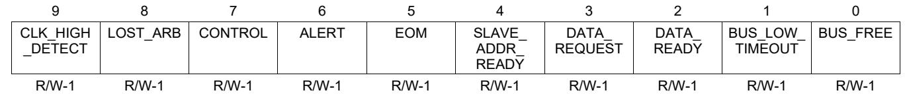

LEGEND: R/W = Read/Write; R = Read only; -*n* = value after reset

### **Table 10-10. PMBus Interrupt Mask Register (PMBINTM) Register Field Descriptions**

<span id="page-388-2"></span>

| Bit | Field                | Type | Reset | Description                                                                                                                                                                                           |
|-----|----------------------|------|-------|-------------------------------------------------------------------------------------------------------------------------------------------------------------------------------------------------------|
| 9   | CLK_HIGH_<br>DETECT  | R/W  | 1     | Clock High Detection Interrupt Mask<br>0 = Generates interrupt if clock high exceeds 50us during message<br>1 = Disables interrupt generation for Clock High detection (Default)                      |
| 8   | LOST_ARB             | R/W  | 1     | Lost Arbitration Interrupt Mask<br>0 = Generates interrupt upon assertion of Lost Arbitration flag<br>1 = Disables interrupt generation upon assertion of Lost Arbitration flag (Default)             |
| 7   | CONTROL              | R/W  | 1     | Control Detection Interrupt Mask<br>0 = Generates interrupt upon assertion of Control flag<br>1 = Disables interrupt generation upon assertion of Control flag (Default)                              |
| 6   | ALERT                | R/W  | 1     | Alert Detection Interrupt Mask<br>0 = Generates interrupt upon assertion of Alert flag<br>1 = Disables interrupt generation upon assertion of Alert flag (Default)                                    |
| 5   | EOM                  | R/W  | 1     | End of Message Interrupt Mask<br>0 = Generates interrupt upon assertion of End of Message flag<br>1 = Disables interrupt generation upon assertion of End of Message flag (Default)                   |
| 4   | SLAVE_ADDR_<br>READY | R/W  | 1     | Slave Address Ready Interrupt Mask<br>0 = Generates interrupt upon assertion of Slave Address Ready flag<br>1 = Disables interrupt generation upon assertion of Slave Address Ready flag<br>(Default) |
| 3   | DATA_REQUEST         | R/W  | 1     | Data Request Interrupt Mask<br>0 = Generates interrupt upon assertion of Data Request flag<br>1 = Disables interrupt generation upon assertion of Data Request flag (Default)                         |
| 2   | DATA_READY           | R/W  | 1     | Data Ready Interrupt Mask<br>0 = Generates interrupt upon assertion of Data Ready flag<br>1 = Disables interrupt generation upon assertion of Data Ready flag (Default)                               |
| 1   | BUS_LOW_<br>TIMEOUT  | R/W  | 1     | Clock Low Timeout Interrupt Mask<br>0 = Generates interrupt upon assertion of Clock Low Timeout flag<br>1 = Disables interrupt generation upon assertion of Clock Low Timeout flag (Default)          |
| 0   | BUS_FREE             | R/W  | 1     | Bus Free Interrupt Mask<br>0 = Generates interrupt upon assertion of Bus Free flag<br>1 = Disables interrupt generation upon assertion of Bus Free flag (Default)                                     |


# <span id="page-389-0"></span>*10.10.7 PMBus Control Register 2 (PMBCTRL2)*

PMBus Control Register 2 (PMBCTRL2)

#### **Figure 10-59. PMBus Control Register 2 (PMBCTRL2)**

<span id="page-389-1"></span>

|             | 30                   | 29              |              |   |                   |   |              | 23 |   |
|-------------|----------------------|-----------------|--------------|---|-------------------|---|--------------|----|---|
|             | SLAVE_ADDR_2<br>_EN* |                 |              |   | SLAVE_ADDR_2*     |   |              |    |   |
|             | R/W-0                |                 | R/W-110 0000 |   |                   |   |              |    |   |
|             | 22<br>21             |                 | 20           |   | 19<br>18          |   |              | 16 |   |
|             |                      | RX_BYTE_ACK_CNT | MAN_CMD      |   | TX_PEC            |   | TX_COUNT     |    |   |
|             |                      | R/W-11          | R/W-0        |   | R/W-0             |   | R/W-000      |    |   |
| 15          | 14                   |                 |              | 8 | 7                 | 6 |              |    | 0 |
| PEC_<br>ENA |                      | SLAVE_MASK      |              |   | MAN_SLAVE_<br>ACK |   | SLAVE_ADDR   |    |   |
| R/W-0       |                      | R/W-111 1111    |              |   | R/W-0             |   | R/W-111 1100 |    |   |

LEGEND: R/W = Read/Write; R = Read only; -*n* = value after reset

### **Table 10-11. PMBus Control Register 2 (PMBCTRL2) Register Field Descriptions**

<span id="page-389-2"></span>

| Bit   | Field                | Type | Reset    | Description                                                                                                                                                                                                                                                                                                                                                                                                                                                                                                                                                                                                                                                                                                                                                                      |  |
|-------|----------------------|------|----------|----------------------------------------------------------------------------------------------------------------------------------------------------------------------------------------------------------------------------------------------------------------------------------------------------------------------------------------------------------------------------------------------------------------------------------------------------------------------------------------------------------------------------------------------------------------------------------------------------------------------------------------------------------------------------------------------------------------------------------------------------------------------------------|--|
| 30    | SLAVE_ADDR_2_<br>EN* | R/W  | 0        | Enable auto detection of the 2nd slave address.<br>0 = 2nd slave address disabled (default)<br>1 = 2nd slave address enabled                                                                                                                                                                                                                                                                                                                                                                                                                                                                                                                                                                                                                                                     |  |
| 29-23 | SLAVE_ADDR_2*        | R/W  | 110 0000 | *Only available on UCD3138A64 and UCD3138128 A and non-A versions<br>Configures the second device address of the slave. Used in automatic slave address<br>acknowledge mode (default mode).<br>*Only available on UCD3138A64 and UCD3138128 A and non-A versions)                                                                                                                                                                                                                                                                                                                                                                                                                                                                                                                |  |
| 22-21 | RX_BYTE_ACK<br>_CNT  | R/W  | 11       | Configures number of data bytes to automatically acknowledge when receiving data<br>in slave mode.<br>00 = 1 byte received by slave. Firmware is required to manually acknowledge every<br>received byte.<br>01 = 2 bytes received by slave. Hardware automatically acknowledges the first<br>received byte. Firmware is required to manually acknowledge after the second<br>received byte.<br>10 = 3 bytes received by slave. Hardware automatically acknowledges the first 2<br>received bytes. Firmware is required to manually acknowledge after the third<br>received byte.<br>11 = 4 bytes received by slave. Hardware automatically acknowledges the first 3<br>received bytes. Firmware is required to manually acknowledge after the fourth<br>received byte (Default) |  |
| 20    | MAN_CMD              | R/W  | 0        | Manual Command Acknowledgement Mode<br>0 = Slave automatically acknowledges received command code (Default)<br>1 = Data Request flag generated after receipt of command code, firmware required<br>to issue ACK to continue message                                                                                                                                                                                                                                                                                                                                                                                                                                                                                                                                              |  |
| 19    | TX_PEC               | R/W  | 0        | Asserted when the slave needs to send a PEC byte at end of message. PMBus<br>Interface will transmit the calculated PEC byte after transmitting the number of data<br>bytes indicated by TX Byte Cnt(Bits 19:17).<br>0 = No PEC byte transmitted (Default)<br>1 = PEC byte transmitted at end of current message                                                                                                                                                                                                                                                                                                                                                                                                                                                                 |  |
| 18-16 | TX_COUNT             | R/W  | 000      | Number of valid bytes in Transmit Data Register<br>0 = No bytes valid (Default)<br>1 = One byte valid, Byte #0 (Bits 7:0 of Receive Data Register)<br>2 = Two bytes valid, Bytes #0 and #1 (Bits 15:0 of Receive Data Register)<br>3 = Three bytes valid, Bytes #0-2 (Bits 23:0 of Receive Data Register)<br>4 = Four bytes valid, Bytes #0-3 (Bits 31:0 of Receive Data Register)                                                                                                                                                                                                                                                                                                                                                                                               |  |


#### **Table 10-11. PMBus Control Register 2 (PMBCTRL2) Register Field Descriptions (continued)**

| Bit  | Field             | Type | Reset    | Description                                                                                                                                                                                                                                                                                                                                                                                                                                                                                                                                  |  |
|------|-------------------|------|----------|----------------------------------------------------------------------------------------------------------------------------------------------------------------------------------------------------------------------------------------------------------------------------------------------------------------------------------------------------------------------------------------------------------------------------------------------------------------------------------------------------------------------------------------------|--|
| 15   | PEC_ENA           | R/W  | 0        | PEC Processing Enable<br>0 = PEC processing disabled (Default)<br>1 = PEC processing enabled                                                                                                                                                                                                                                                                                                                                                                                                                                                 |  |
| 14-8 | SLAVE_MASK        | R/W  | 111 1111 | Used in address detection, the slave mask enables acknowledgement of multiple<br>device addresses by the slave. Writing a '0' to a bit within the slave mask enables<br>the corresponding bit in the slave address to be either '1' or '0' and still allow for a<br>match. Writing a '0' to all bits in the mask enables the PMBus Interface to<br>acknowledge any device address. Upon power-up, the slave mask defaults to 7Fh,<br>indicating the slave will only acknowledge the address programmed into the Slave<br>Address (Bits 6-0). |  |
| 7    | MAN_SLAVE<br>_ACK | R/W  | 0        | Manual Slave Address Acknowledgement Mode<br>0 = Slave automatically acknowledges device address specified in SLAVE_ADDR,<br>Bits 6-0 (Default)<br>1 = Enables the Manual Slave Address Acknowledgement Mode. Firmware is<br>required to read received address and acknowledge on every message                                                                                                                                                                                                                                              |  |
| 6-0  | SLAVE_ADDR        | R/W  | 111 1100 | Configures the current device address of the slave. Used in automatic slave address<br>acknowledge mode (default mode). The PMBus Interface will compare the received<br>device address with the value stored in the Slave Address bits and the mask<br>configured in the Slave Mask bits. If matching, the slave will acknowledge the device<br>address.                                                                                                                                                                                    |  |


# <span id="page-391-0"></span>*10.10.8 PMBus Hold Slave Address Register (PMBHSA)*

Address FFF7F61C

#### **Figure 10-60. PMBus Hold Slave Address Register (PMBHSA)**

<span id="page-391-1"></span>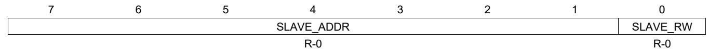

LEGEND: R/W = Read/Write; R = Read only; -*n* = value after reset

### **Table 10-12. PMBus Hold Slave Address Register (PMBHSA) Register Field Descriptions**

<span id="page-391-2"></span>

| Bit | Field      | Type | Reset | Description                                                                                  |
|-----|------------|------|-------|----------------------------------------------------------------------------------------------|
| 7-1 | SLAVE_ADDR | R    | 0     | Stored device address acknowledged by the slave                                              |
| 0   | SLAVE_RW   | R    | 0     | Stored R/W bit from address acknowledged by the slave<br>0 = Write Access<br>1 = Read Access |


# <span id="page-392-0"></span>*10.10.9 PMBus Control Register 3 (PMBCTRL3)*

Address FFF7F620

### **Figure 10-61. PMBus Control Register 3 (PMBCTRL3)**

<span id="page-392-1"></span>

|             |            | 24                |                    | 23                         |                     |           |           |  |  |
|-------------|------------|-------------------|--------------------|----------------------------|---------------------|-----------|-----------|--|--|
|             |            | I2C_MODE_EN*      |                    | CLK_HIS_DIS* or CLK_HI_EN* |                     |           |           |  |  |
|             |            | R/W-0             |                    |                            | R/W-1 or R/W-0      |           |           |  |  |
| 22          | 21         | 20                |                    | 19                         | 18                  | 17        | 16        |  |  |
| MASTER_EN   | SLAVE_EN   | CLK_LO_DIS        |                    | IBIAS_B_EN                 | IBIAS_A_EN          | SCL_DIR   | SCL_VALUE |  |  |
| R/W-0       | R/W-0      |                   | R/W-0<br>R/W-0     |                            | R/W-0               | R/W-0     | R/W-0     |  |  |
| 15          | 14         | 13                | 12                 | 11                         | 10                  | 9         | 8         |  |  |
| SCL_MODE    | SDA_DIR    | SDA_VALUE         | SDA_MODE           | CNTL_DIR                   | CNTL_VALUE          | CNTL_MODE | ALERT_DIR |  |  |
| R/W-0       | R/W-0      | R/W-0             | R/W-0              | R/W-0                      | R/W-0               | R/W-0     | R/W-0     |  |  |
| 7           | 6<br>5     |                   | 4                  | 3                          | 2                   | 1         | 0         |  |  |
| ALERT_VALUE | ALERT_MODE | CNTL_INT<br>_EDGE | FAST_MODE_<br>PLUS | FAST_MODE                  | BUS_LO_INT_<br>EDGE | ALERT_EN  | RESET     |  |  |
| R/W-0       | R/W-0      | R/W-0             | R/W-0              | R/W-0                      | R/W-0               | R/W-0     | R/W-0     |  |  |

LEGEND: R/W = Read/Write; R = Read only; -*n* = value after reset

# **Table 10-13. PMBus Control Register 3 (PMBCTRL3) Register Field Descriptions**

<span id="page-392-2"></span>

| Bit | Field        | Type | Reset | Description                                                                                                                                                                                                                                                                                                  |  |
|-----|--------------|------|-------|--------------------------------------------------------------------------------------------------------------------------------------------------------------------------------------------------------------------------------------------------------------------------------------------------------------|--|
| 24  | I2C_MODE_EN* | R/W  | 0     | I2C Mode Enable – Utilized for Master mode only<br>0 = I2C Mode Disabled (Default)<br>1 = I2C Mode Enabled<br>The only effect of I2C_MODE_EN is to remove the automatic insertion of number of<br>bytes in block writes in master mode.<br>*Only available on UCD3138A64 and UCD3138128 A and non-A versions |  |
| 23  | CLK_HI_DIS*  | R/W  | 1     | Clock High Timeout Disable<br>0 = Clock High Timeout Enabled<br>1 = Clock High Timeout Disabled (Default)<br>*Only available on UCD3138A64 and UCD3138128 A and non-A versions                                                                                                                               |  |
| 23  | CLK_HI_EN*   | R/W  | 0     | Clock High Timeout Enable<br>0 = Clock High Timeout Disabled (Default)<br>1 = Clock High Timeout Enabled<br>*Only available on UCD3138A and UCD3138064A                                                                                                                                                      |  |
| 22  | MASTER_EN    | R/W  | 0     | PMBus Master Enable<br>0 = Disables PMBus Master capability (Default)<br>1 = Enables PMBus Master capability                                                                                                                                                                                                 |  |
| 21  | SLAVE_EN     | R/W  | 0     | PMBus Slave Enable<br>0 = Disables PMBus Slave capability<br>1 = Enables PMBus Slave capability (Default)                                                                                                                                                                                                    |  |
| 20  | CLK_LO_DIS   | R/W  | 0     | Clock Low Timeout Disable<br>0 = Clock Low Timeout Enabled (Default)<br>1 = Clock Low Timeout Disabled                                                                                                                                                                                                       |  |
| 19  | IBIAS_B_EN   | R/W  | 0     | PMBus Current Source B Control<br>0 = Disables Current Source for PMBUS address detection thru ADC (Default)<br>1 = Enables Current Source for PMBUS address detection thru ADC                                                                                                                              |  |
| 18  | IBIAS_A_EN   | R/W  | 0     | PMBus Current Source A Control<br>0 = Disables Current Source for PMBUS address detection thru ADC (Default)<br>1 = Enables Current Source for PMBUS address detection thru ADC                                                                                                                              |  |
| 17  | SCL_DIR      | R/W  | 0     | Configures direction of PMBus clock pin in GPIO mode<br>0 = PMBus clock pin configured as output (Default)<br>1 = PMBus clock pin configured as input                                                                                                                                                        |  |


# **Table 10-13. PMBus Control Register 3 (PMBCTRL3) Register Field Descriptions (continued)**

| Bit | Field               | Type | Reset | Description                                                                                                                                                                      |  |  |
|-----|---------------------|------|-------|----------------------------------------------------------------------------------------------------------------------------------------------------------------------------------|--|--|
| 16  | SCL_VALUE           | R/W  | 0     | Configures output value of PMBus clock pin in GPIO Mode<br>0 = PMBus clock pin driven low in GPIO Mode (Default)<br>1 = PMBus clock pin driven high in GPIO Mode                 |  |  |
| 15  | SCL_MODE            | R/W  | 0     | Configures mode of PMBus Clock pin<br>0 = PMBus clock pin configured in functional mode (Default)<br>1 = PMBus clock pin configured as GPIO                                      |  |  |
| 14  | SDA_DIR             | R/W  | 0     | Configures direction of PMBus data pin in GPIO mode<br>0 = PMBus data pin configured as output (Default)<br>1 = PMBus data pin configured as input                               |  |  |
| 13  | SDA_VALUE           | R/W  | 0     | Configures output value of PMBus data pin in GPIO Mode<br>0 = PMBus data pin driven low in GPIO Mode (Default)<br>1 = PMBus data pin driven high in GPIO Mode                    |  |  |
| 12  | SDA_MODE            | R/W  | 0     | Configures mode of PMBus Data pin<br>0 = PMBus data pin configured in functional mode (Default)<br>1 = PMBus data pin configured as GPIO                                         |  |  |
| 11  | CNTL_DIR            | R/W  | 0     | Configures direction of Control pin in GPIO mode<br>0 = Control pin configured as output (Default)<br>1 = Control pin configured as input                                        |  |  |
| 10  | CNTL_VALUE          | R/W  | 0     | Configures output value of Control pin in GPIO Mode<br>0 = Control pin driven low in GPIO Mode (Default)<br>1 = Control pin driven high in GPIO Mode                             |  |  |
| 9   | CNTL_MODE           | R/W  | 0     | Configures mode of Control pin<br>0 = Control pin configured in functional mode (Default)<br>1 = Control pin configured as GPIO                                                  |  |  |
| 8   | ALERT_DIR           | R/W  | 0     | Configures direction of Alert pin in GPIO mode<br>0 = Control pin configured as output (Default)<br>1 = Control pin configured as input                                          |  |  |
| 7   | ALERT_VALUE         | R/W  | 0     | Configures output value of Alert pin in GPIO Mode<br>0 = Alert pin driven low in GPIO Mode (Default)<br>1 = Alert pin driven high in GPIO Mode                                   |  |  |
| 6   | ALERT_MODE          | R/W  | 0     | Configures mode of Alert pin<br>0 = Alert pin configured in functional mode (Default)<br>1 = Aler3 pin configured as GPIO                                                        |  |  |
| 5   | CNTL_INT_EDGE       | R/W  | 0     | Control Interrupt Edge Select<br>0 = Interrupt generated on falling edge of Control (Default)<br>1 = Interrupt generated on rising edge of Control                               |  |  |
| 4   | FAST_MODE<br>_PLUS  | R/W  | 0     | Fast Mode Plus Enable<br>0 = Standard 100 KHz mode enabled (Default)<br>1 = Fast Mode Plus enabled (1MHz operation on PMBus)                                                     |  |  |
| 3   | FAST_MODE           | R/W  | 0     | Fast Mode Enable<br>0 = Standard 100 KHz mode enabled (Default)<br>1 = Fast Mode enabled (400KHz operation on PMBus)                                                             |  |  |
| 2   | BUS_LO_INT<br>_EDGE | R/W  | 0     | Clock Low Timeout Interrupt Edge Select<br>0 = Interrupt generated on rising edge of clock low timeout (Default)<br>1 = Interrupt generated on falling edge of clock low timeout |  |  |
| 1   | ALERT_EN            | R/W  | 0     | Slave Alert Enable<br>0 = PMBus Alert is not driven by slave, pulled up high on PMBus (Default)<br>1 = PMBus Alert driven low by slave                                           |  |  |


# **Table 10-13. PMBus Control Register 3 (PMBCTRL3) Register Field Descriptions (continued)**

| Bit | Field | Type | Reset | Description                                            |
|-----|-------|------|-------|--------------------------------------------------------|
| 0   | RESET | R/W  | 0     | PMBus Interface Synchronous Reset                      |
|     |       |      |       | 0 = No reset of internal state machines (Default)      |
|     |       |      |       | 1 = Control state machines are reset to initial states |

<span id="page-395-0"></span>

# *Timer Module Overview*

The Timer Module contains a total of 6 timers. They are:

- T24, a 24 bit free-running timer that is best used for timing asynchronous events
- Instances of T16PWM, a 16 bit timer best used for PWM and for generating regular, recurring interrupts
- WD a watchdog timer

**Topic** ........................................................................................................................... **Page**

| 11.1  | T24 – 24 Bit Free-Running Timer with Capture and Compare | 397 |
|-------|----------------------------------------------------------|-----|
| 11.2  | T24 Clock Source, Prescaler and Counter                  | 397 |
| 11.3  | T24 Capture Block                                        | 398 |
| 11.4  | T24 Compare Blocks                                       | 399 |
| 11.5  | T24 Interrupts                                           | 399 |
| 11.6  | T16PWMx - 16 Bit PWM Timers                              | 399 |
| 11.7  | T16PWMx Summary                                          | 399 |
| 11.8  | T16PWMx Prescaler and Counter                            | 400 |
| 11.9  | T16PWMx Compare Blocks                                   | 400 |
| 11.10 | T16 Shadow Bit                                           | 401 |
| 11.11 | T16 Interrupts                                           | 401 |
| 11.12 | Using the T16 for a Timer Interrupt                      | 402 |
| 11.13 | Using the T16 for PWM Generation                         | 402 |
| 11.14 | WD - Watchdog                                            | 402 |
| 11.15 | Watchdog Prescale and Counter                            | 403 |
| 11.16 | Watchdog Compare Blocks                                  | 403 |
| 11.17 | Watchdog Protect Bit                                     | 403 |
| 11.18 | Watchdog Timer Example                                   | 404 |
| 11.19 | Warnings for Watchdog Status Register                    | 404 |
| 11.20 | System Fault Recovery Basics                             | 404 |
| 11.21 | Timer Module Register Reference                          | 405 |
|       |                                                          |     |


# <span id="page-396-0"></span>**11.1 T24 – 24 Bit Free-Running Timer with Capture and Compare**

Here is a block diagram of the T24 Module:

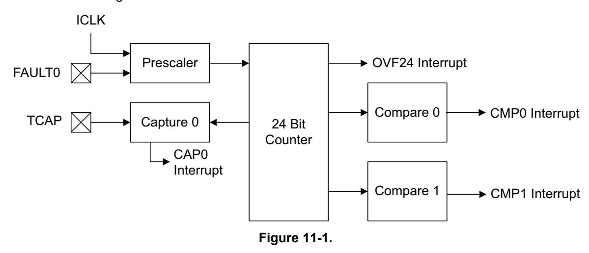

Note that the UCD3138A64 and UCD3138128 add a second capture module – CAP1. The pin names are TCAP0 and TCAP1.

# <span id="page-396-2"></span><span id="page-396-1"></span>**11.2 T24 Clock Source, Prescaler and Counter**

The core of the T24 timer is a 24 bit free-running counter. The clock input for the T24 timer can come from a clock within the UCD3138, ICLK, which is nominally 15.6 MHz. Consult the UCD3138 device datasheet for the precise specification.

It can also be used with an external clock from the FAULT-0 pin.

The internal clock is the default. To select the external clock source instead, execute this C equation:

```
TimerRegs.T24CNTCTRL.bit.EXT_CLK_SEL = 1;
```

All C code references in this document use standard TI header files, provided as part of the UCD3138 EVM (UCD3138PFCEVM-026, UCD3138LLCEVM-028 etc) reference firmware.

- The first term, TimerRegs, refers to the Timer Register block
- The second term, T24CNTCTRL, refers to the specific register within that block
- Bit refers to the bit map. EXT\_CLK\_SEL refers to the specific bit field within the bit map

The clock then runs through a prescaler. The prescaler is controlled by an 8 bit register. Register values from 0 to 255 correspond to dividing the clock by 1 to 256.

The divider count always equals register +1. The register C code is:

```
TimerRegs.T24CNTCTRL.bit.PRESCALE = 255;//Load with maximum divide ratio
```

With the nominal ICLK, and the 24 bit counter, a divide of 256 means that the timer will free run for about 4.5 minutes before overflowing.

Counter overflow can be used to generate an interrupt, if desired. The default is for the interrupt to be disabled. To enable it, here is the C code:

```
TimerRegs.T24CNTCTRL.bit.OV_INT_ENA = 1;
```

There is also a bit that can be polled to indicate that an overflow has occurred:

```
result = TimerRegs.T24CNTCTRL.bit.OV_FLAG;
```

It is necessary to write a 1 to the OV\_FLAG to clear it. This will also clear the overflow interrupt.

The 24 bit free running counter can be read by firmware to provide a time base. For example, to measure the time required for a section of firmware, simply read the counter at the beginning and end of the section and subtract the start count from the end count. To read from the counter:

```
result = TimerRegs.T24CNTDAT.bit.CNT_DAT;
```


*T24 Capture Block* [www.ti.com](http://www.ti.com)

It is necessary to design the program to compensate for a counter overflow in case one occurs during that section of firmware. The OV\_FLAG bit is useful in this case.

The counter is completely free running. There is no way to write to it, reset it, or to change when it overflows. It just keeps counting until all 24 bits overflow, then it starts over from zero.

The counter provides a 24-bit timer bus to all input capture and output compare units inside the Capture/Control module.

# <span id="page-397-0"></span>**11.3 T24 Capture Block**

The T24's capture block is used to collect timing information about external signals. The capture block can be programmed to capture the 24 bit timer value on an edge on the external signal. It can also generate an interrupt on the edge.

The edge control bits can select:

00 = No Capture (Default)

01 = Rising Edge

10 = Falling Edge

11 = Both Edges

For example, to program for both edges:

```
TimerRegs.T24CAPCTRL.bit.EDGE = 3; //both edges
```

There are CAP\_INT\_ENA and CAP\_INT\_FLAG bits which work much the same as the overflow bits for the 24 bit counter. They are also in the T24CAPCTRL register.

For low speed signals, a single capture block can be used for both edges. For example, to determine the positive pulse width of a signal:

- Connect the signal to the TCAP pin
- Enable capture on the rising edge
- Poll the CAP\_INT\_FLAG bit, or enable the interrupt.
- When the capture occurs, read the capture data register

```
result = TimerRegs.T24CAPDAT.bit.CAP_DAT;
```

- Then enable capture on the falling edge.
- When the capture occurs, read the capture data register again and subtract:

```
result = TimerRegs.T24CAPDAT.bit.CAP_DAT - result;
```

Note that overflow handling may be necessary as well. This depends on the expected timing of the signal.

One simple solution is that if the final result is negative, adding 0x1000000, (2<sup>24</sup>) will give the correct result. This is accurate so long as only one overflow has occurred. If there is a possibility of more than one overflow occurring, it will be necessary to keep track of this.

The same approach can apply to any combination of edges.

For measuring fast pulses, it may be necessary to use both capture pins for a single signal. For a fast positive pulse, for example, program one capture register for the rising edge and one for the falling edge. Note that this only works when the low signal time is long enough to permit initialization. If the low going pulse is fast also, it is not possible to tell which edge came first.

There is also a T24CAPIO register which permits using the TCAP pin as a General Purpose I/O pin. It is very straightforward to use. See Section [11.21.5](#page-408-0) for more information.

Note that the registers will continue to capture edges. The capture registers do not take the first capture value and hold it. Instead, they will give the time value of the latest edge.

The capture can also come from other sources. There is a CAP\_SEL bitfield in the T24CAPCTRL register. It can select from 4 signal sources:

- TCAP the default, dedicated pin
- SCI\_RX0 useful for measuring the receive baud rate


[www.ti.com](http://www.ti.com) *T24 Compare Blocks*

- SCI\_RX1 see above
- SYNC useful for synchronizing and phase matching to FET switching signals from another UCD

# <span id="page-398-0"></span>**11.4 T24 Compare Blocks**

The counter is also used by 2 compare blocks. Compare blocks are programmed with a 24 bit value. When the 24 bit counter matches that value, the compare block is triggered.

These compare blocks are best used when the firmware starts an asynchronous process that needs some other event to follow at a fixed interval. Add the desired interval to the current counter value, and put the result into the compare register. When the time elapses, the interrupt will occur, or the TCMP pin will change.

To load the compare register with a fixed interval:

```
#define FIXED_INTERVAL 100
.....
TimerRegs.T24CMP0DAT.bit.CMP_DAT = TimerRegs.T24CNTDAT.bit.CNT_DAT + FIXED_INTERVAL;
```

This technique will even work well if an overflow occurs during the interval. Just like the timer, the result will overflow and be clipped.

The configuration of the Compare Blocks is relatively straightforward. Refer to [Section](#page-404-0) 11.21 for details.

# <span id="page-398-1"></span>**11.5 T24 Interrupts**

There are 4 or 5 T24 interrupts, depending on the device. Each one has a separate bit in the CIM – Central Interrupt Module. This means that each interrupt can have an independent interrupt vector, with no need to read from the timer module to determine which interrupt has occurred. On the UCD3138128A and UCD3138A64A, the DTC interrupt is combined with one of the T24 interrupts

Please note that the frequency of T24 interrupts is not adjustable. Therefore T24 may not be used for generating periodic system tick interruptions.

# <span id="page-398-2"></span>**11.6 T16PWMx - 16 Bit PWM Timers**

The UCD3138RGC (64-pin version) has 4 independent 16 bit timers. These are best used for repetitive, regular interrupts, and for PWM generation, for example for fan drive control.

Depending on the specific device, not all timers will have output pins associated with them. Consult the device datasheet for specific information.

# <span id="page-398-3"></span>**11.7 T16PWMx Summary**

The 16PWMx timers have a 16 bit counter driven by a prescaler, which is driven by ICLK. They have 2 compare units which combine to control one output pin. Each compare unit can generate an interrupt, as can the counter overflow. All of the interrupts from a specific timer are combined into one before being sent to the CIM interrupt module. Each timer has its own interrupt bit in the CIM.


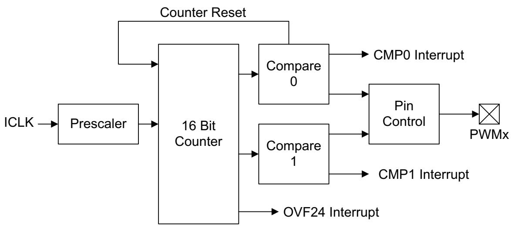

#### **Figure 11-2.**

#### <span id="page-399-2"></span><span id="page-399-0"></span>11.8 T16PWMx Prescaler and Counter

The Prescaler for the 16 bit PWM Timer is always driven by ICLK. The clock divide is equal to PRESCALE + 1.

Here is C code which sets the prescale value to 3, for a divide of 4:

```
TimerRegs.T16PWM0CNTCTRL.bit.PRESCALE = 3; //divide by 4
```

To see the counter value, please follow the example below:

```
result = TimerRegs.T16PWM0CNTDAT.bit.CNT DAT;
```

The counter is free-running and counts from 0x0000 after a reset. If the counter reaches 0xFFFF, it rolls over to 0x0000 and continues counting. This rollover causes the overflow flag to be set and an interrupt to be generated, if enabled. The interrupt and flag bits are well described in Section 11.21.

The timer can also be reset by a compare event on the compare 0 block. To enable this function, use this C code:

```
TimerRegs.T16PWM0CNTCTRL.bit.CMP_RESET_ENA = 1; //enable Comp 0 reset
```

If this bit is set the counter will be reset when the counter reaches the value in the T16PWM0CMP0DAT.bit.CMP\_DAT register.

The 16 bit counter can also be reset by setting the SW RESET bit:

```
TimerRegs.T16PWM0CNTCTRL.bit.SW RESET = 0; //reset and stop counter
```

A zero in SW\_RESET is the default state, so it is necessary to write a 1 to this bit in order for the counter to run. The compare and control registers should be initialized before writing to SW\_RESET to enable the counter

#### <span id="page-399-1"></span>11.9 T16PWMx Compare Blocks

There are two Compare Blocks for the T16PWMx timer. The Compare 0 block has the capability to reset the 16 bit counter. The Compare 1 block does not.

The Compare 0 block also has the highest priority. If both compare data registers are loaded with the same value, the Compare 0 operation will take place, and the Compare 1 operation will be ignored.

Each compare block has a 16 bit data register. When the 16 bit counter value matches the value in the data register, a programmed action can take place on the output pin for the T16. Here is the C code to write to a compare data register:

TimerRegs.T16PWM0CMP0DAT.bit.CMP DAT = 100;


[www.ti.com](http://www.ti.com) *T16 Shadow Bit*

The compare action is programmable for each compare block to one of 4 states:

00 = No action (Default)

01 = Set pin

10 = Clear pin

11 = Toggle pin

To set Compare 0 up to toggle the pin:

```
TimerRegs.T16PWM0CMPCTRL.bit.PWM_OUT_ACTION0 = 3;
```

There is also an OUT bit and an OUT\_DRV bit. When a 1 is written to the OUT\_DRV bit, the OUT bit value is placed on the pin. Both compare blocks and the OUT bit can work seamlessly together.

All of this only works, of course, if the OUT\_ENA bit is set as well. The default state for the pin is as an input, so it is necessary to set the OUT\_ENA bit if output is desired.

As already mentioned, each compare block can cause an interrupt, if it is enabled. The interrupt enable and flag bits are described in [Section](#page-404-0) 11.21 for details.

# <span id="page-400-0"></span>**11.10 T16 Shadow Bit**

The compare control register also contains a SHADOW bit. It is normally cleared, but it can be set this way:

```
TimerRegs.T16PWM0CMPCTRL.bit.SHADOW = 1;
```

The SHADOW bit is useful for a PWM output that will vary over time. The compare blocks work by detecting when the compare data is equal to the 16 bit counter value. This works fine if the compare data is never changed.

If, however, the compare data value is reduced at the wrong time, it is possible for the compare block to miss it, and therefore for the PWM pulse to remain on for the entire period.

For example, suppose that the compare 1 data value is 100. Suppose that the counter value is 90, and the compare 1 data register is written to, changing the data value to 80. In this case, for one cycle, the compare 1 event will not occur. Normally for PWM, compare 1 is used to turn off the PWM pulse. So the result will be a PWM pulse that is on for the entire period.

If the SHADOW bit is set, it enables buffer registers, called shadow registers, for the compare data registers. The data written is stored in the shadow register until the next compare event, and only then is it written into the compare data register.

So to return to the example, the 80 will not be written into the data register until after the counter reaches 100, so the pulse will stop at 100, instead of going on to the end.

There are two side effects to using the shadow register:

- 1. Read always reads from the actual data register. So if the data register is written to and then read from before the next compare event for that block, the old data will still be read.
- 2. If the value written to the data register is higher than the current value, it may be possible to have two compare events. For example if the counter value is 70, the data value is 80, and the new data value is 100, the compare event will occur at 80, and the shadow register will be copied into the data register. Then a second compare event will occur when the 16 bit counter reaches 100. This should not be a problem if the compare action is a set or reset, but if the action is a toggle, this could be a problem. Or if the compare interrupt is being used.

Of course, the same thing could happen without the shadow bit set.

# <span id="page-400-1"></span>**11.11 T16 Interrupts**

The T16 module generates 3 interrupts. All of them are combined into a single signal for the CIM. Therefore, if more than one interrupt is enabled for a module, it will be necessary to read the module registers in order to determine the source(s) of the interrupt. It will also be necessary to write to all the interrupt flags which are set to clear the interrupt.


# <span id="page-401-0"></span>**11.12 Using the T16 for a Timer Interrupt**

#### 标准中断

The C code below should provide an approximate 10 KHz interrupt from the T16:

```
TimerRegs.T16PWM0CMP0DAT.bit.CMP_DAT = 1587; //value to reset counter
TimerRegs.T16PWM0CMPCTRL.bit.CMP0_INT_ENA = 1; //interrupt when counter reset
TimerRegs.T16PWM0CNTCTRL.bit.CMP_RESET_ENA = 1; //enable reset by comp 0
TimerRegs.T16PWM0CNTCTRL.bit.SW_RESET = 1; //allow counter to run
```

In UCD3138 the interrupt flags are not cleared automatically by hardware when the interrupt is serviced. Therefore the interrupt flag needs to be manually cleared by adding the following statement at the end of the relevant interrupt service routine.

```
TimerRegs.T16PWM1CMPCTRL.all | = 3;
```

When T16 is used for timer interrupt generation, its PWM output can be used as an independent GPIO simultaneously. This can be done by using the PWM\_OUT\_ENA, PWM\_OUT\_DRV, and PWM\_OUT bits described above, or it can be done using the Global I/O registers described elsewhere in this document.

# <span id="page-401-1"></span>**11.13 Using the T16 for PWM Generation**

驱动FAN

UCD3138RGC (64-pin version) offers two timer PWM outputs (PWM0 and PWM1), but UCD3138RHA (40-pin version) offers only one timer PWM0 output. The C code below should provide a 50% PWM at approximately 10 KHz. Consult the UCD3138 device datasheet for ICLK speeds.

```
TimerRegs.T16PWM0CMP0DAT.bit.CMP_DAT = 1587; //value to reset counter
TimerRegs.T16PWM0CMP1DAT.bit.CMP_DAT = 793; //50%50 duty cycle half of comp 0
TimerRegs.T16PWM0CMPCTRL.bit.PWM_OUT_ACTION0 = 1;//1 is for clear pin
TimerRegs.T16PWM0CMPCTRL.bit.PWM_OUT_ACTION1 = 2;//2 is for clear pin
TimerRegs.T16PWM0CNTCTRL.bit.CMP_RESET_ENA = 1; //enable reset by comp 0
TimerRegs.T16PWM0CMPCTRL.bit.PWM_OUT = 0; //make sure that default is a 0
TimerRegs.T16PWM0CMPCTRL.bit.PWM_OUT_DRV = 1; //put zero into output latch
TimerRegs.T16PWM0CMPCTRL.bit.PWM_OUT_ENA = 1; //enable pin as an output
TimerRegs.T16PWM0CNTCTRL.bit.SW_RESET = 1; //allow counter to run
                                                                          set pin
```

This program uses the Capture 0 block to set the PWM pin high at the end of the previous cycle and s simultaneously reset the counter. Then the Capture 1 block, which is loaded with a value 50% the size of Capture 0, clears the PWM pin value halfway through the period.

# <span id="page-401-2"></span>**11.14 WD - Watchdog**

The watchdog is the smallest module in the timer. It is primarily designed to assist in recovery in the event of a firmware or processor fault. The watchdog is not intended for use as a source of a timer interrupt. It doesn't use the central clock – for reliability it has its own unique clock. This clock has a much higher variation over temperature and voltage, and from device to device than the clock for the rest of the device. See the data sheet for each device for the details of the variation.

Unlike the other timers, the counter in the watchdog is invisible, and the compare data values are fixed.

The interrupts occur always when the counter is half full and when it is full.

<span id="page-401-3"></span>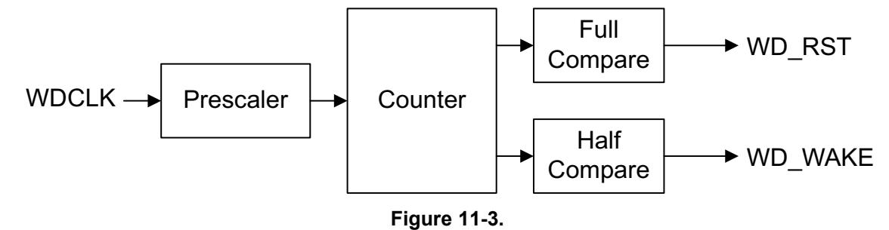


# <span id="page-402-0"></span>**11.15 Watchdog Prescale and Counter**

The watchdog "prescale" is the WD\_PERIOD bit field. It sets the counter period for the watchdog to a time between approximately 17ms typical (14.5ms Min to 20.1ms max) and approximately 2.2 sec typical (1.85 sec Min to 2.6 sec Max). Note that these numbers are for a specific device and a specific version of that device. Consult the current data sheet for the specific device you are using.

The counter can be reset by writing a 1 to the CNT\_RESET bit. When using the watchdog, normally a write to CNT\_RESET is put into the background loop of the program. That way if the program gets lost, the counter will not get reset, and the watchdog will trigger, resetting the UCD.

The counter output is used by two compare blocks with fixed values.

# <span id="page-402-1"></span>**11.16 Watchdog Compare Blocks**

The two compare blocks are one for the counter half full, and one for the counter overflow.

The half full counter interrupt is intended to give advance warning that something is wrong with program execution. If the interrupt function is still working, it can be used to start a recovery operation.

The counter overflow can also be used just as an interrupt, or it can be configured to reset the CPU.

The configuration is relatively simple, and can be understood from Section [11.21.15.](#page-419-0)

Note that the Watchdog Wake Event is another name for the Half Compare Event.

The only special bit is the Protect bit.

# <span id="page-402-2"></span>**11.17 Watchdog Protect Bit**

The Watchdog Protect but is a special bit. Once it is cleared, it cannot be set again. It also causes other bits to be set so that they cannot be cleared. The effect is that once the protect bit is cleared, the watchdog timer cannot be turned off. It will always need to be cleared by writing a 1 to CNT\_RESET.

Other bits in the Watchdog Control register are not protected, however. For example, the WD\_PERIOD bits can still be changed, as can the interrupt enable bits. Refer to [Section](#page-404-0) 11.21 for details.


# <span id="page-403-1"></span>**11.18 Watchdog Timer Example**

In normal watchdog operation, the watchdog is set up to reset the CPU if it makes it to a full count. The firmware is designed to write a 1 to the CNT\_RESET bit frequently, so that the watchdog should never reach a full count unless some fault causes the firmware to stop executing properly.

Initialization of the watchdog is very simple:

```
TimerRegs.WDCTRL.bit.CNT_RESET = 1; //make sure counter is cleared
TimerRegs.WDCTRL.bit.WDRST_EN = 1; //Enable watchdog
TimerRegs.WDCTRL.bit.CPU_RESET_EN = 1; //Enable resetting of CPU is watchdog overflows
TimerRegs.WDCTRL.bit.PROTECT = 0; //enable protected watchdog
```

Then just repeat the two statements below frequently enough in the code to prevent the watchdog counter from overflowing:

```
TimerRegs.WDCTRL.bit.CNT_RESET = 1; //make sure counter is cleared
```

If a faster watchdog timeout is desired, simply write to the WD\_PERIOD bitfield:

```
TimerRegs.WDCTRL.bit.WD_PERIOD = 2; // fast watchdog
```

The default value for WD\_PERIOD is 0x7f, which will give an approximate 2.2second watchdog.

# <span id="page-403-0"></span>**11.19 Warnings for Watchdog Status Register**

Normally there is no need to read the status, but if there is, some precautions should be taken. The Watchdog Status Register is a clear on read register. The Watchdog is asynchronous to the CPU. On rare instances, it is possible to read from the register at exactly the right time and read a 0 even though the bit has been set and then cleared by the read.

To avoid this issue, set the interrupt enable bits in the WDCTRL register, even if the interrupts are not going to be used. Then poll the interrupt bits in the CIM to determine when the WD bits are set. Then it is safe to read from the WD status register to clear the bits, which will also clear the CIM bits.

Additionally, please note the following:

- the WAKE\_EV\_INT will be set at the halfway point and cleared on read of Watchdog Status Register.
- all three bits in the WDST register may be set upon power up reset, so they should be read from in order to clear them before any polling operation begins.
- any bitwise read actually reads from the entire register and will clear all the bits which are set. So if sampling of multiple bits is desired, copy the register into a variable and examine the bits individually there.

### <span id="page-403-2"></span>**11.20 System Fault Recovery Basics**

There is a register in the System Module – SYSESR – System Exception Status Register – which saves the reset cause through the reset. There is a bit for every event except the watchdog timer.

It is possible to look at this register when the program is entered and determine if the reset was caused by the watchdog timer, or some other cause, such as an illegal address access. Often if a problem occurs with firmware execution, some other fault will occur before the watchdog timer times out. So if a reset occurs and none of the bits are set, then the cause is the watchdog timer.

To use this register, examine it when the program is first started. Do whatever processing is necessary, save the reset cause if desired, and then clear the register. In this way, it will be possible to tell the next reset cause. If the register is not cleared by the program, there may be two bits set the next time, making it impossible to determine the cause of the newest reset.

All resets, regardless of the cause, will reset all of the peripherals to their default state, so most outputs will go to inputs and so on. This will generally have the effect of shutting down any power supply that is being controlled by the device.


# <span id="page-404-0"></span>**11.21 Timer Module Register Reference**

UCD3138RGC (64-pin version) offers two timer PWM outputs, but UCD3138RHA offers only a single timer PWM output. Please consult the device data sheet for the specific device for more information.

Timer Registers have the following attributes:

- 32-bit wide
- Addresses placed on word boundaries
- Byte, Half-Word and word writes permitted
- All Registers can be read in any mode
- All Registers, except for the Timer Powerdown Control Register, are writeable in any mode. The Timer Powerdown Control Register is writeable only in privilege mode

# <span id="page-404-1"></span>*11.21.1 24-bit Counter Data Register (T24CNTDAT)*

Address FFF7FD00

**Figure 11-4. 24-bit Counter Data Register (T24CNTDAT)**

<span id="page-404-2"></span>23 0 CNT\_DAT

R-0

LEGEND: R/W = Read/Write; R = Read only; -*n* = value after reset

### **Table 11-1. 24-bit Counter Data Register (T24CNTDAT) Register Field Descriptions**

<span id="page-404-3"></span>

| Bit  | Field   | Type | Reset | Description                       |
|------|---------|------|-------|-----------------------------------|
| 23-0 | CNT_DAT | R    | 0     | Contains the 24-bit counter value |


# <span id="page-405-0"></span>*11.21.2 24-bit Counter Control Register (T24CNTCTRL)*

Address FFF7FD04

### **Figure 11-5. 24-bit Counter Control Register (T24CNTCTRL)**

<span id="page-405-1"></span>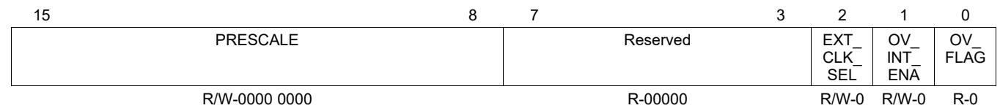

LEGEND: R/W = Read/Write; R = Read only; -*n* = value after reset

### **Table 11-2. 24-bit Counter Control Register (T24CNTCTRL) Register Field Descriptions**

<span id="page-405-2"></span>

| Bit  | Field       | Type | Reset        | Description                                                                                                                                                                                                     |  |
|------|-------------|------|--------------|-----------------------------------------------------------------------------------------------------------------------------------------------------------------------------------------------------------------|--|
| 15-8 | PRESCALE    | R/W  | 0000<br>0000 | Defines the prescaler value used to select the 24-bit counter resolution. The<br>minimum divider ratio is 4, prescaler value less than 3 defaults to 3. Counter<br>Resolution = (Prescaler Value+1)*1/ICLK      |  |
| 7-3  | Reserved    | R/W  | 00000        |                                                                                                                                                                                                                 |  |
| 2    | EXT_CLK_SEL | R/W  | 0            | External Clock Select<br>0 = Selects ICLK as clock for 24-bit counter (Default)<br>1 = Selects External Clock on FAULT-0 as clock for 24-bit counter                                                            |  |
| 1    | OV_INT_ENA  | R/W  | 0            | Counter Overflow Interrupt Enable<br>0 = Disables 24-bit Counter Overflow Interrupt (Default)<br>1 = Enables 24-bit Counter Overflow Interrupt                                                                  |  |
| 0    | OV_FLAG     | R    | 0            | Indicates a counter overflow. Overflow event is cleared by writing a '1' to this bit. If a<br>clear and an overflow event occur at the same time, the flag will remain high (set has<br>priority versus clear). |  |
|      |             |      |              | 0 = No counter overflow since last clear<br>1 = Counter overflow since last clear                                                                                                                               |  |


# <span id="page-406-0"></span>*11.21.3 24-bit Capture Channel Data Register (T24CAPDAT) or (T24CAPDATx)*

Address FFF7FD08 – 24-bit Capture Data Register 0

Address FFF7FD0C – 24-bit Capture Data Register 1 – only on 'A64 and 128

The 'a64 and '128 devices have T24CAPDAT0 and 1. Other devices have T24CAPDAT.

**Figure 11-6. 24-bit Capture Channel Data Register (T24CAPDAT)**

<span id="page-406-1"></span>23 0 CAP\_DAT

R-0

**Table 11-3. 24-bit Capture Channel Data Register (T24CAPDAT) Register Field Descriptions**

<span id="page-406-2"></span>

| Bit  | Field   | Type | Reset | Description                             |
|------|---------|------|-------|-----------------------------------------|
| 23-0 | CAP_DAT | R    | 0     | Contains the 24-bit input capture value |


### <span id="page-407-0"></span>*11.21.4 24-bit Capture Channel Control Register (T24CAPCTRLx or T24CAPCTRL*

Address FFF7FD14 – 24-bit Capture Channel Control Register 0

Address FFF7FD18 – 24-bit Capture Channel Control Register 1 – only on 'A64 and 128

The 'a64 and '128 devices have T24CAPCTRL0 and 1. Other devices have T24CAPCTRL.

### **Figure 11-7. 24-bit Capture Channel Control Register (T24CAPCTRL)**

<span id="page-407-1"></span>

| 5       | 4 | 3      | 2 | 1           | 0            |
|---------|---|--------|---|-------------|--------------|
| CAP_SEL |   | EDGE   |   | CAP_INT_ENA | CAP_INT_FLAG |
| R/W-00  |   | R/W-00 |   | R/W-0       | R/W-0        |

LEGEND: R/W = Read/Write; R = Read only; -*n* = value after reset

### **Table 11-4. 24-bit Capture Channel Control Register (T24CAPCTRL) Register Field Descriptions**

<span id="page-407-2"></span>

| Bit | Field        | Type | Reset | Description                                                                                                                                                                                                                                                                                                                                 |
|-----|--------------|------|-------|---------------------------------------------------------------------------------------------------------------------------------------------------------------------------------------------------------------------------------------------------------------------------------------------------------------------------------------------|
| 5-4 | CAP_SEL      | R/W  | 00    | Capture Pin Select<br>00 = TCAP pin (Default)<br>01 = SCI_RX[0] pin<br>10 = SCI_RX[1] pin<br>11 = SYNC pin                                                                                                                                                                                                                                  |
| 3-2 | EDGE         | R/W  | 00    | Input Capture Edge Select<br>00 = No Capture (Default)<br>01 = Rising Edge<br>10 = Falling Edge<br>11 = Both Edges                                                                                                                                                                                                                          |
| 1   | CAP_INT_ENA  | R/W  | 0     | Input Capture Interrupt Enable<br>0 = Disables 24-bit input capture interrupt (Default)<br>1 = Enables 24-bit input capture interrupt                                                                                                                                                                                                       |
| 0   | CAP_INT_FLAG | R/W  | 0     | Flag which indicates a valid input capture event. This bit is cleared by writing a '1' to<br>it or by reading the corresponding Capture Channel Data Register. If a clear and a<br>valid capture event occur at the same time, the flag will remain high (set has priority<br>versus clear).<br>0 = No valid capture event since last clear |
|     |              |      |       | 1 = Valid capture event since last clear                                                                                                                                                                                                                                                                                                    |


# <span id="page-408-0"></span>*11.21.5 24-bit Capture I/O Control and Data Register (T24CAPIO)*

Address FFF7FD20

\* - .128 and 'A64 devices have 2 TCAP pins, so bits in this register are numbered TCAP\_0 and TCAP\_1. On devices with only 1 pin, there is no number, so it's just TCAP, in the locations used by TCAP0 bits above.

### **Figure 11-8. 24-bit Capture I/O Control and Data Register (T24CAPIO)**

<span id="page-408-1"></span>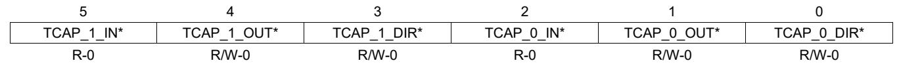

LEGEND: R/W = Read/Write; R = Read only; -*n* = value after reset

# **Table 11-5. 24-bit Capture I/O Control and Data Register (T24CAPIO) Register Field Descriptions**

<span id="page-408-2"></span>

| Bit | Field                      | Type | Reset | Description                                                                                                                                                                                 |
|-----|----------------------------|------|-------|---------------------------------------------------------------------------------------------------------------------------------------------------------------------------------------------|
| 5   | TCAP_1_IN                  | R    | 0     | Input data for pin TCAP_1/TDI/TDO pin, when connected to chip I/O<br>0 = Logic level low detected on TCAP pin<br>1 = Logic level high detected on TCAP pin                                  |
| 4   | TCAP_OUT                   | R/W  | 0     | Output data for pin TCAP_1 pin, when connected to chip I/O<br>0 = Logic level low driven on TCAP_1 pin in output mode (Default)<br>1 = Logic level high driven on TCAP_1 pin in output mode |
| 3   | TCAP_1_DIR                 | R/W  | 0     | Controls data direction for pin TCAP, when connected to chip I/O<br>0 = TCAP_1 pin configured as input (Default)<br>1 = TCAP_1 pin configured as output                                     |
| 2   | TCAP_IN or<br>TCAP_0_IN    | R    | 0     | Input data for TCAP or TCAP0 pin, when connected to chip I/O<br>0 = Logic level low detected on TCAP pin<br>1 = Logic level high detected on TCAP pin                                       |
| 1   | TCAP_OUT or<br>TCAP_0_OUT  | R/W  | 0     | Output data for TCAP or TCAP0 pin, when connected to chip I/O<br>0 = Logic level low driven on TCAP pin in output mode (Default)<br>1 = Logic level high driven on TCAP pin in output mode  |
| 0   | TCAP_DIR or<br>TCAP_0_DIR* | R/W  | 0     | Controls data direction for TCAP or TCAP0 pin, when connected to chip I/O<br>0 = TCAP pin configured as input (Default)<br>1 = TCAP pin configured as output                                |


# <span id="page-409-1"></span><span id="page-409-0"></span>*11.21.6 24-bit Output Compare Channel 0 Data Register (T24CMPDAT0)*

Address FFF7FD24

### **Figure 11-9. 24-bit Output Compare Channel 0 Data Register (T24CMPDAT0)**

23 0

CMP\_DAT

R/W-0000 0000 0000 0000 0000 0000

LEGEND: R/W = Read/Write; R = Read only; -*n* = value after reset

#### **Table 11-6. 24-bit Output Compare Channel 0 Data Register (T24CMPDAT0) Register Field Descriptions**

<span id="page-409-2"></span>

| Bit  | Field   | Type | Reset                                        | Description                                 |
|------|---------|------|----------------------------------------------|---------------------------------------------|
| 23-0 | CMP_DAT | R/W  | 0000<br>0000<br>0000<br>0000<br>0000<br>0000 | Contains the 24-bit output comparison value |


# <span id="page-410-1"></span><span id="page-410-0"></span>*11.21.7 24-bit Output Compare Channel 1 Data Register (T24CMPDAT1)*

Address FFF7FD28

# **Figure 11-10. 24-bit Output Compare Channel 1 Data Register (T24CMPDAT1)**

23 0 CMP\_DAT

R/W-0000 0000 0000 0000 0000 0000

LEGEND: R/W = Read/Write; R = Read only; -*n* = value after reset

#### **Table 11-7. 24-bit Output Compare Channel 1 Data Register (T24CMPDAT1) Register Field Descriptions**

<span id="page-410-2"></span>

| Bit   | Field   | Type | Reset                                        | Description                                 |
|-------|---------|------|----------------------------------------------|---------------------------------------------|
| 23-01 | CMP_DAT | R/W  | 0000<br>0000<br>0000<br>0000<br>0000<br>0000 | Contains the 24-bit output comparison value |


# <span id="page-411-0"></span>*11.21.8 24-bit Output Compare Channel 0 Control Register (T24CMPCTRL0)*

Address FFF7FD2C

**Figure 11-11. 24-bit Output Compare Channel 0 Control Register (T24CMPCTRL0)**

<span id="page-411-1"></span>

LEGEND: R/W = Read/Write; R = Read only; -*n* = value after reset

#### **Table 11-8. 24-bit Output Compare Channel 0 Control Register (T24CMPCTRL0) Register Field Descriptions**

<span id="page-411-2"></span>

| Bit | Field        | Type | Reset | Description                                                                                                                                                                                                                                                                                                                                                     |
|-----|--------------|------|-------|-----------------------------------------------------------------------------------------------------------------------------------------------------------------------------------------------------------------------------------------------------------------------------------------------------------------------------------------------------------------|
| 1   | CMP_INT_ENA  | R/W  | 0     | Output Compare Channel Interrupt<br>0 = Disables Output Compare Channel Interrupt (Default)<br>1 = Enables Output Compare Channel Interrupt                                                                                                                                                                                                                     |
| 0   | CMP_INT_FLAG | R/W  | 0     | Indicates a valid output compare event. Bit can be cleared by writing a '1' to the bit<br>or by rewriting the 24-bit Output Compare Channel Data Register. If a clear and<br>compare event occur at the same time, the flag will remain high (set has priority<br>versus clear).<br>0 = No compare event since last clear<br>1 = Compare event since last clear |


# <span id="page-412-1"></span>*11.21.9 24-bit Output Compare Channel 1 Control Register (T24CMPCTRL1)*

Address FFF7FD30

# **Figure 11-12. 24-bit Output Compare Channel 1 Control Register (T24CMPCTRL1)**

<span id="page-412-2"></span>

LEGEND: R/W = Read/Write; R = Read only; -*n* = value after reset

#### **Table 11-9. 24-bit Output Compare Channel 1 Control Register (T24CMPCTRL1) Register Field Descriptions**

<span id="page-412-0"></span>

| Bit | Field        | Type | Reset | Description                                                                                                                                                                                                                                                                                                                                                     |
|-----|--------------|------|-------|-----------------------------------------------------------------------------------------------------------------------------------------------------------------------------------------------------------------------------------------------------------------------------------------------------------------------------------------------------------------|
| 1   | CMP_INT_ENA  | R/W  | 0     | Output Compare Channel Interrupt<br>0 = Disables Output Compare Channel Interrupt (Default)<br>1 = Enables Output Compare Channel Interrupt                                                                                                                                                                                                                     |
| 0   | CMP_INT_FLAG | R/W  | 0     | Indicates a valid output compare event. Bit can be cleared by writing a '1' to the bit<br>or by rewriting the 24-bit Output Compare Channel Data Register. If a clear and<br>compare event occur at the same time, the flag will remain high (set has priority<br>versus clear).<br>0 = No compare event since last clear<br>1 = Compare event since last clear |


# <span id="page-413-0"></span>*11.21.10 PWMx Counter Data Register (T16PWMxCNTDAT)*

Address FFF7FD34 – 16-bit PWM0 Counter Data Register

Address FFF7FD58 – 16-bit PWM1 Counter Data Register

Address FFF7FD6C – 16-bit PWM2 Counter Data Register

Address FFF7FD80 – 16-bit PWM3 Counter Data Register

**Figure 11-13. PWMx Counter Data Register (T16PWMxCNTDAT)**

<span id="page-413-1"></span>15 0

CNT\_DAT

R-0

LEGEND: R/W = Read/Write; R = Read only; -*n* = value after reset

### **Table 11-10. PWMx Counter Data Register (T16PWMxCNTDAT) Register Field Descriptions**

<span id="page-413-2"></span>

| Bit  | Field   | Type | Reset | Description                                   |
|------|---------|------|-------|-----------------------------------------------|
| 15-0 | CNT_DAT | R    | 0     | Contains the 16-bit counter value. Read-only. |


# <span id="page-414-0"></span>*11.21.11 PWMx Counter Control Register (T16PWMxCNTCTRL)*

Address FFF7FD38 – 16-bit PWM0 Counter Control Register

Address FFF7FD5C – 16-bit PWM1 Counter Control Register

Address FFF7FD70 – 16-bit PWM2 Counter Control Register

Address FFF7FD84 – 16-bit PWM3 Counter Control Register

**Figure 11-14. PWMx Counter Control Register (T16PWMxCNTCTRL)**

<span id="page-414-1"></span>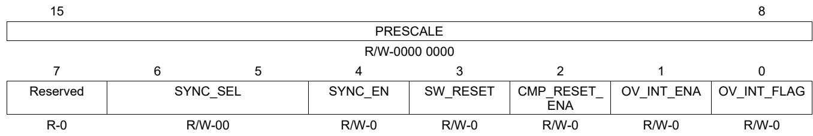

**Table 11-11. PWMx Counter Control Register (T16PWMxCNTCTRL) Register Field Descriptions**

<span id="page-414-2"></span>

| Bit  | Field             | Type | Reset        | Description                                                                                                                                                                                                                                                                                                   |  |
|------|-------------------|------|--------------|---------------------------------------------------------------------------------------------------------------------------------------------------------------------------------------------------------------------------------------------------------------------------------------------------------------|--|
| 15-8 | PRESCALE          | R/W  | 0000<br>0000 | Defines the prescaler value to select the PWM counter resolution. Counter<br>Resolution = (Prescaler + 1) *1/ICLK                                                                                                                                                                                             |  |
| 7    | Reserved          | R    | 0            |                                                                                                                                                                                                                                                                                                               |  |
| 6-5  | SYNC_SEL          | R/W  | 00           | Configures master PWM counter<br>0 = PWM0 Counter (Default)<br>1 = PWM1 Counter<br>2 = PWM2 Counter<br>3 = PWM3 Counter                                                                                                                                                                                       |  |
| 4    | SYNC_EN           | R/W  | 0            | PWM counter starts when master PWM counter is enabled<br>0 = PWM counter independent of other PWM counters (Default)<br>1 = PWM counter controlled by Master PWM counter                                                                                                                                      |  |
| 3    | SW_RESET          | R/W  | 0            | PWM counter reset by software. This bit is cleared after reset and has to be set to<br>run the PWM counter.<br>0 = PWM counter reset and counter stop (Default)<br>1 = PWM counter is running                                                                                                                 |  |
| 2    | CMP_RESET_EN<br>A | R/W  | 0            | Enables PWM counter reset by compare action of T16CMPxDR.<br>0 = Disable PWM counter reset by compare action (Default)<br>1 = Enable PWM counter reset by compare action                                                                                                                                      |  |
| 1    | OV_INT_ENA        | R/W  | 0            | PWM Counter Overflow Interrupt Enable<br>0 = Disable PWM counter overflow interrupt (Default)<br>1 = Enable PWM counter overflow interrupt                                                                                                                                                                    |  |
| 0    | OV_INT_FLAG       | R/W  | 0            | Flag which indicates a PWM counter overflow. This bit is cleared by writing '1' to it. If<br>a clear and an overflow event occur at the same time, the flag will remain high (set<br>has priority versus clear).<br>0 = No PWM counter overflow since last clear<br>1 = PWM counter overflow since last clear |  |


### <span id="page-415-0"></span>*11.21.12 PWMx 16-bit Compare Channel 0-1 Data Register (T16PWMxCMPyDAT)*

Address FFF7FD3C – 16-bit PWM0 Compare Channel 0 Data Register

Address FFF7FD40 – 16-bit PWM0 Compare Channel 1 Data Register

Address FFF7FD60 – 16-bit PWM1 Compare Channel 0 Data Register

Address FFF7FD64 – 16-bit PWM1 Compare Channel 1 Data Register

Address FFF7FD74 – 16-bit PWM2 Compare Channel 0 Data Register

Address FFF7FD78 – 16-bit PWM2 Compare Channel 1 Data Register

Address FFF7FD88 – 16-bit PWM3 Compare Channel 0 Data Register

Address FFF7FD8C – 16-bit PWM3 Compare Channel 1 Data Register

**Figure 11-15. PWMx 16-bit Compare Channel 0-1 Data Register (T16PWMxCMPyDAT)**

<span id="page-415-1"></span>15 0 CMP\_DAT

R/W-0000 0000 0000 0000

**Table 11-12. PWMx 16-bit Compare Channel 0-1 Data Register (T16PWMxCMPyDAT) Register Field Descriptions**

<span id="page-415-2"></span>

| Bit  | Field   | Type | Reset                        | Description                                                                                                                                                                                                                                                                                                                                                                                                                                                                                                       |
|------|---------|------|------------------------------|-------------------------------------------------------------------------------------------------------------------------------------------------------------------------------------------------------------------------------------------------------------------------------------------------------------------------------------------------------------------------------------------------------------------------------------------------------------------------------------------------------------------|
| 15-0 | CMP_DAT | R/W  | 0000<br>0000<br>0000<br>0000 | Contains the 16-bit compare value. When in PWM mode, the value in the<br>T16PWMxCMPyDAT is loaded after a match with the PWMx Counter Data Register.<br>When in OC mode, it has to be written by the CPU. The mode is controlled by the bit<br>SHADOW in the PWMx/Dual Compare Control Register. If both Registers<br>T16PWMxCMP0DAT and T16PWMxCMP1DAT contain the same value, the interrupt<br>and pin behavior is controlled by output compare channel 0 (T16PWMxCMP0DAT<br>has priority over T16PWMxCMP1DAT). |


# <span id="page-416-0"></span>*11.21.13 PWMx Compare Control Register (T16PWMxCMPCTRL)*

Address FFF7FD44 – 16-bit PWM0 Compare Control Register

Address FFF7FD68 – 16-bit PWM1 Compare Control Register

Address FFF7FD7C – 16-bit PWM2 Compare Control Register

Address FFF7FD90 – 16-bit PWM3 Compare Control Register

Note – Bits indicated with a \* are only available for 16 bit timers which have an external pin associated with them. On the UCD3138 and most family members, this is only PWM0 and PWM1. On the UCD3138128 and UCD3138A64 80 pin devices, all 4 timers have an external pin.

**Figure 11-16. PWMx Compare Control Register (T16PWMxCMPCTRL)**

<span id="page-416-1"></span>

| 12    |                     |   | 11                  |          | 10<br>9               |                      | 8                     |  |
|-------|---------------------|---|---------------------|----------|-----------------------|----------------------|-----------------------|--|
|       | SHADOW              |   |                     | *PWM_OUT | *PWM_OUT_ENA          |                      | PWM_OUT_DRV           |  |
| R/W-0 |                     |   | R-0<br>R/W-0        |          | R/W-0                 |                      | R/W-0                 |  |
| 7     | 6                   | 5 | 4                   | 3        | 2                     | 1                    | 0                     |  |
|       | PWM_OUT_<br>ACTION1 |   | PWM_OUT_<br>ACTION0 |          | CMP1_<br>INT_<br>FLAG | CMP0_<br>INT_<br>ENA | CMP0_<br>INT_<br>FLAG |  |
|       | R/W-00              |   | R/W-00<br>R/W-0     |          | R/W-0                 | R/W-0                | R/W-0                 |  |

**Table 11-13. PWMx Compare Control Register (T16PWMxCMPCTRL) Register Field Descriptions**

<span id="page-416-2"></span>

| Bit | Field               | Type | Reset | Description                                                                                                                                                                                                                                                                                                                                                               |
|-----|---------------------|------|-------|---------------------------------------------------------------------------------------------------------------------------------------------------------------------------------------------------------------------------------------------------------------------------------------------------------------------------------------------------------------------------|
| 12  | SHADOW              | R/W  | 0     | Controls the update of the 16-bit output compare Registers.<br>0 = PWM output compare Registers immediately written (Default)<br>1 = PWM output compare Registers updated through the buffers<br>T16PWMxCMPyDAT after a match occurs in the corresponding Register<br>T16PWMxCMPyDAT.                                                                                     |
| 11  | *PWM_IN             | R    | 0     | Input value of PWM pin when configured in PWM mode<br>0 = Logic level low detected on PWM pin<br>1 = Logic level high detected on PWM pin                                                                                                                                                                                                                                 |
| 10  | *PWM_OUT            | R/W  | 0     | Data to be written into the output latch when PWM_OUT_DRV is high.<br>0 = Output latch is cleared when PWM_OUT_DRV=1 (Default)<br>1 = Output latch is set when PWM_OUT_DRV=1                                                                                                                                                                                              |
| 9   | *PWM_OUT_ENA        | R/W  | 0     | FAN-PWM pin configuration<br>0 = FAN-PWM configured as an input pin (Default)<br>1 = FAN-PWM configured as an output pin                                                                                                                                                                                                                                                  |
| 8   | *PWM_OUT_DRV        | R/W  | 0     | Causes the value of the bit PWM_OUT to be written into the output latch. So it is<br>possible to preload the output latch or to use the pin as GPIO. The compare action<br>has priority before the preload function. This bit is always read as '0'.<br>0 = Output latch not affected by the value of PWM_OUT (Default)<br>1 = Value of OUT written into the output latch |
| 7-6 | PWM_OUT_ACTI<br>ON1 | R/W  | 00    | These 2 bits select the output action when a compare equal is detected on<br>T16CMP1DAT<br>00 = No action (Default)<br>01 = Set pin<br>10 = Clear pin<br>11 = Toggle pin                                                                                                                                                                                                  |
| 5-4 | PWM_OUT_ACTI<br>ON0 | R/W  | 00    | Selects the output action when a compare equal is detected on T16CMP0DAT.<br>00 = No action (Default)<br>01 = Set pin<br>10 = Clear pin<br>11 = Toggle pin                                                                                                                                                                                                                |


### **Table 11-13. PWMx Compare Control Register (T16PWMxCMPCTRL) Register Field Descriptions (continued)**

| Bit | Field         | Type | Reset | Description                                                                                                                                                                                                                                                                                                                                       |
|-----|---------------|------|-------|---------------------------------------------------------------------------------------------------------------------------------------------------------------------------------------------------------------------------------------------------------------------------------------------------------------------------------------------------|
| 3   | CMP1_INT_ENA  | R/W  | 0     | Compare 1 Interrupt Enable<br>0 = Disables Compare 1 Interrupt (Default)<br>1 = Enables Compare 1 Interrupt                                                                                                                                                                                                                                       |
| 2   | CMP1_INT_FLAG | R/W  | 0     | Flag which indicates a valid output compare 1 event. This bit is cleared by writing '1'<br>to this bit or by rewriting T16PWMxCMP1DAT. If a clear and a compare event occurs<br>at the same time, the flag will remain high (set has priority versus write clear).<br>0 = No compare event since last clear<br>1 = Compare event since last clear |
| 1   | CMP0_INT_ENA  | R/W  | 0     | Compare 0 Interrupt Enable<br>0 = Disables Compare 0 Interrupt (Default)<br>1 = Enables Compare 0 Interrupt                                                                                                                                                                                                                                       |
| 0   | CMP0_INT_FLAG | R/W  | 0     | Flag which indicates a valid output compare 1 event. This bit is cleared by writing '1'<br>to this bit or by rewriting T16PWMxCMP0DAT. If a clear and a compare event occurs<br>at the same time, the flag will remain high (set has priority versus write clear).<br>0 = No compare event since last clear<br>1 = Compare event since last clear |


# <span id="page-418-0"></span>*11.21.14 Watchdog Status (WDST)*

Address FFF7FD94

### **Figure 11-17. Watchdog Status (WDST)**

<span id="page-418-1"></span>

LEGEND: R/W = Read/Write; R = Read only; -*n* = value after reset

### **Table 11-14. Watchdog Status (WDST) Register Field Descriptions**

<span id="page-418-2"></span>

| Bit | Field       | Type | Reset | Description                                                                                                                                                                                          |
|-----|-------------|------|-------|------------------------------------------------------------------------------------------------------------------------------------------------------------------------------------------------------|
| 3   | WAKE_EV_RAW | R    | 0     | Watchdog Wake Event Raw Status<br>0 = Watchdog Timer has not reached ½ of terminal count<br>1 = Watchdog Timer has reached ½ of terminal count                                                       |
| 2   | WD_EV_RAW   | R    | 0     | Watchdog Event Raw Status<br>0 = Watchdog Timer has not reached terminal count<br>1 = Watchdog Timer has reached terminal count                                                                      |
| 1   | WAKE_EV_INT | R    | 0     | Watchdog Wake Event Interrupt Status, cleared on read of Watchdog Status<br>Register<br>0 = Watchdog Timer has not reached ½ of terminal count<br>1 = Watchdog Timer has reached ½ of terminal count |
| 0   | WD_EV_INT   | R    | 0     | Watchdog Event Interrupt Status, cleared on read of Watchdog Status Register<br>0 = Watchdog Timer has not reached terminal count<br>1 = Watchdog Timer has reached terminal count                   |


# <span id="page-419-0"></span>*11.21.15 Watchdog Control (WDCTRL)*

Address FFF7FD98

### **Figure 11-18. Watchdog Control (WDCTRL)**

<span id="page-419-1"></span>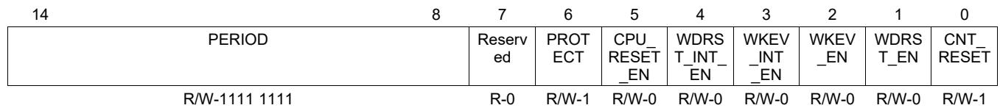

LEGEND: R/W = Read/Write; R = Read only; -*n* = value after reset

### **Table 11-15. Watchdog Control (WDCTRL) Register Field Descriptions**

<span id="page-419-2"></span>

| Bit  | Field        | Type | Reset        | Description                                                                                                                                                                                                                                                                                       |  |  |  |
|------|--------------|------|--------------|---------------------------------------------------------------------------------------------------------------------------------------------------------------------------------------------------------------------------------------------------------------------------------------------------|--|--|--|
| 14-8 | PERIOD       | R/W  | 1111<br>1111 | Configures the time for the watchdog reset.<br>H'7F ~ 2.2s typical (1.85 min to 2.6 max seconds)(Default)<br>H'00 ~ 17mstypical (14.5 min to 20.1 max milliseconds)                                                                                                                               |  |  |  |
| 7    | Reserved     | R    | 0            |                                                                                                                                                                                                                                                                                                   |  |  |  |
| 6    | PROTECT      | R/W  | 1            | Watchdog Protect Bit, Active Low<br>0 = Watchdog enable bits are protected, only can be cleared by POR.<br>CPU_RESET_ENA (Bit 5), WDRST_ENA (Bit 2) and WKEV_ENA (Bit 1) are<br>automatically set high when PROTECT is written low.<br>1 = Watchdog enable bits can be set by processor (Default) |  |  |  |
| 5    | CPU_RESET_EN | R/W  | 0            | Enables Watchdog Reset Event to reset the CPU<br>0 = Watchdog Reset does not reset CPU (Default)<br>1 = Watchdog Reset does resets CPU                                                                                                                                                            |  |  |  |
| 4    | WDRST_INT_EN | R/W  | 0            | Watchdog Reset Event Interrupt Enable<br>0 = Disables generation of Watchdog Reset Interrupt (Default)<br>1 = Enables generation of Watchdog Reset Interrupt                                                                                                                                      |  |  |  |
| 3    | WKEV_INT_EN  | R/W  | 0            | Watchdog Wake Event Interrupt Enable<br>0 = Disables generation of Watchdog Wake Event Interrupt (Default)<br>1 = Enables generation of Watchdog Wake Event Interrupt                                                                                                                             |  |  |  |
| 2    | WKEV_EN      | R/W  | 0            | Watchdog Wake Event Comparator Enable<br>0 = Disables Watchdog Wake Event Comparator (Default)<br>1 = Enables Watchdog Wake Event Comparator                                                                                                                                                      |  |  |  |
| 1    | WDRST_EN     | R/W  | 0            | Watchdog Reset Event Comparator Enable<br>0 = Disables Watchdog Reset Event Comparator (Default)<br>1 = Enables Watchdog Reset Event Comparator                                                                                                                                                   |  |  |  |
| 0    | CNT_RESET    | R/W  | 1            | This bit resets the watchdog counters. This bit self clears and if the enables are set,<br>the counters restart counting.<br>0 = Watchdog counters enabled (Default)<br>1 = Watchdog counters reset                                                                                               |  |  |  |

<span id="page-420-0"></span>

# *UART Overview*

UCD3138 has two UART modules capable of independently communicating toward two separate peers. Having more than one UART module is also especially useful for power supplies than need to communicate with an isolated section (eg. with the digital PFC controller, or a Power Metering ASIC in offline AC/DC power supplies) through opto-isolators.

While one UART module is serving communication needs over an isolation barrier, the other UART may be used for communicating with a HOST or serve debugging needs.

This section provides an overview of these UART modules. Table below contains a brief description of the UART, lists its significant pins and described interrupts.

| The UART module is a universal asynchronous receiver-transmitter that implements the standard<br>Description<br>non-return to zero format. The UART module can be used to communicate, for example, through<br>an RS-232 port or over a K-line. |                                                                                                                                                                                                                                                                                                                                                                                                                                                                                                                                                                                                                                                                                                                                                    |  |  |  |  |
|-------------------------------------------------------------------------------------------------------------------------------------------------------------------------------------------------------------------------------------------------|----------------------------------------------------------------------------------------------------------------------------------------------------------------------------------------------------------------------------------------------------------------------------------------------------------------------------------------------------------------------------------------------------------------------------------------------------------------------------------------------------------------------------------------------------------------------------------------------------------------------------------------------------------------------------------------------------------------------------------------------------|--|--|--|--|
| Pins                                                                                                                                                                                                                                            | SCI_Rx UART receive pin<br>SCI_Tx UART transmit pin                                                                                                                                                                                                                                                                                                                                                                                                                                                                                                                                                                                                                                                                                                |  |  |  |  |
| Interrupts                                                                                                                                                                                                                                      | The UART has three interrupts: transmit, receive, and error. Each interrupt can be individually<br>enabled.                                                                                                                                                                                                                                                                                                                                                                                                                                                                                                                                                                                                                                        |  |  |  |  |
| Features                                                                                                                                                                                                                                        | •<br>Standard universal asynchronous receiver-transmitter (UART) communication<br>•<br>Supports full- or half-duplex operation<br>•<br>Standard nonreturn to zero (NRZ) format<br>•<br>Double-buffered receive and transmit functions<br>•<br>Configurable frame format of 3 to 13 bits per character based on the following:<br>•<br>Data word length programmable from one to eight bits<br>•<br>Parity programmable for zero or one parity bit, odd or even parity<br>•<br>Stop programmable for one or two stop bits<br>•<br>The 24-bit programmable baud rate supports 224 different baud rates provide high accuracy<br>baud rate selection<br>•<br>Four error flags and six status flags provide detailed information regarding UART events |  |  |  |  |

**Topic** ........................................................................................................................... **Page**

| 12.1 | UART Frame Format        | 422 |
|------|--------------------------|-----|
| 12.2 | Asynchronous Timing Mode | 422 |
| 12.3 | UART Interrupts          | 423 |
| 12.4 | Transmit Interrupt       | 424 |
| 12.5 | Receive Interrupt        | 424 |
| 12.6 | Error Interrupts         | 424 |
| 12.7 | UART Registers Reference | 426 |
|      |                          |     |


*UART Frame Format* [www.ti.com](http://www.ti.com)

# <span id="page-421-0"></span>**12.1 UART Frame Format**

The UART uses a programmable frame format. All frames consist of the following:

- One start bit
- One to eight data bits
- Zero or one parity bit
- One or two stop bits

The frame format for both the transmitter and receiver is programmable through the bits in the UARTCTRL0 register. Both receive and transmit data is in non-return to zero (NRZ) format, which means that the transmit and receive lines are at logic high when idle.

Each frame transmission begins with a start bit, in which the transmitter pulls the SCI line low (logic low). Following the start bit, the frame data is sent and received least significant bit first (LSB).

A parity bit is present in every frame when the PARITY ENA bit (UARTCTRL0.5) is set. The value of the parity bit depends on the number of one bits in the frame and whether odd or even parity has been selected via the PARITY bit (UARTCTRL0.6).

All frames include one stop bit, which is always a high level. This high level at the end of each frame is used to indicate the end of a frame to ensure synchronization between communicating devices. Two stop bits are transmitted if the STOP bit (UARTCTRL0.7) is set. The example shown in Figure below uses one stop bit per frame.


**Figure 12-1.**

### <span id="page-421-2"></span><span id="page-421-1"></span>**12.2 Asynchronous Timing Mode**

Asynchronous timing mode is the only mode supported in UCD3138. In the asynchronous timing mode, each bit in a frame has a duration of 8 UART baud clock periods. Each bit therefore consists of 8 samples (one for each clock period).

When the UART is using asynchronous mode, the baud rates of all communicating devices must match as closely as possible. Receive errors result from devices communicating at different baud rates.

With the receiver in the asynchronous timing mode, the UART detects a valid start bit if the first four samples after a falling edge on the SCI\_RX pin are of logic level 0. As soon as a falling edge is detected on SCI\_RX, the UART assumes that a frame is being received and synchronizes itself to the bus.

The UART module has been designed to provide some protection from noise causing unintended start bits or incorrect data. Without protection, a noise spike that brings an idle receive line low may be interpreted as a start bit.

The UART prevents this by requiring a start bit to bring the SCI\_RX line low for at least four contiguous UART baud clock periods. If any of the receive samples during the first four UART baud clock periods is not a logic low, then the UART does not consider this a start bit and considers the receive line idle.

When another falling edge is detected, the UART checks for a valid, noise-free start bit. When a valid start bit is detected, the UART determines the value of each bit by sampling the SCI\_RX line value during the fourth, fifth, and sixth UART baud clock periods. A majority vote of these samples is used to determine the value stored in the UART receiver shift register.

By sampling in the middle of the bit, the UART reduces errors caused by propagation delays and rise and fall times. By taking a majority vote, the UART reduces the likelihood of data corruption caused by data line noise. [Figure](#page-422-1) 12-2 illustrates how the receiver samples a start bit and a data bit in asynchronous timing mode.


[www.ti.com](http://www.ti.com) *UART Interrupts*

- The transmitter transmits each bit for a duration of 8 UART baud clock periods.
- During the first clock period for a bit, the transmitter shifts the value of that bit onto the SCI\_TX pin.
- The transmitter then holds the current bit value on SCI\_TX for 8 UART baud clock periods.

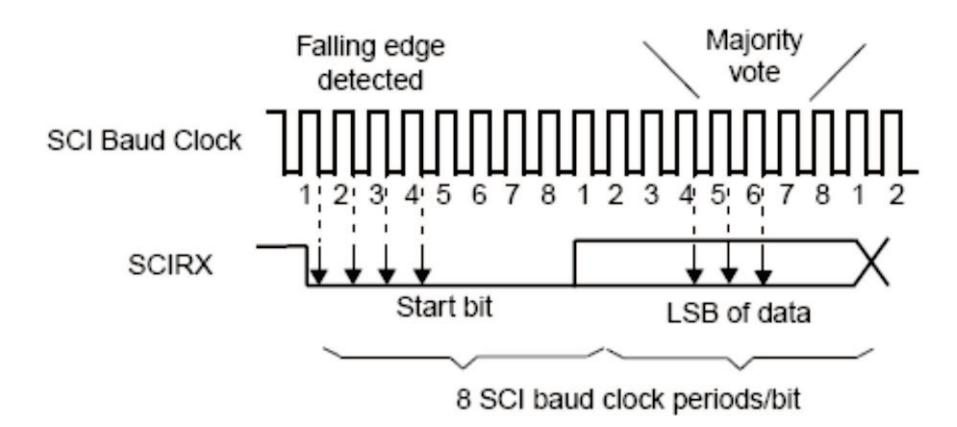

**Figure 12-2.**

### <span id="page-422-1"></span>**Baud rate setting example:**

Baud rate register setting =( F\_iclk / (8 \* Baud rate)) - 1 (6)

<span id="page-422-2"></span>Example: For baud rate of 38400 bps, Baud rate register setting = (15.625 MHz / ( 8 \* 38400)) - 1 = 50

| Desired Baud Rate | UARTHBAUD | UARTMBAUD | UARTLBAUD |
|-------------------|-----------|-----------|-----------|
| 110               | 0         | 69        | 91        |
| 300               | 0         | 25        | 109       |
| 1200              | 0         | 6         | 91        |
| 2400              | 0         | 3         | 45        |
| 4800              | 0         | 1         | 150       |
| 9600              | 0         | 0         | 202       |
| 19200             | 0         | 0         | 101       |
| 38400             | 0         | 0         | 50        |
| 57600             | 0         | 0         | 33        |
| 115200            | 0         | 0         | 16        |
| 230400            | 0         | 0         | 7         |
| 460800            | 0         | 0         | 3         |
| 921600            | 0         | 0         | 1         |

**Table 12-1.**

#### <span id="page-422-0"></span>**12.3 UART Interrupts**

The UART receiver and transmitter can be controlled by interrupts. The receive and transmit interrupts allow efficient operation of the UART by reading and writing character information to and from the UART as new data arrives and when old data has just been sent.

The RXRDY flag (UARTRXST.2) used by the receiver indicates that new data is available to be read.

The receiver also has various error interrupts that indicate when a particular error condition is active. An active error interrupt condition is indicated by the RXERR flag in UARTRXST.

However, the exact source of an error interrupt can be determined by checking the parity error (PE), frame error (FE), overrun error (OE), break-detect (BRKDT), and wake-up (WAKEUP) flags also located in UARTRXST.


*Transmit Interrupt* [www.ti.com](http://www.ti.com)

Additionally, the transmitter uses the TXRDY flag (UARTTXST.2) to indicate that the transmitter is ready for new data to be written that will be sent to the bus.

Transmit, receive, and error interrupts are enabled or disabled through separate interrupt-enable bits. When not enabled, the interrupts are not asserted; however, polled operation of the UART is still possible because the interrupt flags continue to indicate module events.

The UART module generates three interrupt requests to the UCD3138 system module: one each for transmitter, receiver, and error interrupts. Each of these interrupts must also be configured in the UCD3138 system module before operation.

Normally, the error interrupt has the highest priority, the receiver interrupt has the next highest priority, and the transmitter generally has the lowest priority.

This prioritizing scheme reduces the possibility of missed error conditions and receiver overrun. For interrupt priority levels on a specific device, consult the UCD3138 device datasheet.

# <span id="page-423-0"></span>**12.4 Transmit Interrupt**

This section describes how a CPU interrupt can be initiated by a transmit ready condition.

The transmit ready (TXRDY) flag is set when the UART transfers the contents of UARTTXBUF to the shift register, UARTTXSHF. The TXRDY flag indicates that UARTTXBUF is ready to be loaded with more data.

In addition, the UART sets the TX EMPTY bit if both the UARTTXBUF and UARTTXSHF registers are empty.

Transmit interrupts are enabled by the **TX\_INT\_ENA** (UARTCTRL3.3) bit. If the **TX\_INT\_ENA** bit (UARTCTRL3.3) is set, then a transmit interrupt is generated when the TXRDY flag goes high.

Writing data to the UARTTXBUF register clears the TXRDY bit. When this data has been moved to the UARTTXSHF register, the TXRDY bit is set again.

The interrupt request can be suspended by clearing the **TX\_INT\_ENA** bit; however, when the **TX\_INT\_ENA** bit is again set to 1, the TXRDY interrupt is asserted again.

The transmit interrupt request can be eliminated until the next series of values is written to UARTTXBUF by disabling the transmitter via the TXENA bit (UARTTXST.0 = 0), an UART software reset, or by a device hardware reset.

# <span id="page-423-1"></span>**12.5 Receive Interrupt**

The receive ready (RXRDY) flag is set when the UART transfers newly received data from SCIRXSHF to UARTRXBUF

The RXRDY flag therefore indicates that the UART has new data to be read. Receive interrupts are enabled by the RX\_INT\_ENA bit.

If the RX\_INT\_ENA bit (UARTCTRL3.4) is set when the UART sets the RXRDY flag, then a receive interrupt is generated.

### <span id="page-423-2"></span>**12.6 Error Interrupts**

The UCD3138's UART module provides hardware indication of error conditions to provide information about the status of module operation. According to the data being assembled by the receiver, the UART monitors the data received for errors and sets the parity error (PE), framing error (FE), and/or the breakdetect (BRKDT) flag when these conditions are detected.

In addition, the UART sets the overrun error (OE) flag if a transfer of new data from UARTRXSHF to UARTRXBUF overwrites unread data in UARTRXBUF. (If both overrun and parity errors occur, only the overrun error flag is set.)

The UART sets the wake-up flag (WAKEUP) if bus activity on the RX line either prevents power-down mode from being entered, or RX line activity causes an exit from power-down mode. Each of these flags is located in the receiver status (UARTRXST) register.


[www.ti.com](http://www.ti.com) *Error Interrupts*

The RXERR flag, also in the UARTRXST register, is the logical OR of the parity error, framing error, overrun error, wake-up, and break-detect flags.

This UART Data Transfer feature allows software that is polling for receiver errors to check only one bit, which will indicate if any or all of the five error conditions are active.

Error interrupts are controlled by three separate enable bits: RXERR\_INT\_ENA, BRKDT\_INT\_ENA, and WAKEUP\_INT\_ENA.

If RXERR\_INT\_ENA (UARTCTRL3.0) is set, an error interrupt is generated when the receiver detects either a parity, framing, or overrun error. The break-detect interrupt is enabled separately.

If BRKDT\_INT\_ENA (UARTCTRL3.1) is set, an error interrupt is generated if the receiver detects a break condition. A break condition occurs when the SCI\_RX line remains continuously low (active) for at least 10 bits immediately following a missed stop bit.

If WAKEUP\_INT\_ENA (UARTCTRL3.2) is set, an error interrupt is generated when bus activity on the RX line either prevents power-down mode from being entered or RX line activity causes an exit from powerdown mode.


# <span id="page-425-0"></span>**12.7 UART Registers Reference**

### <span id="page-425-1"></span>*12.7.1 UART Control Register 0 (UARTCTRL0)*

Address FFF7D800 – UART 0 Control Register 0 Address FFF7D900 – UART 1 Control Register 0

#### **Figure 12-3. UART Control Register 0 (UARTCTRL0)**

<span id="page-425-2"></span>

| 7     | 6      | 5          | 4         | 3         | 2 |           | 0 |
|-------|--------|------------|-----------|-----------|---|-----------|---|
| STOP  | PARITY | PARITY_ENA | SYNC_MODE | ADDR_MODE |   | DATA_SIZE |   |
| R/W-0 | R/W-0  | R/W-0      | R/W-0     | R/W-0     |   | R/W-000   |   |

LEGEND: R/W = Read/Write; R = Read only; -*n* = value after reset

### **Table 12-2. UART Control Register 0 (UARTCTRL0) Register Field Descriptions**

<span id="page-425-3"></span>

| Bit | Field      | Type | Reset | Description                                                                                                                                                                                                                                |  |
|-----|------------|------|-------|--------------------------------------------------------------------------------------------------------------------------------------------------------------------------------------------------------------------------------------------|--|
| 7   | STOP       | R/W  | 0     | Configures stop bits for each frame<br>0 = One STOP bit included in each frame (Default)<br>1 = Two STOP bits included in each frame                                                                                                       |  |
| 6   | PARITY     | R/W  | 0     | Sets odd or even parity<br>0 = Even parity (Default)<br>1 = Odd parity                                                                                                                                                                     |  |
| 5   | PARITY_ENA | R/W  | 0     | Enables parity transmission<br>0 = No parity bit included in each frame (Default)<br>1 = One parity bit included in each frame                                                                                                             |  |
| 4   | SYNC_MODE  | R/W  | 0     | Selects between Synchronous mode and Asynchronous mode<br>0 = Synchronous (Not supported in UCD3138, set this bit always to one)<br>1 = Asynchronous                                                                                       |  |
| 3   | ADDR_MODE  | R/W  | 0     | Selects between Idle and Address Bit Mode<br>0 = IDLE Line mode with no Address bit (Default)<br>1 = Address Bit mode with one Address bit                                                                                                 |  |
| 2-0 | DATA_SIZE  | R/W  | 000   | Determines the TX and RX byte size<br>000 = 1 bit of data (Default)<br>001 = 2 bit of data<br>010 = 3 bits of data<br>011 = 4 bits of data<br>100 = 5 bits of data<br>101 = 6 bits of data<br>110 = 7 bits of data<br>111 = 8 bits of data |  |


# <span id="page-426-0"></span>*12.7.2 UART Receive Status Register (UARTRXST)*

Address FFF7D804 – UART 0 Receive Status Register Address FFF7D904 – UART 1 Receive Status Register

#### **Figure 12-4. UART Receive Status Register (UARTRXST)**

<span id="page-426-1"></span>

LEGEND: R/W = Read/Write; R = Read only; -*n* = value after reset

# **Table 12-3. UART Receive Status Register (UARTRXST) Register Field Descriptions**

<span id="page-426-2"></span>

| Bit | Field   | Type | Reset | Description                                                                                                                   |
|-----|---------|------|-------|-------------------------------------------------------------------------------------------------------------------------------|
| 4   | RX_IDLE | R    | 0     | RX Idle status bit<br>0 = Not in Rx Idle State<br>1 = Rx Idle detected                                                        |
| 3   | SLEEP   | R/W  | 0     | Sleep Mode Configuration<br>0 = Sleep Mode disabled (Default)<br>1 = Sleep Mode enabled                                       |
| 2   | RX_RDY  | R    | 0     | UART Receiver ready status bit<br>0 = UART Receiver not ready<br>1 = UART Receiver ready                                      |
| 1   | RX_WAKE | R    | 0     | UART Receiver wake status bit<br>0 = UART Receiver has not entered wakeup state<br>1 = UART Receiver has entered wakeup state |
| 0   | RX_ENA  | R/W  | 0     | Turns on UART Receiver<br>0 = UART Receiver disabled (Default)<br>1 = UART Receiver enabled                                   |


# <span id="page-427-0"></span>*12.7.3 UART Transmit Status Register (UARTTXST)*

Address FFF7D808 – UART 0 Transmit Status Register Address FFF7D908 – UART 1 Transmit Status Register

#### **Figure 12-5. UART Transmit Status Register (UARTTXST)**

<span id="page-427-1"></span>

| 7        | 6        | 5        | 4    | 3        | 2      | 1       | 0      |
|----------|----------|----------|------|----------|--------|---------|--------|
| CONTINUE | LOOPBACK | Reserved |      | TX_EMPTY | TX_RDY | TX_WAKE | TX_ENA |
| R/W-0    | R/W-0    |          | R-00 |          | R-0    | R/W-0   | R/W-0  |

LEGEND: R/W = Read/Write; R = Read only; -*n* = value after reset

# **Table 12-4. UART Transmit Status Register (UARTTXST) Register Field Descriptions**

<span id="page-427-2"></span>

| Bit | Field    | Type | Reset | Description                                                                                                                                |
|-----|----------|------|-------|--------------------------------------------------------------------------------------------------------------------------------------------|
| 7   | CONTINUE | R/W  | 0     | Configure operation in suspend mode<br>0 = Stop transmitting on suspend (Default)<br>1 = Continue transmitting after initiation of suspend |
| 6   | LOOPBACK | R/W  | 0     | Loopback Mode Configuration<br>0 = Normal mode (Default)<br>1 = Loopback Mode                                                              |
| 5-4 | Reserved | R    | 00    |                                                                                                                                            |
| 3   | TX_EMPTY | R    | 0     | Transmit buffer status<br>0 = Transmit buffer is not empty<br>1 = Transmit buffer is empty                                                 |
| 2   | TX_RDY   | R    | 0     | Transmitter Ready<br>0 = UART Transmitter is not ready<br>1 = UART Transmitter is ready to transmit data                                   |
| 1   | TX_WAKE  | R/W  | 0     | TX wake control bit<br>0 = UART Transmitter Wakeup disabled (Default)<br>1 = UART Transmitter Wakeup enabled                               |
| 0   | TX_ENA   | R/W  | 0     | Turns on TX module<br>0 = UART Transmitter Disabled (Default)<br>1 = UART Transmitter Enabled                                              |


# <span id="page-428-0"></span>*12.7.4 UART Control Register 3 (UARTCTRL3)*

Address FFF7D80C – UART 0 Control Register 3 Address FFF7D90C – UART 1 Control Register 3

#### **Figure 12-6. UART Control Register 3 (UARTCTRL3)**

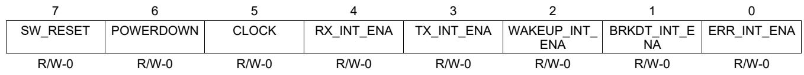

LEGEND: R/W = Read/Write; R = Read only; -*n* = value after reset

### **Table 12-5. UART Control Register 3 (UARTCTRL3) Register Field Descriptions**

<span id="page-428-1"></span>

| Bit | Field              | Type | Reset | Description                                                                                                                                             |  |
|-----|--------------------|------|-------|---------------------------------------------------------------------------------------------------------------------------------------------------------|--|
| 7   | SW_RESET           | R/W  | 0     | Software reset for UART Transmitter/Receiver<br>0 = Disables Software Reset (Default)<br>1 = Enables Software Reset                                     |  |
| 6   | POWERDOWN          | R/W  | 0     | Power-down Transmitter/Receiver Control<br>0 = Disables Power-down mode (Default)<br>1 = Enables Power-down mode                                        |  |
| 5   | CLOCK              | R/W  | 0     | UART Clock Select<br>0 = Selects external clock (Default)<br>1 = Selects internal clock                                                                 |  |
| 4   | RX_INT_ENA         | R/W  | 0     | Enables the interrupts from UART Receiver<br>0 = Disables interrupts from UART Receiver (Default)<br>1 = Enables interrupts from UART Receiver          |  |
| 3   | TX_INT_ENA         | R/W  | 0     | Enables the interrupts from UART Transmitter<br>0 = Disables interrupts from UART Transmitter (Default)<br>1 = Enables interrupts from UART Transmitter |  |
| 2   | WAKEUP_INT_EN<br>A | R/W  | 0     | Enables the wakeup interrupt from UART<br>0 = Disables Wakeup Interrupt (Default)<br>1 = Enables Wakeup Interrupt                                       |  |
| 1   | BRKDT_INT_ENA      | R/W  | 0     | Enables the Broken Circuit interrupt from UART Receiver<br>0 = Disables Broken Circuit Interrupt (Default)<br>1 = Enables Broken Circuit Interrupt      |  |
| 0   | ERR_INT_ENA        | R/W  | 0     | Enables UART Receiver Error Interrupt<br>0 = Disables UART Receiver Error Interrupt (Default)<br>1 = Enables UART Receiver Error Interrupt              |  |


# <span id="page-429-0"></span>*12.7.5 UART Interrupt Status Register (UARTINTST)*

Address FFF7D810 – UART 0 Interrupt Status Register ddress FFF7D910 – UART 1 Interrupt Status Register

#### **Figure 12-7. UART Interrupt Status Register (UARTINTST)**

<span id="page-429-1"></span>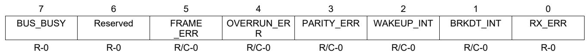

LEGEND: R/W = Read/Write; R = Read only; -*n* = value after reset

R/C- means that bit can be read or cleared; each of the bits except RXERR and BUS BUSY can be cleared by writing a 1 to the bit.

### **Table 12-6. UART Interrupt Status Register (UARTINTST) Register Field Descriptions**

| Bit | Field       | Type | Reset | Description                                                                                                                                                                   |  |
|-----|-------------|------|-------|-------------------------------------------------------------------------------------------------------------------------------------------------------------------------------|--|
| 7   | BUS_BUSY    | R    | 0     | UART Receiver Busy Indicator<br>0 = UART Receiver ready to accept new frame<br>1 = UART Receiver currently processing message                                                 |  |
| 6   | Reserved    | R    | 0     |                                                                                                                                                                               |  |
| 5   | FRAME_ERR   | R/C  | 0     | UART Receiver Framing Error<br>0 = No framing error found within incoming data message<br>1 = Indicates the incoming data message had a framing error                         |  |
| 4   | OVERRUN_ERR | R/C  | 0     | UART Receiver Buffer Overflow<br>0 = No overflow condition found in receive buffer<br>1 = Indicates the receive buffer has overflowed                                         |  |
| 3   | PARITY_ERR  | R/C  | 0     | UART Receiver Parity Error<br>0 = No parity error found on the incoming data message<br>1 = Indicates a parity error found on the incoming data message                       |  |
| 2   | WAKEUP_INT  | R/C  | 0     | UART Receiver Wakeup Interrupt<br>0 = No Wakeup Interrupt received from UART Receiver<br>1 = Wakeup Interrupt received from UART Receiver                                     |  |
| 1   | BRKDT_INT   | R/C  | 0     | UART Receiver Broken Circuit Interrupt<br>0 = No Broken Circuit interrupt received from UART Receiver<br>1 = Indicates a Broken Circuit interrupt received from UART Receiver |  |
| 0   | RX_ERR      | R    | 0     | UART Receiver Error<br>0 = No UART Receiver Errors detected<br>1 = Frame Error or Overrun error or Parity Error or Broken Circuit error received from<br>UART Receiver        |  |


# *12.7.6 UART Baud Divisor High Byte Register (UARTHBAUD)*

Address FFF7D814 – UART 0 Baud Divisor High Byte Register Address FFF7D914 – UART 1 Baud Divisor High Byte Register

# **Figure 12-8. UART Baud Divisor High Byte Register (UARTHBAUD)**

<span id="page-430-0"></span>7 0 BAUD\_DIV\_H

R/W-0000 0000

LEGEND: R/W = Read/Write; R = Read only; -*n* = value after reset

### **Table 12-7. UART Baud Divisor High Byte Register (UARTHBAUD) Register Field Descriptions**

<span id="page-430-1"></span>

| Bit | Field      | Type | Reset        | Description                                         |
|-----|------------|------|--------------|-----------------------------------------------------|
| 7-0 | BAUD_DIV_H | R/W  | 0000<br>0000 | Sets the high byte of the 24 bit baud rate selector |


#### <span id="page-431-0"></span>*12.7.7 UART Baud Divisor Middle Byte Register (UARTMBAUD)*

Address FFF7D818 – UART 0 Baud Divisor Middle Byte Register Address FFF7D918 – UART 1 Baud Divisor Middle Byte Register

#### **Figure 12-9. UART Baud Divisor Middle Byte Register (UARTMBAUD)**

<span id="page-431-1"></span>7 0 BAUD\_DIV\_M

R/W-0000 0000

LEGEND: R/W = Read/Write; R = Read only; -*n* = value after reset

### **Table 12-8. UART Baud Divisor Middle Byte Register (UARTMBAUD) Register Field Descriptions**

<span id="page-431-2"></span>

| Bit | Field      | Type | Reset        | Description                                           |
|-----|------------|------|--------------|-------------------------------------------------------|
| 7-0 | BAUD_DIV_M | R/W  | 0000<br>0000 | Sets the middle byte of the 24 bit baud rate selector |


# <span id="page-432-1"></span>*12.7.8 UART Baud Divisor Low Byte Register (UARTLBAUD)*

Address FFF7D81C – UART 0 Baud Divisor Low Byte Register Address FFF7D91C – UART 1 Baud Divisor Low Byte Register

# **Figure 12-10. UART Baud Divisor Low Byte Register (UARTLBAUD)**

<span id="page-432-0"></span>7 0 BAUD\_DIV\_L

R/W-0000 0000

LEGEND: R/W = Read/Write; R = Read only; -*n* = value after reset

# **Table 12-9. UART Baud Divisor Low Byte Register (UARTLBAUD) Register Field Descriptions**

<span id="page-432-2"></span>

| Bit | Field      | Type | Reset        | Description                                        |
|-----|------------|------|--------------|----------------------------------------------------|
| 7-0 | BAUD_DIV_L | R/W  | 0000<br>0000 | Sets the low byte of the 24 bit baud rate selector |


### <span id="page-433-0"></span>*12.7.9 UART Receive Buffer (UARTRXBUF)*

Address FFF7D824 – UART 0 Receive Buffer Address FFF7D924 – UART 1 Receive Buffer

### **Figure 12-11. UART Receive Buffer (UARTRXBUF)**

<span id="page-433-1"></span>7 0 RXDAT

R-0

LEGEND: R/W = Read/Write; R = Read only; -*n* = value after reset

### **Table 12-10. UART Receive Buffer (UARTRXBUF) Register Field Descriptions**

<span id="page-433-2"></span>

| Bit | Field | Type | Reset | Description                                                 |
|-----|-------|------|-------|-------------------------------------------------------------|
| 7-0 | RXDAT | R    | 0     | Contains the last data byte received from the UART Receiver |


#### <span id="page-434-0"></span>*12.7.10 UART Transmit Buffer (UARTTXBUF)*

Address FFF7D828 – UART 0 Transmit Buffer Address FFF7D928 – UART 1 Transmit Buffer

#### **Figure 12-12. UART Transmit Buffer (UARTTXBUF)**

<span id="page-434-1"></span>7 0 TXDAT

R/W-0000 0000

LEGEND: R/W = Read/Write; R = Read only; -*n* = value after reset

#### **Table 12-11. UART Transmit Buffer (UARTTXBUF) Register Field Descriptions**

<span id="page-434-2"></span>

| Bit | Field | Type | Reset        | Description                                                      |
|-----|-------|------|--------------|------------------------------------------------------------------|
| 7-0 | TXDAT | R/W  | 0000<br>0000 | Contains the data byte to be transmitted by the UART Transmitter |


# <span id="page-435-0"></span>*12.7.11 UART I/O Control Register (UARTIOCTRLSCLK, UARTIOCTRLRX, UARTIOCTRLTX)*

Address FFF7D82C – UART 0 I/O (SCLK) Control Register

Address FFF7D92C – UART 1 I/O (SCLK) Control Register

Address FFF7D830 – UART 0 I/O (RX) Control Register

Address FFF7D930 – UART 1 I/O (RX) Control Register

Address FFF7D834 – UART 0 I/O (TX) Control Register

Address FFF7D934 – UART 1 I/O (TX) Control Register

**Figure 12-13. UART I/O Control Register (UARTIOCTRLSCLK, UARTIOCTRLRX, UARTIOCTRLTX)**

<span id="page-435-1"></span>

| 3       | 2        | 1       | 0      |
|---------|----------|---------|--------|
| DATA_IN | DATA_OUT | IO_FUNC | IO_DIR |
| R-0     | R/W-0    | R/W-0   | R/W-0  |

LEGEND: R/W = Read/Write; R = Read only; -*n* = value after reset

#### **Table 12-12. UART I/O Control Register (UARTIOCTRLSCLK, UARTIOCTRLRX, UARTIOCTRLTX) Register Field Descriptions**

<span id="page-435-2"></span>

| Bit | Field    | Type | Reset | Description                                                                                                                  |
|-----|----------|------|-------|------------------------------------------------------------------------------------------------------------------------------|
| 3   | DATA_IN  | R    | 0     | Data received from pin when configured as GPIO                                                                               |
| 2   | DATA_OUT | R/W  | 0     | Data transmitted to pin when configured as GPIO                                                                              |
| 1   | IO_FUNC  | R/W  | 0     | Selects the function for UART pins<br>0 = GPIO mode (Default)<br>1 = Baud Clock for SCLK, Normal operation for SCI_RX/SCI_TX |
| 0   | IO_DIR   | R/W  | 0     | Pin direction when configured as GPIO<br>0 = Input (Default)<br>1 = Output                                                   |

<span id="page-436-0"></span>

# *Boot ROM and Boot Flash*

The Boot ROM and the Boot Flash are key elements in the use of the UCD3138, which provide capability to examine, and modify memory and registers and download programs into the device. They also offer security for production programs.

#### **CAUTION**

Programming the checksum in the Flash without proper precautions can render the UCD3138 in state where it is not re-programmable any further. To avoid program flash lockout, see [Section](#page-114-1) 3.1.4.

**Topic** ........................................................................................................................... **Page**

| 13.1 | Boot ROM Function                                    | 438 |
|------|------------------------------------------------------|-----|
| 13.2 | Memory Read Functionality                            | 441 |
| 13.3 | Read Version                                         | 442 |
| 13.4 | Memory Write Functionality                           | 443 |
| 13.5 | Flash Functions                                      | 444 |
| 13.6 | Checksum Functions                                   | 447 |
| 13.7 | Trim Flash Checksum Verification                     | 447 |
| 13.8 | Boot ROM for the Other Members of the UCD3138 Family | 448 |
|      |                                                      |     |


*Boot ROM Function* [www.ti.com](http://www.ti.com)

### <span id="page-437-0"></span>**13.1 Boot ROM Function**

The Boot ROM performs several functions:

- initializes the UCD3138
- examines checksums for boot flash and program flash, and automatically executes either if the checksum is valid
- If the checksum is not valid, the Boot ROM will permit examination and modification of memory and peripherals.

# <span id="page-437-1"></span>*13.1.1 Initializing UCD3138*

The Boot ROM performs several initializations on the UCD3138. The most important one is memory map initialization. This is described in [Chapter](#page-184-0) 5 and [Chapter](#page-225-0) 6.

# <span id="page-437-2"></span>*13.1.2 Verifying Checksums*

In the UCD3138, the Boot ROM supports 2 checksums in the 32KB Program Flash:

- Boot Flash Checksum at 0x7fc-0x7ff (2KB)
- Program Flash Checksum at 0x7ffc to 0x7fff (32KB)

If either checksum is valid, the ROM will move the Program Flash to location 0, and jump to that location to start execution of the customer provided program in the Program Flash. The 32K checksum verification takes about 10 milliseconds to complete. The checksum is a simple additive checksum. Each byte in memory is treated as a positive 8 bit number and is added to the checksum. A 4 byte checksum is used, so no truncation occurs. Even if the entire memory is full of 0xff, the checksum value will only be 0x7F7C04. The checksum calculation includes all the bytes in the block except for the last 4, since the expected checksum is located there.

Before verifying the checksums, the Boot ROM first checks to see if there is a 0xEA in the first location. This represents a jump opcode. This is a jump to the start of the program. If there is not an EA, the Boot ROM doesn't check checksums, but goes straight to BOOT ROM communication mode with the PMBus.

This prevents the system from locking up if all of Program Flash is filled with 0.

# <span id="page-437-3"></span>*13.1.3 Uses for 2 Different Checksums*

The Program Flash Checksum at address 0x7FFC is used for cases where field upgradeability of the Program Flash is not desired, or where field upgradeability can be done with simple PMBus interface using the ROM. It is checked after reset to verify that there is a valid program in the flash before flash execution is started.


[www.ti.com](http://www.ti.com) *Boot ROM Function*

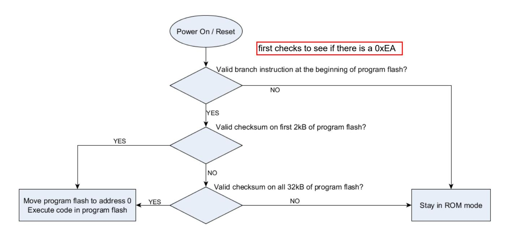

**Figure 13-1. UCD3138 Boot ROM Execution After Power-On/Reset**

<span id="page-438-0"></span>The Boot Flash Checksum at address 0x07FC provides more sophisticated field upgradeability. It is useful for cases which require an upgrade:

- Via PMBus, but at a different PMBus address from the ROM's standard PMBus address
- Via a serial port
- With simple encryption for program security

All of these tasks can actually be accomplished with the Program Flash checksum as well – *so long as the upgrade is not interrupted*. If the upgrade is interrupted before it is complete, the Program Flash checksum will not be correct, and the Boot ROM will not pass control to the Program Flash.

With the Boot ROM, only the first 2K of the program flash must be correct. The customer program in the Boot Flash area has the responsibility for verifying the integrity of the other 30K of the Program Flash, which can contain the operating program for the power supply.

If the upgrade is interrupted, the Boot Flash area will still have a valid checksum, and the Boot Flash program must be written to recover and request a new download.


*Boot ROM Function* [www.ti.com](http://www.ti.com)

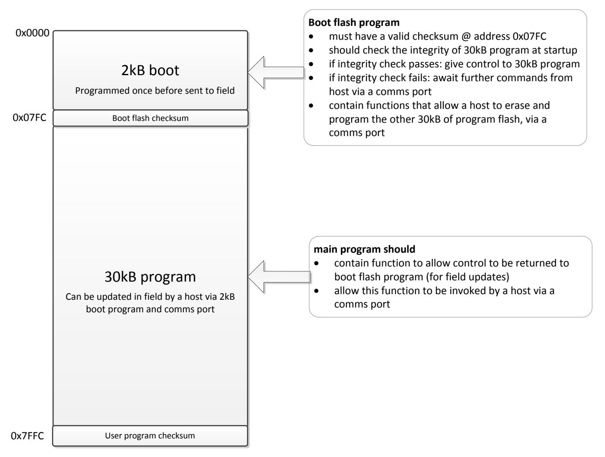

**Figure 13-2. Boot Flash**

Since the Boot Flash program is in Program Flash, the user of the chip is free to program it as desired.

### <span id="page-439-1"></span><span id="page-439-0"></span>*13.1.4 Avoiding Program Flash Lockup*

If either checksum is programmed correctly, the Boot ROM will turn control directly over to the Program Flash. This is necessary for product startup in production units. It also provides security for the program, because the Boot ROM cannot be used to read from the Program Flash.

Even in production programs a "backdoor" is often added to the program to enable clearing the checksum. This permits firmware update. Normally on production programs, clearing of the checksum is protected by a customer defined password. Or instead of clearing the checksum, the entire flash is cleared, preventing a third party from examining the program.

This approach works fine for production, since the backdoor is thoroughly tested before the production program is released.

In development, however, untested programs are often installed into the program flash. If the backdoor is not at the very beginning of the program, a program bug could prevent it from working. So there are 2 options to avoid Program Flash Lockup:

- 1. Include a simple checksum clearing function at the very start of the program
- 2. Don't program the checksum until the backdoor has been tested with this version of the program.

More detailed information is available in [Chapter](#page-517-0) 17.


[www.ti.com](http://www.ti.com) *Boot ROM Function*

# <span id="page-440-1"></span>*13.1.5 Using BOOT ROM PMBus Interface*

If the neither checksum matches, the Boot ROM retains control of the processor. The Boot ROM configures the chip as a PMBus Slave, so the host needs to act as a PMBus Master. The Boot ROM is always at address 11 (0x0B). It provides a set of PMBus commands which can be used to control and program the UCD3138.

These commands are:

| Boot ROM Function          | Command Byte |  |  |  |  |
|----------------------------|--------------|--|--|--|--|
| Configure Read Address     | 0xFD         |  |  |  |  |
| Read 4 Bytes               | 0xFA         |  |  |  |  |
| Read 16 Bytes              | 0xF9         |  |  |  |  |
| Read Next 16 Bytes         | 0xF8         |  |  |  |  |
| Write 4 Bytes              | 0xF5         |  |  |  |  |
| Write 16 Bytes             | 0xF4         |  |  |  |  |
| Write Next 16 Bytes        | 0xF3         |  |  |  |  |
| Mass Erase Flash           | 0xF2         |  |  |  |  |
| Page Erase Flash           | 0xF1         |  |  |  |  |
| Execute from Program Flash | 0xF0         |  |  |  |  |
| Calculate Checksum         | 0xEF         |  |  |  |  |
| Read Checksum              | 0xEE         |  |  |  |  |
| Read Version               | 0xEC         |  |  |  |  |

The read and write message names are selected to avoid confusion with the Write Word and Block Write messages in the PMBus Specification.

# <span id="page-440-2"></span>**13.2 Memory Read Functionality**

A total of 4 PMBus command bytes have been assigned for read functionality in the UCD3138 Boot ROM. 3 of these messages utilize a read format, in which the PMBus Master provides an address and command byte to the UCD3138 and expects read data returned by the slave. These commands make it possible to read from any valid memory location. They can be used to read from peripheral registers as well as from memories.

# <span id="page-440-0"></span>*13.2.1 Configure Read Address*

Since the read commands only provide a command code, it is first necessary to provide an address to read from. The read address is set up through a PMBus Write Block message with a command byte of 0xFD. Starting with the device address of 0xB (with R/W bit set low), the Configure Read Address message contains a command byte of 0xFD, followed by 5 data bytes and a PEC byte. The first data byte represents the block size for a PMBus Block Write message, which will always contain a value of 0x4 for this message type. The remaining bytes represent the read address, starting with the most significant byte in the second data byte and the least significant byte in the fifth data byte. The PEC byte completes the message. The PMBus Master provides all 8 bytes of the message.

Note that the device address occupies bits 7 to 1 of the second byte, and the R/W bit occupies bit 0. So with a device address of 0xB and the R/W bit = 0, the byte value will be 0x16. See Section [10.10.1](#page-381-3) for more details. (0x0B<<1) = 0x16

Also note that in the following illustrations, grey boxes indicate communications from master to slave (UCD) and white boxes communications from UCD to master.

| Start               | Device Address & R/W<br>(0x16) | Command Byte (0xFD) | Block Size (0x04) | Read Address[31:24] |  |
|---------------------|--------------------------------|---------------------|-------------------|---------------------|--|
| Read Address[24:16] | Read Address[15:8]             | Read Address[7:0]   | PEC               | Stop                |  |


# <span id="page-441-1"></span>*13.2.2 Read 4 Bytes*

Boot ROM will interpret the command byte, read a word from the read address and complete the message by sending the 4 data bytes and a PEC.

| Start             |             | Device Address & R/W<br>(0x16) |             | Command Byte (0xFA) |  | Repeated Start |     | Device Address & R/W<br>(0x17) |      |
|-------------------|-------------|--------------------------------|-------------|---------------------|--|----------------|-----|--------------------------------|------|
| Block Size (0x04) | Data[31:24] |                                | Data[23:16] | Data[15:8]          |  | Data[7:0]      | PEC |                                | Stop |

# <span id="page-441-2"></span>*13.2.3 Read 16 Bytes*

The Read 16 Bytes message reads 16 bytes from the address configured as the read address. The master initiates the Read Block message by sending a device address and a command byte of 0xF9. The Boot ROM will interpret the command byte, read 16 bytes starting at the read address and complete the message by sending the 16 data bytes and a calculated PEC byte.

| Start                       |         |  | Device Address & R/W (0x16) | Command Byte (0xF9) |          | Repeated Start |          |
|-----------------------------|---------|--|-----------------------------|---------------------|----------|----------------|----------|
| Device Address & R/W (0x17) |         |  | Block Size (0x10)           | Byte[0]             |          | Byte[1]        |          |
| Byte[2]                     | Byte[3] |  | Byte[4]                     | Byte[5]             | Byte[6]  |                | Byte[7]  |
| Byte[8]<br>Byte[9]          |         |  | Byte[10]                    | Byte[11]            | Byte[12] |                | Byte[13] |
| Byte[14]                    |         |  | Byte[15]                    | PEC                 |          | Stop           |          |

# <span id="page-441-0"></span>*13.2.4 Read Next 16 Bytes*

The Read Next 16 Bytes message reads a block of data (16 bytes) from the previous read address. It is provided so that multiple memory reads do not require multiple Configure Read Address Commands. A Read Next Block message must be preceded by either a Read Block Message or a Read Next Block Message. The read address is initially configured prior to the Read Block message that starts the data transfer. The master initiates the Read Next Block message by sending a device address and a command byte of 0xF8. The Boot ROM will interpret the command byte, read 16 bytes starting at the new read address and complete the message by sending the 16 data bytes and a calculated PEC byte. After this message, the read address is automatically incremented by 16.

| Start                       |         | Device Address & R/W (0x16) |                   | Command Byte (0xF9) |          | Repeated Start |          |
|-----------------------------|---------|-----------------------------|-------------------|---------------------|----------|----------------|----------|
| Device Address & R/W (0x17) |         |                             | Block Size (0x10) | Byte[0]             |          | Byte[1]        |          |
| Byte[2]                     | Byte[3] |                             | Byte[4]           | Byte[5]             | Byte[6]  |                | Byte[7]  |
| Byte[8]                     | Byte[9] |                             | Byte[10]          | Byte[11]            | Byte[12] |                | Byte[13] |
| Byte[14]                    |         |                             | Byte[15]          | PEC                 |          | Stop           |          |

# <span id="page-441-3"></span>**13.3 Read Version**

The Read Version message reads the current ROM version from the Boot ROM. The USB/PMBus adapter initiates the Read Version message by sending a device address and a command byte of 0xEC. The Boot ROM will interpret the command byte and return the block size of 4 bytes, the current version number and the PEC byte for the message. The current version for the version of UCD3138 should be 0x00030002.

| Start                       | Device Address & R/W (0x16) | Command Byte (0xF9) | Repeated Start |  |
|-----------------------------|-----------------------------|---------------------|----------------|--|
| Device Address & R/W (0x17) | Block Size (0x04)           | Version[31:24]      | Version[32:16] |  |
| Version[15:8]               | Version[7:0]                | PEC                 | Stop           |  |


<span id="page-442-3"></span>The ROM version for the other members of the UCD3138 family is shown in [Table](#page-442-3) 13-1.

**Table 13-1. ROM Version for the Other Members of the UCD3138 Family**

| Device                  | ROM Version |  |  |  |
|-------------------------|-------------|--|--|--|
| UCD3138, UCD3138A       | 0x00030002  |  |  |  |
| UCD3138064, UCD3138064A | 0x00040001  |  |  |  |
| UCD3138A64, UCD3138A64A | 0x00060001  |  |  |  |
| UCD3138128, UCD3138128A | 0x00050001  |  |  |  |

# <span id="page-442-0"></span>**13.4 Memory Write Functionality**

A total of 6 PMBus command bytes have been assigned for write functionality in the UCD3138 Boot ROM. Each of these write-based PMBus messages utilizes a write format, in which the PMBus Master provides an address, the command byte and data bytes to the PMBus Slave (UCD3138).

# <span id="page-442-1"></span>*13.4.1 Write 4 Bytes*

The Write 4 Bytes message writes a 32 bit word into a specified address. The Write 4 Bytes message utilizes the PMBus write block message format. The PMBus Master initiates the message by sending the device address, a command byte of 0xF5, a block length of 0x8, the 32-bit write address location, four data bytes and a PEC byte. The Boot ROM interprets the command byte and stores the word at the write address specified by the incoming message.

| Start                | Device Address & R/W<br>(0x16) | Command Byte (0xF5) |  | Block Size (0x08)  | Write Address[31:24] |  |
|----------------------|--------------------------------|---------------------|--|--------------------|----------------------|--|
| Write Address[24:16] |                                | Write Address[15:8] |  | Write Address[7:0] |                      |  |
| Data[23:16]          | Data[15:8]                     | Data[7:0]           |  | PEC                | Stop                 |  |

The Write 4 Bytes message is normally very quick, and no PMBus delay is required. However, the Write 4 Bytes message can be used for writing to data and program flash, simply by writing to the appropriate address. In this case, 50 µsec should be allowed before starting the next message.

# <span id="page-442-2"></span>*13.4.2 Write 16 Bytes*

The Write 16 Bytes message writes a block of 16 data bytes starting at a specified address. The Write 16 Bytes message utilizes the PMBus write block message format. The PMBus Master initiates the message by sending the device address, a command byte of 0xF4, a block length of 0x14, the 32-bit write address location, sixteen data bytes and a PEC byte. The Boot ROM interprets the command byte and stores the data bytes starting at the write address specified by the incoming message.

| Start                | Device Address & R/W<br>(0x16) |                     | Command Byte (0xF4) |                    | Block Size (0x14) |               | Write Address[31:24] |
|----------------------|--------------------------------|---------------------|---------------------|--------------------|-------------------|---------------|----------------------|
| Write Address[24:16] |                                | Write Address[15:8] |                     | Write Address[7:0] |                   | Data Byte[0]  |                      |
| Data Byte[1]         |                                | Data Byte[2]        |                     | Data Byte[3]       |                   | Data Byte[4]  |                      |
| Data Byte[5]         |                                | Data Byte[6]        |                     | Data Byte[7]       |                   | Data Byte[8]  |                      |
| Data Byte[9]         |                                | Data Byte[10]       |                     | Data Byte[11]      |                   | Data Byte[12] |                      |
| Data Byte[13]        | Data Byte[14]                  |                     |                     | Data Byte[15]      | PEC               |               | Stop                 |


The Write 16 Bytes message is normally very quick, and no PMBus delay is required. However, the Write 16 Bytes message can be used for writing to data and program flash, simply by writing to the appropriate address. In this case, 200 µsec should be allowed before starting the next message.

# <span id="page-443-0"></span>*13.4.3 Write Next 16 Bytes*

The Write Next 16 Bytes message writes a block of 16 data bytes starting at the last programmed write address incremented by 16. It is designed to improve efficiency when many sequential blocks are being written. The Write Next 16 Bytes message utilizes the PMBus write block message format. Use of the Write Next 16 Bytes message assumes the write address was set previously with a Write Block message. The PMBus Master initiates the message by sending the device address, a command byte of 0xF3, a block length of 0x10, sixteen data bytes and a PEC byte. The Boot ROM interprets the command byte and stores the data bytes starting at the write address, calculated from the previously set address incremented by 16.

| Start         | Device Address & R/W<br>(0x16) |               | Command Byte (0xF3) |               | Block Size (0x10) |               | Data Byte[0] |  |
|---------------|--------------------------------|---------------|---------------------|---------------|-------------------|---------------|--------------|--|
| Data Byte[1]  |                                | Data Byte[2]  |                     | Data Byte[3]  |                   |               | Data Byte[4] |  |
| Data Byte[5]  |                                | Data Byte[6]  |                     | Data Byte[7]  |                   | Data Byte[8]  |              |  |
| Data Byte[9]  |                                | Data Byte[10] |                     | Data Byte[11] |                   | Data Byte[12] |              |  |
| Data Byte[13] |                                | Data Byte[14] |                     | Data Byte[15] | PEC               |               | Stop         |  |

The Write Next 16 Bytes message is normally very quick, and no PMBus delay is required. However, the Write Next 16 Bytes message can be used for writing to data and program flash, simply by writing to the appropriate address. In this case, 200 µsec should be allowed before starting the next message.

# <span id="page-443-1"></span>**13.5 Flash Functions**

In addition to the ability to read and write internal memory map locations, the UCD3138 Boot ROM supports flash functions. These functions allow the user to perform a mass erase or page erase of either the Program Flash or Data Flash. The Boot ROM also supports a PMBus command byte that initiates execution of code from the Program Flash, starting at address 0.

# <span id="page-443-2"></span>*13.5.1 Mass Erase*

| Start | Device Address &<br>R/W (0x16) | Command Byte<br>(0xF2) | Data Byte (0/1) | PEC | Stop |
|-------|--------------------------------|------------------------|-----------------|-----|------|
|-------|--------------------------------|------------------------|-----------------|-----|------|

The Boot ROM supports the initiation of a mass erase of either the Program or Data Flash through a PMBus message. The PMBus Master initiates a PMBus write byte message to the UCD3138. The master initiates the message by sending the device address, a command byte of 0xF2, a single data byte and the PEC byte. The data byte identifies which flash memory will be mass erased. A value of 0x0 indicates a mass erase of the Data Flash, while a value of 0x1 indicates a mass erase of the Program Flash. Upon receipt of the mass erase message, the Boot ROM sets the appropriate control bit to initiate a mass erase of the flash memory. The flash control logic generates the sequencing of control signals to perform a mass erase operation on the memory. Mass erase takes approximately 20 msec. The PMBus Master should wait at least 20 msec after sending this command before attempting any other PMBus communication. For the other members of the UCD3138 family, the "data byte" parameter can have different values, depending on which program flash block you wish to erase. See [Table](#page-444-1) 13-2 for more details.


www.ti.com Flash Functions

### Table 13-2. Boot ROM Mass Erase Data Byte Parameter Values<sup>(1)</sup>

<span id="page-444-1"></span>

|             |            |                       | Progra                |                       |                       |                              |  |
|-------------|------------|-----------------------|-----------------------|-----------------------|-----------------------|------------------------------|--|
| Device      | Data Flash | 0x00000 to<br>0x07FFF | 0x08000 to<br>0x0FFFF | 0x10000 to<br>0x17FFF | 0x18000 to<br>0x1FFFF | Comment                      |  |
| UCD3138     | 0          | 1                     | N/A                   | N/A                   | N/A                   | 1 × 32k program flash block  |  |
| UCD3138A    | 0          | 1                     | N/A                   | N/A                   | N/A                   | 1 × 32k program flash block  |  |
| UCD3138064  | 0          | 1                     | 2                     | N/A                   | N/A                   | 2 × 32k program flash blocks |  |
| UCD3138064A | 0          | 1                     | 2                     | N/A                   | N/A                   | 2 × 32k program flash blocks |  |
| UCD3138A64  | 0          | 1                     | 2                     | N/A                   | N/A                   | 2 × 32k program flash blocks |  |
| UCD3138A64A | 0          | 1                     | 2                     | N/A                   | N/A                   | 2 × 32k program flash blocks |  |
| UCD3138128  | 0          | 1                     | 2                     | 3                     | 4                     | 4 × 32k program flash blocks |  |
| UCD3138128A | 0          | 1                     | 2                     | 3                     | 4                     | 4 × 32k program flash blocks |  |

<sup>(1)</sup> These numbers also apply to the Flash Select parameter for the Boot ROM page erase command.

# <span id="page-444-0"></span>13.5.2 Page Erase

The Boot ROM supports the initiation of a page erase of either the Program or Data Flash through a PMBus message. The PMBus Master initiates a PMBus write block message to the UCD3138. The master initiates the message by sending the device address, a command byte of 0xF1, a block length of 0x4, four data bytes and a PEC byte. The first data byte selects which flash memory in which the page erase will be performed. The next byte selects the page to be erased. Upon receipt of the page erase message, the Boot ROM sets the appropriate control bits to initiate a page erase on the selected flash memory. The flash control logic generates the sequencing of control signals to perform a page erase operation. Like Mass Erase, the Page Erase command requires 20 milliseconds to complete. No PMBus commands should be sent during this time.

For the other members of the UCD3138 family, the "flash select" parameter can have different values, depending on which program flash block is being acted upon during the page erase. See Table 13-2 for more details.

| Start              |            | Device Address & R/W (0x16) |        | Command Byte (0xF1) |    | Block Length (0x4) |      |
|--------------------|------------|-----------------------------|--------|---------------------|----|--------------------|------|
| Flash Select (0/1) | Page Seled | ct[7:0]                     | Unused | Unused              | PE | EC                 | Stop |


*Flash Functions* [www.ti.com](http://www.ti.com)

# <span id="page-445-0"></span>*13.5.3 Execute Flash*

The Boot ROM supports a function to exit the ROM code and start execution of code from the Program Flash through a PMBus message. The PMBus Master initiates a PMBus Send Byte message to the PMBus slave on the UCD3138. The master starts the message by sending the device address of 0xB, a command byte of 0xF0 and a PEC byte. Upon receipt of the user-defined command byte of 0xF0, the Boot ROM configures the memory selects for program flash operation and resets the program counter to 0. Following reconfiguration of the memory selects, the Program Flash now resides at address location 0 and code is now read from the flash instead of Boot ROM code.

| Start | Device Address & R/W | Command Byte (0xF0) | PEC | Stop |
|-------|----------------------|---------------------|-----|------|
|       |                      |                     |     |      |
|       | (0x16)               |                     |     |      |
|       |                      |                     |     |      |

The Execute Flash command starts execution from Program Flash regardless of the state of the checksums. When the processor starts executing from flash it is in supervisor mode and in ARM mode. Normally the flash program will configure stack pointers and any processor registers in these modes and then switch to Thumb mode and to User mode for efficiency and safety while executing the customer program. See [Section](#page-452-0) 14.1 for more information on processor modes.

For the other members of the UCD3138 family which have more than one block of program flash, there is sometimes a second option to control which program flash block should be mapped to address 0. For this second option, the command byte should be set to 0xF7. See [Table](#page-445-2) 13-3 for more details.

<span id="page-445-2"></span>**Command Byte = 0xF0 Command Byte = 0xF7** UCD3138, UCD3138A pflash: 0x0000 to 0x7FFF not valid UCD3130A64, UCD3138064A pflash block 1: 0x0000 to 0x7FFF pflash block 1: 0x8000 to 0xFFFF pflash block 2: 0x8000 to 0xFFFF pflash block 2: 0x0000 to 0x7FFF UCD3138A64, UCD3138A64A pflash block 0: 0x0000 to 0x7FFF not valid pflash block 1: 0x8000 to 0xFFFF UCD3138128, UCD3138128A pflash block 0: 0x00000 to 0x07FFF pflash block 0: 0x10000 to 0x17FFF pflash block 1: 0x08000 to 0x0FFFF pflash block 1: 0x18000 to 0x17FFF pflash block 2: 0x10000 to 0x17FFF pflash block 2: 0x00000 to 0x07FFF pflash block 3: 0x18000 to 0x17FFF pflash block 3: 0x08000 to 0x0FFFF

**Table 13-3. Boot ROM Execute Flash Command Byte, Valid Values(1)**

# <span id="page-445-1"></span>*13.5.4 Flash Programming Sequence using Boot ROM*

To program the flash, first send the appropriate Mass Erase commands. The Flash values will all become 0xFF. Then send a single Write 16 Bytes command for the start of each block of memory that needs to be written. For the rest of the block, it is more efficient to send Write Next 16 Bytes commands. A system which can translate a UCD3138 object file to PMBus commands is required. The Fusion Design GUI and the UCD3138 Device GUI from Texas Instruments can both perform this download function when used with the USB Interface Adapter and a PC. Production portable programmers will be made available from 3rd parties. Please contact TI for further guidance.

To verify the flash programming, there are three options:

- 1. Read the flash back with a combination of Configure Read Address, Read 16 Bytes, and Read Next 16 Bytes commands
- 2. If the checksum is programmed, simply reset the device and verify that it executes the Flash Memory. This works only for Program Flash. Often the program in flash verifies a checksum for data flash
- 3. Use the checksum functions below to have the device calculate a checksum of the flash and compare it to the expected value.

<sup>(1)</sup> Use the command byte to map different program flash blocks to address 0.


[www.ti.com](http://www.ti.com) *Checksum Functions*

# <span id="page-446-0"></span>**13.6 Checksum Functions**

The UCD3138 Boot ROM supports checksum generation, used primarily to verify programmed flash memories. A PMBus command byte of 0xEF has been assigned for calculation of a checksum, while a command byte of 0xEE is utilized for reading the previously calculated checksum.

# <span id="page-446-1"></span>*13.6.1 Calculation of Checksum*

The Boot ROM supports a function to calculate a checksum over a portion of the address space. The PMBus Master initiates a PMBus write block message to initiate a checksum calculation within the UCD3138. The PMBus master sends the device address, a command byte of 0xEF, the starting address of the checksum calculation, the number of bytes to process and a PEC byte. Upon detection of the command byte 0xEF, the Boot ROM reads the block of memory space and calculates a checksum. This process requires less than 20 milliseconds for a 32K memory space.

| Start                | Device Address & R/W<br>(0x16) |  | Command Byte (0xEF) |  | Block Size (0x08)  |  | Start Address[31:24] |
|----------------------|--------------------------------|--|---------------------|--|--------------------|--|----------------------|
| Start Address[23:16] | Start Address[15:8]            |  |                     |  | Start Address[7:0] |  | Byte Count[31:24]    |
| Byte Count[23:16]    | Byte Count[15:8]               |  | Byte Count[7:0]     |  | PEC                |  | Stop                 |

# <span id="page-446-2"></span>*13.6.2 Reading Checksum*

The Boot ROM supports a function to read a previously calculated checksum over a portion of the address space. The USB/PMBus adapter initiates a PMBus read block message to read a checksum calculation within the UCD3138. The PMBus master sends the device address, a command byte of 0xEE. The UCD3138 returns the four checksum bytes and a PEC byte. Upon detection of the command byte 0xEE, the Boot ROM reads the calculated checksum and returns to the PMBus master.

| Start           | Device Address & R/W<br>(0x16) | Command Byte (0xEE) | Block Size (0x04) | Checksum[31:24] |
|-----------------|--------------------------------|---------------------|-------------------|-----------------|
| Checksum[23:16] | Checksum[15:8]                 | Checksum[7:0]       | PEC               | Stop            |

# **13.7 Trim Flash Checksum Verification**

The Boot ROM also initializes several trim registers in the UCD3138. This trim data comes from a special trim flash area. The trim data is programmed into the trim flash when the device is tested. This trim flash has its own checksum. It is very unlikely, but if the checksum is invalid, the Boot ROM will not write any trim data to the registers. In this case, the device will not perform to specification. The Boot ROM provides two forms of notification if the trim flash checksum is invalid:

- 1. In ROM mode, there will be a 1 at RAM location 0x19018. It is a 4 bit word, so a Read Word for that address will return the value
- 2. In Flash mode, there will be a 0x7e written to the slave address bitfield for master mode in the PMBUS registers. If the trim is valid, it will be a 0x7f.

The code below can be used in the flash code to detect if the trim flash is valid:

```
if(PMBusRegs.PMBCTRL1.bit.SLAVE_ADDR == 0x7f)
{
    //here if trim is valid.
```

This way the power supply can start running if the trim is valid. If the trim is invalid, the power supply should not be started, as the device will not be in specification. If there is host communication, the host can be notified appropriately. The PMBus should still be functional. Note that one of the trim values is for the PMBus bias to the ADC pins, so resistor based PMBus addressing using internal pull ups on ADC 0 and 1 may not give the proper address.


# <span id="page-447-0"></span>**13.8 Boot ROM for the Other Members of the UCD3138 Family**

# <span id="page-447-1"></span>*13.8.1 UCD3138064 and UCD3138064A*

The ROM program changed for the UCD3138064. Instead of 2 checksums on the UCD3138, there are now 4 locations for checksums on the UCD3138064, and one of these checksums double-jobs to cover two possible program code spaces. The checksums and their locations are:

**Table 13-4. Checksums Used By UCD3138064 Boot ROM Program**

<span id="page-447-3"></span>

| Checksum Location | Purpose                                            |  |
|-------------------|----------------------------------------------------|--|
| 0x07FC            | Checksum for 2kB boot in program flash 1           |  |
| 0x7FFC            | Checksum for 32kB program in program flash 1       |  |
| 0x87FC            | Checksum for 2kB boot in program flash 2           |  |
|                   | Checksum for 32kB program in program flash 2 or    |  |
| 0xFFFC            | Checksum for 64kB program in program flash 1 and 2 |  |

The checksum locations in [Table](#page-447-3) 13-4 assume that program flash block 1 is mapped to address 0x0000, and program flash block 2 is mapped to 0x8000.

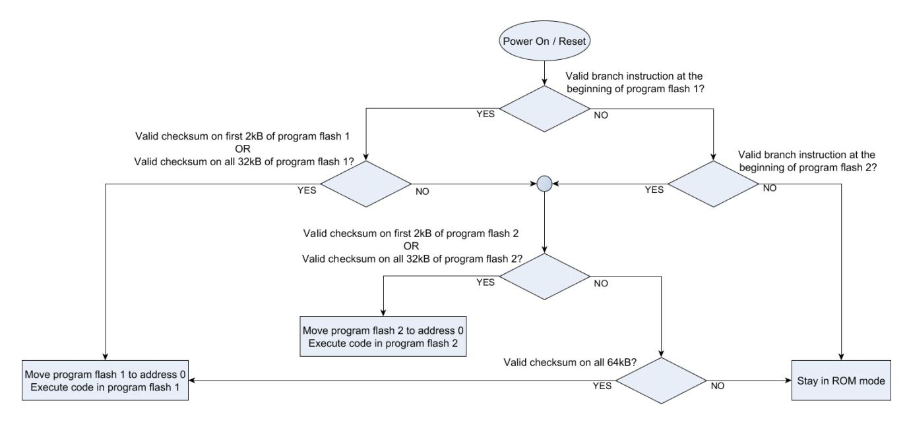

**Figure 13-3. UCD3138064 Boot ROM Execution After Power-on/Reset**

<span id="page-447-2"></span>[Figure](#page-447-2) 13-3 is a flowchart showing the order in which the ROM verifies the integrity of the program flash contents using the different checksums. The branch instruction check at the very beginning prevents the Boot ROM checksum test checking the integrity of an empty block of program flash (as if the program flash was filled with 0x00, then the checksum test would pass).

If program flash block 1 is mapped to address 0x0000, program flash block 2 is mapped to address 0x8000, and vice-versa.

The UCD3138 has a PMBus command called "execute flash" with a command code of 0xF0. This causes the program to execute. On the UCD3138064, the same command code causes program flash block 1 to be placed in control. A new command code of 0xF7 has been added for the UCD3138064, which maps program flash block 2 to address 0x0000 and starts executing from there. See section 14.5.3 for more details on the "execute flash" command.


### <span id="page-448-0"></span>*13.8.2 UCD3138A64 and UCD3138A64A*

On the UCD3138 and UCD3138064, the checksum for an area of program flash is calculated as the sum of bytes over the program flash area.

For example, to calculate the checksum from *start\_address* to *end\_address*, the Boot ROM program on the UCD3138 and UCD3138064 executes something like the following code:

```
Uint32 calculate_checksum(register Uint32 start_address, register Uint32 end_address)
{
    Uint32 checksum = 0;
    Uint8 *addr;
    for(addr=(Uint8 *)start_address; (Uint32)addr < end_address; addr++)
    {
         checksum = checksum + (*addr); // read byte data from flash
    }
    return checksum;
}
```

For the UCD3138A64 and UCD3138128 (and A versions), the checksum is calculated as the sum of 32-bit words in the program flash area covered by the checksum, rather than the sum of 8-bit bytes. This makes the checksum calculation approximately 4 times faster. It means that the Boot ROM program can verify the checksum for 64kB in around 5ms, while the UCD3138 Boot ROM program takes 10ms to verify 32kB of program flash. Here is the code for calculating the checksum.

```
void calculate_checksum(register Uint32 *start_address, register Uint32 *end_address)
{
    //use local register variable for speed.
    register unsigned long long lcs = long_checksum;
    while(start_address < end_address)
    {
         lcs = lcs + *start_address ;
         lcs = lcs + (Uint32)*(start_address + 1) ;
         start_address = start_address + 2;
    }
    long_checksum = lcs;
}
```

Two words are added each pass through the loop to increase the execution speed even further.

The checksums for the UCD3138A64 and UCD3138128 are now 8 bytes in length (versus 4 bytes for the UCD3138 and UCD3138064).

<span id="page-448-1"></span>The checksums and their locations are shown in [Table](#page-448-1) 13-5.

**Table 13-5. Checksums Used by UCD3138A64 Boot ROM Program**

| Checksum Location | Purpose                                            |  |  |
|-------------------|----------------------------------------------------|--|--|
| 0x07F8            | Checksum for 2kB boot in program flash 0           |  |  |
| 0x7FF8            | Checksum for 32kB program in program flash 0       |  |  |
| 0xFFF8            | Checksum for 64kB program in program flash 0 and 1 |  |  |


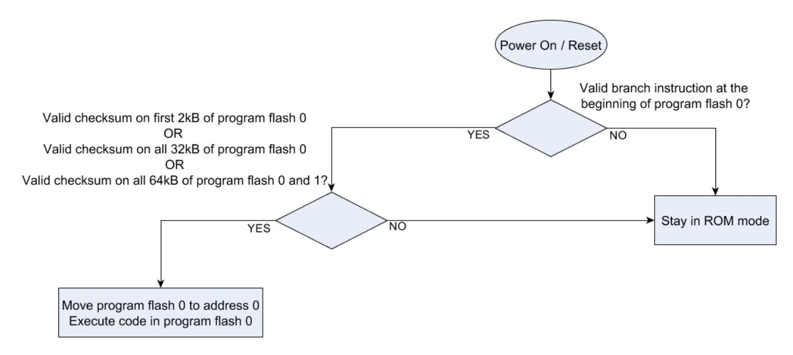

**Figure 13-4. UCD3138A64 Boot ROM Execution After Power-on/Reset**

<span id="page-449-1"></span>[Figure](#page-449-1) 13-4 is a flowchart showing the order in which the ROM verifies the integrity of the program flash contents using the different checksums.

The branch instruction check at the beginning prevents the checksum program from trying to verify the integrity of an empty block of memory. Otherwise a block filled with zeroes would pass the checksum test.

The UCD3138A64 doesn't have ROM support for putting 2 separate programs into flash, one in each flash block. This can still be done, however, using a boot flash program. Or the program in block 0 can be a fixed program, which checks the program in block 1 and jumps to it if appropriate.

### <span id="page-449-0"></span>*13.8.3 UCD3138128 and UCD3138128A*

The UCD3138128 uses checksums to verify the integrity of the first 2kB, 32kB and 64kB of program flash just like the UCD3138A64. It also has checksums to verify the second 64kB and for the full 128kB of program flash. This provides Boot ROM support for 2 independent versions of the firmware in a single device. The checksums and their locations are shown in [Table](#page-449-2) 13-6.

**Table 13-6. Checksums Used by UCD3138128 Boot ROM Program**

<span id="page-449-2"></span>

| Checksum Location | Purpose                                                   |  |  |
|-------------------|-----------------------------------------------------------|--|--|
| 0x007F8           | Checksum for 2kB boot in program flash 0                  |  |  |
| 0x07FF8           | Checksum for 32kB program in program flash 0              |  |  |
| 0x0FFF8           | Checksum for 64kB program in program flash 0 and 1        |  |  |
|                   | Checksum for 64kB program in program flash 2 and 3 or     |  |  |
| 0x1FFF8           | Checksum for 128kB program in program flash 0, 1, 2 and 3 |  |  |


The locations above assume that Block 0 is mapped to address 0x0000, Block 1 is mapped to address 0x8000, Block 2 is mapped to address 0x10000, and Block 3 is mapped to 0x18000.

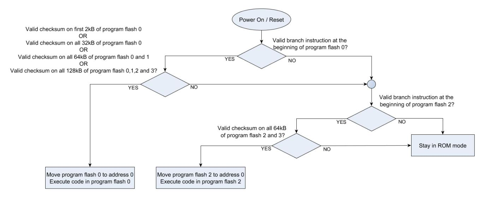

**Figure 13-5. UCD3138128 Boot ROM Execution After Power-on/Reset**

<span id="page-450-0"></span>[Figure](#page-450-0) 13-5 is a flowchart showing the order in which the ROM verifies the integrity of the different areas of program flash using the checksums. The branch instruction check at the beginning prevents the Boot ROM checksum program from checking the integrity of an empty block of memory. Otherwise a block filled with zeroes would pass the checksum test.

The UCD3138 has a PMBus command called "execute flash" with a command code of 0xF0. This causes the program to execute. On the UCD3138128, the same command code cause:

- program flash block 0 to be mapped to address 0x00000
- program flash block 1 to be mapped to address 0x08000
- program flash block 2 to be mapped to address 0x10000
- program flash block 3 to be mapped to address 0x18000

The code then starts executing from the start of program flash block 1 (at address 0).

Setting the command code to 0xF7 causes:

- program flash block 2 to be mapped to address 0x00000
- program flash block 3 to be mapped to address 0x08000
- program flash block 1 to be mapped to address 0x10000
- program flash block 2 to be mapped to address 0x18000

The code then starts executing from the start of program flash block 2 (at address 0). See [Section](#page-445-0) 13.5.3 for more details on the "execute flash" command.

<span id="page-451-0"></span>

# *ARM7TDMI-S MPUSS*

The ARM7TDMI-**S** processor is a **S**ynthesizable member of the ARM7**TDMI** (ARM7- **T**humb+**D**ebug+**M**ultiplier+**I**CE) family of general purpose 32 bit microprocessors. The ARM7TDMI-S processor is of Von-Neumann architecture and is based on RISC (Reduced Instruction Set Computer) principles where two instruction sets are available: the 32-bit ARM instruction set and the 16-bit Thumb instruction set. The Thumb instruction allows for higher code density equivalent to a 16-bit microprocessor, with the performance of the 32-bit microprocessor.

The three staged pipelined ARM processor is architected with fetch, decode and execute stages. Major blocks in the ARM processor include a 32 bit ALU, a 32x8 multiplier, and a barrel shifter. A JTAG port is also available for firmware debugging.

**Topic** ........................................................................................................................... **Page**

| 14.1 | ARM7TDMI-S Modes of Operation | 453 |
|------|-------------------------------|-----|
| 14.2 | Hardware Interrupts           | 455 |
| 14.3 | Software Interrupt            | 456 |
| 14.4 | ARM7TDMI-S Instruction Set    | 457 |
| 14.5 | Dual-State Interworking       | 457 |


# <span id="page-452-0"></span>**14.1 ARM7TDMI-S Modes of Operation**

The ARM processor has seven *processor operating modes*, as shown in [Table](#page-452-1) 14-1. Each operating mode is used for a particular purpose; only one mode is in use at any one time:

**Table 14-1. ARM Processor Operating Modes**

<span id="page-452-1"></span>

| Mode                     | Privileged | Purpose                                                                           |
|--------------------------|------------|-----------------------------------------------------------------------------------|
| User                     | No         | The common mode for running most routines                                         |
| Fast Interrupt (FIQ)     | Yes        | The mode for executing time critical tasks                                        |
| Standard Interrupt (IRQ) | Yes        | The mode for executing time sensitive tasks                                       |
| System                   | Yes        | Privileged, using same User mode registers                                        |
| Supervisor               | Yes        | The mode after a reset, and the mode for execution of software<br>interrupt (SWI) |
| Abort                    | Yes        | The mode for memory access violation exception                                    |
| Undefined                | Yes        | The mode for undefined instruction exception                                      |

Among other things, the operating modes shown in [Table](#page-452-1) 14-1 define the registers that can be used (also called the *register map*) and the operating *privilege level*.

The ARM processor has a simple privilege model: all modes are privileged apart from User mode. *Privilege* is the ability to perform certain tasks that cannot be done from User mode. For example, changing the operating mode is a privileged operation.

The ARM processor has a total of 37 registers: 31 general-purpose registers (including the Program Counter R15) and 6 status registers. These registers are shown in [Table](#page-452-2) 14-2.

**Table 14-2. General-Purpose Registers and Program Counter**

<span id="page-452-2"></span>

| User     | System                                                                                                                                            | Fast Interrupt | Interrupt | Supervisor | Abort    | Undefined |  |
|----------|---------------------------------------------------------------------------------------------------------------------------------------------------|----------------|-----------|------------|----------|-----------|--|
| R0       | R0                                                                                                                                                | R0             | R0        | R0         | R0       | R0        |  |
| R1       | R1                                                                                                                                                | R1             | R1        | R1         | R1       | R1        |  |
| R2       | R2                                                                                                                                                | R2             | R2        | R2         | R2       | R2        |  |
| R3       | R3                                                                                                                                                | R3             | R3        | R3         | R3       | R3        |  |
| R4       | R4                                                                                                                                                | R4             | R4        | R4         | R4       | R4        |  |
| R5       | R5                                                                                                                                                | R5             | R5        | R5         | R5       | R5        |  |
| R6       | R6                                                                                                                                                | R6             | R6        | R6         | R6       | R6        |  |
| R7       | R7                                                                                                                                                | R7             | R7        | R7         | R7       | R7        |  |
| R8       | R8                                                                                                                                                | R8_fiq         | R8        | R8         | R8       | R8        |  |
| R9       | R9                                                                                                                                                | R9_fiq         | R9        | R9         | R9       | R9        |  |
| R10      | R10                                                                                                                                               | R10_fiq        | R10       | R10        | R10      | R10       |  |
| R11      | R11                                                                                                                                               | R11_fiq        | R11       | R11        | R11      | R11       |  |
| R12      | R12                                                                                                                                               | R12_fiq        | R12       | R12        | R12      | R12       |  |
| R13 (SP) | R13 (SP)                                                                                                                                          | R13_fiq        | R13_irq   | R13_svc    | R13_abt  | R13_und   |  |
| R14 (LR) | R14 (LR)                                                                                                                                          | R14_fiq        | R14_irq   | R14_svc    | R14_abt  | R14_und   |  |
| R15 (PC) | R15 (PC)                                                                                                                                          | R15 (PC)       | R15 (PC)  | R15 (PC)   | R15 (PC) | R15 (PC)  |  |
|          | Program Status Registers                                                                                                                          |                |           |            |          |           |  |
| CPSR     | CPSR                                                                                                                                              | CPSR           | CPSR      | CPSR       | CPSR     | CPSR      |  |
|          |                                                                                                                                                   | SPSR_fiq       | SPSR_irq  | SPSR_svc   | SPSR_abt | SPSR_und  |  |
| Register | Indicates that the normal register used by User or System mode has been replaced by an alternative register<br>specific to the mode of operation. |                |           |            |          |           |  |


As shown in [Table](#page-452-2) 14-2, each processor mode has its own R13 and R14 registers. This allows each mode to maintain its own stack pointer and return address. In addition, the Fast Interrupt (FIQ) mode has additional registers: R8–R12. This means that when the ARM processor switches into FIQ mode, the software does not need to save the normal R8–R12 registers, as FIQ mode has its own set that can be modified.

The Current Program Status Register (CPSR) is used to store condition code flags, interrupt disable bits, the current processor mode and other status and control information. This register is depicted in [Table](#page-453-0) 14- [3:](#page-453-0)

**Table 14-3. Current Program Status Register**

<span id="page-453-0"></span>

| 31 | 30        | 29 | 28 | 27 |    |           | 24 | 23 |   |   |   |           |      |   | 16 |
|----|-----------|----|----|----|----|-----------|----|----|---|---|---|-----------|------|---|----|
| N  | Z         | C  | V  |    |    | Undefined |    |    |   |   |   | Undefined |      |   |    |
| 15 | 14        | 13 | 12 | 11 | 10 | 9         | 8  | 7  | 6 | 5 | 4 | 3         | 2    | 1 | 0  |
|    | Undefined |    |    |    |    |           |    | I  | F | T |   |           | Mode |   |    |

The Current Program Status Register is defined in the following way:

- Bits 24–31 can be modified in any mode, and are used to store the condition code flags. Only four *condition code flags* are available: N for Negative, Z for Zero, C for Carry and V for Overflow; the other bits are undefined. The condition code flags are set or cleared as a by-product of certain arithmetic instructions. For example, "cmp r0,r1" sets the Z (Zero) flag if R0 and R1 are equal.
- Bits 6 and 7 (F and I respectively) are the *interrupt disable* bits: setting one of these bits to 1 disables that interrupt; bit 6 disables the Fast Interrupt (FIQ), bit 7 disables the normal Interrupt (IRQ). These bits can only be modified in a privileged mode.
- Bit 5 (the T bit) determines whether the processor runs in ARM state or in Thumb state. Thumb state uses a different, more compact, instruction set when compared to ARM. Never set this bit; Doing so will make the processor enter an unpredictable state. This bit can only be modified in a privileged mode.
- Bits 0–4 set the processor mode; [Table](#page-452-2) 14-2 shows the individual bit patterns needed to use a particular mode. These bits can only be modified in a privileged mode.
- Bits 8–27 are undefined and reserved for future or more advanced ARM processors. Never alter the contents of these bits; instead, use a read-modify-write cycle to preserve them. These bits can only be modified in a privileged mode.

As mentioned above, bits 24–31, the condition code flags, can be modified in any mode. Bits 0–23 can only be modified in a *privileged* mode (i.e., any mode other than User mode). [Table](#page-452-2) 14-2 shows the individual bit patterns needed in bits 0–4 to use a particular mode:

**Table 14-4. Bit Patterns in Different ARM Processor Operating Modes**

<span id="page-453-1"></span>

|             | Mode Bit |                               |                                                 |  |  |
|-------------|----------|-------------------------------|-------------------------------------------------|--|--|
| Bin<br>Hex  |          | Processor Mode (Abbreviation) | Accesible Registers                             |  |  |
| 10000       | 10       | User (usr)                    | PC, R14-R0, CPSR                                |  |  |
| 10001<br>11 |          | Fast Interrupt (fiq)          | PC, R14_fiq-R8_fiq, R7-R0, CPSR,<br>SPSR_fiq    |  |  |
| 10010<br>12 |          | Interrupt (irc)               | PC, R14_irq, R13_irq, R12-R0, CPSR,<br>SPSR_irq |  |  |
| 10011<br>13 |          | Supervison (svc)              | PC, R14_svc, R13_svc, R12-R0, CPSR,<br>SPSR_svc |  |  |
| 10111       | 17       | Abort (abt)                   | PC, R14_abt, R13_abt, R12-R0, CPSR,<br>SPSR_abt |  |  |
| 11011       | 1B       | Undefined (und)               | PC, R14_und, R13_und, R12-R0, CPSR,<br>SPSR_und |  |  |
| 11111       | 1F       | System (sys)                  | PC, R14-R0, CPSR                                |  |  |

It is worth noting that the five Saved Program Status Registers (SPSRs) have the same format as the Current Program Status Register. These registers save the contents of CPSR when an exception occurs.


# <span id="page-454-0"></span>*14.1.1 Exceptions*

During the ordinary flow of execution in a user program, the Program Counter usually increases sequentially through the address space, with perhaps a branch here or there to nearby labels, or with branch-and-links to subroutines and functions.

An *exception* causes this normal flow of execution to be diverted. Exceptions are generated by sources internal or external to the processor. This allows the processor to handle events generated by these sources. Such events include:

- interrupts generated by some peripheral device
- an attempt to execute an undefined or unimplemented instruction
- a software-generated interrupt, via the swi instruction

The ARM processor supports seven types of exceptions. These are listed in [Table](#page-454-3) 14-5, along with the processor mode that is used to handle it. When an exception occurs, the processor branches to a fixed address that corresponds to that exception. This fixed address, called the *exception vector address*, is located in the bottom 32 bytes of the memory map. These 32 bytes are called the *exception vector table.*

Note, from [Table](#page-454-3) 14-5, that there is just enough room at each vector address for one instruction (4 bytes). This is usually initialized to be a branch instruction or something like "ldr pc, [pc, #24]".

<span id="page-454-3"></span>

| Exception Type                                  | Processor Mode       | Vector Address |  |  |
|-------------------------------------------------|----------------------|----------------|--|--|
| Reset                                           | Supervisor           | 0x0000000      |  |  |
| Undefined Instructions                          | Undefined            | 0x0000004      |  |  |
| Software Interrupt (swi)                        | Supervisor           | 0x0000008      |  |  |
| Prefetch Abort (instruction fetch memory abort) | Abort                | 0x000000C      |  |  |
| Data Abort (data access memory abort)           | Abort                | 0x0000010      |  |  |
| Interrupt (IRQ)                                 | Interrupt (IRQ)      | 0x0000018      |  |  |
| Fast Interrupt (FIQ)                            | Fast Interrupt (FIQ) | 0x000001C      |  |  |

**Table 14-5. ARM Processor Exceptions**

### <span id="page-454-1"></span>**14.2 Hardware Interrupts**

The ARM processor has only two hardware interrupt vectors, the IRQ and the FIQ.

- IRQs are normally assigned to general purpose interrupts like periodic timers
- FIQ is reserved for one single interrupt source that requires fast response time, like faults or any time critical task that requires fast response

Therefore all interrupt sources in UCD3138 peripherals can be mapped into one of the following interrupt service routines.

# <span id="page-454-2"></span>*14.2.1 Standard Interrupt (IRQ)*

IRQ is the standard interrupt routine, and usually will be assigned to perform the time sensitive (but not time critical) and periodic tasks of the program.

- Time sensitive means that the assigned task needs to be done within certain fixed and pre-determined time period.
- Time critical means that the assigned task needs to be performed immediately or within a very tight time period.


*Hardware Interrupts* [www.ti.com](http://www.ti.com)

### <span id="page-455-0"></span>*14.2.2 Fast Interrupt (FIQ)*

FIQ is similar to IRQ. The following are a few differences that may make FIQ faster:

- FIQ has higher priority than IRQ, therefore IRQ execution can be interrupted by FIQ, but FIQ execution can not be interrupted by IRQ
- FIQ mode provides additional banked registers R8 to R14 that may be utilized to reduce the interrupt response tim

Note that FIQ holds the last interrupt vector ([Table](#page-454-3) 14-5). So the FIQ service routine can be placed immediately after the interrupt vector table, thus saving a branch instruction execution time.

# <span id="page-455-1"></span>**14.3 Software Interrupt**

Software interrupt is not an interrupt in the regular sense of a software routine that is getting called by an external event. Software interrupt is initiated by the sequential execution of the software and by calling a specific function. The call to a software interrupt function looks identical to a call to any other standard function.

Declaration of a new function and its mapping to software interrupt is done through aliasing pragma.

```
#pragma SWI_ALIAS (erase_data_flash_segment, 0)
void erase_data_flash_segment(Uint8 segment);
```

The major functional difference between the two is that during a call to the software interrupt function the ARM7 will switch to a privileged mode.

In this privileged mode the software will be able to enable/disable interrupts, manipulate Program and Data flash content and more. None of these are accessible when ARM7 is in User mode.

Then the implementation of the function should be added in the relevant case inside the switch/case expression in the body of software interrupt.

```
#pragma INTERRUPT(software_interrupt,SWI)
void software_interrupt(Uint32 arg1, Uint32 arg2, Uint32 arg3, Uint8 swi_number)
{ switch (swi_number)
    {
        case 0:
        {
            // Erase one segment of Data Flash
            return;
        }
        case 1:
        {
        }
            return;
    }
}
```


### <span id="page-456-0"></span>**14.4 ARM7TDMI-S Instruction Set**

The ARM7TDMI-S processor has two instruction sets:

- The 32-bit ARM instruction set (ARM instruction set)
- The 16-bit Thumb instruction set (THUMB instruction set)

The ARM7TDMI-S processor is an implementation of the ARM architecture v4T.

# <span id="page-456-1"></span>*14.4.1 Instruction Compression*

Microprocessor architectures have traditionally had the same width for instructions and data. Therefore, 32-bit architectures had higher performance manipulating 32-bit data and could address a large address space much more efficiently than 16-bit architectures.16-bit architectures typically had higher code density than 32-bit architectures, and greater than half the performance.

Thumb implements a 16-bit instruction set on a 32-bit architecture to provide:

- higher performance than a 16-bit architecture
- higher code density than a 32-bit architecture

# <span id="page-456-2"></span>*14.4.2 The Thumb Instruction Set*

The Thumb instruction set is a subset of the most commonly used 32-bit ARM instructions. Thumb instructions are each 16 bits long, and have a corresponding 32-bit ARM instruction that has the same effect on the processor model. Thumb instructions operate with the standard ARM register configuration, allowing excellent interoperability between ARM and Thumb states. On execution, 16-bit Thumb instructions are transparently decompressed to full 32-bit ARM instructions in real time, without performance loss.

Thumb has all the advantages of a 32-bit core:

- 32-bit address space
- 32-bit registers
- 32-bit shifter and *Arithmetic Logic Unit* (ALU)
- 32-bit memory transfer

Therefore Thumb offers a long branch range, powerful arithmetic operations, and a large address space.

The availability of both 16-bit Thumb and 32-bit ARM instruction sets gives designers the flexibility to emphasize performance, or code size on a subroutine level, according to the requirements of their applications. For example, critical loops for applications such as fast interrupts and DSP algorithms can be coded using the full ARM instruction set and linked with Thumb code.

### <span id="page-456-3"></span>**14.5 Dual-State Interworking**

This chapter explains how to set certain sections of code to operate in Thumb (16 bit) or ARM (32 bit) mode.

The ARM7TDMI-S (in UCD3138) is a unique processor in that it offers the performance of a 32-bit architecture with the code density of a 16-bit architecture. This is achieved by supporting both a 16-bit instruction set and a 32-bit instruction set and allowing switching dynamically between the two sets.

As explained earlier in reference to [Table](#page-453-0) 14-3, which illustrates the structure of CPSR register in ARM7TDMI-S, the working state is determined by Bit-5 (the T bit).

The instruction set that the ARM7TDMI-S processor uses is determined by the state of the processor. The processor can be in 32-BIS (bit instruction set) state or 16-BIS state at any given time. The compiler allows the user to specify whether a module should be compiled in 32- or 16-BIS state and allows functions compiled in one state to call functions compiled in the other state.


*Dual-State Interworking* [www.ti.com](http://www.ti.com)

# <span id="page-457-0"></span>*14.5.1 Level of Dual-State Support*

By default, the Code Composer Studio (CCS) compiler allows dual-state interworking between functions. However, the compiler allows the user to alter the level of support to meet the specific needs.

In dual-state interworking, it is the called function's responsibility to handle the proper state changes required by the calling function. It is the calling function's responsibility to handle the proper state changes required to *indirectly* call a function (call it by address). Therefore, a function supports dual-state interworking if it provides the capability for functions requiring a state change to *directly* call the function (call it by name) and provides the mechanism to indirectly call functions involving state changes.

If a function does not support dual-state interworking, it cannot be called by functions requiring a state change and cannot indirectly call functions that support dual-state interworking. Regardless of whether a function supports dual-state interworking or not, it can directly or indirectly call certain functions, as summarized below:

- Directly call a function in the same state
- Directly call a function in a different state if that function supports dual-state interworking
- Indirectly call a function in the same state if that function does not support dual-state interworking

Given this definition of dual-state support, the CCS compiler offers three levels of support. The following table offers guidelines to determine the best level of support to use for the user's code.

| If the code                                               | Use this level of support |
|-----------------------------------------------------------|---------------------------|
| requires no state changes and has frequent indirect calls | None                      |
| requires few state changes                                | Default                   |
| requires several state changes                            | Optimized                 |

Detailed information about each level of support is provided below:

### • **None:**

Dual-state interworking is disabled. This level is invoked with the −md shell option. Functions with this support can *directly* call the following functions:

- Functions complied in the same state
- Functions in a different state that support dual-state interworking

Functions with this support level can indirectly call only functions that do not require a state change and do not support dual-state interworking. Because functions with this support level do not provide dual-state interworking, they cannot be called by a function requiring a state change.

This support level is used if user does not require dual-state interworking, has frequent indirect calls, and cannot tolerate the additional code size or speed incurred by the indirect calls supporting dualstate interworking. When a program does not require any state changes, the only difference between specifying no support and default support is that indirect calls are more complex in the default support level.

### • **Default:**

Full dual-state interworking is supported in this level. For each function that supports full dual-state interworking, the compiler generates code that allows functions requiring a state change to call the function, whether it is ever used or not. This code is placed in a different section from the section the actual function is in. If the linker determines that this code is never referenced, it does not link it into the final executable image. However, the mechanism used with indirect calls to support dual-state interworking is integrated into the function and cannot be removed by the linker, even if the linker determines that the mechanism is not needed.

#### • **Optimized:**

Optimized dual-state interworking provides no additional functionality over the default level but optimizes the dual-state support code (in terms of code size and execution speed) for the case where a state change is required. It does this optimization by integrating the support into the function. Use the optimized level of support only when a majority of the calls to this function require a state change. Even if the dual-state support code is never used, the linker cannot remove the code because it is integrated into the function. To specify this level of support, use the DUAL\_STATE pragma. See section 5.7.2, The DUAL\_STATE Pragma, on page 5-15 of *TMS470R1x Optimizing C/C++ Compiler User's Guide* for more information ([SPNU151](http://www.ti.com/lit/pdf/SPNU151)).


[www.ti.com](http://www.ti.com) *Dual-State Interworking*

### <span id="page-458-0"></span>*14.5.2 Implementation*

Dual-state support is implemented by providing an alternate entry point for a function. This alternate entry point is used by functions requiring a state change. Dual-state support handles the change to the correct state and, if needed, changes the function back to the state of the caller when it returns. Also, indirect calls set up the return address so that once the called function returns, the state can be reliably changed back to that of the caller.

# <span id="page-458-1"></span>*14.5.3 Naming Conventions for Entry Points (CCS 3.x)*

Most of the CCS 3.x compilers reserves the name space of all identifiers beginning with an underscore (\_) or a dollar sign (\$). In this dual-state support scheme, all 32-BIS state entry points begin with an underscore, and all 16-BIS state entry points begin with a dollar sign. All other compiler-generated identifiers, which are independent of the state of the processor, begin with an underscore. By this convention, all direct calls within a 16-bit function refer to the entry point beginning with a dollar sign and all direct calls within a 32-bit function refer to the entry point beginning with an underscore.

The compiler/linkers used in CCS6 use an underscore for all entry points. CCS6 uses the state of the assembler at the function call (ARM or Thumb mode) to determine how to call the function.

# <span id="page-458-2"></span>*14.5.4 Indirect Calls*

Addresses of functions taken in 16-BIS state use the address of the 16-BIS state entry point to the function (with bit 0 of the address set). Likewise, addresses of functions taken in 32-BIS state use the address of the 32-BIS state entry point (with bit 0 of the address cleared).

Then all indirect calls are performed by loading the address of the called function into a register and executing the branch and exchange (BX) instruction. This automatically changes the state and ensures that the code works correctly, regardless of what state the address was in when it was taken.

The return address must also be set up so that the state of the processor is consistent and known upon return. Bit 0 of the address is tested to determine if the BX instruction invokes a state change. If it does not invoke a state change, the return address is set up for the state of the function. If it does invoke a change, the return address is set up for the alternate state and code is executed to return to the function's state. Because the entry point into a function depends upon the state of the function that takes the address, it is more efficient to take the address of a function when in the same state as that function.

This ensures that the address of the actual function is used, not its alternate entry point. Because the indirect call can invoke a state change itself, entering a function through its alternate entry point, even if calling it from a different state, is unnecessary.

Example-1 shows sum( ) calling max( ) with code that is compiled for the 16-BIS state and supports dualstate interworking.

The sum( ) function is compiled with the −mt option, which creates 16-bit instructions. Example-2 shows the same function call with code that is compiled for the 32-BIS state and supports dual-state interworking. Function max( ) is compiled without the −mt option, creating 32-bit instructions.


Dual-State Interworking www.ti.com

### Example-1. Code Compiled for 16-BIS State: Sum()

```
    C Program
```

```
int total = 0;
sum(int val1, int val2)
  int val = max(val1, val2);
  total += val;

    16-bit assembly program

; ************************************
; function venner: _sum
______________________________________
_sum:
  .state32
  STMFD sp!, {lr}
  ADD lr, pc, #1
  BX lr
  .state16
  BL $sum
  вх рс
  NOP
  .state16
   .sect ".text"
   .global $sum
·*************************************
; function def: $sum
; ************************************
$sum:
  PUSH {LR}
  BL $max
  LDR A2, CON1
  LDR A3, [A2, #0]
  ADD A1, A1, A3
  STR A1, [A2, #0]
  POP {PC}
.***********
; constant table
; ************************************
  sect ".text"
   .align4
```


C program

www.ti.com Dual-State Interworking

Example-2. Code Compiled for 32-BIS State: max()

```
int max(int x,int y)
   return (x < y ? y : x):
 32-bit assembly program
; function venner: $max
,*************************************
  .state16
  BX pc
  NOP
   .state32
   B max
   .text
   .global max
; ************************************
; function def: max
              _______________________________________
_max:
   CMP A1, A2
  MOVLE A1, A2
   BX LR
```

Since sum() is a 16-bit function, its entry point is \$sum. Because it was compiled for dual-state interworking, an alternate entry point, \_sum, located in a different section is included. All calls to sum() requiring a state change use the sum entry point.

The call to max() in sum() references \$max, because sum() is a 16-bit function. If max() were a 16-bit function, sum() would call the actual entry point for max().

However, since max() is a 32-bit function, max is the alternate entry point for max() and handles the state change required by max.

Note that the above description applies for CCS 3 up to CCS 3.3.38.

With CCS 6.x, the object code will have the same structure, but the functions all have underscore as their first character whether they are in ARM or Thumb mode. The assembler knows the mode by the setting at assembly time. This information is stored in the object file, and the linker actually inserts the code for mode switching. It is no longer compiled around each function as in 3.3.

#### <span id="page-460-0"></span>14.5.5 UCD3138 Reference Code

The UCD3138 reference code provided along with the EVMs (UCD3138PFCEVM-026, UCD3138PSFBEVM-027, UCD3138LLCEVM-028, UCD3138HSFBEVM-029) is written in a way that the program executes mostly in user mode and switches to privileged modes only if it needs to change interrupt configuration or program the flash memory.

The reference code does not often switch between the ARM and Thumb mode. All parts of the code except for the interrupt service routines are executed in Thumb mode in order to save valuable program space.

The file load.asm contains the routines that are the very first part of the code getting executed when control switches from ROM boot-loader to program flash that contains the application firmware.

In order to switch into Thumb mode the following assembly code is included inside the file load.asm.

```
;*----;* CHANGE TO 16 BIT STATE
;*------------------------------------
```


*Dual-State Interworking* [www.ti.com](http://www.ti.com)

where BX stands for Branch and Exchange instruction set.

BX r0 assembly instruction derives the target state from bit[0] of r0:

- if bit[0] of r0 is 0, the processor changes to, or remains in, ARM state
- if bit[0] of r0 is 1, the processor changes to, or remains in, Thumb state

When code is written in C language, the CCS compiler can be directed to build parts of the code in ARM or Thumb mode. This is done through utilization of "--code\_state={16|32}" or "-mt" compiler build options.

- --code\_state={16|32} Designates code state as 16-bit (thumb), or default 32-bit (arm)
- -mt Designates code state as 16-bit (thumb) mode

Therefore "--code\_state=16" and "-mt" have identical effect. [Figure](#page-461-0) 14-1 shows the build options for the entire project.

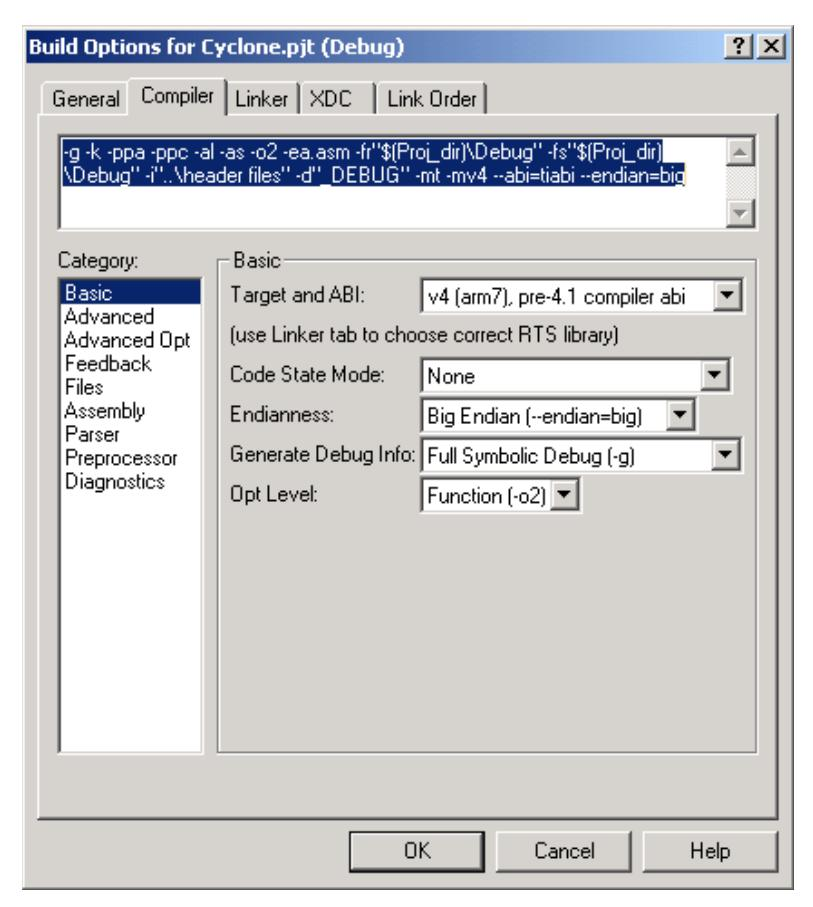

**Figure 14-1.**

<span id="page-461-0"></span>It can be seen that the "Code State Mode" is set to none, but the "–mt" compiler option is added in the long statement of all compiler built options shown in the upper editable field of the window.

The "–mt" option can be added by selecting the "16-bit State Code (-mt)" check box under the advanced category. This is illustrated in [Figure](#page-462-0) 14-2.


[www.ti.com](http://www.ti.com) *Dual-State Interworking*

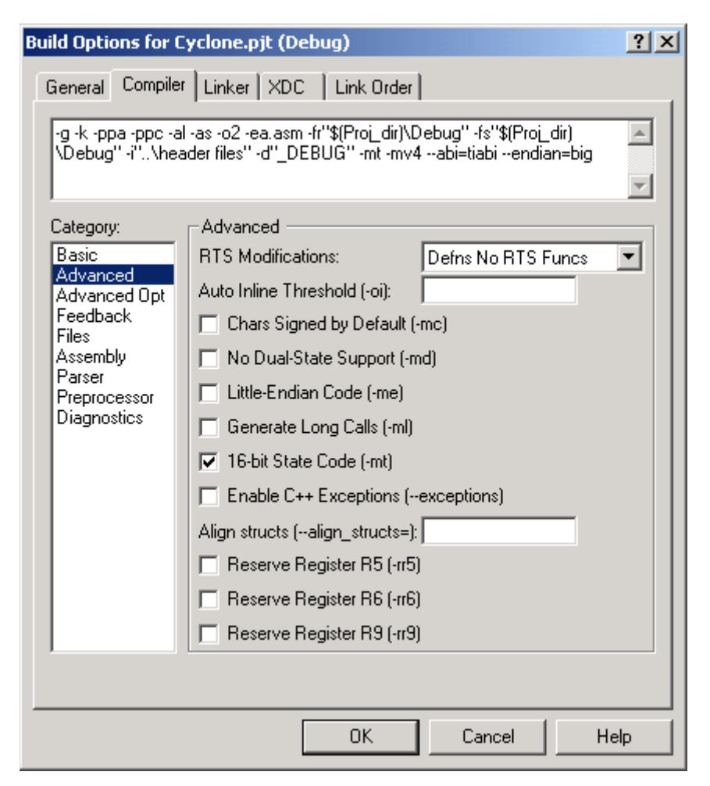

**Figure 14-2.**

<span id="page-462-0"></span>It is preferred that the interrupt service routines run in ARM mode in order to minimize the ISR execution latencies. Interrupts all start out in ARM mode, the interrupt hardware changes the state to ARM mode. It is preferred to stay in ARM mode even when executing the functions called by any of the interrupt service routines. These functions are located in the file interrupt.c.

[Figure](#page-463-0) 14-3 shows the "file specific" build options for the file interrupts.c which includes the interrupt service routines.


*Dual-State Interworking* [www.ti.com](http://www.ti.com)


**Figure 14-3.**

<span id="page-463-0"></span>It can be seen that the "Code State Mode" is set to 32-BIS Mode (--code\_state=32) and the –mt built option is not chosen. This means that the compiler will make sure that the generated assembly code will switch to ARM mode when executing this specific part of the code. And the ARM mode instruction set will be used to perform this section of the code.

For additional information, please refer to the following reference material:

- ARM Optimizing C/C++ Compiler v5.2 User's Guide [\(SPNU151\)](http://www.ti.com/lit/pdf/SPNU151)
- • ARM Assembly Language Tools v5.2 (CCS 6) [\(SPNU118\)](http://www.ti.com/lit/pdf/SPNU118)
- ARM7TDMI-S Technical Reference Manual [http://infocenter.arm.com/help/topic/com.arm.doc.ddi0234b/DDI0234.pdf](http://www.ti.com/lit/pdf/http://infocenter.arm.com/help/topic/com.arm.doc.ddi0234b/DDI0234.pdf)

The manuals above will be for the latest version of CCS. The CCS 3.3 manuals can be accessed via the Help button on the CCS window. They are installed with CCS 3.3.

<span id="page-464-0"></span>

# *Memory*

As previously mentioned UCD3138 (ARM7TDMI-S) is based on Von-Neumann architecture, with a single bus providing access to different memory modules and peripherals.

Within the UCD3138 architecture, there is a 2048x32 bit Boot ROM that contains the initial firmware startup routines for PMBUS communication and non-volatile (FLASH) memory download. This Boot ROM is executed after power up reset and the code will determine if there is a valid FLASH program written. If a valid program is present, the ROM code branches to the main FLASH program execution.

UCD3138 also supports customization of Boot program by allowing an alternative booting routine to be executed from program Flash. This UCD3138 feature enables assignment of unique address to each device therefore supporting firmware reprogramming even when several devices are connected on the same communication bus.

This is accomplished using multiple checksums at different locations in Program FLASH. Other 3138 family members even support multiple program images. See [Chapter](#page-436-0) 13 for more information on how this is done.

Two separate FLASH memories are present inside the device. The 32KB Program FLASH memory is organized as an 8Kx32 bit memory block and is intended to be for firmware program space. The block is configured with page erase capability for erasing blocks as small as 1KB per page, or with a mass erase for erasing the entire program FLASH array. The FLASH endurance is specified at 1000 erase/write cycles and the data retention is good for 100 years. The 2KB Data FLASH array is organized as a 512x32 memory. The Data FLASH is intended for firmware data value storage and data logging. Thus, the Data FLASH is specified as a high endurance memory of 20K cycles with embedded ECC (Error correction code) mechanism. The Data Flash can be mass erased, or erased in 32 byte blocks.

The ARM7 has its reset and interrupt vectors mapped starting at address zero. At reset, the ROM is mapped to start at zero. In program flash execution, the program flash needs to be mapped to zero. The UCD3138 has programmable memory addressing which is used by the Boot ROM to remap the memories. With the UCD3138, there is no need for the customer to remap memory. However, with the 3138064 and other family members, it may be useful. These chips have more than one program flash block. This makes it possible to store more than one program version on the same chip. Each version can be mapped to location zero for efficient

For run time data storage and scratchpad memory, a 4KB RAM is available for firmware usage. The RAM is organized as a 1024x32 bit array. This feature can even be used to download a new version while executing from an existing one. It is possible to switch versions without powering down the supply. When the device comes out of reset, the program memories are mapped as follows:

<span id="page-464-1"></span>**Module Size (KB) Memory Select Start Address 3138 3138064/A64 3138128** Boot ROM 8 0 0 0 0 Program Flash 0 32 1 0x10000 0x40000 0x40000 Program Flash 1 32 17 – 0x48000 0x48000 Program Flash 2 32 18 – – 0x50000 Program Flash 3 32 19 – – 0x58000

**Table 15-1. ROM and Program Flash Memory Map (ROM Operation)**


**NOTE:** In ROM mode, ROM extends from 0 up to start of program flash – the same 8KB block is repeated many times.

The large ROM area is needed because the ROM needs to jump from its ROM mode address to its Flash mode address before it moves the Flash to location 0. After boot ROM transfers control to program in Flash memory, memory gets remapped as follows:

**Table 15-2. Memory Map (Flash Operation)**

<span id="page-465-1"></span>

|                    | Size (KB) | Memory<br>Select | Start Address |         |              |         |         |         |  |  |
|--------------------|-----------|------------------|---------------|---------|--------------|---------|---------|---------|--|--|
| Module             |           |                  | 3138          |         | 3138064/A64A | 3138A64 | 3138128 |         |  |  |
|                    |           |                  |               | Mode 1  | Mode 2       |         | Mode 1  | Mode 2  |  |  |
| Program<br>Flash 0 | 32        | 1                | 0             | 0       | 0x8000       | 0       | 0       | 0x10000 |  |  |
| Program<br>Flash 1 | 32        | 17               | –             | 0x8000  | 0            | 0x8000  | 0x8000  | 0x18000 |  |  |
| Program<br>Flash 2 | 32        | 18               | –             | –       | –            | –       | 0x10000 | 0       |  |  |
| Program<br>Flash 3 | 32        | 19               | –             | –       | –            | –       | 0x18000 | 0x8000  |  |  |
| Boot ROM           | 8         | 0                | 0xA000        | 0x20000 | 0x20000      | 0x20000 | 0x20000 | 0x20000 |  |  |

#### **NOTE:**

- 1. In Flash Mode, the ROM only occupies 4KB
- 2. The difference between the A64 and A64A is the only difference between A and non-A versions. With all the rest of the devices, the A and non-A memory maps are the same.

Mode 1 and Mode 2 are provided so that multiple versions can be supported by the Boot ROM. The put different flash blocks or pairs of flash blocks at location 0. The Data Flash and RAM are always in the same locations regardless of ROM or FLASH mode.

**Table 15-3. RAM and Data Flash Memory Map (ROM and Flash Operation)**

<span id="page-465-2"></span>

|            |           |               | Start Address |         |             |  |  |
|------------|-----------|---------------|---------------|---------|-------------|--|--|
| Module     | Size (KB) | Memory Select | 3138          | 3138064 | 3138128/A64 |  |  |
| Data Flash | 2         | 2             | 0x18800       | 0x68800 | 0x69800     |  |  |
| Data RAM   | 4/8       | 3             | 0x19000       | 0x69000 | 0x6A000     |  |  |

**NOTE:** The '128/'A64 devices have 8 KB of data RAM, the other devices have 4KB.

**Table 15-4. Memory Map (System and Peripherals Blocks)**

<span id="page-465-0"></span>

| Address                   | Size | Module               | Comment           |
|---------------------------|------|----------------------|-------------------|
| 0x0002_0000 - 0x0002_00FF | 256  | Loop Mux             | Memory Select[4]  |
| 0x0003_0000 - 0x0003_00FF | 256  | Fault Mux            | Memory Select[5]  |
| 0x0004_0000 - 0x0004_00FF | 256  | ADC                  | Memory Select[6]  |
| 0x0005_0000 - 0x0005_00FF | 256  | DPWM 3               | Memory Select[7]  |
| 0x0006_0000 - 0x0006_00FF | 256  | Filter 2             | Memory Select[8]  |
| 0x0007_0000 - 0x0007_00FF | 256  | DPWM 2               | Memory Select[9]  |
| 0x0008_0000 - 0x0008_00FF | 256  | Front End/Ramp I/F 2 | Memory Select[10] |
| 0x0009_0000 - 0x0009_00FF | 256  | Filter 1             | Memory Select[11] |
| 0x000A_0000 - 0x000A_00FF | 256  | DPWM 1               | Memory Select[12] |


**Table 15-4. Memory Map (System and Peripherals Blocks) (continued)**

| Address                      | Size | Module                       | Comment              |
|------------------------------|------|------------------------------|----------------------|
| 0x000B_0000 – 0x000B_00FF    | 256  | Front End/Ramp I/F 1         | Memory Select[13]    |
| 0x000C_0000 - 0x000C_00FF    | 256  | Filter 0                     | Memory Select[14]    |
| 0x000D_0000 - 0x000D_00FF    | 256  | DPWM 0                       | Memory Select[15]    |
| 0x000E_0000 - 0x000E_00FF    | 256  | Front End/Ramp I/F 0         | Memory Select[16]    |
| 0xFFF7_EC00 - 0xFFF7_ECFF    | 256  | UART 0                       | Peripheral Select[4] |
| 0xFFF7_ED00 - 0xFFF7_EDFF    | 256  | UART 1                       | Peripheral Select[4] |
| 0xFFF7_F000 - 0xFFF7_F0FF    | 256  | Miscellaneous Analog Control | Peripheral Select[3] |
| 0xFFF7_F600 - 0xFFF7_F6FF    | 256  | PMBus Interface              | Peripheral Select[2] |
| 0xFFF7_FA00 - 0xFFF7_FAFF    | 256  | GIO                          | Peripheral Select[1] |
| 0xFFF7_FD00 - 0xFFF7_FDFF    | 256  | Timer                        | Peripheral Select[0] |
| 0xFFFF_FD00 - 0xFFFF_FDFF    | 256  | MMC                          | SAR Select[2]        |
| 0xFFFF_FE00 - 0xFFFF_FEFF    | 256  | DEC                          | SAR Select[1]        |
| 0xFFFF_FF20 - 0xFFFF_FF37    | 23   | CIM                          | SAR Select[0]        |
| 0xFFFF_FF40 - 0xFFFF_FF50    | 16   | PSA                          | SAR Select[0]        |
| 0xFFFF_FFD0 -<br>0xFFFF_FFEC | 28   | SYS                          | SAR Select[0]        |

The registers and bit definitions inside the System and Peripheral blocks are detailed in the next chapter. This chapter gives the register reference for the memory controller and address decoder, but the details of its use are in the next two chapters. Note that on 3138 family members with more than one flash block, all the memory select peripherals start at 0x00120000 instead of 0x00020000.


# <span id="page-467-1"></span>**15.1 Memory Controller – MMC Registers Reference**

All MMC control Registers have the following attributes:

- 16-bit width
- Addresses placed on word boundaries
- 16-bit data is placed on the least significant data bus D[15:0]
- Only half-word writes are permitted
- Registers are readable in any mode, but writeable only in privilege mode

# <span id="page-467-2"></span>*15.1.1 Static Memory Control Register (SMCTRL)*

Address FFFFFD00

### **Figure 15-1. Static Memory Control Register (SMCTRL)**

<span id="page-467-3"></span>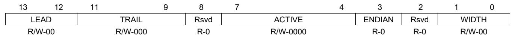

LEGEND: R/W = Read/Write; R = Read only; -*n* = value after reset

# **Table 15-5. Static Memory Control Register (SMCTRL) Register Field Descriptions**

<span id="page-467-0"></span>

| Bit   | Field    | Type | Reset | Description                                                                                                                                                                                                                                                                                                                                                                                                                                                     |
|-------|----------|------|-------|-----------------------------------------------------------------------------------------------------------------------------------------------------------------------------------------------------------------------------------------------------------------------------------------------------------------------------------------------------------------------------------------------------------------------------------------------------------------|
| 13-12 | LEAD     | R/W  | 00    | Address setup time cycles (write operations)<br>00 = No setup time required (Default)<br>01 = Write strobe is delayed one cycle<br>10 = Write strobe is delayed two cycles<br>11 = Write strobe is delayed three cycles                                                                                                                                                                                                                                         |
| 11-9  | TRAIL    | R/W  | 000   | Number of Trailing wait states. Determine the trailing wait states after read and write<br>operations to the memory associated with the chip select corresponding to the wait<br>states.                                                                                                                                                                                                                                                                        |
| 8     | Reserved | R    | 0     |                                                                                                                                                                                                                                                                                                                                                                                                                                                                 |
| 7-4   | ACTIVE   | R/W  | 0000  | Active Wait states (both read/write operations)<br>0000 = 0 Wait states (Default)<br>0001 = 1 Wait states<br>0010 = 2 Wait states<br>0011 = 3 Wait states<br>0100 = 4 Wait states<br>0101 = 5 Wait states<br>0110 = 6 Wait states<br>0111 = 7 Wait states<br>1000 = 8 Wait states<br>1001 = 9 Wait states<br>1010 = 10 Wait states<br>1011 = 11 Wait states<br>1100 = 12 Wait states<br>1101 = 13 Wait states<br>1110 = 14 Wait states<br>1111 = 15 Wait states |
| 3     | ENDIAN   | R    | 0     | Endian Mode Identification<br>0 = CPU configured in big endian mode<br>1 = CPU configured in little endian mode                                                                                                                                                                                                                                                                                                                                                 |
| 2     | Reserved | R    | 0     |                                                                                                                                                                                                                                                                                                                                                                                                                                                                 |


# **Table 15-5. Static Memory Control Register (SMCTRL) Register Field Descriptions (continued)**

| Bit | Field | Type | Reset | Description             |
|-----|-------|------|-------|-------------------------|
| 1-0 | WIDTH | R/W  | 00    | Data Width for Memories |
|     |       |      |       | 00 = 8 bits (Default)   |
|     |       |      |       | 01 = 16 bits            |
|     |       |      |       | 10 = 32 bits            |
|     |       |      |       | 11 = Reserved           |


# <span id="page-469-0"></span>*15.1.2 Write Control Register (WCTRL)*

Address FFFFFD2C

### **Figure 15-2. Write Control Register (WCTRL)**

<span id="page-469-1"></span>

LEGEND: R/W = Read/Write; R = Read only; -*n* = value after reset

### **Table 15-6. Write Control Register (WCTRL) Register Field Descriptions**

<span id="page-469-2"></span>

| Bit | Field     | Type | Reset | Description                                                                                                                                                                                                                                                                                                                                                                                                                      |
|-----|-----------|------|-------|----------------------------------------------------------------------------------------------------------------------------------------------------------------------------------------------------------------------------------------------------------------------------------------------------------------------------------------------------------------------------------------------------------------------------------|
| 1   | TRAIL_OVR | R/W  | 0     | Write trailing wait state override.<br>0 = At least one trailing wait state (Default)<br>1 = TRAIL sets trailing wait states                                                                                                                                                                                                                                                                                                     |
| 0   | WBUF_ENA  | R/W  | 0     | Write buffer enable. When this bit is 1, the memory controller latches the data and<br>control signals in the first cycle for write operations to the memories and peripherals<br>on the expansion bus and lets the CPU perform other operations. However, the CPU<br>starts a wait state if there is another request before the memory controller finishes.<br>0 = Write buffer disabled (Disabled)<br>1 = Write buffer enabled |


# <span id="page-470-0"></span>*15.1.3 Peripheral Control Register (PCTRL)*

Address FFFFFD30

### **Figure 15-3. Peripheral Control Register (PCTRL)**

0

<span id="page-470-1"></span>

LEGEND: R/W = Read/Write; R = Read only; -*n* = value after reset

### **Table 15-7. Peripheral Control Register (PCTRL) Register Field Descriptions**

<span id="page-470-2"></span>

| Bit | Field    | Type | Reset | Description                                                                                                                                                                                                                                                                                                                                                                                                                               |
|-----|----------|------|-------|-------------------------------------------------------------------------------------------------------------------------------------------------------------------------------------------------------------------------------------------------------------------------------------------------------------------------------------------------------------------------------------------------------------------------------------------|
| 0   | PUBF_ENA | R/W  | 0     | Write buffer enable. When this bit is set to 1, the memory controller latches the data<br>and control signals in the first cycle for write operations to the memories and<br>peripherals on the expansion bus and lets the CPU perform other operations.<br>However, the CPU starts a wait state if there is another request before the memory<br>controller finishes.<br>0 = Write buffer disabled (Default)<br>1 = Write buffer enabled |


### <span id="page-471-0"></span>*15.1.4 Peripheral Location Register (PLOC)*

Address FFFFFD34

#### **Figure 15-4. Peripheral Location Register (PLOC)**

<span id="page-471-1"></span>15 0 LOC

R/W-0000 0000 0000 0000

LEGEND: R/W = Read/Write; R = Read only; -*n* = value after reset

### **Table 15-8. Peripheral Location Register (PLOC) Register Field Descriptions**

<span id="page-471-2"></span>

| Bit  | Field | Type | Reset                        | Description                                                                                                                                                                           |
|------|-------|------|------------------------------|---------------------------------------------------------------------------------------------------------------------------------------------------------------------------------------|
| 15-0 | LOC   | R/W  | 0000<br>0000<br>0000<br>0000 | These 16 bits represent the peripheral location bits, which correspond to each of the<br>16 peripheral selects.<br>0 = Peripheral is internal (Default)<br>1 = Peripheral is external |


# <span id="page-472-0"></span>*15.1.5 Peripheral Protection Register (PPROT)*

Address FFFFFD38

### **Figure 15-5. Peripheral Protection Register (PPROT)**

<span id="page-472-3"></span>15 0

PROT

R/W-0000 0000 0000 0000

LEGEND: R/W = Read/Write; R = Read only; -*n* = value after reset

### **Table 15-9. Peripheral Protection Register (PPROT) Register Field Descriptions**

<span id="page-472-4"></span>

| Bit  | Field | Type | Reset                        | Description                                                                                                                                                                                                                     |
|------|-------|------|------------------------------|---------------------------------------------------------------------------------------------------------------------------------------------------------------------------------------------------------------------------------|
| 15-0 | PROT  | R/W  | 0000<br>0000<br>0000<br>0000 | These 16 bits represent the peripheral protection bits, which correspond to each of<br>the 16 peripheral selects.<br>0 = Peripheral is accessible in all modes (Default)<br>1 = Peripheral is accessible in privilege mode only |

# <span id="page-472-1"></span>**15.2 DEC – Address Manager Registers Reference**

The DEC generates the memory selects and SAR peripheral select signals by decoding the address and control signals from the ARM processor. In addition, the DEC provides the control signals for the Program and Data Flash.

The assigned memory selects for UCD3138 are as follows:

Memory Select 0 => Boot ROM (1Kx32)

Memory Select 1 => Program Flash (8Kx32)

Memory Select 2 => Data Flash (512x32)

Memory Select 3 => Data RAM (1Kx32)

Memory Select 4 => Loop Mux (1Kx32)

Memory Select 5 => Fault Mux (1Kx32)

Memory Select 6 => ADC12 Control (1Kx32)

Memory Select 7 => DPWM3 (1Kx32)

Memory Select 8 => Filter 2 (1Kx32)

Memory Select 9 => DPWM 2 (1Kx32)

Memory Select 10 => Front End Control 2 (1Kx32)

Memory Select 11 => Filter 1 (1Kx32)

Memory Select 12 => DPWM 1 (1Kx32)

Memory Select 13 => Front End Control 1 (1Kx32)

Memory Select 14 => Filter 0 (1Kx32)

Memory Select 15 => DPWM 0 (1Kx32)

Memory Select 16 => Front End Control 0 (1Kx32)

Memory Select 17 => Program Flash 1(8Kx32) – Not in UCD3138, in all other devices

Memory Select 18 => Program Flash 2(8Kx32) - Only in 3138128

Memory Select 19 => Program Flash 3(8Kx32) - Only in 3138128

# <span id="page-472-2"></span>*15.2.1 Memory Fine Base Address High Register 0 (MFBAHR0)*

Address FFFFFE00


# **Figure 15-6. Memory Fine Base Address High Register 0 (MFBAHR0)**

<span id="page-473-0"></span>15 0

ADDRESS[31:16]

R/W-0000 0000 0000 0000

LEGEND: R/W = Read/Write; R = Read only; -*n* = value after reset

### **Table 15-10. Memory Fine Base Address High Register 0 (MFBAHR0) Register Field Descriptions**

<span id="page-473-1"></span>

| Bit  | Field          | Type | Reset                        | Description                                                                                                                |
|------|----------------|------|------------------------------|----------------------------------------------------------------------------------------------------------------------------|
| 15-0 | ADDRESS[31:16] | R/W  | 0000<br>0000<br>0000<br>0000 | 16 Most Significant Bits of the Base Address. The Base Address sets the 22 most<br>significant bits of the memory address. |


# <span id="page-474-0"></span>*15.2.2 Memory Fine Base Address Low Register 0 (MFBALR0)*

Address FFFFFE04

#### **Figure 15-7. Memory Fine Base Address Low Register 0 (MFBALR0)**

<span id="page-474-1"></span>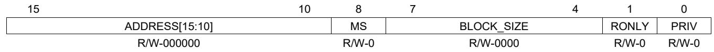

LEGEND: R/W = Read/Write; R = Read only; -*n* = value after reset

# **Table 15-11. Memory Fine Base Address Low Register 0 (MFBALR0) Register Field Descriptions**

<span id="page-474-2"></span>

| Bit   | Field          | Type | Reset  | Description                                                                                                                                                                                                                                                                                                                             |
|-------|----------------|------|--------|-----------------------------------------------------------------------------------------------------------------------------------------------------------------------------------------------------------------------------------------------------------------------------------------------------------------------------------------|
| 15-10 | ADDRESS[15:10] | R/W  | 000000 | 6 Least Significant Bits of the Base Address. The Base Address sets the 22 most<br>significant bits of the memory address.                                                                                                                                                                                                              |
| 8     | MS             | R/W  | 0      | Memory Map Select<br>0 = Memory Map configuration not updated (Default)<br>1 = Enables the fine and coarse memory selects and activates the memory map                                                                                                                                                                                  |
| 7-4   | BLOCK_SIZE     | R/W  | 0000   | Configures the size of the memory<br>0000 = Memory select is disabled (Default)<br>0001 = 1KB<br>0010 = 2KB<br>0011 = 4KB<br>0100 = 8KB<br>0101 = 16KB<br>0110 = 32KB<br>0111 = 64KB<br>1000 = 128KB<br>1001 = 256KB<br>1010 = 512KB<br>1011 = 1MB<br>1100 = 2MB<br>1101 = 4MB<br>1110 = 8MB<br>1111 = 16MB                             |
| 1     | RONLY          | R/W  | 0      | Read-only protection. This bit sets read-only protection for the memory selected by<br>the memory select. An illegal access exception is generated when a write is<br>attempted to the memory.<br>0 = Read/write access to memory (Default)<br>1 = Read accesses to memory only                                                         |
| 0     | PRIV           | R/W  | 0      | Privilege mode protection. This bit sets privilege mode protection for the memory<br>Registration selected by the memory select. An illegal access exception is generated<br>on any access to memory protected by privilege mode.<br>0 = User/privilege mode accesses to memory (Default)<br>1 = Privilege mode accesses to memory only |


### <span id="page-475-0"></span>*15.2.3 1.1.1 Memory Fine Base Address High Register 1-3,17-19 (MFBAHRx)*

Address FFFFFE08 – Memory Fine Base Address High Register 1

Address FFFFFE10 – Memory Fine Base Address High Register 2

Address FFFFFE18 – Memory Fine Base Address High Register 3

Address FFFFFE88 – Memory Fine Base Address High Register 17 (not on 3138)

Address FFFFFEA8 – Memory Fine Base Address High Register 18 (only on '128)

Address FFFFFEB0 – Memory Fine Base Address High Register 19 (only on '128)

# **Figure 15-8. Memory Fine Base Address High Register 1-3,17-19 (MFBAHRx)**

<span id="page-475-1"></span>15 0

ADDRESS[31:16] R/W-0000 0000 0000 0000

**Table 15-12. Memory Fine Base Address High Register 1-3, 17-19 (MFBAHRx) Register Field Descriptions**

<span id="page-475-2"></span>

| Bit  | Field          | Type | Reset                        | Description                                                                                                                |
|------|----------------|------|------------------------------|----------------------------------------------------------------------------------------------------------------------------|
| 15-0 | ADDRESS[31:16] | R/W  | 0000<br>0000<br>0000<br>0000 | 16 Most Significant Bits of the Base Address. The Base Address sets the 22 most<br>significant bits of the memory address. |


### <span id="page-476-0"></span>*15.2.4 Memory Fine Base Address Low Register 1-3, 17-19 (MFBALRx)*

Address FFFFFE0C – Memory Fine Base Address Low Register 1

Address FFFFFE14 – Memory Fine Base Address Low Register 2

Address FFFFFE1C – Memory Fine Base Address Low Register 3

Address FFFFFE8C – Memory Fine Base Address Low Register 17 (not on 3138)

Address FFFFFEAC – Memory Fine Base Address Low Register 18 (only on '128)

Address FFFFFEB4 – Memory Fine Base Address Low Register 19 (only on '128)

# **Figure 15-9. Memory Fine Base Address Low Register 1-3, 17-19 (MFBALRx)**

<span id="page-476-1"></span>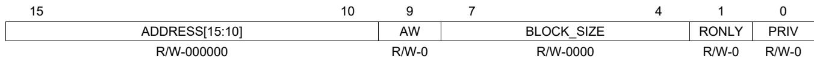

LEGEND: R/W = Read/Write; R = Read only; -*n* = value after reset

#### **Table 15-13. Memory Fine Base Address Low Register 1-3, 17-19 (MFBALRx) Register Field Descriptions**

<span id="page-476-2"></span>

| Bit   | Field          | Type | Reset  | Description                                                                                                                                                                                                                                                                                                                             |
|-------|----------------|------|--------|-----------------------------------------------------------------------------------------------------------------------------------------------------------------------------------------------------------------------------------------------------------------------------------------------------------------------------------------|
| 15-10 | ADDRESS[15:10] | R/W  | 000000 | 6 Least Significant Bits of the Base Address. The Base Address sets the 22 most<br>significant bits of the memory address.                                                                                                                                                                                                              |
| 9     | AW             | R/W  | 0      | Auto-wait-on-write. When this bit is set, any write operation on this memory select<br>takes two system cycles.<br>0 = Write operation is not supplemented with an additional cycle (Default)<br>1 = Write operation takes an additional cycle                                                                                          |
| 7-4   | BLOCK_SIZE     | R/W  | 0000   | Configures the size of the memory<br>0000 = Memory select is disabled (Default)<br>0001 = 1KB<br>0010 = 2KB<br>0011 = 4KB<br>0100 = 8KB<br>0101 = 16KB<br>0110 = 32KB<br>0111 = 64KB<br>1000 = 128KB<br>1001 = 256KB<br>1010 = 512KB<br>1011 = 1MB<br>1100 = 2MB<br>1101 = 4MB<br>1110 = 8MB<br>1111 = 16MB                             |
| 1     | RONLY          | R/W  | 0      | Read-only protection. This bit sets read-only protection for the memory selected by<br>the memory select. An illegal access exception is generated when a write is<br>attempted to the memory.<br>0 = Read/write access to memory (Default)<br>1 = Read accesses to memory only                                                         |
| 0     | PRIV           | R/W  | 0      | Privilege mode protection. This bit sets privilege mode protection for the memory<br>Registration selected by the memory select. An illegal access exception is generated<br>on any access to memory protected by privilege mode.<br>0 = User/privilege mode accesses to memory (Default)<br>1 = Privilege mode accesses to memory only |


# <span id="page-477-0"></span>*15.2.5 Memory Fine Base Address High Load Differences for Enhanced 3138 Devices*

These tables show the values loaded into the registers in the UCD3138. To make room for additional Program Flash in the UCD3138064 and other devices with more program flash, the registers have an additional bit set that moves the peripherals to start at 0x120000 instead of at 0x20000.


### <span id="page-478-0"></span>*15.2.6 Memory Fine Base Address High Register 4 (MFBAHR4)*

Address FFFFFE20 – Memory Fine Base Address High Register 4

#### **Figure 15-10. Memory Fine Base Address High Register 4 (MFBAHR4)**

<span id="page-478-1"></span>15 0

ADDRESS[31:16]

R/W-0000 0000 0000 0010

LEGEND: R/W = Read/Write; R = Read only; -*n* = value after reset

### **Table 15-14. Memory Fine Base Address High Register 4 (MFBAHR4) Register Field Descriptions**

<span id="page-478-2"></span>

| Bit  | Field          | Type | Reset                        | Description                                                                                                                |
|------|----------------|------|------------------------------|----------------------------------------------------------------------------------------------------------------------------|
| 15-0 | ADDRESS[31:16] | R/W  | 0000<br>0000<br>0000<br>0010 | 16 Most Significant Bits of the Base Address. The Base Address sets the 22 most<br>significant bits of the memory address. |


# <span id="page-479-0"></span>*15.2.7 Memory Fine Base Address Low Register 4-16 (MFBALRx)*

Address FFFFFE24 – Memory Fine Base Address Low Register 4

Address FFFFFE2C – Memory Fine Base Address Low Register 5

Address FFFFFE34 – Memory Fine Base Address Low Register 6

Address FFFFFE3C – Memory Fine Base Address Low Register 7

Address FFFFFE44 – Memory Fine Base Address Low Register 8

Address FFFFFE4C – Memory Fine Base Address Low Register 9

Address FFFFFE54 – Memory Fine Base Address Low Register 10

Address FFFFFE5C – Memory Fine Base Address Low Register 11

Address FFFFFE64 – Memory Fine Base Address Low Register 12

Address FFFFFE6C – Memory Fine Base Address Low Register 13

Address FFFFFE74 – Memory Fine Base Address Low Register 14

Address FFFFFE7C – Memory Fine Base Address Low Register 15

Address FFFFFE84 – Memory Fine Base Address Low Register 16

**Figure 15-11. Memory Fine Base Address Low Register 4-16 (MFBALRx)**

<span id="page-479-1"></span>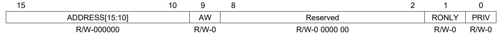

LEGEND: R/W = Read/Write; R = Read only; -*n* = value after reset

# **Table 15-15. Memory Fine Base Address Low Register 4-17 (MFBALRx) Register Field Descriptions**

<span id="page-479-2"></span>

| Bit   | Field          | Type | Reset        | Description                                                                                                                                                                                                                                                                                                                             |
|-------|----------------|------|--------------|-----------------------------------------------------------------------------------------------------------------------------------------------------------------------------------------------------------------------------------------------------------------------------------------------------------------------------------------|
| 15-10 | ADDRESS[15:10] | R/W  | 000000       | 6 Least Significant Bits of the Base Address. The Base Address sets the 22 most<br>significant bits of the memory address.                                                                                                                                                                                                              |
| 9     | AW             | R/W  | 0            |                                                                                                                                                                                                                                                                                                                                         |
| 8-2   | Reserved       | R/W  | 0 0000<br>00 | Auto-wait-on-write. When this bit is set, any write operation on this memory select<br>takes two system cycles.<br>0 = Write operation is not supplemented with an additional cycle (Default)<br>1 = Write operation takes an additional cycle                                                                                          |
| 1     | RONLY          | R/W  | 0            | Read-only protection. This bit sets read-only protection for the memory selected by<br>the memory select. An illegal access exception is generated when a write is<br>attempted to the memory.<br>0 = Read/write access to memory (Default)<br>1 = Read accesses to memory only                                                         |
| 0     | PRIV           | R/W  | 0            | Privilege mode protection. This bit sets privilege mode protection for the memory<br>Registration selected by the memory select. An illegal access exception is generated<br>on any access to memory protected by privilege mode.<br>0 = User/privilege mode accesses to memory (Default)<br>1 = Privilege mode accesses to memory only |


### <span id="page-480-0"></span>*15.2.8 Memory Fine Base Address High Register 5 (MFBAHR5)*

Address FFFFFE28 – Memory Fine Base Address High Register 5

# **Figure 15-12. Memory Fine Base Address High Register 5 (MFBAHR5)**

<span id="page-480-1"></span>15 0

ADDRESS[31:16]

R/W-0000 0000 0000 0011

LEGEND: R/W = Read/Write; R = Read only; -*n* = value after reset

### **Table 15-16. Memory Fine Base Address High Register 5 (MFBAHR5) Register Field Descriptions**

<span id="page-480-2"></span>

| Bit  | Field          | Type | Reset                        | Description                                                                                                                |
|------|----------------|------|------------------------------|----------------------------------------------------------------------------------------------------------------------------|
| 15-0 | ADDRESS[31:16] | R/W  | 0000<br>0000<br>0000<br>0011 | 16 Most Significant Bits of the Base Address. The Base Address sets the 22 most<br>significant bits of the memory address. |


### <span id="page-481-0"></span>*15.2.9 Memory Fine Base Address High Register 6 (MFBAHR6)*

Address FFFFFE30 – Memory Fine Base Address High Register 6

# **Figure 15-13. Memory Fine Base Address High Register 6 (MFBAHR6)**

15 0

<span id="page-481-1"></span>ADDRESS[31:16]

R/W-0000 0000 0000 0100

LEGEND: R/W = Read/Write; R = Read only; -*n* = value after reset

### **Table 15-17. Memory Fine Base Address High Register 6 (MFBAHR6) Register Field Descriptions**

<span id="page-481-2"></span>

| Bit  | Field          | Type | Reset                        | Description                                                                                                                |
|------|----------------|------|------------------------------|----------------------------------------------------------------------------------------------------------------------------|
| 15-0 | ADDRESS[31:16] | R/W  | 0000<br>0000<br>0000<br>0100 | 16 Most Significant Bits of the Base Address. The Base Address sets the 22 most<br>significant bits of the memory address. |


### <span id="page-482-0"></span>*15.2.10 Memory Fine Base Address High Register 7 (MFBAHR7)*

Address FFFFFE38 – Memory Fine Base Address High Register 7

# **Figure 15-14. Memory Fine Base Address High Register 7 (MFBAHR7)**

<span id="page-482-1"></span>15 0

ADDRESS[31:16]

R/W-0000 0000 0000 0101

LEGEND: R/W = Read/Write; R = Read only; -*n* = value after reset

### **Table 15-18. Memory Fine Base Address High Register 7 (MFBAHR7) Register Field Descriptions**

<span id="page-482-2"></span>

| Bit  | Field          | Type | Reset                        | Description                                                                                                                |
|------|----------------|------|------------------------------|----------------------------------------------------------------------------------------------------------------------------|
| 15-0 | ADDRESS[31:16] | R/W  | 0000<br>0000<br>0000<br>0101 | 16 Most Significant Bits of the Base Address. The Base Address sets the 22 most<br>significant bits of the memory address. |


### <span id="page-483-0"></span>*15.2.11 Memory Fine Base Address High Register 8 (MFBAHR8)*

Address FFFFFE40 – Memory Fine Base Address High Register 8

# **Figure 15-15. Memory Fine Base Address High Register 8 (MFBAHR8)**

<span id="page-483-1"></span>15 0

ADDRESS[31:16]

R/W-0000 0000 0000 0110

LEGEND: R/W = Read/Write; R = Read only; -*n* = value after reset

### **Table 15-19. Memory Fine Base Address High Register 8 (MFBAHR8) Register Field Descriptions**

<span id="page-483-2"></span>

| Bit  | Field          | Type | Reset                        | Description                                                                                                                |
|------|----------------|------|------------------------------|----------------------------------------------------------------------------------------------------------------------------|
| 15-0 | ADDRESS[31:16] | R/W  | 0000<br>0000<br>0000<br>0110 | 16 Most Significant Bits of the Base Address. The Base Address sets the 22 most<br>significant bits of the memory address. |


### <span id="page-484-0"></span>*15.2.12 Memory Fine Base Address High Register 9 (MFBAHR9)*

Address FFFFFE48 – Memory Fine Base Address High Register 9

### **Figure 15-16. Memory Fine Base Address High Register 9 (MFBAHR9)**

<span id="page-484-1"></span>15 0

ADDRESS[31:16]

R/W-0000 0000 0000 0111

LEGEND: R/W = Read/Write; R = Read only; -*n* = value after reset

### **Table 15-20. Memory Fine Base Address High Register 9 (MFBAHR9) Register Field Descriptions**

<span id="page-484-2"></span>

| Bit  | Field          | Type | Reset                        | Description                                                                                                                |
|------|----------------|------|------------------------------|----------------------------------------------------------------------------------------------------------------------------|
| 15-0 | ADDRESS[31:16] | R/W  | 0000<br>0000<br>0000<br>0111 | 16 Most Significant Bits of the Base Address. The Base Address sets the 22 most<br>significant bits of the memory address. |


### <span id="page-485-0"></span>*15.2.13 Memory Fine Base Address High Register 10 (MFBAHR10)*

Address FFFFFE50 – Memory Fine Base Address High Register 10

#### **Figure 15-17. Memory Fine Base Address High Register 10 (MFBAHR10)**

<span id="page-485-1"></span>15 0

ADDRESS[31:16]

R/W-0000 0000 0000 1000

LEGEND: R/W = Read/Write; R = Read only; -*n* = value after reset

### **Table 15-21. Memory Fine Base Address High Register 10 (MFBAHR10) Register Field Descriptions**

<span id="page-485-2"></span>

| Bit  | Field          | Type | Reset                        | Description                                                                                                                |
|------|----------------|------|------------------------------|----------------------------------------------------------------------------------------------------------------------------|
| 15-0 | ADDRESS[31:16] | R/W  | 0000<br>0000<br>0000<br>1000 | 16 Most Significant Bits of the Base Address. The Base Address sets the 22 most<br>significant bits of the memory address. |


### <span id="page-486-1"></span>*15.2.14 Memory Fine Base Address High Register 11 (MFBAHR11)*

Address FFFFFE58 – Memory Fine Base Address High Register 11

#### **Figure 15-18. Memory Fine Base Address High Register 11 (MFBAHR11)**

<span id="page-486-2"></span>15 0

ADDRESS[31:16]

R/W-0000 0000 0000 1001 LEGEND: R/W = Read/Write; R = Read only; -*n* = value after reset

### **Table 15-22. Memory Fine Base Address High Register 11 (MFBAHR11) Register Field Descriptions**

<span id="page-486-0"></span>

| Bit  | Field          | Type | Reset                        | Description                                                                                                                |
|------|----------------|------|------------------------------|----------------------------------------------------------------------------------------------------------------------------|
| 15-0 | ADDRESS[31:16] | R/W  | 0000<br>0000<br>0000<br>1001 | 16 Most Significant Bits of the Base Address. The Base Address sets the 22 most<br>significant bits of the memory address. |


### <span id="page-487-0"></span>*15.2.15 Memory Fine Base Address High Register 12 (MFBAHR12)*

Address FFFFFE60 – Memory Fine Base Address High Register 12

#### **Figure 15-19. Memory Fine Base Address High Register 12 (MFBAHR12)**

<span id="page-487-1"></span>15 0

ADDRESS[31:16]

R/W-0000 0000 0000 1010

LEGEND: R/W = Read/Write; R = Read only; -*n* = value after reset

### **Table 15-23. Memory Fine Base Address High Register 12 (MFBAHR12) Register Field Descriptions**

<span id="page-487-2"></span>

| Bit  | Field          | Type | Reset                        | Description                                                                                                                |
|------|----------------|------|------------------------------|----------------------------------------------------------------------------------------------------------------------------|
| 15-0 | ADDRESS[31:16] | R/W  | 0000<br>0000<br>0000<br>1010 | 16 Most Significant Bits of the Base Address. The Base Address sets the 22 most<br>significant bits of the memory address. |


### <span id="page-488-0"></span>*15.2.16 Memory Fine Base Address High Register 13 (MFBAHR13)*

Address FFFFFE68 – Memory Fine Base Address High Register 13

#### **Figure 15-20. Memory Fine Base Address High Register 13 (MFBAHR13)**

<span id="page-488-1"></span>15 0

ADDRESS[31:16]

R/W-0000 0000 0000 1011

LEGEND: R/W = Read/Write; R = Read only; -*n* = value after reset

### **Table 15-24. Memory Fine Base Address High Register 13 (MFBAHR13) Register Field Descriptions**

<span id="page-488-2"></span>

| Bit  | Field          | Type | Reset                        | Description                                                                                                                |
|------|----------------|------|------------------------------|----------------------------------------------------------------------------------------------------------------------------|
| 15-0 | ADDRESS[31:16] | R/W  | 0000<br>0000<br>0000<br>1011 | 16 Most Significant Bits of the Base Address. The Base Address sets the 22 most<br>significant bits of the memory address. |


### <span id="page-489-0"></span>*15.2.17 Memory Fine Base Address High Register 14 (MFBAHR14)*

Address FFFFFE70 – Memory Fine Base Address High Register 14

# **Figure 15-21. Memory Fine Base Address High Register 14 (MFBAHR14)**

<span id="page-489-1"></span>15 0

ADDRESS[31:16]

R/W-0000 0000 0000 1100

LEGEND: R/W = Read/Write; R = Read only; -*n* = value after reset

### **Table 15-25. Memory Fine Base Address High Register 14 (MFBAHR14) Register Field Descriptions**

<span id="page-489-2"></span>

| Bit  | Field          | Type | Reset                        | Description                                                                                                                |
|------|----------------|------|------------------------------|----------------------------------------------------------------------------------------------------------------------------|
| 15-0 | ADDRESS[31:16] | R/W  | 0000<br>0000<br>0000<br>1100 | 16 Most Significant Bits of the Base Address. The Base Address sets the 22 most<br>significant bits of the memory address. |


### <span id="page-490-0"></span>*15.2.18 Memory Fine Base Address High Register 15 (MFBAHR15)*

Address FFFFFE78 – Memory Fine Base Address High Register 15

#### **Figure 15-22. Memory Fine Base Address High Register 15 (MFBAHR15)**

<span id="page-490-1"></span>15 0

ADDRESS[31:16]

R/W-0000 0000 0000 1101

LEGEND: R/W = Read/Write; R = Read only; -*n* = value after reset

### **Table 15-26. Memory Fine Base Address High Register 15 (MFBAHR15) Register Field Descriptions**

<span id="page-490-2"></span>

| Bit  | Field          | Type | Reset                        | Description                                                                                                                |
|------|----------------|------|------------------------------|----------------------------------------------------------------------------------------------------------------------------|
| 15-0 | ADDRESS[31:16] | R/W  | 0000<br>0000<br>0000<br>1101 | 16 Most Significant Bits of the Base Address. The Base Address sets the 22 most<br>significant bits of the memory address. |


### <span id="page-491-0"></span>*15.2.19 Memory Fine Base Address High Register 16 (MFBAHR16)*

Address FFFFFE80 – Memory Fine Base Address High Register 16

#### **Figure 15-23. Memory Fine Base Address High Register 16 (MFBAHR16)**

<span id="page-491-1"></span>15 0

ADDRESS[31:16]

R/W-0000 0000 0000 1110

LEGEND: R/W = Read/Write; R = Read only; -*n* = value after reset

### **Table 15-27. Memory Fine Base Address High Register 16 (MFBAHR16) Register Field Descriptions**

<span id="page-491-2"></span>

| Bit  | Field          | Type | Reset                        | Description                                                                                                                |
|------|----------------|------|------------------------------|----------------------------------------------------------------------------------------------------------------------------|
| 15-0 | ADDRESS[31:16] | R/W  | 0000<br>0000<br>0000<br>1110 | 16 Most Significant Bits of the Base Address. The Base Address sets the 22 most<br>significant bits of the memory address. |


# <span id="page-492-2"></span><span id="page-492-0"></span>*15.2.20 Program Flash Control Register (PFLASHCTRL)*

**Table 15-28. PFLASHCTRL Addresses**

| Part Number | Addresses               |
|-------------|-------------------------|
| 3138        | FFFFFE90                |
| 3138064     | FFFFFE90 (PFLASHCTRL_1) |
|             | FFFFFE9C (PFLASHCTRL_2) |
| 3138A64     | FFFFFE90 (PFLASHCTRL_0) |
|             | FFFFFE9C (PFLASHCTRL_1) |
|             | FFFFFE90 (PFLASHCTRL_0) |
|             | FFFFFE9C (PFLASHCTRL_1) |
| 3138128     | FFFFFEA0 (PFLASHCTRL_2) |
|             | FFFFFEA4 (PFLASHCTRL_3) |

### **Figure 15-24. Program Flash Control Register (PFLASHCTRL)**

<span id="page-492-1"></span>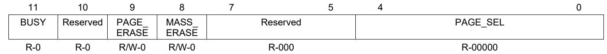

LEGEND: R/W = Read/Write; R = Read only; -*n* = value after reset

# **Table 15-29. Program Flash Control Register (PFLASHCTRL) Register Field Descriptions**

<span id="page-492-3"></span>

| Bit | Field      | Type | Reset | Description                                                                                                                                                                                                                                                                                                                                                       |
|-----|------------|------|-------|-------------------------------------------------------------------------------------------------------------------------------------------------------------------------------------------------------------------------------------------------------------------------------------------------------------------------------------------------------------------|
| 11  | BUSY       | R    | 0     | Program Flash Busy Indicator<br>0 = Program Flash available for read/write/erase access<br>1 = Program Flash unavailable for read/write/erase access                                                                                                                                                                                                              |
| 10  | Reserved   | R    | 0     |                                                                                                                                                                                                                                                                                                                                                                   |
| 9   | PAGE_ERASE | R/W  | 0     | Program Flash Page Erase Enable<br>0 = No Page Erase initiated on Program Flash (Default)<br>1 = Page Erase on Program Flash enabled. Page erased is based on PAGE_SEL<br>(Bits 4-0). Interlock Key must be set in Program Flash Interlock Register<br>(Section 16.1.8) to initiate Page Erase cycle. This bit is cleared upon completion of<br>Page Erase cycle. |
| 8   | MASS_ERASE | R/W  | 0     | Program Flash Mass Erase Enable<br>0 = No Mass Erase initiated on Program Flash (Default)<br>1 = Mass Erase of Program Flash enabled. Interlock Key must be set in Program<br>Flash Interlock Register (Section 16.1.8) to initiate Mass Erase cycle. This bit is<br>cleared upon completion of Mass Erase cycle.                                                 |
| 7-5 | Reserved   | R    | 000   |                                                                                                                                                                                                                                                                                                                                                                   |
| 4-0 | PAGE_SEL   | R    | 00000 | Selects page to be erased during Page Erase Cycle                                                                                                                                                                                                                                                                                                                 |


# <span id="page-493-0"></span>*15.2.21 Data Flash Control Register (DFLASHCTRL)*

Address FFFFFE94

#### **Figure 15-25. Data Flash Control Register (DFLASHCTRL)**

<span id="page-493-1"></span>

| 11   | 10       | 9              | 8              | 7        | 6 | 5 |            | 0 |
|------|----------|----------------|----------------|----------|---|---|------------|---|
| BUSY | Reserved | PAGE_<br>ERASE | MASS_<br>ERASE | Reserved |   |   | PAGE_SEL   |   |
| R-0  | R-0      | R/W-0          | R/W-0          | R-0      |   |   | R/W-000000 |   |

LEGEND: R/W = Read/Write; R = Read only; -*n* = value after reset

### **Table 15-30. Data Flash Control Register (DFLASHCTRL) Register Field Descriptions**

<span id="page-493-2"></span>

| Bit | Field      | Type | Reset  | Description                                                                                                                                                                                                                                 |
|-----|------------|------|--------|---------------------------------------------------------------------------------------------------------------------------------------------------------------------------------------------------------------------------------------------|
| 11  | BUSY       | R    | 0      | Data Flash Busy Indicator<br>0 = Data Flash available for read/write/erase access<br>1 = Data Flash unavailable for read/write/erase access                                                                                                 |
| 10  | Reserved   | R    | 0      |                                                                                                                                                                                                                                             |
| 9   | PAGE_ERASE | R/W  | 0      | Data Flash Page Erase Enable<br>0 = No Page Erase initiated on Data Flash (Default)<br>1 = Page Erase Cycle on Data Flash enabled. Page erased is based on PAGE_SEL<br>(Bits 4-0). This bit is cleared upon completion of Page Erase cycle. |
| 8   | MASS_ERASE | R/W  | 0      | Data Flash Mass Erase Enable<br>0 = No Mass Erase initiated on Data Flash (Default)<br>1 = Mass Erase of Data Flash enabled. Bit is cleared upon completion of mass<br>erase.                                                               |
| 7-6 | Reserved   | R    | 0      |                                                                                                                                                                                                                                             |
| 5-0 | PAGE_SEL   | R/W  | 000000 | Selects page to be erased during Page Erase Cycle                                                                                                                                                                                           |


# <span id="page-494-0"></span>*15.2.22 Flash Interlock Register (FLASHILOCK)*

Address FFFFFE98

# **Figure 15-26. Flash Interlock Register (FLASHILOCK)**

<span id="page-494-1"></span>31 0

INTERLOCK\_KEY

R/W-0000 0000 0000 0000 0000 0000 0000 0000

LEGEND: R/W = Read/Write; R = Read only; -*n* = value after reset

### **Table 15-31. Flash Interlock Register (FLASHILOCK) Register Field Descriptions**

<span id="page-494-2"></span>

| Bit  | Field         | Type | Reset                                                        | Description                                                                                                                                                                                                                                                                                                                                                                                                                                                                                                                                                                                                               |
|------|---------------|------|--------------------------------------------------------------|---------------------------------------------------------------------------------------------------------------------------------------------------------------------------------------------------------------------------------------------------------------------------------------------------------------------------------------------------------------------------------------------------------------------------------------------------------------------------------------------------------------------------------------------------------------------------------------------------------------------------|
| 31-0 | INTERLOCK_KEY | R/W  | 0000<br>0000<br>0000<br>0000<br>0000<br>0000<br>0000<br>0000 | Flash Interlock Key. Register must be set to: 0x42DC157E prior to every Data Flash<br>write/mass erase/page erase or<br>0x42DC157E prior to every Program Flash#0 write/mass erase/page erase or<br>0x6C97D0C5 prior to every Program Flash#1 write/mass erase/page erase or<br>0x184219B3 prior to every Program Flash#2 write/mass erase/page erase or<br>0x5973EF21 prior to every Program Flash#3 write/mass erase/page erase.<br>If the Interlock Key is not set, the write/erase cycle to the Flash will not initiate. This<br>register will clear upon the completion of a write/erase cycle to the Flash modules. |

<span id="page-495-0"></span>

# *Control System Module*

### The System Module:

- Enables and sets memory addresses for all memory mapped items
- Controls write and erase of flash memory
- Provides control and monitoring of the interrupt signals from the peripherals
- Controls clocks, software interrupts, system exceptions

The blocks inside the system module are the address decoder (DecRegs), memory control (MMCRegs), system management (SysRegs), and central interrupt (CimRegs).

**Topic** ........................................................................................................................... **Page**

| Address Decoder (DEC)<br>16.1<br>497<br>Memory Management Controller (MMC)<br>16.2<br>System Management (SYS)<br>16.3<br>Central Interrupt Module (CIM)<br>16.4<br>SYS – System Module Registers Reference<br>16.5 |  |     |
|--------------------------------------------------------------------------------------------------------------------------------------------------------------------------------------------------------------------|--|-----|
|                                                                                                                                                                                                                    |  |     |
|                                                                                                                                                                                                                    |  |     |
|                                                                                                                                                                                                                    |  | 502 |
|                                                                                                                                                                                                                    |  | 502 |
|                                                                                                                                                                                                                    |  | 502 |
|                                                                                                                                                                                                                    |  | 508 |


www.ti.com Address Decoder (DEC)

### <span id="page-496-0"></span>16.1 Address Decoder (DEC)

The Address Decoder generates the memory selects for Flash, ROM and RAM arrays. The memory map addresses are selectable through configurable register settings for low and high boundaries. These fine memory selects can be configured from 1K to 16M sizes. Power on reset uses the default addresses in the memory map for ROM execution, which is then configured by the ROM code to the application setup. During access to the DEC registers, a wait state is asserted to the CPU. DEC registers are only writable in the Privilege mode for user mode protection.

The DEC Address Manager controls memory mapping and flash programming. All memory mapping activity is normally done by the boot ROM. This is described in this document. This information is only useful if there is some need to return to ROM mode without going through a reset first.

There may be a need for customer programs to erase and program both Program and Data Flash, so this is discussed in some detail.

# <span id="page-496-1"></span>16.1.1 Memory Mapping Basics

There are 4 memory address spaces in the UCD3138. Each memory space has a pair of registers to set its address and block size:

| Register<br>Number | Memory        | Size in Bytes | Address at<br>Reset | Address in ROM Mode           | Address in Flash Mode        |
|--------------------|---------------|---------------|---------------------|-------------------------------|------------------------------|
| 0                  | Boot ROM      | 4K            | Most of space       | 0x0000 0000 -<br>0x0000 FFFF  | 0x0000 A000 -<br>0x0000 AFFF |
| 1                  | Program Flash | 32K           | -                   | 0x0001 0000 -<br>0x0001 7FFFF | 0x0000 0000 -<br>0x0000 7FFF |
| 2                  | Data Flash    | 2K            | -                   | 0x0001 8800 ·                 | - 0x0001 8FFF                |
| 3                  | RAM           | 4K            | -                   | 0x0001 9000 ·                 | - 0x0001 9FFF                |


*Address Decoder (DEC)* [www.ti.com](http://www.ti.com)

There are additional memory map registers for fast peripherals, but these are never moved. In addition, several peripheral register sets, including the System Module, are located at fixed locations in high memory. All of these memory locations are given in the reference sections for each register.

[Figure](#page-497-0) 16-1 illustrates where memory is mapped at device reset, in ROM Mode, and in Flash Mode:

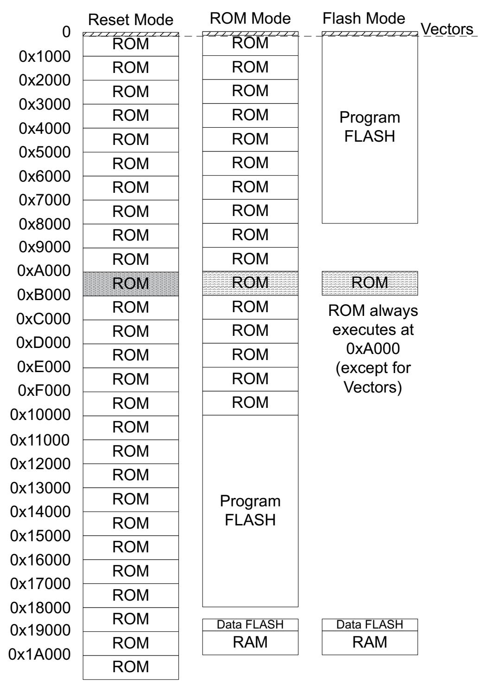

<span id="page-497-0"></span>**Figure 16-1.**


[www.ti.com](http://www.ti.com) *Address Decoder (DEC)*

# <span id="page-498-0"></span>*16.1.2 Why Change Memory Map?*

The memory map changes primarily because the vectors – for reset, interrupts, and faults – are located starting at location 0 in memory. When the UCD3138 powers up, the ROM needs to control the vectors. When the memory is configured, but the ROM is still executing, the ROM still needs to control the vectors.

Then when control is handed over to the customer program in FLASH, the vectors need to be assigned by the customer for most efficient execution.

# <span id="page-498-1"></span>*16.1.3 How do Memory Map Registers Work?*

Two registers, the Memory Fine Base Address High Register, and the Memory Fine Base Address Low Register, combine to provide a start address for the memory block.

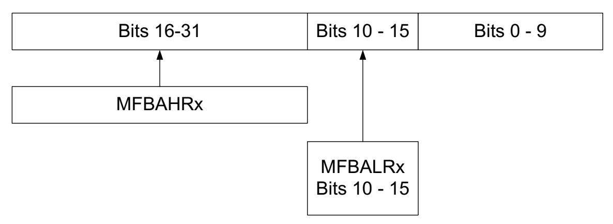

**Figure 16-2. Base Address**

<span id="page-498-4"></span>The Block Size field in the Memory Fine Base Address Register Low determines the size of the area for the memory block. The possible sizes range from 1KB, represented by a 1 in BLOCK\_SIZE, to 16MB, represented by a 0xF. A zero in BLOCK\_SIZE disables that memory from ever being selected.

To calculate the address provided by the MBBALRx, multiply it by 4 and include it in bits 8 to 15. For example, a 0x22 translates to 0x8800. A 0x24 translates to a 0x9000. There are other bits as well, for example an RONLY bit signifying that the memory is read only.

There is also a MS (for Memory Select) bit in only MFBALR0, which enables the entire DEC module. DEC stands for Memory Address DECode.

### <span id="page-498-2"></span>*16.1.4 RONLY Bit*

The DEC register has an RONLY bit as well. If set, this means "read only". An attempt to write to a memory space with the RONLY bit set will cause an illegal access exception, which will normally reset the processor. This bit may be set to cause device reset if the program runs away either due to a program bug or an input glitch.

### <span id="page-498-3"></span>*16.1.5 Boot ROM Memory Initialization*

When the UCD3138 powers up, the ROM is the only memory in the entire memory space. The peripherals are also present at the extreme high end of the memory space. The ROM image is repeated throughout the rest of the memory. The reset vector at location 0 in memory is accessed by the first instruction fetch of the CPU.

This instruction is a branch to the ROM entry point, aimed at the ROM image starting at address 0xa000. This is done because eventually the ROM will be mapped to 0xa000 to 0xafff only. If the program counter is already pointing there, there is no discontinuity when the address is changed.

First in the ROM program, the three address register pairs for the other memories are changed.

Memory Fine Base Address High Registers 1-3 (MFBAHRx) are all loaded with a 1. This register provides bits 16 – 31 of the address for the device, so all of the memories will be mapped to 0x1xxxx.


*Address Decoder (DEC)* [www.ti.com](http://www.ti.com)

The Memory Fine Base Address Low Registers 1 – 3 (MFBALRx) are loaded as follows:

- MFBALR1 The BLOCK\_SIZE field is loaded with a 6. This means that the Program Flash is at 0x10000, and is 32KB long.
- MFBALR2 BLOCK\_SIZE = 2, ADDRESS = 0x22 Data flash = 2KB at 0x18800
- MFBALR3 BLOCK\_SIZE = 3, ADDRESS = 0x24 RAM = 4KB at 0x19000.

Now that the other memories are mapped, the ROM is moved to fill the entire 64K space starting at zero. This is done at this point so that the ROM can still control the interrupt vectors at 0, all the other memories can be read and written, and the ROM can still execute at 0xA000.

This is done by modifying the MFBALR0 register, which controls the ROM address, and also enables the memory map.

MFBALR0 – BLOCK\_SIZE = 7, RONLY = 1, MS = 1. (ADDRESS is left at 0)

This does all that is described above, as well as making it a fault if the program attempts to write to the ROM. All of the statements above are shorthand descriptions, not C code. In fact, to save space in the ROM a single constant is written to each register, with all the bit fields properly placed in it.

After the memory map is initialized in this pattern, the ROM program performs a simple additive checksum on the Program Flash. If the checksum matches, the ROM program then reconfigures the memory map and jumps to location zero in the flash.

There is also a PMBus command that can command the ROM program to do the same thing.

This reconfiguration involves two steps:

- 1. Remap the ROM to 0xA000 only
- 2. Remap the Program Flash to location 0

<span id="page-499-2"></span>So the memory map when the Program Flash is running is:

**Memory Start End** Program Flash 0 0x7FFF ROM 0xA000 0xAFFF Data flash 0x18800 0x18FFF Program Flash 0x19000 0x19FFF

**Table 16-1.**

There should be no need to modify any of the memory base address registers. In fact it is highly recommended against modifying them because it is very easy to cause a fault which will cause the CPU to be reset.

# <span id="page-499-0"></span>*16.1.6 Erasing the Programming Flash*

There will be frequent need for programming data Flash memory, for changing default values, for calibration, and for data logging. Program flash modification is much more difficult, and less likely to be needed.

Note that all flash operations other than read involve considerable delay. Erase delays, especially, can be several milliseconds. Consult UCD3138 datasheet for specific delay information.

### <span id="page-499-1"></span>*16.1.7 Waiting for Flash Operations to Finish*

All flash modifications take more than one instruction cycle to complete. Both flash control registers have a BUSY bit that should be checked to verify that no flash process is already underway.


[www.ti.com](http://www.ti.com) *Address Decoder (DEC)*

### <span id="page-500-0"></span>*16.1.8 Flash Interlock Register*

All operations which modify flash must be started by writing a value to the FLASHILOCK register.

DecRegs.FLASHILOCK.all = 0x42dc157e;

This is done to prevent flash corruption from unexpected events.

Note that with multiple flash blocks, there are different keys for each additional flash block: 0x42DC157E for data and program flash 0, 0x6C97D0C5 for program flash 1, 0x184219B3 for program flash 2, and 0x5973EF21 for program flash 3.

# <span id="page-500-1"></span>*16.1.9 Clearing RDONLY Bit*

Each Memory Fine Base Address Low Register (MFBALR) register has a RDONLY bit. If this bit is set and a write is attempted to that memory, an illegal access exception will be created. To avoid this, it may be necessary to clear the RDONLY bit before writing to data or program flash.

# <span id="page-500-2"></span>*16.1.10 Switching from User Mode to Supervisor Mode*

The firmware program in UCD3138 EVM tools run in User mode. This is an additional protection against unforeseen events in the program. Among other things, writing to any DEC register in user mode will cause a processor reset. So before doing any flash write, it is necessary to switch to supervisor mode. This is normally done by issuing a software interrupt. Examples can be found in the reference source code for UCD3138 EVMs.

# <span id="page-500-3"></span>*16.1.11 Erasing Data Flash*

Data flash and Program Flash have separate flash programming circuitry, so it is possible to operate on data flash while executing from program flash. It is not possible to read from data flash while writing or erasing data flash, however. So all values that will be needed during erase/write process should be stored in RAM or program Flash.

The UCD3138 has 2048 bytes of Data flash organized in 64 blocks of 32 bytes each. Erasing can be done a block at a time. To erase a block, first write the key to the FLASHILOCK register. Then simply write to the Data Flash Control Register (DFLASHCTRL) with the block number in the low 6 bits (PAGE\_SEL) and a 1 in bit 9 (PAGE\_ERASE).

Then wait for the BUSY bit in the same register to go low before doing any other Data Flash Operation.

To erase the entire Data Flash, write the key, and then write to DFLASHCTRL with bit 8 (MASS\_ERASE) set. The Busy wait is required for a mass erase as well.

Erasing Data Flash (or Program Flash) sets all the bits in the Flash locations.

### <span id="page-500-4"></span>*16.1.12 Writing to Data Flash*

Data flash should be written to in 4 byte words. Writing to Data Flash is very simple. Write the key to FLASHILOCK and then just write to the location. It is then necessary to monitor the BUSY bit in order to determine when the write is done. If the RDONLY bit in MFBALR2 is set, it will be necessary to clear it before the write.

On many flashes, it is possible to write multiple times to the same location without an erase, so long as more bits are being cleared. On the Data Flash on the UCD3138 family this is not the case. There is additional correction logic and additional flash bits to permit correction of a single bit error in Data Flash. Trying multiple writes to the same location without an erase in between will have unpredictable results because of this.


*Address Decoder (DEC)* [www.ti.com](http://www.ti.com)

### <span id="page-501-1"></span>*16.1.13 Erasing Program Flash*

Erasing Program Flash is exactly the same as the procedure for Data Flash, above, except that Program Flash is divided into 32 pages of 1024 bytes each. Of course a different register is used, the PFLASHCTRL register.

The other issue with Erasing Program Flash is that this is the normal location for programs to run, and it is not possible to execute from Program Flash while erasing it or writing to it. So a suitable program must be placed in either Data Flash or RAM, and executed while the functions are being performed.

# <span id="page-501-2"></span>*16.1.14 Writing to Program Flash*

The process for writing to Program Flash is exactly the same as the process for writing to Data Flash – write the key, write to the actual address, and then monitor the BUSY bit. Like Data flash, Program flash should be written to 4 bytes at a time. Program flash can be written to twice between erases. This is used in the clear checksum function, where first the checksum is written, and then all zeroes are written to the checksum to clear it. Writing to the flash more than twice between erases is not guaranteed to work and hence not recommended.

# <span id="page-501-0"></span>**16.2 Memory Management Controller (MMC)**

The MMC manages the interface to the peripherals by controlling the interface bus for extending the read and write accesses to each peripheral. The unit generates eight peripheral select lines with 1KB of address space decoding. The interface can be configured with an interface clock from divide by 2 thru 16. For divide by 2, each peripheral requires two clock accesses.

# <span id="page-501-3"></span>**16.3 System Management (SYS)**

The SYS unit contains the software access protection by configuring user privilege levels to memory or peripherals modules. It contains the ability to generate fault or reset conditions on decoding of illegal address or access conditions. Also available is clock control setup for system operation.

### <span id="page-501-4"></span>**16.4 Central Interrupt Module (CIM)**

The Central Interrupt Module accepts 32 interrupt requests and provides configurable mapping in order to meet the firmware timing requirements. The ARM itself only supports two levels of interrupts, FIQ and IRQ. With FIQ being the higher interrupt to IRQ. The CIM provides hardware expansion of interrupts by use of FIQ/IRQ vector registers for providing the offset index in a vector table. This numerical index value indicates the highest precedence channel with a pending interrupt and is used to locate the interrupt vector address from the interrupt vector table. Interrupt channel 31 has the highest precedence and interrupt channel 0 has the lowest precedence. The CIM is level sensitive to the interrupt requests and each peripheral will need to keep the request high until the ARM responds to it. To remove the interrupt request, the firmware should clear the request as the first action in the interrupt service routine. The request channels are maskable to selectively disable individual channels.


### **Table 16-2. Interrupt Priority Table**

<span id="page-502-0"></span>

| Name           | Module Component<br>or Register  | Description                                                                                                                        | Priority     |
|----------------|----------------------------------|------------------------------------------------------------------------------------------------------------------------------------|--------------|
| BRN_OUT_INT    | Brownout                         | Brownout interrupt                                                                                                                 | 0 (Lowest)   |
| EXT_INT        | External Interrupts              | Interrupt on one external input pins for faults inputs                                                                             | 1            |
| WDRST_INT      | Watchdog Control                 | Interrupt from watchdog exceeded (reset)                                                                                           | 2            |
| WDWAKE_INT     | Watchdog Control                 | Wakeup interrupt when watchdog equals half of set watch<br>time                                                                    | 3            |
| SCI_ERR_INT    | UART or SCI Control              | UART or SCI error Interrupt. Frame, parity or Overrun                                                                              | 4            |
| SCI_RX_0_INT   | UART or SCI Control              | UART0 RX buffer has a byte                                                                                                         | 5            |
| SCI_TX_0_INT   | UART or SCI Control              | UART0 TX buffer empty                                                                                                              | 6            |
| SCI_RX_1_INT   | UART or SCI Control              | UART1 RX buffer has a byte                                                                                                         | 7            |
| SCI_TX_1_INT   | UART or SCI Control              | UART1 TX buffer empty                                                                                                              | 8            |
| PMBUS_INT      |                                  | PMBus related interrupt                                                                                                            | 9            |
| DIG_COMP_INT   | 12-bit ADC Control               | Digital comparator interrupt                                                                                                       | 10           |
| FE0_INT        | Front End 0                      | "Prebias complete", "Ramp Delay Complete", "Ramp<br>Complete", "Load Step Detected" , "Over-Voltage Detected",<br>"EADC saturated" | 11           |
| FE1_INT        | Front End 1                      | "Prebias complete", "Ramp Delay Complete", "Ramp<br>Complete", "Load Step Detected" , "Over-Voltage Detected"<br>"EADC saturated"  | 12           |
| FE2_INT        | Front End 2                      | "Prebias complete", "Ramp Delay Complete", "Ramp<br>Complete", "Load Step Detected" , "Over-Voltage Detected",<br>"EADC saturated" | 13           |
| PWM3_INT       | 16-bit Timer PWM 3               | 16-bit Timer PWM3 counter overflow or Compare interrupt                                                                            | 14           |
| PWM2_INT       | 16-bit Timer PWM 2               | 16-bit Timer PWM2 counter Overflow or Compare interrupt                                                                            | 15           |
| PWM1_INT       | 16-bit Timer PWM 1               | 16-bit Timer PWM1 counter overflow or Compare interrupt                                                                            | 16           |
| PWM0_INT       | 16-bit timer PWM 0               | 16-bit Timer PWM1 counter overflow or Compare interrupt                                                                            | 17           |
| OVF24_INT      | 24-bit Timer Control             | 24-bit Timer counter overflow interrupt                                                                                            | 18           |
| CAPTURE_1_INT  | 24-bit Timer Control             | 24-bit Timer Capture 1 interrupt                                                                                                   | 19           |
| COMP_1_INT     | 24-bit Timer Control             | 24-bit Timer Compare 1 interrupt                                                                                                   | 20           |
| CAPTURE_0_INT  | 24-bit Timer Control             | 24-bit Timer Capture 0 interrupt                                                                                                   | 21           |
| COMP_0_INT     | 24-bit Timer Control             | 24-bit Timer Compare 0 interrupt                                                                                                   | 22           |
| CPCC_INT       | Constant power/current<br>module | Mode switched in CPCC module Flag needs to be read for<br>details                                                                  | 23           |
| ADC_CONV_INT   | 12-bit ADC Control               | ADC end of conversion interrupt                                                                                                    | 24           |
| FAULT_INT      | Fault Mux Interrupt              | Analog Comparator Interrupts, Over-Voltage Detection,<br>Under-Voltage Detection, LLM Load Step Detection                          | 25           |
| DPWM3          | DPWM3                            | Same as DPWM1                                                                                                                      | 26           |
| DPWM2          | DPWM2                            | same as DPWM1                                                                                                                      | 27           |
| DPWM1<br>DPWM1 |                                  | 1.<br>Every (1-16) switching cycles<br>2.<br>CLF flag shutdown<br>3.<br>Mode switching<br>4.<br>IDE, DCM detection                 | 28           |
| DPWM0          | DPWM0                            | same as DPWM1                                                                                                                      | 29           |
| EXT_FAULT_INT  | External Faults                  | Fault pin interrupt                                                                                                                | 30           |
| SYS_SSI_INT    | System Software                  | System software interrupt                                                                                                          | 31 (highest) |
|                |                                  |                                                                                                                                    |              |


# <span id="page-503-0"></span>*16.4.1 Interrupt Handling by CPU*

As previously mentioned, the ARM7 CPU provides two vectors for interrupt requests - fast interrupt requests (FIQ) and normal interrupt requests (IRQ). The CPU may enable these interrupt request channels individually within the CPSR; CPSR bits 6 and 7 must be cleared to enable the FIQ and IRQ interrupt requests at the CPU. When both interrupt requests are enabled, the FIQ interrupt request has higher priority than the IRQ and is handled first.

When the CPU recognizes an interrupt request, the CPSR changes mode to either the FIQ or IRQ mode. When an IRQ interrupt is recognized, the CPU disables other IRQ interrupts by setting CPSR bit 7. When an FIQ interrupt is recognized, the CPU disables both IRQ and FIQ interrupts by setting CPSR bits 6 and 7. After the interrupt is recognized by the CPU, the program counter jumps to the appropriate interrupt vector—0x0018 for IRQ and 0x001C for FIQ.

# <span id="page-503-1"></span>*16.4.2 Interrupt Generation at Peripheral*

Interrupts begin when an event occurs within a peripheral module. Some examples of interrupt-capable events are expiration of a counter within a timer module, receipt of a character in a communications module, and completion of a conversion in an analog-to-digital converter (ADC) module.

Interrupts are not always generated when an event occurs; the peripheral must make an interrupt request to the central interrupt manager (CIM) based upon the event occurrence. Typically, the peripheral contains:

- An interrupt flag bit for each event to signify the event occurrence
- An interrupt-enable bit to control whether the event occurrence causes an interrupt request to the CIM

# <span id="page-503-2"></span>*16.4.3 CIM Interrupt Management (CIM)*

A block diagram of the CIM is shown below:


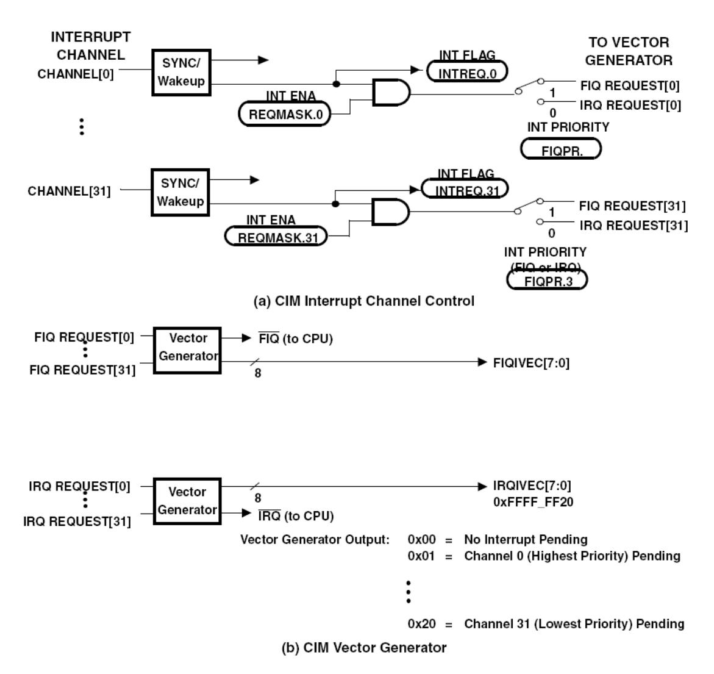

**Figure 16-3.**

<span id="page-504-1"></span>The CIM can support 32 interrupt request lines (channel [0] to channel [31]) from the peripherals. These peripheral interrupt requests are hardwired to each of the CIM 32 channels. The CIM combines the 32 channels into two outputs – an FIQ request to the CPU and an IRQ request to the CPU. The CIM performs the following functions:

- Manages the input channels
- Prioritizes the interrupt requests to the CPU

# <span id="page-504-0"></span>*16.4.4 CIM Input Channel Management*

On the input side, the CIM enables channels on a channel-by-channel basis (in the REQMASK register); unused channels may be masked to prevent spurious interrupts. Each interrupt channel can be designated to send either an FIQ or IRQ request to the CPU (in the FIQPR register).

Interrupt Mask Register REQMASK and FIQ/IRQ Program Control Register FIRQPR are writeable in privilege mode only. A write in user mode to these Registers causes a peripheral illegal access exception. One way of setting the CPU in privilege mode is through software interrupt. A software interrupt is a synchronous exception generated by the execution of a particular instruction. A C application can invoke a software interrupt by associating a software interrupt number with a function name through use of the SWI\_ALIAS pragma and then calling the software interrupt as if it were a function. A C code example of using software interrupt is shown below:


```
#pragma SWI_ALIAS (write_firqpr, 8)
void write_firqpr(unsigned long value);
#pragma SWI_ALIAS (write_reqmask, 9)
void write_reqmask(unsigned long value);
#pragma INTERRUPT(software_interrupt,SWI)
void software_interrupt(Uint32 arg1, Uint32 arg2, Uint32 arg3, Uint8 swi_number)
{
    //make sure interrupts are disabled
        asm(" MRS r3, cpsr "); // get psr
        asm(" ORR r3, r3, #0xc0 "); // set interrupt disables
        asm(" MSR cpsr, r3"); // restore psr
        asm(" LDRB R3,[R14,#-1]"); // get swi number into R3 as fourth operand
        switch (swi_number) // handle flash write/erase and ROM backdoor first
        {
            ...
            case 8: //write to fiq/irq program_control_register
                CimRegs.FIRQPR.all = arg1;
                return;
            case 9: //write to fiq/irq program_control_register
                CimRegs.REQMASK.all = arg1;
                return;
            ...
            default:
                 break;
        }
}
```

The INTERRUPT pragma enables handling interrupts directly with C code. This pragma specifies that the function to which it is applied is an interrupt. The type of interrupt is specified by the pragma. The software interrupt will change the CPU to privilege mode. The SWI\_ALIAS pragma tells the function write\_friqpr() and write\_reqmask() are software interrupts. Calls to these functions are compiled as software interrupts. A C code example of calling these functions is shown below.

```
write_firqpr(0x0C000000); //make them all irqs except dpwm4 and dpwm3.
write_reqmask(0x0C010000); //enable only pwm1cmp, dpwm3 and dpwm4
```

# <span id="page-505-0"></span>*16.4.5 CIM Prioritization*

The CIM prioritizes the received interrupts based upon a hardware and software prioritization scheme. The software prioritization scheme is user configurable. The CIM can send two interrupt requests to the CPU simultaneously—one IRQ and one FIQ. If both interrupt types are enabled at the CPU, then the FIQ has greater priority and is handled first. The hardware prioritization scheme sends the highest numbered active channel (in each FIQ and IRQ interrupt request) to the CPU. Within the FIQ and IRQ classes of interrupts, the highest channel has the highest priority interrupt. The CIM sends the highest priority interrupt of both the IRQ and FIQ classes of interrupt requests to the CPU.

### <span id="page-505-1"></span>*16.4.6 CIM Operation*

When the CPU recognizes an interrupt request and responds, the program counter jumps to the appropriate interrupt vector. The interrupt vector is typically a branch statement to an interrupt table. The interrupt table reads the pending interrupt from a vector offset register (FIQIVEC.7:0 for FIQ interrupts and IRQIVEC.7:0 for IRQ interrupts).

The following is an example of how such interrupt service routine needs to be written. In this example two analog comparator interrupts, one DPWM end of period interrupt and two digital fault input pins are all mapped toward the fast interrupt.


```
#pragma INTERRUPT(fast_interrupt,FIQ)
void fast_interrupt(void)
{
    register int32 fiq_number, interrupt_bits;
    volatile Uint32 read_scrap;
        fiq_number = CimRegs.FIQIVEC.all; // Clear on read
        if(fiq_number == 25) // Analog comparator interrupt and more
        {
            interrupt_bits = FaultMuxRegs.FAULTMUXINTSTAT.all; // Clear on read
            if(interrupt_bits & 8) //if Iout1 is high (ACOMP-3)
            {
                output_over_current_protection();
            }
            if(interrupt_bits & 4) //if vout1 is high (ACOMP-2)
            {
                output_over_voltage_protection();
            }
        }
        else if(fiq_number == 27) //DPWM3 interrupt
        {
            // To do
        }
        else if(fiq_number == 30) // Fault Pin Interrupt
        {
            if(interrupt_bits & 0x100) // If FAULT0
            {
                // To do
            }
            if(interrupt_bits & 0x200) // If FAULT1
            {
                // To do
            }
        }
    read_scrap = Dpwm3Regs.DPWMINT.bit.PRD;
}
```

Since multiple interrupt sources are mapped toward a single ISR (interrupt service routine), the first thing in the ISR should determine which source triggered the entrance to the current execution of ISR.

This can be done first by reading the CimRegs.FIQIVEC register. It is worth noting that the value of CimRegs.FIQIVEC is read just once and saved into the temporary variable fiq\_number. The program should follow this format and should not read the CimRegs.FIQIVEC repeatedly in the else if statements.

This is mostly because CimRegs.FIQIVEC is a clear on read register, therefore only the first read attempt per ISR of this register can be used to read intact and relevant values of all relevant bits.

The same is true about FaultMuxRegs.FAULTMUXINTSTAT, this is clear on read register as well. Therefore same technique should be used to read its value.

**NOTE:** In UCD3138 the interrupt flags need to be cleared by software and are not automatically cleared by hardware.

In some other microcontrollers and microprocessors in the market the interrupt flags are cleared automatically (by hardware) just before the ISR execution ends.

Since UCD3138 does not clear the interrupt flags automatically, this should be done by the ISR routine. Negligence to clear the relevant interrupt flag will cause immediate re-invocation of the ISR instantly after previous ISR execution ended. Therefore the controller (ARM7) will be busy with exaction of the ISR and will never have the chance to execute the background tasks such as PMBus communications in the main() routine.

Once again since multiple interrupt sources are mapped to a single ISR (interrupt service routine), the clearing of the relevant interrupt flag should be added to the related elseif() statement within the ISR.


# <span id="page-507-4"></span><span id="page-507-0"></span>*16.4.7 Register Map*

**Table 16-3.**

| Address     | Register Name | Description                      | Bits | Read | Write | Reset |
|-------------|---------------|----------------------------------|------|------|-------|-------|
| 0xFFFF FF20 | IRQIVEC       | IRQ Index Offset Vector Register | 8    | Yes  | No    | 8'h0  |
| 0xFFFF FF24 | FIQIVEC       | FIQ Index Offset Vector Register | 8    | Yes  | No    | 8'h0  |
| 0xFFFF FF28 |               | RESERVED                         |      |      |       |       |
| 0xFFFF FF2C | FIRQPR        | FIQ/IRQ Program Control Register | 32   | Yes  | Yes   | 32'h0 |
| 0xFFFF FF30 | INTREQ        | Pending Interrupt Read Location  | 32   | Yes  | Yes   | 32'h0 |
| 0xFFFF FF34 | REQMASK       | Interrupt Mask Register          | 32   | Yes  | Yes   | 32'h0 |

# <span id="page-507-1"></span>**16.5 SYS – System Module Registers Reference**

SYS Registers have the following attributes:

- 16-bit wide
- Addresses placed on word boundaries
- Byte, half-word and word writes permitted
- All Registers can be read in any mode of operation.
- Global Control Register is writeable in privilege mode only. All other Registers are writeable in any mode.

# <span id="page-507-2"></span>*16.5.1 Clock Control Register (CLKCNTL)*

Address FFFFFFD0

The clock control Register configures the MCLK divider for low power modes and the clock multiplexer which drives the Sync pin when configured to output the CLKOUT signal. CLKCNTRL is accessible in user and privilege mode and supports byte, half-word and word accesses. Any access to this Register takes two SYSCLK cycles.

**Figure 16-4. Clock Control Register (CLKCNTL)**

<span id="page-507-3"></span>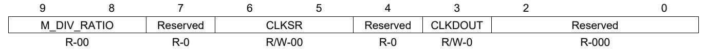

**Table 16-4. Clock Control Register (CLKCNTL) Register Field Descriptions**

<span id="page-507-5"></span>

| Bit | Field       | Type | Reset | Description                                                                                                                                                                                                                                                                                                                          |
|-----|-------------|------|-------|--------------------------------------------------------------------------------------------------------------------------------------------------------------------------------------------------------------------------------------------------------------------------------------------------------------------------------------|
| 9-8 | M_DIV_RATIO | R    | 00    | MCLK (Processor Clock) Divide Ratio<br>00 = MCLK frequency equals High Frequency Oscillator divided by 8 (Default)<br>01 = MCLK frequency equals High Frequency Oscillator divided by 16<br>10 = MCLK frequency equals High Frequency Oscillator divided by 32<br>11 = MCLK frequency equals High Frequency Oscillator divided by 64 |
| 7   | Reserved    | R    | 0     |                                                                                                                                                                                                                                                                                                                                      |
| 6-5 | CLKSR       | R/W  | 00    | These bits control the source/function of CLKOUT<br>00 = Driven by value in CLKDOUT (Bit 3) (Default)<br>01 = Driven by the interface clock (ICLK)<br>10 = Driven by the CPU clock (MCLK)<br>11 = Driven by the system clock (SYSCLK)                                                                                                |
| 4   | Reserved    | R    | 0     |                                                                                                                                                                                                                                                                                                                                      |


# **Table 16-4. Clock Control Register (CLKCNTL) Register Field Descriptions (continued)**

| Bit | Field    | Type | Reset | Description                                                                                                                                                 |
|-----|----------|------|-------|-------------------------------------------------------------------------------------------------------------------------------------------------------------|
| 3   | CLKDOUT  | R/W  | 0     | This pin represents the output value of CLKOUT<br>0 = CLKOUT driven to logic low in output mode (Default)<br>1 = CLKOUT driven to logic high in output mode |
| 2-0 | Reserved | R    | 000   |                                                                                                                                                             |


# <span id="page-509-0"></span>*16.5.2 System Exception Control Register (SYSECR)*

Address FFFFFFE0

The system exception control Register contains bits that allow the user to generate a software reset. The OVR bits disable some reset/abort conditions when TRST is high.

**Figure 16-5. System Exception Control Register (SYSECR)**

<span id="page-509-1"></span>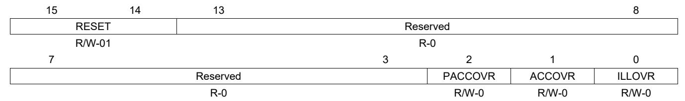

**Table 16-5. System Exception Control Register (SYSECR) Register Field Descriptions**

<span id="page-509-2"></span>

| Bit   | Field    | Type | Reset | Description                                                                                                                                                             |  |
|-------|----------|------|-------|-------------------------------------------------------------------------------------------------------------------------------------------------------------------------|--|
| 15-14 | RESET    | R/W  | 01    | Software Reset Enable. These bits always read as 01<br>01 = No reset<br>1X = Global system reset (X = don't care)<br>X0 = Global system reset (X = don't care)          |  |
| 13-3  | Reserved | R    | 0     |                                                                                                                                                                         |  |
| 2     | PACCOVR  | R/W  | 0     | Peripheral Access Violation Override<br>0 = Peripheral access violation error causes a reset or abort (Default)<br>1 = No action taken on a peripheral access violation |  |
| 1     | ACCOVR   | R/W  | 0     | Memory Access Reset Override<br>0 = Memory access violation error causes a reset or abort (Default)<br><br>1 = No action taken on an illegal address                    |  |
| 0     | ILLOVR   | R/W  | 0     | Illegal Address Reset Override<br>0 = Illegal address causes a reset or abort (Default)<br>1 = No action taken on an illegal address                                    |  |


# <span id="page-510-0"></span>*16.5.3 System Exception Status Register (SYSESR)*

### Address FFFFFFE4

The System Exception Status Register contains flags for different reset/abort sources. On power-up, all bits are cleared to 0. When a reset condition is recognized, the appropriate bit in the Register is set and the value of the bit is maintained through the reset. When a new reset condition occurs, the current contents of this Register are not cleared. The contents of this Register are cleared on a power-on reset or by software.

**Figure 16-6. System Exception Status Register (SYSESR)**

<span id="page-510-2"></span>

| 15     | 14         | 13    | 12      | 11     | 10     | 9       | 8      |  |
|--------|------------|-------|---------|--------|--------|---------|--------|--|
| PORRST | CLKRST     | WDRST | ILLMODE | ILLADR | ILLACC | PILLACC | ILLMAP |  |
| R/W-0  | R/W-0      | R/W-0 | R/W-0   | R/W-0  | R/W-0  | R/W-0   | R/W-0  |  |
| 7      | 6          |       |         |        |        |         | 0      |  |
| SWRST  | Reserved   |       |         |        |        |         |        |  |
| R/W-0  | R-000 0000 |       |         |        |        |         |        |  |

**Table 16-6. System Exception Status Register (SYSESR) Register Field Descriptions**

<span id="page-510-1"></span>

| Bit<br>Field |         | Type<br>Reset |   | Description                                                                                                                                                                                          |  |  |
|--------------|---------|---------------|---|------------------------------------------------------------------------------------------------------------------------------------------------------------------------------------------------------|--|--|
| 15           | PORRST  | R/W           | 0 | Power-On reset flag. Set when power-on reset is asserted. Reset is asserted as long<br>as power-on-reset is active. Whenever a device is powered, this bit is set.                                   |  |  |
|              |         |               |   | User and privilege modes (read                                                                                                                                                                       |  |  |
|              |         |               |   | 0 = Power-up reset has not occurred since the last clear                                                                                                                                             |  |  |
|              |         |               |   | 1 = Power-up reset has occurred since the last clear                                                                                                                                                 |  |  |
|              |         |               |   | User and privilege modes (write)                                                                                                                                                                     |  |  |
|              |         |               |   | 0 = Clears the corresponding bit to 0                                                                                                                                                                |  |  |
|              |         |               |   | 1 = No effect                                                                                                                                                                                        |  |  |
| 14           | CLKRST  | R/W           | 0 | This bit represents the clock fail flag. This bit indicates a clock fault condition has<br>occurred. After power-on-reset, the CLKRST is reset to 0. Value remains unchanged<br>during other resets. |  |  |
|              |         |               |   | User and privilege modes (read)                                                                                                                                                                      |  |  |
|              |         |               |   | 0 = Clock failure has not occurred since the last clear                                                                                                                                              |  |  |
|              |         |               |   | 1 = Clock failure has occurred since the last clear                                                                                                                                                  |  |  |
|              |         |               |   | User and privilege modes (write)                                                                                                                                                                     |  |  |
|              |         |               |   | 0 = Clears the corresponding bit to 0 1 = No effect                                                                                                                                                  |  |  |
| 13           | WDRST   | R/W           | 0 | This bit represents the watchdog reset flag. This bit indicates that the last reset was<br>caused by the watchdog.                                                                                   |  |  |
|              |         |               |   | User and privilege modes (read                                                                                                                                                                       |  |  |
|              |         |               |   | 0 = Watchdog reset has not occurred since the last clear                                                                                                                                             |  |  |
|              |         |               |   | 1 = Watchdog reset has occurred since the last clear                                                                                                                                                 |  |  |
|              |         |               |   | User and privilege modes (write)                                                                                                                                                                     |  |  |
|              |         |               |   | 0 = Clears the corresponding bit to 0 1 = No effect                                                                                                                                                  |  |  |
| 12           | ILLMODE | R/W           | 0 | This bit represents the illegal mode flag. This bit is set when the mode bits in the<br>program status Register are set to an illegal value.                                                         |  |  |
|              |         |               |   | User and privilege modes (read)                                                                                                                                                                      |  |  |
|              |         |               |   | 0 = Illegal mode has not occurred since the last clear                                                                                                                                               |  |  |
|              |         |               |   | 1 = Illegal mode has occurred since the last clear                                                                                                                                                   |  |  |
|              |         |               |   | User and privilege modes (write)                                                                                                                                                                     |  |  |
|              |         |               |   | 0 = Clears the corresponding bit to 0                                                                                                                                                                |  |  |
|              |         |               |   | 1 = No effect                                                                                                                                                                                        |  |  |


# **Table 16-6. System Exception Status Register (SYSESR) Register Field Descriptions (continued)**

| Bit | Field    | Type | Reset    | Description                                                                                                                                                                                                                                                                                                                                                                                                                                                        |
|-----|----------|------|----------|--------------------------------------------------------------------------------------------------------------------------------------------------------------------------------------------------------------------------------------------------------------------------------------------------------------------------------------------------------------------------------------------------------------------------------------------------------------------|
| 11  | ILLADR   | R/W  | 0        | This bit represents the illegal address access flag. This bit is set when an access to<br>an unimplemented location in the memory map is detected in non-user mode.<br>User and privilege modes (read)<br>0 = Illegal address has not occurred since the last clear<br>1 = Illegal address has occurred since the last clear<br>User and privilege modes (write)<br>0 = Clears the corresponding bit to 0<br>1 = No effect                                         |
| 10  | ILLACC   | R/W  | 0        | This bit represents the illegal memory access flag. This bit is set when an access to<br>a protected location without permission rights is detected in non-user mode.<br>User and privilege modes (read)<br>0 = Illegal memory access has not occurred since the last clear<br>1 = Illegal memory access has occurred since the last clear<br>User and privilege modes (write)<br>0 = Clears the corresponding bit to 0<br>1 = No effect                           |
| 9   | PILLACC  | R/W  | 0        | This bit represents the peripheral illegal access flag. This bit is set when a peripheral<br>access violation is detected in user mode.<br>User and privilege modes (read)<br>0 = Illegal peripheral access has not occurred since the last clear<br>1 = Illegal peripheral access has occurred since the last clear<br>User and privilege modes (write)<br>0 = Clears the corresponding bit to 0<br>1 = No effect                                                 |
| 8   | ILLMAP   | R/W  | 0        | This bit represents the illegal address map flag. This bit is set when the base<br>addresses of one or more memories overlap. Reset occurs when the overlapped<br>registration is accessed.<br>User and privilege modes (read)<br>0 = Illegal address mapping has not occurred since the last clear<br>1 = Illegal address mapping has occurred since the last clear<br>User and privilege modes (write)<br>0 = Clears the corresponding bit to 0<br>1 = No effect |
| 7   | SWRST    | R/W  | 0        | This bit represents the software reset flag. This bit is set when the last reset is<br>caused by software writing the RESET bits.<br>User and privilege modes (read)<br>0 = Software reset has not occurred since the last clear<br>1 = Software reset has occurred since the last clear<br>User and privilege modes (write)<br>0 = Clears the corresponding bit to 0<br>1 = No effect                                                                             |
| 6-0 | Reserved | R    | 000 0000 |                                                                                                                                                                                                                                                                                                                                                                                                                                                                    |


# <span id="page-512-1"></span>*16.5.4 Abort Exception Status Register (ABRTESR)*

Address FFFFFFE8

The Abort Exception Status Register shows the abort cause.

#### **Figure 16-7. Abort Exception Status Register (ABRTESR)**

<span id="page-512-2"></span>

| 15       | 14     | 13      | 12 |                    | 8 |  |  |  |
|----------|--------|---------|----|--------------------|---|--|--|--|
| ADRABT   | MEMABT | PACCVIO |    | Reserved           |   |  |  |  |
| R/W-0    | R/W-0  | R/W-0   |    | R-0 0000 0000 0000 |   |  |  |  |
| 7        |        |         |    |                    | 0 |  |  |  |
| Reserved |        |         |    |                    |   |  |  |  |

R-0 0000 0000 0000

LEGEND: R/W = Read/Write; R = Read only; -*n* = value after reset

### **Table 16-7. Abort Exception Status Register (ABRTESR) Register Field Descriptions**

<span id="page-512-0"></span>

| Bit  | Field    | Type | Reset                  | Description                                                                                                                                                                                                                                                                                                                                                                                                                                                   |
|------|----------|------|------------------------|---------------------------------------------------------------------------------------------------------------------------------------------------------------------------------------------------------------------------------------------------------------------------------------------------------------------------------------------------------------------------------------------------------------------------------------------------------------|
| 15   | ADRABT   | R/W  | 0                      | is bit represents the illegal address abort. An illegal address access was detected in<br>user mode. An abort was generated due to an illegal address access from either the<br>MPU or system<br>User and privilege modes (read)<br>0 = No illegal address<br>1 = Abort caused by an illegal address<br>User and privilege modes (write)<br>0 = Clears bit to 0                                                                                               |
|      |          |      |                        | 1 = No effect                                                                                                                                                                                                                                                                                                                                                                                                                                                 |
| 14   | MEMABT   | R/W  | 0                      | This bit represents the memory access abort. This bit indicates an illegal memory<br>access was detected in user mode. An abort was generated due to the illegal<br>memory access from either the MPU or system.<br>User and privilege modes (read)<br>0 = No illegal memory access<br>1 = Abort caused by an illegal memory access<br>User and privilege modes (write)<br>0 = Clears bit to 0<br>1 = No effect                                               |
| 13   | PACCVIO  | R/W  | 0                      | This bit represents the peripheral access violation error. This bit indicates a<br>peripheral access violation error was detected during a peripheral Register access in<br>user mode. An abort was generated due to a peripheral access violation.<br>User and privilege modes (read)<br>0 = No peripheral access violation<br>1 = Abort caused by a peripheral access violation<br>User and privilege modes (write)<br>0 = Clears bit to 0<br>1 = No effect |
| 12-0 | Reserved | R    | 0 0000<br>0000<br>0000 |                                                                                                                                                                                                                                                                                                                                                                                                                                                               |


### <span id="page-513-0"></span>*16.5.5 Global Status Register (GLBSTAT)*

#### Address FFFFFFEC

The Global Status Register specifies the module that triggered the illegal address, illegal access, abort or reset. When a new reset condition reset occurs, the current contents of this Register are not cleared. The contents of this Register are cleared on a power-on reset or by software.

#### **Figure 16-8. Global Status Register (GLBSTAT)**

<span id="page-513-1"></span>

| 7       | 6      | 5       | 4      | 3 |          | 0 |
|---------|--------|---------|--------|---|----------|---|
| SYSADDR | SYSACC | MPUADDR | MPUACC |   | Reserved |   |
| R/W-0   | R/W-0  | R/W-0   | R/W-0  |   | R-0000   |   |

LEGEND: R/W = Read/Write; R = Read only; -*n* = value after reset

### **Table 16-8. Global Status Register (GLBSTAT) Register Field Descriptions**

<span id="page-513-2"></span>

| Bit | Field    | Type | Reset | Description                                                                                                                                                                                                                                                                                                                         |
|-----|----------|------|-------|-------------------------------------------------------------------------------------------------------------------------------------------------------------------------------------------------------------------------------------------------------------------------------------------------------------------------------------|
| 7   | SYSADDR  | R/W  | 0     | This bit represents the system illegal address flag. This bit is set when the system<br>detects an illegal address.<br>User and privilege modes (read)<br>0 = No system illegal address<br>1 = Abort or reset caused by a system illegal address User and privilege modes<br>(write)<br>0 = Clears bit to 0<br>1 = No effect        |
| 6   | SYSACC   | R/W  | 0     | This bit represents the system illegal access flag. This bit is set when the system<br>detects an illegal access.<br>User and privilege modes (read)<br>0 = No system illegal access<br>1 = Abort or reset caused by a system illegal access<br>User and privilege modes (write)<br>0 = Clears bit to 0<br>1 = No effect            |
| 5   | MPUADDR  | R/W  | 0     | This bit represents the MPU illegal address flag. This bit is set when the memory<br>protection unit detects an illegal address.<br>User and privilege modes (read)<br>0 = No MPU illegal address<br>1 = Abort or reset caused by a MPU illegal address<br>User and privilege modes (write)<br>0 = Clears bit to 0<br>1 = No effect |
| 4   | MPUACC   | R/W  | 0     | This bit represents the MPU illegal access flag. This bit is set when the MPU detects<br>an illegal access.<br>User and privilege modes (read)<br>0 = No MPU illegal access<br>1 = Abort or reset caused by a MPU illegal access<br>User and privilege modes (write)<br>0 = Clears bit to 0<br>1 = No effect                        |
| 3-0 | Reserved | R    | 0000  |                                                                                                                                                                                                                                                                                                                                     |


# <span id="page-514-0"></span>*16.5.6 Device Identification Register (DEV)*

Address FFFFFFF0

The Device Identification Register contains device specification information that is hard coded during device manufacturing. This register is read-only.

**Figure 16-9. Device Identification Register (DEV)**

<span id="page-514-1"></span>15 0 DEV

R-0011 0100 0111 1111

LEGEND: R/W = Read/Write; R = Read only; -*n* = value after reset

### **Table 16-9. Device Identification Register (DEV) Register Field Descriptions**

<span id="page-514-2"></span>

| Bit  | Field | Type | Reset                        | Description                                          |
|------|-------|------|------------------------------|------------------------------------------------------|
| 15-0 | DEV   | R    | 0011<br>0100<br>0111<br>1111 | These bits represent the device identification code. |


#### <span id="page-515-0"></span>*16.5.7 System Software Interrupt Flag Register (SSIF)*

Address FFFFFFF8

The System Software Interrupt Flag Register is set when a software interrupt is triggered. The flag allows the user to poll for a software interrupt.

**Figure 16-10. System Software Interrupt Flag Register (SSIF)**

0

<span id="page-515-1"></span>

LEGEND: R/W = Read/Write; R = Read only; -*n* = value after reset

### **Table 16-10. System Software Interrupt Flag Register (SSIF) Register Field Descriptions**

<span id="page-515-2"></span>

| Bit | Field   | Type | Reset | Description                                                                                                                                                                                         |
|-----|---------|------|-------|-----------------------------------------------------------------------------------------------------------------------------------------------------------------------------------------------------|
| 0   | SSIFLAG | R/W  | 0     | This bit represents the system software interrupt flag. This bit is set when a correct<br>SSKEY is written to the System Software Interrupt Flag Register. This bit is cleared<br>only by software. |


# <span id="page-516-0"></span>*16.5.8 System Software Interrupt Request Register (SSIR)*

Address FFFFFFFC

The System Software Interrupt Request Register contains a key sequence that triggers a software interrupt request to the CIM. Also, the Register contains an 8-bit data field.

**Figure 16-11. System Software Interrupt Request Register (SSIR)**

<span id="page-516-2"></span>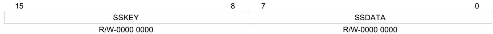

LEGEND: R/W = Read/Write; R = Read only; -*n* = value after reset

### **Table 16-11. System Software Interrupt Request Register (SSIR) Register Field Descriptions**

<span id="page-516-3"></span>

| Bit  | Field  | Type | Reset        | Description                                                                                                                                                                                                                                        |
|------|--------|------|--------------|----------------------------------------------------------------------------------------------------------------------------------------------------------------------------------------------------------------------------------------------------|
| 15-8 | SSKEY  | R/W  | 0000<br>0000 | These bits represent the system software interrupt request key. These write-only bits<br>are executable in both user and privilege modes. A 0x75 written to these bits initiates<br>IRQ/FIQ interrupts. Data in this field is always read as zero. |
| 7-0  | SSDATA | R/W  | 0000<br>0000 | These bits represent the system software interrupt data. The SSDATA bits provide<br>an 8-bit field that can be used for passing messages into the system software<br>interrupt.                                                                    |

# <span id="page-516-1"></span>*16.5.9 References*

- 1. UCD3138 Digital Power Peripherals Programmer's Manual [\(SLUU995\)](http://www.ti.com/lit/pdf/SLUU995)
- 2. UCD3138 ARM and Digital System Programmer's Manual ([SLUU994](http://www.ti.com/lit/pdf/SLUU994))
- 3. UCD3138 Device Datasheet [\(SLUSAP2](http://www.ti.com/lit/pdf/SLUSAP2))

<span id="page-517-0"></span>

# *Flash Memory Programming, Integrity, and Security*

The UCD3138 offers flash security and a ROM based PMBus bootstrap program for flash programming and program debugging.

It offers the choice between startup into the bootstrap program and startup into the customer program.

This section shows how to make best use of these features. It describes how to enable flash security only when desired, and how to make "back doors" to permit reprogramming of devices with flash security enabled.

This section starts with a quick start summary which gives a recipe for best practices for firmware development and for production.

Next, it provides a detailed view of the UCD3138 Flash programming hardware and Boot ROM as a starting point. Finally, it goes into detail with code examples for the exact procedures for Flash management for firmware development and for production.

[Chapter](#page-495-0) 16 goes into more detail on the mechanics of programming Flash while also executing from Flash. [Chapter](#page-436-0) 13 describes programming Flash using the PMBus and the Boot ROM.

**Topic** ........................................................................................................................... **Page**

| 17.1 | Quick Start Summary                       | 519 |
|------|-------------------------------------------|-----|
| 17.2 | Flash Memory Operations                   | 519 |
| 17.3 | Flash Management for Firmware Development | 521 |
| 17.4 | Flash Management in Production            | 522 |
| 17.5 | Firmware Examples                         | 523 |


[www.ti.com](http://www.ti.com) *Quick Start Summary*

# <span id="page-518-1"></span>**17.1 Quick Start Summary**

This section is a quick summary of the issues and solutions in Flash security. More detailed explanations are available in the sections which follow.

# <span id="page-518-0"></span>*17.1.1 ROM Bootstrap and Program Flash Checksum*

When the UCD3138 is reset or powered up, control goes first to the ROM bootstrap program. The ROM bootstrap initializes the device and then performs a checksum on the Program Flash. If the checksum matches, the ROM turns control over to the customer supplied program in the Program Flash.

If the checksum does not match, control stays in the ROM, and the flash can be reprogrammed.

# <span id="page-518-2"></span>*17.1.2 Firmware Development Setup*

The best firmware development setup is to **never program the checksum into the program flash.**

The disadvantage of this approach is that it requires the use of a PMBus interface every time the UCD3138 is reset. The program won't start on its own, so the start has to be commanded through the PMBus interface.

The second best setup permits auto startup. It is:

- 1. Have an I/O line based backdoor as the first element in the main program.
- 2. Have an additional backdoor from whatever communication port is in use (PMBus, or serial typically)
- 3. Only program the checksum into a new program version after the backdoors have been tested and verified.

PMBus backdoors are convenient, but unreliable. One bug can kill the PMBus function and the backdoor. A simple backdoor at the very beginning of the program is much more reliable.

# <span id="page-518-3"></span>*17.1.3 Production Setup*

The best production setup is:

- 1. Have a well-tested, secure backdoor which erases program flash. It can be communications port based only, if desired.
- 2. Don't program the program flash checksum until all other flash is programmed, including calibration and manufacturing data.

The next sections cover these issues in much more detail.

# <span id="page-518-4"></span>**17.2 Flash Memory Operations**

# <span id="page-518-5"></span>*17.2.1 UCD3138 Memory Maps*

The UCD3138 has only one memory bus used for both program and data.

Memories are called "Program" Flash" and "Data" Flash, but all memories can be used for both.

The names just show the main use for each memory.

After reset, the UCD3138 starts executing in ROM. In this mode, the ROM is mapped to fill up the entire first 64 Kbytes of memory. The 4 Kbytes of ROM are repeated 16 times.

Here is the memory map for ROM mode:

```
0x00000 => 0x0FFFF => Boot ROM - 4 Kbytes, repeated 16 times.
0x10000 => 0x17FFF => Program Flash - 32 Kbytes
0x18800 => 0x18FFF => Data Flash - 2 Kbytes
0x19000 => 0x19FFF => Data RAM - 4 Kbytes
```

If the ROM finds a valid checksum for the Program Flash, or if a PMBus command is sent telling the ROM to transfer control to the flash, the memory map is changed a little bit.


### Here is the memory map during normal operation:

```
0x00000 => 0x07FFF => Program Flash - 32 Kbytes
0x0A000 => 0x0AFFF => Boot ROM - 4 Kbytes
0x18800 => 0x18FFF => Data Flash - 2 Kbytes
0x19000 => 0x19FFF => Data RAM - 4 Kbytes
```

In ROM mode, the reset and interrupt vectors are in the ROM. In normal operation, the reset and interrupt vectors are in the Program Flash.

The two flash memories, "Program" and "Data", are programmed separately. Each has its own programming logic. When a Flash memory is being programmed, it cannot be read.

Flash memories can be programmed word by word, but must be erased a block at the time. The Data Flash has 64 small blocks containing only 32 bytes each. This makes it ideal for storing small blocks of data which need to be changed frequently.

The Program Flash has only 32 blocks, and each one contains 1KB.

For more information on memory maps for all family members, see [Chapter](#page-464-0) 15, Memory.

# <span id="page-519-0"></span>*17.2.2 Flash Programming in ROM Mode*

In ROM mode, the flash is programmed via PMBus commands. The ROM offers several PMBus commands for memory examine and modify, and for controlling program execution. For a complete description, see the UCD3138 Boot ROM Reference Manual.

Normally the PMBus commands are issued by the TI supplied GUI running on a PC (FUSION\_DIGITAL\_POWER\_DESIGNER), or by a third party Flash programmer, so the process is invisible to the user.

First the Flash is erased using either one Mass Erase command or many Page Erase commands. Erasing the Flash sets all the bits in the Flash to 1. Next the Flash is written to using Write Block commands. Then the Flash contents can be verified using Read Block commands. Finally an Execute Program command is used to start the Flash program.

# <span id="page-519-1"></span>*17.2.3 Clearing the Flash*

The UCD3138 can erase its own program flash, either in pages or as a single block. A block erase is best used for flash security for production code. In this way, even if the backdoor is activated, the flash security is still maintained.

It is also possible to write all zeroes to the checksum and clear it. That way, the next time the UCD3138 is reset, it will power up into ROM mode and the memory can be examined. This is best for development, so that the memory contents can be analyzed if necessary.

Any changes to program flash must be made while executing in other memories – ROM, RAM, or Data Flash. It is possible to corrupt Data flash without affecting the Program Flash checksum, so it is unwise to put the flash modification program into Data Flash.

It is best to put it into Program Flash and copy it into RAM. In this way, if the program image is corrupted, the checksum will be incorrect, and the device will automatically enter ROM mode on reset. The reference firmware in most UCD3138 EVM will use the copy into RAM method.

#### <span id="page-519-2"></span>*17.2.4 3138 Family Members with Multiple Flash Blocks*

Several 3138 family members have multiple flash blocks. This doesn't change the basic programming code, but it increases flexibility. It is not necessary to execute from RAM or Data Flash when erasing or writing to program flash. It can also be done while executing from any other flash block than the one being changed. It is not possible to write or erase two blocks at the same time however.


### <span id="page-520-0"></span>**17.3 Flash Management for Firmware Development**

During the development phase, the main goal is to avoid activating flash security.

There are several ways to do this, depending on the situation.

# <span id="page-520-1"></span>*17.3.1 Best Practice for Firmware Development*

The best practice for firmware development is very simple.

• Never make the program flash checksum correct.

The disadvantages of this method are:

- 1. The device must always be connected to the PMBus and told to start executing
- 2. Anyone with the proper tools can read the flash there is no security.

# <span id="page-520-2"></span>*17.3.2 Firmware Development with "Backdoors"*

Sometimes there are situations where development level firmware is required to start automatically with no PMBus interface command to start it. In this case, the program flash checksum must be programmed.

There may also be cases where flash security is desired for firmware under development. Again, the checksum must be programmed, preventing the device from going to ROM mode.

In this case, if reprogramming is desired, some kind of backdoor must be provided to clear the checksum. There are several backdoor techniques described below. Any one of them is adequate if used properly. For a robust and easy to use solution, however, the use of 2 or more backdoors is strongly suggested.

The techniques are:

- I/O line based backdoors
- Communications port based backdoors

# <span id="page-520-3"></span>*17.3.3 I/O Line Based Backdoors*

This backdoor can provide security, if done properly. It starts with the firmware checking an I/O line at startup – before the rest of the system is initialized – and branching to the backdoor if the I/O line is in the proper state.

The big advantage of the I/O line based backdoor is that firmware changes are unlikely to make it stop working. Since it is at the very beginning of the code, changes later in the code should not affect it.

The simplest way involves just branching straight to the code that clears the flash. In this case, the code can erase the entire flash, preventing others from being able to read it. There are several ways to do this:

#### **17.3.3.1 Serial Port Based Backdoor**

The serial port backdoor is most useful if the serial port is being used for primary to secondary communication. The serial port (RX) pin can be programmed as an input and its state read. If the line is high, the serial port is in its normal state. If it is low, then the flash should be cleared. It may be necessary to put in a pull up resistor if chip transmitting is absent or powered down. It is also necessary to ensure that the other chip will not transmit data when the UCD3138 is coming out of reset. If this is done, the UART RX pin can be used as a backdoor, and as an RX pin. This mode is used in the UCD3138 introductory lab training programs.

#### Advantages

- 1. Doesn't waste an I/O line
- 2. Can be triggered by other chip via serial port

#### Disadvantages

- 1. Pull up may be needed
- 2. Other chip must avoid transmitting at sampling time (just after reset)


### **17.3.3.2 GPIO Line Based Backdoor**

Using a general purpose I/O line is simpler, as the line can be dedicated to this function, but it does require a free line available. It will also require a pull up or down and a test point to override the pull up or pull down.

However, it is often useful to have a free I/O line available for development. It is very useful for instrumenting code. It can be used to indicate internal events to monitor timing and trigger oscilloscopes. Since the line is only checked at reset for the backdoor, it can then be used for other functions once the program is started.

### **17.3.3.3 Other Options for I/O Backdoors**

There are many other creative options for backdoors if I/O lines are very constrained. An ADC input can be set to an out of normal range value. As suggested above, an I/O line can perform a backdoor function at the beginning of the code and some other function after startup.

# <span id="page-521-0"></span>*17.3.4 Communications Backdoors*

Communications backdoors add a message to an existing communications port already used in the application. Typically this is the PMBus interface, but it could be any communications interface.

The standard TI firmware generally supports a simple communications backdoor with a PMBus D9 command used to clear the flash checksum. For added security, this could be changed so that it erases the flash instead. The command code could be changed. In addition, more bytes could be added to the command sequence, requiring a multi-byte checksum for flash changes.

The serial port could also be used in a similar way.

# Advantages:

- 1. Requires no additional I/O pins
- 2. Can support password security

#### Disadvantages:

1. If firmware locks up, the backdoor can also stop working

#### **17.3.4.1 Cautions for Using Communications Backdoors**

Since a firmware bug can lock up the communications backdoor very easily, always test the backdoor before setting the checksum up for auto startup. Every time the firmware is changed, retest the backdoor.

#### <span id="page-521-1"></span>**17.4 Flash Management in Production**

In production, the goals are different. A secure backdoor is desired, but it must also be reliable. Firmware bugs which prevent backdoor access are less of a concern. All of the firmware, including the backdoor should be well tested before release to production.

The best firmware backdoor is a communications channel based backdoor with a long password, as described above. It could even be a sequence of multiple commands, if desired.


[www.ti.com](http://www.ti.com) *Firmware Examples*

### <span id="page-522-0"></span>**17.5 Firmware Examples**

This section shows short examples of checksum clearing and flash erasing.

# <span id="page-522-1"></span>*17.5.1 Checksum Clearing*

This first code typically goes into the software interrupt, as it must be used in system mode, not in user mode. This code copies the actual checksum clearing program into RAM.

```
case 12: // clear integrity word.
   {
       {
           register Uint32 * program_index = (Uint32 *) 0x19000; //store destination address for
                                                               //program
           register Uint32 * source_index = (Uint32 *)zero_out_integrity_word; //Set source
                                                                            //address of
                                                                            //PFLASH;
           register Uint32 counter;
           for(counter=0; counter < 500; counter++) //Copy program from PFLASH to RAM
           {
               *(program_index++)=*(source_index++);
           }
       }
       {
           register FUNC_PTR func_ptr;
           func_ptr=(FUNC_PTR)0x19000; //Set function to 0x19000
           func_ptr();
           func_ptr=(FUNC_PTR)0x70000; //Set function to illegal location
           func_ptr(); //force reset
       } //execute erase checksum
       return;
   }
```

This is the code for actually clearing the checksum which is copied into RAM:

```
void zero_out_integrity_word(void)
{
   DecRegs.FLASHILOCK.all = 0x42DC157E; //Write key to Program Flash
                                                        //Interlock Register
   DecRegs.MFBALR1.all = MFBALRX_BYTE0_BLOCK_SIZE_32K; //enable program flash write
   program_flash_integrity_word = 0;
   DecRegs.MFBALR1.all = MFBALRX_BYTE0_BLOCK_SIZE_32K + //expand program flash out to 4x real
                                                        //size
   MFBALRX_BYTE0_RONLY;
   while(DecRegs.PFLASHCTRL.bit.BUSY != 0)
   {
       ; //do nothing while it programs
   }
   return;
}
```


*Firmware Examples* [www.ti.com](http://www.ti.com)

# <span id="page-523-0"></span>*17.5.2 Erasing Flash*

The code for erasing flash is very similar, except instead of writing to the program flash word, it actually writes to the program flash control register and does a mass erase.

The C calling function is very similar. Only the labels for the code which is copied change.

Here is the code to clear the program flash:

```
void clear_program_flash(void)
{
    DecRegs.PFLASHCTRL.bit.MASS_ERASE = 1; //erase it all
    while(DecRegs.PFLASHCTRL.bit.BUSY != 0)
    {
        ; //do nothing while it programs
    }
    return;
}
```

# <span id="page-523-1"></span>*17.5.3 Serial Port Based Backdoor*

Here is the code for a back door based on the serial RX line, as used in the UCD3138 training labs:

```
void main()
{
    if(GioRegs.FAULTIN.bit.TMS_IN == 0) //emergency backdoor -
                                         //TMS is normally pulled up by external resistor
    {
        clear_integrity_word(); //if it's pulled down, clear checksum (integrity word)
    }
```

# <span id="page-523-2"></span>*17.5.4 I/O Line Based Back Door*

Here is code which actually uses 2 I/O lines, used in the LLC EVM:

```
void main()
{
    //Recommended setting
    MiscAnalogRegs.CLKTRIM.bit.HFO_LN_FILTER_EN = 0;
    //Turn on PMBus address pin current source ASAP to allow time to charge up.
    PMBusRegs.PMBCTRL3.bit.IBIAS_B_EN = 1;
    //Disable all DPWM outputs.
    global_disable();
    //Check to see if FAULT2 is pulled high and FAULT0 is pulled low.
    //If they are go to ROM.
    if (MiscAnalogRegs.GLBIOREAD.bit.FAULT2_IO_READ &&
        !MiscAnalogRegs.GLBIOREAD.bit.FAULT3_IO_READ)
    {
        rom_back_door();
    }
```

Notice that the code is placed very close to the start of the main function. Only time critical elements are placed before it. This code uses rom\_back\_door, which first disables all the DPWMs and then calls clear\_integrity\_word. In this case the function is the same as the previous example.

<span id="page-524-0"></span>

# *CIM – Central Interrupt Module Registers Reference*

#### CIM Registers have the following attributes:

- 32-bit width
- Addresses placed on word boundaries
- Byte, half-word and word writes permitted
- All Registers have read/write access in any mode
- Interrupt Mask and FIQ/IRQ Program Control Registers are writeable in privilege mode only. A write in user mode to these Registers causes a peripheral illegal access exception.

**Topic** ........................................................................................................................... **Page**

| 18.1 | IRQ Index Offset Vector Register (IRQIVEC)        | 526 |
|------|---------------------------------------------------|-----|
| 18.2 | FIQ Index Offset Vector Register (FIQIVEC)        | 527 |
| 18.3 | FIQ/IRQ Program Control Register (FIRQPR)         | 528 |
| 18.4 | Pending Interrupt Read Location Register (INTREQ) | 529 |
| 18.5 | Interrupt Mask Register (REQMASK)                 | 530 |
|      |                                                   |     |


# <span id="page-525-0"></span>**18.1 IRQ Index Offset Vector Register (IRQIVEC)**

Address FFFFFF20

### **Figure 18-1. IRQ Index Offset Vector Register (IRQIVEC)**

<span id="page-525-1"></span>7 0

IRQIVEC R-0

LEGEND: R/W = Read/Write; R = Read only; -*n* = value after reset

### **Table 18-1. IRQ Index Offset Vector Register (IRQIVEC) Register Field Descriptions**

<span id="page-525-2"></span>

| Bit | Field   | Type | Reset | Description                                                                                                                                                                                                           |
|-----|---------|------|-------|-----------------------------------------------------------------------------------------------------------------------------------------------------------------------------------------------------------------------|
| 7-0 | IRQIVEC | R    | 0     | Index of the IRQ Pending Interrupt (Cleared upon read)<br>0 = No interrupt pending<br>1 = Pending interrupt on Channel 0<br>2 = Pending interrupt on Channel 1<br>N = Pending interrupt on Channel N-1, where N <= 31 |


# <span id="page-526-1"></span>**18.2 FIQ Index Offset Vector Register (FIQIVEC)**

Address FFFFFF24

### **Figure 18-2. FIQ Index Offset Vector Register (FIQIVEC)**

7 0

<span id="page-526-2"></span>FIQIVEC R-0

LEGEND: R/W = Read/Write; R = Read only; -*n* = value after reset

### **Table 18-2. FIQ Index Offset Vector Register (FIQIVEC) Register Field Descriptions**

<span id="page-526-0"></span>

| Bit | Field   | Type | Reset | Description                                            |
|-----|---------|------|-------|--------------------------------------------------------|
| 7-0 | FIQIVEC | R    | 0     | Index of the FIQ pending interrupt (Cleared upon read) |
|     |         |      |       | 0 = No interrupt pending                               |
|     |         |      |       | 1 = Pending interrupt on Channel 0                     |
|     |         |      |       | 2 = Pending interrupt on Channel 1                     |
|     |         |      |       | N = Pending interrupt on Channel N-1, where N <= 31    |


# <span id="page-527-0"></span>**18.3 FIQ/IRQ Program Control Register (FIRQPR)**

Address FFFFFF2C

A 32-bit FIQ/IRQ program control Register (FIRQPR) determines whether a given interrupt request will be FIQ or IRQ type.

**Figure 18-3. FIQ/IRQ Program Control Register (FIRQPR)**

<span id="page-527-1"></span>31 0 FIRQPR

R/W-0000 0000 0000 0000 0000 0000 0000 0000

LEGEND: R/W = Read/Write; R = Read only; -*n* = value after reset

### **Table 18-3. FIQ/IRQ Program Control Register (FIRQPR) Register Field Descriptions**

<span id="page-527-2"></span>

| Bit  | Field  | Type | Reset                                                        | Description                                                                                                                                                                                                                                                                                |
|------|--------|------|--------------------------------------------------------------|--------------------------------------------------------------------------------------------------------------------------------------------------------------------------------------------------------------------------------------------------------------------------------------------|
| 31-0 | FIRQPR | R/W  | 0000<br>0000<br>0000<br>0000<br>0000<br>0000<br>0000<br>0000 | These bits determine whether an interrupt request from a peripheral is of type FIQ or<br>IRQ. Each bit corresponds to one request channel. This Register is writeable in<br>privilege mode only.<br>0 = Interrupt request is of IRQ type (Default)<br>1 = Interrupt request is of FIQ type |


# <span id="page-528-0"></span>**18.4 Pending Interrupt Read Location Register (INTREQ)**

Address FFFFFF30

### **Figure 18-4. Pending Interrupt Read Location Register (INTREQ)**

<span id="page-528-1"></span>31 0 INTREQ

R-0

**Table 18-4. Pending Interrupt Read Location Register (INTREQ) Register Field Descriptions**

<span id="page-528-2"></span>

| Bit  | Field  | Type | Reset | Description                   |
|------|--------|------|-------|-------------------------------|
| 31-0 | INTREQ | R    | 0     | Pending Interrupt Requests    |
|      |        |      |       | 0 = No interrupt has occurred |
|      |        |      |       | 1 = Interrupt is pending      |


# <span id="page-529-0"></span>**18.5 Interrupt Mask Register (REQMASK)**

Address FFFFFF34

### **Figure 18-5. Interrupt Mask Register (REQMASK)**

<span id="page-529-1"></span>31 0

REQMASK

R/W-0000 0000 0000 0000 0000 0000 0000 0000 LEGEND: R/W = Read/Write; R = Read only; -*n* = value after reset

### **Table 18-5. Interrupt Mask Register (REQMASK) Register Field Descriptions**

<span id="page-529-2"></span>

| Bit  | Field   | Type | Reset                                                        | Description                                                                                                                      |
|------|---------|------|--------------------------------------------------------------|----------------------------------------------------------------------------------------------------------------------------------|
| 31-0 | REQMASK | R/W  | 0000<br>0000<br>0000<br>0000<br>0000<br>0000<br>0000<br>0000 | Interrupt Request Mask Select<br>0 = Interrupt request channel is disabled (Default)<br>1 = Interrupt request channel is enabled |

#### **IMPORTANT NOTICE**

Texas Instruments Incorporated and its subsidiaries (TI) reserve the right to make corrections, enhancements, improvements and other changes to its semiconductor products and services per JESD46, latest issue, and to discontinue any product or service per JESD48, latest issue. Buyers should obtain the latest relevant information before placing orders and should verify that such information is current and complete. All semiconductor products (also referred to herein as "components") are sold subject to TI's terms and conditions of sale supplied at the time of order acknowledgment.

TI warrants performance of its components to the specifications applicable at the time of sale, in accordance with the warranty in TI's terms and conditions of sale of semiconductor products. Testing and other quality control techniques are used to the extent TI deems necessary to support this warranty. Except where mandated by applicable law, testing of all parameters of each component is not necessarily performed.

TI assumes no liability for applications assistance or the design of Buyers' products. Buyers are responsible for their products and applications using TI components. To minimize the risks associated with Buyers' products and applications, Buyers should provide adequate design and operating safeguards.

TI does not warrant or represent that any license, either express or implied, is granted under any patent right, copyright, mask work right, or other intellectual property right relating to any combination, machine, or process in which TI components or services are used. Information published by TI regarding third-party products or services does not constitute a license to use such products or services or a warranty or endorsement thereof. Use of such information may require a license from a third party under the patents or other intellectual property of the third party, or a license from TI under the patents or other intellectual property of TI.

Reproduction of significant portions of TI information in TI data books or data sheets is permissible only if reproduction is without alteration and is accompanied by all associated warranties, conditions, limitations, and notices. TI is not responsible or liable for such altered documentation. Information of third parties may be subject to additional restrictions.

Resale of TI components or services with statements different from or beyond the parameters stated by TI for that component or service voids all express and any implied warranties for the associated TI component or service and is an unfair and deceptive business practice. TI is not responsible or liable for any such statements.

Buyer acknowledges and agrees that it is solely responsible for compliance with all legal, regulatory and safety-related requirements concerning its products, and any use of TI components in its applications, notwithstanding any applications-related information or support that may be provided by TI. Buyer represents and agrees that it has all the necessary expertise to create and implement safeguards which anticipate dangerous consequences of failures, monitor failures and their consequences, lessen the likelihood of failures that might cause harm and take appropriate remedial actions. Buyer will fully indemnify TI and its representatives against any damages arising out of the use of any TI components in safety-critical applications.

In some cases, TI components may be promoted specifically to facilitate safety-related applications. With such components, TI's goal is to help enable customers to design and create their own end-product solutions that meet applicable functional safety standards and requirements. Nonetheless, such components are subject to these terms.

No TI components are authorized for use in FDA Class III (or similar life-critical medical equipment) unless authorized officers of the parties have executed a special agreement specifically governing such use.

Only those TI components which TI has specifically designated as military grade or "enhanced plastic" are designed and intended for use in military/aerospace applications or environments. Buyer acknowledges and agrees that any military or aerospace use of TI components which have *not* been so designated is solely at the Buyer's risk, and that Buyer is solely responsible for compliance with all legal and regulatory requirements in connection with such use.

TI has specifically designated certain components as meeting ISO/TS16949 requirements, mainly for automotive use. In any case of use of non-designated products, TI will not be responsible for any failure to meet ISO/TS16949.

#### **Products Applications**

Audio [www.ti.com/audio](http://www.ti.com/audio) Automotive and Transportation [www.ti.com/automotive](http://www.ti.com/automotive) Amplifiers [amplifier.ti.com](http://amplifier.ti.com) Communications and Telecom [www.ti.com/communications](http://www.ti.com/communications) Data Converters [dataconverter.ti.com](http://dataconverter.ti.com) Computers and Peripherals [www.ti.com/computers](http://www.ti.com/computers) DLP® Products [www.dlp.com](http://www.dlp.com) Consumer Electronics [www.ti.com/consumer-apps](http://www.ti.com/consumer-apps) DSP [dsp.ti.com](http://dsp.ti.com) Energy and Lighting [www.ti.com/energy](http://www.ti.com/energy) Clocks and Timers [www.ti.com/clocks](http://www.ti.com/clocks) Industrial [www.ti.com/industrial](http://www.ti.com/industrial) Interface [interface.ti.com](http://interface.ti.com) Medical [www.ti.com/medical](http://www.ti.com/medical) Logic [logic.ti.com](http://logic.ti.com) Security [www.ti.com/security](http://www.ti.com/security)

Power Mgmt [power.ti.com](http://power.ti.com) Space, Avionics and Defense [www.ti.com/space-avionics-defense](http://www.ti.com/space-avionics-defense)

Microcontrollers [microcontroller.ti.com](http://microcontroller.ti.com) Video and Imaging [www.ti.com/video](http://www.ti.com/video)

RFID [www.ti-rfid.com](http://www.ti-rfid.com)

OMAP Applications Processors [www.ti.com/omap](http://www.ti.com/omap) **TI E2E Community** [e2e.ti.com](http://e2e.ti.com)

Wireless Connectivity [www.ti.com/wirelessconnectivity](http://www.ti.com/wirelessconnectivity)